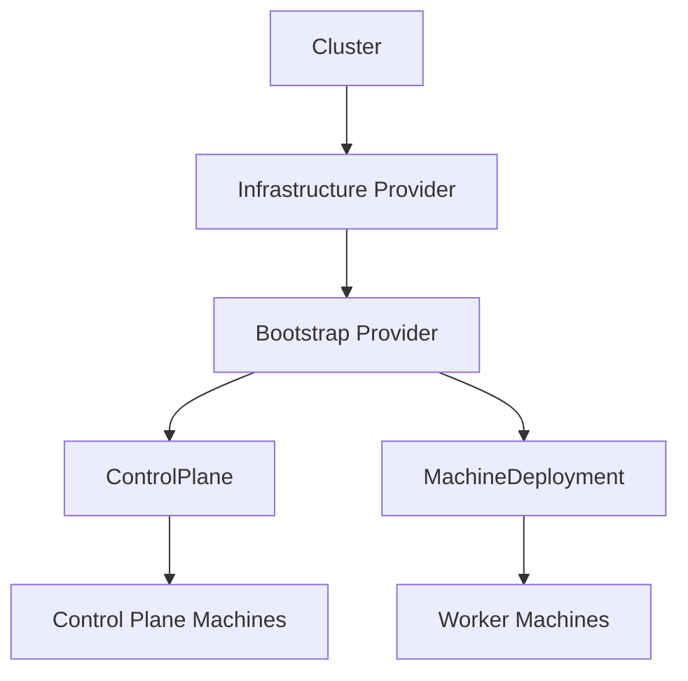

# cluster-api核心概念快速掌握
要快速掌握 **Cluster API (CAPI)** 的核心概念，可以把它理解为：**一个用 Kubernetes 自身的声明式 API 来管理 Kubernetes 集群生命周期的项目**。它把“集群”当成一种资源对象，像 Pod、Deployment 一样用 YAML 来定义和控制。  
## 📌 核心概念速览
### 1. **Cluster**
- 表示一个 Kubernetes 集群的抽象对象。  
- 包含控制平面和工作节点的配置。  
### 2. **Machine**
- 表示单个节点的抽象对象。  
- 可以是虚拟机、物理机或云上的实例。  
### 3. **MachineSet**
- 类似于 Deployment → Pod 的关系。  
- 定义一组相同配置的节点，支持自动扩缩容。  
### 4. **MachineDeployment**
- 类似于 Deployment 控制 ReplicaSet。  
- 提供滚动升级、版本管理等高级功能。  
### 5. **ControlPlane**
- 专门管理控制平面节点的对象。  
- 确保 API Server、etcd 等核心组件的高可用和升级。  
### 6. **Infrastructure Provider**
- 定义底层资源如何创建（AWS、Azure、GCP、vSphere、BareMetal 等）。  
- CAPI 本身不直接创建虚拟机，而是通过 provider 插件。  
### 7. **Bootstrap Provider**
- 定义节点启动时如何安装和配置 Kubernetes（例如 kubeadm）。  
## 🧩 工作流程简化
1. **声明一个 Cluster 对象** → 定义集群。  
2. **声明 ControlPlane** → 定义控制平面节点。  
3. **声明 MachineDeployment** → 定义工作节点组。  
4. **Infrastructure Provider** → 负责在云或物理环境里创建实际机器。  
5. **Bootstrap Provider** → 在机器上安装和配置 Kubernetes。  
## 📊 类比理解
- **Cluster API** 就像是 Kubernetes 的“集群工厂”。  
- **Cluster** = 集群蓝图  
- **MachineDeployment** = 节点的 Deployment  
- **Infrastructure Provider** = 云厂商的驱动  
- **Bootstrap Provider** = 节点初始化脚本  

✅ **总结**：Cluster API 的核心思想是 **用 Kubernetes 管理 Kubernetes**，通过声明式 API 来创建、升级和销毁集群。掌握 Cluster、Machine、MachineDeployment、ControlPlane、Provider 这些对象，就能快速理解它的工作原理。  

# Infrastructure Provider负责创建机器，Bootstrap Provider负责在创建的机器上进行安装配置？
完全正确 👍。在 **Cluster API (CAPI)** 的设计里，职责是这样分工的：
- **Infrastructure Provider**  
  - 负责在底层环境里创建和管理实际的机器资源（虚拟机、云实例、物理机）。  
  - 例如：Cluster API Provider AWS (CAPA)、Cluster API Provider Azure (CAPZ)、Cluster API Provider vSphere (CAPV)。  
  - 它们会调用云厂商 API 或虚拟化平台来创建节点。  
- **Bootstrap Provider**  
  - 负责在新创建的机器上执行初始化和配置，让它成为一个 Kubernetes 节点。  
  - 最常见的是 **kubeadm** bootstrap provider，它会在机器上安装 kubelet、配置证书、加入集群。  
  - 也可以替换成其他方式，比如 Talos、Ignition 等。  
## 📊 类比理解
- **Infrastructure Provider** = “造房子的人”，负责把机器资源建出来。  
- **Bootstrap Provider** = “装修队”，负责在房子里装好 Kubernetes，确保能正常入住。  
## 🧩 工作流程简化
1. 用户声明一个 **Cluster** 对象。  
2. **Infrastructure Provider** 创建虚拟机/云实例。  
3. **Bootstrap Provider** 在这些机器上安装和配置 Kubernetes。  
4. **ControlPlane** 和 **MachineDeployment** 确保集群扩缩容和升级。  

✅ 总结：**Infrastructure Provider 管机器，Bootstrap Provider 管机器上的 Kubernetes 初始化**。两者配合，才能让 Cluster API 把“声明一个集群”变成“真正运行的 Kubernetes 集群”。  
## Cluster API 工作流程图*
从 Cluster → Infrastructure Provider → Bootstrap Provider → ControlPlane → MachineDeployment 的关系：  

📌 图解说明
- **Cluster**：集群的顶层抽象。  
- **Infrastructure Provider**：负责创建底层机器资源（VM、云实例、物理机）。  
- **Bootstrap Provider**：在机器上安装和配置 Kubernetes，使其成为节点。  
- **ControlPlane**：管理控制平面节点（API Server、etcd 等）。  
- **MachineDeployment**：管理工作节点组，支持扩缩容和滚动升级。  

这样你就能一眼看清 **Cluster API 的生命周期链路**：  
👉 声明集群 → 创建机器 → 初始化配置 → 管理控制平面和工作节点。  

