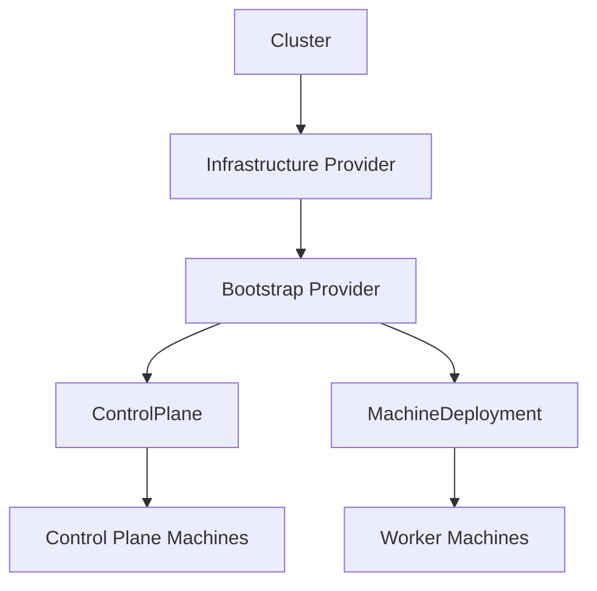

# cluster-api核心概念快速掌握
要快速掌握 **Cluster API (CAPI)** 的核心概念，可以把它理解为：**一个用 Kubernetes 自身的声明式 API 来管理 Kubernetes 集群生命周期的项目**。它把“集群”当成一种资源对象，像 Pod、Deployment 一样用 YAML 来定义和控制。  
## 📌 核心概念速览
### 1. **Cluster**
- 表示一个 Kubernetes 集群的抽象对象。  
- 包含控制平面和工作节点的配置。  
### 2. **Machine**
- 表示单个节点的抽象对象。  
- 可以是虚拟机、物理机或云上的实例。  
### 3. **MachineSet**
- 类似于 Deployment → Pod 的关系。  
- 定义一组相同配置的节点，支持自动扩缩容。  
### 4. **MachineDeployment**
- 类似于 Deployment 控制 ReplicaSet。  
- 提供滚动升级、版本管理等高级功能。  
### 5. **ControlPlane**
- 专门管理控制平面节点的对象。  
- 确保 API Server、etcd 等核心组件的高可用和升级。  
### 6. **Infrastructure Provider**
- 定义底层资源如何创建（AWS、Azure、GCP、vSphere、BareMetal 等）。  
- CAPI 本身不直接创建虚拟机，而是通过 provider 插件。  
### 7. **Bootstrap Provider**
- 定义节点启动时如何安装和配置 Kubernetes（例如 kubeadm）。  
## 🧩 工作流程简化
1. **声明一个 Cluster 对象** → 定义集群。  
2. **声明 ControlPlane** → 定义控制平面节点。  
3. **声明 MachineDeployment** → 定义工作节点组。  
4. **Infrastructure Provider** → 负责在云或物理环境里创建实际机器。  
5. **Bootstrap Provider** → 在机器上安装和配置 Kubernetes。  
## 📊 类比理解
- **Cluster API** 就像是 Kubernetes 的“集群工厂”。  
- **Cluster** = 集群蓝图  
- **MachineDeployment** = 节点的 Deployment  
- **Infrastructure Provider** = 云厂商的驱动  
- **Bootstrap Provider** = 节点初始化脚本  

✅ **总结**：Cluster API 的核心思想是 **用 Kubernetes 管理 Kubernetes**，通过声明式 API 来创建、升级和销毁集群。掌握 Cluster、Machine、MachineDeployment、ControlPlane、Provider 这些对象，就能快速理解它的工作原理。  

# Infrastructure Provider负责创建机器，Bootstrap Provider负责在创建的机器上进行安装配置？
完全正确 👍。在 **Cluster API (CAPI)** 的设计里，职责是这样分工的：
- **Infrastructure Provider**  
  - 负责在底层环境里创建和管理实际的机器资源（虚拟机、云实例、物理机）。  
  - 例如：Cluster API Provider AWS (CAPA)、Cluster API Provider Azure (CAPZ)、Cluster API Provider vSphere (CAPV)。  
  - 它们会调用云厂商 API 或虚拟化平台来创建节点。  
- **Bootstrap Provider**  
  - 负责在新创建的机器上执行初始化和配置，让它成为一个 Kubernetes 节点。  
  - 最常见的是 **kubeadm** bootstrap provider，它会在机器上安装 kubelet、配置证书、加入集群。  
  - 也可以替换成其他方式，比如 Talos、Ignition 等。  
## 📊 类比理解
- **Infrastructure Provider** = “造房子的人”，负责把机器资源建出来。  
- **Bootstrap Provider** = “装修队”，负责在房子里装好 Kubernetes，确保能正常入住。  
## 🧩 工作流程简化
1. 用户声明一个 **Cluster** 对象。  
2. **Infrastructure Provider** 创建虚拟机/云实例。  
3. **Bootstrap Provider** 在这些机器上安装和配置 Kubernetes。  
4. **ControlPlane** 和 **MachineDeployment** 确保集群扩缩容和升级。  

✅ 总结：**Infrastructure Provider 管机器，Bootstrap Provider 管机器上的 Kubernetes 初始化**。两者配合，才能让 Cluster API 把“声明一个集群”变成“真正运行的 Kubernetes 集群”。  
## Cluster API 工作流程图*
从 Cluster → Infrastructure Provider → Bootstrap Provider → ControlPlane → MachineDeployment 的关系：  

📌 图解说明
- **Cluster**：集群的顶层抽象。  
- **Infrastructure Provider**：负责创建底层机器资源（VM、云实例、物理机）。  
- **Bootstrap Provider**：在机器上安装和配置 Kubernetes，使其成为节点。  
- **ControlPlane**：管理控制平面节点（API Server、etcd 等）。  
- **MachineDeployment**：管理工作节点组，支持扩缩容和滚动升级。  

这样你就能一眼看清 **Cluster API 的生命周期链路**：  
👉 声明集群 → 创建机器 → 初始化配置 → 管理控制平面和工作节点。  
# Cluster API (CAPI)关键概念  
## 📌 还需要掌握的核心概念
### 1. **ClusterClass**
- **作用**：为集群提供一个“模板化蓝图”。  
- **意义**：避免每次都手写复杂的 YAML，把集群的拓扑结构（控制平面、工作节点组、网络配置等）抽象成一个可复用的类。  
- **好处**：简化集群创建，支持批量和一致性管理。  
### 2. **Topology**
- **作用**：描述集群的整体结构（控制平面 + 工作节点组）。  
- **关系**：通常和 **ClusterClass** 配合使用，定义集群的拓扑。  
### 3. **MachineHealthCheck (MHC)**
- **作用**：自动检测和修复节点健康状况。  
- **机制**：如果某个节点长时间不可用，MHC 会触发替换，保证集群稳定性。  
### 4. **Add-ons**
- **作用**：集群创建后自动安装的额外组件（如 CNI 插件、监控工具）。  
- **意义**：保证集群开箱即用。  
### 5. **Runtime Extensions**
- **作用**：允许用户在集群生命周期的不同阶段插入自定义逻辑。  
- **场景**：比如在节点创建后自动安装安全代理，或在删除前执行清理脚本。  
## 🧩 完整的核心对象体系
| 概念 | 作用 | 类比 |
|------|------|------|
| Cluster | 集群蓝图 | Deployment |
| ControlPlane | 管理控制平面节点 | StatefulSet |
| Machine | 单个节点抽象 | Pod |
| MachineSet | 一组相同配置的节点 | ReplicaSet |
| MachineDeployment | 管理工作节点组，支持升级 | Deployment |
| Infrastructure Provider | 创建底层机器资源 | 云厂商驱动 |
| Bootstrap Provider | 初始化机器上的 Kubernetes | 安装脚本 |
| ClusterClass | 集群模板蓝图 | Helm Chart |
| Topology | 集群整体结构 | 架构图 |
| MachineHealthCheck | 节点健康检测与替换 | PodDisruptionBudget + 自动修复 |
| Add-ons | 集群额外组件 | 插件系统 |
| Runtime Extensions | 生命周期钩子 | Operator Hook |

✅ **总结**：  
除了你已经掌握的核心对象，**ClusterClass、Topology、MachineHealthCheck、Add-ons、Runtime Extensions** 是必须补充的关键概念。它们让 Cluster API 不仅能创建集群，还能保证集群的 **一致性、稳定性和可扩展性**。  
## Cluster API 概念全景图
```mermaid
flowchart TD
    %% 顶层抽象
    A[Cluster]:::core --> B[ControlPlane]:::core
    A --> C[MachineDeployment]:::core
    A --> D[Infrastructure Provider]:::infra
    A --> E[Bootstrap Provider]:::infra
    A --> F[ClusterClass]:::ext
    A --> G[Topology]:::ext

    %% 控制平面
    B --> B1[Control Plane Machines]:::core

    %% 工作节点
    C --> C1[MachineSet]:::core
    C1 --> C2[Machines]:::core

    %% 扩展功能
    A --> H[MachineHealthCheck]:::ext
    A --> I[Add-ons]:::ext
    A --> J[Runtime Extensions]:::ext
    A --> K[Bastion Node]:::infra

    %% 样式定义
    classDef core fill=#f9f,stroke=#333,stroke-width=1px;
    classDef infra fill=#9ff,stroke=#333,stroke-width=1px;
    classDef ext fill=#cfc,stroke=#333,stroke-width=1px;
📌 图解说明
- **核心对象 (紫色)**：Cluster、ControlPlane、MachineDeployment、MachineSet、Machine。  
- **基础设施层 (蓝色)**：Infrastructure Provider、Bootstrap Provider、Bastion Node。  
- **扩展对象 (绿色)**：ClusterClass、Topology、MachineHealthCheck、Add-ons、Runtime Extensions。  

✅ **总结**：这个全景图把 Cluster API 的对象分成三层：  
- **核心对象**：集群和节点的基本抽象。  
- **基础设施层**：负责创建和初始化机器。  
- **扩展对象**：提供模板化、健康检查、插件和生命周期钩子。  

这样你就能快速掌握 Cluster API 的完整体系结构。  

# ClusterClass、Topology、Add-ons、Runtime Extensions详解
**在 Cluster API 中，ClusterClass、Topology、Add-ons 和 Runtime Extensions 是扩展和增强集群生命周期管理的关键机制，它们分别负责模板化集群定义、描述整体结构、自动安装额外组件，以及在生命周期中插入自定义逻辑。**  
## 📌 ClusterClass
- **定义**：ClusterClass 是一种“集群蓝图”，用来抽象和模板化集群的配置。  
- **作用**：  
  - 避免每次都手写复杂 YAML。  
  - 提供一致性和可复用性。  
  - 支持批量创建和管理多个集群。  
- **关键点**：ClusterClass 通常和 Topology 配合使用，定义控制平面、工作节点组、网络等。
## 📌 Topology
- **定义**：Topology 是集群的整体结构描述。  
- **作用**：  
  - 指定控制平面和工作节点组的数量、配置。  
  - 与 ClusterClass 结合，形成完整的集群定义。  
- **机制**：Topology reconciler 会调用 **GeneratePatches** 和 **ValidateTopology** 等钩子来动态调整和验证集群对象  [The Cluster API Book](https://cluster-api.sigs.k8s.io/tasks/experimental-features/runtime-sdk/implement-topology-mutation-hook)。
## 📌 Add-ons
- **定义**：Add-ons 是集群创建后自动安装的额外组件。  
- **作用**：  
  - 确保集群开箱即用（如 CNI 插件、CoreDNS、监控工具）。  
  - 提供标准化的扩展能力。  
- **意义**：减少人工安装步骤，提高一致性。
## 📌 Runtime Extensions
- **定义**：Runtime Extensions 是在集群生命周期中插入自定义逻辑的机制。  
- **作用**：  
  - 在不同阶段（创建、升级、删除）执行额外操作。  
  - 例如：在节点创建后自动安装安全代理，或在删除前执行清理脚本。  
- **机制**：包括 **GeneratePatches**、**ValidateTopology**、**DiscoverVariables** 等钩子，用于修改或验证集群对象  [The Cluster API Book](https://cluster-api.sigs.k8s.io/tasks/experimental-features/runtime-sdk/implement-topology-mutation-hook)  [nutanix-cloud-native.github.io](https://nutanix-cloud-native.github.io/cluster-api-runtime-extensions-nutanix/getting-started/integrating-with-your-clusterclass/)。  
- **风险**：如果实现不当，可能导致集群控制器运行失败，因此需要谨慎使用  [The Cluster API Book](https://cluster-api.sigs.k8s.io/tasks/experimental-features/runtime-sdk/implement-topology-mutation-hook)。
## 📊 对比表
| 概念 | 作用 | 类比 |
|------|------|------|
| ClusterClass | 集群模板蓝图 | Helm Chart |
| Topology | 集群整体结构 | 架构图 |
| Add-ons | 自动安装的额外组件 | 插件系统 |
| Runtime Extensions | 生命周期钩子 | Operator Hook |

✅ **总结**：  
- **ClusterClass + Topology** → 提供一致性和模板化的集群定义。  
- **Add-ons** → 确保集群开箱即用。  
- **Runtime Extensions** → 提供灵活的生命周期定制。  


