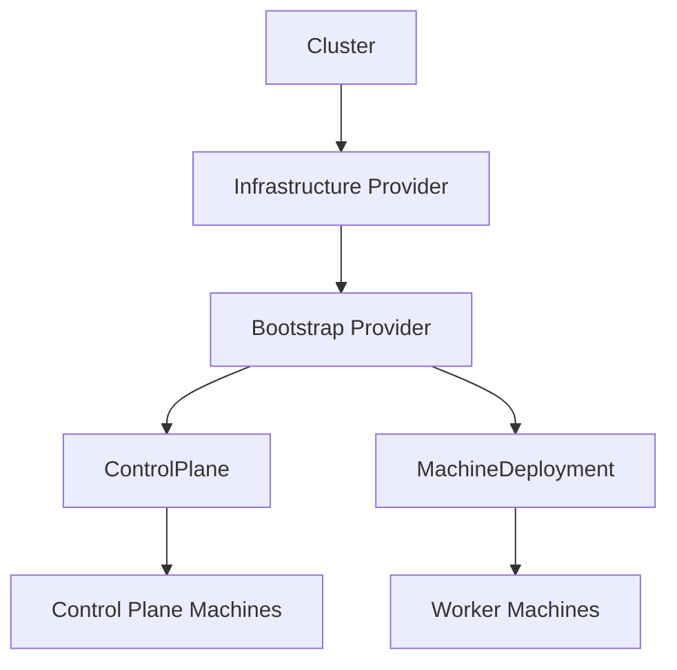
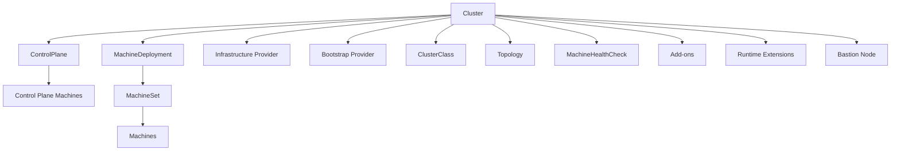
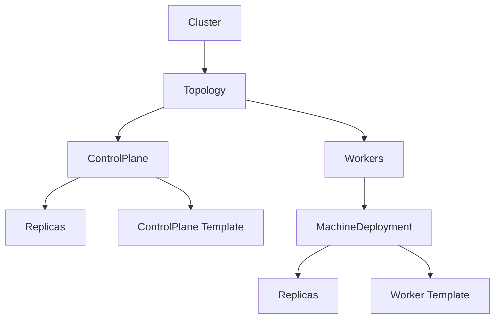

# cluster-api核心概念快速掌握
要快速掌握 **Cluster API (CAPI)** 的核心概念，可以把它理解为：**一个用 Kubernetes 自身的声明式 API 来管理 Kubernetes 集群生命周期的项目**。它把“集群”当成一种资源对象，像 Pod、Deployment 一样用 YAML 来定义和控制。  
## 📌 核心概念速览
### 1. **Cluster**
- 表示一个 Kubernetes 集群的抽象对象。  
- 包含控制平面和工作节点的配置。  
### 2. **Machine**
- 表示单个节点的抽象对象。  
- 可以是虚拟机、物理机或云上的实例。  
### 3. **MachineSet**
- 类似于 Deployment → Pod 的关系。  
- 定义一组相同配置的节点，支持自动扩缩容。  
### 4. **MachineDeployment**
- 类似于 Deployment 控制 ReplicaSet。  
- 提供滚动升级、版本管理等高级功能。  
### 5. **ControlPlane**
- 专门管理控制平面节点的对象。  
- 确保 API Server、etcd 等核心组件的高可用和升级。  
### 6. **Infrastructure Provider**
- 定义底层资源如何创建（AWS、Azure、GCP、vSphere、BareMetal 等）。  
- CAPI 本身不直接创建虚拟机，而是通过 provider 插件。  
### 7. **Bootstrap Provider**
- 定义节点启动时如何安装和配置 Kubernetes（例如 kubeadm）。  
## 🧩 工作流程简化
1. **声明一个 Cluster 对象** → 定义集群。  
2. **声明 ControlPlane** → 定义控制平面节点。  
3. **声明 MachineDeployment** → 定义工作节点组。  
4. **Infrastructure Provider** → 负责在云或物理环境里创建实际机器。  
5. **Bootstrap Provider** → 在机器上安装和配置 Kubernetes。  
## 📊 类比理解
- **Cluster API** 就像是 Kubernetes 的“集群工厂”。  
- **Cluster** = 集群蓝图  
- **MachineDeployment** = 节点的 Deployment  
- **Infrastructure Provider** = 云厂商的驱动  
- **Bootstrap Provider** = 节点初始化脚本  

✅ **总结**：Cluster API 的核心思想是 **用 Kubernetes 管理 Kubernetes**，通过声明式 API 来创建、升级和销毁集群。掌握 Cluster、Machine、MachineDeployment、ControlPlane、Provider 这些对象，就能快速理解它的工作原理。  

# Infrastructure Provider负责创建机器，Bootstrap Provider负责在创建的机器上进行安装配置？
完全正确 👍。在 **Cluster API (CAPI)** 的设计里，职责是这样分工的：
- **Infrastructure Provider**  
  - 负责在底层环境里创建和管理实际的机器资源（虚拟机、云实例、物理机）。  
  - 例如：Cluster API Provider AWS (CAPA)、Cluster API Provider Azure (CAPZ)、Cluster API Provider vSphere (CAPV)。  
  - 它们会调用云厂商 API 或虚拟化平台来创建节点。  
- **Bootstrap Provider**  
  - 负责在新创建的机器上执行初始化和配置，让它成为一个 Kubernetes 节点。  
  - 最常见的是 **kubeadm** bootstrap provider，它会在机器上安装 kubelet、配置证书、加入集群。  
  - 也可以替换成其他方式，比如 Talos、Ignition 等。  
## 📊 类比理解
- **Infrastructure Provider** = “造房子的人”，负责把机器资源建出来。  
- **Bootstrap Provider** = “装修队”，负责在房子里装好 Kubernetes，确保能正常入住。  
## 🧩 工作流程简化
1. 用户声明一个 **Cluster** 对象。  
2. **Infrastructure Provider** 创建虚拟机/云实例。  
3. **Bootstrap Provider** 在这些机器上安装和配置 Kubernetes。  
4. **ControlPlane** 和 **MachineDeployment** 确保集群扩缩容和升级。  

✅ 总结：**Infrastructure Provider 管机器，Bootstrap Provider 管机器上的 Kubernetes 初始化**。两者配合，才能让 Cluster API 把“声明一个集群”变成“真正运行的 Kubernetes 集群”。  
## Cluster API 工作流程图*
从 Cluster → Infrastructure Provider → Bootstrap Provider → ControlPlane → MachineDeployment 的关系：  

📌 图解说明
- **Cluster**：集群的顶层抽象。  
- **Infrastructure Provider**：负责创建底层机器资源（VM、云实例、物理机）。  
- **Bootstrap Provider**：在机器上安装和配置 Kubernetes，使其成为节点。  
- **ControlPlane**：管理控制平面节点（API Server、etcd 等）。  
- **MachineDeployment**：管理工作节点组，支持扩缩容和滚动升级。  

这样你就能一眼看清 **Cluster API 的生命周期链路**：  
👉 声明集群 → 创建机器 → 初始化配置 → 管理控制平面和工作节点。  

# Cluster API (CAPI)关键概念  
## 📌 还需要掌握的核心概念
### 1. **ClusterClass**
- **作用**：为集群提供一个“模板化蓝图”。  
- **意义**：避免每次都手写复杂的 YAML，把集群的拓扑结构（控制平面、工作节点组、网络配置等）抽象成一个可复用的类。  
- **好处**：简化集群创建，支持批量和一致性管理。  
### 2. **Topology**
- **作用**：描述集群的整体结构（控制平面 + 工作节点组）。  
- **关系**：通常和 **ClusterClass** 配合使用，定义集群的拓扑。  
### 3. **MachineHealthCheck (MHC)**
- **作用**：自动检测和修复节点健康状况。  
- **机制**：如果某个节点长时间不可用，MHC 会触发替换，保证集群稳定性。  
### 4. **Add-ons**
- **作用**：集群创建后自动安装的额外组件（如 CNI 插件、监控工具）。  
- **意义**：保证集群开箱即用。  
### 5. **Runtime Extensions**
- **作用**：允许用户在集群生命周期的不同阶段插入自定义逻辑。  
- **场景**：比如在节点创建后自动安装安全代理，或在删除前执行清理脚本。  
## 🧩 完整的核心对象体系
| 概念 | 作用 | 类比 |
|------|------|------|
| Cluster | 集群蓝图 | Deployment |
| ControlPlane | 管理控制平面节点 | StatefulSet |
| Machine | 单个节点抽象 | Pod |
| MachineSet | 一组相同配置的节点 | ReplicaSet |
| MachineDeployment | 管理工作节点组，支持升级 | Deployment |
| Infrastructure Provider | 创建底层机器资源 | 云厂商驱动 |
| Bootstrap Provider | 初始化机器上的 Kubernetes | 安装脚本 |
| ClusterClass | 集群模板蓝图 | Helm Chart |
| Topology | 集群整体结构 | 架构图 |
| MachineHealthCheck | 节点健康检测与替换 | PodDisruptionBudget + 自动修复 |
| Add-ons | 集群额外组件 | 插件系统 |
| Runtime Extensions | 生命周期钩子 | Operator Hook |

✅ **总结**：  
除了你已经掌握的核心对象，**ClusterClass、Topology、MachineHealthCheck、Add-ons、Runtime Extensions** 是必须补充的关键概念。它们让 Cluster API 不仅能创建集群，还能保证集群的 **一致性、稳定性和可扩展性**。  
## Cluster API 概念全景图

📌 图解说明
- **核心对象 (紫色)**：Cluster、ControlPlane、MachineDeployment、MachineSet、Machine。  
- **基础设施层 (蓝色)**：Infrastructure Provider、Bootstrap Provider、Bastion Node。  
- **扩展对象 (绿色)**：ClusterClass、Topology、MachineHealthCheck、Add-ons、Runtime Extensions。  

✅ **总结**：这个全景图把 Cluster API 的对象分成三层：  
- **核心对象**：集群和节点的基本抽象。  
- **基础设施层**：负责创建和初始化机器。  
- **扩展对象**：提供模板化、健康检查、插件和生命周期钩子。  

这样你就能快速掌握 Cluster API 的完整体系结构。  

# ClusterClass、Topology、Add-ons、Runtime Extensions详解
**在 Cluster API 中，ClusterClass、Topology、Add-ons 和 Runtime Extensions 是扩展和增强集群生命周期管理的关键机制，它们分别负责模板化集群定义、描述整体结构、自动安装额外组件，以及在生命周期中插入自定义逻辑。**  
## 📌 ClusterClass
- **定义**：ClusterClass 是一种“集群蓝图”，用来抽象和模板化集群的配置。  
- **作用**：  
  - 避免每次都手写复杂 YAML。  
  - 提供一致性和可复用性。  
  - 支持批量创建和管理多个集群。  
- **关键点**：ClusterClass 通常和 Topology 配合使用，定义控制平面、工作节点组、网络等。
## 📌 Topology
- **定义**：Topology 是集群的整体结构描述。  
- **作用**：  
  - 指定控制平面和工作节点组的数量、配置。  
  - 与 ClusterClass 结合，形成完整的集群定义。  
- **机制**：Topology reconciler 会调用 **GeneratePatches** 和 **ValidateTopology** 等钩子来动态调整和验证集群对象  [The Cluster API Book](https://cluster-api.sigs.k8s.io/tasks/experimental-features/runtime-sdk/implement-topology-mutation-hook)。
## 📌 Add-ons
- **定义**：Add-ons 是集群创建后自动安装的额外组件。  
- **作用**：  
  - 确保集群开箱即用（如 CNI 插件、CoreDNS、监控工具）。  
  - 提供标准化的扩展能力。  
- **意义**：减少人工安装步骤，提高一致性。
## 📌 Runtime Extensions
- **定义**：Runtime Extensions 是在集群生命周期中插入自定义逻辑的机制。  
- **作用**：  
  - 在不同阶段（创建、升级、删除）执行额外操作。  
  - 例如：在节点创建后自动安装安全代理，或在删除前执行清理脚本。  
- **机制**：包括 **GeneratePatches**、**ValidateTopology**、**DiscoverVariables** 等钩子，用于修改或验证集群对象  [The Cluster API Book](https://cluster-api.sigs.k8s.io/tasks/experimental-features/runtime-sdk/implement-topology-mutation-hook)  [nutanix-cloud-native.github.io](https://nutanix-cloud-native.github.io/cluster-api-runtime-extensions-nutanix/getting-started/integrating-with-your-clusterclass/)。  
- **风险**：如果实现不当，可能导致集群控制器运行失败，因此需要谨慎使用  [The Cluster API Book](https://cluster-api.sigs.k8s.io/tasks/experimental-features/runtime-sdk/implement-topology-mutation-hook)。
## 📊 对比表
| 概念 | 作用 | 类比 |
|------|------|------|
| ClusterClass | 集群模板蓝图 | Helm Chart |
| Topology | 集群整体结构 | 架构图 |
| Add-ons | 自动安装的额外组件 | 插件系统 |
| Runtime Extensions | 生命周期钩子 | Operator Hook |

✅ **总结**：  
- **ClusterClass + Topology** → 提供一致性和模板化的集群定义。  
- **Add-ons** → 确保集群开箱即用。  
- **Runtime Extensions** → 提供灵活的生命周期定制。

# InfrastructureCluster与InfrastructureMachine
你说得对，除了我们之前梳理的 **Cluster、Machine、MachineSet、MachineDeployment、ControlPlane、ClusterClass、Topology、Add-ons、Runtime Extensions、Bastion** 等概念，**Cluster API** 里还有两个非常重要的对象：  
## 📌 InfrastructureCluster
- **定义**：集群级别的基础设施对象。  
- **作用**：描述整个集群运行的环境，比如 VPC、子网、负载均衡器、网络配置。  
- **典型实现**：  
  - AWSCluster（CAPA）  
  - AzureCluster（CAPZ）  
  - DockerCluster（CAPD）  
- **关系**：在传统模式下，Cluster 通过 `infrastructureRef` 指向一个 InfrastructureCluster 对象。  
- **意义**：它是集群的“底座”，控制平面和工作节点都依赖它。  
## 📌 InfrastructureMachine
- **定义**：单个节点的基础设施对象。  
- **作用**：描述某个具体机器的底层资源（虚拟机规格、磁盘、网络接口）。  
- **典型实现**：  
  - AWSMachine  
  - AzureMachine  
  - DockerMachine  
- **关系**：Machine 或 MachineDeployment 会引用 InfrastructureMachine 模板，来创建实际的节点。  
- **意义**：它是节点的“外壳”，Bootstrap Provider 在其上安装 Kubernetes。  
## 📊 概念全景补充表
| 类别 | 概念 | 作用 |
|------|------|------|
| 集群级别 | Cluster | 集群蓝图 |
| 集群级别 | ClusterClass | 集群模板蓝图 |
| 集群级别 | Topology | 集群整体结构 |
| 集群级别 | InfrastructureCluster | 集群环境（VPC、网络、LB） |
| 控制平面 | ControlPlane | 管理控制平面节点 |
| 节点级别 | Machine | 单个节点抽象 |
| 节点级别 | MachineSet | 一组相同配置的节点 |
| 节点级别 | MachineDeployment | 管理工作节点组 |
| 节点级别 | InfrastructureMachine | 节点的底层资源定义 |
| 扩展功能 | Add-ons | 自动安装额外组件 |
| 扩展功能 | Runtime Extensions | 生命周期钩子 |
| 健康管理 | MachineHealthCheck | 节点健康检测与替换 |
| 网络安全 | Bastion Node | 安全跳板机 |
## ✅ 总结
- **InfrastructureCluster**：集群级别的环境定义（网络、VPC、LB）。  
- **InfrastructureMachine**：节点级别的底层资源定义（VM、磁盘、网卡）。  
- 它们和 **Bootstrap Provider** 配合，一个负责“造机器”，一个负责“装 Kubernetes”。  
- 至此，Cluster API 的核心和扩展概念就比较完整了。  

# Cluster.spec.topology
在 **Cluster API** 中，`Cluster.spec.topology` 是一个非常关键的字段。它的含义和命名背后有一些设计哲学，值得细细理解。  
## 📌 Topology 字段的含义
- **定义**：Topology 是 Cluster 对象的一个子字段，用来描述整个集群的结构。  
- **内容**：包括控制平面、副本数、工作节点组、版本号等。  
- **作用**：Topology 把集群的“形状”抽象出来，告诉 Cluster API 控制器如何根据 ClusterClass 模板去生成实际的资源。  

**示例：**
```yaml
apiVersion: cluster.x-k8s.io/v1beta1
kind: Cluster
metadata:
  name: my-cluster
spec:
  topology:
    class: prod-clusterclass
    version: v1.29.0
    controlPlane:
      replicas: 3
    workers:
      machineDeployments:
        - class: default-worker
          replicas: 5
```
这里的 `topology` 就是描述集群的整体结构：  
- 使用哪个 ClusterClass 模板 (`class`)  
- 集群版本 (`version`)  
- 控制平面副本数 (`controlPlane.replicas`)  
- 工作节点组 (`workers.machineDeployments`)  
## 📊 为什么叫 Topology，而不是更“业务化”的名字？
1. **中立性**  
   - Cluster API 是一个通用框架，目标是跨云、跨环境管理 Kubernetes 集群。  
   - 如果用“业务相关”的名字（比如 *layout*、*profile*、*plan*），容易带有特定语境或厂商色彩。  
   - “Topology” 是一个更中立的技术词汇，强调结构而非业务。  
2. **强调结构而非用途**  
   - Topology 关注的是 **集群的形状**（控制平面副本数、工作节点组数量和配置）。  
   - 它不关心业务逻辑，而是描述资源之间的关系。  
3. **与网络/系统工程的传统一致**  
   - 在网络和系统工程里，“Topology” 一直用来描述系统的结构和节点关系。  
   - 例如网络拓扑、系统拓扑。  
   - Cluster API 借用这个词，延续了这种语义。  
4. **避免歧义**  
   - 如果用 “profile”，容易和用户配置文件混淆。  
   - 如果用 “plan”，容易和升级计划混淆。  
   - “Topology” 在 Kubernetes 语境里更明确：就是结构和布局。  
## ✅ 总结
- **Topology 字段**：描述集群的整体结构（控制平面、工作节点组、版本）。  
- **命名原因**：选择 “Topology” 是为了强调结构性和中立性，避免业务语境的歧义，同时与系统工程传统保持一致。  
- **设计哲学**：Cluster API 的目标是声明式、通用、跨环境的集群管理，因此用一个抽象、结构化的词汇比业务化的名字更合适。  

# Cluster中在传统模式下使用controlPlaneRef与infrastructureRef，在拓扑模式下使用topology下的controlPlane与workers，为什么一个用workers，一个用infrastructureRef，是不是概念不一致啊，导致理解困难
你抓到的这个点非常关键：在 **Cluster API** 的传统模式和拓扑模式下，字段命名和结构确实不同，容易让人觉得概念不一致。我们来拆开看：
## 📌 传统模式
在 **Cluster.spec** 中：
- `controlPlaneRef`：指向一个控制平面对象（例如 `KubeadmControlPlane`）。  
- `infrastructureRef`：指向一个集群级别的基础设施对象（例如 `AWSCluster`、`AzureCluster`）。  

这种模式下，集群的控制平面和基础设施是通过 **引用单个对象**来定义的。
## 📌 拓扑模式
在 **Cluster.spec.topology** 中：
- `controlPlane`：定义控制平面的副本数和模板（通过 ClusterClass 引用）。  
- `workers`：定义工作节点组（MachineDeployments），而不是直接引用基础设施对象。  
- 基础设施和引导配置不再直接写在 Cluster 里，而是通过 **ClusterClass** 模板来统一管理。  
## 📊 为什么看起来不一致？
- 在传统模式下，**Cluster 直接引用具体的基础设施对象**（`infrastructureRef`）。  
- 在拓扑模式下，**Cluster 不再直接引用基础设施对象**，而是通过 **ClusterClass** 来间接指定，这样集群的结构（Topology）和底层实现（Infrastructure Provider）解耦。  
- `workers` 在拓扑模式下是一个更高层的抽象，表示“工作节点组”，它内部再通过 ClusterClass 指向具体的基础设施模板。  
## ✅ 设计哲学
1. **传统模式**：显式引用，灵活但冗长。  
2. **拓扑模式**：结构化抽象，统一由 ClusterClass 管理，简化用户体验。  
3. **命名差异的原因**：  
   - `infrastructureRef` → 强调“引用某个具体的基础设施对象”。  
   - `workers` → 强调“集群的结构部分”，而不是直接绑定到某个 Provider。  
   - 拓扑模式的目标是让用户关注 **集群的形状 (Topology)**，而不是底层实现细节。  
## 📌 总结
- **不是概念不一致，而是抽象层次不同**：  
  - 传统模式：Cluster 直接引用 infra/controlPlane 对象。  
  - 拓扑模式：Cluster 通过 Topology 描述结构，具体 infra/controlPlane 由 ClusterClass 模板提供。  
- **理解关键**：拓扑模式是更高层的抽象，屏蔽了底层 Provider 的细节，让用户只需要关心集群的结构（控制平面 + 工作节点组）。  
## Cluster Topology 概念图
展示从 Cluster → Topology → ControlPlane/Workers 的层次关系：  

📌 图解说明
- **Cluster**：顶层对象，代表一个 Kubernetes 集群。  
- **Topology**：描述集群的整体结构，引用 ClusterClass。  
- **ControlPlane**：定义控制平面的副本数和模板。  
- **Workers**：定义工作节点组（MachineDeployments），包括副本数和模板。  

✅ **总结**：  
- 在拓扑模式下，Cluster 不再直接引用 `controlPlaneRef` 和 `infrastructureRef`，而是通过 **Topology** 来描述集群的结构。  
- **ControlPlane** 和 **Workers** 是 Topology 的两个核心部分，分别负责控制平面和工作节点组的定义。  
- 具体的基础设施和引导配置由 **ClusterClass** 提供，Topology 只是结构化的描述。  

这样你就能直观理解：**Cluster → Topology → ControlPlane/Workers** 的层次关系，Topology 是连接 Cluster 和 ClusterClass 的桥梁。  

# 传统模式：Cluster 直接引用 infra/controlPlane 对象。为什么不是引用 worker/controlPlane 对象，infra可被控制平面与数据平面同时使用呢
你提到的这个点，其实正好揭示了 **Cluster API 传统模式和拓扑模式的抽象差异**。我们来拆解一下：
## 📌 传统模式
在 `Cluster.spec` 中：
- `infrastructureRef`：指向一个 **集群级别的基础设施对象**（如 `AWSCluster`、`AzureCluster`、`DockerCluster`）。它描述的是整个集群的网络、VPC、子网等环境，而不仅仅是某一类节点。  
- `controlPlaneRef`：指向一个 **控制平面对象**（如 `KubeadmControlPlane`），负责定义和管理控制平面节点。  

👉 在这种模式下，**Cluster 并不直接引用 worker 对象**，因为工作节点通常通过 `MachineDeployment` 来定义，而不是在 Cluster 里直接挂载。  
## 📌 为什么不是 `workerRef`？
1. **基础设施是共享的**  
   - 一个集群的控制平面和工作节点通常运行在同一个基础设施环境（同一个 VPC、同一个子网）。  
   - 所以 `infrastructureRef` 是集群级别的引用，既服务于控制平面，也服务于工作节点。  
2. **工作节点的定义方式不同**  
   - 控制平面需要强一致性和专门的对象（`controlPlaneRef`）。  
   - 工作节点更像是“可扩展的副本组”，由 `MachineDeployment` 管理。  
   - 因此没有 `workerRef`，而是通过单独的 `MachineDeployment` CRD 来定义。  
3. **保持解耦**  
   - 如果 Cluster 直接引用 `workerRef`，就会把工作节点和集群绑定得过紧。  
   - 设计上希望工作节点组可以独立扩缩容、升级，而不是作为 Cluster 的一个直接字段。  
## 📌 拓扑模式的改进
在 `Cluster.spec.topology` 中：
- `controlPlane`：定义控制平面副本数和模板。  
- `workers`：定义工作节点组（MachineDeployments）。  
- 基础设施不再直接通过 `infrastructureRef` 引用，而是由 **ClusterClass** 提供统一的模板。  

👉 拓扑模式的设计哲学是：**用户只关心集群的结构 (Topology)，而不是底层 Provider 的细节**。  
- 所以用 `workers` 来表达“工作节点组”，更贴近用户的直觉。  
- 而基础设施配置被抽象进 ClusterClass，不再直接暴露在 Cluster 对象里。  
## ✅ 总结
- 在 **传统模式**：Cluster 引用的是 **集群级别的基础设施对象**（`infrastructureRef`），因为 infra 是控制平面和工作节点共享的环境。工作节点由独立的 `MachineDeployment` 定义，不需要 `workerRef`。  
- 在 **拓扑模式**：Cluster 通过 `topology.controlPlane` 和 `topology.workers` 来描述结构，基础设施由 ClusterClass 模板统一管理。  
- **设计哲学**：传统模式强调底层引用，拓扑模式强调结构抽象。  

# topology.workers.machineDeployments.replicas为什么按照这个层次设计，直接topology.workers.replicas不是更简洁直接？
这是一个非常好的观察：为什么在 **Cluster Topology** 里，工作节点的副本数要放在  
`topology.workers.machineDeployments.replicas`，而不是直接简化成 `topology.workers.replicas`。  
## 📌 设计原因
1. **支持多组工作节点**  
   - 一个集群往往不止一种工作节点配置（例如：普通节点、GPU 节点、存储优化节点）。  
   - 如果只用 `workers.replicas`，就只能表达“一类工作节点”，无法区分不同配置。  
   - `machineDeployments` 是一个数组，可以定义多个不同的工作节点组，每个组有自己的副本数和模板。  
2. **与 Kubernetes 原生对象保持一致**  
   - 在 Kubernetes 中，Pod 的副本数不是直接挂在 Deployment 上，而是通过 ReplicaSet 来管理。  
   - Cluster API 的设计借鉴了这种分层：  
     - `workers` → 表示工作节点集合  
     - `machineDeployments` → 表示具体的节点组  
     - `replicas` → 表示该节点组的数量  
3. **灵活性与扩展性**  
   - 如果未来需要为某个节点组定义不同的升级策略、健康检查、标签选择器，就必须有单独的对象层次。  
   - `machineDeployments` 提供了这种灵活性，而不是把所有副本数都混在一个字段里。  
4. **避免语义混淆**  
   - `workers.replicas` 容易让人误解为“整个集群的工作节点总数”。  
   - 实际上，集群可能有多个不同的工作节点组，每个组的副本数不同。  
   - 分层设计可以清晰表达：这是某个具体节点组的副本数。  
## 📊 对比示例
### 简化设计（不推荐）
```yaml
topology:
  workers:
    replicas: 10   # 无法区分不同类型的工作节点
```
### 现有设计（推荐）
```yaml
topology:
  workers:
    machineDeployments:
      - class: default-worker
        replicas: 5
      - class: gpu-worker
        replicas: 2
      - class: storage-worker
        replicas: 3
```
👉 这样可以清晰表达：不同类型的工作节点组有不同的副本数和模板。
## ✅ 总结
- **不是为了复杂化，而是为了表达多样性和灵活性**。  
- `workers.replicas` 只能表达一个总数，缺乏扩展性。  
- `workers.machineDeployments.replicas` 可以支持多个节点组，每个组独立配置，符合 Kubernetes 的分层设计哲学。  

# InfrastructureCluster 和 InfrastructureMachine是资源，如何实现此资源，设计思路是怎么样的？
非常好的问题！**InfrastructureCluster 和 InfrastructureMachine** 在 Cluster API 中是“资源对象”，它们的设计思路是为了把 **集群级别的环境** 和 **节点级别的底层资源** 抽象出来，统一交给 Provider 实现。我们来分层解析：
## 📌 InfrastructureCluster 的设计思路
- **定位**：集群级别的基础设施资源，描述整个集群的运行环境。  
- **典型内容**：VPC、子网、负载均衡器、网络安全组、DNS、集群域名。  
- **设计哲学**：  
  1. **集群范围**：控制平面和工作节点共享同一个基础设施环境，所以需要一个统一的对象。  
  2. **解耦**：Cluster API 本身不关心具体云厂商的 API，只定义一个抽象接口。具体实现由 Provider（AWSCluster、AzureCluster、DockerCluster 等）完成。  
  3. **声明式**：用户只需声明一个 InfrastructureCluster 对象，Provider 控制器负责 reconcile（创建/更新/删除实际资源）。  
## 📌 InfrastructureMachine 的设计思路
- **定位**：节点级别的基础设施资源，描述单个机器的底层配置。  
- **典型内容**：虚拟机规格（CPU、内存）、磁盘大小、网络接口、可用区。  
- **设计哲学**：  
  1. **节点抽象**：Machine 对象需要一个底层资源来承载，这就是 InfrastructureMachine。  
  2. **灵活性**：不同节点组可以引用不同的 InfrastructureMachine 模板（例如 GPU 节点 vs 普通节点）。  
  3. **可扩展性**：Provider 可以实现不同的 InfrastructureMachine CRD（AWSMachine、AzureMachine、DockerMachine），以适配不同环境。  
## 📊 设计模式总结
- **Cluster API 核心控制器**：只定义抽象对象（Cluster、Machine、ControlPlane）。  
- **Infrastructure Provider**：实现具体的 CRD（InfrastructureCluster、InfrastructureMachine），负责和云厂商 API 交互。  
- **Bootstrap Provider**：在 InfrastructureMachine 上安装 Kubernetes。  

👉 这种设计模式的核心思想是 **分层解耦**：  
- **Cluster API 核心层**：只关心集群生命周期。  
- **Infrastructure 层**：负责实际资源创建。  
- **Bootstrap 层**：负责节点初始化。  
## 🧩 示例：AWS Provider
```yaml
apiVersion: infrastructure.cluster.x-k8s.io/v1beta1
kind: AWSCluster
metadata:
  name: my-aws-cluster
spec:
  region: us-east-1
  network:
    vpc:
      id: vpc-123456

---
apiVersion: infrastructure.cluster.x-k8s.io/v1beta1
kind: AWSMachine
metadata:
  name: worker-template
spec:
  instanceType: t3.large
  ami: ami-0abcdef1234567890
  sshKeyName: my-key
```

- **AWSCluster** → 集群级别环境（VPC、Region）。  
- **AWSMachine** → 节点级别资源（实例类型、AMI、SSH Key）。  
## ✅ 总结
- **InfrastructureCluster**：集群级别的环境抽象，统一描述网络和外部资源。  
- **InfrastructureMachine**：节点级别的资源抽象，定义单个机器的底层配置。  
- **设计思路**：通过抽象接口 + Provider 实现，达到 **声明式、解耦、可扩展** 的目标。  

# AWSCluster是如何通过代码实现InfrastructureCluster的
**AWSCluster 通过代码实现 InfrastructureCluster 的方式，是在 Cluster API Provider AWS (CAPA) 中定义一个 CRD（CustomResourceDefinition），并由控制器 reconcile 该 CRD，将其映射到 AWS 的底层资源（VPC、子网、负载均衡器、IAM 等）。**  
## 📌 实现思路
1. **CRD 定义**  
   - 在 `config/crd/bases/infrastructure.cluster.x-k8s.io_awsclusters.yaml` 中定义了 `AWSCluster` 资源。  
   - 该 CRD 属于 `infrastructure.cluster.x-k8s.io` API 组，表明它是一个 **InfrastructureCluster** 类型的实现。  
   - 字段包括 `spec.region`、`spec.network`、`spec.controlPlaneLoadBalancer` 等，描述集群级别的 AWS 环境。  [deepwiki.com](https://deepwiki.com/openshift/cluster-api-provider-aws/3.1-awscluster)  
2. **Go 类型实现**  
   - 在 `api/v1beta2/awscluster_types.go` 中定义了 `AWSCluster` 的 Go struct。  
   - 该 struct 实现了 Cluster API 的接口（如 `ClusterInfrastructure`），使得 Cluster 控制器可以识别它是一个 InfrastructureCluster。  
   - 代码中包含 `Spec` 和 `Status` 字段，分别用于声明期望状态和记录实际状态。  [deepwiki.com](https://deepwiki.com/openshift/cluster-api-provider-aws/3.1-awscluster)  
3. **控制器逻辑**  
   - 在 `controllers/awscluster_controller.go` 中实现了 reconcile 循环。  
   - 控制器会读取 `AWSCluster` 对象，根据其 spec 调用 AWS SDK 创建或更新 VPC、子网、路由表、负载均衡器等资源。  
   - 同时更新 `AWSCluster.status`，记录实际的 AWS 资源 ID 和状态。  [Github](https://github.com/kubernetes-sigs/cluster-api-provider-aws)  
4. **与 Cluster 对象的关系**  
   - 在传统模式下，Cluster.spec.infrastructureRef 指向一个 `AWSCluster` 对象。  
   - 这样 Cluster API 核心控制器就能通过接口调用 CAPA 的控制器来管理 AWS 环境。  
## 📊 示例：AWSCluster YAML
```yaml
apiVersion: infrastructure.cluster.x-k8s.io/v1beta2
kind: AWSCluster
metadata:
  name: my-aws-cluster
spec:
  region: us-east-1
  network:
    vpc:
      id: vpc-123456
  controlPlaneLoadBalancer:
    name: cp-lb
    scheme: internet-facing
```
- **region**：AWS 区域  
- **network.vpc**：集群所在的 VPC  
- **controlPlaneLoadBalancer**：控制平面节点的负载均衡器  
## ✅ 总结
- **AWSCluster 是 InfrastructureCluster 的具体实现**，通过 CRD + Go 类型 + 控制器逻辑完成。  
- **设计思路**：抽象成 Kubernetes 资源，声明式管理 → 控制器 reconcile → 调用 AWS API 创建实际资源。  
- **好处**：用户只需写 YAML，CAPA 控制器自动完成 AWS 环境的搭建和维护。  

要不要我帮你画一个 **AWSCluster 实现流程图（Mermaid）**，展示从 Cluster → infrastructureRef → AWSCluster → AWS SDK → AWS 资源的完整链路？

# CRD 属于 infrastructure.cluster.x-k8s.io API 组，表明它是一个 InfrastructureCluster 类型的实现。这种方式契约性是不是无法保证？实现者发挥的空间是不是太大了？在框架里也没有办法进行校验
你提到的这个问题非常关键：**InfrastructureCluster / InfrastructureMachine 的契约性**。确实，Cluster API 框架本身只定义了抽象接口（API Group + Kind），并没有强制约束 Provider 必须实现哪些字段或行为，这就带来了“契约性不足”的担忧。我们来拆解一下设计思路和现实情况：
## 📌 为什么看起来契约性不足
1. **API Group 约定而非强制接口**  
   - 例如：`infrastructure.cluster.x-k8s.io` 只是一个命名空间约定。  
   - Provider（如 CAPA、CAPZ）只要定义了 CRD 属于这个 API Group，就被视为 InfrastructureCluster 的实现。  
   - 框架层面没有强制校验“你必须有 VPC 字段”或“必须支持负载均衡器”。  
2. **实现者自由度大**  
   - AWSCluster 可以有 `spec.network.vpc`，AzureCluster 可以有 `spec.resourceGroup`，DockerCluster甚至可能没有网络字段。  
   - 这导致不同 Provider 的字段和行为差异很大，用户需要额外学习。  
3. **框架无法统一校验**  
   - Cluster API 核心控制器只知道“这是一个 InfrastructureCluster”，但不知道它内部具体字段。  
   - 所以无法在框架层面做 schema 校验或行为保证。  
## 📊 为什么设计成这样
1. **跨云抽象的难度**  
   - 不同云厂商的资源模型差异巨大（AWS 的 VPC vs Azure 的 Virtual Network vs vSphere 的 Datacenter）。  
   - 如果强行定义统一字段，必然会过度抽象，导致不可用或过于复杂。  
2. **扩展性优先**  
   - Cluster API 的目标是让任何人都能写一个 Provider。  
   - 所以只定义了“接口契约”（API Group + Kind），而不是具体字段。  
   - 这样 Provider 可以自由发挥，适配自己的环境。  
3. **契约通过文档和接口而非代码强制**  
   - 官方文档规定：InfrastructureCluster 必须能提供集群级别的环境信息；InfrastructureMachine 必须能提供节点级别的资源信息。  
   - 但具体字段由 Provider 自行定义。  
   - 契约是“语义上的”，而不是“编译时强制的”。  
## ✅ 总结
- **确实，契约性无法在框架层面强制保证**，实现者有很大自由度。  
- **原因**：跨云抽象差异太大，框架选择了“接口约定 + Provider 自由实现”的模式。  
- **结果**：用户需要依赖 Provider 文档和样例来理解具体字段。  
- **风险缓解**：通过 ClusterClass + Topology 提供更一致的用户体验，减少直接接触 Provider 字段的机会。  
换句话说：**Cluster API 的契约是“语义契约”，而不是“字段契约”**。它保证了对象类型和生命周期，但不保证字段一致性。  
## 契约层次图
直观展示 Cluster API 核心层只定义抽象接口，而 Provider 层自由实现具体字段的关系：  
```mermaid
flowchart TD
    A[Cluster API 核心层]:::core --> B[抽象接口]
    B --> B1[InfrastructureCluster 接口]
    B --> B2[InfrastructureMachine 接口]

    B1 --> C1[AWSCluster (CAPA)]
    B1 --> C2[AzureCluster (CAPZ)]
    B1 --> C3[DockerCluster (CAPD)]

    B2 --> D1[AWSMachine]
    B2 --> D2[AzureMachine]
    B2 --> D3[DockerMachine]

    %% 样式定义
    classDef core fill=#f9f,stroke=#333,stroke-width=1px;
    classDef provider fill=#9ff,stroke=#333,stroke-width=1px;

    class B1,B2 core
    class C1,C2,C3,D1,D2,D3 provider
```
📌 图解说明
- **核心层 (紫色)**：Cluster API 只定义抽象接口（InfrastructureCluster、InfrastructureMachine），不规定具体字段。  
- **Provider 层 (蓝色)**：各云厂商或环境的 Provider 自由实现这些接口，定义自己的 CRD 字段（如 AWSCluster 的 VPC、AzureCluster 的 ResourceGroup、DockerCluster 的 Network）。  
- **契约关系**：框架保证对象类型和生命周期，但不强制字段一致性。  

✅ **总结**：  
- Cluster API 的契约是 **语义契约**：只规定对象类别和生命周期。  
- Provider 层有很大自由度，可以根据自身环境定义字段。  
- 这种设计牺牲了强一致性，但换来了跨云的可扩展性。  


