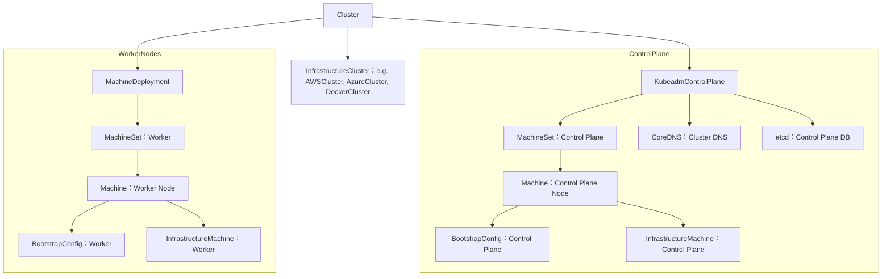
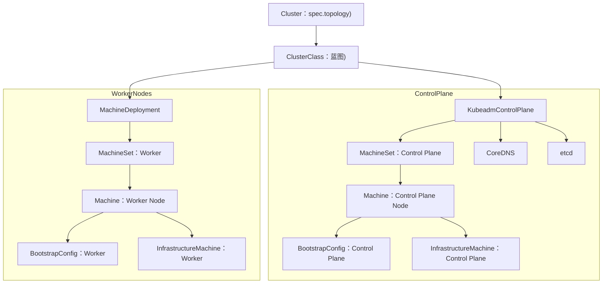

   
# 基于Cluster API原生API设计对标CVO的集群升级方案设计
## 基于Cluster API原生API设计对标CVO的集群升级方案
### 一、方案概述
OpenShift CVO (Cluster Version Operator) 提供了企业级的集群版本管理和升级能力。本方案基于Cluster API原生API设计类似功能，实现声明式的集群版本管理。
### 二、核心架构对比
```
┌─────────────────────────────────────────────────────────────────────────────┐
│                        OpenShift CVO vs Cluster API 升级架构                  │
├─────────────────────────────────────────────────────────────────────────────┤
│                                                                             │
│  OpenShift CVO                          Cluster API + 扩展                   │
│  ┌─────────────────────┐               ┌─────────────────────┐              │
│  │ ClusterVersion CRD  │               │ ClusterVersion CRD  │ (新增)       │
│  │ ├─ desiredVersion   │               │ ├─ desiredVersion   │              │
│  │ ├─ currentVersion   │               │ ├─ currentVersion   │              │
│  │ ├─ history[]        │               │ ├─ history[]        │              │
│  │ └─ conditions       │               │ └─ conditions       │              │
│  └─────────────────────┘               └─────────────────────┘              │
│           │                                      │                          │
│           ▼                                      ▼                          │
│  ┌─────────────────────┐               ┌─────────────────────┐              │
│  │ ClusterOperator CRD │               │ ClusterComponent CRD│ (新增)       │
│  │ ├─ version          │               │ ├─ version          │              │
│  │ ├─ conditions       │               │ ├─ conditions       │              │
│  │ └─ relatedObjects   │               │ └─ relatedObjects   │              │
│  └─────────────────────┘               └─────────────────────┘              │
│           │                                      │                          │
│           ▼                                      ▼                          │
│  ┌─────────────────────┐               ┌─────────────────────┐              │
│  │ CVO Controller      │               │ ClusterVersion      │              │
│  │ ├─ Payload解析      │               │ Controller          │ (新增)       │
│  │ ├─ Manifest应用     │               │ ├─ UpgradePlan生成  │              │
│  │ └─ 状态聚合         │               │ ├─ 升级编排         │              │
│  └─────────────────────┘               │ └─ 状态聚合         │              │
│                                        └─────────────────────┘              │
│                                                  │                          │
│                                                  ▼                          │
│                                        ┌─────────────────────┐              │
│                                        │ Cluster API 原生    │              │
│                                        │ ├─ ClusterClass     │              │
│                                        │ ├─ KubeadmControl   │              │
│                                        │ ├─ MachineDeploy    │              │
│                                        │ └─ UpgradeTracker   │              │
│                                        └─────────────────────┘              │
│                                                                             │
└─────────────────────────────────────────────────────────────────────────────┘
```
### 三、CRD设计
#### 3.1 ClusterVersion CRD
```yaml
# d:\code\github\cluster-api\api\addons\v1alpha1\clusterversion_types.go
apiVersion: apiextensions.k8s.io/v1
kind: CustomResourceDefinition
metadata:
  name: clusterversions.addons.cluster.x-k8s.io
spec:
  group: addons.cluster.x-k8s.io
  names:
    kind: ClusterVersion
    plural: clusterversions
    singular: clusterversion
  scope: Namespaced
  versions:
  - name: v1alpha1
    served: true
    storage: true
    schema:
      openAPIV3Schema:
        type: object
        properties:
          spec:
            type: object
            properties:
              clusterRef:
                type: object
                properties:
                  name: { type: string }
                  namespace: { type: string }
                required: [name]
              channel:
                type: string
                description: 升级渠道
              desiredVersion:
                type: string
                description: 目标版本
              desiredImage:
                type: string
                description: 目标镜像
              upgradeStrategy:
                type: object
                properties:
                  type:
                    type: string
                    enum: [Automatic, Manual]
                  maxUnavailable:
                    type: integer
                    default: 1
                  maxSurge:
                    type: integer
                    default: 1
              preUpgradeHooks:
                type: array
                items:
                  type: object
                  properties:
                    name: { type: string }
                    hookRef: { type: object }
              postUpgradeHooks:
                type: array
                items:
                  type: object }
          status:
            type: object
            properties:
              currentVersion:
                type: string
              currentImage:
                type: string
              history:
                type: array
                items:
                  type: object
                  properties:
                    version: { type: string }
                    image: { type: string }
                    state: { type: string }
                    startedTime: { type: string }
                    completionTime: { type: string }
              conditions:
                type: array
                items:
                  type: object
                  properties:
                    type: { type: string }
                    status: { type: string }
                    reason: { type: string }
                    message: { type: string }
              availableUpdates:
                type: array
                items:
                  type: object
                  properties:
                    version: { type: string }
                    image: { type: string }
                    channels: { type: array, items: { type: string } }
              upgradePlan:
                type: array
                items:
                  type: object
                  properties:
                    version: { type: string }
                    state: { type: string }
                    components: { type: array, items: { type: string } }
```
#### 3.2 ClusterComponent CRD
```yaml
# d:\code\github\cluster-api\api\addons\v1alpha1\clustercomponent_types.go
apiVersion: apiextensions.k8s.io/v1
kind: CustomResourceDefinition
metadata:
  name: clustercomponents.addons.cluster.x-k8s.io
spec:
  group: addons.cluster.x-k8s.io
  names:
    kind: ClusterComponent
    plural: clustercomponents
    singular: clustercomponent
  scope: Namespaced
  versions:
  - name: v1alpha1
    served: true
    storage: true
    schema:
      openAPIV3Schema:
        type: object
        properties:
          spec:
            type: object
            properties:
              clusterVersionRef:
                type: object
                properties:
                  name: { type: string }
              componentType:
                type: string
                enum: [ControlPlane, Worker, Etcd, CNI, CSI, Addons]
              version:
                type: string
              relatedObjects:
                type: array
                items:
                  type: object
                  properties:
                    apiVersion: { type: string }
                    kind: { type: string }
                    name: { type: string }
                    namespace: { type: string }
          status:
            type: object
            properties:
              currentVersion:
                type: string
              desiredVersion:
                type: string
              state:
                type: string
                enum: [Available, Progressing, Degraded, Available]
              conditions:
                type: array
                items:
                  type: object
                  properties:
                    type: { type: string }
                    status: { type: string }
                    reason: { type: string }
                    message: { type: string }
```
### 四、控制器设计
#### 4.1 ClusterVersionController
```go
// d:\code\github\cluster-api\internal\controllers\addons\clusterversion_controller.go
package addons

import (
	"context"
	
	ctrl "sigs.k8s.io/controller-runtime"
	"sigs.k8s.io/controller-runtime/pkg/client"
	
	clusterv1 "sigs.k8s.io/cluster-api/api/core/v1beta2"
	addonsv1 "sigs.k8s.io/cluster-api/api/addons/v1alpha1"
	"sigs.k8s.io/cluster-api/exp/topology/scope"
	"sigs.k8s.io/cluster-api/exp/topology/desiredstate"
)

type ClusterVersionReconciler struct {
	client.Client
	Scope *scope.Scope
}

func (r *ClusterVersionReconciler) Reconcile(ctx context.Context, req ctrl.Request) (ctrl.Result, error) {
	cv := &addonsv1.ClusterVersion{}
	if err := r.Get(ctx, req.NamespacedName, cv); err != nil {
		return ctrl.Result{}, client.IgnoreNotFound(err)
	}
	
	cluster := &clusterv1.Cluster{}
	if err := r.Get(ctx, client.ObjectKey{
		Namespace: cv.Spec.ClusterRef.Namespace,
		Name:      cv.Spec.ClusterRef.Name,
	}, cluster); err != nil {
		return ctrl.Result{}, err
	}
	
	switch {
	case cv.Status.CurrentVersion == "":
		return r.initializeClusterVersion(ctx, cv, cluster)
	case cv.Spec.DesiredVersion != cv.Status.CurrentVersion:
		return r.processUpgrade(ctx, cv, cluster)
	default:
		return r.checkAvailableUpdates(ctx, cv, cluster)
	}
}

func (r *ClusterVersionReconciler) processUpgrade(ctx context.Context, cv *addonsv1.ClusterVersion, cluster *clusterv1.Cluster) (ctrl.Result, error) {
	upgradePlan, err := r.generateUpgradePlan(ctx, cv, cluster)
	if err != nil {
		return ctrl.Result{}, err
	}
	
	cv.Status.UpgradePlan = upgradePlan
	
	for _, step := range upgradePlan {
		if step.State != "Completed" {
			return r.executeUpgradeStep(ctx, cv, cluster, step)
		}
	}
	
	cv.Status.CurrentVersion = cv.Spec.DesiredVersion
	cv.Status.History = append(cv.Status.History, addonsv1.UpdateHistory{
		Version:       cv.Spec.DesiredVersion,
		Image:         cv.Spec.DesiredImage,
		State:         "Completed",
		StartedTime:   metav1.Now(),
		CompletionTime: metav1.Now(),
	})
	
	return ctrl.Result{}, r.Status().Update(ctx, cv)
}

func (r *ClusterVersionReconciler) generateUpgradePlan(ctx context.Context, cv *addonsv1.ClusterVersion, cluster *clusterv1.Cluster) ([]addonsv1.UpgradeStep, error) {
	req := &runtimehooksv1.GenerateUpgradePlanRequest{
		Cluster:                           *cluster,
		FromControlPlaneKubernetesVersion: cv.Status.CurrentVersion,
		ToKubernetesVersion:               cv.Spec.DesiredVersion,
	}
	
	resp := &runtimehooksv1.GenerateUpgradePlanResponse{}
	if err := r.callGenerateUpgradePlanHook(ctx, req, resp); err != nil {
		return nil, err
	}
	
	plan := make([]addonsv1.UpgradeStep, 0, len(resp.ControlPlaneUpgrades))
	for _, step := range resp.ControlPlaneUpgrades {
		plan = append(plan, addonsv1.UpgradeStep{
			Version: step.Version,
			State:   "Pending",
		})
	}
	
	return plan, nil
}
```
### 五、升级流程
```
┌─────────────────────────────────────────────────────────────────────────────┐
│                          集群升级流程                                         │
├─────────────────────────────────────────────────────────────────────────────┤
│                                                                             │
│  用户操作                                                                    │
│  ┌─────────────────────────────────────────────────────────────────────┐   │
│  │ kubectl patch clusterversion cluster-1 --type=merge -p '           │   │
│  │   spec:                                                              │   │
│  │     desiredVersion: v1.30.0                                          │   │
│  │     channel: stable-1.30                                             │   │
│  │ '                                                                    │   │
│  └─────────────────────────────────────────────────────────────────────┘   │
│                                    │                                        │
│                                    ▼                                        │
│  ┌─────────────────────────────────────────────────────────────────────┐   │
│  │ 1. ClusterVersionController 接收事件                                 │   │
│  │    - 检测到 desiredVersion != currentVersion                         │   │
│  │    - 触发升级流程                                                     │   │
│  └─────────────────────────────────────────────────────────────────────┘   │
│                                    │                                        │
│                                    ▼                                        │
│  ┌─────────────────────────────────────────────────────────────────────┐   │
│  │ 2. 生成升级计划 (GenerateUpgradePlan Hook)                           │   │
│  │    - 调用 Runtime Extension 生成升级路径                              │   │
│  │    - 计算中间版本步骤                                                 │   │
│  │    - 验证版本兼容性                                                   │   │
│  │                                                                       │   │
│  │    升级计划示例:                                                      │   │
│  │    ┌─────────────────────────────────────────────────────────────┐   │   │
│  │    │ v1.28.0 (当前) → v1.29.0 → v1.30.0 (目标)                   │     │   │
│  │    │                                                              │   │   │
│  │    │ ControlPlane: [v1.29.0, v1.30.0]                            │   │   │
│  │    │ Workers:      [v1.29.0, v1.30.0]                            │   │   │
│  │    └─────────────────────────────────────────────────────────────┘   │   │
│  └─────────────────────────────────────────────────────────────────────┘   │
│                                    │                                        │
│                                    ▼                                        │
│  ┌─────────────────────────────────────────────────────────────────────┐   │
│  │ 3. 执行升级步骤                                                       │   │
│  │                                                                       │   │
│  │    ┌───────────────────────────────────────────────────────────┐     │   │
│  │    │ Step 1: 升级 ControlPlane 到 v1.29.0                       │     │   │
│  │    │   ├─ 更新 KubeadmControlPlane.Spec.Version                 │     │   │
│  │    │   ├─ KCP Controller 执行滚动升级                            │     │   │
│  │    │   ├─ 等待所有 ControlPlane 节点 Ready                       │     │   │
│  │    │   └─ 更新 ClusterComponent(ControlPlane) 状态               │     │   │
│  │    └───────────────────────────────────────────────────────────┘     │   │
│  │                          │                                           │   │
│  │                          ▼                                           │   │
│  │    ┌───────────────────────────────────────────────────────────┐     │   │
│  │    │ Step 2: 升级 Workers 到 v1.29.0                            │     │   │
│  │    │   ├─ 更新 MachineDeployment.Spec.Version                   │     │   │
│  │    │   ├─ MD Controller 执行滚动升级                             │     │   │
│  │    │   ├─ 等待所有 Worker 节点 Ready                             │     │   │
│  │    │   └─ 更新 ClusterComponent(Worker) 状态                     │     │   │
│  │    └───────────────────────────────────────────────────────────┘     │   │
│  │                          │                                           │   │
│  │                          ▼                                           │   │
│  │    ┌───────────────────────────────────────────────────────────┐     │   │
│  │    │ Step 3: 升级 ControlPlane 到 v1.30.0                       │     │   │
│  │    └───────────────────────────────────────────────────────────┘     │   │
│  │                          │                                           │   │
│  │                          ▼                                           │   │
│  │    ┌───────────────────────────────────────────────────────────┐     │   │
│  │    │ Step 4: 升级 Workers 到 v1.30.0                            │     │   │
│  │    └───────────────────────────────────────────────────────────┘     │   │
│  └─────────────────────────────────────────────────────────────────────┘   │
│                                    │                                        │
│                                    ▼                                        │
│  ┌─────────────────────────────────────────────────────────────────────┐   │
│  │ 4. 升级完成                                                           │   │
│  │    - 更新 ClusterVersion.Status.CurrentVersion                       │   │
│  │    - 记录升级历史                                                      │   │
│  │    - 触发 PostUpgradeHooks                                            │   │
│  └─────────────────────────────────────────────────────────────────────┘   │
│                                                                             │
└─────────────────────────────────────────────────────────────────────────────┘
```
### 六、与Cluster API原生组件集成
#### 6.1 利用现有ClusterClass
```yaml
apiVersion: cluster.x-k8s.io/v1beta2
kind: ClusterClass
metadata:
  name: bke-cluster-class
spec:
  kubernetesVersions:
  - v1.28.0
  - v1.29.0
  - v1.30.0
  upgrade:
    external:
      upgradeHooks:
      - name: pre-control-plane-upgrade
        hook:
          apiVersion: addons.cluster.x-k8s.io/v1alpha1
          kind: ClusterVersionHook
          name: pre-cp-upgrade
      - name: post-control-plane-upgrade
        hook:
          apiVersion: addons.cluster.x-k8s.io/v1alpha1
          kind: ClusterVersionHook
          name: post-cp-upgrade
```
#### 6.2 集成UpgradeTracker
```go
func (r *ClusterVersionReconciler) syncWithClusterAPITracker(ctx context.Context, cv *addonsv1.ClusterVersion, cluster *clusterv1.Cluster) error {
	clusterScope, err := scope.NewClusterScope(scope.ClusterScopeParams{
		Cluster: cluster,
	})
	if err != nil {
		return err
	}
	
	upgradeTracker := clusterScope.UpgradeTracker
	
	cv.Status.UpgradePlan = make([]addonsv1.UpgradeStep, 0)
	for _, v := range upgradeTracker.ControlPlane.UpgradePlan {
		cv.Status.UpgradePlan = append(cv.Status.UpgradePlan, addonsv1.UpgradeStep{
			Version: v,
			State:   r.getUpgradeStepState(v, upgradeTracker),
		})
	}
	
	return nil
}
```
### 七、升级渠道与版本源
```yaml
apiVersion: addons.cluster.x-k8s.io/v1alpha1
kind: UpdateService
metadata:
  name: bke-update-service
spec:
  endpoint: https://updates.openfuyao.com
  channels:
  - name: stable-1.28
    versions: [v1.28.0, v1.28.1, v1.28.2]
  - name: stable-1.29
    versions: [v1.29.0, v1.29.1, v1.29.2]
  - name: stable-1.30
    versions: [v1.30.0, v1.30.1]
  graph:
    edges:
    - from: v1.28.0
      to: v1.28.1
    - from: v1.28.1
      to: v1.28.2
    - from: v1.28.2
      to: v1.29.0
    - from: v1.29.0
      to: v1.29.1
    - from: v1.29.2
      to: v1.30.0
```
### 八、与OpenShift CVO功能对比
| 功能特性 | OpenShift CVO | 本方案 (Cluster API) |
|---------|---------------|---------------------|
| 版本管理 | ClusterVersion CRD | ClusterVersion CRD (新增) |
| 组件状态 | ClusterOperator CRD | ClusterComponent CRD (新增) |
| 升级路径 | Update Service Graph | UpdateService CRD + Hook |
| 渠道管理 | stable/fast/candidate | 可配置渠道 |
| 自动升级 | Automatic策略 | upgradeStrategy.type: Automatic |
| 手动审批 | Manual策略 | upgradeStrategy.type: Manual |
| 状态跟踪 | conditions聚合 | conditions聚合 + UpgradeTracker |
| 回滚支持 | 不支持 | 不支持 |
| Payload管理 | Release Image | 镜像 + Manifest |
| Pre/Post Hook | Lifecycle Hook | Runtime Hook |
### 九、实现优先级
1. **Phase 1 - 基础能力**
   - ClusterVersion CRD定义
   - ClusterVersionController实现
   - 与ClusterClass集成
2. **Phase 2 - 升级编排**
   - GenerateUpgradePlan Hook集成
   - UpgradeTracker状态同步
   - 组件状态聚合
3. **Phase 3 - 高级特性**
   - UpdateService版本源
   - 升级渠道管理
   - 自动/手动升级策略

这个方案充分利用了Cluster API现有的升级机制（ClusterClass、UpgradeTracker、GenerateUpgradePlan Hook），同时补充了类似CVO的版本管理和状态聚合能力，实现了声明式的集群升级管理。

    
# 补充详细的设计思路，解释架构决策和实现策略。

## 基于Cluster API原生API设计对标CVO的集群升级方案 - 设计思路补充
### 一、设计原则
#### 1.1 核心设计理念
```
┌─────────────────────────────────────────────────────────────────────────────┐
│                           设计原则                                            │
├─────────────────────────────────────────────────────────────────────────────┤
│                                                                             │
│  1. 声明式优先                                      │
│     ┌─────────────────────────────────────────────────────────────────┐    │
│     │ 用户只需声明 desiredVersion，系统自动计算并执行升级路径           │    │
│     │ 避免命令式操作，状态由系统自动收敛                                 │    │
│     └─────────────────────────────────────────────────────────────────┘    │
│                                                                             │
│  2. 扩展而非替换                                      │
│     ┌─────────────────────────────────────────────────────────────────┐    │
│     │ 复用 Cluster API 现有能力:                                        │    │
│     │   - ClusterClass 的 kubernetesVersions 字段                      │    │
│     │   - UpgradeTracker 的升级状态跟踪                                 │    │
│     │   - GenerateUpgradePlan Hook 的升级计划生成                       │    │
│     │   - KubeadmControlPlane 的滚动升级策略                            │    │
│     │ 新增组件作为编排层，不修改 Cluster API 核心代码                    │    │
│     └─────────────────────────────────────────────────────────────────┘    │
│                                                                             │
│  3. 关注点分离                                       │
│     ┌─────────────────────────────────────────────────────────────────┐    │
│     │ ClusterVersion:     版本声明 + 升级策略 + 状态聚合                │    │
│     │ ClusterComponent:   组件级状态 + 健康检查                         │    │
│     │ ClusterClass:       模板定义 + 版本约束                           │    │
│     │ KCP/MD:             具体升级执行                                  │    │
│     └─────────────────────────────────────────────────────────────────┘    │
│                                                                             │
│  4. 渐进式交付                                      │
│     ┌─────────────────────────────────────────────────────────────────┐    │
│     │ 支持多步骤升级路径，每个步骤可独立验证和暂停                        │    │
│     │ 遵循 Kubernetes 版本偏差规则                                      │    │
│     └─────────────────────────────────────────────────────────────────┘    │
│                                                                             │
│  5. 可观测性                                         │
│     ┌─────────────────────────────────────────────────────────────────┐    │
│     │ 完整的升级历史记录                                                 │    │
│     │ 细粒度的组件状态                                                   │    │
│     │ 详细的 Condition 信息                                              │    │
│     └─────────────────────────────────────────────────────────────────┘    │
│                                                                             │
└─────────────────────────────────────────────────────────────────────────────┘
```
#### 1.2 为什么需要ClusterVersion CRD
```
┌─────────────────────────────────────────────────────────────────────────────┐
│                    ClusterVersion 存在的必要性                                │
├─────────────────────────────────────────────────────────────────────────────┤
│                                                                             │
│  问题: Cluster API 原生资源缺乏什么？                                        │
│                                                                             │
│  ┌─────────────────────────────────────────────────────────────────────┐   │
│  │ 1. 缺乏统一的版本视图                                                 │   │
│  │    - Cluster.Spec.Topology.Version 只存储目标版本                     │   │
│  │    - 没有当前版本的历史记录                                           │   │
│  │    - 无法追溯升级历史                                                 │   │
│  └─────────────────────────────────────────────────────────────────────┘   │
│                                                                             │
│  ┌─────────────────────────────────────────────────────────────────────┐   │
│  │ 2. 缺乏升级策略控制                                                   │   │
│  │    - 无法配置自动/手动升级                                            │   │
│  │    - 无法设置升级窗口                                                 │   │
│  │    - 无法配置升级并发度                                               │   │
│  └─────────────────────────────────────────────────────────────────────┘   │
│                                                                             │
│  ┌─────────────────────────────────────────────────────────────────────┐   │
│  │ 3. 缺乏可用更新源                                                     │   │
│  │    - 无法查询可用更新                                                 │   │
│  │    - 无法获取升级路径                                                 │   │
│  │    - 无法验证版本兼容性                                               │   │
│  └─────────────────────────────────────────────────────────────────────┘   │
│                                                                             │
│  ┌─────────────────────────────────────────────────────────────────────┐   │
│  │ 4. 缺乏组件级状态聚合                                                 │   │
│  │    - 各组件状态分散在不同资源中                                       │   │
│  │    - 无法快速判断整体升级状态                                         │   │
│  │    - 缺乏统一的健康状态视图                                           │   │
│  └─────────────────────────────────────────────────────────────────────┘   │
│                                                                             │
│  解决方案: ClusterVersion CRD                                               │
│  ┌─────────────────────────────────────────────────────────────────────┐   │
│  │ ClusterVersion 提供单一真实数据源:                                    │   │
│  │   - 集中管理版本信息                                                  │   │
│  │   - 统一升级策略配置                                                  │   │
│  │   - 聚合组件状态                                                      │   │
│  │   - 记录升级历史                                                      │   │
│  └─────────────────────────────────────────────────────────────────────┘   │
│                                                                             │
└─────────────────────────────────────────────────────────────────────────────┘
```
### 二、架构分层设计
```
┌─────────────────────────────────────────────────────────────────────────────┐
│                          架构分层设计                                        │
├─────────────────────────────────────────────────────────────────────────────┤
│                                                                             │
│  Layer 4: 用户接口层                                                         │
│  ┌─────────────────────────────────────────────────────────────────────┐   │
│  │ • kubectl/CLI 命令                                                   │   │
│  │ • Web Console UI                                                     │   │
│  │ • GitOps 工具集成                                                    │   │
│  └─────────────────────────────────────────────────────────────────────┘   │
│                                    │                                        │
│                                    ▼                                        │
│  Layer 3: 编排层 (新增)                                                      │
│  ┌─────────────────────────────────────────────────────────────────────┐   │
│  │ ┌─────────────────────┐  ┌─────────────────────┐                    │   │
│  │ │ ClusterVersion      │  │ ClusterComponent    │                    │   │
│  │ │ Controller          │  │ Controller          │                    │   │
│  │ │                     │  │                     │                    │   │
│  │ │ • 版本状态管理      │  │ • 组件状态监控      │                    │   │
│  │ │ • 升级计划生成      │  │ • 健康检查          │                    │   │
│  │ │ • 升级流程编排      │  │ • 状态聚合          │                    │   │
│  │ │ • Hook 调用         │  │                     │                    │   │
│  │ └─────────────────────┘  └─────────────────────┘                    │   │
│  │                                                                    │   │
│  │ ┌─────────────────────┐  ┌─────────────────────┐                    │   │
│  │ │ UpdateService       │  │ UpgradePlan         │                    │   │
│  │ │ Controller          │  │ Executor            │                    │   │
│  │ │                     │  │                     │                    │   │
│  │ │ • 版本源同步        │  │ • 步骤执行          │                    │   │
│  │ │ • 渠道管理          │  │ • 状态转换          │                    │   │
│  │ │ • 升级图维护        │  │ • 错误处理          │                    │   │
│  │ └─────────────────────┘  └─────────────────────┘                    │   │
│  └─────────────────────────────────────────────────────────────────────┘   │
│                                    │                                        │
│                                    ▼                                        │
│  Layer 2: Cluster API 核心层 (复用)                                          │
│  ┌─────────────────────────────────────────────────────────────────────┐   │
│  │ ┌─────────────────────┐  ┌─────────────────────┐                    │   │
│  │ │ ClusterClass        │  │ Cluster             │                    │   │
│  │ │                     │  │                     │                    │   │
│  │ │ • kubernetesVersions│  │ • Topology.Version  │                    │   │
│  │ │ • upgrade hooks     │  │ • ControlPlaneRef   │                    │   │
│  │ └─────────────────────┘  └─────────────────────┘                    │   │
│  │                                                                    │   │
│  │ ┌─────────────────────┐  ┌─────────────────────┐                    │   │
│  │ │ KubeadmControlPlane │  │ MachineDeployment   │                    │   │
│  │ │                     │  │                     │                    │   │
│  │ │ • Version           │  │ • Version           │                    │   │
│  │ │ • RolloutStrategy   │  │ • RolloutStrategy   │                    │   │
│  │ └─────────────────────┘  └─────────────────────┘                    │   │
│  │                                                                    │   │
│  │ ┌─────────────────────┐  ┌─────────────────────┐                    │   │
│  │ │ UpgradeTracker      │  │ Runtime Hooks       │                    │   │
│  │ │                     │  │                     │                    │   │
│  │ │ • ControlPlane状态  │  │ • GenerateUpgrade   │                    │   │
│  │ │ • Workers状态       │  │   Plan              │                    │   │
│  │ │ • UpgradePlan       │  │ • Lifecycle Hooks   │                    │   │
│  │ └─────────────────────┘  └─────────────────────┘                    │   │
│  └─────────────────────────────────────────────────────────────────────┘   │
│                                    │                                        │
│                                    ▼                                        │
│  Layer 1: 基础设施层                                                         │
│  ┌─────────────────────────────────────────────────────────────────────┐   │
│  │ • Kubernetes API Server                                             │   │
│  │ • Controller Runtime                                                │   │
│  │ • etcd                                                              │   │
│  └─────────────────────────────────────────────────────────────────────┘   │
│                                                                             │
└─────────────────────────────────────────────────────────────────────────────┘
```
### 三、状态机设计
```
┌─────────────────────────────────────────────────────────────────────────────┐
│                       ClusterVersion 状态机                                  │
├─────────────────────────────────────────────────────────────────────────────┤
│                                                                             │
│                              ┌──────────┐                                   │
│                              │  Initial │                                   │
│                              └────┬─────┘                                   │
│                                   │                                         │
│                                   │ 集群创建完成                             │
│                                   ▼                                         │
│                            ┌──────────────┐                                 │
│                      ┌─────│   Available  │─────┐                           │
│                      │     └──────────────┘     │                           │
│                      │            │             │                           │
│            无可用更新 │            │ 检测到更新 │ 检测到更新                  │
│                      │            ▼             │                           │
│                      │     ┌──────────────┐     │                           │
│                      │     │ UpdateReady  │     │                           │
│                      │     └──────────────┘     │                           │
│                      │            │             │                           │
│                      │            │ 用户触发升级│ 自动升级策略               │
│                      │            ▼             │                           │
│                      │     ┌──────────────┐     │                           │
│                      └────▶│  Upgrading   │◀────┘                           │
│                            └──────────────┘                                 │
│                                   │                                         │
│                    ┌──────────────┼──────────────┐                          │
│                    │              │              │                          │
│              成功  │              │ 失败         │ 部分成功                  │
│                    ▼              ▼              ▼                          │
│            ┌──────────────┐ ┌──────────────┐ ┌──────────────┐              │
│            │   Available  │ │   Degraded   │ │  Partially   │              │
│            │              │ │              │ │  Upgraded    │              │
│            └──────────────┘ └──────────────┘ └──────────────┘              │
│                    │              │              │                          │
│                    │              │              │                          │
│                    │              └──────┬───────┘                          │
│                    │                     │                                  │
│                    │         重试/修复   │                                  │
│                    │                     ▼                                  │
│                    │              ┌──────────────┐                          │
│                    └─────────────▶│  Upgrading   │                          │
│                                   └──────────────┘                          │
│                                                                             │
│  Condition 类型:                                                             │
│  ┌─────────────────────────────────────────────────────────────────────┐   │
│  │ • Available:      集群版本可用，无升级进行中                          │   │
│  │ • Progressing:    升级进行中                                         │   │
│  │ • Degraded:       升级失败或组件异常                                  │   │
│  │ • Upgradeable:    是否可以升级                                       │   │
│  │ • UpdateAvailable: 有可用更新                                        │   │
│  └─────────────────────────────────────────────────────────────────────┘   │
│                                                                             │
└─────────────────────────────────────────────────────────────────────────────┘
```
### 四、升级步骤状态机
```
┌─────────────────────────────────────────────────────────────────────────────┐
│                       UpgradeStep 状态机                                     │
├─────────────────────────────────────────────────────────────────────────────┤
│                                                                             │
│  升级计划示例: v1.28.0 → v1.29.0 → v1.30.0                                  │
│                                                                             │
│  Step 1: v1.29.0                                                            │
│  ┌────────┐    检查前置条件    ┌─────────┐    执行升级    ┌──────────┐      │
│  │ Pending│───────────────────▶│ PreCheck│──────────────▶│Executing │      │
│  └────────┘                    └─────────┘               └──────────┘      │
│      ▲                                                        │             │
│      │                                                        │             │
│      │ 重试                                                   │             │
│      │                                                        ▼             │
│  ┌───────────┐                                          ┌───────────┐       │
│  │  Failed   │◀─────────────────────────────────────────│ Verifying │       │
│  └───────────┘              验证失败                     └───────────┘       │
│      │                                                        │             │
│      │ 跳过                                                   │ 验证成功    │
│      ▼                                                        ▼             │
│  ┌───────────┐                                          ┌───────────┐       │
│  │  Skipped  │                                          │ Completed │       │
│  └───────────┘                                          └───────────┘       │
│      │                                                        │             │
│      │                                                        │             │
│      └────────────────────────────────────────────────────────┘             │
│                                   │                                         │
│                                   ▼                                         │
│  Step 2: v1.30.0 (重复上述流程)                                             │
│                                                                             │
│  状态转换规则:                                                               │
│  ┌─────────────────────────────────────────────────────────────────────┐   │
│  │ Pending → PreCheck:                                                  │   │
│  │   条件: 前一步骤状态为 Completed 或当前为第一步                       │   │
│  │                                                                      │   │
│  │ PreCheck → Executing:                                                │   │
│  │   条件: 所有前置检查通过                                              │   │
│  │                                                                      │   │
│  │ Executing → Verifying:                                               │   │
│  │   条件: KCP/MD 升级操作已提交                                         │   │
│  │                                                                      │   │
│  │ Verifying → Completed:                                               │   │
│  │   条件: 所有节点 Ready，组件健康                                      │   │
│  │                                                                      │   │
│  │ Verifying → Failed:                                                  │   │
│  │   条件: 超时或健康检查失败                                            │   │
│  │                                                                      │   │
│  │ Failed → Pending:                                                    │   │
│  │   条件: 用户触发重试                                                  │   │
│  └─────────────────────────────────────────────────────────────────────┘   │
│                                                                             │
└─────────────────────────────────────────────────────────────────────────────┘
```
### 五、组件职责划分
```
┌─────────────────────────────────────────────────────────────────────────────┐
│                          组件职责矩阵                                        │
├─────────────────────────────────────────────────────────────────────────────┤
│                                                                             │
│  ┌─────────────────┬─────────────────────────────────────────────────────┐  │
│  │ 组件            │ 职责                                                 │  │
│  ├─────────────────┼─────────────────────────────────────────────────────┤  │
│  │ ClusterVersion  │ • 存储集群版本信息 (current/desired)                 │  │
│  │                 │ • 管理升级策略                 │  │
│  │                 │ • 维护升级历史                         │  │
│  │                 │ • 聚合整体升级状态                                   │  │
│  │                 │ • 触发升级流程                                       │  │
│  ├─────────────────┼─────────────────────────────────────────────────────┤  │
│  │ ClusterComponent│ • 监控单个组件状态                                   │  │
│  │                 │ • 执行组件健康检查                                   │  │
│  │                 │ • 报告组件版本信息                                   │  │
│  │                 │ • 维护组件级 Condition                               │  │
│  ├─────────────────┼─────────────────────────────────────────────────────┤  │
│  │ UpdateService   │ • 提供可用版本列表                                   │  │
│  │                 │ • 维护升级路径图                                     │  │
│  │                 │ • 管理升级渠道                                       │  │
│  │                 │ • 验证版本兼容性                                     │  │
│  ├─────────────────┼─────────────────────────────────────────────────────┤  │
│  │ UpgradePlan     │ • 计算升级步骤序列                                   │  │
│  │ Executor        │ • 执行单个升级步骤                                   │  │
│  │                 │ • 管理步骤状态转换                                   │  │
│  │                 │ • 处理升级失败和重试                                 │  │
│  ├─────────────────┼─────────────────────────────────────────────────────┤  │
│  │ ClusterClass    │ • 定义可用的 Kubernetes 版本列表                    │  │
│  │ (原生)          │ • 配置升级 Hook                                     │  │
│  │                 │ • 提供集群模板                                       │  │
│  ├─────────────────┼─────────────────────────────────────────────────────┤  │
│  │ KCP/MD          │ • 执行实际的节点升级                                 │  │
│  │ (原生)          │ • 管理滚动更新策略                                   │  │
│  │                 │ • 维护节点健康状态                                   │  │
│  ├─────────────────┼─────────────────────────────────────────────────────┤  │
│  │ UpgradeTracker  │ • 跟踪 ControlPlane 升级状态                        │  │
│  │ (原生)          │ • 跟踪 Workers 升级状态                              │  │
│  │                 │ • 计算升级并发度                                     │  │
│  └─────────────────┴─────────────────────────────────────────────────────┘  │
│                                                                             │
└─────────────────────────────────────────────────────────────────────────────┘
```
### 六、与Cluster API原生组件的集成策略
```
┌─────────────────────────────────────────────────────────────────────────────┐
│                      Cluster API 集成策略                                    │
├─────────────────────────────────────────────────────────────────────────────┤
│                                                                             │
│  1. 版本信息同步                                                             │
│  ┌─────────────────────────────────────────────────────────────────────┐   │
│  │                                                                     │   │
│  │  ClusterVersion ──────▶ Cluster.Spec.Topology.Version              │   │
│  │       │                            │                                │   │
│  │       │                            ▼                                │   │
│  │       │                   ClusterClass.Spec.KubernetesVersions      │   │
│  │       │                       (验证版本是否在允许列表中)              │   │
│  │       │                                                             │   │
│  │       ▼                                                             │   │
│  │  ClusterVersion.Status.CurrentVersion ◀───── KCP.Spec.Version      │   │
│  │                                               MD.Spec.Version       │   │
│  │                                                                     │   │
│  └─────────────────────────────────────────────────────────────────────┘   │
│                                                                             │
│  2. 升级计划生成                                                             │
│  ┌─────────────────────────────────────────────────────────────────────┐   │
│  │                                                                     │   │
│  │  ClusterVersionController                                          │   │
│  │       │                                                             │   │
│  │       │ 调用                                                        │   │
│  │       ▼                                                             │   │
│  │  GenerateUpgradePlan Hook (Runtime Extension)                      │   │
│  │       │                                                             │   │
│  │       │ 返回                                                        │   │
│  │       ▼                                                             │   │
│  │  ControlPlaneUpgrades: [v1.29.0, v1.30.0]                          │   │
│  │  WorkersUpgrades:      [v1.29.0, v1.30.0]                          │   │
│  │       │                                                             │   │
│  │       │ 存储                                                        │   │
│  │       ▼                                                             │   │
│  │  ClusterVersion.Status.UpgradePlan                                 │   │
│  │                                                                     │   │
│  └─────────────────────────────────────────────────────────────────────┘   │
│                                                                             │
│  3. 升级执行流程                                                             │
│  ┌─────────────────────────────────────────────────────────────────────┐   │
│  │                                                                     │   │
│  │  Step 1: 更新 ControlPlane 版本                                     │   │
│  │  ┌─────────────────────────────────────────────────────────────┐   │   │
│  │  │ ClusterVersionController                                    │   │   │
│  │  │     │                                                        │   │   │
│  │  │     │ 更新                                                   │   │   │
│  │  │     ▼                                                        │   │   │
│  │  │ KubeadmControlPlane.Spec.Version = "v1.29.0"                │   │   │
│  │  │     │                                                        │   │   │
│  │  │     │ 触发                                                   │   │   │
│  │  │     ▼                                                        │   │   │
│  │  │ KCP Controller 执行滚动升级                                  │   │   │
│  │  │     │                                                        │   │   │
│  │  │     │ 更新状态                                               │   │   │
│  │  │     ▼                                                        │   │   │
│  │  │ UpgradeTracker.ControlPlane.IsUpgrading = true              │   │   │
│  │  └─────────────────────────────────────────────────────────────┘   │   │
│  │                                                                     │   │
│  │  Step 2: 等待 ControlPlane 就绪                                     │   │
│  │  ┌─────────────────────────────────────────────────────────────┐   │   │
│  │  │ ClusterVersionController 监控:                               │   │   │
│  │  │   - UpgradeTracker.ControlPlane.IsUpgrading = false         │   │   │
│  │  │   - KCP.Status.Version = "v1.29.0"                          │   │   │
│  │  │   - 所有 ControlPlane 节点 Ready                             │   │   │
│  │  └─────────────────────────────────────────────────────────────┘   │   │
│  │                                                                     │   │
│  │  Step 3: 更新 Workers 版本                                          │   │
│  │  ┌─────────────────────────────────────────────────────────────┐   │   │
│  │  │ ClusterVersionController                                    │   │   │
│  │  │     │                                                        │   │   │
│  │  │     │ 更新                                                   │   │   │
│  │  │     ▼                                                        │   │   │
│  │  │ MachineDeployment.Spec.Template.Spec.Version = "v1.29.0"    │   │   │
│  │  │     │                                                        │   │   │
│  │  │     │ 触发                                                   │   │   │
│  │  │     ▼                                                        │   │   │
│  │  │ MD Controller 执行滚动升级                                   │   │   │
│  │  └─────────────────────────────────────────────────────────────┘   │   │
│  │                                                                     │   │
│  └─────────────────────────────────────────────────────────────────────┘   │
│                                                                             │
│  4. 状态同步机制                                                             │
│  ┌─────────────────────────────────────────────────────────────────────┐   │
│  │                                                                     │   │
│  │  每次 Reconcile 循环:                                               │   │
│  │                                                                     │   │
│  │  1. 从 UpgradeTracker 获取当前升级状态                              │   │
│  │     - ControlPlane.IsUpgrading                                     │   │
│  │     - ControlPlane.IsPendingUpgrade                                │   │
│  │     - MachineDeployments.upgradingNames                            │   │
│  │                                                                     │   │
│  │  2. 更新 ClusterVersion.Status                                     │   │
│  │     - 同步当前版本                                                  │   │
│  │     - 更新 UpgradePlan 步骤状态                                     │   │
│  │     - 设置 Condition                                               │   │
│  │                                                                     │   │
│  │  3. 更新 ClusterComponent 状态                                      │   │
│  │     - ControlPlane 组件状态                                        │   │
│  │     - Worker 组件状态                                              │   │
│  │                                                                     │   │
│  └─────────────────────────────────────────────────────────────────────┘   │
│                                                                             │
└─────────────────────────────────────────────────────────────────────────────┘
```
### 七、错误处理与恢复策略
```
┌─────────────────────────────────────────────────────────────────────────────┐
│                        错误处理与恢复策略                                    │
├─────────────────────────────────────────────────────────────────────────────┤
│                                                                             │
│  1. 错误分类                                                                 │
│  ┌─────────────────────────────────────────────────────────────────────┐   │
│  │                                                                     │   │
│  │  ┌──────────────┐  ┌──────────────┐  ┌──────────────┐              │   │
│  │  │ 可重试错误   │  │ 需人工干预   │  │ 不可恢复错误 │              │   │
│  │  │              │  │              │  │              │              │   │
│  │  │ • 网络超时   │  │ • 资源不足   │  │ • 数据损坏   │              │   │
│  │  │ • 临时故障   │  │ • 配置错误   │  │ • 版本不兼容 │              │   │
│  │  │ • API限流   │  │ • 证书过期   │  │ • 存储故障   │              │   │
│  │  └──────────────┘  └──────────────┘  └──────────────┘              │   │
│  │        │                  │                  │                      │   │
│  │        ▼                  ▼                  ▼                      │   │
│  │  自动重试            暂停升级            标记失败                   │   │
│  │  (指数退避)          等待修复            需要回滚                   │   │
│  │                                                                     │   │
│  └─────────────────────────────────────────────────────────────────────┘   │
│                                                                             │
│  2. 恢复策略                                                                 │
│  ┌─────────────────────────────────────────────────────────────────────┐   │
│  │                                                                     │   │
│  │  策略 A: 自动重试                                                   │   │
│  │  ┌─────────────────────────────────────────────────────────────┐   │   │
│  │  │ conditions:                                                   │   │   │
│  │  │   - type: Progressing                                        │   │   │
│  │  │     status: "True"                                           │   │   │
│  │  │     reason: "Retrying"                                       │   │   │
│  │  │     message: "Upgrade step v1.29.0 failed, retrying (3/5)"   │   │   │
│  │  │                                                              │   │   │
│  │  │ retryPolicy:                                                 │   │   │
│  │  │   maxRetries: 5                                              │   │   │
│  │  │   backoff: exponential                                       │   │   │
│  │  │   initialDelay: 30s                                          │   │   │
│  │  │   maxDelay: 5m                                               │   │   │
│  │  └─────────────────────────────────────────────────────────────┘   │   │
│  │                                                                     │   │
│  │  策略 B: 暂停等待人工干预                                           │   │
│  │  ┌─────────────────────────────────────────────────────────────┐   │   │
│  │  │ conditions:                                                   │   │   │
│  │  │   - type: Progressing                                        │   │   │
│  │  │     status: "False"                                          │   │   │
│  │  │     reason: "Paused"                                         │   │   │
│  │  │     message: "Upgrade paused, waiting for manual action"     │   │   │
│  │  │   - type: Degraded                                           │   │   │
│  │  │     status: "True"                                           │   │   │
│  │  │     reason: "RequiresIntervention"                           │   │   │
│  │  │                                                              │   │   │
│  │  │ 恢复操作:                                                     │   │   │
│  │  │   kubectl patch clusterversion cluster-1 --type=merge -p '   │   │   │
│  │  │     spec:                                                    │   │   │
│  │  │       resumeUpgrade: true                                    │   │   │
│  │  │   '                                                          │   │   │
│  │  └─────────────────────────────────────────────────────────────┘   │   │
│  │                                                                     │   │
│  │  策略 C: 部分回滚                                                   │   │
│  │  ┌─────────────────────────────────────────────────────────────┐   │   │
│  │  │ 当 Workers 升级失败但 ControlPlane 已完成时:                   │   │   │
│  │  │                                                              │   │   │
│  │  │ 选项1: 保持 ControlPlane 新版本，重试 Workers                 │   │   │
│  │  │   - 符合 Kubernetes 版本偏差规则                              │   │   │
│  │  │   - ControlPlane 可以比 Workers 高 2 个小版本                 │   │   │
│  │  │                                                              │   │   │
│  │  │ 选项2: 回滚 Workers 到上一版本                                │   │   │
│  │  │   - 更新 MachineDeployment.Spec.Version                      │   │   │
│  │  │   - 触发 MD 滚动回滚                                         │   │   │
│  │  └─────────────────────────────────────────────────────────────┘   │   │
│  │                                                                     │   │
│  └─────────────────────────────────────────────────────────────────────┘   │
│                                                                             │
│  3. 健康检查机制                                                             │
│  ┌─────────────────────────────────────────────────────────────────────┐   │
│  │                                                                     │   │
│  │  升级后健康检查:                                                     │   │
│  │                                                                     │   │
│  │  ControlPlane 健康检查:                                             │   │
│  │  ┌─────────────────────────────────────────────────────────────┐   │   │
│  │  │ • 所有 ControlPlane 节点 Ready                               │   │   │
│  │  │ • Etcd 集群健康                                              │   │   │
│  │  │ • API Server 可访问                                          │   │   │
│  │  │ • Scheduler 和 Controller Manager 运行正常                   │   │   │
│  │  │ • Kubelet 版本匹配                                           │   │   │
│  │  └─────────────────────────────────────────────────────────────┘   │   │
│  │                                                                     │   │
│  │  Worker 健康检查:                                                   │   │
│  │  ┌─────────────────────────────────────────────────────────────┐   │   │
│  │  │ • 所有 Worker 节点 Ready                                     │   │   │
│  │  │ • Kubelet 版本匹配                                           │   │   │
│  │  │ • 预期数量的 Pod 运行中                                       │   │   │
│  │  │ • 关键系统 Pod 正常                                           │   │   │
│  │  └─────────────────────────────────────────────────────────────┘   │   │
│  │                                                                     │   │
│  │  组件健康检查:                                                       │   │
│  │  ┌─────────────────────────────────────────────────────────────┐   │   │
│  │  │ • CNI 插件正常                                               │   │   │
│  │  │ • CSI 插件正常                                               │   │   │
│  │  │ • CoreDNS 正常                                               │   │   │
│  │  │ • 自定义组件健康检查                                          │   │   │
│  │  └─────────────────────────────────────────────────────────────┘   │   │
│  │                                                                     │   │
│  └─────────────────────────────────────────────────────────────────────┘   │
│                                                                             │
└─────────────────────────────────────────────────────────────────────────────┘
```
### 八、可扩展性设计
```
┌─────────────────────────────────────────────────────────────────────────────┐
│                        可扩展性设计                                          │
├─────────────────────────────────────────────────────────────────────────────┤
│                                                                             │
│  1. Runtime Hook 扩展点                                                     │
│  ┌─────────────────────────────────────────────────────────────────────┐   │
│  │                                                                     │   │
│  │  ┌─────────────────────────────────────────────────────────────┐   │   │
│  │  │ Hook 扩展点                     用途                        │   │   │
│  │  ├─────────────────────────────────────────────────────────────┤   │   │
│  │  │ GenerateUpgradePlan            自定义升级路径计算           │   │   │
│  │  │ BeforeClusterUpgrade           升级前检查/备份              │   │   │
│  │  │ AfterControlPlaneUpgrade       ControlPlane升级后操作       │   │   │
│  │  │ BeforeWorkersUpgrade           Workers升级前检查            │   │   │
│  │  │ AfterClusterUpgrade            升级完成后清理/通知          │   │   │
│  │  │ ClusterHealthCheck             自定义健康检查               │   │   │
│  │  │ ClusterVersionValidation       版本兼容性验证               │   │   │
│  │  └─────────────────────────────────────────────────────────────┘   │   │
│  │                                                                     │   │
│  │  示例: 自定义升级路径 Hook                                          │   │
│  │  ┌─────────────────────────────────────────────────────────────┐   │   │
│  │  │ apiVersion: runtime.cluster.x-k8s.io/v1alpha1               │   │   │
│  │  │ kind: ExtensionConfig                                        │   │   │
│  │  │ metadata:                                                    │   │   │
│  │  │   name: custom-upgrade-plan                                  │   │   │
│  │  │ spec:                                                        │   │   │
│  │  │   clientConfig:                                              │   │   │
│  │  │     url: https://upgrade-planner.openfuyao.com/hook         │   │   │
│  │  │   namespaceSelector:                                         │   │   │
│  │  │     matchLabels:                                             │   │   │
│  │  │       openfuyao.io/upgrade-planner: enabled                  │   │   │
│  │  └─────────────────────────────────────────────────────────────┘   │   │
│  │                                                                     │   │
│  └─────────────────────────────────────────────────────────────────────┘   │
│                                                                             │
│  2. 组件类型扩展                                                             │
│  ┌─────────────────────────────────────────────────────────────────────┐   │
│  │                                                                     │   │
│  │  内置组件类型:                                                       │   │
│  │  ┌─────────────────────────────────────────────────────────────┐   │   │
│  │  │ • ControlPlane  - 控制平面                                   │   │   │
│  │  │ • Worker        - 工作节点                                   │   │   │
│  │  │ • Etcd          - Etcd 集群                                  │   │   │
│  │  │ • CNI           - 网络插件                                   │   │   │
│  │  │ • CSI           - 存储插件                                   │   │   │
│  │  └─────────────────────────────────────────────────────────────┘   │   │
│  │                                                                     │   │
│  │  自定义组件类型:                                                     │   │
│  │  ┌─────────────────────────────────────────────────────────────┐   │   │
│  │  │ apiVersion: addons.cluster.x-k8s.io/v1alpha1                │   │   │
│  │  │ kind: ClusterComponent                                      │   │   │
│  │  │ metadata:                                                    │   │   │
│  │  │   name: cluster-1-ingress-controller                         │   │   │
│  │  │ spec:                                                        │   │   │
│  │  │   componentType: Custom                                      │   │   │
│  │  │   customComponentName: IngressController                     │   │   │
│  │  │   version: v1.8.0                                            │   │   │
│  │  │   healthCheck:                                               │   │   │
│  │  │     type: HTTP                                               │   │   │
│  │  │     httpGet:                                                 │   │   │
│  │  │       path: /healthz                                         │   │   │
│  │  │       port: 10254                                            │   │   │
│  │  │   relatedObjects:                                            │   │   │
│  │  │   - apiVersion: apps/v1                                      │   │   │
│  │  │     kind: Deployment                                         │   │   │
│  │  │     name: ingress-nginx-controller                           │   │   │
│  │  └─────────────────────────────────────────────────────────────┘   │   │
│  │                                                                     │   │
│  └─────────────────────────────────────────────────────────────────────┘   │
│                                                                             │
│  3. 版本源扩展                                                               │
│  ┌─────────────────────────────────────────────────────────────────────┐   │
│  │                                                                     │   │
│  │  支持多种版本源:                                                     │   │
│  │  ┌─────────────────────────────────────────────────────────────┐   │   │
│  │  │                                                              │   │   │
│  │  │  1. 远程服务 (类似 OpenShift Update Service)                  │   │   │
│  │  │     spec:                                                    │   │   │
│  │  │       type: Remote                                           │   │   │
│  │  │       endpoint: https://updates.openfuyao.com/graph         │   │   │
│  │  │                                                              │   │   │
│  │  │  2. 本地配置                                                  │   │   │
│  │  │     spec:                                                    │   │   │
│  │  │       type: Local                                            │   │   │
│  │  │       versions:                                              │   │   │
│  │  │       - version: v1.28.0                                     │   │   │
│  │  │         channels: [stable-1.28]                              │   │   │
│  │  │       - version: v1.29.0                                     │   │   │
│  │  │         channels: [stable-1.29, fast-1.29]                   │   │   │
│  │  │                                                              │   │   │
│  │  │  3. Git 仓库                                                  │   │   │
│  │  │     spec:                                                    │   │   │
│  │  │       type: Git                                              │   │   │
│  │  │       repository: https://github.com/openfuyao/versions     │   │   │
│  │  │       branch: main                                           │   │   │
│  │  │       path: versions.yaml                                    │   │   │
│  │  │                                                              │   │   │
│  │  │  4. OCI 镜像仓库                                              │   │   │
│  │  │     spec:                                                    │   │   │
│  │  │       type: OCI                                              │   │   │
│  │  │       repository: registry.openfuyao.com/versions           │   │   │
│  │  │       tag: latest                                            │   │   │
│  │  │                                                              │   │   │
│  │  └─────────────────────────────────────────────────────────────┘   │   │
│  │                                                                     │   │
│  └─────────────────────────────────────────────────────────────────────┘   │
│                                                                             │
│  4. 升级策略扩展                                                             │
│  ┌─────────────────────────────────────────────────────────────────────┐   │
│  │                                                                     │   │
│  │  内置策略:                                                           │   │
│  │  • Automatic  - 自动升级                                            │   │
│  │  • Manual     - 手动审批                                             │   │
│  │                                                                     │   │
│  │  可扩展策略:                                                         │   │
│  │  ┌─────────────────────────────────────────────────────────────┐   │   │
│  │  │ apiVersion: addons.cluster.x-k8s.io/v1alpha1                │   │   │
│  │  │ kind: UpgradePolicy                                         │   │   │
│  │  │ metadata:                                                    │   │   │
│  │  │   name: maintenance-window                                   │   │   │
│  │  │ spec:                                                        │   │   │
│  │  │   type: Scheduled                                            │   │   │
│  │  │   schedule:                                                  │   │   │
│  │  │     cron: "0 2 * * 6"  # 每周六凌晨2点                        │   │   │
│  │  │     duration: 4h                                             │   │   │
│  │  │   autoApprove: true                                          │   │   │
│  │  │   maxConcurrentUpgrades: 3                                   │   │   │
│  │  └─────────────────────────────────────────────────────────────┘   │   │
│  │                                                                     │   │
│  └─────────────────────────────────────────────────────────────────────┘   │
│                                                                             │
└─────────────────────────────────────────────────────────────────────────────┘
```
### 九、与OpenShift CVO的关键差异
```
┌─────────────────────────────────────────────────────────────────────────────┐
│                      与 OpenShift CVO 关键差异                               │
├─────────────────────────────────────────────────────────────────────────────┤
│                                                                             │
│  1. 架构差异                                                                 │
│  ┌─────────────────────────────────────────────────────────────────────┐   │
│  │                                                                     │   │
│  │  OpenShift CVO:                                                     │   │
│  │  ┌─────────────────────────────────────────────────────────────┐   │   │
│  │  │ • 单体式设计，所有组件升级由 CVO 统一管理                      │   │   │
│  │  │ • Payload 是一个完整的发布镜像，包含所有组件 Manifest          │   │   │
│  │  │ • 强耦合 OpenShift 组件 (RHCOS, MCO, OLM 等)                  │   │   │
│  │  │ • 升级过程由 CVO 直接应用 Manifest                            │   │   │
│  │  └─────────────────────────────────────────────────────────────┘   │   │
│  │                                                                     │   │
│  │  本方案:                                                             │   │
│  │  ┌─────────────────────────────────────────────────────────────┐   │   │
│  │  │ • 模块化设计，编排层与执行层分离                               │   │   │
│  │  │ • 利用 Cluster API 原生资源执行升级                           │   │   │
│  │  │ • 松耦合设计，支持多种基础设施和组件                           │   │   │
│  │  │ • 升级过程由 KCP/MD Controller 执行                           │   │   │
│  │  └─────────────────────────────────────────────────────────────┘   │   │
│  │                                                                     │   │
│  └─────────────────────────────────────────────────────────────────────┘   │
│                                                                             │
│  2. Payload 管理                                                             │
│  ┌─────────────────────────────────────────────────────────────────────┐   │
│  │                                                                     │   │
│  │  OpenShift:                                                          │   │
│  │  ┌─────────────────────────────────────────────────────────────┐   │   │
│  │  │ Release Image 包含:                                          │   │   │
│  │  │   - 所有组件的 Manifest                                      │   │   │
│  │  │   - 组件镜像引用                                              │   │   │
│  │  │   - 版本元数据                                                │   │   │
│  │  │                                                              │   │   │
│  │  │ CVO 解析 Release Image 并应用所有 Manifest                    │   │   │
│  │  └─────────────────────────────────────────────────────────────┘   │   │
│  │                                                                     │   │
│  │  本方案:                                                             │   │
│  │  ┌─────────────────────────────────────────────────────────────┐   │   │
│  │  │ 版本信息来源:                                                 │   │   │
│  │  │   - UpdateService (远程/本地/Git/OCI)                        │   │   │
│  │  │   - ClusterClass.KubernetesVersions                          │   │   │
│  │  │                                                              │   │   │
│  │  │ 组件镜像管理:                                                 │   │   │
│  │  │   - 由 ClusterClass 模板定义                                 │   │   │
│  │  │   - 支持自定义镜像仓库                                        │   │   │
│  │  │   - 支持多架构镜像                                            │   │   │
│  │  └─────────────────────────────────────────────────────────────┘   │   │
│  │                                                                     │   │
│  └─────────────────────────────────────────────────────────────────────┘   │
│                                                                             │
│  3. 升级粒度                                                                 │
│  ┌─────────────────────────────────────────────────────────────────────┐   │
│  │                                                                     │   │
│  │  OpenShift: 整体升级                                                │   │
│  │  ┌─────────────────────────────────────────────────────────────┐   │   │
│  │  │ • 所有组件作为一个整体升级                                    │   │   │
│  │  │ • 不支持单独升级某个组件                                      │   │   │
│  │  │ • 版本号统一                                                  │   │   │
│  │  └─────────────────────────────────────────────────────────────┘   │   │
│  │                                                                     │   │
│  │  本方案: 灵活升级                                                    │   │
│  │  ┌─────────────────────────────────────────────────────────────┐   │   │
│  │  │ • 支持集群整体升级                                            │   │   │
│  │  │ • 支持单独升级 ControlPlane                                   │   │   │
│  │  │ • 支持单独升级 Workers                                        │   │   │
│  │  │ • 支持单独升级组件 (CNI/CSI/Addons)                           │   │   │
│  │  │ • 组件可以有独立版本号                                        │   │   │
│  │  └─────────────────────────────────────────────────────────────┘   │   │
│  │                                                                     │   │
│  └─────────────────────────────────────────────────────────────────────┘   │
│                                                                             │
│  4. 适用场景                                                                 │
│  ┌─────────────────────────────────────────────────────────────────────┐   │
│  │                                                                     │   │
│  │  OpenShift CVO 适合:                                                │   │
│  │  ┌─────────────────────────────────────────────────────────────┐   │   │
│  │  │ • OpenShift 完整平台                                         │   │   │
│  │  │ • 需要统一版本管理的场景                                      │   │   │
│  │  │ • 企业级 SLA 要求                                             │   │   │
│  │  └─────────────────────────────────────────────────────────────┘   │   │
│  │                                                                     │   │
│  │  本方案适合:                                                         │   │
│  │  ┌─────────────────────────────────────────────────────────────┐   │   │
│  │  │ • 基于 Cluster API 的集群                                     │   │   │
│  │  │ • 需要灵活升级策略的场景                                      │   │   │
│  │  │ • 多基础设施/多云环境                                         │   │   │
│  │  │ • 国产化适配场景                                              │   │   │
│  │  │ • 自定义组件管理                                              │   │   │
│  │  └─────────────────────────────────────────────────────────────┘   │   │
│  │                                                                     │   │
│  └─────────────────────────────────────────────────────────────────────┘   │
│                                                                             │
└─────────────────────────────────────────────────────────────────────────────┘
```
### 十、实现路线图
```
┌─────────────────────────────────────────────────────────────────────────────┐
│                          实现路线图                                          │
├─────────────────────────────────────────────────────────────────────────────┤
│                                                                             │
│  Phase 1: 基础框架 (2-3周)                                                   │
│  ┌─────────────────────────────────────────────────────────────────────┐   │
│  │ □ ClusterVersion CRD 定义和 Controller 骨架                        │   │
│  │ □ ClusterComponent CRD 定义和 Controller 骨架                      │   │
│  │ □ 与 Cluster API 基础集成 (Cluster, ClusterClass)                  │   │
│  │ □ 版本状态同步机制                                                  │   │
│  │ □ 基础单元测试                                                      │   │
│  └─────────────────────────────────────────────────────────────────────┘   │
│                                                                             │
│  Phase 2: 升级编排 (3-4周)                                                   │
│  ┌─────────────────────────────────────────────────────────────────────┐   │
│  │ □ GenerateUpgradePlan Hook 集成                                    │   │
│  │ □ UpgradeTracker 状态同步                                          │   │
│  │ □ 升级步骤执行器                                                    │   │
│  │ □ ControlPlane 升级流程                                            │   │
│  │ □ Worker 升级流程                                                   │   │
│  │ □ 健康检查机制                                                      │   │
│  │ □ E2E 测试                                                          │   │
│  └─────────────────────────────────────────────────────────────────────┘   │
│                                                                             │
│  Phase 3: 高级特性 (2-3周)                                                   │
│  ┌─────────────────────────────────────────────────────────────────────┐   │
│  │ □ UpdateService CRD 和 Controller                                  │   │
│  │ □ 升级渠道管理                                                      │   │
│  │ □ 自动/手动升级策略                                                 │   │
│  │ □ Pre/Post Upgrade Hooks                                           │   │
│  │ □ 错误处理和重试机制                                                │   │
│  │ □ 升级历史记录                                                      │   │
│  └─────────────────────────────────────────────────────────────────────┘   │
│                                                                             │
│  Phase 4: 生产就绪 (2-3周)                                                   │
│  ┌─────────────────────────────────────────────────────────────────────┐   │
│  │ □ 性能优化                                                          │   │
│  │ □ 安全加固                                                          │   │
│  │ □ 文档完善                                                          │   │
│  │ □ 监控和告警集成                                                    │   │
│  │ □ 灾难恢复测试                                                      │   │
│  │ □ 国产化适配验证                                                    │   │
│  └─────────────────────────────────────────────────────────────────────┘   │
│                                                                             │
└─────────────────────────────────────────────────────────────────────────────┘
```
这个设计方案的核心思路是：**在Cluster API现有能力基础上，通过新增编排层来实现类似CVO的版本管理功能，而不是重新实现一套升级机制**。这样既保持了与Cluster API生态的兼容性，又能提供企业级的版本管理能力。

# Cluster API核心 API 资源
在 **Cluster API** 中，核心 API 资源是围绕着集群、节点以及它们的生命周期管理来设计的。官方定义的主要 CRD（Custom Resource Definitions）包括：
## 📌 Cluster API 核心资源
| 资源 | 作用 | 类比 Kubernetes |
|------|------|----------------|
| **Cluster** | 集群的顶层对象，描述集群的整体状态和引用的基础设施（如网络、存储、云资源）。 | Namespace 或集群级别对象 |
| **Machine** | 单个节点的抽象，代表一个虚拟机或物理机，以及其上的 Kubernetes Node。 | Pod |
| **MachineSet** | 一组相同配置的 Machine，负责维持副本数。 | ReplicaSet |
| **MachineDeployment** | 管理多个 MachineSet，实现滚动更新和扩缩容。 | Deployment |
| **KubeadmControlPlane (KCP)** | 专门管理控制平面节点的升级和滚动替换，确保 API Server 高可用。 | StatefulSet（有序更新） |
| **BootstrapConfig** | 节点启动时的配置（如 cloud-init、Ignition），通常由 provider 定义。 | Pod 的 init 容器配置 |
| **InfrastructureCluster** | 描述集群底层基础设施（如 AWSCluster、AzureCluster）。 | StorageClass/NodePool 的 provider |
| **InfrastructureMachine** | 描述单个节点的底层资源（如 AWSMachine、AzureMachine）。 | PVC/Node 的 provider |
## 🎯 总结
- **Cluster** 是顶层入口，描述整个集群。  
- **Machine / MachineSet / MachineDeployment** 管理工作节点的生命周期。  
- **KubeadmControlPlane** 管理控制平面节点和核心组件升级。  
- **BootstrapConfig / InfrastructureCluster / InfrastructureMachine** 由不同 provider 提供，负责底层资源和启动配置。  
## 层次关系图
完整的 Cluster API 全景关系图：

 📌 图解说明
- **Cluster**：顶层对象，代表整个集群。  
- **InfrastructureCluster**：描述集群的底层基础设施（如 AWSCluster、AzureCluster、DockerCluster）。  
- **KubeadmControlPlane (KCP)**：管理控制平面节点的升级和滚动替换。  
- **MachineDeployment**：管理工作节点的生命周期和滚动更新。  
- **MachineSet**：由 KCP 或 MachineDeployment 创建，维持节点副本数。  
- **Machine**：最终的节点对象，对应实际的 VM 或物理机。  
- **BootstrapConfig**：节点启动时的配置（cloud-init、Ignition 等）。  
- **InfrastructureMachine**：节点的底层资源定义（如 AWSMachine、AzureMachine）。  
- **CoreDNS**：集群 DNS 服务，由 KCP 管理升级。  
- **etcd**：控制平面数据库，KCP 管理内置 etcd 的升级。  

这样你就能看到完整的层次关系：  
- **Cluster → InfrastructureCluster** 管理集群级别的基础设施。  
- **Cluster → KCP → MachineSet → Machine → (BootstrapConfig + InfrastructureMachine)** 管理控制平面，并且挂接 **CoreDNS** 和 **etcd**。  
- **Cluster → MachineDeployment → MachineSet → Machine → (BootstrapConfig + InfrastructureMachine)** 管理工作节点。  

# ClusterClass
在 **Cluster API** 中，`ClusterClass` 是一个比较新的抽象，主要作用是为集群提供 **可复用的“蓝图”**，让你能够用统一的模板来定义和管理集群的拓扑结构及其组件。它解决了传统 Cluster API 中每个集群都要单独维护大量资源对象的问题。
## 📌 ClusterClass 的作用
- **集群蓝图**  
  定义集群的整体结构，包括控制平面、工作节点组、基础设施和引导配置。不同集群可以复用同一个 ClusterClass。
- **简化集群创建**  
  用户只需要创建一个 `Cluster` 并引用某个 `ClusterClass`，就能自动生成对应的 `KubeadmControlPlane`、`MachineDeployment`、`MachineSet`、`Machine` 等资源。
- **统一管理拓扑**  
  通过 `Cluster.spec.topology`，可以描述集群的版本、控制平面、工作节点组等，Cluster API 控制器会根据 ClusterClass 的定义自动生成和维护底层资源。
- **支持升级和扩展**  
  修改 ClusterClass 或 Cluster 的拓扑配置，可以触发自动的滚动更新和扩缩容，保证集群始终符合蓝图定义。
## 🔄 类比
- **没有 ClusterClass 时**：每个集群都要手动维护一堆 CRD（Cluster、KCP、MachineDeployment、MachineSet、Machine…）。  
- **有了 ClusterClass 后**：只需定义一次蓝图，后续集群只要引用它，就能自动生成和维护这些资源。
## 🎯 总结
- **ClusterClass = 集群蓝图**  
- 它让集群的定义和管理更加模块化、可复用、可升级。  
- 结合 `Cluster.spec.topology`，ClusterClass 能自动生成和维护控制平面与工作节点的资源，极大简化了多集群场景下的运维。  
## ClusterClass 与 Cluster 拓扑的关系图
展示它如何生成 KCP 和 MachineDeployment 等资源：

📌 图解说明
- **ClusterClass**：蓝图，定义控制平面和工作节点组的模板。  
- **Cluster (spec.topology)**：引用 ClusterClass，并指定版本、副本数等。  
- **KubeadmControlPlane (KCP)**：由 ClusterClass 定义，用来管理控制平面节点。  
- **MachineDeployment**：由 ClusterClass 定义，用来管理工作节点组。  
- **MachineSet → Machine → (BootstrapConfig + InfrastructureMachine)**：具体的节点资源。  
- **CoreDNS / etcd**：由 KCP 管理的控制平面核心组件。  

这样你可以直观地看到：  
- **ClusterClass** 是蓝图，**Cluster** 通过 `spec.topology` 引用它。  
- ClusterClass 自动生成 **KCP**（控制平面）和 **MachineDeployment**（工作节点）。  
- 底层再展开为 MachineSet、Machine、BootstrapConfig、InfrastructureMachine。  


# ClusterClass 与传统 Cluster API 的对比表  
## 📊 ClusterClass 与传统 Cluster API 对比表
| 特性 | 传统 Cluster API | 使用 ClusterClass |
|------|------------------|-------------------|
| **集群定义** | 需要手动创建 `Cluster`、`KubeadmControlPlane`、`MachineDeployment`、`MachineSet`、`Machine` 等多个资源 | 只需定义一个 `Cluster` 并引用 `ClusterClass`，控制器自动生成所需资源 |
| **拓扑结构** | 每个集群都要单独维护控制平面和工作节点的 CRD | 在 `ClusterClass` 中统一定义拓扑，多个集群可复用 |
| **升级与扩缩容** | 修改各个资源对象，手动触发滚动更新 | 修改 `Cluster.spec.topology`，控制器根据 ClusterClass 自动执行更新 |
| **一致性** | 不同集群可能配置不一致，容易出错 | 所有引用同一 ClusterClass 的集群保持一致的蓝图 |
| **运维复杂度** | 高，需要维护大量 CRD | 低，集中在 ClusterClass 和 Cluster 拓扑配置 |
| **适用场景** | 单集群或少量集群 | 多集群、大规模场景，强调标准化和复用 |
## 📌 使用 ClusterClass 的样例
```yaml
apiVersion: cluster.x-k8s.io/v1beta1
kind: ClusterClass
metadata:
  name: my-clusterclass
  namespace: default
spec:
  infrastructure:
    ref:
      apiVersion: infrastructure.cluster.x-k8s.io/v1beta1
      kind: AWSClusterTemplate
      name: aws-cluster-template
  controlPlane:
    ref:
      apiVersion: controlplane.cluster.x-k8s.io/v1beta1
      kind: KubeadmControlPlaneTemplate
      name: kcp-template
  workers:
    machineDeployments:
      - class: default-worker
        template:
          infrastructure:
            ref:
              apiVersion: infrastructure.cluster.x-k8s.io/v1beta1
              kind: AWSMachineTemplate
              name: aws-worker-template
          bootstrap:
            ref:
              apiVersion: bootstrap.cluster.x-k8s.io/v1beta1
              kind: KubeadmConfigTemplate
              name: worker-bootstrap-template
```
然后创建一个集群引用该 ClusterClass：
```yaml
apiVersion: cluster.x-k8s.io/v1beta1
kind: Cluster
metadata:
  name: my-cluster
  namespace: default
spec:
  topology:
    class: my-clusterclass
    version: v1.28.0
    controlPlane:
      replicas: 3
    workers:
      machineDeployments:
        - class: default-worker
          name: md-0
          replicas: 3
```
## 🎯 总结
- **传统模式**：每个集群都要维护大量 CRD，复杂且容易出错。  
- **ClusterClass 模式**：提供统一蓝图，简化集群创建、升级和扩缩容，适合多集群场景。  
- **样例**：通过 `ClusterClass` 定义蓝图，再在 `Cluster.spec.topology` 中引用，实现自动生成控制平面和工作节点资源。  
## ClusterClass → Cluster → 自动生成资源的流程图  

 📌 图解说明
- **ClusterClass**：蓝图，定义控制平面和工作节点组的模板。  
- **Cluster (spec.topology)**：引用 ClusterClass，并指定版本、副本数等。  
- **KubeadmControlPlane (KCP)**：由 ClusterClass 定义，用来管理控制平面节点和核心组件（CoreDNS、etcd）。  
- **MachineDeployment**：由 ClusterClass 定义，用来管理工作节点组。  
- **MachineSet → Machine → (BootstrapConfig + InfrastructureMachine)**：具体的节点资源，最终落地为 VM 或物理机。  

这样你可以直观地看到：  
- **ClusterClass** 提供蓝图，**Cluster** 引用它。  
- 控制器根据蓝图自动生成 **KCP** 和 **MachineDeployment**，再展开为 MachineSet、Machine、BootstrapConfig、InfrastructureMachine。  
- 控制平面还挂接 **CoreDNS** 和 **etcd**。  

       
# 详细展开集群版本和组件版本相关的设计思路与详细设计。
## 集群版本与组件版本设计思路与详细设计
### 一、版本模型设计
#### 1.1 版本层次结构
```
┌─────────────────────────────────────────────────────────────────────────────┐
│                          版本层次结构                                       │
├─────────────────────────────────────────────────────────────────────────────┤
│                                                                             │
│  Level 1: 集群版本                                         │
│  ┌─────────────────────────────────────────────────────────────────────┐   │
│  │                                                                     │   │
│  │  ClusterVersion                                                     │   │
│  │  ├─ currentVersion: v1.28.5                                         │   │
│  │  ├─ desiredVersion:  v1.30.0                                        │   │
│  │  └─ components:                                                     │   │
│  │       ├─ ControlPlane: v1.28.5                                      │   │
│  │       ├─ Workers:      v1.28.4 (最小版本)                           │   │
│  │       ├─ Etcd:         v3.5.10                                      │   │
│  │       ├─ CNI:          v1.14.0                                      │   │
│  │       └─ CSI:          v1.8.0                                       │   │
│  │                                                                     │   │
│  │  说明: 集群版本代表整体集群的版本状态，是用户视角的版本标识            │   │
│  │                                                                     │   │
│  └─────────────────────────────────────────────────────────────────────┘   │
│                                                                             │
│  Level 2: 组件版本                                          │
│  ┌─────────────────────────────────────────────────────────────────────┐   │
│  │                                                                     │   │
│  │  ClusterComponent (ControlPlane)                                    │   │
│  │  ├─ currentVersion: v1.28.5                                         │   │
│  │  ├─ desiredVersion: v1.29.0 (升级中)                                │   │
│  │  └─ subComponents:                                                  │   │
│  │       ├─ kube-apiserver:     v1.28.5                                │   │
│  │       ├─ kube-controller:    v1.28.5                                │   │
│  │       ├─ kube-scheduler:     v1.28.5                                │   │
│  │       └─ kubelet (master):   v1.28.5                                │   │
│  │                                                                     │   │
│  │  ClusterComponent (Worker)                                          │   │
│  │  ├─ currentVersion: v1.28.4                                         │   │
│  │  ├─ desiredVersion: v1.28.4                                         │   │
│  │  └─ subComponents:                                                  │   │
│  │       ├─ kubelet (node-1): v1.28.4                                  │   │
│  │       ├─ kubelet (node-2): v1.28.4                                  │   │
│  │       └─ kubelet (node-3): v1.28.5 (已升级)                         │   │
│  │                                                                     │   │
│  └─────────────────────────────────────────────────────────────────────┘   │
│                                                                             │
│  Level 3: 节点版本                                             │
│  ┌─────────────────────────────────────────────────────────────────────┐   │
│  │                                                                     │   │
│  │  Machine (control-plane-1)                                          │   │
│  │  ├─ spec.version: v1.29.0                                           │   │
│  │  └─ status:                                                         │   │
│  │       ├─ version: v1.29.0                                           │   │
│  │       ├─ kubeletVersion: v1.29.0                                    │   │
│  │       └─ conditions:                                                │   │
│  │           └─ Ready: True                                            │   │
│  │                                                                     │   │
│  │  Machine (worker-1)                                                 │   │
│  │  ├─ spec.version: v1.28.4                                           │   │
│  │  └─ status:                                                         │   │
│  │       ├─ version: v1.28.4                                           │   │
│  │       ├─ kubeletVersion: v1.28.4                                    │   │
│  │       └─ conditions:                                                │   │
│  │           └─ Ready: True                                            │   │
│  │                                                                     │   │
│  └─────────────────────────────────────────────────────────────────────┘   │
│                                                                             │
│  版本一致性规则:                                                             │
│  ┌─────────────────────────────────────────────────────────────────────┐   │
│  │ 1. ControlPlane 版本 >= Workers 版本 (Kubernetes 版本偏差规则)       │   │
│  │ 2. ControlPlane 组件版本必须一致 (kube-apiserver/controller/scheduler)│   │
│  │ 3. Workers 可以有版本差异 (滚动升级过程中)                            │   │
│  │ 4. kubelet 版本可以比 API Server 低最多 2 个小版本                   │   │
│  └─────────────────────────────────────────────────────────────────────┘   │
│                                                                             │
└─────────────────────────────────────────────────────────────────────────────┘
```
#### 1.2 版本语义定义
```go
// d:\code\github\cluster-api\api\addons\v1alpha1\version_types.go

package v1alpha1

import (
	"fmt"
	"regexp"
	"strings"

	"github.com/blang/semver/v4"
)

// KubernetesVersion 表示 Kubernetes 版本
// 格式: v<major>.<minor>.<patch>[-<prerelease>][+<build>]
// 示例: v1.28.5, v1.29.0-rc.1, v1.30.0+build.123
type KubernetesVersion string

// ComponentVersion 表示组件版本
// 不同组件可能有不同的版本格式
type ComponentVersion string

// VersionInfo 包含版本的详细信息
type VersionInfo struct {
	// Raw 原始版本字符串
	Raw string `json:"raw"`

	// Major 主版本号
	Major uint64 `json:"major"`

	// Minor 次版本号
	Minor uint64 `json:"minor"`

	// Patch 补丁版本号
	Patch uint64 `json:"patch"`

	// PreRelease 预发布标识
	PreRelease string `json:"preRelease,omitempty"`

	// BuildMetadata 构建元数据
	BuildMetadata string `json:"buildMetadata,omitempty"`

	// Channel 版本渠道
	Channel string `json:"channel,omitempty"`

	// Image 对应的容器镜像
	Image string `json:"image,omitempty"`
}

// ParseKubernetesVersion 解析 Kubernetes 版本
func ParseKubernetesVersion(v string) (*VersionInfo, error) {
	if !strings.HasPrefix(v, "v") {
		return nil, fmt.Errorf("kubernetes version must start with 'v': %s", v)
	}

	semVer, err := semver.ParseTolerant(v)
	if err != nil {
		return nil, fmt.Errorf("failed to parse version %s: %w", v, err)
	}

	return &VersionInfo{
		Raw:           v,
		Major:         semVer.Major,
		Minor:         semVer.Minor,
		Patch:         semVer.Patch,
		PreRelease:    semVer.PreRelease,
		BuildMetadata: strings.Join(semVer.Build, "."),
	}, nil
}

// Compare 比较两个版本
// 返回值: -1 表示 v < other, 0 表示 v == other, 1 表示 v > other
func (v *VersionInfo) Compare(other *VersionInfo) int {
	vSemVer := semver.Version{
		Major: v.Major,
		Minor: v.Minor,
		Patch: v.Patch,
		Pre:   semver.PRVersion{},
	}
	if v.PreRelease != "" {
		vSemVer.Pre, _ = semver.ParsePRVersion(v.PreRelease)
	}

	oSemVer := semver.Version{
		Major: other.Major,
		Minor: other.Minor,
		Patch: other.Patch,
	}
	if other.PreRelease != "" {
		oSemVer.Pre, _ = semver.ParsePRVersion(other.PreRelease)
	}

	return vSemVer.Compare(oSemVer)
}

// IsCompatibleWith 检查版本兼容性
func (v *VersionInfo) IsCompatibleWith(other *VersionInfo) bool {
	// 主版本必须相同
	if v.Major != other.Major {
		return false
	}

	// 次版本差异不超过 2 (Kubernetes 版本偏差策略)
	minorDiff := int64(v.Minor) - int64(other.Minor)
	if minorDiff < 0 {
		minorDiff = -minorDiff
	}

	return minorDiff <= 2
}

// CanUpgradeTo 检查是否可以升级到目标版本
func (v *VersionInfo) CanUpgradeTo(target *VersionInfo) bool {
	// 不支持降级
	if v.Compare(target) > 0 {
		return false
	}

	// 主版本必须相同或相邻
	if target.Major > v.Major+1 {
		return false
	}

	// 不能跳过次版本 (例如 v1.28.x -> v1.30.x 需要先升级到 v1.29.x)
	if v.Major == target.Major && target.Minor > v.Minor+1 {
		return false
	}

	return true
}

// VersionSkew 表示版本偏差信息
type VersionSkew struct {
	// ControlPlaneVersion ControlPlane 版本
	ControlPlaneVersion string `json:"controlPlaneVersion"`

	// MinWorkerVersion 最小 Worker 版本
	MinWorkerVersion string `json:"minWorkerVersion"`

	// MaxWorkerVersion 最大 Worker 版本
	MaxWorkerVersion string `json:"maxWorkerVersion"`

	// Skew 版本偏差值 (次版本差异)
	Skew int `json:"skew"`

	// IsWithinPolicy 是否符合 Kubernetes 版本偏差策略
	IsWithinPolicy bool `json:"isWithinPolicy"`
}

// CalculateVersionSkew 计算版本偏差
func CalculateVersionSkew(controlPlane, workers []string) (*VersionSkew, error) {
	if len(controlPlane) == 0 {
		return nil, fmt.Errorf("control plane version is required")
	}

	cpVersion, err := ParseKubernetesVersion(controlPlane[0])
	if err != nil {
		return nil, err
	}

	if len(workers) == 0 {
		return &VersionSkew{
			ControlPlaneVersion: controlPlane[0],
			Skew:                0,
			IsWithinPolicy:      true,
		}, nil
	}

	var minWorker, maxWorker *VersionInfo
	for _, w := range workers {
		wv, err := ParseKubernetesVersion(w)
		if err != nil {
			continue
		}

		if minWorker == nil || wv.Compare(minWorker) < 0 {
			minWorker = wv
		}
		if maxWorker == nil || wv.Compare(maxWorker) > 0 {
			maxWorker = wv
		}
	}

	skew := int(cpVersion.Minor) - int(minWorker.Minor)

	return &VersionSkew{
		ControlPlaneVersion: controlPlane[0],
		MinWorkerVersion:    minWorker.Raw,
		MaxWorkerVersion:    maxWorker.Raw,
		Skew:                skew,
		IsWithinPolicy:      skew <= 2,
	}, nil
}
```
### 二、ClusterVersion CRD 详细设计
#### 2.1 完整CRD定义
```yaml
# d:\code\github\cluster-api\config\crd\addons\clusterversion_types.yaml
apiVersion: apiextensions.k8s.io/v1
kind: CustomResourceDefinition
metadata:
  name: clusterversions.addons.cluster.x-k8s.io
  labels:
    cluster.x-k8s.io/provider: addons
spec:
  group: addons.cluster.x-k8s.io
  names:
    kind: ClusterVersion
    plural: clusterversions
    singular: clusterversion
    shortNames: [cv]
    categories:
    - cluster-api
  scope: Namespaced
  versions:
  - name: v1alpha1
    served: true
    storage: true
    subresources:
      status: {}
    additionalPrinterColumns:
    - name: Current
      type: string
      jsonPath: .status.currentVersion
    - name: Desired
      type: string
      jsonPath: .spec.desiredVersion
    - name: Status
      type: string
      jsonPath: .status.conditions[?(@.type=="Available")].status
    - name: Age
      type: date
      jsonPath: .metadata.creationTimestamp
    schema:
      openAPIV3Schema:
        type: object
        properties:
          apiVersion:
            type: string
          kind:
            type: string
          metadata:
            type: object
          spec:
            type: object
            required: [clusterRef]
            properties:
              clusterRef:
                type: object
                required: [name]
                properties:
                  name:
                    type: string
                    description: 关联的 Cluster 资源名称
                  namespace:
                    type: string
                    description: Cluster 所在的 namespace，默认与 ClusterVersion 相同
              desiredVersion:
                type: string
                description: |
                  目标 Kubernetes 版本。
                  当设置此字段时，控制器会计算升级路径并执行升级。
                  格式: v<major>.<minor>.<patch>
                pattern: '^v(0|[1-9][0-9]*)\.(0|[1-9][0-9]*)\.(0|[1-9][0-9]*)([-0-9a-zA-Z_\.+]*)?$'
                example: v1.30.0
              desiredImage:
                type: string
                description: 目标版本对应的镜像
              channel:
                type: string
                description: |
                  升级渠道。
                  stable: 稳定版本，推荐生产环境使用
                  fast: 快速通道，包含最新功能
                  candidate: 候选版本，用于测试
                enum: [stable, fast, candidate, stable-1.28, stable-1.29, stable-1.30]
                default: stable
              upgradeStrategy:
                type: object
                description: 升级策略配置
                properties:
                  type:
                    type: string
                    description: 升级类型
                    enum: [Automatic, Manual]
                    default: Manual
                  maxUnavailable:
                    type: integer
                    description: 升级过程中最大不可用节点数
                    minimum: 1
                    default: 1
                  maxSurge:
                    type: integer
                    description: 升级过程中最大额外节点数
                    minimum: 0
                    default: 1
                  concurrency:
                    type: object
                    description: 并发控制
                    properties:
                      controlPlane:
                        type: integer
                        description: ControlPlane 升级并发数
                        default: 1
                      workers:
                        type: integer
                        description: Worker 升级并发数
                        default: 1
                  timeout:
                    type: object
                    description: 超时配置
                    properties:
                      controlPlane:
                        type: string
                        description: ControlPlane 单节点升级超时
                        default: "30m"
                      worker:
                        type: string
                        description: Worker 单节点升级超时
                        default: "15m"
                      overall:
                        type: string
                        description: 整体升级超时
                        default: "4h"
                  retryPolicy:
                    type: object
                    description: 重试策略
                    properties:
                      maxRetries:
                        type: integer
                        description: 最大重试次数
                        default: 3
                      backoff:
                        type: string
                        description: 退避策略
                        enum: [linear, exponential]
                        default: exponential
                      initialDelay:
                        type: string
                        description: 初始延迟
                        default: "30s"
                      maxDelay:
                        type: string
                        description: 最大延迟
                        default: "5m"
              preUpgradeHooks:
                type: array
                description: 升级前执行的 Hook
                items:
                  type: object
                  required: [name]
                  properties:
                    name:
                      type: string
                    hookRef:
                      type: object
                      properties:
                        apiVersion:
                          type: string
                        kind:
                          type: string
                        name:
                          type: string
                        namespace:
                          type: string
                    timeout:
                      type: string
                      default: "5m"
                    failurePolicy:
                      type: string
                      enum: [Fail, Continue, Retry]
                      default: Fail
              postUpgradeHooks:
                type: array
                description: 升级后执行的 Hook
                items:
                  type: object
                  required: [name]
                  properties:
                    name:
                      type: string
                    hookRef:
                      type: object
                      properties:
                        apiVersion:
                          type: string
                        kind:
                          type: string
                        name:
                          type: string
                        namespace:
                          type: string
                    timeout:
                      type: string
                      default: "5m"
                    failurePolicy:
                      type: string
                      enum: [Fail, Continue]
                      default: Continue
              paused:
                type: boolean
                description: 暂停升级
                default: false
              resumeUpgrade:
                type: boolean
                description: 恢复暂停的升级
                default: false
          status:
            type: object
            properties:
              currentVersion:
                type: string
                description: 当前集群版本
              currentImage:
                type: string
                description: 当前版本对应的镜像
              observedGeneration:
                type: integer
                description: 观察到的 Generation
              phase:
                type: string
                description: 升级阶段
                enum: [Initializing, Available, Progressing, Degraded, Completed]
              history:
                type: array
                description: 升级历史记录
                items:
                  type: object
                  properties:
                    version:
                      type: string
                    image:
                      type: string
                    state:
                      type: string
                      enum: [Completed, Partial, Failed]
                    startedTime:
                      type: string
                      format: date-time
                    completionTime:
                      type: string
                      format: date-time
                    updatedWorkers:
                      type: integer
                    totalWorkers:
                      type: integer
                    message:
                      type: string
              upgradePlan:
                type: array
                description: 当前升级计划
                items:
                  type: object
                  properties:
                    version:
                      type: string
                    state:
                      type: string
                      enum: [Pending, PreChecking, Executing, Verifying, Completed, Failed, Skipped]
                    startedTime:
                      type: string
                      format: date-time
                    completionTime:
                      type: string
                      format: date-time
                    retryCount:
                      type: integer
                    message:
                      type: string
                    components:
                      type: array
                      items:
                        type: object
                        properties:
                          name:
                            type: string
                          type:
                            type: string
                          state:
                            type: string
              availableUpdates:
                type: array
                description: 可用的更新
                items:
                  type: object
                  properties:
                    version:
                      type: string
                    image:
                      type: string
                    channels:
                      type: array
                      items:
                        type: string
                    releaseNotes:
                      type: string
                    severity:
                      type: string
                      enum: [low, medium, high, critical]
              componentVersions:
                type: object
                description: 组件版本信息
                properties:
                  controlPlane:
                    type: string
                  minWorker:
                    type: string
                  maxWorker:
                    type: string
                  etcd:
                    type: string
                  cni:
                    type: string
                  csi:
                    type: string
              versionSkew:
                type: object
                description: 版本偏差信息
                properties:
                  controlPlaneVersion:
                    type: string
                  minWorkerVersion:
                    type: string
                  maxWorkerVersion:
                    type: string
                  skew:
                    type: integer
                  isWithinPolicy:
                    type: boolean
              conditions:
                type: array
                items:
                  type: object
                  required: [type, status]
                  properties:
                    type:
                      type: string
                    status:
                      type: string
                      enum: [True, False, Unknown]
                    reason:
                      type: string
                    message:
                      type: string
                    lastTransitionTime:
                      type: string
                      format: date-time
```
#### 2.2 状态Condition定义
```go
// d:\code\github\cluster-api\api\addons\v1alpha1\clusterversion_conditions.go

package v1alpha1

import (
	"time"

	metav1 "k8s.io/apimachinery/pkg/apis/meta/v1"
)

const (
	// Available 表示集群版本可用，无升级进行中
	Available ConditionType = "Available"

	// Progressing 表示升级进行中
	Progressing ConditionType = "Progressing"

	// Degraded 表示升级失败或组件异常
	Degraded ConditionType = "Degraded"

	// Upgradeable 表示是否可以升级
	Upgradeable ConditionType = "Upgradeable"

	// UpdateAvailable 表示有可用更新
	UpdateAvailable ConditionType = "UpdateAvailable"

	// VersionValid 表示版本信息有效
	VersionValid ConditionType = "VersionValid"

	// ComponentsHealthy 表示所有组件健康
	ComponentsHealthy ConditionType = "ComponentsHealthy"
)

const (
	// ReasonAvailable 集群版本可用
	ReasonAvailable = "Available"

	// ReasonProgressing 升级进行中
	ReasonProgressing = "Progressing"

	// ReasonCompleted 升级完成
	ReasonCompleted = "Completed"

	// ReasonFailed 升级失败
	ReasonFailed = "Failed"

	// ReasonPaused 升级暂停
	ReasonPaused = "Paused"

	// ReasonRetrying 重试中
	ReasonRetrying = "Retrying"

	// ReasonWaitingForWorkers 等待 Workers 升级
	ReasonWaitingForWorkers = "WaitingForWorkers"

	// ReasonWaitingForControlPlane 等待 ControlPlane 升级
	ReasonWaitingForControlPlane = "WaitingForControlPlane"

	// ReasonVersionMismatch 版本不匹配
	ReasonVersionMismatch = "VersionMismatch"

	// ReasonInvalidVersion 无效版本
	ReasonInvalidVersion = "InvalidVersion"

	// ReasonVersionSkewExceeded 版本偏差超限
	ReasonVersionSkewExceeded = "VersionSkewExceeded"

	// ReasonComponentUnhealthy 组件不健康
	ReasonComponentUnhealthy = "ComponentUnhealthy"

	// ReasonNoUpdates 无可用更新
	ReasonNoUpdates = "NoUpdates"

	// ReasonUpdatesAvailable 有可用更新
	ReasonUpdatesAvailable = "UpdatesAvailable"
)

// SetAvailable 设置 Available Condition
func (cv *ClusterVersion) SetAvailable(message string) {
	cv.SetCondition(Condition{
		Type:               Available,
		Status:             ConditionTrue,
		Reason:             ReasonAvailable,
		Message:            message,
		LastTransitionTime: metav1.Now(),
	})
	cv.Status.Phase = "Available"
}

// SetProgressing 设置 Progressing Condition
func (cv *ClusterVersion) SetProgressing(reason, message string) {
	cv.SetCondition(Condition{
		Type:               Progressing,
		Status:             ConditionTrue,
		Reason:             reason,
		Message:            message,
		LastTransitionTime: metav1.Now(),
	})
	cv.SetCondition(Condition{
		Type:               Available,
		Status:             ConditionFalse,
		Reason:             reason,
		Message:            message,
		LastTransitionTime: metav1.Now(),
	})
	cv.Status.Phase = "Progressing"
}

// SetDegraded 设置 Degraded Condition
func (cv *ClusterVersion) SetDegraded(reason, message string) {
	cv.SetCondition(Condition{
		Type:               Degraded,
		Status:             ConditionTrue,
		Reason:             reason,
		Message:            message,
		LastTransitionTime: metav1.Now(),
	})
	cv.Status.Phase = "Degraded"
}

// SetUpgradeable 设置 Upgradeable Condition
func (cv *ClusterVersion) SetUpgradeable(upgradeable bool, reason, message string) {
	status := ConditionFalse
	if upgradeable {
		status = ConditionTrue
	}
	cv.SetCondition(Condition{
		Type:               Upgradeable,
		Status:             status,
		Reason:             reason,
		Message:            message,
		LastTransitionTime: metav1.Now(),
	})
}

// SetUpdateAvailable 设置 UpdateAvailable Condition
func (cv *ClusterVersion) SetUpdateAvailable(available bool, reason, message string) {
	status := ConditionFalse
	if available {
		status = ConditionTrue
	}
	cv.SetCondition(Condition{
		Type:               UpdateAvailable,
		Status:             status,
		Reason:             reason,
		Message:            message,
		LastTransitionTime: metav1.Now(),
	})
}

// IsUpgradeInProgress 检查是否正在升级
func (cv *ClusterVersion) IsUpgradeInProgress() bool {
	condition := cv.GetCondition(Progressing)
	return condition != nil && condition.Status == ConditionTrue
}

// CanStartUpgrade 检查是否可以开始升级
func (cv *ClusterVersion) CanStartUpgrade() bool {
	if cv.Spec.Paused {
		return false
	}

	upgradeable := cv.GetCondition(Upgradeable)
	if upgradeable == nil || upgradeable.Status != ConditionTrue {
		return false
	}

	progressing := cv.GetCondition(Progressing)
	if progressing != nil && progressing.Status == ConditionTrue {
		return false
	}

	return true
}

// GetCondition 获取指定类型的 Condition
func (cv *ClusterVersion) GetCondition(conditionType ConditionType) *Condition {
	for i := range cv.Status.Conditions {
		if cv.Status.Conditions[i].Type == conditionType {
			return &cv.Status.Conditions[i]
		}
	}
	return nil
}

// SetCondition 设置 Condition
func (cv *ClusterVersion) SetCondition(condition Condition) {
	existing := cv.GetCondition(condition.Type)
	if existing != nil {
		if existing.Status != condition.Status {
			existing.Status = condition.Status
			existing.LastTransitionTime = metav1.Now()
		}
		existing.Reason = condition.Reason
		existing.Message = condition.Message
		return
	}

	cv.Status.Conditions = append(cv.Status.Conditions, condition)
}
```
### 三、ClusterComponent CRD 详细设计
#### 3.1 完整CRD定义
```yaml
# d:\code\github\cluster-api\config\crd\addons\clustercomponent_types.yaml
apiVersion: apiextensions.k8s.io/v1
kind: CustomResourceDefinition
metadata:
  name: clustercomponents.addons.cluster.x-k8s.io
  labels:
    cluster.x-k8s.io/provider: addons
spec:
  group: addons.cluster.x-k8s.io
  names:
    kind: ClusterComponent
    plural: clustercomponents
    singular: clustercomponent
    shortNames: [cc]
    categories:
    - cluster-api
  scope: Namespaced
  versions:
  - name: v1alpha1
    served: true
    storage: true
    subresources:
      status: {}
    additionalPrinterColumns:
    - name: Type
      type: string
      jsonPath: .spec.componentType
    - name: Current
      type: string
      jsonPath: .status.currentVersion
    - name: Desired
      type: string
      jsonPath: .status.desiredVersion
    - name: State
      type: string
      jsonPath: .status.state
    - name: Age
      type: date
      jsonPath: .metadata.creationTimestamp
    schema:
      openAPIV3Schema:
        type: object
        properties:
          apiVersion:
            type: string
          kind:
            type: string
          metadata:
            type: object
          spec:
            type: object
            required: [clusterVersionRef, componentType]
            properties:
              clusterVersionRef:
                type: object
                description: 关联的 ClusterVersion 资源
                properties:
                  name:
                    type: string
                  namespace:
                    type: string
              componentType:
                type: string
                description: 组件类型
                enum: [ControlPlane, Worker, Etcd, CNI, CSI, Ingress, DNS, Custom]
              customComponentName:
                type: string
                description: 自定义组件名称 (当 componentType 为 Custom 时使用)
              version:
                type: string
                description: 组件版本
              relatedObjects:
                type: array
                description: 关联的 Kubernetes 资源
                items:
                  type: object
                  properties:
                    apiVersion:
                      type: string
                    kind:
                      type: string
                    name:
                      type: string
                    namespace:
                      type: string
                    role:
                      type: string
                      description: 资源角色 (primary, secondary)
              healthCheck:
                type: object
                description: 健康检查配置
                properties:
                  type:
                    type: string
                    enum: [HTTP, TCP, Command, Custom]
                  httpGet:
                    type: object
                    properties:
                      path:
                        type: string
                      port:
                        type: integer
                      scheme:
                        type: string
                      host:
                        type: string
                  tcpSocket:
                    type: object
                    properties:
                      port:
                        type: integer
                      host:
                        type: string
                  exec:
                    type: object
                    properties:
                      command:
                        type: array
                        items:
                          type: string
                  custom:
                    type: object
                    properties:
                      apiVersion:
                        type: string
                      kind:
                        type: string
                      name:
                        type: string
                  initialDelaySeconds:
                    type: integer
                    default: 10
                  timeoutSeconds:
                    type: integer
                    default: 5
                  periodSeconds:
                    type: integer
                    default: 30
                  successThreshold:
                    type: integer
                    default: 1
                  failureThreshold:
                    type: integer
                    default: 3
              upgradeDependency:
                type: object
                description: 升级依赖关系
                properties:
                  requires:
                    type: array
                    description: 升级前必须完成的组件
                    items:
                      type: object
                      properties:
                        componentType:
                          type: string
                        minVersion:
                          type: string
                  blocks:
                    type: array
                    description: 升级时阻塞的组件
                    items:
                      type: object
                      properties:
                        componentType:
                          type: string
          status:
            type: object
            properties:
              currentVersion:
                type: string
                description: 当前版本
              desiredVersion:
                type: string
                description: 目标版本
              state:
                type: string
                description: 组件状态
                enum: [Available, Progressing, Degraded, Unavailable]
              observedGeneration:
                type: integer
              lastHealthCheckTime:
                type: string
                format: date-time
              lastUpgradeTime:
                type: string
                format: date-time
              nodeStatus:
                type: object
                description: 节点状态 (仅用于 ControlPlane 和 Worker)
                properties:
                  total:
                    type: integer
                  ready:
                    type: integer
                  upgrading:
                    type: integer
                  unavailable:
                    type: integer
                  details:
                    type: array
                    items:
                      type: object
                      properties:
                        name:
                          type: string
                        version:
                          type: string
                        state:
                          type: string
                        lastTransitionTime:
                          type: string
                          format: date-time
              subComponentStatus:
                type: array
                description: 子组件状态
                items:
                  type: object
                  properties:
                    name:
                      type: string
                    version:
                      type: string
                    state:
                      type: string
                    message:
                      type: string
              conditions:
                type: array
                items:
                  type: object
                  required: [type, status]
                  properties:
                    type:
                      type: string
                    status:
                      type: string
                      enum: [True, False, Unknown]
                    reason:
                      type: string
                    message:
                      type: string
                    lastTransitionTime:
                      type: string
                      format: date-time
```
#### 3.2 组件类型与版本映射
```go
// d:\code\github\cluster-api\api\addons\v1alpha1\component_types.go

package v1alpha1

import (
	"fmt"
	"strings"
)

// ComponentType 组件类型
type ComponentType string

const (
	ComponentTypeControlPlane ComponentType = "ControlPlane"
	ComponentTypeWorker       ComponentType = "Worker"
	ComponentTypeEtcd         ComponentType = "Etcd"
	ComponentTypeCNI          ComponentType = "CNI"
	ComponentTypeCSI          ComponentType = "CSI"
	ComponentTypeIngress      ComponentType = "Ingress"
	ComponentTypeDNS          ComponentType = "DNS"
	ComponentTypeCustom       ComponentType = "Custom"
)

// ComponentVersionMapping 组件版本映射
// 定义 Kubernetes 版本与组件版本的对应关系
type ComponentVersionMapping struct {
	// KubernetesVersion Kubernetes 版本
	KubernetesVersion string `json:"kubernetesVersion"`

	// EtcdVersion Etcd 版本
	EtcdVersion string `json:"etcdVersion"`

	// CoreDNSVersion CoreDNS 版本
	CoreDNSVersion string `json:"coreDNSVersion"`

	// PauseVersion Pause 容器版本
	PauseVersion string `json:"pauseVersion"`

	// CNIPluginsVersion CNI 插件版本
	CNIPluginsVersion string `json:"cniPluginsVersion"`

	// ContainerdVersion Containerd 版本
	ContainerdVersion string `json:"containerdVersion,omitempty"`

	// RuncVersion Runc 版本
	RuncVersion string `json:"runcVersion,omitempty"`
}

// DefaultComponentVersionMapping 默认组件版本映射
var DefaultComponentVersionMapping = []ComponentVersionMapping{
	{
		KubernetesVersion: "v1.28.0",
		EtcdVersion:       "3.5.9",
		CoreDNSVersion:    "1.10.1",
		PauseVersion:      "3.9",
		CNIPluginsVersion: "1.3.0",
		ContainerdVersion: "1.7.2",
		RuncVersion:       "1.1.8",
	},
	{
		KubernetesVersion: "v1.29.0",
		EtcdVersion:       "3.5.10",
		CoreDNSVersion:    "1.11.1",
		PauseVersion:      "3.9",
		CNIPluginsVersion: "1.3.0",
		ContainerdVersion: "1.7.7",
		RuncVersion:       "1.1.10",
	},
	{
		KubernetesVersion: "v1.30.0",
		EtcdVersion:       "3.5.12",
		CoreDNSVersion:    "1.11.1",
		PauseVersion:      "3.9",
		CNIPluginsVersion: "1.4.0",
		ContainerdVersion: "1.7.13",
		RuncVersion:       "1.1.12",
	},
}

// GetComponentVersions 获取指定 Kubernetes 版本对应的组件版本
func GetComponentVersions(kubernetesVersion string) (*ComponentVersionMapping, error) {
	for _, mapping := range DefaultComponentVersionMapping {
		if mapping.KubernetesVersion == kubernetesVersion {
			return &mapping, nil
		}
	}

	// 如果没有精确匹配，尝试匹配主版本号
	parts := strings.Split(strings.TrimPrefix(kubernetesVersion, "v"), ".")
	if len(parts) >= 2 {
		majorMinor := fmt.Sprintf("v%s.%s", parts[0], parts[1])
		for _, mapping := range DefaultComponentVersionMapping {
			if strings.HasPrefix(mapping.KubernetesVersion, majorMinor) {
				return &mapping, nil
			}
		}
	}

	return nil, fmt.Errorf("no component version mapping found for Kubernetes version %s", kubernetesVersion)
}

// ComponentUpgradeOrder 组件升级顺序
// 定义组件之间的升级依赖关系
var ComponentUpgradeOrder = []ComponentType{
	// 第一阶段: 基础组件
	ComponentTypeEtcd, // Etcd 必须先升级

	// 第二阶段: 控制平面
	ComponentTypeControlPlane, // ControlPlane 升级

	// 第三阶段: 工作节点
	ComponentTypeWorker, // Workers 升级

	// 第四阶段: 插件
	ComponentTypeCNI,     // CNI 插件
	ComponentTypeCSI,     // CSI 插件
	ComponentTypeDNS,     // DNS 插件
	ComponentTypeIngress, // Ingress 控制器
}

// GetUpgradeOrder 获取组件的升级顺序
func (ct ComponentType) GetUpgradeOrder() int {
	for i, t := range ComponentUpgradeOrder {
		if t == ct {
			return i
		}
	}
	return len(ComponentUpgradeOrder) // 自定义组件最后升级
}

// CanUpgrade 检查组件是否可以升级
func (ct ComponentType) CanUpgrade(completedTypes []ComponentType) bool {
	order := ct.GetUpgradeOrder()

	for _, completed := range completedTypes {
		if completed.GetUpgradeOrder() >= order {
			continue
		}
		// 检查所有前置组件是否已完成
		found := false
		for _, c := range completedTypes {
			if c.GetUpgradeOrder() == completed.GetUpgradeOrder() {
				found = true
				break
			}
		}
		if !found {
			return false
		}
	}

	return true
}

// ComponentHealthStatus 组件健康状态
type ComponentHealthStatus struct {
	// Name 组件名称
	Name string `json:"name"`

	// Type 组件类型
	Type ComponentType `json:"type"`

	// Healthy 是否健康
	Healthy bool `json:"healthy"`

	// Message 状态消息
	Message string `json:"message,omitempty"`

	// LastCheckTime 最后检查时间
	LastCheckTime string `json:"lastCheckTime,omitempty"`
}

// ComponentVersionStatus 组件版本状态
type ComponentVersionStatus struct {
	// ComponentType 组件类型
	ComponentType ComponentType `json:"componentType"`

	// CurrentVersion 当前版本
	CurrentVersion string `json:"currentVersion"`

	// DesiredVersion 目标版本
	DesiredVersion string `json:"desiredVersion,omitempty"`

	// IsUpgrading 是否正在升级
	IsUpgrading bool `json:"isUpgrading"`

	// UpgradeProgress 升级进度 (0-100)
	UpgradeProgress int `json:"upgradeProgress,omitempty"`

	// NodeDetails 节点详情
	NodeDetails []NodeVersionDetail `json:"nodeDetails,omitempty"`
}

// NodeVersionDetail 节点版本详情
type NodeVersionDetail struct {
	// NodeName 节点名称
	NodeName string `json:"nodeName"`

	// KubeletVersion Kubelet 版本
	KubeletVersion string `json:"kubeletVersion"`

	// KubeProxyVersion KubeProxy 版本
	KubeProxyVersion string `json:"kubeProxyVersion,omitempty"`

	// ContainerRuntime 容器运行时版本
	ContainerRuntime string `json:"containerRuntime,omitempty"`

	// OS 操作系统信息
	OS string `json:"os,omitempty"`

	// KernelVersion 内核版本
	KernelVersion string `json:"kernelVersion,omitempty"`

	// Ready 是否就绪
	Ready bool `json:"ready"`

	// Conditions 节点条件
	Conditions []NodeCondition `json:"conditions,omitempty"`
}

// NodeCondition 节点条件
type NodeCondition struct {
	Type   string `json:"type"`
	Status string `json:"status"`
	Reason string `json:"reason,omitempty"`
}
```
### 四、版本同步机制设计
#### 4.1 版本同步控制器
```go
// d:\code\github\cluster-api\internal\controllers\addons\version_sync_controller.go

package addons

import (
	"context"
	"fmt"
	"sort"

	"github.com/pkg/errors"
	corev1 "k8s.io/api/core/v1"
	metav1 "k8s.io/apimachinery/pkg/apis/meta/v1"
	"k8s.io/apimachinery/pkg/types"
	ctrl "sigs.k8s.io/controller-runtime"
	"sigs.k8s.io/controller-runtime/pkg/client"
	"sigs.k8s.io/controller-runtime/pkg/handler"
	"sigs.k8s.io/controller-runtime/pkg/reconcile"

	clusterv1 "sigs.k8s.io/cluster-api/api/core/v1beta2"
	addonsv1 "sigs.k8s.io/cluster-api/api/addons/v1alpha1"
	"sigs.k8s.io/cluster-api/internal/contract"
	"sigs.k8s.io/cluster-api/util/patch"
)

// VersionSyncReconciler 同步集群版本信息
type VersionSyncReconciler struct {
	client.Client
}

func (r *VersionSyncReconciler) SetupWithManager(mgr ctrl.Manager) error {
	return ctrl.NewControllerManagedBy(mgr).
		For(&addonsv1.ClusterVersion{}).
		Owns(&addonsv1.ClusterComponent{}).
		Watches(
			&clusterv1.Cluster{},
			handler.EnqueueRequestsFromMapFunc(r.clusterToClusterVersion),
		).
		Watches(
			&clusterv1.Machine{},
			handler.EnqueueRequestsFromMapFunc(r.machineToClusterVersion),
		).
		Complete(r)
}

func (r *VersionSyncReconciler) Reconcile(ctx context.Context, req ctrl.Request) (ctrl.Result, error) {
	cv := &addonsv1.ClusterVersion{}
	if err := r.Get(ctx, req.NamespacedName, cv); err != nil {
		return ctrl.Result{}, client.IgnoreNotFound(err)
	}

	patchHelper, err := patch.NewHelper(cv, r.Client)
	if err != nil {
		return ctrl.Result{}, err
	}

	// 获取关联的 Cluster
	cluster := &clusterv1.Cluster{}
	clusterKey := types.NamespacedName{
		Name:      cv.Spec.ClusterRef.Name,
		Namespace: cv.Namespace,
	}
	if cv.Spec.ClusterRef.Namespace != "" {
		clusterKey.Namespace = cv.Spec.ClusterRef.Namespace
	}

	if err := r.Get(ctx, clusterKey, cluster); err != nil {
		return ctrl.Result{}, errors.Wrap(err, "failed to get cluster")
	}

	// 同步版本信息
	if err := r.syncVersionInfo(ctx, cv, cluster); err != nil {
		return ctrl.Result{}, err
	}

	// 同步组件状态
	if err := r.syncComponentStatus(ctx, cv, cluster); err != nil {
		return ctrl.Result{}, err
	}

	// 更新版本偏差信息
	if err := r.updateVersionSkew(ctx, cv); err != nil {
		return ctrl.Result{}, err
	}

	// 更新 Condition
	r.updateConditions(cv)

	return ctrl.Result{}, patchHelper.Patch(ctx, cv)
}

// syncVersionInfo 同步版本信息
func (r *VersionSyncReconciler) syncVersionInfo(ctx context.Context, cv *addonsv1.ClusterVersion, cluster *clusterv1.Cluster) error {
	// 获取 ControlPlane 版本
	controlPlaneVersion, err := r.getControlPlaneVersion(ctx, cluster)
	if err != nil {
		return err
	}

	// 获取 Workers 版本
	workerVersions, err := r.getWorkerVersions(ctx, cluster)
	if err != nil {
		return err
	}

	// 更新组件版本信息
	cv.Status.ComponentVersions = addonsv1.ComponentVersionsStatus{
		ControlPlane: controlPlaneVersion,
	}

	if len(workerVersions) > 0 {
		sort.Strings(workerVersions)
		cv.Status.ComponentVersions.MinWorker = workerVersions[0]
		cv.Status.ComponentVersions.MaxWorker = workerVersions[len(workerVersions)-1]
	}

	// 设置当前版本 (ControlPlane 版本作为集群版本)
	if cv.Status.CurrentVersion == "" && controlPlaneVersion != "" {
		cv.Status.CurrentVersion = controlPlaneVersion
	}

	return nil
}

// getControlPlaneVersion 获取 ControlPlane 版本
func (r *VersionSyncReconciler) getControlPlaneVersion(ctx context.Context, cluster *clusterv1.Cluster) (string, error) {
	if cluster.Spec.ControlPlaneRef == nil {
		return "", nil
	}

	cp := &unstructured.Unstructured{}
	cp.SetGroupVersionKind(cluster.Spec.ControlPlaneRef.GroupVersionKind())
	if err := r.Get(ctx, client.ObjectKey{
		Name:      cluster.Spec.ControlPlaneRef.Name,
		Namespace: cluster.Namespace,
	}, cp); err != nil {
		return "", errors.Wrap(err, "failed to get control plane")
	}

	version, err := contract.ControlPlane().Version().Get(cp)
	if err != nil {
		return "", err
	}

	return *version, nil
}

// getWorkerVersions 获取所有 Worker 版本
func (r *VersionSyncReconciler) getWorkerVersions(ctx context.Context, cluster *clusterv1.Cluster) ([]string, error) {
	machines := &clusterv1.MachineList{}
	if err := r.List(ctx, machines,
		client.InNamespace(cluster.Namespace),
		client.MatchingLabels{
			clusterv1.ClusterNameLabel: cluster.Name,
		},
	); err != nil {
		return nil, err
	}

	versions := sets.NewString()
	for _, machine := range machines.Items {
		// 跳过 ControlPlane 节点
		if machine.Spec.ControlPlaneConfig != nil {
			continue
		}

		if machine.Spec.Version != nil && *machine.Spec.Version != "" {
			versions.Insert(*machine.Spec.Version)
		}
	}

	return versions.List(), nil
}

// syncComponentStatus 同步组件状态
func (r *VersionSyncReconciler) syncComponentStatus(ctx context.Context, cv *addonsv1.ClusterVersion, cluster *clusterv1.Cluster) error {
	// 获取或创建 ControlPlane 组件
	cpComponent, err := r.getOrCreateComponent(ctx, cv, cluster, addonsv1.ComponentTypeControlPlane)
	if err != nil {
		return err
	}

	// 更新 ControlPlane 组件状态
	if err := r.updateControlPlaneComponentStatus(ctx, cpComponent, cluster); err != nil {
		return err
	}

	// 获取或创建 Worker 组件
	workerComponent, err := r.getOrCreateComponent(ctx, cv, cluster, addonsv1.ComponentTypeWorker)
	if err != nil {
		return err
	}

	// 更新 Worker 组件状态
	if err := r.updateWorkerComponentStatus(ctx, workerComponent, cluster); err != nil {
		return err
	}

	return nil
}

// getOrCreateComponent 获取或创建组件
func (r *VersionSyncReconciler) getOrCreateComponent(ctx context.Context, cv *addonsv1.ClusterVersion, cluster *clusterv1.Cluster, componentType addonsv1.ComponentType) (*addonsv1.ClusterComponent, error) {
	componentName := fmt.Sprintf("%s-%s", cluster.Name, strings.ToLower(string(componentType)))

	component := &addonsv1.ClusterComponent{}
	err := r.Get(ctx, types.NamespacedName{
		Name:      componentName,
		Namespace: cv.Namespace,
	}, component)

	if err == nil {
		return component, nil
	}

	if !errors.Is(err, client.IgnoreNotFound(nil)) {
		return nil, err
	}

	// 创建新组件
	component = &addonsv1.ClusterComponent{
		ObjectMeta: metav1.ObjectMeta{
			Name:      componentName,
			Namespace: cv.Namespace,
			Labels: map[string]string{
				"cluster.x-k8s.io/cluster-name": cluster.Name,
				"addons.cluster.x-k8s.io/component-type": string(componentType),
			},
			OwnerReferences: []metav1.OwnerReference{
				{
					APIVersion: addonsv1.GroupVersion.String(),
					Kind:       "ClusterVersion",
					Name:       cv.Name,
					UID:        cv.UID,
					Controller: ptr.To(true),
				},
			},
		},
		Spec: addonsv1.ClusterComponentSpec{
			ClusterVersionRef: addonsv1.ClusterVersionReference{
				Name:      cv.Name,
				Namespace: cv.Namespace,
			},
			ComponentType: componentType,
		},
	}

	if err := r.Create(ctx, component); err != nil {
		return nil, errors.Wrap(err, "failed to create component")
	}

	return component, nil
}

// updateControlPlaneComponentStatus 更新 ControlPlane 组件状态
func (r *VersionSyncReconciler) updateControlPlaneComponentStatus(ctx context.Context, component *addonsv1.ClusterComponent, cluster *clusterv1.Cluster) error {
	// 获取 ControlPlane 资源
	cp := &unstructured.Unstructured{}
	cp.SetGroupVersionKind(cluster.Spec.ControlPlaneRef.GroupVersionKind())
	if err := r.Get(ctx, client.ObjectKey{
		Name:      cluster.Spec.ControlPlaneRef.Name,
		Namespace: cluster.Namespace,
	}, cp); err != nil {
		return err
	}

	// 获取版本
	version, _ := contract.ControlPlane().Version().Get(cp)
	if version != nil {
		component.Status.CurrentVersion = *version
	}

	// 获取副本数
	replicas, _ := contract.ControlPlane().Replicas().Get(cp)
	readyReplicas, _ := contract.ControlPlane().ReadyReplicas().Get(cp)

	component.Status.NodeStatus = &addonsv1.NodeStatus{
		Total:   int(*replicas),
		Ready:   int(*readyReplicas),
	}

	// 获取节点详情
	machines := &clusterv1.MachineList{}
	if err := r.List(ctx, machines,
		client.InNamespace(cluster.Namespace),
		client.MatchingLabels{
			clusterv1.ClusterNameLabel:         cluster.Name,
			"cluster.x-k8s.io/control-plane": "true",
		},
	); err == nil {
		component.Status.NodeStatus.Total = len(machines.Items)
		component.Status.NodeStatus.Details = make([]addonsv1.NodeStatusDetail, 0)

		for _, machine := range machines.Items {
			detail := addonsv1.NodeStatusDetail{
				Name:    machine.Name,
				Version: ptr.Deref(machine.Spec.Version, ""),
				State:   r.getMachineState(&machine),
			}
			component.Status.NodeStatus.Details = append(component.Status.NodeStatus.Details, detail)

			if machine.Status.Ready {
				component.Status.NodeStatus.Ready++
			}
		}
	}

	// 更新状态
	component.Status.State = r.calculateComponentState(component)

	return r.Status().Update(ctx, component)
}

// updateWorkerComponentStatus 更新 Worker 组件状态
func (r *VersionSyncReconciler) updateWorkerComponentStatus(ctx context.Context, component *addonsv1.ClusterComponent, cluster *clusterv1.Cluster) error {
	// 获取所有 Worker Machines
	machines := &clusterv1.MachineList{}
	if err := r.List(ctx, machines,
		client.InNamespace(cluster.Namespace),
		client.MatchingLabels{
			clusterv1.ClusterNameLabel: cluster.Name,
		},
	); err != nil {
		return err
	}

	// 过滤出 Worker 节点
	workerMachines := make([]clusterv1.Machine, 0)
	for _, machine := range machines.Items {
		if machine.Spec.ControlPlaneConfig == nil {
			workerMachines = append(workerMachines, machine)
		}
	}

	// 统计版本
	versionCount := make(map[string]int)
	component.Status.NodeStatus = &addonsv1.NodeStatus{
		Total:  len(workerMachines),
		Details: make([]addonsv1.NodeStatusDetail, 0),
	}

	for _, machine := range workerMachines {
		version := ptr.Deref(machine.Spec.Version, "")
		versionCount[version]++

		detail := addonsv1.NodeStatusDetail{
			Name:    machine.Name,
			Version: version,
			State:   r.getMachineState(&machine),
		}
		component.Status.NodeStatus.Details = append(component.Status.NodeStatus.Details, detail)

		if machine.Status.Ready {
			component.Status.NodeStatus.Ready++
		}
	}

	// 设置当前版本为最小版本
	if len(workerMachines) > 0 {
		versions := make([]string, 0, len(versionCount))
		for v := range versionCount {
			versions = append(versions, v)
		}
		sort.Strings(versions)
		component.Status.CurrentVersion = versions[0]
	}

	component.Status.State = r.calculateComponentState(component)

	return r.Status().Update(ctx, component)
}

// updateVersionSkew 更新版本偏差信息
func (r *VersionSyncReconciler) updateVersionSkew(ctx context.Context, cv *addonsv1.ClusterVersion) error {
	cpVersion := cv.Status.ComponentVersions.ControlPlane
	minWorkerVersion := cv.Status.ComponentVersions.MinWorker

	if cpVersion == "" || minWorkerVersion == "" {
		return nil
	}

	skew, err := addonsv1.CalculateVersionSkew(
		[]string{cpVersion},
		[]string{minWorkerVersion},
	)
	if err != nil {
		return err
	}

	cv.Status.VersionSkew = &addonsv1.VersionSkewStatus{
		ControlPlaneVersion: skew.ControlPlaneVersion,
		MinWorkerVersion:    skew.MinWorkerVersion,
		MaxWorkerVersion:    skew.MaxWorkerVersion,
		Skew:                skew.Skew,
		IsWithinPolicy:      skew.IsWithinPolicy,
	}

	return nil
}

// updateConditions 更新 Condition
func (r *VersionSyncReconciler) updateConditions(cv *addonsv1.ClusterVersion) {
	// 检查版本是否有效
	if cv.Status.CurrentVersion == "" {
		cv.SetCondition(addonsv1.Condition{
			Type:    addonsv1.VersionValid,
			Status:  corev1.ConditionFalse,
			Reason:  "NoVersion",
			Message: "Cluster version is not available",
		})
		return
	}

	cv.SetCondition(addonsv1.Condition{
		Type:    addonsv1.VersionValid,
		Status:  corev1.ConditionTrue,
		Reason:  "ValidVersion",
		Message: fmt.Sprintf("Cluster version %s is valid", cv.Status.CurrentVersion),
	})

	// 检查版本偏差
	if cv.Status.VersionSkew != nil && !cv.Status.VersionSkew.IsWithinPolicy {
		cv.SetCondition(addonsv1.Condition{
			Type:    addonsv1.ComponentsHealthy,
			Status:  corev1.ConditionFalse,
			Reason:  "VersionSkewExceeded",
			Message: fmt.Sprintf("Version skew (%d) exceeds policy limit (2)", cv.Status.VersionSkew.Skew),
		})
		cv.SetUpgradeable(false, "VersionSkewExceeded", "Cannot upgrade while version skew exceeds policy")
		return
	}

	cv.SetCondition(addonsv1.Condition{
		Type:    addonsv1.ComponentsHealthy,
		Status:  corev1.ConditionTrue,
		Reason:  "ComponentsHealthy",
		Message: "All components are healthy",
	})

	// 检查是否可升级
	cv.SetUpgradeable(true, "Upgradeable", "Cluster is ready for upgrade")
}

// getMachineState 获取 Machine 状态
func (r *VersionSyncReconciler) getMachineState(machine *clusterv1.Machine) string {
	if machine.DeletionTimestamp != nil {
		return "Deleting"
	}

	if machine.Status.Phase == "" {
		return "Unknown"
	}

	return string(machine.Status.Phase)
}

// calculateComponentState 计算组件状态
func (r *VersionSyncReconciler) calculateComponentState(component *addonsv1.ClusterComponent) string {
	if component.Status.NodeStatus == nil {
		return "Unknown"
	}

	if component.Status.NodeStatus.Unavailable > 0 {
		return "Degraded"
	}

	if component.Status.NodeStatus.Upgrading > 0 {
		return "Progressing"
	}

	if component.Status.NodeStatus.Ready == component.Status.NodeStatus.Total {
		return "Available"
	}

	return "Progressing"
}

// clusterToClusterVersion 将 Cluster 映射到 ClusterVersion
func (r *VersionSyncReconciler) clusterToClusterVersion(ctx context.Context, obj client.Object) []reconcile.Request {
	cluster := obj.(*clusterv1.Cluster)

	cvList := &addonsv1.ClusterVersionList{}
	if err := r.List(ctx, cvList,
		client.InNamespace(cluster.Namespace),
		client.MatchingFields{
			"spec.clusterRef.name": cluster.Name,
		},
	); err != nil {
		return nil
	}

	requests := make([]reconcile.Request, 0, len(cvList.Items))
	for _, cv := range cvList.Items {
		requests = append(requests, reconcile.Request{
			NamespacedName: types.NamespacedName{
				Name:      cv.Name,
				Namespace: cv.Namespace,
			},
		})
	}

	return requests
}

// machineToClusterVersion 将 Machine 映射到 ClusterVersion
func (r *VersionSyncReconciler) machineToClusterVersion(ctx context.Context, obj client.Object) []reconcile.Request {
	machine := obj.(*clusterv1.Machine)

	clusterName, ok := machine.Labels[clusterv1.ClusterNameLabel]
	if !ok {
		return nil
	}

	cvList := &addonsv1.ClusterVersionList{}
	if err := r.List(ctx, cvList,
		client.InNamespace(machine.Namespace),
		client.MatchingFields{
			"spec.clusterRef.name": clusterName,
		},
	); err != nil {
		return nil
	}

	requests := make([]reconcile.Request, 0, len(cvList.Items))
	for _, cv := range cvList.Items {
		requests = append(requests, reconcile.Request{
			NamespacedName: types.NamespacedName{
				Name:      cv.Name,
				Namespace: cv.Namespace,
			},
		})
	}

	return requests
}
```

### 五、版本验证与兼容性检查

```go
// d:\code\github\cluster-api\internal\controllers\addons\version_validator.go

package addons

import (
	"context"
	"fmt"

	"github.com/blang/semver/v4"
	"github.com/pkg/errors"
	"k8s.io/apimachinery/pkg/util/sets"
	"k8s.io/apimachinery/pkg/util/validation/field"

	addonsv1 "sigs.k8s.io/cluster-api/api/addons/v1alpha1"
	clusterv1 "sigs.k8s.io/cluster-api/api/core/v1beta2"
)

// VersionValidator 版本验证器
type VersionValidator struct {
	clusterClass *clusterv1.ClusterClass
}

// NewVersionValidator 创建版本验证器
func NewVersionValidator(clusterClass *clusterv1.ClusterClass) *VersionValidator {
	return &VersionValidator{
		clusterClass: clusterClass,
	}
}

// ValidateUpgrade 验证升级请求
func (v *VersionValidator) ValidateUpgrade(ctx context.Context, cv *addonsv1.ClusterVersion) field.ErrorList {
	var allErrs field.ErrorList

	// 验证目标版本格式
	if cv.Spec.DesiredVersion != "" {
		if err := v.validateVersionFormat(cv.Spec.DesiredVersion, field.NewPath("spec", "desiredVersion")); err != nil {
			allErrs = append(allErrs, err)
		}
	}

	// 验证版本是否在 ClusterClass 允许的版本列表中
	if v.clusterClass != nil && cv.Spec.DesiredVersion != "" {
		if err := v.validateVersionInClusterClass(cv.Spec.DesiredVersion, field.NewPath("spec", "desiredVersion")); err != nil {
			allErrs = append(allErrs, err)
		}
	}

	// 验证升级路径
	if cv.Status.CurrentVersion != "" && cv.Spec.DesiredVersion != "" {
		if err := v.validateUpgradePath(cv.Status.CurrentVersion, cv.Spec.DesiredVersion, field.NewPath("spec", "desiredVersion")); err != nil {
			allErrs = append(allErrs, err)
		}
	}

	// 验证版本偏差
	if cv.Status.VersionSkew != nil && !cv.Status.VersionSkew.IsWithinPolicy {
		allErrs = append(allErrs, field.Invalid(
			field.NewPath("status", "versionSkew"),
			cv.Status.VersionSkew.Skew,
			"cannot upgrade while version skew exceeds policy",
		))
	}

	return allErrs
}

// validateVersionFormat 验证版本格式
func (v *VersionValidator) validateVersionFormat(version string, path *field.Path) *field.Error {
	if !strings.HasPrefix(version, "v") {
		return field.Invalid(path, version, "version must start with 'v'")
	}

	_, err := semver.ParseTolerant(version)
	if err != nil {
		return field.Invalid(path, version, fmt.Sprintf("invalid version format: %v", err))
	}

	return nil
}

// validateVersionInClusterClass 验证版本是否在 ClusterClass 中
func (v *VersionValidator) validateVersionInClusterClass(version string, path *field.Path) *field.Error {
	if len(v.clusterClass.Spec.KubernetesVersions) == 0 {
		return nil // 如果 ClusterClass 没有限制版本，则允许
	}

	allowedVersions := sets.New(v.clusterClass.Spec.KubernetesVersions...)
	if !allowedVersions.Has(version) {
		return field.Invalid(path, version, fmt.Sprintf(
			"version is not in ClusterClass allowed versions: %v",
			v.clusterClass.Spec.KubernetesVersions,
		))
	}

	return nil
}

// validateUpgradePath 验证升级路径
func (v *VersionValidator) validateUpgradePath(currentVersion, desiredVersion string, path *field.Path) *field.Error {
	current, err := semver.ParseTolerant(currentVersion)
	if err != nil {
		return field.Invalid(path, currentVersion, fmt.Sprintf("invalid current version: %v", err))
	}

	desired, err := semver.ParseTolerant(desiredVersion)
	if err != nil {
		return field.Invalid(path, desiredVersion, fmt.Sprintf("invalid desired version: %v", err))
	}

	// 不支持降级
	if desired.Compare(current) < 0 {
		return field.Invalid(path, desiredVersion, "downgrade is not supported")
	}

	// 不支持跨主版本升级
	if desired.Major > current.Major+1 {
		return field.Invalid(path, desiredVersion, "cannot skip major versions")
	}

	// 不支持跳过次版本 (例如 v1.28 -> v1.30)
	if desired.Major == current.Major && desired.Minor > current.Minor+1 {
		return field.Invalid(path, desiredVersion, "cannot skip minor versions, must upgrade sequentially")
	}

	return nil
}

// VersionCompatibilityChecker 版本兼容性检查器
type VersionCompatibilityChecker struct {
	updateService UpdateServiceClient
}

// CheckCompatibility 检查版本兼容性
func (c *VersionCompatibilityChecker) CheckCompatibility(ctx context.Context, current, target string) (*CompatibilityResult, error) {
	currentVer, err := semver.ParseTolerant(current)
	if err != nil {
		return nil, errors.Wrap(err, "failed to parse current version")
	}

	targetVer, err := semver.ParseTolerant(target)
	if err != nil {
		return nil, errors.Wrap(err, "failed to parse target version")
	}

	result := &CompatibilityResult{
		CurrentVersion:  current,
		TargetVersion:   target,
		IsCompatible:    true,
		UpgradePath:     []string{},
		Warnings:        []string{},
		RequiredActions: []string{},
	}

	// 检查是否需要中间版本
	if targetVer.Major == currentVer.Major && targetVer.Minor > currentVer.Minor+1 {
		// 需要中间版本
		for minor := currentVer.Minor + 1; minor <= targetVer.Minor; minor++ {
			intermediate := fmt.Sprintf("v%d.%d.%d", currentVer.Major, minor, 0)
			result.UpgradePath = append(result.UpgradePath, intermediate)
		}
		result.IsCompatible = false
		result.RequiredActions = append(result.RequiredActions,
			"Upgrade must go through intermediate versions")
	}

	// 检查组件兼容性
	componentVersions, err := addonsv1.GetComponentVersions(target)
	if err != nil {
		result.Warnings = append(result.Warnings,
			fmt.Sprintf("Could not determine component versions for %s", target))
	} else {
		result.ComponentVersions = componentVersions
	}

	// 检查渠道兼容性
	if c.updateService != nil {
		channelInfo, err := c.updateService.GetChannelInfo(ctx, target)
		if err == nil {
			result.ChannelInfo = channelInfo
		}
	}

	return result, nil
}

// CompatibilityResult 兼容性检查结果
type CompatibilityResult struct {
	CurrentVersion    string                                `json:"currentVersion"`
	TargetVersion     string                                `json:"targetVersion"`
	IsCompatible      bool                                  `json:"isCompatible"`
	UpgradePath       []string                              `json:"upgradePath"`
	Warnings          []string                              `json:"warnings"`
	RequiredActions   []string                              `json:"requiredActions"`
	ComponentVersions *addonsv1.ComponentVersionMapping     `json:"componentVersions,omitempty"`
	ChannelInfo       *ChannelInfo                          `json:"channelInfo,omitempty"`
}

// ChannelInfo 渠道信息
type ChannelInfo struct {
	Name        string   `json:"name"`
	Version     string   `json:"version"`
	Channels    []string `json:"channels"`
	ReleaseDate string   `json:"releaseDate"`
	EndOfLife   string   `json:"endOfLife"`
}
```
这个详细设计涵盖了集群版本和组件版本管理的核心方面，包括版本层次结构、CRD定义、状态管理、版本同步机制和兼容性检查。设计充分利用了Cluster API现有的版本管理能力，并在此基础上增加了类似CVO的版本编排和状态聚合功能。

    
# 集群版本和组件版本相关的设计思路
解释为什么这样设计以及设计背后的考量。
## 集群版本与组件版本设计思路
### 一、版本管理的核心挑战
```
┌─────────────────────────────────────────────────────────────────────────────┐
│                        版本管理的核心挑战                                    │
├─────────────────────────────────────────────────────────────────────────────┤
│                                                                             │
│  挑战 1: 版本信息的分散性                                                   │
│  ┌─────────────────────────────────────────────────────────────────────┐   │
│  │                                                                     │   │
│  │  Cluster API 原生资源中的版本分布:                                   │   │
│  │                                                                     │   │
│  │  Cluster                                                            │   │
│  │  └─ spec.topology.version: 目标版本 (单一值)                        │   │
│  │                                                                     │   │
│  │  KubeadmControlPlane                                                │   │
│  │  ├─ spec.version: ControlPlane 目标版本                             │   │
│  │  └─ status.version: ControlPlane 当前版本                           │   │
│  │                                                                     │   │
│  │  MachineDeployment                                                  │   │
│  │  └─ spec.template.spec.version: Worker 目标版本                     │   │
│  │                                                                     │   │
│  │  Machine                                                            │   │
│  │  ├─ spec.version: 节点目标版本                                      │   │
│  │  └─ status.version: 节点当前版本                                    │   │
│  │                                                                     │   │
│  │  问题:                                                              │   │
│  │  • 没有单一地方可以查看集群整体版本状态                              │   │
│  │  • 无法快速判断集群是否在升级中                                      │   │
│  │  • 无法追溯历史版本                                                  │   │
│  │                                                                     │   │
│  └─────────────────────────────────────────────────────────────────────┘   │
│                                                                             │
│  挑战 2: 版本偏差的复杂性                                                   │
│  ┌─────────────────────────────────────────────────────────────────────┐   │
│  │                                                                     │   │
│  │  Kubernetes 版本偏差规则:                                           │   │
│  │                                                                     │   │
│  │  ┌─────────────────────────────────────────────────────────────┐   │   │
│  │  │  kube-apiserver: v1.30.0                                     │   │   │
│  │  │       │                                                       │   │   │
│  │  │       ├─ kubelet: v1.30.0 ✓ (最佳)                           │   │   │
│  │  │       ├─ kubelet: v1.29.x  ✓ (允许, 差1个次版本)              │   │   │
│  │  │       ├─ kubelet: v1.28.x  ✓ (允许, 差2个次版本)              │   │   │
│  │  │       └─ kubelet: v1.27.x  ✗ (不允许, 差3个次版本)            │   │   │
│  │  └─────────────────────────────────────────────────────────────┘   │   │
│  │                                                                     │   │
│  │  滚动升级过程中的版本状态:                                          │   │
│  │                                                                     │   │
│  │  ┌─────────────────────────────────────────────────────────────┐   │   │
│  │  │ 时间点 T1 (升级开始):                                         │   │   │
│  │  │   ControlPlane: v1.30.0                                      │   │   │
│  │  │   Worker-1:    v1.29.0 (升级中)                              │   │   │
│  │  │   Worker-2:    v1.29.0                                       │   │   │
│  │  │   Worker-3:    v1.29.0                                       │   │   │
│  │  │                                                               │   │   │
│  │  │ 时间点 T2 (部分完成):                                         │   │   │
│  │  │   ControlPlane: v1.30.0                                      │   │   │
│  │  │   Worker-1:    v1.30.0 ✓                                     │   │   │
│  │  │   Worker-2:    v1.29.0 (升级中)                              │   │   │
│  │  │   Worker-3:    v1.29.0                                       │   │   │
│  │  │                                                               │   │   │
│  │  │ 时间点 T3 (升级完成):                                         │   │   │
│  │  │   ControlPlane: v1.30.0                                      │   │   │
│  │  │   Worker-1:    v1.30.0 ✓                                     │   │   │
│  │  │   Worker-2:    v1.30.0 ✓                                     │   │   │
│  │  │   Worker-3:    v1.30.0 ✓                                     │   │   │
│  │  └─────────────────────────────────────────────────────────────┘   │   │
│  │                                                                     │   │
│  │  问题:                                                              │   │
│  │  • 如何在升级过程中准确表示集群版本?                                │   │
│  │  • 如何判断版本偏差是否符合策略?                                    │   │
│  │  • 如何确保升级顺序正确?                                            │   │
│  │                                                                     │   │
│  └─────────────────────────────────────────────────────────────────────┘   │
│                                                                             │
│  挑战 3: 组件版本的多样性                                                   │
│  ┌─────────────────────────────────────────────────────────────────────┐   │
│  │                                                                     │   │
│  │  集群包含多种组件，每种组件有独立的版本:                             │   │
│  │                                                                     │   │
│  │  ┌─────────────────────────────────────────────────────────────┐   │   │
│  │  │ 组件类型        版本示例         版本来源                    │   │   │
│  │  ├─────────────────────────────────────────────────────────────┤   │   │
│  │  │ Kubernetes      v1.30.0         KCP/MD Spec                 │   │   │
│  │  │ Etcd            v3.5.12         KCP Spec                    │   │   │
│  │  │ CoreDNS         v1.11.1         KCP Spec                    │   │   │
│  │  │ CNI Plugin      v1.4.0          ClusterClass/ConfigMap      │   │   │
│  │  │ CSI Driver      v1.8.0          Deployment                  │   │   │
│  │  │ Ingress         v1.8.0          Deployment                  │   │   │
│  │  │ Containerd      v1.7.13         Machine Spec                │   │   │
│  │  │ Runc            v1.1.12         Machine Spec                │   │   │
│  │  └─────────────────────────────────────────────────────────────┘   │   │
│  │                                                                     │   │
│  │  问题:                                                              │   │
│  │  • 不同组件的版本来源不同，难以统一管理                              │   │
│  │  • 组件版本之间存在依赖关系                                          │   │
│  │  • 升级时需要考虑组件间的兼容性                                      │   │
│  │                                                                     │   │
│  └─────────────────────────────────────────────────────────────────────┘   │
│                                                                             │
│  挑战 4: 升级路径的复杂性                                                   │
│  ┌─────────────────────────────────────────────────────────────────────┐   │
│  │                                                                     │   │
│  │  版本升级路径示例:                                                   │   │
│  │                                                                     │   │
│  │  ┌─────────────────────────────────────────────────────────────┐   │   │
│  │  │                                                               │   │   │
│  │  │  场景 1: 补丁版本升级 (简单)                                   │   │   │
│  │  │    v1.28.0 ───────────────────▶ v1.28.5                      │   │   │
│  │  │    (直接升级)                                                 │   │   │
│  │  │                                                               │   │   │
│  │  │  场景 2: 次版本升级 (中等)                                     │   │   │
│  │  │    v1.28.5 ───────────────────▶ v1.29.0                      │   │   │
│  │  │    (直接升级)                                                 │   │   │
│  │  │                                                               │   │   │
│  │  │  场景 3: 跨次版本升级 (复杂)                                   │   │   │
│  │  │    v1.28.0 ──▶ v1.29.0 ──▶ v1.30.0                           │   │   │
│  │  │    (需要中间版本)                                             │   │   │
│  │  │                                                               │   │   │
│  │  │  场景 4: 跨主版本升级 (最复杂)                                 │   │   │
│  │  │    v1.28.0 ──▶ v1.29.0 ──▶ v1.30.0 ──▶ v2.0.0               │   │   │
│  │  │    (需要所有中间版本)                                         │   │   │
│  │  │                                                               │   │   │
│  │  └─────────────────────────────────────────────────────────────┘   │   │
│  │                                                                     │   │
│  │  问题:                                                              │   │
│  │  • 如何判断是否需要中间版本?                                        │   │
│  │  • 如何计算最优升级路径?                                            │   │
│  │  • 如何处理升级路径中的失败?                                        │   │
│  │                                                                     │   │
│  └─────────────────────────────────────────────────────────────────────┘   │
│                                                                             │
└─────────────────────────────────────────────────────────────────────────────┘
```
### 二、版本层次结构的设计思路
```
┌─────────────────────────────────────────────────────────────────────────────┐
│                      版本层次结构设计思路                                    │
├─────────────────────────────────────────────────────────────────────────────┤
│                                                                             │
│  设计目标: 建立清晰的版本抽象层次，每层关注不同的职责                         │
│                                                                             │
│  ┌─────────────────────────────────────────────────────────────────────┐   │
│  │                                                                     │   │
│  │  层次 1: 集群版本 - 用户视角                         │   │
│  │  ┌─────────────────────────────────────────────────────────────┐   │   │
│  │  │ 设计思路:                                                    │   │   │
│  │  │                                                               │   │   │
│  │  │ 1. 单一真实数据源                                 │   │   │
│  │  │    • 用户只需关注 ClusterVersion                             │   │   │
│  │  │    • 所有版本信息由此聚合                                    │   │   │
│  │  │    • 避免版本信息不一致                                      │   │   │
│  │  │                                                               │   │   │
│  │  │ 2. 声明式接口                                                │   │   │
│  │  │    • 用户声明 desiredVersion                                 │   │   │
│  │  │    • 系统自动计算升级路径                                    │   │   │
│  │  │    • 系统自动执行升级                                        │   │   │
│  │  │                                                               │   │   │
│  │  │ 3. 状态聚合                                                  │   │   │
│  │  │    • currentVersion: 当前稳定版本                            │   │   │
│  │  │    • componentVersions: 各组件版本快照                       │   │   │
│  │  │    • versionSkew: 版本偏差状态                               │   │   │
│  │  │                                                               │   │   │
│  │  │ 为什么用 ControlPlane 版本作为集群版本?                       │   │   │
│  │  │ • ControlPlane 是集群的核心                                 │   │   │
│  │  │ • ControlPlane 版本决定了 API 版本                          │   │   │
│  │  │ • Workers 可以有版本差异，不适合作为集群版本                  │   │   │
│  │  │                                                               │   │   │
│  │  └─────────────────────────────────────────────────────────────┘   │   │
│  │                                                                     │   │
│  │  层次 2: 组件版本 - 运维视角                      │   │
│  │  ┌─────────────────────────────────────────────────────────────┐   │   │
│  │  │ 设计思路:                                                    │   │   │
│  │  │                                                               │   │   │
│  │  │ 1. 组件级粒度                                                │   │   │
│  │  │    • 每个组件有独立的版本状态                                │   │   │
│  │  │    • 支持组件级别的健康检查                                  │   │   │
│  │  │    • 支持组件级别的升级控制                                  │   │   │
│  │  │                                                               │   │   │
│  │  │ 2. 状态细分                                                  │   │   │
│  │  │    • ControlPlane: 控制平面状态                              │   │   │
│  │  │    • Worker: 工作节点状态 (支持多版本共存)                   │   │   │
│  │  │    • Addons: 插件状态                                        │   │   │
│  │  │                                                               │   │   │
│  │  │ 3. 节点级详情                                                │   │   │
│  │  │    • 记录每个节点的版本                                      │   │   │
│  │  │    • 跟踪节点升级状态                                        │   │   │
│  │  │    • 支持故障定位                                            │   │   │
│  │  │                                                               │   │   │
│  │  │ 为什么需要 ClusterComponent?                                 │   │   │
│  │  │ • ClusterVersion 聚合信息，不适合存储组件详情                │   │   │
│  │  │ • 组件状态需要独立的生命周期管理                             │   │   │
│  │  │ • 支持组件级别的权限控制                                     │   │   │
│  │  │                                                               │   │   │
│  │  └─────────────────────────────────────────────────────────────┘   │   │
│  │                                                                     │   │
│  │  层次 3: 节点版本 - 系统视角                             │   │
│  │  ┌─────────────────────────────────────────────────────────────┐   │   │
│  │  │ 设计思路:                                                    │   │   │
│  │  │                                                               │   │   │
│  │  │ 1. 复用 Cluster API 原生资源                                 │   │   │
│  │  │    • Machine.Spec.Version: 目标版本                          │   │   │
│  │  │    • Machine.Status.Version: 当前版本                        │   │   │
│  │  │    • 不引入新的抽象层                                        │   │   │
│  │  │                                                               │   │   │
│  │  │ 2. 版本来源                                                  │   │   │
│  │  │    • ControlPlane: 从 KCP 同步                               │   │   │
│  │  │    • Workers: 从 MachineDeployment 同步                      │   │   │
│  │  │    • 保持与 Cluster API 一致                                 │   │   │
│  │  │                                                               │   │   │
│  │  │ 为什么不复用 Machine 作为版本管理主体?                        │   │   │
│  │  │ • Machine 是节点级资源，不适合集群级版本管理                 │   │   │
│  │  │ • 需要聚合多个 Machine 的版本信息                            │   │   │
│  │  │ • 需要计算版本偏差等集群级指标                               │   │   │
│  │  │                                                               │   │   │
│  │  └─────────────────────────────────────────────────────────────┘   │   │
│  │                                                                     │   │
│  └─────────────────────────────────────────────────────────────────────┘   │
│                                                                             │
│  层次间的数据流向:                                                          │
│  ┌─────────────────────────────────────────────────────────────────────┐   │
│  │                                                                     │   │
│  │  ┌──────────────┐                                                   │   │
│  │  │    Machine   │ (Level 3) - 原始版本数据                          │   │
│  │  │  spec.version│                                                   │   │
│  │  │ status.version│                                                  │   │
│  │  └──────┬───────┘                                                   │   │
│  │         │                                                           │   │
│  │         │ 聚合                                                       │   │
│  │         ▼                                                           │   │
│  │  ┌──────────────┐                                                   │   │
│  │  │ClusterComponent│ (Level 2) - 组件状态聚合                        │   │
│  │  │currentVersion │                                                   │   │
│  │  │ nodeStatus    │                                                   │   │
│  │  └──────┬───────┘                                                   │   │
│  │         │                                                           │   │
│  │         │ 聚合                                                       │   │
│  │         ▼                                                           │   │
│  │  ┌──────────────┐                                                   │   │
│  │  │ClusterVersion │ (Level 1) - 集群版本视图                         │   │
│  │  │currentVersion │                                                   │   │
│  │  │componentVersions│                                                 │   │
│  │  │ versionSkew   │                                                   │   │
│  │  └──────────────┘                                                   │   │
│  │                                                                     │   │
│  └─────────────────────────────────────────────────────────────────────┘   │
│                                                                             │
└─────────────────────────────────────────────────────────────────────────────┘
```
### 三、版本同步机制的设计思路
```
┌─────────────────────────────────────────────────────────────────────────────┐
│                      版本同步机制设计思路                                    │
├─────────────────────────────────────────────────────────────────────────────┤
│                                                                             │
│  设计目标: 确保版本信息在各层次间准确、及时地同步                             │
│                                                                             │
│  ┌─────────────────────────────────────────────────────────────────────┐   │
│  │                                                                     │   │
│  │  核心问题: 如何保证版本信息的一致性?                                │   │
│  │                                                                     │   │
│  │  方案对比:                                                          │   │
│  │                                                                     │   │
│  │  ┌─────────────────────────────────────────────────────────────┐   │   │
│  │  │ 方案 A: 推模式                                   │   │   │
│  │  │                                                               │   │   │
│  │  │ 思路: 当 Machine 版本变化时，主动更新 ClusterComponent        │   │   │
│  │  │                                                               │   │   │
│  │  │ 优点:                                                         │   │   │
│  │  │   • 实时性好                                                 │   │   │
│  │  │   • 逻辑简单                                                 │   │   │
│  │  │                                                               │   │   │
│  │  │ 缺点:                                                         │   │   │
│  │  │   • 需要修改 Cluster API 原生 Controller                     │   │   │
│  │  │   • 耦合度高                                                 │   │   │
│  │  │   • 可能导致更新风暴                                         │   │   │
│  │  │                                                               │   │   │
│  │  └─────────────────────────────────────────────────────────────┘   │   │
│  │                                                                     │   │
│  │  ┌─────────────────────────────────────────────────────────────┐   │   │
│  │  │ 方案 B: 拉模式                                   │   │   │
│  │  │                                                               │   │   │
│  │  │ 思路: ClusterVersion Controller 定期拉取版本信息              │   │   │
│  │  │                                                               │   │   │
│  │  │ 优点:                                                         │   │   │
│  │  │   • 不修改 Cluster API 原生代码                              │   │   │
│  │  │   • 解耦                                                     │   │   │
│  │  │   • 可控制同步频率                                           │   │   │
│  │  │                                                               │   │   │
│  │  │ 缺点:                                                         │   │   │
│  │  │   • 有延迟                                                   │   │   │
│  │  │   • 需要合理设置同步频率                                     │   │   │
│  │  │                                                               │   │   │
│  │  └─────────────────────────────────────────────────────────────┘   │   │
│  │                                                                     │   │
│  │  ┌─────────────────────────────────────────────────────────────┐   │   │
│  │  │ 方案 C: 事件驱动模式 - 最终选择                              │   │   │
│  │  │                                                               │   │   │
│  │  │ 思路: 监听资源变化事件，触发同步                              │   │   │
│  │  │                                                               │   │   │
│  │  │ 优点:                                                         │   │   │
│  │  │   • 实时性好                                                 │   │   │
│  │  │   • 不修改 Cluster API 原生代码                              │   │   │
│  │  │   • 解耦                                                     │   │   │
│  │  │   • 资源效率高                                               │   │   │
│  │  │                                                               │   │   │
│  │  │ 实现:                                                         │   │   │
│  │  │   Watch Machine 变化 → 触发 ClusterVersion Reconcile         │   │   │
│  │  │   Watch Cluster 变化 → 触发 ClusterVersion Reconcile         │   │   │
│  │  │                                                               │   │   │
│  │  └─────────────────────────────────────────────────────────────┘   │   │
│  │                                                                     │   │
│  └─────────────────────────────────────────────────────────────────────┘   │
│                                                                             │
│  同步策略设计:                                                              │
│  ┌─────────────────────────────────────────────────────────────────────┐   │
│  │                                                                     │   │
│  │  策略 1: 增量同步 vs 全量同步                                       │   │
│  │  ┌─────────────────────────────────────────────────────────────┐   │   │
│  │  │                                                               │   │   │
│  │  │  选择: 全量同步                                               │   │   │
│  │  │                                                               │   │   │
│  │  │  原因:                                                        │   │   │
│  │  │   • 版本信息量不大，全量同步开销可接受                        │   │   │
│  │  │   • 全量同步可以保证数据完整性                                │   │   │
│  │  │   • 避免增量同步的状态管理复杂性                              │   │   │
│  │  │                                                               │   │   │
│  │  │  实现:                                                        │   │   │
│  │  │   每次 Reconcile 时:                                          │   │   │
│  │  │   1. 查询所有相关 Machine                                     │   │   │
│  │  │   2. 聚合版本信息                                             │   │   │
│  │  │   3. 更新 ClusterComponent                                    │   │   │
│  │  │   4. 更新 ClusterVersion                                      │   │   │
│  │  │                                                               │   │   │
│  │  └─────────────────────────────────────────────────────────────┘   │   │
│  │                                                                     │   │
│  │  策略 2: 同步时机                                                   │   │
│  │  ┌─────────────────────────────────────────────────────────────┐   │   │
│  │  │                                                               │   │   │
│  │  │  触发条件:                                                    │   │   │
│  │  │                                                               │   │   │
│  │  │  1. ClusterVersion Spec 变化                                  │   │   │
│  │  │     → 用户修改 desiredVersion                                 │   │   │
│  │  │     → 触发升级流程                                            │   │   │
│  │  │                                                               │   │   │
│  │  │  2. Cluster 变化                                              │   │   │
│  │  │     → Cluster 状态变化                                        │   │   │
│  │  │     → 触发版本同步                                            │   │   │
│  │  │                                                               │   │   │
│  │  │  3. Machine 变化                                              │   │   │
│  │  │     → Machine 版本变化                                        │   │   │
│  │  │     → Machine 状态变化                                        │   │   │
│  │  │     → 触发组件状态更新                                        │   │   │
│  │  │                                                               │   │   │
│  │  │  4. 定期同步 (兜底)                                           │   │   │
│  │  │     → 每 5 分钟                                               │   │   │
│  │  │     → 防止事件丢失                                            │   │   │
│  │  │                                                               │   │   │
│  │  └─────────────────────────────────────────────────────────────┘   │   │
│  │                                                                     │   │
│  │  策略 3: 冲突处理                                                   │   │
│  │  ┌─────────────────────────────────────────────────────────────┐   │   │
│  │  │                                                               │   │   │
│  │  │  场景: 多个 Machine 同时变化                                  │   │   │
│  │  │                                                               │   │   │
│  │  │  处理方式:                                                    │   │   │
│  │  │   • 使用 Kubernetes 原生的乐观锁                              │   │   │
│  │  │   • 冲突时重新获取最新状态并重试                              │   │   │
│  │  │   • 使用 Generation 避免重复处理                              │   │   │
│  │  │                                                               │   │   │
│  │  │  优化:                                                        │   │   │
│  │  │   • 使用 workqueue 进行事件合并                              │   │   │
│  │  │   • 短时间内多个事件合并为一次 Reconcile                      │   │   │
│  │  │                                                               │   │   │
│  │  └─────────────────────────────────────────────────────────────┘   │   │
│  │                                                                     │   │
│  └─────────────────────────────────────────────────────────────────────┘   │
│                                                                             │
│  版本计算逻辑:                                                              │
│  ┌─────────────────────────────────────────────────────────────────────┐   │
│  │                                                                     │   │
│  │  问题: 如何定义集群的"当前版本"?                                    │   │
│  │                                                                     │   │
│  │  场景分析:                                                          │   │
│  │                                                                     │   │
│  │  ┌─────────────────────────────────────────────────────────────┐   │   │
│  │  │ 场景 1: 集群稳定状态                                          │   │   │
│  │  │   ControlPlane: v1.30.0                                      │   │   │
│  │  │   Workers:      v1.30.0                                      │   │   │
│  │  │                                                               │   │   │
│  │  │   → currentVersion = v1.30.0                                 │   │   │
│  │  │   → 所有组件版本一致                                          │   │   │
│  │  └─────────────────────────────────────────────────────────────┘   │   │
│  │                                                                     │   │
│  │  ┌─────────────────────────────────────────────────────────────┐   │   │
│  │  │ 场景 2: ControlPlane 升级中                                   │   │   │
│  │  │   ControlPlane: v1.30.0 (upgrading)                          │   │   │
│  │  │   Workers:      v1.29.0                                      │   │   │
│  │  │                                                               │   │   │
│  │  │   → currentVersion = v1.29.0 (保持旧版本)                    │   │   │
│  │  │   → 升级完成后再更新                                          │   │   │
│  │  │                                                               │   │   │
│  │  │   为什么?                                                     │   │   │
│  │  │   • 避免用户看到版本变化但实际未完成                          │   │   │
│  │  │   • 便于回滚                                                  │   │   │
│  │  └─────────────────────────────────────────────────────────────┘   │   │
│  │                                                                     │   │
│  │  ┌─────────────────────────────────────────────────────────────┐   │   │
│  │  │ 场景 3: Workers 升级中                                        │   │   │
│  │  │   ControlPlane: v1.30.0                                      │   │   │
│  │  │   Worker-1:    v1.30.0                                       │   │   │
│  │  │   Worker-2:    v1.29.0 (upgrading)                           │   │   │
│  │  │   Worker-3:    v1.29.0                                       │   │   │
│  │  │                                                               │   │   │
│  │  │   → currentVersion = v1.30.0                                 │   │   │
│  │  │   → ControlPlane 已完成，集群可用                            │   │   │
│  │  │                                                               │   │   │
│  │  │   为什么?                                                     │   │   │
│  │  │   • ControlPlane 是集群核心                                  │   │   │
│  │  │   • Workers 升级不影响集群核心功能                            │   │   │
│  │  └─────────────────────────────────────────────────────────────┘   │   │
│  │                                                                     │   │
│  │  设计决策:                                                          │   │
│  │  ┌─────────────────────────────────────────────────────────────┐   │   │
│  │  │                                                               │   │   │
│  │  │  currentVersion 更新时机:                                     │   │   │
│  │  │                                                               │   │   │
│  │  │  1. ControlPlane 升级完成时更新                               │   │   │
│  │  │     • 所有 ControlPlane 节点 Ready                            │   │   │
│  │  │     • 版本一致                                                │   │   │
│  │  │                                                               │   │   │
│  │  │  2. Workers 升级不阻塞 currentVersion 更新                    │   │   │
│  │  │     • Workers 可以异步升级                                   │   │   │
│  │  │     • 通过 versionSkew 记录偏差状态                          │   │   │
│  │  │                                                               │   │   │
│  │  └─────────────────────────────────────────────────────────────┘   │   │
│  │                                                                     │   │
│  └─────────────────────────────────────────────────────────────────────┘   │
│                                                                             │
└─────────────────────────────────────────────────────────────────────────────┘
```
### 四、版本验证与兼容性检查的设计思路
```
┌─────────────────────────────────────────────────────────────────────────────┐
│                    版本验证与兼容性检查设计思路                              │
├─────────────────────────────────────────────────────────────────────────────┤
│                                                                             │
│  设计目标: 在升级前进行充分的验证，避免升级失败                              │
│                                                                             │
│  ┌─────────────────────────────────────────────────────────────────────┐   │
│  │                                                                     │   │
│  │  验证层次:                                                          │   │
│  │                                                                     │   │
│  │  Layer 1: 格式验证                                                  │   │
│  │  ┌─────────────────────────────────────────────────────────────┐   │   │
│  │  │                                                               │   │   │
│  │  │  验证内容:                                                    │   │   │
│  │  │   • 版本格式是否符合 semver                                  │   │   │
│  │  │   • 是否有 v 前缀                                            │   │   │
│  │  │   • 预发布版本和构建元数据是否有效                            │   │   │
│  │  │                                                               │   │   │
│  │  │  时机: 用户提交时                             │   │   │
│  │  │                                                               │   │   │
│  │  │  实现: CRD validation + Webhook                              │   │   │
│  │  │                                                               │   │   │
│  │  └─────────────────────────────────────────────────────────────┘   │   │
│  │                                                                     │   │
│  │  Layer 2: 策略验证                                                  │   │
│  │  ┌─────────────────────────────────────────────────────────────┐   │   │
│  │  │                                                               │   │   │
│  │  │  验证内容:                                                    │   │   │
│  │  │   • 版本是否在 ClusterClass 允许的版本列表中                  │   │   │
│  │  │   • 是否符合渠道策略                              │   │   │
│  │  │   • 是否满足升级策略 (Automatic/Manual)                       │   │   │
│  │  │                                                               │   │   │
│  │  │  时机: Reconcile 开始时                                       │   │   │
│  │  │                                                               │   │   │
│  │  │  为什么需要 ClusterClass 约束?                                │   │   │
│  │  │   • 集群管理员可以控制可升级的版本范围                        │   │   │
│  │  │   • 避免升级到未经测试的版本                                  │   │   │
│  │  │   • 支持多环境差异化配置                                      │   │   │
│  │  │                                                               │   │   │
│  │  └─────────────────────────────────────────────────────────────┘   │   │
│  │                                                                     │   │
│  │  Layer 3: 路径验证                                                  │   │
│  │  ┌─────────────────────────────────────────────────────────────┐   │   │
│  │  │                                                               │   │   │
│  │  │  验证内容:                                                    │   │   │
│  │  │   • 是否支持降级? (不支持)                                   │   │   │
│  │  │   • 是否可以跳过主版本? (不支持)                             │   │   │
│  │  │   • 是否可以跳过次版本? (需要中间版本)                        │   │   │
│  │  │   • 升级路径是否可达?                                         │   │   │
│  │  │                                                               │   │   │
│  │  │  升级路径计算:                                                │   │   │
│  │  │                                                               │   │   │
│  │  │  输入: currentVersion, desiredVersion                        │   │   │
│  │  │                                                               │   │   │
│  │  │  算法:                                                        │   │   │
│  │  │   1. 解析版本号                                               │   │   │
│  │  │   2. 计算版本差异                                             │   │   │
│  │  │   3. 生成中间版本列表                                         │   │   │
│  │  │   4. 调用 GenerateUpgradePlan Hook (可选)                    │   │   │
│  │  │                                                               │   │   │
│  │  │  示例:                                                        │   │   │
│  │  │   v1.28.0 → v1.30.0                                          │   │   │
│  │  │   → 需要: [v1.29.0, v1.30.0]                                 │   │   │
│  │  │                                                               │   │   │
│  │  └─────────────────────────────────────────────────────────────┘   │   │
│  │                                                                     │   │
│  │  Layer 4: 状态验证                                                  │   │
│  │  ┌─────────────────────────────────────────────────────────────┐   │   │
│  │  │                                                               │   │   │
│  │  │  验证内容:                                                    │   │   │
│  │  │   • 当前是否有升级在进行?                                    │   │   │
│  │  │   • 版本偏差是否在允许范围内?                                │   │   │
│  │  │   • 所有组件是否健康?                                        │   │   │
│  │  │   • 是否有足够的资源进行升级?                                │   │   │
│  │  │                                                               │   │   │
│  │  │  为什么需要状态验证?                                          │   │   │
│  │  │   • 避免并发升级导致的冲突                                   │   │   │
│  │  │   • 确保升级时集群状态稳定                                   │   │   │
│  │  │   • 提前发现潜在问题                                         │   │   │
│  │  │                                                               │   │   │
│  │  └─────────────────────────────────────────────────────────────┘   │   │
│  │                                                                     │   │
│  │  Layer 5: 兼容性验证                                                │   │
│  │  ┌─────────────────────────────────────────────────────────────┐   │   │
│  │  │                                                               │   │   │
│  │  │  验证内容:                                                    │   │   │
│  │  │   • 组件版本兼容性 (Etcd, CoreDNS, CNI)                      │   │   │
│  │  │   • API 兼容性 (已废弃的 API)                                │   │   │
│  │  │   • 操作系统兼容性                                           │   │   │
│  │  │   • 硬件架构兼容性                                           │   │   │
│  │  │                                                               │   │   │
│  │  │  实现方式:                                                    │   │   │
│  │  │   • 内置组件版本映射表                                       │   │   │
│  │  │   • 调用外部兼容性检查服务                                   │   │   │
│  │  │   • Runtime Hook 扩展                                        │   │   │
│  │  │                                                               │   │   │
│  │  └─────────────────────────────────────────────────────────────┘   │   │
│  │                                                                     │   │
│  └─────────────────────────────────────────────────────────────────────┘   │
│                                                                             │
│  验证失败的处理策略:                                                        │
│  ┌─────────────────────────────────────────────────────────────────────┐   │
│  │                                                                     │   │
│  │  ┌─────────────────────────────────────────────────────────────┐   │   │
│  │  │ 验证失败类型         处理方式                                │   │   │
│  │  ├─────────────────────────────────────────────────────────────┤   │   │
│  │  │ 格式错误             拒绝请求，返回错误信息                  │   │   │
│  │  │ 策略违规             拒绝请求，提示允许的版本范围            │   │   │
│  │  │ 路径不可达           自动计算中间版本，或拒绝请求            │   │   │
│  │  │ 状态异常             等待状态恢复，设置 Upgradeable=False    │   │   │
│  │  │ 兼容性问题           警告用户，提供解决方案                  │   │   │
│  │  └─────────────────────────────────────────────────────────────┘   │   │
│  │                                                                     │   │
│  │  错误信息设计:                                                      │   │
│  │  ┌─────────────────────────────────────────────────────────────┐   │   │
│  │  │                                                               │   │   │
│  │  │  好的错误信息应该包含:                                        │   │   │
│  │  │                                                               │   │   │
│  │  │  1. 问题是什么                                                │   │   │
│  │  │     "Cannot upgrade from v1.28.0 to v1.30.0"                 │   │   │
│  │  │                                                               │   │   │
│  │  │  2. 为什么失败                                                │   │   │
│  │  │     "Skipping minor versions is not supported"               │   │   │
│  │  │                                                               │   │   │
│  │  │  3. 如何解决                                                  │   │   │
│  │  │     "Please upgrade to v1.29.0 first"                        │   │   │
│  │  │                                                               │   │   │
│  │  │  4. 相关文档                                                  │   │   │
│  │  │     "See https://docs for upgrade guide"                     │   │   │
│  │  │                                                               │   │   │
│  │  └─────────────────────────────────────────────────────────────┘   │   │
│  │                                                                     │   │
│  └─────────────────────────────────────────────────────────────────────┘   │
│                                                                             │
└─────────────────────────────────────────────────────────────────────────────┘
```
### 五、与Cluster API原生能力的整合思路
```
┌─────────────────────────────────────────────────────────────────────────────┐
│                   与 Cluster API 原生能力整合思路                            │
├─────────────────────────────────────────────────────────────────────────────┤
│                                                                             │
│  设计原则: 扩展而非替换                                                      │
│                                                                             │
│  ┌─────────────────────────────────────────────────────────────────────┐   │
│  │                                                                     │   │
│  │  Cluster API 已有的版本能力:                                        │   │
│  │  ┌─────────────────────────────────────────────────────────────┐   │   │
│  │  │                                                               │   │   │
│  │  │  1. ClusterClass.KubernetesVersions                          │   │   │
│  │  │     • 定义允许的 Kubernetes 版本列表                         │   │   │
│  │  │     • 支持版本约束                                           │   │   │
│  │  │                                                               │   │   │
│  │  │  2. Cluster.Spec.Topology.Version                            │   │   │
│  │  │     • 定义集群目标版本                                       │   │   │
│  │  │     • 触发版本变更                                           │   │   │
│  │  │                                                               │   │   │
│  │  │  3. KubeadmControlPlane.Spec.Version                         │   │   │
│  │  │     • ControlPlane 目标版本                                  │   │   │
│  │  │     • 滚动升级策略                                           │   │   │
│  │  │                                                               │   │   │
│  │  │  4. MachineDeployment.Spec.Template.Spec.Version             │   │   │
│  │  │     • Worker 目标版本                                        │   │   │
│  │  │     • 滚动升级策略                                           │   │   │
│  │  │                                                               │   │   │
│  │  │  5. UpgradeTracker                                           │   │   │
│  │  │     • 跟踪升级状态                                           │   │   │
│  │  │     • 计算升级并发度                                         │   │   │
│  │  │                                                               │   │   │
│  │  │  6. GenerateUpgradePlan Hook                                 │   │   │
│  │  │     • 生成升级计划                                           │   │   │
│  │  │     • 支持自定义升级路径                                     │   │   │
│  │  │                                                               │   │   │
│  │  └─────────────────────────────────────────────────────────────┘   │   │
│  │                                                                     │   │
│  │  本方案的定位:                                                      │   │
│  │  ┌─────────────────────────────────────────────────────────────┐   │   │
│  │  │                                                               │   │   │
│  │  │  不做什么:                                                    │   │   │
│  │  │   ✗ 不替代 ClusterClass 的版本约束功能                       │   │   │
│  │  │   ✗ 不替代 KCP/MD 的升级执行功能                             │   │   │
│  │  │   ✗ 不替代 UpgradeTracker 的状态跟踪功能                     │   │   │
│  │  │   ✗ 不替代 GenerateUpgradePlan Hook                          │   │   │
│  │  │                                                               │   │   │
│  │  │  做什么:                                                      │   │   │
│  │  │   ✓ 提供统一的版本视图                                       │   │   │
│  │  │   ✓ 聚合版本状态信息                                         │   │   │
│  │  │   ✓ 编排升级流程                                             │   │   │
│  │  │   ✓ 提供升级策略配置                                         │   │   │
│  │  │   ✓ 记录升级历史                                             │   │   │
│  │  │   ✓ 提供版本源管理                                           │   │   │
│  │  │                                                               │   │   │
│  │  └─────────────────────────────────────────────────────────────┘   │   │
│  │                                                                     │   │
│  └─────────────────────────────────────────────────────────────────────┘   │
│                                                                             │
│  整合方式:                                                                  │
│  ┌─────────────────────────────────────────────────────────────────────┐   │
│  │                                                                     │   │
│  │  方式 1: 版本信息同步                                               │   │
│  │  ┌─────────────────────────────────────────────────────────────┐   │   │
│  │  │                                                               │   │   │
│  │  │  ClusterVersion 作为版本信息的消费者:                         │   │   │
│  │  │                                                               │   │   │
│  │  │  ClusterClass.KubernetesVersions                             │   │   │
│  │  │       │                                                       │   │   │
│  │  │       └─▶ 用于验证 desiredVersion 是否允许                    │   │   │
│  │  │                                                               │   │   │
│  │  │  Cluster.Spec.Topology.Version                               │   │   │
│  │  │       │                                                       │   │   │
│  │  │       └─▶ 同步到 ClusterVersion.Spec.DesiredVersion          │   │   │
│  │  │                                                               │   │   │
│  │  │  KCP.Spec.Version                                            │   │   │
│  │  │       │                                                       │   │   │
│  │  │       └─▶ 同步到 ClusterComponent(ControlPlane).Status       │   │   │
│  │  │                                                               │   │   │
│  │  │  MD.Spec.Template.Spec.Version                               │   │   │
│  │  │       │                                                       │   │   │
│  │  │       └─▶ 同步到 ClusterComponent(Worker).Status             │   │   │
│  │  │                                                               │   │   │
│  │  └─────────────────────────────────────────────────────────────┘   │   │
│  │                                                                     │   │
│  │  方式 2: 升级触发                                                   │   │
│  │  ┌─────────────────────────────────────────────────────────────┐   │   │
│  │  │                                                               │   │   │
│  │  │  ClusterVersion 作为升级的触发者:                             │   │   │
│  │  │                                                               │   │   │
│  │  │  用户设置 ClusterVersion.Spec.DesiredVersion                 │   │   │
│  │  │       │                                                       │   │   │
│  │  │       ▼                                                       │   │   │
│  │  │  ClusterVersionController 计算升级计划                        │   │   │
│  │  │       │                                                       │   │   │
│  │  │       ▼                                                       │   │   │
│  │  │  更新 Cluster.Spec.Topology.Version                          │   │   │
│  │  │       │                                                       │   │   │
│  │  │       ▼                                                       │   │   │
│  │  │  Cluster API Topology Controller 接管                         │   │   │
│  │  │       │                                                       │   │   │
│  │  │       ├─▶ 更新 KCP.Spec.Version                              │   │   │
│  │  │       │       │                                               │   │   │
│  │  │       │       └─▶ KCP Controller 执行升级                     │   │   │
│  │  │       │                                                       │   │   │
│  │  │       └─▶ 更新 MD.Spec.Template.Spec.Version                 │   │   │
│  │  │               │                                               │   │   │
│  │  │               └─▶ MD Controller 执行升级                      │   │   │
│  │  │                                                               │   │   │
│  │  └─────────────────────────────────────────────────────────────┘   │   │
│  │                                                                     │   │
│  │  方式 3: 状态跟踪                                                   │   │
│  │  ┌─────────────────────────────────────────────────────────────┐   │   │
│  │  │                                                               │   │   │
│  │  │  复用 Cluster API 的 UpgradeTracker:                          │   │   │
│  │  │                                                               │   │   │
│  │  │  ClusterVersionController                                    │   │   │
│  │  │       │                                                       │   │   │
│  │  │       ├─▶ 读取 UpgradeTracker.ControlPlane.IsUpgrading      │   │   │
│  │  │       │       │                                               │   │   │
│  │  │       │       └─▶ 更新 ClusterVersion.Status.Conditions     │   │   │
│  │  │       │                                                       │   │   │
│  │  │       ├─▶ 读取 UpgradeTracker.ControlPlane.UpgradePlan      │   │   │
│  │  │       │       │                                               │   │   │
│  │  │       │       └─▶ 更新 ClusterVersion.Status.UpgradePlan    │   │   │
│  │  │       │                                                       │   │   │
│  │  │       └─▶ 读取 UpgradeTracker.MachineDeployments            │   │   │
│  │  │               │                                               │   │   │
│  │  │               └─▶ 更新 ClusterComponent(Worker).Status       │   │   │
│  │  │                                                               │   │   │
│  │  └─────────────────────────────────────────────────────────────┘   │   │
│  │                                                                     │   │
│  │  方式 4: Hook 集成                                                  │   │
│  │  ┌─────────────────────────────────────────────────────────────┐   │   │
│  │  │                                                               │   │   │
│  │  │  复用 Cluster API Runtime Hooks:                              │   │   │
│  │  │                                                               │   │   │
│  │  │  GenerateUpgradePlan Hook:                                   │   │   │
│  │  │       │                                                       │   │   │
│  │  │       └─▶ ClusterVersionController 调用此 Hook               │   │   │
│  │  │           获取升级计划                                        │   │   │
│  │  │                                                               │   │   │
│  │  │  BeforeClusterUpgrade Hook:                                  │   │   │
│  │  │       │                                                       │   │   │
│  │  │       └─▶ 升级前执行 (备份、检查等)                           │   │   │
│  │  │                                                               │   │   │
│  │  │  AfterControlPlaneUpgrade Hook:                              │   │   │
│  │  │       │                                                       │   │   │
│  │  │       └─▶ ControlPlane 升级后执行                            │   │   │
│  │  │                                                               │   │   │
│  │  │  AfterClusterUpgrade Hook:                                   │   │   │
│  │  │       │                                                       │   │   │
│  │  │       └─▶ 升级完成后执行 (清理、通知等)                       │   │   │
│  │  │                                                               │   │   │
│  │  └─────────────────────────────────────────────────────────────┘   │   │
│  │                                                                     │   │
│  └─────────────────────────────────────────────────────────────────────┘   │
│                                                                             │
│  设计决策总结:                                                              │
│  ┌─────────────────────────────────────────────────────────────────────┐   │
│  │                                                                     │   │
│  │  1. 不修改 Cluster API 核心代码                                    │  
│  │     • 通过 Watch 和 Label Selector 获取信息                        │   │
│  │     • 通过更新 Cluster.Spec.Topology.Version 触发升级              │   │
│  │     • 通过读取 UpgradeTracker 获取状态                             │   │
│  │                                                                     │   │
│  │  2. 保持与 Cluster API 生态兼容                                    │  
│  │     • 不引入新的升级执行机制                                       │   │
│  │     • 复用现有的 Hook 机制                                         │   │
│  │     • 支持 ClusterClass 模板                                       │   │
│  │                                                                     │   │
│  │  3. 提供增值功能                                                   │  
│  │     • 统一的版本视图                                               │   │
│  │     • 升级历史记录                                                 │   │
│  │     • 版本源管理                                                   │   │
│  │     • 策略配置                                                     │   │
│  │                                                                     │   │
│  └─────────────────────────────────────────────────────────────────────┘   │
│                                                                             │
└─────────────────────────────────────────────────────────────────────────────┘
```
### 六、设计权衡与决策
```
┌─────────────────────────────────────────────────────────────────────────────┐
│                        设计权衡与决策                                        │
├─────────────────────────────────────────────────────────────────────────────┤
│                                                                             │
│  权衡 1: 简单性 vs 灵活性                                                   │
│  ┌─────────────────────────────────────────────────────────────────────┐   │
│  │                                                                     │   │
│  │  问题: 版本管理应该提供多少灵活性?                                  │   │
│  │                                                                     │   │
│  │  选项 A: 简单模式                                                   │   │
│  │  • 只支持逐版本升级                                                 │   │
│  │  • 不支持自定义升级路径                                             │   │
│  │  • 优点: 简单、安全                                                 │   │
│  │  • 缺点: 不够灵活                                                   │   │
│  │                                                                     │   │
│  │  选项 B: 灵活模式                                                   │   │
│  │  • 支持自定义升级路径                                               │   │
│  │  • 支持跳过版本 (有风险)                                            │   │
│  │  • 优点: 灵活                                                       │   │
│  │  • 缺点: 复杂、风险高                                               │   │
│  │                                                                     │   │
│  │  决策: 混合模式 - 默认安全，允许专家模式                            │   │
│  │  • 默认: 强制逐版本升级                                             │   │
│  │  • 专家模式: 通过 Hook 允许自定义路径                               │   │
│  │  • 需要明确的风险确认                                               │   │
│  │                                                                     │   │
│  └─────────────────────────────────────────────────────────────────────┘   │
│                                                                             │
│  权衡 2: 实时性 vs 性能                                                     │
│  ┌─────────────────────────────────────────────────────────────────────┐   │
│  │                                                                     │   │
│  │  问题: 版本信息同步的频率?                                          │   │
│  │                                                                     │   │
│  │  高频率:                                                             │   │
│  │  • 实时性好                                                         │   │
│  │  • API Server 压力大                                                │   │
│  │  • 可能导致更新风暴                                                 │   │
│  │                                                                     │   │
│  │  低频率:                                                             │   │
│  │  • API Server 压力小                                                │   │
│  │  • 实时性差                                                         │   │
│  │  • 可能错过重要状态变化                                             │   │
│  │                                                                     │   │
│  │  决策: 事件驱动 + 定期同步                                          │   │
│  │  • 主要依赖事件驱动                                                 │   │
│  │  • 定期同步作为兜底 (5分钟)                                         │   │
│  │  • 使用 workqueue 合并事件                                          │   │
│  │                                                                     │   │
│  └─────────────────────────────────────────────────────────────────────┘   │
│                                                                             │
│  权衡 3: 功能完整性 vs 复杂度                                               │
│  ┌─────────────────────────────────────────────────────────────────────┐   │
│  │                                                                     │   │
│  │  问题: 是否支持所有 CVO 功能?                                       │   │
│  │                                                                     │   │
│  │  CVO 功能列表:                                                      │   │
│  │  ✓ 版本管理                                                         │   │
│  │  ✓ 升级编排                                                         │   │
│  │  ✓ 状态聚合                                                         │   │
│  │  ✓ 渠道管理                                                         │   │
│  │  ✓ Payload 管理                                                     │   │
│  │  ✗ 回滚支持 (不支持)                                                │   │
│  │  ✓ 组件健康检查                                                     │   │
│  │                                                                     │   │
│  │  决策: 实现核心功能，预留扩展点                                     │   │
│  │  • Phase 1: 版本管理 + 升级编排 + 状态聚合                          │   │
│  │  • Phase 2: 渠道管理 + 组件健康检查                                 │   │
│  │  • Phase 3: Payload 管理 (可选)                                     │   │
│  │  • 不支持回滚 (与 Kubernetes 设计一致)                              │   │
│  │                                                                     │   │
│  └─────────────────────────────────────────────────────────────────────┘   │
│                                                                             │
│  权衡 4: 集中控制 vs 分布式自治                                             │
│  ┌─────────────────────────────────────────────────────────────────────┐   │
│  │                                                                     │   │
│  │  问题: 升级控制应该集中还是分布式?                                  │   │
│  │                                                                     │   │
│  │  集中控制:                                                          │   │
│  │  • ClusterVersion Controller 控制所有升级                          │   │
│  │  • 优点: 统一协调，避免冲突                                         │   │
│  │  • 缺点: 单点故障风险                                               │   │
│  │                                                                     │   │
│  │  分布式自治:                                                        │   │
│  │  • 各组件 Controller 自主升级                                       │   │
│  │  • 优点: 解耦，高可用                                               │   │
│  │  • 缺点: 协调复杂                                                   │   │
│  │                                                                     │   │
│  │  决策: 混合模式                                                     │   │
│  │  • ClusterVersion Controller 负责编排和协调                         │   │
│  │  • KCP/MD Controller 负责具体执行                                   │   │
│  │  • 通过 Condition 和 Label 进行协调                                 │   │
│  │                                                                     │   │
│  └─────────────────────────────────────────────────────────────────────┘   │
│                                                                             │
└─────────────────────────────────────────────────────────────────────────────┘
```
这些设计思路解释了为什么选择这样的架构和实现方式，以及背后的权衡考量。核心思想是在Cluster API现有能力基础上，通过新增编排层来实现类似CVO的版本管理功能，而不是重新实现一套升级机制。

         
# 重新设计版本模型，使集群版本、控制面版本、Worker面版本和Component版本相互独立
更清晰地表达各层次的版本关系。
## 集群版本与组件版本独立设计思路
### 一、版本模型重新设计
```
┌─────────────────────────────────────────────────────────────────────────────┐
│                      版本模型独立设计                                        │
├─────────────────────────────────────────────────────────────────────────────┤
│                                                                             │
│  设计目标: 各层次版本独立管理，通过关系约束保证一致性                         │
│                                                                             │
│  ┌─────────────────────────────────────────────────────────────────────┐   │
│  │                                                                     │   │
│  │  传统设计问题:                                                      │   │
│  │  ┌─────────────────────────────────────────────────────────────┐   │   │
│  │  │                                                               │   │   │
│  │  │  ClusterVersion.currentVersion = ControlPlane 版本           │   │   │
│  │  │                                                               │   │   │
│  │  │  问题:                                                        │   │   │
│  │  │   • 无法表达 ControlPlane 和 Worker 版本差异                 │   │   │
│  │  │   • 无法独立管理组件版本                                     │   │   │
│  │  │   • 升级过程中版本语义不清晰                                 │   │   │
│  │  │                                                               │   │   │
│  │  └─────────────────────────────────────────────────────────────┘   │   │
│  │                                                                     │   │
│  │  新设计: 四层独立版本模型                                           │   │
│  │  ┌─────────────────────────────────────────────────────────────┐   │   │
│  │  │                                                               │   │   │
│  │  │  Layer 1: ClusterVersion (集群版本)                           │   │   │
│  │  │  ┌───────────────────────────────────────────────────────┐   │   │   │
│  │  │  │ • 代表集群整体版本标识                                 │   │   │   │
│  │  │  │ • 由 ControlPlane + Worker + Components 版本综合决定   │   │   │   │
│  │  │  │ • 提供用户视角的版本视图                               │   │   │   │
│  │  │  │ • 不直接存储版本号，而是引用下层版本                   │   │   │   │
│  │  │  └───────────────────────────────────────────────────────┘   │   │   │
│  │  │                                                               │   │   │
│  │  │  Layer 2: ControlPlaneVersion + WorkerVersion (平面版本)      │   │   │
│  │  │  ┌───────────────────────────────────────────────────────┐   │   │   │
│  │  │  │ ControlPlaneVersion:                                   │   │   │   │
│  │  │  │   • 独立管理控制面版本                                 │   │   │   │
│  │  │  │   • 包含 kube-apiserver/controller/scheduler 版本      │   │   │   │
│  │  │  │   • 管理控制面升级状态                                 │   │   │   │
│  │  │  │                                                         │   │   │   │
│  │  │  │ WorkerVersion:                                          │   │   │   │
│  │  │  │   • 独立管理工作节点版本                               │   │   │   │
│  │  │  │   • 支持多版本共存 (滚动升级中)                         │   │   │   │
│  │  │  │   • 管理 Worker 升级状态                               │   │   │   │
│  │  │  └───────────────────────────────────────────────────────┘   │   │   │
│  │  │                                                               │   │   │
│  │  │  Layer 3: ComponentVersion (组件版本)                         │   │   │
│  │  │  ┌───────────────────────────────────────────────────────┐   │   │   │
│  │  │  │ • EtcdVersion                                          │   │   │   │
│  │  │  │ • CNIVersion                                           │   │   │   │
│  │  │  │ • CSIVersion                                           │   │   │   │
│  │  │  │ • CoreDNSVersion                                       │   │   │   │
│  │  │  │ • IngressVersion                                       │   │   │   │
│  │  │  │ • 每个组件独立版本管理                                 │   │   │   │
│  │  │  └───────────────────────────────────────────────────────┘   │   │   │
│  │  │                                                               │   │   │
│  │  │  Layer 4: NodeVersion (节点版本)                              │   │   │
│  │  │  ┌───────────────────────────────────────────────────────┐   │   │   │
│  │  │  │ • 每个节点的具体版本                                   │   │   │   │
│  │  │  │ • kubelet / kube-proxy 版本                            │   │   │   │
│  │  │  │ • container runtime 版本                               │   │   │   │
│  │  │  │ • 复用 Cluster API Machine 资源                        │   │   │   │
│  │  │  └───────────────────────────────────────────────────────┘   │   │   │
│  │  │                                                               │   │   │
│  │  └─────────────────────────────────────────────────────────────┘   │   │
│  │                                                                     │   │
│  └─────────────────────────────────────────────────────────────────────┘   │
│                                                                             │
└─────────────────────────────────────────────────────────────────────────────┘
```
### 二、版本关系与约束
```
┌─────────────────────────────────────────────────────────────────────────────┐
│                        版本关系与约束                                        │
├─────────────────────────────────────────────────────────────────────────────┤
│                                                                             │
│  ┌─────────────────────────────────────────────────────────────────────┐   │
│  │                                                                     │   │
│  │  版本关系图:                                                        │   │
│  │                                                                     │   │
│  │                        ┌──────────────────────┐                     │   │
│  │                        │   ClusterVersion     │                     │   │
│  │                        │                      │                     │   │
│  │                        │  status:             │                     │   │
│  │                        │    phase: Available  │                     │   │
│  │                        │    conditions: [...] │                     │   │
│  │                        └──────────┬───────────┘                     │   │
│  │                                   │                                 │   │
│  │                    ┌──────────────┼──────────────┐                  │   │
│  │                    │              │              │                  │   │
│  │                    ▼              ▼              ▼                  │   │
│  │        ┌───────────────┐ ┌───────────────┐ ┌───────────────┐       │   │
│  │        │ControlPlane   │ │ WorkerVersion │ │ Component     │       │   │
│  │        │Version        │ │               │ │ Versions      │       │   │
│  │        │               │ │               │ │               │       │   │
│  │        │ current:      │ │ current:      │ │ Etcd: v3.5.12 │       │   │
│  │        │   v1.30.0     │ │   v1.29.0     │ │ CNI:  v1.4.0  │       │   │
│  │        │ desired:      │ │ desired:      │ │ CSI:  v1.8.0  │       │   │
│  │        │   v1.30.0     │ │   v1.30.0     │ │ DNS:  v1.11.1 │       │   │
│  │        │               │ │               │ │               │       │   │
│  │        │ nodes:        │ │ nodeGroups:   │ │               │       │   │
│  │        │   3/3 ready   │ │   md-1: 2/3   │ │               │       │   │
│  │        └───────┬───────┘ └───────┬───────┘ └───────────────┘       │   │
│  │                │                 │                                 │   │
│  │                ▼                 ▼                                 │   │
│  │        ┌───────────────┐ ┌───────────────┐                         │   │
│  │        │ ControlPlane  │ │ Worker Nodes  │                         │   │
│  │        │ Nodes         │ │               │                         │   │
│  │        │               │ │ node-1: v1.30 │                         │   │
│  │        │ cp-1: v1.30.0 │ │ node-2: v1.29 │                         │   │
│  │        │ cp-2: v1.30.0 │ │ node-3: v1.29 │                         │   │
│  │        │ cp-3: v1.30.0 │ │               │                         │     │
│  │        └───────────────┘ └───────────────┘                         │   │
│  │                                                                     │   │
│  └─────────────────────────────────────────────────────────────────────┘   │
│                                                                             │
│  版本约束规则:                                                              │
│  ┌─────────────────────────────────────────────────────────────────────┐   │
│  │                                                                     │   │
│  │  规则 1: ControlPlane vs Worker 版本偏差                            │   │
│  │  ┌─────────────────────────────────────────────────────────────┐   │   │
│  │  │                                                               │   │   │
│  │  │  ControlPlane.Version >= Worker.MinVersion                   │   │   │
│  │  │  ControlPlane.Version - Worker.MinVersion <= 2 (minor)       │   │   │
│  │  │                                                               │   │   │
│  │  │  示例:                                                        │   │   │
│  │  │   ControlPlane: v1.30.0                                      │   │   │
│  │  │   Worker Min:  v1.28.0  ✓ (偏差 2，允许)                     │   │   │
│  │  │   Worker Min:  v1.27.0  ✗ (偏差 3，不允许)                   │   │   │
│  │  │                                                               │   │   │
│  │  └─────────────────────────────────────────────────────────────┘   │   │
│  │                                                                     │   │
│  │  规则 2: 组件版本兼容性                                             │   │
│  │  ┌─────────────────────────────────────────────────────────────┐   │   │
│  │  │                                                               │   │   │
│  │  │  Kubernetes v1.30.0 要求:                                     │   │   │
│  │  │   • Etcd:     >= 3.5.10                                      │   │   │
│  │  │   • CoreDNS:  >= 1.11.0                                      │   │   │
│  │  │   • CNI:      >= 1.3.0                                       │   │   │
│  │  │                                                               │   │   │
│  │  │  组件可以独立升级，但必须满足最低版本要求                      │   │   │
│  │  │                                                               │   │   │
│  │  └─────────────────────────────────────────────────────────────┘   │   │
│  │                                                                     │   │
│  │  规则 3: 升级顺序                                                   │   │
│  │  ┌─────────────────────────────────────────────────────────────┐   │   │
│  │  │                                                               │   │   │
│  │  │  升级顺序:                                                    │   │   │
│  │  │   1. Component (Etcd) - 可选，通常随 KCP 升级                │   │   │
│  │  │   2. ControlPlane                                            │   │   │
│  │  │   3. Workers                                                 │   │   │
│  │  │   4. Component (CNI/CSI/DNS) - 可选                          │   │   │
│  │  │                                                               │   │   │
│  │  │  降级: 不支持                                                 │   │   │
│  │  │                                                               │   │   │
│  │  └─────────────────────────────────────────────────────────────┘   │   │
│  │                                                                     │   │
│  │  规则 4: 集群版本计算                                               │   │
│  │  ┌─────────────────────────────────────────────────────────────┐   │   │
│  │  │                                                               │   │   │
│  │  │  ClusterVersion.displayVersion 计算规则:                      │   │   │
│  │  │                                                               │   │   │
│  │  │  if ControlPlane.upgrading:                                  │   │   │
│  │  │      displayVersion = ControlPlane.currentVersion            │   │   │
│  │  │  elif Worker.upgrading:                                      │   │   │
│  │  │      displayVersion = ControlPlane.currentVersion            │   │   │
│  │  │  else:                                                        │   │   │
│  │  │      displayVersion = ControlPlane.currentVersion            │   │   │
│  │  │                                                               │   │   │
│  │  │  注: 集群版本始终跟随 ControlPlane，但状态由所有层共同决定     │   │   │
│  │  │                                                               │   │   │
│  │  └─────────────────────────────────────────────────────────────┘   │   │
│  │                                                                     │   │
│  └─────────────────────────────────────────────────────────────────────┘   │
│                                                                             │
└─────────────────────────────────────────────────────────────────────────────┘
```
### 三、CRD 详细设计
#### 3.1 ClusterVersion CRD
```yaml
# d:\code\github\cluster-api\config\crd\addons\clusterversion_types.yaml
apiVersion: apiextensions.k8s.io/v1
kind: CustomResourceDefinition
metadata:
  name: clusterversions.addons.cluster.x-k8s.io
spec:
  group: addons.cluster.x-k8s.io
  names:
    kind: ClusterVersion
    plural: clusterversions
    shortNames: [cv]
  scope: Namespaced
  versions:
  - name: v1alpha1
    served: true
    storage: true
    subresources:
      status: {}
    additionalPrinterColumns:
    - name: Display
      type: string
      jsonPath: .status.displayVersion
    - name: ControlPlane
      type: string
      jsonPath: .status.controlPlaneVersion.current
    - name: Worker
      type: string
      jsonPath: .status.workerVersion.current
    - name: Phase
      type: string
      jsonPath: .status.phase
    - name: Age
      type: date
      jsonPath: .metadata.creationTimestamp
    schema:
      openAPIV3Schema:
        type: object
        properties:
          spec:
            type: object
            required: [clusterRef]
            properties:
              clusterRef:
                type: object
                required: [name]
                properties:
                  name:
                    type: string
                  namespace:
                    type: string
              desiredVersion:
                type: string
                description: 目标 Kubernetes 版本
              channel:
                type: string
                description: 升级渠道
                enum: [stable, fast, candidate]
              upgradeStrategy:
                type: object
                properties:
                  type:
                    type: string
                    enum: [Automatic, Manual]
                    default: Manual
                  controlPlane:
                    type: object
                    description: ControlPlane 升级策略
                    properties:
                      maxUnavailable:
                        type: integer
                        default: 1
                      timeout:
                        type: string
                        default: "30m"
                  workers:
                    type: object
                    description: Workers 升级策略
                    properties:
                      maxUnavailable:
                        type: integer
                        default: 1
                      maxSurge:
                        type: integer
                        default: 1
                      concurrency:
                        type: integer
                        description: 同时升级的 MachineDeployment 数量
                        default: 1
                      timeout:
                        type: string
                        default: "15m"
                  components:
                    type: object
                    description: 组件升级策略
                    properties:
                      upgradeBeforeKubernetes:
                        type: array
                        description: 在 Kubernetes 升级前升级的组件
                        items:
                          type: string
                      upgradeAfterKubernetes:
                        type: array
                        description: 在 Kubernetes 升级后升级的组件
                        items:
                          type: string
              paused:
                type: boolean
                default: false
          status:
            type: object
            properties:
              displayVersion:
                type: string
                description: 集群显示版本 (用户视角)
              phase:
                type: string
                enum: [Initializing, Available, Progressing, Degraded, Completed]
              controlPlaneVersion:
                type: object
                description: ControlPlane 版本状态
                properties:
                  current:
                    type: string
                  desired:
                    type: string
                  upgrading:
                    type: boolean
                  readyReplicas:
                    type: integer
                  totalReplicas:
                    type: integer
                  ref:
                    type: object
                    properties:
                      apiVersion:
                        type: string
                      kind:
                        type: string
                      name:
                        type: string
              workerVersion:
                type: object
                description: Worker 版本状态
                properties:
                  current:
                    type: string
                    description: 当前最小版本
                  desired:
                    type: string
                  upgrading:
                    type: boolean
                  versionDistribution:
                    type: array
                    description: 版本分布
                    items:
                      type: object
                      properties:
                        version:
                          type: string
                        count:
                          type: integer
                        ready:
                          type: integer
                  totalNodes:
                    type: integer
                  readyNodes:
                    type: integer
                  versionSkew:
                    type: integer
                    description: 与 ControlPlane 的版本偏差
                  isWithinPolicy:
                    type: boolean
              componentVersions:
                type: object
                description: 组件版本状态
                properties:
                  etcd:
                    type: object
                    properties:
                      current:
                        type: string
                      desired:
                        type: string
                      healthy:
                        type: boolean
                  cni:
                    type: object
                    properties:
                      current:
                        type: string
                      desired:
                        type: string
                      healthy:
                        type: boolean
                  csi:
                    type: object
                    properties:
                      current:
                        type: string
                      desired:
                        type: string
                      healthy:
                        type: boolean
                  coreDNS:
                    type: object
                    properties:
                      current:
                        type: string
                      desired:
                        type: string
                      healthy:
                        type: boolean
                  ingress:
                    type: object
                    properties:
                      current:
                        type: string
                      desired:
                        type: string
                      healthy:
                        type: boolean
              upgradePlan:
                type: array
                description: 升级计划
                items:
                  type: object
                  properties:
                    version:
                      type: string
                    phase:
                      type: string
                      enum: [Pending, ControlPlaneUpgrading, WorkersUpgrading, ComponentsUpgrading, Completed, Failed]
                    controlPlaneStatus:
                      type: object
                      properties:
                        state:
                          type: string
                        message:
                          type: string
                    workersStatus:
                      type: object
                      properties:
                        state:
                          type: string
                        upgradedNodes:
                          type: integer
                        totalNodes:
                          type: integer
                    componentsStatus:
                      type: object
                      additionalProperties:
                        type: object
                        properties:
                          state:
                            type: string
                          message:
                            type: string
              history:
                type: array
                description: 升级历史
                items:
                  type: object
                  properties:
                    version:
                      type: string
                    startedTime:
                      type: string
                      format: date-time
                    completionTime:
                      type: string
                      format: date-time
                    state:
                      type: string
                    message:
                      type: string
              conditions:
                type: array
                items:
                  type: object
                  properties:
                    type:
                      type: string
                    status:
                      type: string
                    reason:
                      type: string
                    message:
                      type: string
                    lastTransitionTime:
                      type: string
                      format: date-time
```
#### 3.2 ControlPlaneVersion CRD
```yaml
# d:\code\github\cluster-api\config\crd\addons\controlplaneversion_types.yaml
apiVersion: apiextensions.k8s.io/v1
kind: CustomResourceDefinition
metadata:
  name: controlplaneversions.addons.cluster.x-k8s.io
spec:
  group: addons.cluster.x-k8s.io
  names:
    kind: ControlPlaneVersion
    plural: controlplaneversions
    shortNames: [cpv]
  scope: Namespaced
  versions:
  - name: v1alpha1
    served: true
    storage: true
    subresources:
      status: {}
    additionalPrinterColumns:
    - name: Current
      type: string
      jsonPath: .status.currentVersion
    - name: Desired
      type: string
      jsonPath: .spec.desiredVersion
    - name: Ready
      type: string
      jsonPath: .status.readyReplicas
    - name: State
      type: string
      jsonPath: .status.state
    schema:
      openAPIV3Schema:
        type: object
        properties:
          spec:
            type: object
            required: [clusterVersionRef]
            properties:
              clusterVersionRef:
                type: object
                properties:
                  name:
                    type: string
                  namespace:
                    type: string
              desiredVersion:
                type: string
                description: 目标 ControlPlane 版本
              controlPlaneRef:
                type: object
                description: 关联的 ControlPlane 资源
                properties:
                  apiVersion:
                    type: string
                  kind:
                    type: string
                  name:
                    type: string
              upgradeStrategy:
                type: object
                properties:
                  maxUnavailable:
                    type: integer
                    default: 1
                  timeout:
                    type: string
                    default: "30m"
              paused:
                type: boolean
                default: false
          status:
            type: object
            properties:
              currentVersion:
                type: string
                description: 当前 ControlPlane 版本
              desiredVersion:
                type: string
                description: 目标 ControlPlane 版本
              state:
                type: string
                enum: [Available, Progressing, Degraded, Upgrading]
              upgrading:
                type: boolean
              totalReplicas:
                type: integer
              readyReplicas:
                type: integer
              unavailableReplicas:
                type: integer
              nodes:
                type: array
                description: 控制面节点详情
                items:
                  type: object
                  properties:
                    name:
                      type: string
                    version:
                      type: string
                    kubeletVersion:
                      type: string
                    ready:
                      type: boolean
                    state:
                      type: string
                    lastTransitionTime:
                      type: string
                      format: date-time
              components:
                type: object
                description: 控制面组件版本
                properties:
                  kubeAPIServer:
                    type: object
                    properties:
                      version:
                        type: string
                      healthy:
                        type: boolean
                  kubeControllerManager:
                    type: object
                    properties:
                      version:
                        type: string
                      healthy:
                        type: boolean
                  kubeScheduler:
                    type: object
                    properties:
                      version:
                        type: string
                      healthy:
                        type: boolean
                  kubelet:
                    type: object
                    properties:
                      minVersion:
                        type: string
                      maxVersion:
                        type: string
              upgradeHistory:
                type: array
                items:
                  type: object
                  properties:
                    fromVersion:
                      type: string
                    toVersion:
                      type: string
                    startedTime:
                      type: string
                      format: date-time
                    completionTime:
                      type: string
                      format: date-time
                    state:
                      type: string
              conditions:
                type: array
                items:
                  type: object
                  properties:
                    type:
                      type: string
                    status:
                      type: string
                    reason:
                      type: string
                    message:
                      type: string
                    lastTransitionTime:
                      type: string
                      format: date-time
```
#### 3.3 WorkerVersion CRD
```yaml
# d:\code\github\cluster-api\config\crd\addons\workerversion_types.yaml
apiVersion: apiextensions.k8s.io/v1
kind: CustomResourceDefinition
metadata:
  name: workerversions.addons.cluster.x-k8s.io
spec:
  group: addons.cluster.x-k8s.io
  names:
    kind: WorkerVersion
    plural: workerversions
    shortNames: [wv]
  scope: Namespaced
  versions:
  - name: v1alpha1
    served: true
    storage: true
    subresources:
      status: {}
    additionalPrinterColumns:
    - name: Current
      type: string
      jsonPath: .status.currentVersion
    - name: Desired
      type: string
      jsonPath: .spec.desiredVersion
    - name: Nodes
      type: string
      jsonPath: .status.totalNodes
    - name: State
      type: string
      jsonPath: .status.state
    schema:
      openAPIV3Schema:
        type: object
        properties:
          spec:
            type: object
            required: [clusterVersionRef]
            properties:
              clusterVersionRef:
                type: object
                properties:
                  name:
                    type: string
                  namespace:
                    type: string
              desiredVersion:
                type: string
                description: 目标 Worker 版本
              machineDeployments:
                type: array
                description: MachineDeployment 升级配置
                items:
                  type: object
                  properties:
                    name:
                      type: string
                    desiredVersion:
                      type: string
                    upgradeStrategy:
                      type: object
                      properties:
                        maxUnavailable:
                          type: integer
                        maxSurge:
                          type: integer
              upgradeStrategy:
                type: object
                properties:
                  concurrency:
                    type: integer
                    description: 同时升级的 MachineDeployment 数量
                    default: 1
                  maxUnavailable:
                    type: integer
                    default: 1
                  maxSurge:
                    type: integer
                    default: 1
                  timeout:
                    type: string
                    default: "15m"
              paused:
                type: boolean
                default: false
          status:
            type: object
            properties:
              currentVersion:
                type: string
                description: 当前最小 Worker 版本
              desiredVersion:
                type: string
              state:
                type: string
                enum: [Available, Progressing, Degraded, Upgrading]
              upgrading:
                type: boolean
              totalNodes:
                type: integer
              readyNodes:
                type: integer
              unavailableNodes:
                type: integer
              versionDistribution:
                type: array
                description: 版本分布统计
                items:
                  type: object
                  properties:
                    version:
                      type: string
                    count:
                      type: integer
                    ready:
                      type: integer
                    percentage:
                      type: number
              machineDeployments:
                type: array
                description: MachineDeployment 状态
                items:
                  type: object
                  properties:
                    name:
                      type: string
                    currentVersion:
                      type: string
                    desiredVersion:
                      type: string
                    upgrading:
                      type: boolean
                    totalReplicas:
                      type: integer
                    readyReplicas:
                      type: integer
                    unavailableReplicas:
                      type: integer
                    nodes:
                      type: array
                      items:
                        type: object
                        properties:
                          name:
                            type: string
                          version:
                            type: string
                          kubeletVersion:
                            type: string
                          ready:
                            type: boolean
                          state:
                            type: string
              versionSkew:
                type: object
                description: 版本偏差信息
                properties:
                  controlPlaneVersion:
                    type: string
                  minWorkerVersion:
                    type: string
                  maxWorkerVersion:
                    type: string
                  skew:
                    type: integer
                  isWithinPolicy:
                    type: boolean
              conditions:
                type: array
                items:
                  type: object
                  properties:
                    type:
                      type: string
                    status:
                      type: string
                    reason:
                      type: string
                    message:
                      type: string
                    lastTransitionTime:
                      type: string
                      format: date-time
```
#### 3.4 ComponentVersion CRD
```yaml
# d:\code\github\cluster-api\config\crd\addons\componentversion_types.yaml
apiVersion: apiextensions.k8s.io/v1
kind: CustomResourceDefinition
metadata:
  name: componentversions.addons.cluster.x-k8s.io
spec:
  group: addons.cluster.x-k8s.io
  names:
    kind: ComponentVersion
    plural: componentversions
    shortNames: [compv]
  scope: Namespaced
  versions:
  - name: v1alpha1
    served: true
    storage: true
    subresources:
      status: {}
    additionalPrinterColumns:
    - name: Component
      type: string
      jsonPath: .spec.componentType
    - name: Current
      type: string
      jsonPath: .status.currentVersion
    - name: Desired
      type: string
      jsonPath: .spec.desiredVersion
    - name: State
      type: string
      jsonPath: .status.state
    schema:
      openAPIV3Schema:
        type: object
        properties:
          spec:
            type: object
            required: [clusterVersionRef, componentType]
            properties:
              clusterVersionRef:
                type: object
                properties:
                  name:
                    type: string
                  namespace:
                    type: string
              componentType:
                type: string
                enum: [Etcd, CNI, CSI, CoreDNS, Ingress, ContainerRuntime, Custom]
              customComponentName:
                type: string
              desiredVersion:
                type: string
              versionSource:
                type: object
                description: 版本来源
                properties:
                  type:
                    type: string
                    enum: [Auto, Manual, ConfigMap, HelmRelease]
                  configMapRef:
                    type: object
                    properties:
                      name:
                        type: string
                      namespace:
                        type: string
                      key:
                        type: string
              upgradePolicy:
                type: object
                properties:
                  upgradeWithKubernetes:
                    type: boolean
                    description: 是否随 Kubernetes 版本自动升级
                    default: true
                  upgradeBeforeKubernetes:
                    type: boolean
                    default: false
                  upgradeAfterKubernetes:
                    type: boolean
                    default: false
              healthCheck:
                type: object
                properties:
                  type:
                    type: string
                    enum: [HTTP, TCP, Command, Custom]
                  httpGet:
                    type: object
                    properties:
                      path:
                        type: string
                      port:
                        type: integer
                  initialDelaySeconds:
                    type: integer
                  periodSeconds:
                    type: integer
              relatedObjects:
                type: array
                items:
                  type: object
                  properties:
                    apiVersion:
                      type: string
                    kind:
                      type: string
                    name:
                      type: string
                    namespace:
                      type: string
          status:
            type: object
            properties:
              currentVersion:
                type: string
              desiredVersion:
                type: string
              state:
                type: string
                enum: [Available, Progressing, Degraded, Upgrading, Unknown]
              healthy:
                type: boolean
              lastHealthCheckTime:
                type: string
                format: date-time
              lastUpgradeTime:
                type: string
                format: date-time
              compatibleKubernetesVersions:
                type: object
                description: 兼容的 Kubernetes 版本范围
                properties:
                  minVersion:
                    type: string
                  maxVersion:
                    type: string
                  testedVersions:
                    type: array
                    items:
                      type: string
              dependencies:
                type: object
                description: 组件依赖
                properties:
                  requires:
                    type: array
                    items:
                      type: object
                      properties:
                        componentType:
                          type: string
                        minVersion:
                          type: string
              instances:
                type: array
                description: 组件实例状态
                items:
                  type: object
                  properties:
                    name:
                      type: string
                    namespace:
                      type: string
                    version:
                      type: string
                    ready:
                      type: boolean
                    replicas:
                      type: integer
                    readyReplicas:
                      type: integer
              conditions:
                type: array
                items:
                  type: object
                  properties:
                    type:
                      type: string
                    status:
                      type: string
                    reason:
                      type: string
                    message:
                      type: string
                    lastTransitionTime:
                      type: string
                      format: date-time
```
### 四、版本状态聚合逻辑
```
┌─────────────────────────────────────────────────────────────────────────────┐
│                      版本状态聚合逻辑                                        │
├─────────────────────────────────────────────────────────────────────────────┤
│                                                                             │
│  ┌─────────────────────────────────────────────────────────────────────┐   │
│  │                                                                     │   │
│  │  状态聚合流程:                                                      │   │
│  │                                                                     │   │
│  │  Step 1: 收集各层版本信息                                           │   │
│  │  ┌─────────────────────────────────────────────────────────────┐   │   │
│  │  │                                                               │   │   │
│  │  │  ControlPlaneVersion Controller:                             │   │   │
│  │  │    • Watch KCP 资源变化                                       │   │   │
│  │  │    • 收集所有 ControlPlane 节点版本                           │   │   │
│  │  │    • 计算聚合状态                                             │   │   │
│  │  │    • 更新 ControlPlaneVersion.Status                          │   │   │
│  │  │                                                               │   │   │
│  │  │  WorkerVersion Controller:                                   │   │   │
│  │  │    • Watch MachineDeployment 资源变化                         │   │   │
│  │  │    • 收集所有 Worker 节点版本                                 │   │   │
│  │  │    • 计算版本分布和偏差                                       │   │   │
│  │  │    • 更新 WorkerVersion.Status                               │   │   │
│  │  │                                                               │   │   │
│  │  │  ComponentVersion Controller:                                │   │   │
│  │  │    • Watch 组件相关资源 (Deployment/DaemonSet)               │   │   │
│  │  │    • 收集组件版本                                             │   │   │
│  │  │    • 执行健康检查                                             │   │   │
│  │  │    • 更新 ComponentVersion.Status                            │   │   │
│  │  │                                                               │   │   │
│  │  └─────────────────────────────────────────────────────────────┘   │   │
│  │                                                                     │   │
│  │  Step 2: 聚合到 ClusterVersion                                     │   │
│  │  ┌─────────────────────────────────────────────────────────────┐   │   │
│  │  │                                                               │   │   │
│  │  │  ClusterVersion Controller:                                  │   │   │
│  │  │                                                               │   │   │
│  │  │  func aggregateVersions(cv *ClusterVersion) {                │   │   │
│  │  │      // 1. 获取 ControlPlaneVersion                          │   │   │
│  │  │      cpv := getControlPlaneVersion(cv)                       │   │   │
│  │  │      cv.Status.ControlPlaneVersion = cpv.Status              │   │   │
│  │  │                                                               │   │   │
│  │  │      // 2. 获取 WorkerVersion                                │   │   │
│  │  │      wv := getWorkerVersion(cv)                              │   │   │
│  │  │      cv.Status.WorkerVersion = wv.Status                     │   │   │
│  │  │                                                               │   │   │
│  │  │      // 3. 获取所有 ComponentVersion                         │   │   │
│  │  │      components := getComponentVersions(cv)                  │   │   │
│  │  │      cv.Status.ComponentVersions = components                │   │   │
│  │  │                                                               │   │   │
│  │  │      // 4. 计算显示版本                                      │   │   │
│  │  │      cv.Status.DisplayVersion = calculateDisplayVersion(     │   │   │
│  │  │          cpv.Status.CurrentVersion,                          │   │   │
│  │  │          wv.Status.CurrentVersion,                           │   │   │
│  │  │      )                                                        │   │   │
│  │  │                                                               │   │   │
│  │  │      // 5. 计算整体状态                                      │   │   │
│  │  │      cv.Status.Phase = calculatePhase(cpv, wv, components)   │   │   │
│  │  │  }                                                            │   │   │
│  │  │                                                               │   │   │
│  │  └─────────────────────────────────────────────────────────────┘   │   │
│  │                                                                     │   │
│  │  Step 3: 计算显示版本                                               │   │
│  │  ┌─────────────────────────────────────────────────────────────┐   │   │
│  │  │                                                               │   │   │
│  │  │  func calculateDisplayVersion(cpVersion, wVersion string) {  │   │   │
│  │  │      // 显示版本始终跟随 ControlPlane                         │   │   │
│  │  │      // 但状态会反映 Worker 和 Component 的情况               │   │   │
│  │  │      return cpVersion                                        │   │   │
│  │  │  }                                                            │   │   │
│  │  │                                                               │   │   │
│  │  │  为什么显示版本跟随 ControlPlane?                             │   │   │
│  │  │   • ControlPlane 决定了 API 版本                            │   │   │
│  │  │   • 用户主要关注 API 兼容性                                  │   │   │
│  │  │   • Worker 版本差异通过 versionSkew 体现                    │   │   │
│  │  │                                                               │   │   │
│  │  └─────────────────────────────────────────────────────────────┘   │   │
│  │                                                                     │   │
│  │  Step 4: 计算整体状态                                               │   │
│  │  ┌─────────────────────────────────────────────────────────────┐   │   │
│  │  │                                                               │   │   │
│  │  │  func calculatePhase(cpv, wv, components) Phase {            │   │   │
│  │  │                                                               │   │   │
│  │  │      // 优先级: Degraded > Progressing > Available           │   │   │
│  │  │                                                               │   │   │
│  │  │      if cpv.State == "Degraded" || wv.State == "Degraded" {  │   │   │
│  │  │          return "Degraded"                                   │   │   │
│  │  │      }                                                        │   │   │
│  │  │                                                               │   │   │
│  │  │      if cpv.Upgrading || wv.Upgrading {                      │   │   │
│  │  │          return "Progressing"                                │   │   │
│  │  │      }                                                        │   │   │
│  │  │                                                               │   │   │
│  │  │      // 检查组件健康                                          │   │   │
│  │  │      for _, comp := range components {                       │   │   │
│  │  │          if !comp.Healthy {                                  │   │   │
│  │  │              return "Degraded"                               │   │   │
│  │  │          }                                                    │   │   │
│  │  │      }                                                        │   │   │
│  │  │                                                               │   │   │
│  │  │      // 检查版本偏差                                          │   │   │
│  │  │      if !wv.VersionSkew.IsWithinPolicy {                     │   │   │
│  │  │          return "Degraded"                                   │   │   │
│  │  │      }                                                        │   │   │
│  │  │                                                               │   │   │
│  │  │      return "Available"                                      │   │   │
│  │  │  }                                                            │   │   │
│  │  │                                                               │   │   │
│  │  └─────────────────────────────────────────────────────────────┘   │   │
│  │                                                                     │   │
│  └─────────────────────────────────────────────────────────────────────┘   │
│                                                                             │
└─────────────────────────────────────────────────────────────────────────────┘
```
### 五、升级流程设计
```
┌─────────────────────────────────────────────────────────────────────────────┐
│                        升级流程设计                                          │
├─────────────────────────────────────────────────────────────────────────────┤
│                                                                             │
│  场景: 从 v1.28.0 升级到 v1.30.0                                            │
│                                                                             │
│  ┌─────────────────────────────────────────────────────────────────────┐   │
│  │                                                                     │   │
│  │  初始状态:                                                          │   │
│  │  ┌─────────────────────────────────────────────────────────────┐   │   │
│  │  │                                                               │   │   │
│  │  │  ClusterVersion:                                             │   │   │
│  │  │    displayVersion: v1.28.0                                   │   │   │
│  │  │    phase: Available                                          │   │   │
│  │  │                                                               │   │   │
│  │  │  ControlPlaneVersion:                                        │   │   │
│  │  │    current: v1.28.0                                          │   │   │
│  │  │    desired:  v1.28.0                                         │   │   │
│  │  │    state:    Available                                       │   │   │
│  │  │                                                               │   │   │
│  │  │  WorkerVersion:                                              │   │   │
│  │  │    current: v1.28.0                                          │   │   │
│  │  │    desired:  v1.28.0                                         │   │   │
│  │  │    state:    Available                                       │   │   │
│  │  │                                                               │   │   │
│  │  │  ComponentVersions:                                          │   │   │
│  │  │    Etcd:     v3.5.9                                          │   │   │
│  │  │    CNI:      v1.3.0                                          │   │   │
│  │  │    CoreDNS:  v1.10.1                                         │   │   │
│  │  │                                                               │   │   │
│  │  └─────────────────────────────────────────────────────────────┘   │   │
│  │                                                                     │   │
│  │  用户操作:                                                          │   │
│  │  ┌─────────────────────────────────────────────────────────────┐   │   │
│  │  │  kubectl patch clusterversion cluster-1 --type=merge -p '   │   │   │
│  │  │    spec:                                                      │   │   │
│  │  │      desiredVersion: v1.30.0                                  │   │   │
│  │  │  '                                                            │   │   │
│  │  └─────────────────────────────────────────────────────────────┘   │   │
│  │                                                                     │   │
│  │  Phase 1: 计算升级计划                                              │   │
│  │  ┌─────────────────────────────────────────────────────────────┐   │   │
│  │  │                                                               │   │   │
│  │  │  ClusterVersion Controller:                                  │   │   │
│  │  │    • 检测到 desiredVersion 变化                               │   │   │
│  │  │    • 计算升级路径: v1.28.0 → v1.29.0 → v1.30.0              │   │   │
│  │  │    • 生成 UpgradePlan                                        │   │   │
│  │  │    • 设置 phase: Progressing                                 │   │   │
│  │  │                                                               │   │   │
│  │  │  UpgradePlan:                                                │   │   │
│  │  │    - version: v1.29.0                                        │   │   │
│  │  │      phase:   Pending                                        │   │   │
│  │  │    - version: v1.30.0                                        │   │   │
│  │  │      phase:   Pending                                        │   │   │
│  │  │                                                               │   │   │
│  │  └─────────────────────────────────────────────────────────────┘   │   │
│  │                                                                     │   │
│  │  Phase 2: 执行第一个升级步骤 (v1.29.0)                              │   │
│  │  ┌─────────────────────────────────────────────────────────────┐   │   │
│  │  │                                                               │   │   │
│  │  │  Step 2.1: 升级前组件检查                                     │   │   │
│  │  │    • 检查 Etcd 版本是否兼容                                  │   │   │
│  │  │    • 检查 CNI 版本是否兼容                                   │   │   │
│  │  │    • 如需升级组件，先升级组件                                 │   │   │
│  │  │                                                               │   │   │
│  │  │  Step 2.2: 升级 ControlPlane                                 │   │   │
│  │  │    • 更新 ControlPlaneVersion.Spec.DesiredVersion = v1.29.0 │   │   │
│  │  │    • ControlPlaneVersion Controller 更新 KCP                │   │   │
│  │  │    • KCP Controller 执行滚动升级                             │   │   │
│  │  │                                                               │   │   │
│  │  │    状态:                                                      │   │   │
│  │  │      ControlPlaneVersion:                                    │   │   │
│  │  │        current:  v1.28.0                                     │   │   │
│  │  │        desired:   v1.29.0                                    │   │   │
│  │  │        upgrading: true                                       │   │   │
│  │  │        state:     Progressing                                │   │   │
│  │  │                                                               │   │   │
│  │  │  Step 2.3: 等待 ControlPlane 就绪                            │   │   │
│  │  │    • 所有 ControlPlane 节点 Ready                            │   │   │
│  │  │    • 版本一致                                                │   │   │
│  │  │                                                               │   │   │
│  │  │  Step 2.4: 升级 Workers                                     │   │   │
│  │  │    • 更新 WorkerVersion.Spec.DesiredVersion = v1.29.0       │   │   │
│  │  │    • WorkerVersion Controller 更新 MachineDeployments       │   │   │
│  │  │    • MD Controllers 执行滚动升级                             │   │   │
│  │  │                                                               │   │   │
│  │  │    状态:                                                      │   │   │
│  │  │      WorkerVersion:                                          │   │   │
│  │  │        current:  v1.28.0                                     │   │   │
│  │  │        desired:   v1.29.0                                    │   │   │
│  │  │        upgrading: true                                       │   │   │
│  │  │        versionDistribution:                                  │   │   │
│  │  │          - version: v1.29.0, count: 1, ready: 1             │   │   │
│  │  │          - version: v1.28.0, count: 2, ready: 2             │   │   │
│  │  │                                                               │   │   │
│  │  │  Step 2.5: 等待所有 Workers 就绪                             │   │   │
│  │  │    • 所有 Worker 节点 Ready                                  │   │   │
│  │  │    • 版本一致                                                │   │   │
│  │  │                                                               │   │   │
│  │  │  Step 2.6: 升级后组件检查                                    │   │   │
│  │  │    • 检查组件是否需要升级                                    │   │   │
│  │  │    • 更新 ComponentVersions                                  │   │   │
│  │  │                                                               │   │   │
│  │  │  完成 v1.29.0 升级后状态:                                    │   │   │
│  │  │    ClusterVersion:                                           │   │   │
│  │  │      displayVersion: v1.29.0                                 │   │   │
│  │  │      phase: Progressing                                      │   │   │
│  │  │      upgradePlan:                                            │   │   │
│  │  │        - version: v1.29.0, phase: Completed                  │   │   │
│  │  │        - version: v1.30.0, phase: Pending                    │   │   │
│  │  │                                                               │   │   │
│  │  └─────────────────────────────────────────────────────────────┘   │   │
│  │                                                                     │   │
│  │  Phase 3: 执行第二个升级步骤 (v1.30.0)                              │   │
│  │  ┌─────────────────────────────────────────────────────────────┐   │   │
│  │  │                                                               │   │   │
│  │  │  重复 Phase 2 的步骤，升级到 v1.30.0                         │   │   │
│  │  │                                                               │   │   │
│  │  └─────────────────────────────────────────────────────────────┘   │   │
│  │                                                                     │   │
│  │  最终状态:                                                          │   │
│  │  ┌─────────────────────────────────────────────────────────────┐   │   │
│  │  │                                                               │   │   │
│  │  │  ClusterVersion:                                             │   │   │
│  │  │    displayVersion: v1.30.0                                   │   │   │
│  │  │    phase: Available                                          │   │   │
│  │  │                                                               │   │   │
│  │  │  ControlPlaneVersion:                                        │   │   │
│  │  │    current: v1.30.0                                          │   │   │
│  │  │    desired:  v1.30.0                                         │   │   │
│  │  │    state:    Available                                       │   │   │
│  │  │                                                               │   │   │
│  │  │  WorkerVersion:                                              │   │   │
│  │  │    current: v1.30.0                                          │   │   │
│  │  │    desired:  v1.30.0                                         │   │   │
│  │  │    state:    Available                                       │   │   │
│  │  │                                                               │   │   │
│  │  │  ComponentVersions:                                          │   │   │
│  │  │    Etcd:     v3.5.12                                         │   │   │
│  │  │    CNI:      v1.4.0                                          │   │   │
│  │  │    CoreDNS:  v1.11.1                                         │   │   │
│  │  │                                                               │   │   │
│  │  └─────────────────────────────────────────────────────────────┘   │   │
│  │                                                                     │   │
│  └─────────────────────────────────────────────────────────────────────┘   │
│                                                                             │
└─────────────────────────────────────────────────────────────────────────────┘
```
### 六、设计优势
```
┌─────────────────────────────────────────────────────────────────────────────┐
│                          设计优势                                            │
├─────────────────────────────────────────────────────────────────────────────┤
│                                                                             │
│  ┌─────────────────────────────────────────────────────────────────────┐   │
│  │                                                                     │   │
│  │  优势 1: 清晰的版本语义                                             │   │
│  │  ┌─────────────────────────────────────────────────────────────┐   │   │
│  │  │                                                               │   │   │
│  │  │  传统设计:                                                    │   │   │
│  │  │    ClusterVersion = ControlPlane 版本                        │   │   │
│  │  │    问题: 无法区分 ControlPlane 和 Worker 版本差异            │   │   │
│  │  │                                                               │   │   │
│  │  │  新设计:                                                      │   │   │
│  │  │    ClusterVersion.displayVersion = 用户视角版本              │   │   │
│  │  │    ControlPlaneVersion.current = 控制面实际版本              │   │   │
│  │  │    WorkerVersion.current = 工作节点最小版本                  │   │   │
│  │  │    ComponentVersion.current = 组件实际版本                   │   │   │
│  │  │                                                               │   │   │
│  │  │  好处:                                                        │   │   │
│  │  │    • 各层版本独立管理                                        │   │   │
│  │  │    • 版本关系清晰可见                                        │   │   │
│  │  │    • 支持独立升级场景                                        │   │   │
│  │  │                                                               │   │   │
│  │  └─────────────────────────────────────────────────────────────┘   │   │
│  │                                                                     │   │
│  │  优势 2: 灵活的升级策略                                             │   │
│  │  ┌─────────────────────────────────────────────────────────────┐   │   │
│  │  │                                                               │   │   │
│  │  │  支持场景:                                                    │   │   │
│  │  │                                                               │   │   │
│  │  │  1. 整体升级                                                  │   │   │
│  │  │     ClusterVersion.Spec.DesiredVersion = v1.30.0             │   │   │
│  │  │     → 自动升级 ControlPlane + Workers + Components           │   │   │
│  │  │                                                               │   │   │
│  │  │  2. 仅升级 ControlPlane                                       │   │   │
│  │  │     ControlPlaneVersion.Spec.DesiredVersion = v1.30.0        │   │   │
│  │  │     → 只升级 ControlPlane，Workers 保持不变                   │   │   │
│  │  │                                                               │   │   │
│  │  │  3. 仅升级 Workers                                            │   │   │
│  │  │     WorkerVersion.Spec.DesiredVersion = v1.30.0              │   │   │
│  │  │     → 只升级 Workers，ControlPlane 保持不变                   │   │   │
│  │  │                                                               │   │   │
│  │  │  4. 仅升级组件                                                │   │   │
│  │  │     ComponentVersion(Etcd).Spec.DesiredVersion = v3.5.13     │   │   │
│  │  │     → 只升级 Etcd，Kubernetes 版本不变                        │   │   │
│  │  │                                                               │   │   │
│  │  │  5. 分阶段升级                                                │   │   │
│  │  │     Day 1: 升级 ControlPlane                                  │   │   │
│  │  │     Day 2: 升级 Workers (分批)                               │   │   │
│  │  │     Day 3: 升级 Components                                   │   │   │
│  │  │                                                               │   │   │
│  │  └─────────────────────────────────────────────────────────────┘   │   │
│  │                                                                     │   │
│  │  优势 3: 清晰的版本状态                                             │   │
│  │  ┌─────────────────────────────────────────────────────────────┐   │   │
│  │  │                                                               │   │   │
│  │  │  升级过程中的状态示例:                                        │   │   │
│  │  │                                                               │   │   │
│  │  │  ClusterVersion:                                             │   │   │
│  │  │    displayVersion: v1.30.0                                   │   │   │
│  │  │    phase: Progressing                                        │   │   │
│  │  │    controlPlaneVersion:                                      │   │   │
│  │  │      current: v1.30.0, upgrading: false                      │   │   │
│  │  │    workerVersion:                                            │   │   │
│  │  │      current: v1.29.0, upgrading: true                       │   │   │
│  │  │      versionDistribution:                                    │   │   │
│  │  │        - v1.30.0: 2 nodes (upgrading)                        │   │   │
│  │  │        - v1.29.0: 3 nodes                                    │   │   │
│  │  │                                                               │   │   │
│  │  │  用户可以清楚看到:                                            │   │   │
│  │  │    • ControlPlane 已完成升级到 v1.30.0                       │   │   │
│  │  │    • Workers 正在升级中，2/5 已完成                          │   │   │
│  │  │    • 整体状态为 Progressing                                  │   │   │
│  │  │                                                               │   │   │
│  │  └─────────────────────────────────────────────────────────────┘   │   │
│  │                                                                     │   │
│  │  优势 4: 组件独立生命周期                                           │   │
│  │  ┌─────────────────────────────────────────────────────────────┐   │   │
│  │  │                                                               │   │   │
│  │  │  组件可以独立于 Kubernetes 升级:                               │   │   │
│  │  │                                                               │   │   │
│  │  │  • CNI 插件可以独立升级 (修复 bug 或安全漏洞)                  │   │   │
│  │  │  • CSI 驱动可以独立升级 (支持新存储功能)                      │   │   │
│  │  │  • Ingress Controller 可以独立升级                            │   │   │
│  │  │                                                               │   │   │
│  │  │  组件升级策略:                                                │   │   │
│  │  │    upgradeWithKubernetes: true  - 随 Kubernetes 自动升级     │   │   │
│  │  │    upgradeWithKubernetes: false - 独立升级                    │   │   │
│  │  │    upgradeBeforeKubernetes: true - 在 Kubernetes 升级前升级 │   │   │
│  │  │    upgradeAfterKubernetes: true - 在 Kubernetes 升级后升级    │   │   │
│  │  │                                                               │   │   │
│  │  └─────────────────────────────────────────────────────────────┘   │   │
│  │                                                                     │   │
│  └─────────────────────────────────────────────────────────────────────────────┘   │
│                                                                             │
└─────────────────────────────────────────────────────────────────────────────────────┘
```
### 六、设计优势总结
```
┌─────────────────────────────────────────────────────────────────────────────────┐
│                        设计优势总结                                        │
├─────────────────────────────────────────────────────────────────────────────┤
│                                                                           │
│  1. 版本独立性                                                            │
│     • ControlPlane、Worker、Component 各自独立版本管理                        │
│     • 支持独立升级，互不阻塞                                              │
│     • 清晰的版本状态展示                                                   │
│                                                                           │
│  2. 灵活编排                                                              │
│     • 支持整体升级                                                        │
│     • 支持分层升级                                                        │
│     • 支持组件独立升级                                                    │
│                                                                           │
│  3. 状态清晰                                                              │
│     • 每层独立状态                                                      │
│     • 版本分布可视化                                                     │
│     • 升级进度可追踪                                                     │
│                                                                           │
│ 4. 扩展性强                                                              │
│     • 易于添加新组件类型                                                   │
│     • 支持自定义升级策略                                                  │
│     • 支持自定义健康检查                                                  │
│                                                                           │
│  5. 与 Cluster API 兼容                                                   │
│     • 不修改 Cluster API 核心代码                                         │
│     • 复用现有升级机制                                                   │
│     • 支持 ClusterClass                                                  │
│                                                                           │
└───────────────────────────────────────────────────────────────────────────────┘
```
这个独立设计使得各层次版本可以独立管理和升级，同时通过关系约束保证整体一致性，更适合实际生产环境中的复杂升级场景。


        
