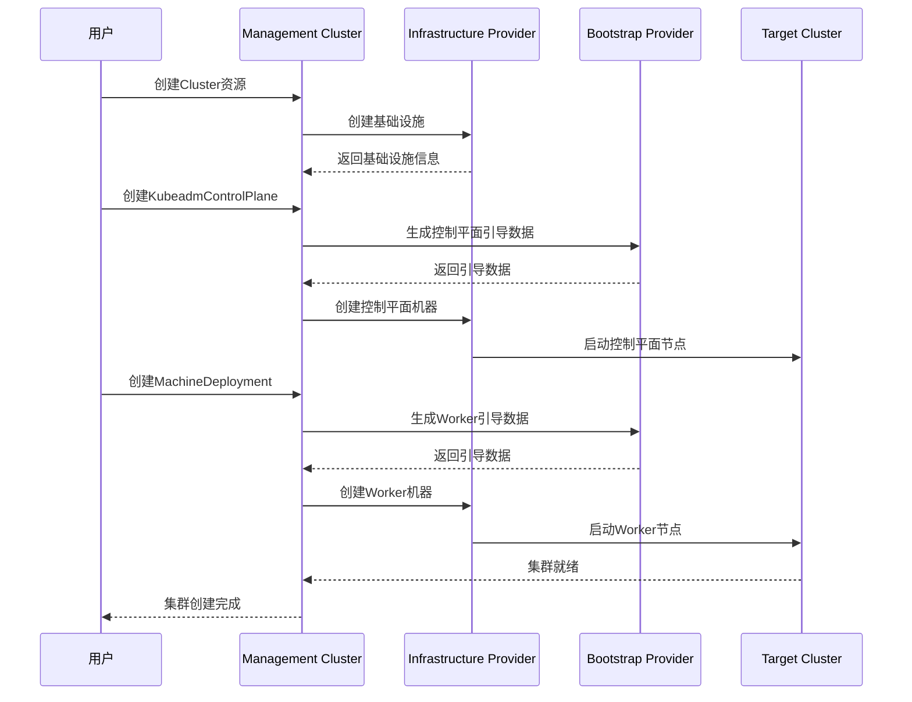

# cluster-api
## OpenShift Installer 中实现的 Cluster API 相关设计
### 一、核心发现
根据 Red Hat 官方文档明确指出：
> **Machine API 将基于上游 Cluster API 项目的主要资源与自定义 OpenShift Container Platform 资源相结合。**

这表明 OpenShift 的 Machine API 是直接从 Cluster API 派生而来的。
### 二、OpenShift Machine API 架构
```
┌─────────────────────────────────────────────────────────────────────────────────┐
│                    OpenShift Machine API (基于 Cluster API)                      │
├─────────────────────────────────────────────────────────────────────────────────┤
│                                                                                 │
│   ┌─────────────────────────────────────────────────────────────────────────┐   │
│   │                    核心资源 (源自 Cluster API)                           │   │
│   │  ┌─────────────────────────────────────────────────────────────────┐   │   │
│   │  │  Machine                                                         │   │   │
│   │  │  - 描述节点主机的基本单元                                         │   │   │
│   │  │  - 具有 providerSpec 规格                                        │   │   │
│   │  │  - API: machine.openshift.io/v1beta1                            │   │   │
│   │  └─────────────────────────────────────────────────────────────────┘   │   │
│   │  ┌─────────────────────────────────────────────────────────────────┐   │   │
│   │  │  MachineSet                                                      │   │   │
│   │  │  - 机器组，类似于 ReplicaSet                                      │   │   │
│   │  │  - 管理 Machine 的副本数                                         │   │   │
│   │  │  - API: machine.openshift.io/v1beta1                            │   │   │
│   │  └─────────────────────────────────────────────────────────────────┘   │   │
│   │  ┌─────────────────────────────────────────────────────────────────┐   │   │
│   │  │  MachineDeployment (隐含支持)                                    │   │   │
│   │  │  - 通过 MachineSet 实现滚动更新                                   │   │   │
│   │  └─────────────────────────────────────────────────────────────────┘   │   │
│   └─────────────────────────────────────────────────────────────────────────┘   │
│                                                                                 │
│   ┌─────────────────────────────────────────────────────────────────────────┐   │
│   │                    OpenShift 扩展资源                                   │   │
│   │  ┌─────────────────────────────────────────────────────────────────┐   │   │
│   │  │  MachineAutoscaler                                               │   │   │
│   │  │  - 自动扩展云中的机器                                             │   │   │
│   │  │  - 设置最小/最大扩展界限                                          │   │   │
│   │  └─────────────────────────────────────────────────────────────────┘   │   │
│   │  ┌─────────────────────────────────────────────────────────────────┐   │   │
│   │  │  ClusterAutoscaler                                               │   │   │
│   │  │  - 基于上游集群自动扩展项目                                       │   │   │
│   │  │  - 与 Machine API 集成                                           │   │   │
│   │  └─────────────────────────────────────────────────────────────────┘   │   │
│   │  ┌─────────────────────────────────────────────────────────────────┐   │   │
│   │  │  MachineHealthCheck                                              │   │   │
│   │  │  - 检测机器不健康状态                                             │   │   │
│   │  │  - 删除并生成新机器                                               │   │   │
│   │  └─────────────────────────────────────────────────────────────────┘   │   │
│   └─────────────────────────────────────────────────────────────────────────┘   │
│                                                                                 │
└─────────────────────────────────────────────────────────────────────────────────┘
```
### 三、Cluster API 标签的继承证据
OpenShift Machine API 资源中保留了 Cluster API 的标签前缀，这是最直接的继承证据：
```yaml
apiVersion: machine.openshift.io/v1beta1
kind: MachineSet
metadata:
  labels:
    # 注意：这些标签使用 cluster-api 前缀
    machine.openshift.io/cluster-api-cluster: <infrastructure_id>
    machine.openshift.io/cluster-api-machine-role: <role>
    machine.openshift.io/cluster-api-machine-type: <role>
    machine.openshift.io/cluster-api-machineset: <infrastructure_id>-<role>
spec:
  selector:
    matchLabels:
      machine.openshift.io/cluster-api-cluster: <infrastructure_id>
      machine.openshift.io/cluster-api-machineset: <infrastructure_id>-<role>
  template:
    metadata:
      labels:
        machine.openshift.io/cluster-api-cluster: <infrastructure_id>
        machine.openshift.io/cluster-api-machine-role: <role>
        machine.openshift.io/cluster-api-machine-type: <role>
        machine.openshift.io/cluster-api-machineset: <infrastructure_id>-<role>
```
### 四、OpenShift 与 Cluster API 的对比
```
┌─────────────────────────────────────────────────────────────────────────────────┐
│                    OpenShift Machine API vs Cluster API                          │
├───────────────────────────┬─────────────────────────────────────────────────────┤
│       Cluster API         │              OpenShift Machine API                  │
├───────────────────────────┼─────────────────────────────────────────────────────┤
│  cluster.x-k8s.io/v1beta1 │  machine.openshift.io/v1beta1                       │
│  (标准 API Group)          │  (OpenShift 定制 API Group)                         │
├───────────────────────────┼─────────────────────────────────────────────────────┤
│  Cluster CR               │  无直接对应 (使用 Infrastructure CR)                 │
│  (集群定义)                │                                                     │
├───────────────────────────┼─────────────────────────────────────────────────────┤
│  Machine CR               │  Machine CR                                         │
│  (节点抽象)                │  (节点抽象，相同概念)                                │
├───────────────────────────┼─────────────────────────────────────────────────────┤
│  MachineSet CR            │  MachineSet CR                                      │
│  (副本集管理)              │  (副本集管理，相同概念)                              │
├───────────────────────────┼─────────────────────────────────────────────────────┤
│  MachineDeployment CR     │  通过 MachineSet 实现                                │
│  (滚动更新)                │  (隐含支持)                                         │
├───────────────────────────┼─────────────────────────────────────────────────────┤
│  MachineHealthCheck CR    │  MachineHealthCheck CR                              │
│  (健康检查)                │  (健康检查，相同概念)                                │
├───────────────────────────┼─────────────────────────────────────────────────────┤
│  Infrastructure Provider  │  Platform ProviderSpec                              │
│  (如 AWSMachine)          │  (如 AWSMachineProviderConfig)                      │
├───────────────────────────┼─────────────────────────────────────────────────────┤
│  Bootstrap Provider       │  userDataSecret                                     │
│  (如 KubeadmConfig)       │  (Ignition 配置)                                    │
└───────────────────────────┴─────────────────────────────────────────────────────┘
```
### 五、OpenShift 特有的扩展
#### 5.1 平台特定的 ProviderSpec
OpenShift 为每个平台定义了特定的 ProviderSpec：

| 平台 | ProviderSpec Kind | API Group |
|------|------------------|-----------|
| AWS | AWSMachineProviderConfig | awsproviderconfig.openshift.io/v1beta1 |
| Azure | AzureMachineProviderSpec | azureproviderconfig.openshift.io/v1beta1 |
| GCP | GCPMachineProviderSpec | gcpproviderconfig.openshift.io/v1beta1 |
| vSphere | VSphereMachineProviderSpec | vsphereprovider.openshift.io/v1beta1 |
| Bare Metal | BareMetalMachineProviderSpec | metal3.io/v1alpha1 |
| OpenStack | OpenStackMachineProviderSpec | openstackproviderconfig.openshift.io/v1beta1 |
#### 5.2 Machine API Operator 架构
```
┌─────────────────────────────────────────────────────────────────────────────────┐
│                    Machine API Operator 架构                                     │
├─────────────────────────────────────────────────────────────────────────────────┤
│                                                                                 │
│   ┌─────────────────────────────────────────────────────────────────────────┐   │
│   │                    openshift-machine-api 命名空间                        │   │
│   │                                                                         │   │
│   │  ┌─────────────────┐  ┌─────────────────┐  ┌─────────────────┐        │   │
│   │  │ machine-api-    │  │ cluster-        │  │ machine-api-    │        │   │
│   │  │ operator        │  │ autoscaler-     │  │ controllers     │        │   │
│   │  │                 │  │ operator        │  │                 │        │   │
│   │  │ 部署和管理      │  │ 部署和管理      │  │ 核心控制器:     │        │   │
│   │  │ machine-api     │  │ 集群自动扩展器  │  │ - controller-   │        │   │
│   │  │ controllers     │  │                 │  │   manager       │        │   │
│   │  │                 │  │                 │  │ - machine-      │        │   │
│   │  │                 │  │                 │  │   controller    │        │   │
│   │  │                 │  │                 │  │ - nodelink-     │        │   │
│   │  │                 │  │                 │  │   controller    │        │   │
│   │  └─────────────────┘  └─────────────────┘  └─────────────────┘        │   │
│   │                                                                         │   │
│   │  ┌─────────────────────────────────────────────────────────────────┐   │   │
│   │  │                    CRD 资源                                      │   │   │
│   │  │  Machine │ MachineSet │ MachineAutoscaler │ ClusterAutoscaler  │   │   │
│   │  │  MachineHealthCheck │ BareMetalHost (裸机)                       │   │   │
│   │  └─────────────────────────────────────────────────────────────────┘   │   │
│   └─────────────────────────────────────────────────────────────────────────┘   │
│                                                                                 │
└─────────────────────────────────────────────────────────────────────────────────┘
```
### 六、OpenShift Installer 与 Machine API 的关系
```
┌─────────────────────────────────────────────────────────────────────────────────┐
│                    OpenShift Installer 与 Machine API 的关系                     │
├─────────────────────────────────────────────────────────────────────────────────┤
│                                                                                 │
│   ┌─────────────────────────────────────────────────────────────────────────┐   │
│   │                    安装阶段                                              │   │
│   │                                                                         │   │
│   │  install-config.yaml                                                    │   │
│   │       │                                                                 │   │
│   │       ▼                                                                 │   │
│   │  OpenShift Installer                                                    │   │
│   │       │                                                                 │   │
│   │       ├──► 生成 Terraform 配置 (云平台)                                 │   │
│   │       │    或 Bare Metal IPI 配置                                       │   │
│   │       │                                                                 │   │
│   │       ├──► 创建初始 MachineSet (Worker 节点)                            │   │
│   │       │    - 使用 Cluster API 兼容的标签                                │   │
│   │       │    - 使用平台特定的 ProviderSpec                                │   │
│   │       │                                                                 │   │
│   │       └──► 部署 Machine API Operator                                    │   │
│   │            - 安装后管理所有节点置备                                      │   │
│   │                                                                         │   │
│   └─────────────────────────────────────────────────────────────────────────┘   │
│                                                                                 │
│   ┌─────────────────────────────────────────────────────────────────────────┐   │
│   │                    安装后阶段                                            │   │
│   │                                                                         │   │
│   │  Machine API Operator                                                   │   │
│   │       │                                                                 │   │
│   │       ├──► 管理 Machine 生命周期                                        │   │
│   │       │    - 创建/删除/更新节点                                         │   │
│   │       │                                                                 │   │
│   │       ├──► 与 Cluster Autoscaler 集成                                   │   │
│   │       │    - 自动扩缩容                                                 │   │
│   │       │                                                                 │   │
│   │       └──► MachineHealthCheck                                           │   │
│   │            - 节点故障自动修复                                            │   │
│   │                                                                         │   │
│   └─────────────────────────────────────────────────────────────────────────┘   │
│                                                                                 │
└─────────────────────────────────────────────────────────────────────────────────┘
```
### 七、关键差异点
| 特性 | Cluster API | OpenShift Machine API |
|------|-------------|----------------------|
| **API Group** | `cluster.x-k8s.io` | `machine.openshift.io` |
| **设计理念** | 模块化、可扩展 | 一体化、企业级 |
| **Bootstrap** | KubeadmConfig 等 Provider | Ignition + userDataSecret |
| **基础设施抽象** | Infrastructure Provider 接口 | ProviderSpec 内嵌 |
| **控制平面管理** | KubeadmControlPlane | 由 Installer 直接管理 |
| **版本管理** | 无内置 | CVO 统一管理 |
### 八、总结
OpenShift Installer 中实现的 Cluster API 相关设计主要体现在：
1. **Machine API 是 Cluster API 的派生实现**
   - OpenShift 官方文档明确说明 Machine API 基于上游 Cluster API 项目
   - 保留了 `cluster-api` 标签前缀作为继承证据
2. **核心资源完全对应**
   - `Machine` - 节点抽象
   - `MachineSet` - 副本集管理
   - `MachineHealthCheck` - 健康检查
3. **OpenShift 特有扩展**
   - 定制 API Group (`machine.openshift.io`)
   - 平台特定的 ProviderSpec
   - 与 Cluster Autoscaler 深度集成
   - 与 CVO 版本管理集成
4. **设计差异**
   - OpenShift 采用一体化设计，将 Bootstrap 和 Infrastructure 集成到 ProviderSpec 中
   - Cluster API 采用模块化设计，通过 Provider 接口解耦
        

# Cluster API概念
## Cluster API概念及其作用
### 一、Cluster API定义
**Cluster API** 是Kubernetes社区的一个子项目，提供了一组声明式的API和工具，用于在多个基础设施提供商上创建、配置、管理和升级Kubernetes集群。

**核心理念**：使用Kubernetes风格的API来管理Kubernetes集群本身，实现"用Kubernetes管理Kubernetes"。
### 二、核心概念
#### 2.1 核心CRD资源
```go
// 1. Cluster - 集群资源
type Cluster struct {
    metav1.TypeMeta
    metav1.ObjectMeta
    Spec   ClusterSpec
    Status ClusterStatus
}

// 作用：定义一个Kubernetes集群的期望状态
// 包含：控制平面端点、网络配置、基础设施引用等

// 2. Machine - 机器资源
type Machine struct {
    metav1.TypeMeta
    metav1.ObjectMeta
    Spec   MachineSpec
    Status MachineStatus
}

// 作用：表示集群中的一个节点（物理机或虚拟机）
// 包含：节点角色、版本、引导配置、基础设施引用等

// 3. MachineDeployment - 机器部署资源
type MachineDeployment struct {
    metav1.TypeMeta
    metav1.ObjectMeta
    Spec   MachineDeploymentSpec
    Status MachineDeploymentStatus
}

// 作用：管理一组相同的Machine，类似于Deployment管理Pod
// 支持：滚动更新、扩缩容、回滚等

// 4. MachineSet - 机器集合资源
type MachineSet struct {
    metav1.TypeMeta
    metav1.ObjectMeta
    Spec   MachineSetSpec
    Status MachineSetStatus
}

// 作用：维护一组稳定的Machine副本
// 类似于ReplicaSet对Pod的管理

// 5. MachineHealthCheck - 机器健康检查
type MachineHealthCheck struct {
    metav1.TypeMeta
    metav1.ObjectMeta
    Spec   MachineHealthCheckSpec
    Status MachineHealthCheckStatus
}

// 作用：定义机器的健康检查规则
// 支持：自动修复不健康的机器
```
#### 2.2 Provider概念
Cluster API采用**Provider模式**，将集群管理分为三个层次：
```go
// 1. Infrastructure Provider（基础设施提供者）
// 负责管理底层基础设施资源
// 例如：AWS、Azure、GCP、vSphere、BareMetal等

// 接口定义
type InfrastructureProvider interface {
    // 创建集群基础设施
    CreateCluster(ctx context.Context, cluster *Cluster) error
    
    // 创建机器基础设施
    CreateMachine(ctx context.Context, machine *Machine) error
    
    // 删除集群基础设施
    DeleteCluster(ctx context.Context, cluster *Cluster) error
}

// 2. Bootstrap Provider（引导提供者）
// 负责生成节点引导配置
// 例如：Kubeadm、RKE2、Talos等

type BootstrapProvider interface {
    // 生成引导数据
    GenerateBootstrapData(ctx context.Context, machine *Machine) ([]byte, error)
}

// 3. Control Plane Provider（控制平面提供者）
// 负责管理控制平面组件
// 例如：KubeadmControlPlane、RKE2ControlPlane等

type ControlPlaneProvider interface {
    // 创建控制平面
    CreateControlPlane(ctx context.Context, cluster *Cluster) error
    
    // 升级控制平面
    UpgradeControlPlane(ctx context.Context, cluster *Cluster, version string) error
}
```
### 三、架构设计
#### 3.1 整体架构

```
┌─────────────────────────────────────────────────────────────┐
│                  Management Cluster                          │
│  ┌──────────────────────────────────────────────────────┐  │
│  │              Cluster API Controllers                  │  │
│  │  ┌────────────┐  ┌────────────┐  ┌────────────┐    │  │
│  │  │ Cluster    │  │ Machine    │  │ Machine    │    │  │
│  │  │ Controller │  │ Controller │  │ Deployment │    │  │
│  │  │            │  │            │  │ Controller │    │  │
│  │  └────────────┘  └────────────┘  └────────────┘    │  │
│  └──────────────────────────────────────────────────────┘  │
│  ┌──────────────────────────────────────────────────────┐  │
│  │              Provider Controllers                     │  │
│  │  ┌────────────┐  ┌────────────┐  ┌────────────┐    │  │
│  │  │ Infra      │  │ Bootstrap  │  │ Control    │    │  │
│  │  │ Provider   │  │ Provider   │  │ Plane      │    │  │
│  │  │ Controller │  │ Controller │  │ Provider   │    │  │
│  │  └────────────┘  └────────────┘  └────────────┘    │  │
│  └──────────────────────────────────────────────────────┘  │
│  ┌──────────────────────────────────────────────────────┐  │
│  │              Custom Resources (CRDs)                  │  │
│  │  • Cluster                                           │  │
│  │  • Machine                                           │  │
│  │  • MachineDeployment                                 │  │
│  │  • KubeadmControlPlane                               │  │
│  │  • AWSCluster, VSphereCluster, etc.                  │  │
│  └──────────────────────────────────────────────────────┘  │
└─────────────────────────────────────────────────────────────┘
                           ↓
                    管理多个目标集群
                           ↓
┌──────────────┐  ┌──────────────┐  ┌──────────────┐
│ Target       │  │ Target       │  │ Target       │
│ Cluster 1    │  │ Cluster 2    │  │ Cluster 3    │
│ (Workload)   │  │ (Workload)   │  │ (Workload)   │
└──────────────┘  └──────────────┘  └──────────────┘
```
#### 3.2 工作流程

### 四、主要作用
#### 4.1 声明式集群管理
```yaml
# 示例：声明式定义一个集群

# 1. 定义集群
apiVersion: cluster.x-k8s.io/v1beta1
kind: Cluster
metadata:
  name: my-cluster
spec:
  clusterNetwork:
    pods:
      cidrBlocks: ["10.244.0.0/16"]
    services:
      cidrBlocks: ["10.96.0.0/12"]
  controlPlaneEndpoint:
    host: "192.168.1.100"
    port: 6443
  infrastructureRef:
    apiVersion: infrastructure.cluster.x-k8s.io/v1beta1
    kind: VSphereCluster
    name: my-cluster

---
# 2. 定义控制平面
apiVersion: controlplane.cluster.x-k8s.io/v1beta1
kind: KubeadmControlPlane
metadata:
  name: my-cluster-control-plane
spec:
  replicas: 3
  version: v1.28.0
  machineTemplate:
    infrastructureRef:
      apiVersion: infrastructure.cluster.x-k8s.io/v1beta1
      kind: VSphereMachineTemplate
      name: control-plane
  kubeadmConfigSpec:
    clusterConfiguration:
      apiServer:
        extraArgs:
          authorization-mode: "Node,RBAC"
    initConfiguration:
      nodeRegistration:
        criSocket: "/var/run/containerd/containerd.sock"

---
# 3. 定义Worker节点
apiVersion: cluster.x-k8s.io/v1beta1
kind: MachineDeployment
metadata:
  name: my-cluster-workers
spec:
  replicas: 5
  selector:
    matchLabels:
      cluster.x-k8s.io/cluster-name: my-cluster
  template:
    spec:
      clusterName: my-cluster
      version: v1.28.0
      bootstrap:
        configRef:
          apiVersion: bootstrap.cluster.x-k8s.io/v1beta1
          kind: KubeadmConfigTemplate
          name: worker
      infrastructureRef:
        apiVersion: infrastructure.cluster.x-k8s.io/v1beta1
        kind: VSphereMachineTemplate
        name: worker
```
**作用**：
- 使用声明式API定义集群期望状态
- 自动协调实际状态与期望状态
- 支持GitOps工作流
#### 4.2 多云和多基础设施支持
```go
// 支持多种基础设施提供商
var InfrastructureProviders = []string{
    "aws",           // Amazon Web Services
    "azure",         // Microsoft Azure
    "gcp",           // Google Cloud Platform
    "vsphere",       // VMware vSphere
    "openstack",     // OpenStack
    "baremetal",     // Bare Metal
    "docker",        // Docker (用于测试)
    "byoh",          // Bring Your Own Host
}

// 作用：
// 1. 统一的API接口管理不同基础设施
// 2. 跨云平台迁移
// 3. 混合云部署
// 4. 避免厂商锁定
```
#### 4.3 自动化集群生命周期管理
```go
// 1. 自动扩缩容
func (r *MachineDeploymentReconciler) Reconcile(ctx context.Context, req ctrl.Request) {
    // 根据负载自动调整副本数
    if needScaleUp {
        deployment.Spec.Replicas = pointer.Int32Ptr(newReplicas)
    }
}

// 2. 自动修复
func (r *MachineHealthCheckReconciler) Reconcile(ctx context.Context, req ctrl.Request) {
    // 检测不健康的机器
    if !isHealthy(machine) {
        // 自动删除并重建
        r.Client.Delete(ctx, machine)
    }
}

// 3. 自动升级
func (r *ClusterReconciler) Reconcile(ctx context.Context, req ctrl.Request) {
    // 滚动升级控制平面
    if needUpgrade {
        r.upgradeControlPlane(cluster)
    }
}
```
#### 4.4 集群版本升级
```yaml
# 升级集群版本示例

# 1. 升级控制平面
apiVersion: controlplane.cluster.x-k8s.io/v1beta1
kind: KubeadmControlPlane
metadata:
  name: my-cluster-control-plane
spec:
  replicas: 3
  version: v1.29.0  # 从v1.28.0升级到v1.29.0
  
# Cluster API自动执行：
# 1. 逐个升级控制平面节点
# 2. 确保etcd健康
# 3. 验证API Server可用性
# 4. 滚动升级，零停机

---
# 2. 升级Worker节点
apiVersion: cluster.x-k8s.io/v1beta1
kind: MachineDeployment
metadata:
  name: my-cluster-workers
spec:
  replicas: 5
  template:
    spec:
      version: v1.29.0  # 升级Worker版本
      
# Cluster API自动执行：
# 1. 创建新版本节点
# 2. 驱逐旧节点上的Pod
# 3. 删除旧节点
# 4. 滚动升级，保证服务可用性
```
### 五、与传统安装方式对比
| 特性 | 传统安装方式 | Cluster API |
|------|------------|-------------|
| **管理方式** | 命令式 | 声明式 |
| **多集群管理** | 困难 | 原生支持 |
| **多云支持** | 需要不同工具 | 统一API |
| **自动化程度** | 需要脚本 | 内置自动化 |
| **升级流程** | 手动操作 | 自动滚动升级 |
| **故障恢复** | 手动修复 | 自动修复 |
| **可扩展性** | 有限 | 高度可扩展 |
| **GitOps支持** | 困难 | 原生支持 |
| **状态管理** | 分散 | 集中在Kubernetes |

### 六、在openFuyao中的应用
#### 6.1 架构集成
```go
// openFuyao使用Cluster API管理集群

// 1. Infrastructure Provider - UPI/IPI支持
type BareMetalCluster struct {
    // UPI场景：用户提供的基础设施
    // IPI场景：自动创建基础设施
}

// 2. Bootstrap Provider - 多操作系统支持
type UbuntuBootstrapProvider struct {
    // Ubuntu系统引导配置
}

type CentOSBootstrapProvider struct {
    // CentOS系统引导配置
}

type RHCOSBootstrapProvider struct {
    // RHCOS系统引导配置
}

// 3. Control Plane Provider - Kubeadm集成
type KubeadmControlPlane struct {
    // 使用Kubeadm管理控制平面
}
```
#### 6.2 生命周期管理
```go
// 使用Cluster API管理集群生命周期

// 1. 创建集群
func CreateCluster(config *InstallConfig) error {
    cluster := &clusterv1.Cluster{
        ObjectMeta: metav1.ObjectMeta{
            Name: config.Name,
        },
        Spec: clusterv1.ClusterSpec{
            // 集群配置
        },
    }
    return client.Create(ctx, cluster)
}

// 2. 扩容集群
func ScaleCluster(clusterName string, workerReplicas int) error {
    deployment := &clusterv1.MachineDeployment{}
    client.Get(ctx, client.ObjectKey{Name: clusterName + "-workers"}, deployment)
    
    deployment.Spec.Replicas = pointer.Int32Ptr(int32(workerReplicas))
    return client.Update(ctx, deployment)
}

// 3. 升级集群
func UpgradeCluster(clusterName string, version string) error {
    // 升级控制平面
    controlPlane := &controlplanev1.KubeadmControlPlane{}
    client.Get(ctx, client.ObjectKey{Name: clusterName + "-control-plane"}, controlPlane)
    
    controlPlane.Spec.Version = version
    client.Update(ctx, controlPlane)
    
    // 升级Worker节点
    deployment := &clusterv1.MachineDeployment{}
    client.Get(ctx, client.ObjectKey{Name: clusterName + "-workers"}, deployment)
    
    deployment.Spec.Template.Spec.Version = pointer.StringPtr(version)
    return client.Update(ctx, deployment)
}

// 4. 删除集群
func DeleteCluster(clusterName string) error {
    cluster := &clusterv1.Cluster{
        ObjectMeta: metav1.ObjectMeta{
            Name: clusterName,
        },
    }
    return client.Delete(ctx, cluster)
}
```
### 七、核心优势
#### 7.1 统一管理
```go
// 使用统一的API管理所有集群

// 列出所有集群
clusters := &clusterv1.ClusterList{}
client.List(ctx, clusters)

// 获取集群状态
for _, cluster := range clusters.Items {
    fmt.Printf("Cluster: %s, Status: %s\n", 
        cluster.Name, 
        cluster.Status.Phase)
}

// 跨云管理
awsClusters := filterByProvider(clusters, "aws")
azureClusters := filterByProvider(clusters, "azure")
```
#### 7.2 GitOps集成
```yaml
# GitOps工作流示例

# 1. 在Git仓库中定义集群
clusters/
├── production/
│   ├── cluster.yaml
│   ├── control-plane.yaml
│   └── workers.yaml
└── staging/
    ├── cluster.yaml
    ├── control-plane.yaml
    └── workers.yaml

# 2. 使用ArgoCD/FluxCD自动同步
apiVersion: argoproj.io/v1alpha1
kind: Application
metadata:
  name: production-cluster
spec:
  source:
    repoURL: https://github.com/org/clusters.git
    path: production
  destination:
    server: https://management-cluster.example.com
    namespace: clusters

# 3. Git提交自动触发集群变更
```
#### 7.3 可扩展性
```go
// 自定义Provider扩展

// 1. 自定义Infrastructure Provider
type MyCustomInfraProvider struct {
    // 实现InfrastructureProvider接口
}

// 2. 自定义Bootstrap Provider
type MyCustomBootstrapProvider struct {
    // 实现BootstrapProvider接口
}

// 3. 注册自定义Provider
func init() {
    provider.RegisterInfrastructureProvider("my-custom", &MyCustomInfraProvider{})
    provider.RegisterBootstrapProvider("my-custom", &MyCustomBootstrapProvider{})
}
```
### 八、总结
**Cluster API的核心价值**：
1. **标准化**：提供标准的Kubernetes风格API管理集群
2. **声明式**：使用声明式配置，简化运维
3. **可移植**：支持多云和混合云部署
4. **自动化**：内置自动化能力，减少人工干预
5. **可扩展**：Provider模式，易于扩展新功能
6. **生态集成**：与GitOps、监控、日志等工具无缝集成

**在openFuyao中的作用**：
1. 提供统一的集群管理接口
2. 支持UPI/IPI场景
3. 支持多操作系统
4. 实现自动化升级（配合CVO）
5. 简化集群生命周期管理
6. 支持大规模多集群管理

Cluster API是现代Kubernetes集群管理的最佳实践，openFuyao通过集成Cluster API，获得了强大的集群管理能力和良好的可扩展性。


# openFuyao Cluster API实现开发指南
## 一、开发环境准备
### 1.1 环境要求
```bash
# 1. Go环境
go version >= 1.21

# 2. Kubernetes集群（用于开发测试）
kubectl version >= 1.28

# 3. Controller Runtime
# 项目使用controller-runtime v0.16+

# 4. Cluster API
# 项目使用cluster-api v1.6+

# 5. 开发工具
- kubebuilder >= 3.14
- controller-gen
- kustomize
```
### 1.2 项目结构
```
openfuyao-cluster-api/
├── api/                          # API定义
│   ├── v1alpha1/                # API版本
│   │   ├── baremetalcluster_types.go
│   │   ├── baremetalmachine_types.go
│   │   ├── groupversion_info.go
│   │   └── zz_generated.deepcopy.go
│   └── v1beta1/
│       └── ...
├── controllers/                  # Controllers
│   ├── baremetalcluster_controller.go
│   ├── baremetalmachine_controller.go
│   └── suite_test.go
├── pkg/                          # 核心包
│   ├── cloud/                   # 云服务接口
│   │   ├── scope/
│   │   │   ├── cluster.go
│   │   │   └── machine.go
│   │   └── services/
│   │       ├── compute/
│   │       └── network/
│   ├── context/                 # 上下文
│   │   ├── cluster_context.go
│   │   └── machine_context.go
│   └── util/                    # 工具函数
│       ├── constants.go
│       └── util.go
├── config/                       # 配置文件
│   ├── crd/                     # CRD定义
│   ├── rbac/                    # RBAC配置
│   ├── manager/                 # Manager配置
│   └── samples/                 # 示例配置
├── hack/                         # 脚本
│   ├── boilerplate.go.txt
│   └── tools.go
├── main.go                       # 入口文件
├── Dockerfile                    # Docker构建
├── Makefile                      # Makefile
└── README.md
```
## 二、API定义实现
### 2.1 BareMetalCluster CRD定义
```go
// api/v1alpha1/baremetalcluster_types.go
package v1alpha1

import (
    metav1 "k8s.io/apimachinery/pkg/apis/meta/v1"
    clusterv1 "sigs.k8s.io/cluster-api/api/v1beta1"
)

// BareMetalClusterSpec defines the desired state of BareMetalCluster
type BareMetalClusterSpec struct {
    // ControlPlaneEndpoint represents the endpoint used to communicate with the control plane.
    // +optional
    ControlPlaneEndpoint clusterv1.APIEndpoint `json:"controlPlaneEndpoint"`

    // BaseDomain is the base domain for the cluster.
    // +kubebuilder:validation:Required
    BaseDomain string `json:"baseDomain"`

    // NetworkSpec encapsulates all things related to the network.
    // +optional
    NetworkSpec NetworkSpec `json:"networkSpec,omitempty"`

    // SSHSpec specifies SSH configuration for accessing nodes.
    // +kubebuilder:validation:Required
    SSHSpec SSHSpec `json:"sshSpec"`

    // ImageRegistry specifies the container image registry configuration.
    // +optional
    ImageRegistry ImageRegistrySpec `json:"imageRegistry,omitempty"`

    // UserProvidedDNS indicates whether DNS is provided by user.
    // +optional
    UserProvidedDNS bool `json:"userProvidedDNS,omitempty"`

    // UserProvidedLB indicates whether Load Balancer is provided by user.
    // +optional
    UserProvidedLB bool `json:"userProvidedLB,omitempty"`

    // ControlPlaneConfiguration specifies control plane configuration.
    // +optional
    ControlPlaneConfiguration ControlPlaneConfiguration `json:"controlPlaneConfiguration,omitempty"`
}

// BareMetalClusterStatus defines the observed state of BareMetalCluster
type BareMetalClusterStatus struct {
    // Ready denotes that the cluster is ready.
    // +optional
    Ready bool `json:"ready"`

    // Conditions defines current service state of the BareMetalCluster.
    // +optional
    Conditions clusterv1.Conditions `json:"conditions,omitempty"`

    // FailureDomains provides a list of failure domains.
    // +optional
    FailureDomains clusterv1.FailureDomains `json:"failureDomains,omitempty"`
}

// NetworkSpec defines network configuration
type NetworkSpec struct {
    // DNSDomain is the DNS domain for the cluster.
    // +optional
    DNSDomain string `json:"dnsDomain,omitempty"`

    // PodSubnet is the subnet for pods.
    // +optional
    PodSubnet string `json:"podSubnet,omitempty"`

    // ServiceSubnet is the subnet for services.
    // +optional
    ServiceSubnet string `json:"serviceSubnet,omitempty"`

    // DNSServers is a list of DNS servers.
    // +optional
    DNSServers []string `json:"dnsServers,omitempty"`
}

// SSHSpec defines SSH configuration
type SSHSpec struct {
    // User is the SSH user.
    // +kubebuilder:validation:Required
    User string `json:"user"`

    // PrivateKey is the SSH private key content.
    // +optional
    PrivateKey string `json:"privateKey,omitempty"`

    // PrivateKeyFile is the path to SSH private key file.
    // +optional
    PrivateKeyFile string `json:"privateKeyFile,omitempty"`
}

// ImageRegistrySpec defines image registry configuration
type ImageRegistrySpec struct {
    // Domain is the image registry domain.
    // +kubebuilder:validation:Required
    Domain string `json:"domain"`

    // Namespace is the image namespace.
    // +optional
    Namespace string `json:"namespace,omitempty"`
}

// ControlPlaneConfiguration defines control plane configuration
type ControlPlaneConfiguration struct {
    // Replicas is the number of control plane nodes.
    // +optional
    Replicas *int32 `json:"replicas,omitempty"`

    // MachineType is the machine type for control plane.
    // +optional
    MachineType string `json:"machineType,omitempty"`
}

//+kubebuilder:object:root=true
//+kubebuilder:subresource:status
//+kubebuilder:resource:path=baremetalclusters,scope=Namespaced,categories=cluster-api
//+kubebuilder:printcolumn:name="Cluster",type="string",JSONPath=".metadata.labels.cluster\\.x-k8s\\.io/cluster-name",description="Cluster"
//+kubebuilder:printcolumn:name="Ready",type="string",JSONPath=".status.ready",description="Cluster infrastructure is ready"
//+kubebuilder:printcolumn:name="Endpoint",type="string",JSONPath=".spec.controlPlaneEndpoint.host",description="API Endpoint"

// BareMetalCluster is the Schema for the baremetalclusters API
type BareMetalCluster struct {
    metav1.TypeMeta   `json:",inline"`
    metav1.ObjectMeta `json:"metadata,omitempty"`

    Spec   BareMetalClusterSpec   `json:"spec,omitempty"`
    Status BareMetalClusterStatus `json:"status,omitempty"`
}

//+kubebuilder:object:root=true

// BareMetalClusterList contains a list of BareMetalCluster
type BareMetalClusterList struct {
    metav1.TypeMeta `json:",inline"`
    metav1.ListMeta `json:"metadata,omitempty"`
    Items           []BareMetalCluster `json:"items"`
}

func init() {
    SchemeBuilder.Register(&BareMetalCluster{}, &BareMetalClusterList{})
}

// GetConditions returns the conditions of the BareMetalCluster
func (c *BareMetalCluster) GetConditions() clusterv1.Conditions {
    return c.Status.Conditions
}

// SetConditions sets the conditions of the BareMetalCluster
func (c *BareMetalCluster) SetConditions(conditions clusterv1.Conditions) {
    c.Status.Conditions = conditions
}
```
### 2.2 BareMetalMachine CRD定义
```go
// api/v1alpha1/baremetalmachine_types.go
package v1alpha1

import (
    metav1 "k8s.io/apimachinery/pkg/apis/meta/v1"
    clusterv1 "sigs.k8s.io/cluster-api/api/v1beta1"
    corev1 "k8s.io/api/core/v1"
)

// BareMetalMachineSpec defines the desired state of BareMetalMachine
type BareMetalMachineSpec struct {
    // Hostname is the hostname of the machine.
    // +kubebuilder:validation:Required
    Hostname string `json:"hostname"`

    // IPAddress is the IP address of the machine.
    // +kubebuilder:validation:Required
    IPAddress string `json:"ipAddress"`

    // Roles defines the roles of the machine (master, worker, etcd).
    // +optional
    Roles []string `json:"roles,omitempty"`

    // SSHSpec specifies SSH configuration for accessing the machine.
    // +optional
    SSHSpec *SSHSpec `json:"sshSpec,omitempty"`

    // ProviderID is the unique identifier for this machine.
    // +optional
    ProviderID *string `json:"providerID,omitempty"`
}

// BareMetalMachineStatus defines the observed state of BareMetalMachine
type BareMetalMachineStatus struct {
    // Ready denotes that the machine is ready.
    // +optional
    Ready bool `json:"ready"`

    // Conditions defines current service state of the BareMetalMachine.
    // +optional
    Conditions clusterv1.Conditions `json:"conditions,omitempty"`

    // FailureReason will be set in the event that there is a terminal problem
    // reconciling the Machine and will contain a succinct value suitable for machine interpretation.
    // +optional
    FailureReason *string `json:"failureReason,omitempty"`

    // FailureMessage will be set in the event that there is a terminal problem
    // reconciling the Machine and will contain a more verbose string suitable
    // for logging and human consumption.
    // +optional
    FailureMessage *string `json:"failureMessage,omitempty"`

    // NodeRef is a reference to the corresponding Node.
    // +optional
    NodeRef *corev1.ObjectReference `json:"nodeRef,omitempty"`
}

//+kubebuilder:object:root=true
//+kubebuilder:subresource:status
//+kubebuilder:resource:path=baremetalmachines,scope=Namespaced,categories=cluster-api
//+kubebuilder:printcolumn:name="Cluster",type="string",JSONPath=".metadata.labels.cluster\\.x-k8s\\.io/cluster-name",description="Cluster"
//+kubebuilder:printcolumn:name="Hostname",type="string",JSONPath=".spec.hostname",description="Hostname"
//+kubebuilder:printcolumn:name="IP",type="string",JSONPath=".spec.ipAddress",description="IP Address"
//+kubebuilder:printcolumn:name="Ready",type="string",JSONPath=".status.ready",description="Machine is ready"

// BareMetalMachine is the Schema for the baremetalmachines API
type BareMetalMachine struct {
    metav1.TypeMeta   `json:",inline"`
    metav1.ObjectMeta `json:"metadata,omitempty"`

    Spec   BareMetalMachineSpec   `json:"spec,omitempty"`
    Status BareMetalMachineStatus `json:"status,omitempty"`
}

//+kubebuilder:object:root=true

// BareMetalMachineList contains a list of BareMetalMachine
type BareMetalMachineList struct {
    metav1.TypeMeta `json:",inline"`
    metav1.ListMeta `json:"metadata,omitempty"`
    Items           []BareMetalMachine `json:"items"`
}

func init() {
    SchemeBuilder.Register(&BareMetalMachine{}, &BareMetalMachineList{})
}

// GetConditions returns the conditions of the BareMetalMachine
func (m *BareMetalMachine) GetConditions() clusterv1.Conditions {
    return m.Status.Conditions
}

// SetConditions sets the conditions of the BareMetalMachine
func (m *BareMetalMachine) SetConditions(conditions clusterv1.Conditions) {
    m.Status.Conditions = conditions
}
```
## 三、Controller实现
### 3.1 BareMetalCluster Controller
```go
// controllers/baremetalcluster_controller.go
package controllers

import (
    "context"
    "fmt"
    "time"

    "github.com/go-logr/logr"
    "github.com/pkg/errors"
    apierrors "k8s.io/apimachinery/pkg/api/errors"
    "k8s.io/apimachinery/pkg/runtime"
    "k8s.io/client-go/tools/record"
    ctrl "sigs.k8s.io/controller-runtime"
    "sigs.k8s.io/controller-runtime/pkg/client"
    "sigs.k8s.io/controller-runtime/pkg/controller/controllerutil"
    "sigs.k8s.io/controller-runtime/pkg/handler"
    "sigs.k8s.io/controller-runtime/pkg/source"

    clusterv1 "sigs.k8s.io/cluster-api/api/v1beta1"
    "sigs.k8s.io/cluster-api/util"
    "sigs.k8s.io/cluster-api/util/annotations"
    "sigs.k8s.io/cluster-api/util/conditions"
    "sigs.k8s.io/cluster-api/util/patch"

    infrav1alpha1 "github.com/bocloud/openfuyao/api/v1alpha1"
    "github.com/bocloud/openfuyao/pkg/cloud/scope"
)

// BareMetalClusterReconciler reconciles a BareMetalCluster object
type BareMetalClusterReconciler struct {
    client.Client
    Log      logr.Logger
    Scheme   *runtime.Scheme
    Recorder record.EventRecorder
}

//+kubebuilder:rbac:groups=infrastructure.cluster.x-k8s.io,resources=baremetalclusters,verbs=get;list;watch;create;update;patch;delete
//+kubebuilder:rbac:groups=infrastructure.cluster.x-k8s.io,resources=baremetalclusters/status,verbs=get;update;patch
//+kubebuilder:rbac:groups=infrastructure.cluster.x-k8s.io,resources=baremetalclusters/finalizers,verbs=update
//+kubebuilder:rbac:groups=cluster.x-k8s.io,resources=clusters;clusters/status,verbs=get;list;watch
//+kubebuilder:rbac:groups="",resources=secrets,verbs=get;list;watch;create;update;patch;delete

func (r *BareMetalClusterReconciler) Reconcile(ctx context.Context, req ctrl.Request) (_ ctrl.Result, reterr error) {
    log := r.Log.WithValues("baremetalcluster", req.NamespacedName)

    // 1. Fetch the BareMetalCluster instance
    bareMetalCluster := &infrav1alpha1.BareMetalCluster{}
    if err := r.Client.Get(ctx, req.NamespacedName, bareMetalCluster); err != nil {
        if apierrors.IsNotFound(err) {
            return ctrl.Result{}, nil
        }
        return ctrl.Result{}, err
    }

    // 2. Fetch the Cluster
    cluster, err := util.GetOwnerCluster(ctx, r.Client, bareMetalCluster.ObjectMeta)
    if err != nil {
        return ctrl.Result{}, err
    }
    if cluster == nil {
        log.Info("Waiting for Cluster Controller to set OwnerRef on BareMetalCluster")
        return ctrl.Result{RequeueAfter: 10 * time.Second}, nil
    }

    // 3. Handle deleted clusters
    if !bareMetalCluster.DeletionTimestamp.IsZero() {
        return r.reconcileDelete(ctx, log, cluster, bareMetalCluster)
    }

    // 4. Handle normal reconciliation
    return r.reconcileNormal(ctx, log, cluster, bareMetalCluster)
}

func (r *BareMetalClusterReconciler) reconcileNormal(
    ctx context.Context,
    log logr.Logger,
    cluster *clusterv1.Cluster,
    bareMetalCluster *infrav1alpha1.BareMetalCluster,
) (ctrl.Result, error) {
    // 1. Create a helper for patching
    patchHelper, err := patch.NewHelper(bareMetalCluster, r.Client)
    if err != nil {
        return ctrl.Result{}, errors.Wrap(err, "failed to init patch helper")
    }

    // 2. Always attempt to Patch the BareMetalCluster object and status after each reconciliation.
    defer func() {
        if err := patchHelper.Patch(ctx, bareMetalCluster); err != nil {
            log.Error(err, "failed to patch BareMetalCluster")
        }
    }()

    // 3. Add finalizer if not exist
    if !controllerutil.ContainsFinalizer(bareMetalCluster, infrav1alpha1.ClusterFinalizer) {
        controllerutil.AddFinalizer(bareMetalCluster, infrav1alpha1.ClusterFinalizer)
    }

    // 4. Create cluster scope
    clusterScope, err := scope.NewClusterScope(scope.ClusterScopeParams{
        Client:           r.Client,
        Logger:           log,
        Cluster:          cluster,
        BareMetalCluster: bareMetalCluster,
    })
    if err != nil {
        return ctrl.Result{}, errors.Wrap(err, "failed to create cluster scope")
    }

    // 5. Reconcile cluster infrastructure
    if err := r.reconcileClusterInfrastructure(ctx, clusterScope); err != nil {
        conditions.MarkFalse(bareMetalCluster, clusterv1.ReadyCondition, infrav1alpha1.ClusterInfrastructureFailed, clusterv1.ConditionSeverityError, err.Error())
        return ctrl.Result{}, err
    }

    // 6. Mark cluster as ready
    bareMetalCluster.Status.Ready = true
    conditions.MarkTrue(bareMetalCluster, clusterv1.ReadyCondition)

    log.Info("Successfully reconciled BareMetalCluster")
    return ctrl.Result{}, nil
}

func (r *BareMetalClusterReconciler) reconcileDelete(
    ctx context.Context,
    log logr.Logger,
    cluster *clusterv1.Cluster,
    bareMetalCluster *infrav1alpha1.BareMetalCluster,
) (ctrl.Result, error) {
    log.Info("Reconciling BareMetalCluster delete")

    // 1. Create a helper for patching
    patchHelper, err := patch.NewHelper(bareMetalCluster, r.Client)
    if err != nil {
        return ctrl.Result{}, errors.Wrap(err, "failed to init patch helper")
    }

    // 2. Always attempt to Patch the BareMetalCluster object and status after each reconciliation.
    defer func() {
        if err := patchHelper.Patch(ctx, bareMetalCluster); err != nil {
            log.Error(err, "failed to patch BareMetalCluster")
        }
    }()

    // 3. Delete cluster infrastructure
    if err := r.deleteClusterInfrastructure(ctx, cluster, bareMetalCluster); err != nil {
        return ctrl.Result{}, err
    }

    // 4. Remove finalizer
    controllerutil.RemoveFinalizer(bareMetalCluster, infrav1alpha1.ClusterFinalizer)

    log.Info("Successfully deleted BareMetalCluster")
    return ctrl.Result{}, nil
}

func (r *BareMetalClusterReconciler) reconcileClusterInfrastructure(
    ctx context.Context,
    clusterScope *scope.ClusterScope,
) error {
    log := clusterScope.Logger

    // 1. Validate cluster configuration
    if err := r.validateCluster(clusterScope); err != nil {
        return errors.Wrap(err, "failed to validate cluster")
    }

    // 2. Reconcile network configuration
    if err := r.reconcileNetwork(ctx, clusterScope); err != nil {
        return errors.Wrap(err, "failed to reconcile network")
    }

    // 3. Reconcile load balancer (if not user provided)
    if !clusterScope.BareMetalCluster.Spec.UserProvidedLB {
        if err := r.reconcileLoadBalancer(ctx, clusterScope); err != nil {
            return errors.Wrap(err, "failed to reconcile load balancer")
        }
    }

    // 4. Reconcile DNS (if not user provided)
    if !clusterScope.BareMetalCluster.Spec.UserProvidedDNS {
        if err := r.reconcileDNS(ctx, clusterScope); err != nil {
            return errors.Wrap(err, "failed to reconcile DNS")
        }
    }

    log.Info("Cluster infrastructure reconciled successfully")
    return nil
}

func (r *BareMetalClusterReconciler) validateCluster(clusterScope *scope.ClusterScope) error {
    bareMetalCluster := clusterScope.BareMetalCluster

    // Validate control plane endpoint
    if bareMetalCluster.Spec.ControlPlaneEndpoint.Host == "" {
        return fmt.Errorf("control plane endpoint is required")
    }

    // Validate base domain
    if bareMetalCluster.Spec.BaseDomain == "" {
        return fmt.Errorf("base domain is required")
    }

    return nil
}

func (r *BareMetalClusterReconciler) reconcileNetwork(ctx context.Context, clusterScope *scope.ClusterScope) error {
    // UPI场景：网络由用户提供，直接返回成功
    // IPI场景：需要创建和配置网络
    return nil
}

func (r *BareMetalClusterReconciler) reconcileLoadBalancer(ctx context.Context, clusterScope *scope.ClusterScope) error {
    // IPI场景：创建和配置负载均衡器
    return nil
}

func (r *BareMetalClusterReconciler) reconcileDNS(ctx context.Context, clusterScope *scope.ClusterScope) error {
    // IPI场景：创建和配置DNS记录
    return nil
}

func (r *BareMetalClusterReconciler) deleteClusterInfrastructure(
    ctx context.Context,
    cluster *clusterv1.Cluster,
    bareMetalCluster *infrav1alpha1.BareMetalCluster,
) error {
    // UPI场景：不删除用户提供的基础设施
    // IPI场景：清理创建的基础设施
    return nil
}

// SetupWithManager sets up the controller with the Manager.
func (r *BareMetalClusterReconciler) SetupWithManager(mgr ctrl.Manager) error {
    return ctrl.NewControllerManagedBy(mgr).
        For(&infrav1alpha1.BareMetalCluster{}).
        WithEventFilter(predicates.ResourceNotPaused(r.Log)).
        WithEventFilter(predicates.ResourceIsNotExternallyManaged(r.Log)).
        Owns(&corev1.Secret{}).
        Watches(
            &source.Kind{Type: &clusterv1.Cluster{}},
            handler.EnqueueRequestsFromMapFunc(r.clusterToBareMetalCluster),
        ).
        Complete(r)
}

func (r *BareMetalClusterReconciler) clusterToBareMetalCluster(o client.Object) []ctrl.Request {
    cluster, ok := o.(*clusterv1.Cluster)
    if !ok {
        r.Log.Error(nil, "Expected a Cluster but got a %T", o)
        return nil
    }

    if cluster.Spec.InfrastructureRef == nil {
        return nil
    }

    if cluster.Spec.InfrastructureRef.GroupVersionKind().Group != infrav1alpha1.GroupVersion.Group ||
        cluster.Spec.InfrastructureRef.Kind != "BareMetalCluster" {
        return nil
    }

    return []ctrl.Request{
        {
            NamespacedName: client.ObjectKey{
                Namespace: cluster.Namespace,
                Name:      cluster.Spec.InfrastructureRef.Name,
            },
        },
    }
}
```
### 3.2 BareMetalMachine Controller
```go
// controllers/baremetalmachine_controller.go
package controllers

import (
    "context"
    "fmt"
    "time"

    "github.com/go-logr/logr"
    "github.com/pkg/errors"
    apierrors "k8s.io/apimachinery/pkg/api/errors"
    "k8s.io/apimachinery/pkg/runtime"
    "k8s.io/client-go/tools/record"
    ctrl "sigs.k8s.io/controller-runtime"
    "sigs.k8s.io/controller-runtime/pkg/client"
    "sigs.k8s.io/controller-runtime/pkg/controller/controllerutil"

    clusterv1 "sigs.k8s.io/cluster-api/api/v1beta1"
    "sigs.k8s.io/cluster-api/util"
    "sigs.k8s.io/cluster-api/util/conditions"
    "sigs.k8s.io/cluster-api/util/patch"

    infrav1alpha1 "github.com/bocloud/openfuyao/api/v1alpha1"
    "github.com/bocloud/openfuyao/pkg/cloud/scope"
    "github.com/bocloud/openfuyao/pkg/executor"
)

// BareMetalMachineReconciler reconciles a BareMetalMachine object
type BareMetalMachineReconciler struct {
    client.Client
    Log      logr.Logger
    Scheme   *runtime.Scheme
    Recorder record.EventRecorder
}

//+kubebuilder:rbac:groups=infrastructure.cluster.x-k8s.io,resources=baremetalmachines,verbs=get;list;watch;create;update;patch;delete
//+kubebuilder:rbac:groups=infrastructure.cluster.x-k8s.io,resources=baremetalmachines/status,verbs=get;update;patch
//+kubebuilder:rbac:groups=infrastructure.cluster.x-k8s.io,resources=baremetalmachines/finalizers,verbs=update
//+kubebuilder:rbac:groups=cluster.x-k8s.io,resources=machines;machines/status,verbs=get;list;watch
//+kubebuilder:rbac:groups="",resources=secrets,verbs=get;list;watch;create;update;patch;delete

func (r *BareMetalMachineReconciler) Reconcile(ctx context.Context, req ctrl.Request) (_ ctrl.Result, reterr error) {
    log := r.Log.WithValues("baremetalmachine", req.NamespacedName)

    // 1. Fetch the BareMetalMachine instance
    bareMetalMachine := &infrav1alpha1.BareMetalMachine{}
    if err := r.Client.Get(ctx, req.NamespacedName, bareMetalMachine); err != nil {
        if apierrors.IsNotFound(err) {
            return ctrl.Result{}, nil
        }
        return ctrl.Result{}, err
    }

    // 2. Fetch the Machine
    machine, err := util.GetOwnerMachine(ctx, r.Client, bareMetalMachine.ObjectMeta)
    if err != nil {
        return ctrl.Result{}, err
    }
    if machine == nil {
        log.Info("Waiting for Machine Controller to set OwnerRef on BareMetalMachine")
        return ctrl.Result{RequeueAfter: 10 * time.Second}, nil
    }

    // 3. Fetch the Cluster
    cluster, err := util.GetClusterFromMetadata(ctx, r.Client, bareMetalMachine.ObjectMeta)
    if err != nil {
        log.Info("BareMetalMachine is missing cluster label or cluster does not exist")
        return ctrl.Result{}, nil
    }
    if cluster == nil {
        log.Info("Waiting for Cluster to be ready")
        return ctrl.Result{RequeueAfter: 10 * time.Second}, nil
    }

    // 4. Fetch the BareMetalCluster
    bareMetalCluster := &infrav1alpha1.BareMetalCluster{}
    bareMetalClusterName := client.ObjectKey{
        Namespace: bareMetalMachine.Namespace,
        Name:      cluster.Spec.InfrastructureRef.Name,
    }
    if err := r.Client.Get(ctx, bareMetalClusterName, bareMetalCluster); err != nil {
        log.Info("Waiting for BareMetalCluster to be ready")
        return ctrl.Result{RequeueAfter: 10 * time.Second}, nil
    }

    // 5. Handle deleted machines
    if !bareMetalMachine.DeletionTimestamp.IsZero() {
        return r.reconcileDelete(ctx, log, cluster, bareMetalCluster, machine, bareMetalMachine)
    }

    // 6. Handle normal reconciliation
    return r.reconcileNormal(ctx, log, cluster, bareMetalCluster, machine, bareMetalMachine)
}

func (r *BareMetalMachineReconciler) reconcileNormal(
    ctx context.Context,
    log logr.Logger,
    cluster *clusterv1.Cluster,
    bareMetalCluster *infrav1alpha1.BareMetalCluster,
    machine *clusterv1.Machine,
    bareMetalMachine *infrav1alpha1.BareMetalMachine,
) (ctrl.Result, error) {
    // 1. Create a helper for patching
    patchHelper, err := patch.NewHelper(bareMetalMachine, r.Client)
    if err != nil {
        return ctrl.Result{}, errors.Wrap(err, "failed to init patch helper")
    }

    // 2. Always attempt to Patch the BareMetalMachine object and status after each reconciliation.
    defer func() {
        if err := patchHelper.Patch(ctx, bareMetalMachine); err != nil {
            log.Error(err, "failed to patch BareMetalMachine")
        }
    }()

    // 3. Add finalizer if not exist
    if !controllerutil.ContainsFinalizer(bareMetalMachine, infrav1alpha1.MachineFinalizer) {
        controllerutil.AddFinalizer(bareMetalMachine, infrav1alpha1.MachineFinalizer)
    }

    // 4. Create machine scope
    machineScope, err := scope.NewMachineScope(scope.MachineScopeParams{
        Client:           r.Client,
        Logger:           log,
        Cluster:          cluster,
        BareMetalCluster: bareMetalCluster,
        Machine:          machine,
        BareMetalMachine: bareMetalMachine,
    })
    if err != nil {
        return ctrl.Result{}, errors.Wrap(err, "failed to create machine scope")
    }

    // 5. Check if the infrastructure is ready
    if !bareMetalCluster.Status.Ready {
        log.Info("Waiting for BareMetalCluster to be ready")
        conditions.MarkFalse(bareMetalMachine, clusterv1.ReadyCondition, infrav1alpha1.WaitingForClusterInfrastructureReason, clusterv1.ConditionSeverityInfo, "")
        return ctrl.Result{RequeueAfter: 10 * time.Second}, nil
    }

    // 6. Reconcile machine
    if err := r.reconcileMachine(ctx, machineScope); err != nil {
        conditions.MarkFalse(bareMetalMachine, clusterv1.ReadyCondition, infrav1alpha1.MachineProvisionFailed, clusterv1.ConditionSeverityError, err.Error())
        return ctrl.Result{}, err
    }

    // 7. Mark machine as ready
    bareMetalMachine.Status.Ready = true
    conditions.MarkTrue(bareMetalMachine, clusterv1.ReadyCondition)

    log.Info("Successfully reconciled BareMetalMachine")
    return ctrl.Result{}, nil
}

func (r *BareMetalMachineReconciler) reconcileMachine(
    ctx context.Context,
    machineScope *scope.MachineScope,
) error {
    log := machineScope.Logger
    bareMetalMachine := machineScope.BareMetalMachine

    // 1. Validate machine configuration
    if err := r.validateMachine(machineScope); err != nil {
        return errors.Wrap(err, "failed to validate machine")
    }

    // 2. Connect to machine via SSH
    executor, err := r.connectToMachine(machineScope)
    if err != nil {
        return errors.Wrap(err, "failed to connect to machine")
    }
    defer executor.Close()

    // 3. Check if machine is already provisioned
    if bareMetalMachine.Spec.ProviderID != nil {
        // Verify machine is still accessible
        if err := r.verifyMachine(ctx, executor, machineScope); err != nil {
            return errors.Wrap(err, "failed to verify machine")
        }
        return nil
    }

    // 4. Provision machine
    if err := r.provisionMachine(ctx, executor, machineScope); err != nil {
        return errors.Wrap(err, "failed to provision machine")
    }

    // 5. Set ProviderID
    providerID := fmt.Sprintf("baremetal://%s", bareMetalMachine.Spec.IPAddress)
    bareMetalMachine.Spec.ProviderID = &providerID

    log.Info("Machine provisioned successfully")
    return nil
}

func (r *BareMetalMachineReconciler) validateMachine(machineScope *scope.MachineScope) error {
    bareMetalMachine := machineScope.BareMetalMachine

    if bareMetalMachine.Spec.Hostname == "" {
        return fmt.Errorf("hostname is required")
    }

    if bareMetalMachine.Spec.IPAddress == "" {
        return fmt.Errorf("IP address is required")
    }

    return nil
}

func (r *BareMetalMachineReconciler) connectToMachine(machineScope *scope.MachineScope) (*executor.SSHExecutor, error) {
    bareMetalMachine := machineScope.BareMetalMachine
    bareMetalCluster := machineScope.BareMetalCluster

    // Get SSH configuration
    sshSpec := bareMetalCluster.Spec.SSHSpec
    if bareMetalMachine.Spec.SSHSpec != nil {
        sshSpec = *bareMetalMachine.Spec.SSHSpec
    }

    // Get SSH private key
    var privateKey []byte
    var err error

    if sshSpec.PrivateKey != "" {
        privateKey = []byte(sshSpec.PrivateKey)
    } else if sshSpec.PrivateKeyFile != "" {
        privateKey, err = os.ReadFile(sshSpec.PrivateKeyFile)
        if err != nil {
            return nil, errors.Wrap(err, "failed to read SSH private key")
        }
    } else {
        return nil, fmt.Errorf("SSH private key is required")
    }

    // Create SSH executor
    return executor.NewSSHExecutor(
        bareMetalMachine.Spec.IPAddress,
        22,
        sshSpec.User,
        privateKey,
    )
}

func (r *BareMetalMachineReconciler) provisionMachine(
    ctx context.Context,
    executor *executor.SSHExecutor,
    machineScope *scope.MachineScope,
) error {
    log := machineScope.Logger

    // 1. Get bootstrap data
    bootstrapData, err := r.getBootstrapData(ctx, machineScope)
    if err != nil {
        return errors.Wrap(err, "failed to get bootstrap data")
    }

    // 2. Upload bootstrap script
    if err := executor.UploadData(bootstrapData, "/tmp/bootstrap.sh"); err != nil {
        return errors.Wrap(err, "failed to upload bootstrap script")
    }

    // 3. Execute bootstrap script
    output, err := executor.Execute("chmod +x /tmp/bootstrap.sh && /tmp/bootstrap.sh")
    if err != nil {
        log.Error(err, "Failed to execute bootstrap script", "output", output)
        return errors.Wrap(err, "failed to execute bootstrap script")
    }

    log.Info("Bootstrap script executed successfully", "output", output)
    return nil
}

func (r *BareMetalMachineReconciler) verifyMachine(
    ctx context.Context,
    executor *executor.SSHExecutor,
    machineScope *scope.MachineScope,
) error {
    // Verify machine is still accessible and healthy
    output, err := executor.Execute("systemctl is-active kubelet")
    if err != nil || strings.TrimSpace(output) != "active" {
        return fmt.Errorf("kubelet is not running")
    }

    return nil
}

func (r *BareMetalMachineReconciler) getBootstrapData(
    ctx context.Context,
    machineScope *scope.MachineScope,
) ([]byte, error) {
    machine := machineScope.Machine

    if machine.Spec.Bootstrap.DataSecretName == nil {
        return nil, fmt.Errorf("bootstrap data secret is not set")
    }

    secret := &corev1.Secret{}
    secretKey := client.ObjectKey{
        Namespace: machine.Namespace,
        Name:      *machine.Spec.Bootstrap.DataSecretName,
    }

    if err := r.Client.Get(ctx, secretKey, secret); err != nil {
        return nil, errors.Wrap(err, "failed to get bootstrap data secret")
    }

    data, ok := secret.Data["value"]
    if !ok {
        return nil, fmt.Errorf("bootstrap data secret does not contain 'value' key")
    }

    return data, nil
}

func (r *BareMetalMachineReconciler) reconcileDelete(
    ctx context.Context,
    log logr.Logger,
    cluster *clusterv1.Cluster,
    bareMetalCluster *infrav1alpha1.BareMetalCluster,
    machine *clusterv1.Machine,
    bareMetalMachine *infrav1alpha1.BareMetalMachine,
) (ctrl.Result, error) {
    log.Info("Reconciling BareMetalMachine delete")

    // 1. Create a helper for patching
    patchHelper, err := patch.NewHelper(bareMetalMachine, r.Client)
    if err != nil {
        return ctrl.Result{}, errors.Wrap(err, "failed to init patch helper")
    }

    // 2. Always attempt to Patch the BareMetalMachine object and status after each reconciliation.
    defer func() {
        if err := patchHelper.Patch(ctx, bareMetalMachine); err != nil {
            log.Error(err, "failed to patch BareMetalMachine")
        }
    }()

    // 3. Delete machine (UPI场景：不删除物理机器)
    // IPI场景：可以执行kubeadm reset等清理操作

    // 4. Remove finalizer
    controllerutil.RemoveFinalizer(bareMetalMachine, infrav1alpha1.MachineFinalizer)

    log.Info("Successfully deleted BareMetalMachine")
    return ctrl.Result{}, nil
}

// SetupWithManager sets up the controller with the Manager.
func (r *BareMetalMachineReconciler) SetupWithManager(mgr ctrl.Manager) error {
    return ctrl.NewControllerManagedBy(mgr).
        For(&infrav1alpha1.BareMetalMachine{}).
        WithEventFilter(predicates.ResourceNotPaused(r.Log)).
        Owns(&corev1.Secret{}).
        Complete(r)
}
```
## 四、Scope实现
### 4.1 ClusterScope
```go
// pkg/cloud/scope/cluster.go
package scope

import (
    "context"

    "github.com/go-logr/logr"
    "k8s.io/apimachinery/pkg/types"
    "k8s.io/utils/pointer"
    "sigs.k8s.io/controller-runtime/pkg/client"

    clusterv1 "sigs.k8s.io/cluster-api/api/v1beta1"

    infrav1alpha1 "github.com/bocloud/openfuyao/api/v1alpha1"
)

// ClusterScopeParams defines the input parameters used to create a new ClusterScope.
type ClusterScopeParams struct {
    Client           client.Client
    Logger           logr.Logger
    Cluster          *clusterv1.Cluster
    BareMetalCluster *infrav1alpha1.BareMetalCluster
}

// ClusterScope defines a scope defined around a cluster.
type ClusterScope struct {
    logr.Logger
    Client           client.Client
    Cluster          *clusterv1.Cluster
    BareMetalCluster *infrav1alpha1.BareMetalCluster
}

// NewClusterScope creates a new ClusterScope from the supplied parameters.
func NewClusterScope(params ClusterScopeParams) (*ClusterScope, error) {
    if params.Client == nil {
        return nil, fmt.Errorf("client is required when creating a ClusterScope")
    }
    if params.Cluster == nil {
        return nil, fmt.Errorf("cluster is required when creating a ClusterScope")
    }
    if params.BareMetalCluster == nil {
        return nil, fmt.Errorf("bare metal cluster is required when creating a ClusterScope")
    }
    if params.Logger == nil {
        params.Logger = logr.Discard()
    }

    return &ClusterScope{
        Logger:           params.Logger,
        Client:           params.Client,
        Cluster:          params.Cluster,
        BareMetalCluster: params.BareMetalCluster,
    }, nil
}

// Name returns the BareMetalCluster name.
func (s *ClusterScope) Name() string {
    return s.BareMetalCluster.Name
}

// Namespace returns the BareMetalCluster namespace.
func (s *ClusterScope) Namespace() string {
    return s.BareMetalCluster.Namespace
}

// InfraClusterName returns the BareMetalCluster name.
func (s *ClusterScope) InfraClusterName() string {
    return s.BareMetalCluster.Name
}

// ControlPlaneEndpoint returns the BareMetalCluster control plane endpoint.
func (s *ClusterScope) ControlPlaneEndpoint() clusterv1.APIEndpoint {
    return s.BareMetalCluster.Spec.ControlPlaneEndpoint
}

// SetControlPlaneEndpoint sets the BareMetalCluster control plane endpoint.
func (s *ClusterScope) SetControlPlaneEndpoint(endpoint clusterv1.APIEndpoint) {
    s.BareMetalCluster.Spec.ControlPlaneEndpoint = endpoint
}

// BaseDomain returns the base domain.
func (s *ClusterScope) BaseDomain() string {
    return s.BareMetalCluster.Spec.BaseDomain
}

// NetworkSpec returns the network spec.
func (s *ClusterScope) NetworkSpec() *infrav1alpha1.NetworkSpec {
    return &s.BareMetalCluster.Spec.NetworkSpec
}

// SSHSpec returns the SSH spec.
func (s *ClusterScope) SSHSpec() *infrav1alpha1.SSHSpec {
    return &s.BareMetalCluster.Spec.SSHSpec
}

// ImageRegistry returns the image registry spec.
func (s *ClusterScope) ImageRegistry() *infrav1alpha1.ImageRegistrySpec {
    return &s.BareMetalCluster.Spec.ImageRegistry
}

// UserProvidedDNS returns whether DNS is user provided.
func (s *ClusterScope) UserProvidedDNS() bool {
    return s.BareMetalCluster.Spec.UserProvidedDNS
}

// UserProvidedLB returns whether load balancer is user provided.
func (s *ClusterScope) UserProvidedLB() bool {
    return s.BareMetalCluster.Spec.UserProvidedLB
}

// PatchObject persists the cluster configuration and status.
func (s *ClusterScope) PatchObject() error {
    return s.Client.Patch(context.TODO(), s.BareMetalCluster)
}

// Close closes the current scope persisting the cluster configuration and status.
func (s *ClusterScope) Close() error {
    return s.PatchObject()
}

// AdditionalLabels returns the additional labels for the cluster.
func (s *ClusterScope) AdditionalLabels() map[string]string {
    return s.BareMetalCluster.Spec.AdditionalLabels
}

// SetFailureDomains sets the failure domains.
func (s *ClusterScope) SetFailureDomains(fd clusterv1.FailureDomains) {
    s.BareMetalCluster.Status.FailureDomains = fd
}
```
### 4.2 MachineScope
```go
// pkg/cloud/scope/machine.go
package scope

import (
    "context"
    "fmt"

    "github.com/go-logr/logr"
    "sigs.k8s.io/controller-runtime/pkg/client"

    clusterv1 "sigs.k8s.io/cluster-api/api/v1beta1"

    infrav1alpha1 "github.com/bocloud/openfuyao/api/v1alpha1"
)

// MachineScopeParams defines the input parameters used to create a new MachineScope.
type MachineScopeParams struct {
    Client           client.Client
    Logger           logr.Logger
    Cluster          *clusterv1.Cluster
    BareMetalCluster *infrav1alpha1.BareMetalCluster
    Machine          *clusterv1.Machine
    BareMetalMachine *infrav1alpha1.BareMetalMachine
}

// MachineScope defines a scope defined around a machine.
type MachineScope struct {
    logr.Logger
    Client           client.Client
    Cluster          *clusterv1.Cluster
    BareMetalCluster *infrav1alpha1.BareMetalCluster
    Machine          *clusterv1.Machine
    BareMetalMachine *infrav1alpha1.BareMetalMachine
}

// NewMachineScope creates a new MachineScope from the supplied parameters.
func NewMachineScope(params MachineScopeParams) (*MachineScope, error) {
    if params.Client == nil {
        return nil, fmt.Errorf("client is required when creating a MachineScope")
    }
    if params.Cluster == nil {
        return nil, fmt.Errorf("cluster is required when creating a MachineScope")
    }
    if params.BareMetalCluster == nil {
        return nil, fmt.Errorf("bare metal cluster is required when creating a MachineScope")
    }
    if params.Machine == nil {
        return nil, fmt.Errorf("machine is required when creating a MachineScope")
    }
    if params.BareMetalMachine == nil {
        return nil, fmt.Errorf("bare metal machine is required when creating a MachineScope")
    }
    if params.Logger == nil {
        params.Logger = logr.Discard()
    }

    return &MachineScope{
        Logger:           params.Logger,
        Client:           params.Client,
        Cluster:          params.Cluster,
        BareMetalCluster: params.BareMetalCluster,
        Machine:          params.Machine,
        BareMetalMachine: params.BareMetalMachine,
    }, nil
}

// Name returns the BareMetalMachine name.
func (m *MachineScope) Name() string {
    return m.BareMetalMachine.Name
}

// Namespace returns the BareMetalMachine namespace.
func (m *MachineScope) Namespace() string {
    return m.BareMetalMachine.Namespace
}

// IsControlPlane returns true if the machine is a control plane.
func (m *MachineScope) IsControlPlane() bool {
    return util.IsControlPlaneMachine(m.Machine)
}

// Role returns the machine role from the labels.
func (m *MachineScope) Role() string {
    if util.IsControlPlaneMachine(m.Machine) {
        return "control-plane"
    }
    return "worker"
}

// GetProviderID returns the BareMetalMachine providerID.
func (m *MachineScope) GetProviderID() *string {
    return m.BareMetalMachine.Spec.ProviderID
}

// SetProviderID sets the BareMetalMachine providerID.
func (m *MachineScope) SetProviderID(v string) {
    m.BareMetalMachine.Spec.ProviderID = pointer.StringPtr(v)
}

// GetInstanceID returns the BareMetalMachine instance ID.
func (m *MachineScope) GetInstanceID() *string {
    return m.BareMetalMachine.Spec.InstanceID
}

// SetInstanceID sets the BareMetalMachine instance ID.
func (m *MachineScope) SetInstanceID(v string) {
    m.BareMetalMachine.Spec.InstanceID = pointer.StringPtr(v)
}

// Hostname returns the hostname.
func (m *MachineScope) Hostname() string {
    return m.BareMetalMachine.Spec.Hostname
}

// IPAddress returns the IP address.
func (m *MachineScope) IPAddress() string {
    return m.BareMetalMachine.Spec.IPAddress
}

// Roles returns the roles.
func (m *MachineScope) Roles() []string {
    return m.BareMetalMachine.Spec.Roles
}

// SSHSpec returns the SSH spec.
func (m *MachineScope) SSHSpec() *infrav1alpha1.SSHSpec {
    if m.BareMetalMachine.Spec.SSHSpec != nil {
        return m.BareMetalMachine.Spec.SSHSpec
    }
    return &m.BareMetalCluster.Spec.SSHSpec
}

// PatchObject persists the machine configuration and status.
func (m *MachineScope) PatchObject() error {
    return m.Client.Patch(context.TODO(), m.BareMetalMachine)
}

// Close closes the current scope persisting the machine configuration and status.
func (m *MachineScope) Close() error {
    return m.PatchObject()
}

// SetReady sets the BareMetalMachine Ready field to true.
func (m *MachineScope) SetReady() {
    m.BareMetalMachine.Status.Ready = true
}

// SetNotReady sets the BareMetalMachine Ready field to false.
func (m *MachineScope) SetNotReady() {
    m.BareMetalMachine.Status.Ready = false
}

// SetFailureMessage sets the BareMetalMachine failure message.
func (m *MachineScope) SetFailureMessage(v string) {
    m.BareMetalMachine.Status.FailureMessage = pointer.StringPtr(v)
}

// SetFailureReason sets the BareMetalMachine failure reason.
func (m *MachineScope) SetFailureReason(v string) {
    m.BareMetalMachine.Status.FailureReason = pointer.StringPtr(v)
}
```
## 五、开发最佳实践
### 5.1 Controller开发规范
```go
// 1. 使用Reconcile循环模式
func (r *Reconciler) Reconcile(ctx context.Context, req ctrl.Request) (ctrl.Result, error) {
    // 1. 获取资源
    // 2. 检查删除状态
    // 3. 正常协调逻辑
    // 4. 更新状态
}

// 2. 使用Patch Helper
patchHelper, err := patch.NewHelper(resource, r.Client)
if err != nil {
    return ctrl.Result{}, err
}
defer func() {
    if err := patchHelper.Patch(ctx, resource); err != nil {
        log.Error(err, "failed to patch resource")
    }
}()

// 3. 使用Conditions
conditions.MarkTrue(resource, clusterv1.ReadyCondition)
conditions.MarkFalse(resource, clusterv1.ReadyCondition, "Reason", clusterv1.ConditionSeverityError, "message")

// 4. 使用Finalizers
if !controllerutil.ContainsFinalizer(resource, "finalizer") {
    controllerutil.AddFinalizer(resource, "finalizer")
}
```
### 5.2 测试指南
```go
// controllers/suite_test.go
package controllers

import (
    "context"
    "path/filepath"
    "testing"

    . "github.com/onsi/ginkgo/v2"
    . "github.com/onsi/gomega"
    "k8s.io/client-go/kubernetes/scheme"
    "k8s.io/client-go/rest"
    "sigs.k8s.io/controller-runtime/pkg/client"
    "sigs.k8s.io/controller-runtime/pkg/envtest"
    logf "sigs.k8s.io/controller-runtime/pkg/log"
    "sigs.k8s.io/controller-runtime/pkg/log/zap"

    clusterv1 "sigs.k8s.io/cluster-api/api/v1beta1"
    infrav1alpha1 "github.com/bocloud/openfuyao/api/v1alpha1"
)

var (
    cfg       *rest.Config
    k8sClient client.Client
    testEnv   *envtest.Environment
)

func TestControllers(t *testing.T) {
    RegisterFailHandler(Fail)
    RunSpecs(t, "Controller Suite")
}

var _ = BeforeSuite(func() {
    logf.SetLogger(zap.New(zap.WriteTo(GinkgoWriter), zap.UseDevMode(true)))

    By("bootstrapping test environment")
    testEnv = &envtest.Environment{
        CRDDirectoryPaths: []string{
            filepath.Join("..", "config", "crd", "bases"),
        },
        ErrorIfCRDPathMissing: true,
    }

    var err error
    cfg, err = testEnv.Start()
    Expect(err).NotTo(HaveOccurred())
    Expect(cfg).NotTo(BeNil())

    err = infrav1alpha1.AddToScheme(scheme.Scheme)
    Expect(err).NotTo(HaveOccurred())

    err = clusterv1.AddToScheme(scheme.Scheme)
    Expect(err).NotTo(HaveOccurred())

    k8sClient, err = client.New(cfg, client.Options{Scheme: scheme.Scheme})
    Expect(err).NotTo(HaveOccurred())
    Expect(k8sClient).NotTo(BeNil())
})

var _ = AfterSuite(func() {
    By("tearing down the test environment")
    err := testEnv.Stop()
    Expect(err).NotTo(HaveOccurred())
})
```
### 5.3 部署配置
```yaml
# config/manager/manager.yaml
apiVersion: apps/v1
kind: Deployment
metadata:
  name: controller-manager
  namespace: system
spec:
  template:
    spec:
      containers:
      - command:
        - /manager
        args:
        - --leader-elect
        image: controller:latest
        name: manager
        resources:
          limits:
            cpu: 100m
            memory: 30Mi
          requests:
            cpu: 100m
            memory: 20Mi
      terminationGracePeriodSeconds: 10
```
## 六、总结
本开发指南提供了基于Cluster API的完整实现框架，包括：

1. **API定义**：完整的CRD定义和验证规则
2. **Controller实现**：标准的Reconcile循环和状态管理
3. **Scope设计**：封装资源和操作上下文
4. **最佳实践**：代码规范和测试指南

开发者可以基于此框架快速实现自定义的Infrastructure Provider，支持UPI/IPI场景和多操作系统。

        
