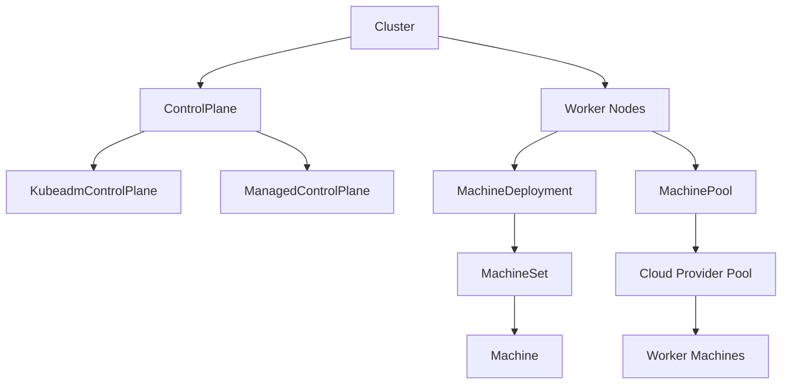

# MachinePool 
**Cluster API 的 MachinePool 是一种实验性功能，用于将云厂商的原生弹性伸缩能力（如 AWS ASG、Azure VMSS、GCP MIG）直接引入 CAPI，使得工作节点的生命周期管理可以在“池”级别完成，而不是逐台机器管理。它简化了扩缩容和升级操作，尤其适合大规模集群。**

## 📌 什么是 MachinePool
- **定义**：MachinePool 是 CAPI 的一个资源对象，代表一组工作节点。  
- **核心 API**：指定副本数、Kubernetes 版本、bootstrap 模板、基础设施引用。  
- **Provider API**：由具体云厂商实现，如 AWSMachinePool、AzureMachinePool、GCPManagedMachinePool 等。  
- **控制器职责**：协调 CAPI 与 Provider 的实现，确保副本数、节点状态与集群一致。  [The Cluster API Book](https://cluster-api.sigs.k8s.io/tasks/experimental-features/machine-pools)

## 🔑 为什么需要 MachinePool
- **利用云厂商原生能力**：如 AWS ASG 自动替换故障节点，Azure VMSS 支持滚动升级。  
- **简化扩缩容与升级**：在池级别更新 Kubernetes 版本或模板，云厂商负责滚动替换。  
- **更适合大规模集群**：相比 MachineDeployment，MachinePool 更适合数百上千节点的场景。  [The Cluster API Book](https://cluster-api.sigs.k8s.io/tasks/experimental-features/machine-pools)

## ⚖️ MachinePool vs MachineDeployment
| **维度** | **MachineDeployment** | **MachinePool** |
|----------------|----------------------|----------------------|
| 管理粒度 | 单机/小规模 | 节点池/大规模 |
| 扩缩容 | CAPI 控制器逐台处理 | 云厂商原生伸缩能力 |
| 升级策略 | CAPI 控制器滚动升级 | 云厂商负责替换与升级 |
| 适用场景 | 中小规模集群 | 大规模、跨 AZ、托管服务 |

## ⚠️ 局限与风险
- **实验性功能**：目前仍处于 Beta，需要开启 `EXP_MACHINE_POOL` 特性门控。  
- **Provider 差异**：不同云厂商的实现不完全一致，迁移存在兼容性挑战。  
- **安全策略嵌入**：需要额外配置 OPA/Gatekeeper 等策略，避免自动扩缩容带来的合规风险。  [Github](https://github.com/kubernetes-sigs/cluster-api/blob/main/docs/proposals/20220209-machinepool-machines.md)

## 🚀 未来改进方向
- **统一契约治理**：减少 Provider API 差异，形成跨云一致性。  
- **与 ClusterClass 集成**：结合托管拓扑，实现更灵活的集群模板化管理。  
- **安全与合规标准化**：在 MachinePool 生命周期中嵌入统一的安全策略。  [Github](https://github.com/kubernetes-sigs/cluster-api/blob/main/docs/proposals/20220209-machinepool-machines.md)

总结来看，MachinePool 是 **CAPI 向云原生能力靠拢的重要一步**，它让集群扩缩容和升级更高效，但仍需解决 **Provider 差异、治理契约、安全合规** 等问题。你希望我进一步展开 **MachinePool 与 ClusterClass 的结合**，还是 **跨 Provider 的一致性治理**？

# MachinePool不管理控制面机器吗？
不会的。**MachinePool** 在 Cluster API 中只负责管理 **工作节点（worker nodes）**，它的设计初衷就是把云厂商的原生伸缩能力（如 AWS Auto Scaling Group、Azure VMSS、GCP MIG）引入到工作节点池的生命周期管理中。  

## 📌 控制面与 MachinePool 的关系
- **控制面管理**：控制面节点由 `KubeadmControlPlane` 或其他 ControlPlane CRD（如 `ManagedControlPlane`）负责，保证 API Server、etcd 等核心组件的高可用与升级。  
- **工作节点管理**：MachinePool 只管理工作节点池，负责副本数、版本、模板的统一配置。  
- **分工明确**：控制面和工作节点的生命周期管理在 CAPI 中是分离的，避免耦合。

## ⚖️ 对比
| **维度** | **ControlPlane (如 KubeadmControlPlane)** | **MachinePool** |
|----------------|----------------------|----------------------|
| 管理对象 | 控制面节点 (API Server, etcd) | 工作节点池 |
| 功能 | 高可用、升级、证书管理 | 扩缩容、滚动升级、云厂商原生伸缩 |
| 适用场景 | 小规模或多 AZ 控制面 | 大规模工作节点池 |

## 🚀 总结
- **MachinePool 不管理控制面机器**，它只负责工作节点池。  
- 控制面节点必须通过 **ControlPlane 资源** 来管理。  
- 在实际部署中，通常是 **ControlPlane + MachineDeployment/MachinePool** 的组合，分别负责控制面和工作节点的生命周期。  
## Cluster API 架构图
直观展示 **ControlPlane、MachineDeployment、MachinePool** 三者的关系：

📌 架构说明
- **Cluster**：顶层对象，定义集群整体。  
- **ControlPlane**：负责管理 API Server、etcd 等核心组件，常见实现有 `KubeadmControlPlane`。  
- **MachineDeployment**：传统方式管理工作节点，依赖 `MachineSet` 和 `Machine`。  
- **MachinePool**：实验性功能，利用云厂商原生伸缩能力管理工作节点池。  
- **分工明确**：ControlPlane 管理控制面节点，MachineDeployment/MachinePool 管理工作节点。  

这个图能帮助你快速理解：**Cluster 是顶层，ControlPlane 管理控制面，MachineDeployment 和 MachinePool 管理工作节点，但方式不同**。  
