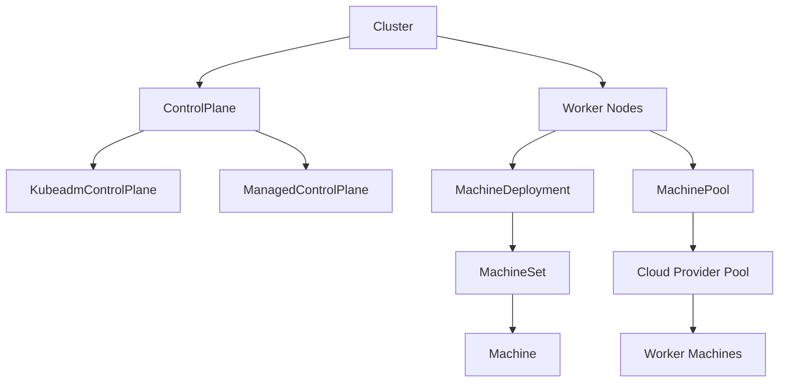

# Cluster-API MachinePool 功能列表及开发指南

## 一、MachinePool 概述
`MachinePool` 是 CAPI 的实验性资源 (`exp.cluster.x-k8s.io/v1beta1`)，用于管理**节点池**（如云厂商的 Managed Node Group、虚拟机规模集）。与 `MachineDeployment` 不同，`MachinePool` 不直接创建和管理单个 `Machine` 对象，而是将扩缩容、更新等操作委托给基础设施提供商 (Infrastructure Provider)。

## 二、核心功能列表
| 功能 | 说明 |
|------|------|
| **批量节点管理** | 通过云厂商 API 管理一组同质节点 (如 AWS ASG, Azure VMSS, GCP MIG) |
| **统一扩缩容** | 通过 `spec.replicas` 控制节点池大小 |
| **版本统一升级** | 修改 `spec.version` 触发节点池内所有节点升级 |
| **故障域支持** | 支持跨可用区分布 (`spec.failureDomains`) |
| **ProviderID 自动同步** | 基础设施提供商将节点 ProviderID 写入 `status.providerIDList`，CAPI 据此自动创建内部 `Machine` 对象 |
| **滚动更新策略** | 支持 `RollingUpdate` 策略配置 (`spec.rolloutStrategy`) |
| **Cluster Autoscaler 集成** | 支持标准 CA 标签/注解，实现自动弹性伸缩 |
| **标签与注解传播** | 支持将标签/注解同步到云厂商节点池配置及底层节点 |

## 三、架构与工作流程
```
MachinePool (CAPI Core)
   │
   ├── spec.bootstrap.configRef ──→ KubeadmConfig / Other Bootstrap
   │
   └── spec.infrastructureRef ──→ InfraMachinePool (Provider Specific, e.g., AWSManagedMachinePool)
                                      │
                                      └── Cloud Provider API (ASG, VMSS, etc.)
```
1. 用户创建 `MachinePool`，引用 `InfraMachinePool`。
2. `InfraMachinePool Controller` 调用云厂商 API 创建/更新节点池。
3. 节点池中的实例启动后，`InfraMachinePool Controller` 获取所有实例的 ProviderID。
4. `InfraMachinePool Controller` 将 ProviderID 列表写入 `status.providerIDList`。
5. `MachinePool Controller` 监听 `status.providerIDList` 变化，**为每个 ProviderID 自动创建对应的 `Machine` 对象**。
6. `Machine Controller` 将 `Machine` 与 `Node` 关联，完成节点注册。

## 四、开发指南 (Infrastructure Provider 侧)
开发 `MachinePool` 支持的核心在于实现 **`InfraMachinePool` CRD 及其 Controller**。

### 4.1 定义 InfraMachinePool CRD
```yaml
apiVersion: infrastructure.cluster.x-k8s.io/v1beta1
kind: MyInfraMachinePool
metadata:
  name: my-pool
spec:
  # 云厂商特定配置 (实例类型、镜像、子网等)
  instanceType: m5.large
  amiID: ami-123456
status:
  ready: true
  replicas: 3
  # 核心字段：必须填充所有运行中实例的 ProviderID
  providerIDList:
    - aws:///us-east-1a/i-123456
    - aws:///us-east-1b/i-789012
    - aws:///us-east-1c/i-345678
```

### 4.2 控制器核心调和逻辑
`InfraMachinePool Controller` 必须实现以下关键逻辑：

#### 1. 节点池生命周期管理
- **创建/更新**: 读取 `spec` 配置，调用云 API 创建节点池。处理版本升级（如更新 Launch Template 并触发滚动更新）。
- **删除**: 调用云 API 删除节点池，清理关联资源。

#### 2. ProviderID 同步 (最关键)
这是 `MachinePool` 与 `MachineDeployment` 最大的区别。Provider 必须定期从云 API 获取节点池中所有实例的 ID，并更新状态：
```go
func (r *MyInfraMachinePoolReconciler) reconcileProviderIDs(ctx context.Context, pool *infrav1.MyInfraMachinePool) error {
    instances, err := r.cloudClient.ListInstances(pool.Spec.PoolID)
    if err != nil {
        return err
    }

    var providerIDs []string
    for _, inst := range instances {
        // 格式必须严格遵循: <provider-name>:///<availability-zone>/<instance-id>
        providerIDs = append(providerIDs, fmt.Sprintf("aws:///%s/%s", inst.Zone, inst.ID))
    }
    
    pool.Status.ProviderIDList = providerIDs
    pool.Status.Replicas = int32(len(providerIDs))
    return nil
}
```

#### 3. 扩缩容处理
- 监听 `spec.replicas` 变化，调用云 API 调整节点池大小。
- **注意**: 如果集成了 Cluster Autoscaler (CA)，节点池大小可能由 CA 自动调整。Provider 需支持只读模式或正确处理 `replicas` 冲突。

#### 4. 状态上报
- `status.ready`: 节点池是否就绪。
- `status.replicas`: 当前运行的实例数。
- `status.failureMessage`: 错误信息。

### 4.3 与 Bootstrap Provider 集成
- `MachinePool` 的 Bootstrap 配置通常生成 User Data 或 Cloud Config。
- 基础设施提供商需将 Bootstrap 数据传递给节点池配置（如 AWS Launch Template 中的 User Data 字段）。

## 五、MachinePool vs MachineDeployment
| 维度 | MachineDeployment | MachinePool |
|------|-------------------|-------------|
| **管理对象** | 直接管理 `Machine` 对象 | 委托给 Infra Provider 管理节点池 |
| **适用场景** | 裸金属、自建 VM、需要精细控制 | 云厂商托管节点组 (EKS, AKS, GKE) |
| **滚动更新** | CAPI 负责逐个替换 `Machine` | 云厂商负责滚动更新 (如 ASG 实例刷新) |
| **扩缩容速度** | 较慢 (需逐个创建/删除 Machine) | 较快 (云厂商批量操作) |
| **ProviderID** | 由 `Machine Controller` 设置 | 由 Infra Provider 批量设置到 `status.providerIDList` |

## 六、注意事项与最佳实践
1. **实验性 API**: `MachinePool` 仍在 `exp` 组，API 字段可能在未来版本中发生变化。
2. **ProviderID 格式**: 必须严格遵循 `<provider-name>:///<availability-zone>/<instance-id>` 格式，否则 CAPI 无法正确关联节点。
3. **版本升级机制**: 节点池的版本升级通常依赖于云厂商的机制（如更新 Launch Template 版本），Infra Provider 需正确触发该机制并等待更新完成。
4. **Cluster Autoscaler 冲突**: 若启用 CA，需确保 Infra Provider 正确设置 CA 所需的标签和注解，避免 Controller 与 CA 争夺 `replicas` 控制权。建议在启用 CA 时将 `spec.replicas` 设置为 `nil` 或由 CA 完全接管。
5. **内部 Machine 对象**: 用户仍可通过 `kubectl get machines` 看到 `MachinePool` 创建的 `Machine` 对象，但这些对象由 `MachinePool Controller` 自动管理，**不应手动修改**。

# MachinePool 
**Cluster API 的 MachinePool 是一种实验性功能，用于将云厂商的原生弹性伸缩能力（如 AWS ASG、Azure VMSS、GCP MIG）直接引入 CAPI，使得工作节点的生命周期管理可以在“池”级别完成，而不是逐台机器管理。它简化了扩缩容和升级操作，尤其适合大规模集群。**

## 📌 什么是 MachinePool
- **定义**：MachinePool 是 CAPI 的一个资源对象，代表一组工作节点。  
- **核心 API**：指定副本数、Kubernetes 版本、bootstrap 模板、基础设施引用。  
- **Provider API**：由具体云厂商实现，如 AWSMachinePool、AzureMachinePool、GCPManagedMachinePool 等。  
- **控制器职责**：协调 CAPI 与 Provider 的实现，确保副本数、节点状态与集群一致。  [The Cluster API Book](https://cluster-api.sigs.k8s.io/tasks/experimental-features/machine-pools)

## 🔑 为什么需要 MachinePool
- **利用云厂商原生能力**：如 AWS ASG 自动替换故障节点，Azure VMSS 支持滚动升级。  
- **简化扩缩容与升级**：在池级别更新 Kubernetes 版本或模板，云厂商负责滚动替换。  
- **更适合大规模集群**：相比 MachineDeployment，MachinePool 更适合数百上千节点的场景。  [The Cluster API Book](https://cluster-api.sigs.k8s.io/tasks/experimental-features/machine-pools)

## ⚖️ MachinePool vs MachineDeployment
| **维度** | **MachineDeployment** | **MachinePool** |
|----------------|----------------------|----------------------|
| 管理粒度 | 单机/小规模 | 节点池/大规模 |
| 扩缩容 | CAPI 控制器逐台处理 | 云厂商原生伸缩能力 |
| 升级策略 | CAPI 控制器滚动升级 | 云厂商负责替换与升级 |
| 适用场景 | 中小规模集群 | 大规模、跨 AZ、托管服务 |

## ⚠️ 局限与风险
- **实验性功能**：目前仍处于 Beta，需要开启 `EXP_MACHINE_POOL` 特性门控。  
- **Provider 差异**：不同云厂商的实现不完全一致，迁移存在兼容性挑战。  
- **安全策略嵌入**：需要额外配置 OPA/Gatekeeper 等策略，避免自动扩缩容带来的合规风险。  [Github](https://github.com/kubernetes-sigs/cluster-api/blob/main/docs/proposals/20220209-machinepool-machines.md)

## 🚀 未来改进方向
- **统一契约治理**：减少 Provider API 差异，形成跨云一致性。  
- **与 ClusterClass 集成**：结合托管拓扑，实现更灵活的集群模板化管理。  
- **安全与合规标准化**：在 MachinePool 生命周期中嵌入统一的安全策略。  [Github](https://github.com/kubernetes-sigs/cluster-api/blob/main/docs/proposals/20220209-machinepool-machines.md)

总结来看，MachinePool 是 **CAPI 向云原生能力靠拢的重要一步**，它让集群扩缩容和升级更高效，但仍需解决 **Provider 差异、治理契约、安全合规** 等问题。你希望我进一步展开 **MachinePool 与 ClusterClass 的结合**，还是 **跨 Provider 的一致性治理**？

# MachinePool不管理控制面机器吗？
不会的。**MachinePool** 在 Cluster API 中只负责管理 **工作节点（worker nodes）**，它的设计初衷就是把云厂商的原生伸缩能力（如 AWS Auto Scaling Group、Azure VMSS、GCP MIG）引入到工作节点池的生命周期管理中。  

## 📌 控制面与 MachinePool 的关系
- **控制面管理**：控制面节点由 `KubeadmControlPlane` 或其他 ControlPlane CRD（如 `ManagedControlPlane`）负责，保证 API Server、etcd 等核心组件的高可用与升级。  
- **工作节点管理**：MachinePool 只管理工作节点池，负责副本数、版本、模板的统一配置。  
- **分工明确**：控制面和工作节点的生命周期管理在 CAPI 中是分离的，避免耦合。

## ⚖️ 对比
| **维度** | **ControlPlane (如 KubeadmControlPlane)** | **MachinePool** |
|----------------|----------------------|----------------------|
| 管理对象 | 控制面节点 (API Server, etcd) | 工作节点池 |
| 功能 | 高可用、升级、证书管理 | 扩缩容、滚动升级、云厂商原生伸缩 |
| 适用场景 | 小规模或多 AZ 控制面 | 大规模工作节点池 |

## 🚀 总结
- **MachinePool 不管理控制面机器**，它只负责工作节点池。  
- 控制面节点必须通过 **ControlPlane 资源** 来管理。  
- 在实际部署中，通常是 **ControlPlane + MachineDeployment/MachinePool** 的组合，分别负责控制面和工作节点的生命周期。  
## Cluster API 架构图
直观展示 **ControlPlane、MachineDeployment、MachinePool** 三者的关系：

📌 架构说明
- **Cluster**：顶层对象，定义集群整体。  
- **ControlPlane**：负责管理 API Server、etcd 等核心组件，常见实现有 `KubeadmControlPlane`。  
- **MachineDeployment**：传统方式管理工作节点，依赖 `MachineSet` 和 `Machine`。  
- **MachinePool**：实验性功能，利用云厂商原生伸缩能力管理工作节点池。  
- **分工明确**：ControlPlane 管理控制面节点，MachineDeployment/MachinePool 管理工作节点。  

这个图能帮助你快速理解：**Cluster 是顶层，ControlPlane 管理控制面，MachineDeployment 和 MachinePool 管理工作节点，但方式不同**。  

# 用户直接提供安装好的OS实例列表供安装k8s集群，此种场景是否可用MachinePool方案？
结论：不适用 MachinePool 方案

## 一、为什么不适用？
| 维度 | MachinePool 设计意图 | 用户场景需求 | 匹配度 |
|------|---------------------|--------------|--------|
| **管理粒度** | 管理"节点池"整体，不关心单个实例 | 需要精确控制每台已知机器 | ❌ 不匹配 |
| **实例发现** | Provider 从云 API 自动获取 `providerIDList` | 用户预先提供固定机器列表 (IP/主机名) | ❌ 不匹配 |
| **基础设施抽象** | 云厂商托管组 (ASG/VMSS/MIG) | 独立裸金属/虚拟机 | ❌ 不匹配 |
| **扩缩容方式** | 调用云 API 调整池大小，自动创建/销毁实例 | 使用用户提供的固定机器列表 | ❌ 不匹配 |

**核心矛盾**: MachinePool 假设基础设施是"池化"的，实例由云厂商动态创建/销毁；而用户的场景是"静态机器列表"，每台机器都是预先存在且已知的。

## 二、推荐方案：Machine + 自定义 Infrastructure Provider

### 2.1 架构设计
```
用户提供机器列表
    │
    ▼
┌─────────────────────────────────────────────────────────┐
│  CAPBM (Cluster API Provider Bare Metal)                │
│  ┌───────────────────────────────────────────────────┐  │
│  │ BareMetalCluster                                  │  │
│  │ BareMetalMachine (每台机器对应一个)                │  │
│  │   ├── spec.hostName: "node-01"                    │  │
│  │   ├── spec.ipAddress: "192.168.1.101"             │  │
│  │   └── spec.credentialsRef: Secret (用户名/密码)    │  │
│  └───────────────────────────────────────────────────┘  │
└─────────────────────────────────────────────────────────┘
    │
    ├── SSH 连接 → 环境检查 → 安装二进制 → 返回 ProviderID
    │
    ▼
┌─────────────────────────────────────────────────────────┐
│  CAPI Core                                              │
│  Machine ──→ KubeadmConfig ──→ 引导 K8s 组件安装         │
└─────────────────────────────────────────────────────────┘
```

### 2.2 用户输入转化
用户提供的机器列表：
```
node-01, 192.168.1.101, root, password123
node-02, 192.168.1.102, root, password123
node-03, 192.168.1.103, root, password123
```
转化为 CAPI 资源：
```yaml
# 为每台机器创建 BareMetalMachine
apiVersion: infrastructure.cluster.x-k8s.io/v1beta2
kind: BareMetalMachine
metadata:
  name: node-01
spec:
  hostName: "node-01"
  ipAddress: "192.168.1.101"
  credentialsRef:
    name: node-01-credentials
---
apiVersion: v1
kind: Secret
metadata:
  name: node-01-credentials
stringData:
  username: "root"
  password: "password123"
```

### 2.3 为什么此方案更合适？
| 优势 | 说明 |
|------|------|
| **精确控制** | 每台机器对应一个 `Machine` 对象，可独立管理 |
| **状态可观测** | 每台机器的安装进度、健康状态独立报告 |
| **扩缩容明确** | 添加/删除 `Machine` 对象即可，不会意外操作用户未提供的机器 |
| **故障隔离** | 单台机器故障不影响其他机器 |
| **符合 CAPI 设计** | 标准的 `Machine` + `Infrastructure Provider` 模式 |

## 三、实施建议
1. **开发 CAPBM Provider**: 实现 `BareMetalCluster` 和 `BareMetalMachine` CRD 及 Controller。
2. **机器预检**: Provider 通过 SSH 连接机器，检查 OS 版本、内核参数、网络连通性等。
3. **环境准备**: 安装 kubelet、kubeadm、containerd 等二进制文件（通过 `preKubeadmCommands` 或 Provider 内部逻辑）。
4. **引导加入**: 返回 `ProviderID`，CAPI 创建 `Machine`，Bootstrap Provider 生成 kubeadm 配置并执行 `kubeadm join`。

**总结**: 对于"用户提供固定机器列表"的场景，应使用标准的 **Machine/MachineDeployment + 自定义 Infrastructure Provider** 方案，而非 MachinePool。

# CAPBM (Cluster API Provider Bare Metal) 详细设计

## 一、架构总览
```
用户输入 (机器列表)
    │
    ├── node-01, 192.168.1.101, root, password123
    ├── node-02, 192.168.1.102, root, password123
    └── node-03, 192.168.1.103, root, password123
         │
         ▼
┌─────────────────────────────────────────────────────────────┐
│                    Management Cluster                       │
│                                                             │
│  ┌───────────────────────────────────────────────────────┐  │
│  │  CAPBM Provider (自研)                                │  │
│  │  ┌─────────────────────────────────────────────────┐  │  │
│  │  │ BareMetalCluster Controller                     │  │  │
│  │  │ - 管理集群级别基础设施状态                        │  │  │
│  │  └─────────────────────────────────────────────────┘  │  │
│  │  ┌─────────────────────────────────────────────────┐  │  │
│  │  │ BareMetalMachine Controller                     │  │  │
│  │  │ - SSH 连接管理                                  │  │  │
│  │  │ - 机器预检 (OS/网络/内核)                        │  │  │
│  │  │ - ProviderID 生成与状态上报                      │  │  │
│  │  └─────────────────────────────────────────────────┘  │  │
│  └───────────────────────────────────────────────────────┘  │
│                                                             │
│  ┌───────────────────────────────────────────────────────┐  │
│  │  CAPI Core (内置)                                     │  │
│  │  Machine Controller ──→ 关联 Machine 与 Node          │  │
│  └───────────────────────────────────────────────────────┘  │
│                                                             │
│  ┌───────────────────────────────────────────────────────┐  │
│  │  Kubeadm Bootstrap Provider (内置)                    │  │
│  │  - 生成 kubeadm init/join 配置                        │  │
│  │  - 执行 cloud-init/Ignition 脚本                      │  │
│  └───────────────────────────────────────────────────────┘ │
└────────────────────────────────────────────────────────────┘
         │
         ▼ (SSH + cloud-init)
┌────────────────────────────────────────────────────────────┐
│                    Workload Nodes (裸金属)                  │
│  ┌──────────┐  ┌──────────┐  ┌──────────┐                  │
│  │ node-01  │  │ node-02  │  │ node-03  │                  │
│  │ OS已安装 │  │ OS 已安装 │  │ OS 已安装 │                 │
│  │ SSH可达  │  │ SSH 可达  │  │ SSH 可达 │                  │
│  └──────────┘  └──────────┘  └──────────┘                  │
└────────────────────────────────────────────────────────────┘
```

## 二、CRD 设计

### 2.1 BareMetalCluster
```yaml
apiVersion: infrastructure.cluster.x-k8s.io/v1beta2
kind: BareMetalCluster
metadata:
  name: my-cluster
  namespace: default
spec:
  # 控制面端点 (用户提供的外部 LB 地址)
  controlPlaneEndpoint:
    host: "lb.example.com"
    port: 6443
  
  # 可选：集群级别的网络配置
  network:
    podCIDR: "10.244.0.0/16"
    serviceCIDR: "10.96.0.0/12"
    dnsDomain: "cluster.local"
status:
  ready: true
  conditions:
    - type: Ready
      status: "True"
      reason: ClusterReady
      message: "Cluster infrastructure is ready"
```

**Go 类型定义**:
```go
type BareMetalClusterSpec struct {
    ControlPlaneEndpoint clusterv1.APIEndpoint `json:"controlPlaneEndpoint,omitempty"`
    Network              NetworkConfig         `json:"network,omitempty"`
}

type NetworkConfig struct {
    PodCIDR     string `json:"podCIDR,omitempty"`
    ServiceCIDR string `json:"serviceCIDR,omitempty"`
    DNSDomain   string `json:"dnsDomain,omitempty"`
}

type BareMetalClusterStatus struct {
    Ready      bool               `json:"ready,omitempty"`
    Conditions []metav1.Condition `json:"conditions,omitempty"`
}
```

### 2.2 BareMetalMachine
```yaml
apiVersion: infrastructure.cluster.x-k8s.io/v1beta2
kind: BareMetalMachine
metadata:
  name: node-01
  namespace: default
  labels:
    cluster.x-k8s.io/cluster-name: my-cluster
    role: control-plane
spec:
  # 机器标识
  hostName: "node-01"
  ipAddress: "192.168.1.101"
  sshPort: 22
  
  # 凭据引用
  credentialsRef:
    name: node-01-credentials
    namespace: default
  
  # 可选：电源管理 (IPMI/Redfish)
  powerManagement:
    type: "ipmi"
    address: "192.168.1.101:623"
    credentialsRef:
      name: node-01-bmc-credentials
  
  # 可选：机器角色标签
  role: "control-plane"
status:
  ready: true
  providerID: "baremetal://node-01"
  addresses:
    - type: InternalIP
      address: "192.168.1.101"
    - type: HostName
      address: "node-01"
  conditions:
    - type: Ready
      status: "True"
      reason: SSHConnected
      message: "Machine is connected via SSH"
    - type: PreFlightChecksPassed
      status: "True"
      reason: ChecksPassed
      message: "All pre-flight checks passed"
```

**Go 类型定义**:
```go
type BareMetalMachineSpec struct {
    HostName        string                    `json:"hostName"`
    IPAddress       string                    `json:"ipAddress"`
    SSHPort         int                       `json:"sshPort,omitempty"`
    CredentialsRef  corev1.LocalObjectReference `json:"credentialsRef"`
    PowerManagement *PowerManagementConfig    `json:"powerManagement,omitempty"`
    Role            string                    `json:"role,omitempty"`
}

type PowerManagementConfig struct {
    Type           string                    `json:"type"`
    Address        string                    `json:"address"`
    CredentialsRef corev1.LocalObjectReference `json:"credentialsRef"`
}

type BareMetalMachineStatus struct {
    Ready      bool               `json:"ready,omitempty"`
    ProviderID string             `json:"providerID,omitempty"`
    Addresses  []clusterv1.MachineAddress `json:"addresses,omitempty"`
    Conditions []metav1.Condition `json:"conditions,omitempty"`
}
```

### 2.3 BareMetalMachineTemplate
```yaml
apiVersion: infrastructure.cluster.x-k8s.io/v1beta2
kind: BareMetalMachineTemplate
metadata:
  name: my-cluster-cp-template
  namespace: default
spec:
  template:
    spec:
      sshPort: 22
      credentialsRef:
        name: default-credentials
      role: "control-plane"
```

## 三、控制器设计

### 3.1 BareMetalCluster Controller
**职责**:
- 验证集群配置
- 设置 `status.ready = true`
- 处理删除逻辑

**调和流程**:
```
Reconcile
    │
    ├── 获取 BareMetalCluster
    │
    ├── 验证 controlPlaneEndpoint 是否配置
    │
    ├── 设置 status.ready = true
    │
    └── 更新 Conditions
```

**核心代码结构**:
```go
func (r *BareMetalClusterReconciler) Reconcile(ctx context.Context, req ctrl.Request) (ctrl.Result, error) {
    cluster := &infrav1.BareMetalCluster{}
    if err := r.Get(ctx, req.NamespacedName, cluster); err != nil {
        return ctrl.Result{}, client.IgnoreNotFound(err)
    }

    // 处理删除
    if !cluster.DeletionTimestamp.IsZero() {
        return r.reconcileDelete(ctx, cluster)
    }

    // 正常调和
    return r.reconcileNormal(ctx, cluster)
}

func (r *BareMetalClusterReconciler) reconcileNormal(ctx context.Context, cluster *infrav1.BareMetalCluster) (ctrl.Result, error) {
    // 验证配置
    if cluster.Spec.ControlPlaneEndpoint.Host == "" {
        conditions.MarkFalse(cluster, infrav1.ReadyCondition, infrav1.EndpointNotSetReason, clusterv1.ConditionSeverityError, "controlPlaneEndpoint is required")
        return ctrl.Result{}, nil
    }

    // 设置就绪状态
    cluster.Status.Ready = true
    conditions.MarkTrue(cluster, infrav1.ReadyCondition)

    return ctrl.Result{}, r.Status().Update(ctx, cluster)
}
```

### 3.2 BareMetalMachine Controller
**职责**:
- SSH 连接到目标机器
- 执行预检 (OS 版本、网络、内核参数)
- 生成并设置 ProviderID
- 更新状态和 Conditions

**调和流程**:
```
Reconcile
    │
    ├── 获取 BareMetalMachine
    │
    ├── 获取关联的 Machine 对象
    │
    ├── 获取凭据 Secret
    │
    ├── 建立 SSH 连接
    │   ├── 连接失败 → 设置条件失败 → 重试
    │   └── 连接成功 → 继续
    │
    ├── 执行预检
    │   ├── OS 版本检查
    │   ├── 网络连通性检查
    │   ├── 内核参数检查
    │   └── 磁盘空间检查
    │
    ├── 生成 ProviderID (baremetal://<hostname>)
    │
    ├── 更新 status.providerID
    │
    ├── 更新 status.addresses
    │
    └── 设置 status.ready = true
```

**核心代码结构**:
```go
func (r *BareMetalMachineReconciler) Reconcile(ctx context.Context, req ctrl.Request) (ctrl.Result, error) {
    bmMachine := &infrav1.BareMetalMachine{}
    if err := r.Get(ctx, req.NamespacedName, bmMachine); err != nil {
        return ctrl.Result{}, client.IgnoreNotFound(err)
    }

    // 获取关联的 Machine
    machine, err := util.GetOwnerMachine(ctx, r.Client, bmMachine.ObjectMeta)
    if err != nil {
        return ctrl.Result{}, err
    }
    if machine == nil {
        log.Info("Waiting for Machine Controller to set OwnerRef")
        return ctrl.Result{}, nil
    }

    // 处理删除
    if !bmMachine.DeletionTimestamp.IsZero() {
        return r.reconcileDelete(ctx, bmMachine)
    }

    // 正常调和
    return r.reconcileNormal(ctx, bmMachine, machine)
}

func (r *BareMetalMachineReconciler) reconcileNormal(ctx context.Context, bmMachine *infrav1.BareMetalMachine, machine *clusterv1.Machine) (ctrl.Result, error) {
    log := ctrl.LoggerFrom(ctx)

    // 1. 获取凭据
    creds, err := r.getCredentials(ctx, bmMachine.Spec.CredentialsRef, bmMachine.Namespace)
    if err != nil {
        conditions.MarkFalse(bmMachine, infrav1.ReadyCondition, infrav1.CredentialsNotFoundReason, clusterv1.ConditionSeverityError, err.Error())
        return ctrl.Result{RequeueAfter: 10 * time.Second}, r.Status().Update(ctx, bmMachine)
    }

    // 2. 建立 SSH 连接
    sshClient, err := r.sshManager.Connect(bmMachine.Spec.IPAddress, bmMachine.Spec.SSHPort, creds)
    if err != nil {
        conditions.MarkFalse(bmMachine, infrav1.ReadyCondition, infrav1.SSHConnectionFailedReason, clusterv1.ConditionSeverityWarning, err.Error())
        return ctrl.Result{RequeueAfter: 30 * time.Second}, r.Status().Update(ctx, bmMachine)
    }
    defer sshClient.Close()

    // 3. 执行预检
    if err := r.runPreFlightChecks(ctx, sshClient, bmMachine); err != nil {
        conditions.MarkFalse(bmMachine, infrav1.PreFlightChecksPassedCondition, infrav1.PreFlightChecksFailedReason, clusterv1.ConditionSeverityError, err.Error())
        return ctrl.Result{RequeueAfter: 60 * time.Second}, r.Status().Update(ctx, bmMachine)
    }
    conditions.MarkTrue(bmMachine, infrav1.PreFlightChecksPassedCondition)

    // 4. 设置 ProviderID
    providerID := fmt.Sprintf("baremetal://%s", bmMachine.Spec.HostName)
    if bmMachine.Spec.ProviderID == nil || *bmMachine.Spec.ProviderID != providerID {
        bmMachine.Spec.ProviderID = ptr.To(providerID)
        if err := r.Update(ctx, bmMachine); err != nil {
            return ctrl.Result{}, err
        }
    }

    // 5. 更新状态
    bmMachine.Status.Ready = true
    bmMachine.Status.ProviderID = providerID
    bmMachine.Status.Addresses = []clusterv1.MachineAddress{
        {Type: clusterv1.MachineInternalIP, Address: bmMachine.Spec.IPAddress},
        {Type: clusterv1.MachineHostName, Address: bmMachine.Spec.HostName},
    }
    conditions.MarkTrue(bmMachine, infrav1.ReadyCondition)

    return ctrl.Result{}, r.Status().Update(ctx, bmMachine)
}
```

## 四、SSH 连接管理

### 4.1 SSH Manager 设计
```go
type SSHManager struct {
    connections map[string]*SSHConnection
    mu          sync.RWMutex
}

type SSHConnection struct {
    Client    *ssh.Client
    Host      string
    Port      int
    LastUsed  time.Time
}

func (m *SSHManager) Connect(host string, port int, creds Credentials) (*SSHConnection, error) {
    key := fmt.Sprintf("%s:%d", host, port)
    
    m.mu.RLock()
    if conn, exists := m.connections[key]; exists {
        if time.Since(conn.LastUsed) < 5*time.Minute {
            // 检查连接是否存活
            if _, _, err := conn.Client.Conn.SendRequest("keepalive", true, nil); err == nil {
                conn.LastUsed = time.Now()
                m.mu.RUnlock()
                return conn, nil
            }
        }
    }
    m.mu.RUnlock()

    // 创建新连接
    config := &ssh.ClientConfig{
        User: creds.Username,
        Auth: []ssh.AuthMethod{
            ssh.Password(creds.Password),
        },
        HostKeyCallback: ssh.InsecureIgnoreHostKey(), // 生产环境应使用固定 HostKey
        Timeout:         10 * time.Second,
    }

    client, err := ssh.Dial("tcp", fmt.Sprintf("%s:%d", host, port), config)
    if err != nil {
        return nil, fmt.Errorf("failed to connect to %s:%d: %w", host, port, err)
    }

    conn := &SSHConnection{
        Client:   client,
        Host:     host,
        Port:     port,
        LastUsed: time.Now(),
    }

    m.mu.Lock()
    m.connections[key] = conn
    m.mu.Unlock()

    return conn, nil
}
```

### 4.2 预检脚本
```bash
#!/bin/bash
set -euo pipefail

echo "=== 预检开始 ==="

# 1. OS 版本检查
if [ -f /etc/os-release ]; then
    . /etc/os-release
    echo "OS: $NAME $VERSION_ID"
    case "$ID" in
        centos|rhel|almalinux|rocky|ubuntu|debian)
            echo "Supported OS detected"
            ;;
        *)
            echo "Unsupported OS: $ID"
            exit 1
            ;;
    esac
else
    echo "Cannot detect OS"
    exit 1
fi

# 2. 内核版本检查
KERNEL_VERSION=$(uname -r | cut -d'-' -f1)
REQUIRED_VERSION="3.10"
if [ "$(printf '%s\n' "$REQUIRED_VERSION" "$KERNEL_VERSION" | sort -V | head -n1)" != "$REQUIRED_VERSION" ]; then
    echo "Kernel version $KERNEL_VERSION is too old, need >= $REQUIRED_VERSION"
    exit 1
fi

# 3. 磁盘空间检查 (至少 20GB 可用)
AVAILABLE_GB=$(df -BG / | awk 'NR==2 {print $4}' | tr -d 'G')
if [ "$AVAILABLE_GB" -lt 20 ]; then
    echo "Insufficient disk space: ${AVAILABLE_GB}GB available, need 20GB"
    exit 1
fi

# 4. 内存检查 (至少 2GB)
TOTAL_MEM_GB=$(free -g | awk '/^Mem:/{print $2}')
if [ "$TOTAL_MEM_GB" -lt 2 ]; then
    echo "Insufficient memory: ${TOTAL_MEM_GB}GB, need 2GB"
    exit 1
fi

# 5. 网络连通性检查
if ! ping -c 1 -W 2 8.8.8.8 &>/dev/null; then
    echo "WARNING: Cannot reach external network"
fi

# 6. Swap 检查
if swapon --show | grep -q .; then
    echo "WARNING: Swap is enabled, should be disabled for K8s"
fi

echo "=== 预检完成 ==="
```

## 五、部署与使用流程

### 5.1 用户输入转化
用户提供机器列表：
```
node-01, 192.168.1.101, root, password123, control-plane
node-02, 192.168.1.102, root, password123, control-plane
node-03, 192.168.1.103, root, password123, control-plane
node-04, 192.168.1.104, root, password123, worker
node-05, 192.168.1.105, root, password123, worker
```

自动化脚本生成 CAPI 资源：
```yaml
# 1. Cluster
apiVersion: cluster.x-k8s.io/v1beta2
kind: Cluster
metadata:
  name: my-cluster
spec:
  clusterNetwork:
    pods:
      cidrBlocks: ["10.244.0.0/16"]
    services:
      cidrBlocks: ["10.96.0.0/12"]
  controlPlaneEndpoint:
    host: "lb.example.com"
    port: 6443
  infrastructureRef:
    apiVersion: infrastructure.cluster.x-k8s.io/v1beta2
    kind: BareMetalCluster
    name: my-cluster
  controlPlaneRef:
    apiVersion: controlplane.cluster.x-k8s.io/v1beta2
    kind: KubeadmControlPlane
    name: my-cluster-cp

---
# 2. BareMetalCluster
apiVersion: infrastructure.cluster.x-k8s.io/v1beta2
kind: BareMetalCluster
metadata:
  name: my-cluster
spec:
  controlPlaneEndpoint:
    host: "lb.example.com"
    port: 6443

---
# 3. 凭据 Secrets
apiVersion: v1
kind: Secret
metadata:
  name: node-01-credentials
stringData:
  username: "root"
  password: "password123"
---
# ... 为每台机器创建 Secret

---
# 4. KubeadmControlPlane
apiVersion: controlplane.cluster.x-k8s.io/v1beta2
kind: KubeadmControlPlane
metadata:
  name: my-cluster-cp
spec:
  replicas: 3
  version: v1.31.0
  machineTemplate:
    infrastructureRef:
      apiVersion: infrastructure.cluster.x-k8s.io/v1beta2
      kind: BareMetalMachineTemplate
      name: my-cluster-cp-template
  kubeadmConfigSpec:
    clusterConfiguration:
      apiServer:
        extraArgs:
          - name: "authorization-mode"
            value: "Node,RBAC"
      etcd:
        local:
          dataDir: /var/lib/etcd
    initConfiguration:
      nodeRegistration:
        kubeletExtraArgs:
          - name: "max-pods"
            value: "250"

---
# 5. BareMetalMachineTemplate (Control Plane)
apiVersion: infrastructure.cluster.x-k8s.io/v1beta2
kind: BareMetalMachineTemplate
metadata:
  name: my-cluster-cp-template
spec:
  template:
    spec:
      sshPort: 22
      credentialsRef:
        name: default-cp-credentials
      role: "control-plane"

---
# 6. BareMetalMachine (每台控制面节点)
apiVersion: infrastructure.cluster.x-k8s.io/v1beta2
kind: BareMetalMachine
metadata:
  name: node-01
  labels:
    cluster.x-k8s.io/cluster-name: my-cluster
spec:
  hostName: "node-01"
  ipAddress: "192.168.1.101"
  sshPort: 22
  credentialsRef:
    name: node-01-credentials
  role: "control-plane"
---
apiVersion: infrastructure.cluster.x-k8s.io/v1beta2
kind: BareMetalMachine
metadata:
  name: node-02
  labels:
    cluster.x-k8s.io/cluster-name: my-cluster
spec:
  hostName: "node-02"
  ipAddress: "192.168.1.102"
  sshPort: 22
  credentialsRef:
    name: node-02-credentials
  role: "control-plane"
---
apiVersion: infrastructure.cluster.x-k8s.io/v1beta2
kind: BareMetalMachine
metadata:
  name: node-03
  labels:
    cluster.x-k8s.io/cluster-name: my-cluster
spec:
  hostName: "node-03"
  ipAddress: "192.168.1.103"
  sshPort: 22
  credentialsRef:
    name: node-03-credentials
  role: "control-plane"

---
# 7. MachineDeployment (Worker)
apiVersion: cluster.x-k8s.io/v1beta2
kind: MachineDeployment
metadata:
  name: my-cluster-md-0
spec:
  replicas: 2
  selector:
    matchLabels:
      cluster.x-k8s.io/cluster-name: my-cluster
  template:
    spec:
      clusterName: my-cluster
      version: v1.31.0
      bootstrap:
        configRef:
          apiVersion: bootstrap.cluster.x-k8s.io/v1beta2
          kind: KubeadmConfigTemplate
          name: my-cluster-md-template
      infrastructureRef:
        apiVersion: infrastructure.cluster.x-k8s.io/v1beta2
        kind: BareMetalMachineTemplate
        name: my-cluster-md-template

---
# 8. BareMetalMachineTemplate (Worker)
apiVersion: infrastructure.cluster.x-k8s.io/v1beta2
kind: BareMetalMachineTemplate
metadata:
  name: my-cluster-md-template
spec:
  template:
    spec:
      sshPort: 22
      credentialsRef:
        name: default-worker-credentials
      role: "worker"

---
# 9. BareMetalMachine (每台 Worker 节点)
apiVersion: infrastructure.cluster.x-k8s.io/v1beta2
kind: BareMetalMachine
metadata:
  name: node-04
  labels:
    cluster.x-k8s.io/cluster-name: my-cluster
spec:
  hostName: "node-04"
  ipAddress: "192.168.1.104"
  sshPort: 22
  credentialsRef:
    name: node-04-credentials
  role: "worker"
---
apiVersion: infrastructure.cluster.x-k8s.io/v1beta2
kind: BareMetalMachine
metadata:
  name: node-05
  labels:
    cluster.x-k8s.io/cluster-name: my-cluster
spec:
  hostName: "node-05"
  ipAddress: "192.168.1.105"
  sshPort: 22
  credentialsRef:
    name: node-05-credentials
  role: "worker"
```

## 六、关键设计决策
| 决策点 | 选项 | 推荐 | 理由 |
|--------|------|------|------|
| **ProviderID 格式** | `baremetal://<hostname>` vs `baremetal://<ip>` | hostname | 更稳定，IP 可能变化 |
| **SSH 连接管理** | 每次创建 vs 连接池 | 连接池 | 减少连接开销，提高性能 |
| **预检时机** | Provider 内部 vs preKubeadmCommands | 两者结合 | Provider 检查基础设施，preKubeadmCommands 检查 K8s 依赖 |
| **凭据存储** | 明文 vs Secret | Secret | 安全性，支持 RBAC 控制访问 |
| **电源管理** | 可选 vs 必需 | 可选 | 不是所有环境都有 IPMI/Redfish |

## 七、项目结构
```
cluster-api-provider-baremetal/
├── api/
│   └── v1beta2/
│       ├── baremetalcluster_types.go
│       ├── baremetalmachine_types.go
│       ├── baremetalmachinetemplate_types.go
│       ├── groupversion_info.go
│       └── zz_generated.deepcopy.go
├── cmd/
│   └── main.go
├── internal/
│   ├── controllers/
│   │   ├── baremetalcluster_controller.go
│   │   ├── baremetalmachine_controller.go
│   │   └── suite_test.go
│   └── ssh/
│       ├── manager.go
│       ├── client.go
│       └── preflight.go
├── config/
│   ├── crd/
│   ├── rbac/
│   └── manager/
├── go.mod
└── go.sum
```

## 八、开发路线图
| 阶段 | 内容 | 工作量 |
|------|------|--------|
| **Phase 1** | CRD 定义 + 基础 Controller 框架 | 1 周 |
| **Phase 2** | SSH 连接管理 + 凭据处理 | 1 周 |
| **Phase 3** | 预检逻辑 + ProviderID 生成 | 1 周 |
| **Phase 4** | 状态上报 + Conditions 管理 | 1 周 |
| **Phase 5** | 删除逻辑 + 清理 | 1 周 |
| **Phase 6** | 集成测试 + 文档 | 2 周 |
| **总计** | | **7 周** |
