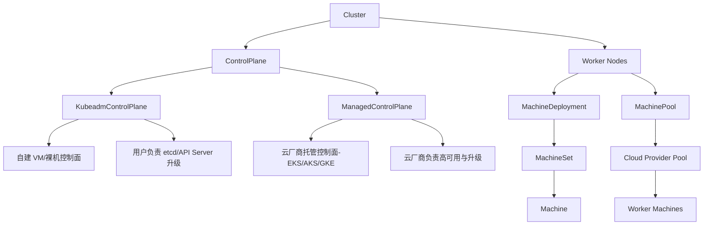

# ManagedControlPlane
**ManagedControlPlane 是 Cluster API 中的一类控制面资源，主要用于托管型 Kubernetes 集群（如 EKS、AKS、GKE）的控制面管理。它不直接创建或维护控制面节点，而是通过云厂商的托管服务来提供 API Server、etcd 等核心组件。**

## 📌 什么是 ManagedControlPlane
- **定义**：一种 ControlPlane CRD，用于表示由云厂商托管的 Kubernetes 控制面。  
- **核心作用**：不再由 CAPI 自行管理控制面节点，而是依赖云厂商的托管服务。  
- **典型实现**：`AWSManagedControlPlane` (EKS)、`AzureManagedControlPlane` (AKS)、`GCPManagedControlPlane` (GKE)。  

## 🔑 特点
- **简化运维**：用户无需关心 etcd、API Server 的升级与高可用，云厂商负责。  
- **与 Cluster API 集成**：仍然通过 Cluster API 的统一契约进行声明式管理。  
- **安全与合规**：证书、密钥、审计日志由云厂商托管，减少用户负担。  

## ⚖️ 对比：KubeadmControlPlane vs ManagedControlPlane
| **维度** | **KubeadmControlPlane** | **ManagedControlPlane** |
|----------------|----------------------|----------------------|
| 控制面节点来源 | 自建 VM/裸机 | 云厂商托管 |
| 升级策略 | CAPI 控制器滚动升级 | 云厂商自动升级或 API 调用 |
| 高可用 | 需用户配置多 AZ/多节点 | 云厂商内置高可用 |
| 适用场景 | 自建集群、私有云 | 公有云托管集群 (EKS/AKS/GKE) |

## ⚠️ 局限与风险
- **云厂商依赖**：功能受限于托管服务的 API 能力。  
- **跨云一致性**：不同 Provider 的实现差异较大，迁移成本高。  
- **可控性不足**：用户无法直接管理 etcd 或 API Server 的细节。  

## 🚀 未来改进方向
- **统一契约治理**：减少不同云厂商 ManagedControlPlane 的差异。  
- **与 ClusterClass 集成**：通过拓扑模板化管理托管控制面与工作节点。  
- **安全策略标准化**：在托管控制面场景下嵌入统一的安全与合规策略。  

总结来看，**ManagedControlPlane 是 CAPI 在公有云场景下的关键桥梁**，它让用户用统一的声明式 API 管理托管集群，但仍需解决 **跨云一致性、可控性不足、安全策略嵌入** 等问题。  

# 对比架构图
直观展示 **KubeadmControlPlane 与 ManagedControlPlane 在 Cluster API 中的角色差异**：

### 📌 架构说明
- **KubeadmControlPlane**  
  - 用户自建控制面节点（VM/裸机）。  
  - 由 CAPI 控制器负责滚动升级、证书管理。  
  - 适合私有云或自建集群场景。  

- **ManagedControlPlane**  
  - 控制面由云厂商托管（EKS、AKS、GKE）。  
  - 云厂商负责高可用、升级、etcd 管理。  
  - 适合公有云托管集群场景。  

- **Worker Nodes**  
  - 可通过 MachineDeployment（传统方式）或 MachinePool（云厂商原生伸缩能力）进行管理。  

这个图清晰地展示了：  
- **KubeadmControlPlane** → 自建控制面，用户负责。  
- **ManagedControlPlane** → 云厂商托管控制面，用户只需声明式管理。  
- 两者都挂在 **Cluster 的 ControlPlane** 下，但职责和适用场景完全不同。  
