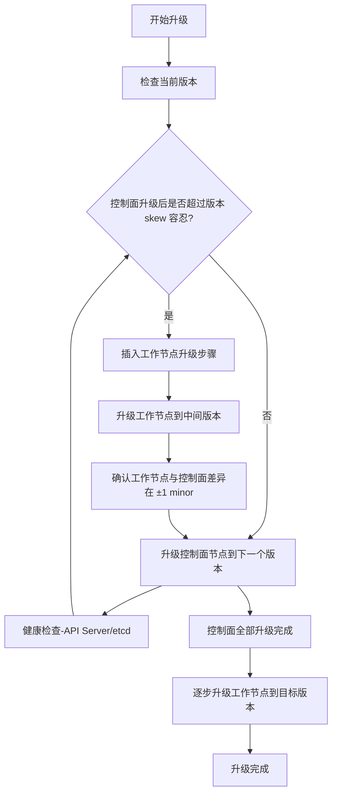

# Cluster API 在生成 GenerateUpgradePlanResponse 时，会自动规划控制面与工作节点的升级顺序
在 **Cluster API** 中，`GenerateUpgradePlanResponse` 的自动规划逻辑，核心目标是保证 **控制面与工作节点的升级顺序始终满足 Kubernetes 官方的版本 skew 容忍策略**。流程大致如下：

## 📌 自动规划流程
1. **收集当前状态**  
   - 获取当前控制面版本、工作节点版本。  
   - 获取目标版本（可能有多个阶段性版本）。  

2. **规划控制面升级**  
   - 控制面必须先升级，逐个节点滚动升级。  
   - 每次升级前检查：升级后的控制面版本与工作节点版本是否仍在 ±1 minor 容忍范围。  

3. **版本 skew 检查**  
   - 如果控制面升级到下一个版本会导致与工作节点差异超过容忍范围：  
     → 插入工作节点升级步骤，使工作节点先跟进到中间版本。  

4. **规划工作节点升级**  
   - 在控制面稳定后，逐步升级工作节点。  
   - 支持并发度配置（如一次升级 20% 的节点）。  

5. **生成升级计划**  
   - 输出 `controlPlaneUpgrades` 和 `workersUpgrades` 的有序列表。  
   - 保证整个升级路径中，控制面与工作节点的版本差异始终在官方容忍范围内。  

## ⚖️ 示例流程
当前版本：控制面 v1.26.x，工作节点 v1.26.x  
目标版本：v1.28.x  

自动规划结果：
1. 控制面升级到 v1.27.x → 工作节点仍在 v1.26.x（差异 1 minor，允许）。  
2. 控制面准备升级到 v1.28.x → 如果工作节点还在 v1.26.x，就会超过容忍范围。  
   → 插入工作节点升级到 v1.27.x。  
3. 控制面升级到 v1.28.x。  
4. 工作节点升级到 v1.28.x。  

## 🚀 总结
- **控制面优先**，但在超过版本 skew 容忍时，会自动插入工作节点升级步骤。  
- **滚动升级控制面**，保证 API Server 与 etcd 始终可用。  
- **最终目标**：控制面与工作节点版本一致，过程中的差异始终在官方支持范围内。  

# Topology Controller自动规划逻辑
**在 Cluster API 中，`GenerateUpgradePlanResponse` 的自动规划逻辑并不是由单一控制器实现，而是由 Topology Controller 调用 Runtime Hook（`GenerateUpgradePlan`）来完成。具体的升级路径由 Runtime Extension 提供，Topology Controller 会根据返回的 `controlPlaneUpgrades` 和 `workersUpgrades` 列表，结合 Kubernetes 官方的版本 skew 容忍策略，自动安排控制面与工作节点的升级顺序。**

## 📌 实现位置
- **Topology Controller**  
  - 负责整体集群拓扑的生命周期管理，包括升级。  
  - 在需要计算升级计划时，会调用 Runtime Hook。  
- **Runtime Hook: GenerateUpgradePlan**  
  - 定义在 `hooks.runtime.cluster.x-k8s.io/v1alpha1` API 中。  
  - 每次升级时都会触发，用于生成控制面与工作节点的升级路径。  
  - 响应中包含 `controlPlaneUpgrades` 和 `workersUpgrades`，Topology Controller 根据此结果执行升级。  
- **Runtime Extension**  
  - 实际的升级规划逻辑由 Runtime Extension 实现。  
  - 可以通过 ClusterClass 的 `spec.upgrade` 字段配置，或者直接在扩展组件中实现。  
  - 负责保证升级路径符合 Kubernetes 版本 skew 容忍策略。  

## ⚖️ 工作机制
1. **Topology Controller 检测到升级需求**（例如用户修改了 `Cluster.spec.kubernetesVersion`）。  
2. **调用 GenerateUpgradePlan Hook** → 请求 Runtime Extension 提供升级路径。  
3. **Runtime Extension 返回计划** → 包含控制面与工作节点的版本序列。  
4. **Topology Controller 执行升级** → 按照计划逐步升级控制面和工作节点，确保版本差异始终在 ±1 minor 范围内。  

## 🚀 总结
- 自动规划逻辑由 **Topology Controller** 调用 **GenerateUpgradePlan Runtime Hook** 完成。  
- **具体的升级路径由 Runtime Extension 实现**，Topology Controller 负责执行。  
- 整个过程确保 **控制面优先升级**，并在必要时插入工作节点升级步骤，避免版本 skew 超过容忍范围。  

# Cluster API 升级流程图
直观展示控制面与工作节点交替升级，以保持 **版本 skew 容忍** 的自动规划过程：


### 📌 流程说明
- **控制面优先**：控制面必须先升级，保证 API Server 能理解新版本。  
- **版本 skew 检查**：如果控制面升级会导致与工作节点差异超过 ±1 minor，就会插入工作节点升级步骤。  
- **交替升级**：控制面 → 工作节点 → 控制面 → 工作节点，直到最终一致。  
- **健康检查**：每次升级后都要确认 API Server 与 etcd 正常运行。  

### 🚀 总结
这个流程图展示了 Cluster API 的自动规划逻辑：  
- **控制面先升级**，但在超过版本 skew 容忍时，会 **插入工作节点升级**。  
- 整个过程保证控制面与工作节点的版本差异始终在官方支持范围内。  
- 最终目标是 **控制面与工作节点版本一致**。  

# 控制器调用流程图
直观展示 **Topology Controller 如何调用 Runtime Hook 并执行升级**：

```mermaid
flowchart TD
    A[用户修改 Cluster.spec.kubernetesVersion] --> B[Topology Controller 检测到升级需求]
    B --> C[调用 Runtime Hook: GenerateUpgradePlan]
    C --> D[Runtime Extension 返回升级计划]
    D --> E{检查版本 skew 容忍?}

    E -- 满足 --> F[Topology Controller 执行控制面升级]
    F --> G[健康检查 (API Server/etcd)]
    G --> H[继续执行工作节点升级]

    E -- 不满足 --> I[Topology Controller 插入工作节点升级步骤]
    I --> J[升级工作节点到中间版本]
    J --> F

    H --> K[所有控制面与工作节点升级完成]
    K --> L[升级流程结束]
```

### 📌 流程说明
- **Topology Controller**：负责检测集群版本变化并触发升级。  
- **Runtime Hook: GenerateUpgradePlan**：由 Runtime Extension 提供升级路径。  
- **版本 skew 检查**：确保控制面与工作节点差异不超过 ±1 minor。  
- **交替升级**：当控制面升级会超过容忍范围时，Topology Controller 会插入工作节点升级步骤。  
- **健康检查**：每次升级后确认 API Server 与 etcd 正常运行。  

### 🚀 总结
这个流程图展示了：  
- **Topology Controller** 是升级的 orchestrator。  
- 它通过 **Runtime Hook** 获取升级计划，并在执行过程中动态插入工作节点升级，保证版本 skew 始终合规。  
- 最终实现 **控制面优先升级 → 工作节点跟进 → 全部完成** 的自动化流程。  
