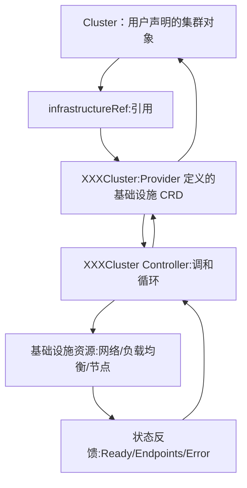
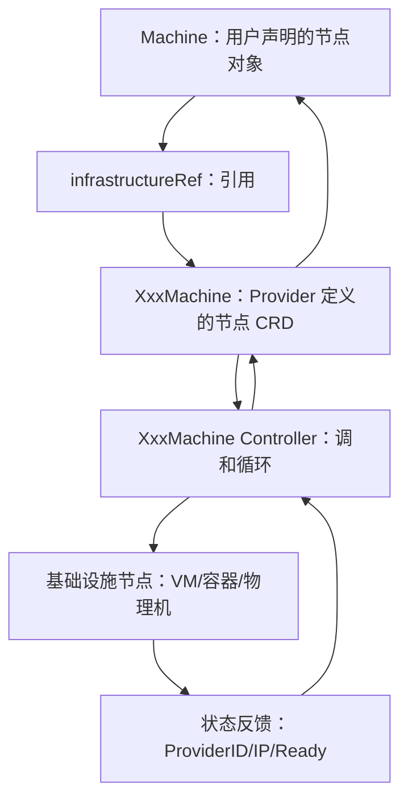

     
# Cluster API Provider 开发指南
## 一、开发环境准备
### 必备工具
```bash
# Go 环境 (>= 1.19)
go version

# kubebuilder (控制器开发框架)
curl -L -o kubebuilder https://go.kubebuilder.io/dl/latest/$(goenv GOOS)/$(goenv GOARCH)
chmod +x kubebuilder && mv kubebuilder /usr/local/bin/

# kubectl
curl -LO "https://dl.k8s.io/release/$(curl -L -s https://dl.k8s.io/release/stable.txt)/bin/linux/amd64/kubectl"
chmod +x kubectl && sudo mv kubectl /usr/local/bin/

# clusterctl
curl -L https://github.com/kubernetes-sigs/cluster-api/releases/download/v1.6.0/clusterctl-linux-amd64 -o clusterctl
chmod +x clusterctl && sudo mv clusterctl /usr/local/bin/
```
### 初始化项目
```bash
# 创建项目目录
mkdir cluster-api-provider-xxx && cd cluster-api-provider-xxx

# 初始化 Go 模块
go mod init github.com/example/cluster-api-provider-xxx

# 初始化 kubebuilder 项目
kubebuilder init --domain cluster.x-k8s.io --repo github.com/example/cluster-api-provider-xxx
```
## 二、Provider 类型选择
### 三种 Provider 类型
| Provider 类型 | 职责 | 需要实现的资源 | 难度 |
|--------------|------|--------------|------|
| **Infrastructure Provider** | 提供基础设施(计算、网络、存储) | XxxCluster, XxxMachine, XxxMachineTemplate | ⭐⭐⭐ |
| **Bootstrap Provider** | 节点引导、证书生成 | XxxConfig, XxxConfigTemplate | ⭐⭐ |
| **Control Plane Provider** | 管理控制平面 | XxxControlPlane | ⭐⭐⭐ |

**推荐从 Infrastructure Provider 开始**，这是最常见的需求。
## 三、Infrastructure Provider 开发步骤
### 步骤 1: 创建 API 资源
```bash
# 创建 Cluster 资源
kubebuilder create api --group infrastructure --version v1beta1 --kind XxxCluster

# 创建 Machine 资源
kubebuilder create api --group infrastructure --version v1beta1 --kind XxxMachine

# 创建 MachineTemplate 资源
kubebuilder create api --group infrastructure --version v1beta1 --kind XxxMachineTemplate
```
### 步骤 2: 定义资源结构
**XxxCluster** (集群级别基础设施):
```go
// api/v1beta1/xxxcluster_types.go
type XxxClusterSpec struct {
    // 控制平面端点
    ControlPlaneEndpoint clusterv1.APIEndpoint `json:"controlPlaneEndpoint"`
    
    // 区域/可用区
    Region string `json:"region"`
    
    // 网络配置
    Network NetworkSpec `json:"network,omitempty"`
}

type XxxClusterStatus struct {
    // 就绪状态
    Ready bool `json:"ready"`
    
    // 基础设施ID
    InfrastructureID string `json:"infrastructureID,omitempty"`
}
```
**XxxMachine** (机器级别基础设施):
```go
// api/v1beta1/xxxmachine_types.go
type XxxMachineSpec struct {
    // 实例类型
    InstanceType string `json:"instanceType"`
    
    // 镜像ID
    ImageID string `json:"imageID"`
    
    // SSH密钥
    SSHKeyName string `json:"sshKeyName,omitempty"`
}

type XxxMachineStatus struct {
    // 就绪状态
    Ready bool `json:"ready"`
    
    // 实例ID
    InstanceID string `json:"instanceID,omitempty"`
    
    // 地址信息
    Addresses []clusterv1.MachineAddress `json:"addresses,omitempty"`
}
```
### 步骤 3: 实现控制器逻辑
**XxxCluster 控制器**:
```go
// controllers/xxxcluster_controller.go
func (r *XxxClusterReconciler) Reconcile(ctx context.Context, req ctrl.Request) (_ ctrl.Result, reterr error) {
    // 1. 获取 Cluster 资源
    cluster := &clusterv1.Cluster{}
    if err := r.Client.Get(ctx, req.NamespacedName, cluster); err != nil {
        return ctrl.Result{}, client.IgnoreNotFound(err)
    }
    
    // 2. 获取 XxxCluster 资源
    xxxCluster := &infrastructurev1beta1.XxxCluster{}
    if err := r.Client.Get(ctx, req.NamespacedName, xxxCluster); err != nil {
        return ctrl.Result{}, client.IgnoreNotFound(err)
    }
    
    // 3. 初始化补丁助手
    patchHelper, err := patch.NewHelper(xxxCluster, r.Client)
    if err != nil {
        return ctrl.Result{}, err
    }
    
    defer func() {
        if err := patchHelper.Patch(ctx, xxxCluster); err != nil && reterr == nil {
            reterr = err
        }
    }()
    
    // 4. 处理集群删除
    if !xxxCluster.DeletionTimestamp.IsZero() {
        return r.reconcileDelete(ctx, cluster, xxxCluster)
    }
    
    // 5. 处理集群创建/更新
    return r.reconcileNormal(ctx, cluster, xxxCluster)
}

func (r *XxxClusterReconciler) reconcileNormal(ctx context.Context, cluster *clusterv1.Cluster, xxxCluster *infrastructurev1beta1.XxxCluster) (ctrl.Result, error) {
    // 1. 创建基础设施资源 (VPC, 子网, 安全组等)
    if err := r.createInfrastructure(ctx, cluster, xxxCluster); err != nil {
        return ctrl.Result{}, err
    }
    
    // 2. 设置控制平面端点
    xxxCluster.Spec.ControlPlaneEndpoint = clusterv1.APIEndpoint{
        Host: r.getLoadBalancerHost(xxxCluster),
        Port: 6443,
    }
    
    // 3. 标记为就绪
    xxxCluster.Status.Ready = true
    
    return ctrl.Result{}, nil
}
```
**XxxMachine 控制器**:
```go
// controllers/xxxmachine_controller.go
func (r *XxxMachineReconciler) Reconcile(ctx context.Context, req ctrl.Request) (_ ctrl.Result, reterr error) {
    // 1. 获取 Machine 资源
    machine := &clusterv1.Machine{}
    if err := r.Client.Get(ctx, req.NamespacedName, machine); err != nil {
        return ctrl.Result{}, client.IgnoreNotFound(err)
    }
    
    // 2. 获取 XxxMachine 资源
    xxxMachine := &infrastructurev1beta1.XxxMachine{}
    if err := r.Client.Get(ctx, req.NamespacedName, xxxMachine); err != nil {
        return ctrl.Result{}, client.IgnoreNotFound(err)
    }
    
    // 3. 初始化补丁助手
    patchHelper, err := patch.NewHelper(xxxMachine, r.Client)
    if err != nil {
        return ctrl.Result{}, err
    }
    
    defer func() {
        if err := patchHelper.Patch(ctx, xxxMachine); err != nil && reterr == nil {
            reterr = err
        }
    }()
    
    // 4. 处理机器删除
    if !xxxMachine.DeletionTimestamp.IsZero() {
        return r.reconcileDelete(ctx, machine, xxxMachine)
    }
    
    // 5. 处理机器创建/更新
    return r.reconcileNormal(ctx, machine, xxxMachine)
}

func (r *XxxMachineReconciler) reconcileNormal(ctx context.Context, machine *clusterv1.Machine, xxxMachine *infrastructurev1beta1.XxxMachine) (ctrl.Result, error) {
    // 1. 创建实例
    instanceID, err := r.createInstance(ctx, machine, xxxMachine)
    if err != nil {
        return ctrl.Result{}, err
    }
    
    // 2. 更新状态
    xxxMachine.Status.InstanceID = instanceID
    xxxMachine.Status.Ready = true
    
    // 3. 获取实例地址
    addresses, err := r.getInstanceAddresses(instanceID)
    if err != nil {
        return ctrl.Result{}, err
    }
    xxxMachine.Status.Addresses = addresses
    
    return ctrl.Result{}, nil
}
```
### 步骤 4: 实现关键接口
**Cluster 控制器接口**:
```go
// 需要实现的方法
type ClusterController interface {
    // 创建基础设施
    CreateCluster(ctx context.Context, cluster *clusterv1.Cluster) error
    
    // 删除基础设施
    DeleteCluster(ctx context.Context, cluster *clusterv1.Cluster) error
    
    // 更新基础设施
    UpdateCluster(ctx context.Context, cluster *clusterv1.Cluster) error
}
```
**Machine 控制器接口**:
```go
// 需要实现的方法
type MachineController interface {
    // 创建机器
    CreateMachine(ctx context.Context, machine *clusterv1.Machine) error
    
    // 删除机器
    DeleteMachine(ctx context.Context, machine *clusterv1.Machine) error
    
    // 更新机器
    UpdateMachine(ctx context.Context, machine *clusterv1.Machine) error
}
```
## 四、测试和部署
### 本地测试
```bash
# 1. 安装 CRD
make install

# 2. 运行控制器
make run

# 3. 创建测试集群
kubectl apply -f config/samples/
```
### 集成测试
```bash
# 创建 kind 管理集群
kind create cluster --name management

# 初始化 Cluster API
clusterctl init --infrastructure docker

# 部署你的 Provider
kubectl apply -f config/default/

# 创建工作集群
clusterctl generate cluster test-cluster --kubernetes-version v1.27.0 | kubectl apply -f -
```
### 发布 Provider
```bash
# 构建 Docker 镜像
make docker-build IMG=your-registry/cluster-api-provider-xxx:v1.0.0

# 推送镜像
make docker-push IMG=your-registry/cluster-api-provider-xxx:v1.0.0

# 生成发布清单
make release-manifests
```
## 五、关键注意事项
### 1. Owner References
```go
// 设置 Owner Reference
controllerutil.SetControllerReference(cluster, xxxCluster, r.Scheme)
```
### 2. Finalizers
```go
// 添加 Finalizer
controllerutil.AddFinalizer(xxxCluster, "xxxcluster.infrastructure.cluster.x-k8s.io")

// 移除 Finalizer
controllerutil.RemoveFinalizer(xxxCluster, "xxxcluster.infrastructure.cluster.x-k8s.io")
```
### 3. 条件状态
```go
// 使用条件状态
conditions.MarkTrue(xxxCluster, infrastructurev1beta1.ClusterReadyCondition)
conditions.MarkFalse(xxxCluster, infrastructurev1beta1.ClusterReadyCondition, 
    infrastructurev1beta1.ClusterNotFoundReason, clusterv1.ConditionSeverityWarning, "cluster not found")
```
### 4. 事件记录
```go
// 记录事件
r.Recorder.Eventf(xxxCluster, corev1.EventTypeNormal, "Created", "Created cluster %s", xxxCluster.Name)
```
## 六、开发清单
- [ ] 创建 API 资源
- [ ] 定义资源 Spec 和 Status
- [ ] 实现 Reconcile 逻辑
- [ ] 处理创建/更新/删除
- [ ] 设置 Owner References
- [ ] 添加 Finalizers
- [ ] 更新条件状态
- [ ] 记录事件
- [ ] 编写单元测试
- [ ] 编写集成测试
- [ ] 编写文档
- [ ] 准备发布清单
## 七、参考资源
- [Cluster API 官方文档](https://cluster-api.sigs.k8s.io/)
- [Cluster API Book](https://cluster-api.sigs.k8s.io/book/)
- [CAPD 源码](https://github.com/kubernetes-sigs/cluster-api/tree/main/test/infrastructure/docker)
- [CAPA 源码](https://github.com/kubernetes-sigs/cluster-api-provider-aws)
- [Kubebuilder 文档](https://book.kubebuilder.io/)

**核心要点**:
1. 从 Infrastructure Provider 开始最简单
2. 必须实现 Cluster 和 Machine 两类资源
3. 正确处理 Owner References 和 Finalizers
4. 使用条件状态和事件记录
5. 充分测试后再发布


# Cluster API 三种 Provider 开发完整指南
## 一、Provider 架构概览
```
┌─────────────────────────────────────────────────────────────┐
│                    Management Cluster                        │
│  ┌───────────────────────────────────────────────────────┐  │
│  │              Cluster API Core Controllers             │  │
│  │  • Cluster Controller                                 │  │
│  │  • Machine Controller                                 │  │
│  │  • MachineSet Controller                              │  │
│  │  • MachineDeployment Controller                       │  │
│  └───────────────────────────────────────────────────────┘  │
│                                                              │
│  ┌────────────────┐  ┌────────────────┐  ┌────────────────┐│
│  │ Infrastructure │  │   Bootstrap    │  │ Control Plane  ││
│  │    Provider    │  │    Provider    │  │    Provider    ││
│  │                │  │                │  │                ││
│  │ • XxxCluster   │  │ • XxxConfig    │  │ • XxxControl   ││
│  │ • XxxMachine   │  │ • XxxTemplate  │  │   Plane        ││
│  │ • XxxTemplate  │  │                │  │                ││
│  └────────────────┘  └────────────────┘  └────────────────┘│
└─────────────────────────────────────────────────────────────┘
```
## 二、Infrastructure Provider 开发指南
### 2.1 职责定义
**核心职责:**
- 提供集群级别的基础设施资源 (VPC、网络、负载均衡器等)
- 提供机器级别的计算资源 (虚拟机、物理机等)
- 管理基础设施的生命周期 (创建、更新、删除)
### 2.2 需要实现的资源
| 资源类型 | 用途 | 必需字段 |
|---------|------|---------|
| **XxxCluster** | 集群基础设施 | ControlPlaneEndpoint, Ready |
| **XxxMachine** | 机器基础设施 | ProviderID, Addresses |
| **XxxMachineTemplate** | 机器模板 | Spec.Template.Spec |
### 2.3 完整实现示例
**步骤 1: 定义 API 资源**
```go
// api/v1beta1/xxxcluster_types.go
package v1beta1

import (
    metav1 "k8s.io/apimachinery/pkg/apis/meta/v1"
    clusterv1 "sigs.k8s.io/cluster-api/api/v1beta1"
)

// +kubebuilder:object:root=true
// +kubebuilder:subresource:status
type XxxCluster struct {
    metav1.TypeMeta   `json:",inline"`
    metav1.ObjectMeta `json:"metadata,omitempty"`
    
    Spec   XxxClusterSpec   `json:"spec,omitempty"`
    Status XxxClusterStatus `json:"status,omitempty"`
}

type XxxClusterSpec struct {
    // 控制平面端点
    ControlPlaneEndpoint clusterv1.APIEndpoint `json:"controlPlaneEndpoint"`
    
    // 区域
    Region string `json:"region"`
    
    // 网络配置
    Network NetworkSpec `json:"network,omitempty"`
    
    // 节点引用
    FailureDomains clusterv1.FailureDomains `json:"failureDomains,omitempty"`
}

type XxxClusterStatus struct {
    // 就绪状态
    Ready bool `json:"ready"`
    
    // 基础设施ID
    InfrastructureID string `json:"infrastructureID,omitempty"`
    
    // 条件状态
    Conditions clusterv1.Conditions `json:"conditions,omitempty"`
}

type NetworkSpec struct {
    // VPC ID
    VPCID string `json:"vpcId,omitempty"`
    
    // 子网
    Subnets []SubnetSpec `json:"subnets,omitempty"`
    
    // 安全组
    SecurityGroups []string `json:"securityGroups,omitempty"`
}

type SubnetSpec struct {
    ID               string `json:"id"`
    CIDR             string `json:"cidr"`
    AvailabilityZone string `json:"availabilityZone"`
}
```

```go
// api/v1beta1/xxxmachine_types.go
package v1beta1

import (
    metav1 "k8s.io/apimachinery/pkg/apis/meta/v1"
    clusterv1 "sigs.k8s.io/cluster-api/api/v1beta1"
)

// +kubebuilder:object:root=true
// +kubebuilder:subresource:status
type XxxMachine struct {
    metav1.TypeMeta   `json:",inline"`
    metav1.ObjectMeta `json:"metadata,omitempty"`
    
    Spec   XxxMachineSpec   `json:"spec,omitempty"`
    Status XxxMachineStatus `json:"status,omitempty"`
}

type XxxMachineSpec struct {
    // 实例类型
    InstanceType string `json:"instanceType"`
    
    // 镜像ID
    ImageID string `json:"imageId"`
    
    // SSH密钥名称
    SSHKeyName string `json:"sshKeyName,omitempty"`
    
    // 根卷大小
    RootVolumeSize int64 `json:"rootVolumeSize,omitempty"`
    
    // 提供者ID
    ProviderID string `json:"providerID,omitempty"`
}

type XxxMachineStatus struct {
    // 就绪状态
    Ready bool `json:"ready"`
    
    // 实例ID
    InstanceID string `json:"instanceID,omitempty"`
    
    // 地址列表
    Addresses []clusterv1.MachineAddress `json:"addresses,omitempty"`
    
    // 条件状态
    Conditions clusterv1.Conditions `json:"conditions,omitempty"`
}
```
**步骤 2: 实现控制器**
```go
// controllers/xxxcluster_controller.go
package controllers

import (
    "context"
    "fmt"
    
    "github.com/go-logr/logr"
    "k8s.io/apimachinery/pkg/runtime"
    ctrl "sigs.k8s.io/controller-runtime"
    "sigs.k8s.io/controller-runtime/pkg/client"
    "sigs.k8s.io/controller-runtime/pkg/controller/controllerutil"
    
    clusterv1 "sigs.k8s.io/cluster-api/api/v1beta1"
    "sigs.k8s.io/cluster-api/util"
    "sigs.k8s.io/cluster-api/util/conditions"
    "sigs.k8s.io/cluster-api/util/patch"
    
    infrastructurev1beta1 "github.com/example/cluster-api-provider-xxx/api/v1beta1"
)

type XxxClusterReconciler struct {
    client.Client
    Log    logr.Logger
    Scheme *runtime.Scheme
}

// +kubebuilder:rbac:groups=infrastructure.cluster.x-k8s.io,resources=xxxclusters,verbs=get;list;watch;create;update;patch;delete
// +kubebuilder:rbac:groups=infrastructure.cluster.x-k8s.io,resources=xxxclusters/status,verbs=get;update;patch
// +kubebuilder:rbac:groups=cluster.x-k8s.io,resources=clusters;clusters/status,verbs=get;list;watch

func (r *XxxClusterReconciler) Reconcile(ctx context.Context, req ctrl.Request) (_ ctrl.Result, reterr error) {
    log := r.Log.WithValues("xxxcluster", req.NamespacedName)
    
    // 1. 获取 Cluster 资源
    cluster := &clusterv1.Cluster{}
    if err := r.Client.Get(ctx, req.NamespacedName, cluster); err != nil {
        if client.IgnoreNotFound(err) != nil {
            return ctrl.Result{}, err
        }
        return ctrl.Result{}, nil
    }
    
    // 2. 获取 XxxCluster 资源
    xxxCluster := &infrastructurev1beta1.XxxCluster{}
    if err := r.Client.Get(ctx, req.NamespacedName, xxxCluster); err != nil {
        return ctrl.Result{}, client.IgnoreNotFound(err)
    }
    
    // 3. 初始化补丁助手
    patchHelper, err := patch.NewHelper(xxxCluster, r.Client)
    if err != nil {
        return ctrl.Result{}, err
    }
    
    defer func() {
        // 设置所有者引用
        if err := controllerutil.SetControllerReference(cluster, xxxCluster, r.Scheme); err != nil {
            reterr = err
            return
        }
        
        // 应用补丁
        if err := patchHelper.Patch(ctx, xxxCluster); err != nil && reterr == nil {
            reterr = err
        }
    }()
    
    // 4. 处理删除
    if !xxxCluster.DeletionTimestamp.IsZero() {
        return r.reconcileDelete(ctx, cluster, xxxCluster)
    }
    
    // 5. 处理创建/更新
    return r.reconcileNormal(ctx, cluster, xxxCluster)
}

func (r *XxxClusterReconciler) reconcileNormal(ctx context.Context, cluster *clusterv1.Cluster, xxxCluster *infrastructurev1beta1.XxxCluster) (ctrl.Result, error) {
    log := r.Log.WithValues("cluster", cluster.Name)
    
    // 1. 添加 Finalizer
    controllerutil.AddFinalizer(xxxCluster, "xxxcluster.infrastructure.cluster.x-k8s.io")
    
    // 2. 创建基础设施资源
    if !conditions.IsTrue(xxxCluster, infrastructurev1beta1.VpcReadyCondition) {
        if err := r.createVPC(ctx, cluster, xxxCluster); err != nil {
            conditions.MarkFalse(xxxCluster, infrastructurev1beta1.VpcReadyCondition, 
                infrastructurev1beta1.VpcCreationFailedReason, clusterv1.ConditionSeverityError, err.Error())
            return ctrl.Result{Requeue: true}, err
        }
        conditions.MarkTrue(xxxCluster, infrastructurev1beta1.VpcReadyCondition)
    }
    
    // 3. 创建子网
    if !conditions.IsTrue(xxxCluster, infrastructurev1beta1.SubnetsReadyCondition) {
        if err := r.createSubnets(ctx, cluster, xxxCluster); err != nil {
            conditions.MarkFalse(xxxCluster, infrastructurev1beta1.SubnetsReadyCondition,
                infrastructurev1beta1.SubnetsCreationFailedReason, clusterv1.ConditionSeverityError, err.Error())
            return ctrl.Result{Requeue: true}, err
        }
        conditions.MarkTrue(xxxCluster, infrastructurev1beta1.SubnetsReadyCondition)
    }
    
    // 4. 创建负载均衡器
    if !conditions.IsTrue(xxxCluster, infrastructurev1beta1.LoadBalancerReadyCondition) {
        lbHost, err := r.createLoadBalancer(ctx, cluster, xxxCluster)
        if err != nil {
            conditions.MarkFalse(xxxCluster, infrastructurev1beta1.LoadBalancerReadyCondition,
                infrastructurev1beta1.LoadBalancerCreationFailedReason, clusterv1.ConditionSeverityError, err.Error())
            return ctrl.Result{Requeue: true}, err
        }
        
        // 设置控制平面端点
        xxxCluster.Spec.ControlPlaneEndpoint = clusterv1.APIEndpoint{
            Host: lbHost,
            Port: 6443,
        }
        conditions.MarkTrue(xxxCluster, infrastructurev1beta1.LoadBalancerReadyCondition)
    }
    
    // 5. 标记为就绪
    xxxCluster.Status.Ready = true
    conditions.MarkTrue(xxxCluster, clusterv1.ReadyCondition)
    
    log.Info("Cluster infrastructure is ready")
    return ctrl.Result{}, nil
}

func (r *XxxClusterReconciler) reconcileDelete(ctx context.Context, cluster *clusterv1.Cluster, xxxCluster *infrastructurev1beta1.XxxCluster) (ctrl.Result, error) {
    log := r.Log.WithValues("cluster", cluster.Name)
    
    // 1. 删除负载均衡器
    if conditions.IsTrue(xxxCluster, infrastructurev1beta1.LoadBalancerReadyCondition) {
        if err := r.deleteLoadBalancer(ctx, xxxCluster); err != nil {
            return ctrl.Result{}, err
        }
        conditions.MarkFalse(xxxCluster, infrastructurev1beta1.LoadBalancerReadyCondition,
            infrastructurev1beta1.LoadBalancerDeletedReason, clusterv1.ConditionSeverityInfo, "")
    }
    
    // 2. 删除子网
    if conditions.IsTrue(xxxCluster, infrastructurev1beta1.SubnetsReadyCondition) {
        if err := r.deleteSubnets(ctx, xxxCluster); err != nil {
            return ctrl.Result{}, err
        }
        conditions.MarkFalse(xxxCluster, infrastructurev1beta1.SubnetsReadyCondition,
            infrastructurev1beta1.SubnetsDeletedReason, clusterv1.ConditionSeverityInfo, "")
    }
    
    // 3. 删除 VPC
    if conditions.IsTrue(xxxCluster, infrastructurev1beta1.VpcReadyCondition) {
        if err := r.deleteVPC(ctx, xxxCluster); err != nil {
            return ctrl.Result{}, err
        }
        conditions.MarkFalse(xxxCluster, infrastructurev1beta1.VpcReadyCondition,
            infrastructurev1beta1.VpcDeletedReason, clusterv1.ConditionSeverityInfo, "")
    }
    
    // 4. 移除 Finalizer
    controllerutil.RemoveFinalizer(xxxCluster, "xxxcluster.infrastructure.cluster.x-k8s.io")
    
    log.Info("Cluster infrastructure deleted")
    return ctrl.Result{}, nil
}

// 实现基础设施创建/删除的具体方法
func (r *XxxClusterReconciler) createVPC(ctx context.Context, cluster *clusterv1.Cluster, xxxCluster *infrastructurev1beta1.XxxCluster) error {
    // 调用云厂商 API 创建 VPC
    // 示例: AWS SDK, Azure SDK, GCP SDK 等
    return nil
}

func (r *XxxClusterReconciler) createSubnets(ctx context.Context, cluster *clusterv1.Cluster, xxxCluster *infrastructurev1beta1.XxxCluster) error {
    // 创建子网
    return nil
}

func (r *XxxClusterReconciler) createLoadBalancer(ctx context.Context, cluster *clusterv1.Cluster, xxxCluster *infrastructurev1beta1.XxxCluster) (string, error) {
    // 创建负载均衡器并返回 DNS 名称或 IP
    return "lb.example.com", nil
}

func (r *XxxClusterReconciler) deleteVPC(ctx context.Context, xxxCluster *infrastructurev1beta1.XxxCluster) error {
    return nil
}

func (r *XxxClusterReconciler) deleteSubnets(ctx context.Context, xxxCluster *infrastructurev1beta1.XxxCluster) error {
    return nil
}

func (r *XxxClusterReconciler) deleteLoadBalancer(ctx context.Context, xxxCluster *infrastructurev1beta1.XxxCluster) error {
    return nil
}

func (r *XxxClusterReconciler) SetupWithManager(mgr ctrl.Manager) error {
    return ctrl.NewControllerManagedBy(mgr).
        For(&infrastructurev1beta1.XxxCluster{}).
        Complete(r)
}
```

```go
// controllers/xxxmachine_controller.go
package controllers

import (
    "context"
    "fmt"
    "time"
    
    "github.com/go-logr/logr"
    "k8s.io/apimachinery/pkg/runtime"
    ctrl "sigs.k8s.io/controller-runtime"
    "sigs.k8s.io/controller-runtime/pkg/client"
    "sigs.k8s.io/controller-runtime/pkg/controller/controllerutil"
    
    clusterv1 "sigs.k8s.io/cluster-api/api/v1beta1"
    "sigs.k8s.io/cluster-api/util"
    "sigs.k8s.io/cluster-api/util/conditions"
    "sigs.k8s.io/cluster-api/util/patch"
    
    infrastructurev1beta1 "github.com/example/cluster-api-provider-xxx/api/v1beta1"
)

type XxxMachineReconciler struct {
    client.Client
    Log    logr.Logger
    Scheme *runtime.Scheme
}

// +kubebuilder:rbac:groups=infrastructure.cluster.x-k8s.io,resources=xxxmachines,verbs=get;list;watch;create;update;patch;delete
// +kubebuilder:rbac:groups=infrastructure.cluster.x-k8s.io,resources=xxxmachines/status,verbs=get;update;patch
// +kubebuilder:rbac:groups=cluster.x-k8s.io,resources=machines;machines/status,verbs=get;list;watch

func (r *XxxMachineReconciler) Reconcile(ctx context.Context, req ctrl.Request) (_ ctrl.Result, reterr error) {
    log := r.Log.WithValues("xxxmachine", req.NamespacedName)
    
    // 1. 获取 Machine 资源
    machine := &clusterv1.Machine{}
    if err := r.Client.Get(ctx, req.NamespacedName, machine); err != nil {
        if client.IgnoreNotFound(err) != nil {
            return ctrl.Result{}, err
        }
        return ctrl.Result{}, nil
    }
    
    // 2. 获取 XxxMachine 资源
    xxxMachine := &infrastructurev1beta1.XxxMachine{}
    if err := r.Client.Get(ctx, req.NamespacedName, xxxMachine); err != nil {
        return ctrl.Result{}, client.IgnoreNotFound(err)
    }
    
    // 3. 初始化补丁助手
    patchHelper, err := patch.NewHelper(xxxMachine, r.Client)
    if err != nil {
        return ctrl.Result{}, err
    }
    
    defer func() {
        if err := controllerutil.SetControllerReference(machine, xxxMachine, r.Scheme); err != nil {
            reterr = err
            return
        }
        
        if err := patchHelper.Patch(ctx, xxxMachine); err != nil && reterr == nil {
            reterr = err
        }
    }()
    
    // 4. 处理删除
    if !xxxMachine.DeletionTimestamp.IsZero() {
        return r.reconcileDelete(ctx, machine, xxxMachine)
    }
    
    // 5. 处理创建/更新
    return r.reconcileNormal(ctx, machine, xxxMachine)
}

func (r *XxxMachineReconciler) reconcileNormal(ctx context.Context, machine *clusterv1.Machine, xxxMachine *infrastructurev1beta1.XxxMachine) (ctrl.Result, error) {
    log := r.Log.WithValues("machine", machine.Name)
    
    // 1. 添加 Finalizer
    controllerutil.AddFinalizer(xxxMachine, "xxxmachine.infrastructure.cluster.x-k8s.io")
    
    // 2. 检查实例是否已存在
    if xxxMachine.Spec.ProviderID == "" {
        // 创建新实例
        instanceID, err := r.createInstance(ctx, machine, xxxMachine)
        if err != nil {
            conditions.MarkFalse(xxxMachine, infrastructurev1beta1.InstanceReadyCondition,
                infrastructurev1beta1.InstanceCreationFailedReason, clusterv1.ConditionSeverityError, err.Error())
            return ctrl.Result{Requeue: true}, err
        }
        xxxMachine.Status.InstanceID = instanceID
        xxxMachine.Spec.ProviderID = fmt.Sprintf("xxx:///%s", instanceID)
    }
    
    // 3. 等待实例就绪
    instance, err := r.getInstance(ctx, xxxMachine.Status.InstanceID)
    if err != nil {
        return ctrl.Result{RequeueAfter: 10 * time.Second}, err
    }
    
    if instance.Status != "Running" {
        log.Info("Waiting for instance to be running", "status", instance.Status)
        return ctrl.Result{RequeueAfter: 10 * time.Second}, nil
    }
    
    // 4. 更新地址信息
    xxxMachine.Status.Addresses = []clusterv1.MachineAddress{
        {
            Type:    clusterv1.MachineInternalIP,
            Address: instance.PrivateIP,
        },
        {
            Type:    clusterv1.MachineExternalIP,
            Address: instance.PublicIP,
        },
        {
            Type:    clusterv1.MachineHostName,
            Address: instance.Hostname,
        },
    }
    
    // 5. 标记为就绪
    xxxMachine.Status.Ready = true
    conditions.MarkTrue(xxxMachine, infrastructurev1beta1.InstanceReadyCondition)
    
    log.Info("Machine infrastructure is ready")
    return ctrl.Result{}, nil
}

func (r *XxxMachineReconciler) reconcileDelete(ctx context.Context, machine *clusterv1.Machine, xxxMachine *infrastructurev1beta1.XxxMachine) (ctrl.Result, error) {
    log := r.Log.WithValues("machine", machine.Name)
    
    // 1. 删除实例
    if xxxMachine.Status.InstanceID != "" {
        if err := r.deleteInstance(ctx, xxxMachine.Status.InstanceID); err != nil {
            return ctrl.Result{}, err
        }
    }
    
    // 2. 移除 Finalizer
    controllerutil.RemoveFinalizer(xxxMachine, "xxxmachine.infrastructure.cluster.x-k8s.io")
    
    log.Info("Machine infrastructure deleted")
    return ctrl.Result{}, nil
}

// 实现实例管理的具体方法
type Instance struct {
    ID         string
    Status     string
    PrivateIP  string
    PublicIP   string
    Hostname   string
}

func (r *XxxMachineReconciler) createInstance(ctx context.Context, machine *clusterv1.Machine, xxxMachine *infrastructurev1beta1.XxxMachine) (string, error) {
    // 调用云厂商 API 创建实例
    return "i-1234567890abcdef0", nil
}

func (r *XxxMachineReconciler) getInstance(ctx context.Context, instanceID string) (*Instance, error) {
    // 查询实例状态
    return &Instance{
        ID:        instanceID,
        Status:    "Running",
        PrivateIP: "10.0.1.100",
        PublicIP:  "54.0.1.100",
        Hostname:  "ip-10-0-1-100.ec2.internal",
    }, nil
}

func (r *XxxMachineReconciler) deleteInstance(ctx context.Context, instanceID string) error {
    // 删除实例
    return nil
}

func (r *XxxMachineReconciler) SetupWithManager(mgr ctrl.Manager) error {
    return ctrl.NewControllerManagedBy(mgr).
        For(&infrastructurev1beta1.XxxMachine{}).
        Complete(r)
}
```
### 2.4 关键接口总结
```go
// Infrastructure Provider 必须实现的接口

// Cluster 接口
type ClusterInterface interface {
    // 创建基础设施
    CreateCluster(ctx context.Context, cluster *clusterv1.Cluster) error
    
    // 删除基础设施
    DeleteCluster(ctx context.Context, cluster *clusterv1.Cluster) error
    
    // 更新基础设施
    UpdateCluster(ctx context.Context, cluster *clusterv1.Cluster) error
    
    // 检查基础设施是否就绪
    IsClusterReady(ctx context.Context, cluster *clusterv1.Cluster) (bool, error)
}

// Machine 接口
type MachineInterface interface {
    // 创建机器
    CreateMachine(ctx context.Context, machine *clusterv1.Machine) (string, error)
    
    // 删除机器
    DeleteMachine(ctx context.Context, machine *clusterv1.Machine) error
    
    // 更新机器
    UpdateMachine(ctx context.Context, machine *clusterv1.Machine) error
    
    // 获取机器状态
    GetMachineStatus(ctx context.Context, machine *clusterv1.Machine) (*MachineStatus, error)
}
```
## 三、Bootstrap Provider 开发指南
### 3.1 职责定义
**核心职责:**
- 生成节点引导配置
- 生成证书和密钥
- 创建 kubeadm 配置
- 生成 cloud-init 脚本
### 3.2 需要实现的资源
| 资源类型 | 用途 | 必需字段 |
|---------|------|---------|
| **XxxConfig** | 节点引导配置 | Status.BootstrapData, Status.Ready |
| **XxxConfigTemplate** | 配置模板 | Spec.Template.Spec |
### 3.3 完整实现示例
```go
// api/v1beta1/xxxconfig_types.go
package v1beta1

import (
    metav1 "k8s.io/apimachinery/pkg/apis/meta/v1"
    clusterv1 "sigs.k8s.io/cluster-api/api/v1beta1"
)

// +kubebuilder:object:root=true
// +kubebuilder:subresource:status
type XxxConfig struct {
    metav1.TypeMeta   `json:",inline"`
    metav1.ObjectMeta `json:"metadata,omitempty"`
    
    Spec   XxxConfigSpec   `json:"spec,omitempty"`
    Status XxxConfigStatus `json:"status,omitempty"`
}

type XxxConfigSpec struct {
    // Kubeadm 初始化配置
    InitConfiguration *InitConfiguration `json:"initConfiguration,omitempty"`
    
    // Kubeadm join 配置
    JoinConfiguration *JoinConfiguration `json:"joinConfiguration,omitempty"`
    
    // 文件列表
    Files []File `json:"files,omitempty"`
    
    // 命令列表
    PreKubeadmCommands  []string `json:"preKubeadmCommands,omitempty"`
    PostKubeadmCommands []string `json:"postKubeadmCommands,omitempty"`
}

type XxxConfigStatus struct {
    // 引导数据
    BootstrapData string `json:"bootstrapData,omitempty"`
    
    // 就绪状态
    Ready bool `json:"ready"`
    
    // 条件状态
    Conditions clusterv1.Conditions `json:"conditions,omitempty"`
}

type InitConfiguration struct {
    // 节点注册配置
    NodeRegistration NodeRegistration `json:"nodeRegistration,omitempty"`
    
    // 本地 API Server 端点
    LocalAPIEndpoint APIEndpoint `json:"localAPIEndpoint,omitempty"`
}

type JoinConfiguration struct {
    // 节点注册配置
    NodeRegistration NodeRegistration `json:"nodeRegistration,omitempty"`
    
    // 控制平面配置
    ControlPlane *JoinControlPlane `json:"controlPlane,omitempty"`
    
    // 发现配置
    Discovery Discovery `json:"discovery"`
}

type NodeRegistration struct {
    Name             string            `json:"name,omitempty"`
    CRISocket        string            `json:"criSocket,omitempty"`
    Taints           []Taint           `json:"taints,omitempty"`
    KubeletExtraArgs map[string]string `json:"kubeletExtraArgs,omitempty"`
}

type File struct {
    Path        string `json:"path"`
    Owner       string `json:"owner,omitempty"`
    Permissions string `json:"permissions,omitempty"`
    Content     string `json:"content"`
}

type Taint struct {
    Key    string `json:"key"`
    Value  string `json:"value"`
    Effect string `json:"effect"`
}

type APIEndpoint struct {
    AdvertiseAddress string `json:"advertiseAddress"`
    BindPort         int32  `json:"bindPort"`
}

type JoinControlPlane struct {
    LocalAPIEndpoint APIEndpoint `json:"localAPIEndpoint"`
}

type Discovery struct {
    BootstrapToken *BootstrapTokenDiscovery `json:"bootstrapToken,omitempty"`
    File           *FileDiscovery           `json:"file,omitempty"`
}

type BootstrapTokenDiscovery struct {
    Token                    string   `json:"token"`
    APIServerEndpoint        string   `json:"apiServerEndpoint"`
    CACertHashes             []string `json:"caCertHashes,omitempty"`
    UnsafeSkipCAVerification bool     `json:"unsafeSkipCAVerification,omitempty"`
}

type FileDiscovery struct {
    KubeConfigPath string `json:"kubeConfigPath"`
}
```

```go
// controllers/xxxconfig_controller.go
package controllers

import (
    "context"
    "encoding/base64"
    "fmt"
    "text/template"
    
    "github.com/go-logr/logr"
    "k8s.io/apimachinery/pkg/runtime"
    ctrl "sigs.k8s.io/controller-runtime"
    "sigs.k8s.io/controller-runtime/pkg/client"
    "sigs.k8s.io/controller-runtime/pkg/controller/controllerutil"
    
    clusterv1 "sigs.k8s.io/cluster-api/api/v1beta1"
    "sigs.k8s.io/cluster-api/util"
    "sigs.k8s.io/cluster-api/util/conditions"
    "sigs.k8s.io/cluster-api/util/patch"
    
    bootstrapv1beta1 "github.com/example/cluster-api-bootstrap-provider-xxx/api/v1beta1"
)

type XxxConfigReconciler struct {
    client.Client
    Log    logr.Logger
    Scheme *runtime.Scheme
}

// +kubebuilder:rbac:groups=bootstrap.cluster.x-k8s.io,resources=xxxconfigs,verbs=get;list;watch;create;update;patch;delete
// +kubebuilder:rbac:groups=bootstrap.cluster.x-k8s.io,resources=xxxconfigs/status,verbs=get;update;patch
// +kubebuilder:rbac:groups=cluster.x-k8s.io,resources=machines;machines/status;clusters;clusters/status,verbs=get;list;watch

func (r *XxxConfigReconciler) Reconcile(ctx context.Context, req ctrl.Request) (_ ctrl.Result, reterr error) {
    log := r.Log.WithValues("xxxconfig", req.NamespacedName)
    
    // 1. 获取 Machine 资源
    machine := &clusterv1.Machine{}
    if err := r.Client.Get(ctx, req.NamespacedName, machine); err != nil {
        if client.IgnoreNotFound(err) != nil {
            return ctrl.Result{}, err
        }
        return ctrl.Result{}, nil
    }
    
    // 2. 获取 XxxConfig 资源
    xxxConfig := &bootstrapv1beta1.XxxConfig{}
    if err := r.Client.Get(ctx, req.NamespacedName, xxxConfig); err != nil {
        return ctrl.Result{}, client.IgnoreNotFound(err)
    }
    
    // 3. 初始化补丁助手
    patchHelper, err := patch.NewHelper(xxxConfig, r.Client)
    if err != nil {
        return ctrl.Result{}, err
    }
    
    defer func() {
        if err := controllerutil.SetControllerReference(machine, xxxConfig, r.Scheme); err != nil {
            reterr = err
            return
        }
        
        if err := patchHelper.Patch(ctx, xxxConfig); err != nil && reterr == nil {
            reterr = err
        }
    }()
    
    // 4. 处理删除
    if !xxxConfig.DeletionTimestamp.IsZero() {
        return r.reconcileDelete(ctx, machine, xxxConfig)
    }
    
    // 5. 处理创建/更新
    return r.reconcileNormal(ctx, machine, xxxConfig)
}

func (r *XxxConfigReconciler) reconcileNormal(ctx context.Context, machine *clusterv1.Machine, xxxConfig *bootstrapv1beta1.XxxConfig) (ctrl.Result, error) {
    log := r.Log.WithValues("machine", machine.Name)
    
    // 1. 添加 Finalizer
    controllerutil.AddFinalizer(xxxConfig, "xxxconfig.bootstrap.cluster.x-k8s.io")
    
    // 2. 获取关联的 Cluster
    cluster, err := util.GetClusterFromMetadata(ctx, r.Client, machine.ObjectMeta)
    if err != nil {
        return ctrl.Result{}, err
    }
    
    // 3. 生成引导数据
    bootstrapData, err := r.generateBootstrapData(ctx, cluster, machine, xxxConfig)
    if err != nil {
        conditions.MarkFalse(xxxConfig, bootstrapv1beta1.DataGeneratedCondition,
            bootstrapv1beta1.DataGenerationFailedReason, clusterv1.ConditionSeverityError, err.Error())
        return ctrl.Result{}, err
    }
    
    // 4. 更新状态
    xxxConfig.Status.BootstrapData = base64.StdEncoding.EncodeToString([]byte(bootstrapData))
    xxxConfig.Status.Ready = true
    conditions.MarkTrue(xxxConfig, bootstrapv1beta1.DataGeneratedCondition)
    
    log.Info("Bootstrap data generated")
    return ctrl.Result{}, nil
}

func (r *XxxConfigReconciler) reconcileDelete(ctx context.Context, machine *clusterv1.Machine, xxxConfig *bootstrapv1beta1.XxxConfig) (ctrl.Result, error) {
    // 移除 Finalizer
    controllerutil.RemoveFinalizer(xxxConfig, "xxxconfig.bootstrap.cluster.x-k8s.io")
    return ctrl.Result{}, nil
}

func (r *XxxConfigReconciler) generateBootstrapData(ctx context.Context, cluster *clusterv1.Cluster, machine *clusterv1.Machine, xxxConfig *bootstrapv1beta1.XxxConfig) (string, error) {
    // 1. 判断是控制平面节点还是工作节点
    isControlPlane := util.IsControlPlaneMachine(machine)
    
    // 2. 生成 cloud-init 脚本
    var script string
    var err error
    
    if isControlPlane {
        if machine.Annotations[clusterv1.MachineControlPlaneLabelName] != "" {
            // 第一个控制平面节点 - 使用 kubeadm init
            script, err = r.generateInitScript(ctx, cluster, machine, xxxConfig)
        } else {
            // 其他控制平面节点 - 使用 kubeadm join
            script, err = r.generateJoinControlPlaneScript(ctx, cluster, machine, xxxConfig)
        }
    } else {
        // 工作节点 - 使用 kubeadm join
        script, err = r.generateJoinWorkerScript(ctx, cluster, machine, xxxConfig)
    }
    
    if err != nil {
        return "", err
    }
    
    return script, nil
}

func (r *XxxConfigReconciler) generateInitScript(ctx context.Context, cluster *clusterv1.Cluster, machine *clusterv1.Machine, xxxConfig *bootstrapv1beta1.XxxConfig) (string, error) {
    // 生成 kubeadm init 配置
    initConfig := xxxConfig.Spec.InitConfiguration
    if initConfig == nil {
        initConfig = &bootstrapv1beta1.InitConfiguration{}
    }
    
    // 设置默认值
    if initConfig.NodeRegistration.Name == "" {
        initConfig.NodeRegistration.Name = "{{ ds.meta_data.local_hostname }}"
    }
    
    // 生成 cloud-init 脚本
    tmpl := `#!/bin/bash

# Pre-kubeadm commands
{{ range $cmd := .PreKubeadmCommands }}
{{ $cmd }}
{{ end }}

# Create kubeadm config file
cat <<EOF > /tmp/kubeadm.yaml
apiVersion: kubeadm.k8s.io/v1beta3
kind: InitConfiguration
localAPIEndpoint:
  advertiseAddress: {{ .InitConfiguration.LocalAPIEndpoint.AdvertiseAddress }}
  bindPort: {{ .InitConfiguration.LocalAPIEndpoint.BindPort }}
nodeRegistration:
  name: {{ .InitConfiguration.NodeRegistration.Name }}
  criSocket: {{ .InitConfiguration.NodeRegistration.CRISocket }}
  {{- if .InitConfiguration.NodeRegistration.Taints }}
  taints:
  {{- range $taint := .InitConfiguration.NodeRegistration.Taints }}
  - key: {{ $taint.Key }}
    value: {{ $taint.Value }}
    effect: {{ $taint.Effect }}
  {{- end }}
  {{- end }}
  kubeletExtraArgs:
  {{- range $key, $value := .InitConfiguration.NodeRegistration.KubeletExtraArgs }}
    {{ $key }}: {{ $value }}
  {{- end }}
EOF

# Run kubeadm init
kubeadm init --config /tmp/kubeadm.yaml --skip-phases=addon/kube-proxy

# Post-kubeadm commands
{{ range $cmd := .PostKubeadmCommands }}
{{ $cmd }}
{{ end }}
`
    
    t, err := template.New("init").Parse(tmpl)
    if err != nil {
        return "", err
    }
    
    var result string
    buf := &bytes.Buffer{}
    if err := t.Execute(buf, struct {
        PreKubeadmCommands  []string
        PostKubeadmCommands []string
        InitConfiguration   *bootstrapv1beta1.InitConfiguration
    }{
        PreKubeadmCommands:  xxxConfig.Spec.PreKubeadmCommands,
        PostKubeadmCommands: xxxConfig.Spec.PostKubeadmCommands,
        InitConfiguration:   initConfig,
    }); err != nil {
        return "", err
    }
    
    result = buf.String()
    return result, nil
}

func (r *XxxConfigReconciler) generateJoinControlPlaneScript(ctx context.Context, cluster *clusterv1.Cluster, machine *clusterv1.Machine, xxxConfig *bootstrapv1beta1.XxxConfig) (string, error) {
    // 生成控制平面节点的 join 脚本
    // 类似 generateInitScript 的实现
    return "", nil
}

func (r *XxxConfigReconciler) generateJoinWorkerScript(ctx context.Context, cluster *clusterv1.Cluster, machine *clusterv1.Machine, xxxConfig *bootstrapv1beta1.XxxConfig) (string, error) {
    // 生成工作节点的 join 脚本
    // 类似 generateInitScript 的实现
    return "", nil
}

func (r *XxxConfigReconciler) SetupWithManager(mgr ctrl.Manager) error {
    return ctrl.NewControllerManagedBy(mgr).
        For(&bootstrapv1beta1.XxxConfig{}).
        Complete(r)
}
```
### 3.4 关键接口总结
```go
// Bootstrap Provider 必须实现的接口

type BootstrapProviderInterface interface {
    // 生成引导数据
    GenerateBootstrapData(ctx context.Context, cluster *clusterv1.Cluster, machine *clusterv1.Machine) (string, error)
    
    // 生成证书
    GenerateCertificates(ctx context.Context, cluster *clusterv1.Cluster) error
    
    // 创建 kubeadm 配置
    CreateKubeadmConfig(ctx context.Context, machine *clusterv1.Machine) ([]byte, error)
}
```
## 四、Control Plane Provider 开发指南
### 4.1 职责定义
**核心职责:**
- 管理控制平面节点的生命周期
- 实现控制平面高可用
- 管理证书轮换
- 实现滚动升级策略
### 4.2 需要实现的资源
| 资源类型 | 用途 | 必需字段 |
|---------|------|---------|
| **XxxControlPlane** | 控制平面管理 | Status.Ready, Status.Replicas, Status.Version |
### 4.3 完整实现示例
```go
// api/v1beta1/xxxcontrolplane_types.go
package v1beta1

import (
    metav1 "k8s.io/apimachinery/pkg/apis/meta/v1"
    clusterv1 "sigs.k8s.io/cluster-api/api/v1beta1"
)

// +kubebuilder:object:root=true
// +kubebuilder:subresource:status
// +kubebuilder:subresource:scale:specpath=.spec.replicas,statuspath=.status.replicas
type XxxControlPlane struct {
    metav1.TypeMeta   `json:",inline"`
    metav1.ObjectMeta `json:"metadata,omitempty"`
    
    Spec   XxxControlPlaneSpec   `json:"spec,omitempty"`
    Status XxxControlPlaneStatus `json:"status,omitempty"`
}

type XxxControlPlaneSpec struct {
    // 副本数
    Replicas *int32 `json:"replicas"`
    
    // Kubernetes 版本
    Version string `json:"version"`
    
    // 机器模板
    MachineTemplate XxxMachineTemplate `json:"machineTemplate"`
    
    // 滚动更新策略
    RolloutStrategy RolloutStrategy `json:"rolloutStrategy,omitempty"`
    
    // Kubeadm 配置
    KubeadmConfigSpec KubeadmConfigSpec `json:"kubeadmConfigSpec"`
}

type XxxControlPlaneStatus struct {
    // 就绪状态
    Ready bool `json:"ready"`
    
    // 副本数
    Replicas int32 `json:"replicas"`
    
    // 就绪副本数
    ReadyReplicas int32 `json:"readyReplicas"`
    
    // 更新副本数
    UpdatedReplicas int32 `json:"updatedReplicas"`
    
    // 不健康副本数
    UnavailableReplicas int32 `json:"unavailableReplicas"`
    
    // 当前版本
    Version string `json:"version"`
    
    // 条件状态
    Conditions clusterv1.Conditions `json:"conditions,omitempty"`
    
    // 选择器
    Selector string `json:"selector,omitempty"`
}

type RolloutStrategy struct {
    Type          string                `json:"type"`
    RollingUpdate *RollingUpdateOptions `json:"rollingUpdate,omitempty"`
}

type RollingUpdateOptions struct {
    MaxSurge       *intstr.IntOrString `json:"maxSurge,omitempty"`
    MaxUnavailable *intstr.IntOrString `json:"maxUnavailable,omitempty"`
}

type KubeadmConfigSpec struct {
    InitConfiguration    *InitConfiguration    `json:"initConfiguration,omitempty"`
    JoinConfiguration    *JoinConfiguration    `json:"joinConfiguration,omitempty"`
    ClusterConfiguration *ClusterConfiguration `json:"clusterConfiguration,omitempty"`
}

type ClusterConfiguration struct {
    ControlPlaneEndpoint string `json:"controlPlaneEndpoint"`
    Networking           Networking `json:"networking"`
    APIServer            APIServer `json:"apiServer,omitempty"`
    ControllerManager    ControllerManager `json:"controllerManager,omitempty"`
    Scheduler            Scheduler `json:"scheduler,omitempty"`
    Etcd                 Etcd `json:"etcd,omitempty"`
}

type Networking struct {
    ServiceSubnet string `json:"serviceSubnet"`
    PodSubnet     string `json:"podSubnet"`
    DNSDomain     string `json:"dnsDomain"`
}

type APIServer struct {
    ExtraArgs map[string]string `json:"extraArgs,omitempty"`
}

type ControllerManager struct {
    ExtraArgs map[string]string `json:"extraArgs,omitempty"`
}

type Scheduler struct {
    ExtraArgs map[string]string `json:"extraArgs,omitempty"`
}

type Etcd struct {
    Local *LocalEtcd `json:"local,omitempty"`
}

type LocalEtcd struct {
    ExtraArgs map[string]string `json:"extraArgs,omitempty"`
}
```

```go
// controllers/xxxcontrolplane_controller.go
package controllers

import (
    "context"
    "fmt"
    "time"
    
    "github.com/go-logr/logr"
    "k8s.io/apimachinery/pkg/runtime"
    "k8s.io/apimachinery/pkg/util/intstr"
    ctrl "sigs.k8s.io/controller-runtime"
    "sigs.k8s.io/controller-runtime/pkg/client"
    "sigs.k8s.io/controller-runtime/pkg/controller/controllerutil"
    
    clusterv1 "sigs.k8s.io/cluster-api/api/v1beta1"
    "sigs.k8s.io/cluster-api/util"
    "sigs.k8s.io/cluster-api/util/conditions"
    "sigs.k8s.io/cluster-api/util/patch"
    
    controlplanev1beta1 "github.com/example/cluster-api-control-plane-provider-xxx/api/v1beta1"
)

type XxxControlPlaneReconciler struct {
    client.Client
    Log    logr.Logger
    Scheme *runtime.Scheme
}

// +kubebuilder:rbac:groups=controlplane.cluster.x-k8s.io,resources=xxxcontrolplanes,verbs=get;list;watch;create;update;patch;delete
// +kubebuilder:rbac:groups=controlplane.cluster.x-k8s.io,resources=xxxcontrolplanes/status,verbs=get;update;patch
// +kubebuilder:rbac:groups=cluster.x-k8s.io,resources=clusters;clusters/status;machines;machines/status,verbs=get;list;watch;create;update;patch;delete

func (r *XxxControlPlaneReconciler) Reconcile(ctx context.Context, req ctrl.Request) (_ ctrl.Result, reterr error) {
    log := r.Log.WithValues("xxxcontrolplane", req.NamespacedName)
    
    // 1. 获取 Cluster 资源
    cluster := &clusterv1.Cluster{}
    if err := r.Client.Get(ctx, req.NamespacedName, cluster); err != nil {
        if client.IgnoreNotFound(err) != nil {
            return ctrl.Result{}, err
        }
        return ctrl.Result{}, nil
    }
    
    // 2. 获取 XxxControlPlane 资源
    xxxControlPlane := &controlplanev1beta1.XxxControlPlane{}
    if err := r.Client.Get(ctx, req.NamespacedName, xxxControlPlane); err != nil {
        return ctrl.Result{}, client.IgnoreNotFound(err)
    }
    
    // 3. 初始化补丁助手
    patchHelper, err := patch.NewHelper(xxxControlPlane, r.Client)
    if err != nil {
        return ctrl.Result{}, err
    }
    
    defer func() {
        if err := controllerutil.SetControllerReference(cluster, xxxControlPlane, r.Scheme); err != nil {
            reterr = err
            return
        }
        
        if err := patchHelper.Patch(ctx, xxxControlPlane); err != nil && reterr == nil {
            reterr = err
        }
    }()
    
    // 4. 处理删除
    if !xxxControlPlane.DeletionTimestamp.IsZero() {
        return r.reconcileDelete(ctx, cluster, xxxControlPlane)
    }
    
    // 5. 处理创建/更新
    return r.reconcileNormal(ctx, cluster, xxxControlPlane)
}

func (r *XxxControlPlaneReconciler) reconcileNormal(ctx context.Context, cluster *clusterv1.Cluster, xxxControlPlane *controlplanev1beta1.XxxControlPlane) (ctrl.Result, error) {
    log := r.Log.WithValues("cluster", cluster.Name)
    
    // 1. 添加 Finalizer
    controllerutil.AddFinalizer(xxxControlPlane, "xxxcontrolplane.controlplane.cluster.x-k8s.io")
    
    // 2. 初始化控制平面
    if !conditions.IsTrue(xxxControlPlane, controlplanev1beta1.ControlPlaneInitializedCondition) {
        if err := r.initializeControlPlane(ctx, cluster, xxxControlPlane); err != nil {
            conditions.MarkFalse(xxxControlPlane, controlplanev1beta1.ControlPlaneInitializedCondition,
                controlplanev1beta1.ControlPlaneInitializationFailedReason, clusterv1.ConditionSeverityError, err.Error())
            return ctrl.Result{Requeue: true}, err
        }
        conditions.MarkTrue(xxxControlPlane, controlplanev1beta1.ControlPlaneInitializedCondition)
    }
    
    // 3. 同步控制平面状态
    if err := r.syncControlPlane(ctx, cluster, xxxControlPlane); err != nil {
        return ctrl.Result{Requeue: true}, err
    }
    
    // 4. 检查是否需要升级
    if r.needsUpgrade(xxxControlPlane) {
        if err := r.upgradeControlPlane(ctx, cluster, xxxControlPlane); err != nil {
            return ctrl.Result{}, err
        }
    }
    
    // 5. 更新状态
    xxxControlPlane.Status.Ready = true
    conditions.MarkTrue(xxxControlPlane, clusterv1.ReadyCondition)
    
    log.Info("Control plane is ready")
    return ctrl.Result{}, nil
}

func (r *XxxControlPlaneReconciler) reconcileDelete(ctx context.Context, cluster *clusterv1.Cluster, xxxControlPlane *controlplanev1beta1.XxxControlPlane) (ctrl.Result, error) {
    log := r.Log.WithValues("cluster", cluster.Name)
    
    // 1. 删除所有控制平面节点
    machines, err := r.getControlPlaneMachines(ctx, cluster, xxxControlPlane)
    if err != nil {
        return ctrl.Result{}, err
    }
    
    for _, machine := range machines {
        if err := r.Client.Delete(ctx, &machine); err != nil {
            return ctrl.Result{}, err
        }
    }
    
    // 2. 移除 Finalizer
    controllerutil.RemoveFinalizer(xxxControlPlane, "xxxcontrolplane.controlplane.cluster.x-k8s.io")
    
    log.Info("Control plane deleted")
    return ctrl.Result{}, nil
}

func (r *XxxControlPlaneReconciler) initializeControlPlane(ctx context.Context, cluster *clusterv1.Cluster, xxxControlPlane *controlplanev1beta1.XxxControlPlane) error {
    log := r.Log.WithValues("cluster", cluster.Name)
    
    // 1. 创建第一个控制平面节点
    if *xxxControlPlane.Spec.Replicas == 0 {
        replicas := int32(1)
        xxxControlPlane.Spec.Replicas = &replicas
    }
    
    // 2. 创建 Machine 资源
    machine := &clusterv1.Machine{
        ObjectMeta: metav1.ObjectMeta{
            Name:      fmt.Sprintf("%s-control-plane-0", cluster.Name),
            Namespace: cluster.Namespace,
            Labels: map[string]string{
                clusterv1.MachineControlPlaneLabelName: "",
                clusterv1.ClusterLabelName:             cluster.Name,
            },
            OwnerReferences: []metav1.OwnerReference{
                {
                    APIVersion: controlplanev1beta1.GroupVersion.String(),
                    Kind:       "XxxControlPlane",
                    Name:       xxxControlPlane.Name,
                    UID:        xxxControlPlane.UID,
                },
            },
        },
        Spec: clusterv1.MachineSpec{
            ClusterName:       cluster.Name,
            Version:           &xxxControlPlane.Spec.Version,
            InfrastructureRef: xxxControlPlane.Spec.MachineTemplate.InfrastructureRef,
            Bootstrap: clusterv1.Bootstrap{
                ConfigRef: &clusterv1.ContractVersionedObjectReference{
                    APIVersion: "bootstrap.cluster.x-k8s.io/v1beta1",
                    Kind:       "XxxConfig",
                    Name:       fmt.Sprintf("%s-control-plane-0", cluster.Name),
                },
            },
        },
    }
    
    if err := r.Client.Create(ctx, machine); err != nil {
        return err
    }
    
    log.Info("First control plane machine created")
    return nil
}

func (r *XxxControlPlaneReconciler) syncControlPlane(ctx context.Context, cluster *clusterv1.Cluster, xxxControlPlane *controlplanev1beta1.XxxControlPlane) error {
    // 1. 获取所有控制平面节点
    machines, err := r.getControlPlaneMachines(ctx, cluster, xxxControlPlane)
    if err != nil {
        return err
    }
    
    // 2. 统计状态
    var readyReplicas, updatedReplicas, unavailableReplicas int32
    for _, machine := range machines {
        if machine.Status.Ready {
            readyReplicas++
        }
        if *machine.Spec.Version == xxxControlPlane.Spec.Version {
            updatedReplicas++
        } else {
            unavailableReplicas++
        }
    }
    
    // 3. 更新状态
    xxxControlPlane.Status.Replicas = int32(len(machines))
    xxxControlPlane.Status.ReadyReplicas = readyReplicas
    xxxControlPlane.Status.UpdatedReplicas = updatedReplicas
    xxxControlPlane.Status.UnavailableReplicas = unavailableReplicas
    
    // 4. 扩缩容控制平面
    desiredReplicas := *xxxControlPlane.Spec.Replicas
    currentReplicas := int32(len(machines))
    
    if currentReplicas < desiredReplicas {
        // 扩容
        return r.scaleUp(ctx, cluster, xxxControlPlane, desiredReplicas-currentReplicas)
    } else if currentReplicas > desiredReplicas {
        // 缩容
        return r.scaleDown(ctx, cluster, xxxControlPlane, currentReplicas-desiredReplicas)
    }
    
    return nil
}

func (r *XxxControlPlaneReconciler) needsUpgrade(xxxControlPlane *controlplanev1beta1.XxxControlPlane) bool {
    return xxxControlPlane.Status.UpdatedReplicas < xxxControlPlane.Status.Replicas
}

func (r *XxxControlPlaneReconciler) upgradeControlPlane(ctx context.Context, cluster *clusterv1.Cluster, xxxControlPlane *controlplanev1beta1.XxxControlPlane) error {
    log := r.Log.WithValues("cluster", cluster.Name)
    
    // 1. 获取需要升级的机器
    machines, err := r.getControlPlaneMachines(ctx, cluster, xxxControlPlane)
    if err != nil {
        return err
    }
    
    // 2. 按照滚动更新策略逐个升级
    for _, machine := range machines {
        if *machine.Spec.Version != xxxControlPlane.Spec.Version {
            log.Info("Upgrading control plane machine", "machine", machine.Name)
            
            // 删除旧机器
            if err := r.Client.Delete(ctx, &machine); err != nil {
                return err
            }
            
            // 等待新机器创建
            // 控制器会在下次调谐时创建新机器
            break
        }
    }
    
    return nil
}

func (r *XxxControlPlaneReconciler) scaleUp(ctx context.Context, cluster *clusterv1.Cluster, xxxControlPlane *controlplanev1beta1.XxxControlPlane, count int32) error {
    for i := int32(0); i < count; i++ {
        machine := &clusterv1.Machine{
            ObjectMeta: metav1.ObjectMeta{
                Name:      fmt.Sprintf("%s-control-plane-%d", cluster.Name, xxxControlPlane.Status.Replicas+i),
                Namespace: cluster.Namespace,
                Labels: map[string]string{
                    clusterv1.MachineControlPlaneLabelName: "",
                    clusterv1.ClusterLabelName:             cluster.Name,
                },
                OwnerReferences: []metav1.OwnerReference{
                    {
                        APIVersion: controlplanev1beta1.GroupVersion.String(),
                        Kind:       "XxxControlPlane",
                        Name:       xxxControlPlane.Name,
                        UID:        xxxControlPlane.UID,
                    },
                },
            },
            Spec: clusterv1.MachineSpec{
                ClusterName:       cluster.Name,
                Version:           &xxxControlPlane.Spec.Version,
                InfrastructureRef: xxxControlPlane.Spec.MachineTemplate.InfrastructureRef,
                Bootstrap: clusterv1.Bootstrap{
                    ConfigRef: &clusterv1.ContractVersionedObjectReference{
                        APIVersion: "bootstrap.cluster.x-k8s.io/v1beta1",
                        Kind:       "XxxConfig",
                        Name:       fmt.Sprintf("%s-control-plane-%d", cluster.Name, xxxControlPlane.Status.Replicas+i),
                    },
                },
            },
        }
        
        if err := r.Client.Create(ctx, machine); err != nil {
            return err
        }
    }
    
    return nil
}

func (r *XxxControlPlaneReconciler) scaleDown(ctx context.Context, cluster *clusterv1.Cluster, xxxControlPlane *controlplanev1beta1.XxxControlPlane, count int32) error {
    machines, err := r.getControlPlaneMachines(ctx, cluster, xxxControlPlane)
    if err != nil {
        return err
    }
    
    for i := int32(0); i < count && i < int32(len(machines)); i++ {
        if err := r.Client.Delete(ctx, &machines[i]); err != nil {
            return err
        }
    }
    
    return nil
}

func (r *XxxControlPlaneReconciler) getControlPlaneMachines(ctx context.Context, cluster *clusterv1.Cluster, xxxControlPlane *controlplanev1beta1.XxxControlPlane) ([]clusterv1.Machine, error) {
    machineList := &clusterv1.MachineList{}
    if err := r.Client.List(ctx, machineList,
        client.InNamespace(cluster.Namespace),
        client.MatchingLabels{
            clusterv1.MachineControlPlaneLabelName: "",
            clusterv1.ClusterLabelName:             cluster.Name,
        },
    ); err != nil {
        return nil, err
    }
    
    return machineList.Items, nil
}

func (r *XxxControlPlaneReconciler) SetupWithManager(mgr ctrl.Manager) error {
    return ctrl.NewControllerManagedBy(mgr).
        For(&controlplanev1beta1.XxxControlPlane{}).
        Owns(&clusterv1.Machine{}).
        Complete(r)
}
```
### 4.4 关键接口总结
```go
// Control Plane Provider 必须实现的接口
type ControlPlaneProviderInterface interface {
    // 初始化控制平面
    InitializeControlPlane(ctx context.Context, cluster *clusterv1.Cluster) error
    
    // 扩缩容控制平面
    ScaleControlPlane(ctx context.Context, cluster *clusterv1.Cluster, replicas int32) error
    
    // 升级控制平面
    UpgradeControlPlane(ctx context.Context, cluster *clusterv1.Cluster, version string) error
    
    // 获取控制平面状态
    GetControlPlaneStatus(ctx context.Context, cluster *clusterv1.Cluster) (*ControlPlaneStatus, error)
    
    // 证书轮换
    RotateCertificates(ctx context.Context, cluster *clusterv1.Cluster) error
}

type ControlPlaneStatus struct {
    Ready               bool
    Replicas            int32
    ReadyReplicas       int32
    UpdatedReplicas     int32
    UnavailableReplicas int32
    Version             string
}
```
## 五、开发最佳实践
### 5.1 通用开发清单
#### Infrastructure Provider
- [ ] 实现 XxxCluster 资源和控制器
- [ ] 实现 XxxMachine 资源和控制器
- [ ] 实现 XxxMachineTemplate 资源
- [ ] 正确处理 Owner References
- [ ] 添加 Finalizers
- [ ] 实现条件状态管理
- [ ] 实现事件记录
- [ ] 处理基础设施创建/删除
- [ ] 实现错误重试机制
- [ ] 编写单元测试
- [ ] 编写集成测试
#### Bootstrap Provider
- [ ] 实现 XxxConfig 资源和控制器
- [ ] 实现 XxxConfigTemplate 资源
- [ ] 生成 kubeadm 配置
- [ ] 生成 cloud-init 脚本
- [ ] 处理证书生成
- [ ] 支持自定义文件和命令
- [ ] 编写单元测试
- [ ] 编写集成测试
#### Control Plane Provider
- [ ] 实现 XxxControlPlane 资源和控制器
- [ ] 实现控制平面初始化
- [ ] 实现扩缩容逻辑
- [ ] 实现滚动升级策略
- [ ] 实现证书轮换
- [ ] 实现高可用配置
- [ ] 编写单元测试
- [ ] 编写集成测试
### 5.2 测试策略
```bash
# 1. 单元测试
go test ./controllers/... -v -cover
# 2. 集成测试
go test ./controllers/... -v -tags=integration
# 3. E2E 测试
ginkgo -v ./test/e2e/...
```
### 5.3 调试技巧
```bash
# 使用 Tilt 进行开发
tilt up
# 查看控制器日志
kubectl logs -f deployment/xxx-controller-manager -n xxx-system
# 查看资源状态
kubectl get xxxclusters,xxxmachines -o yaml
```
## 六、参考资源
- [Cluster API 官方文档](https://cluster-api.sigs.k8s.io/)
- [Cluster API Book](https://cluster-api.sigs.k8s.io/book/)
- [CAPD 源码](https://github.com/kubernetes-sigs/cluster-api/tree/main/test/infrastructure/docker)
- [CAPA 源码](https://github.com/kubernetes-sigs/cluster-api-provider-aws)
- [Kubeadm Bootstrap Provider](https://github.com/kubernetes-sigs/cluster-api/tree/main/bootstrap/kubeadm)
- [Kubeadm Control Plane Provider](https://github.com/kubernetes-sigs/cluster-api/tree/main/controlplane/kubeadm)

**核心要点总结:**
1. **Infrastructure Provider**: 最常用,负责基础设施资源管理
2. **Bootstrap Provider**: 负责节点引导配置生成
3. **Control Plane Provider**: 负责控制平面生命周期管理
4. 所有 Provider 都需要正确处理 Owner References、Finalizers 和 Conditions
5. 充分测试后再发布到生产环境

# Cluster API Core Controllers 与 Provider Controllers 协同配合关系详解
## 一、架构层次关系
```
┌─────────────────────────────────────────────────────────────────┐
│                    Management Cluster                            │
│                                                                  │
│  ┌────────────────────────────────────────────────────────────┐│
│  │         Cluster API Core Controllers (核心层)              ││
│  │                                                             ││
│  │  ┌──────────────┐  ┌──────────────┐  ┌──────────────┐    ││
│  │  │   Cluster    │  │   Machine    │  │ MachineSet   │    ││
│  │  │  Controller  │  │  Controller  │  │ Controller   │    ││
│  │  └──────────────┘  └──────────────┘  └──────────────┘    ││
│  │                                                             ││
│  │  ┌──────────────────────────────────────────────────────┐││
│  │  │  MachineDeployment Controller                        │││
│  │  └──────────────────────────────────────────────────────┘││
│  └────────────────────────────────────────────────────────────┘│
│                              ↓ 协调                             │
│  ┌────────────────────────────────────────────────────────────┐│
│  │         Provider Controllers (实现层)                      ││
│  │                                                             ││
│  │  ┌──────────────────┐  ┌──────────────────┐              ││
│  │  │ Infrastructure   │  │   Bootstrap      │              ││
│  │  │    Provider      │  │    Provider      │              ││
│  │  │                  │  │                  │              ││
│  │  │ • XxxCluster     │  │ • XxxConfig      │              ││
│  │  │ • XxxMachine     │  │ • XxxTemplate    │              ││
│  │  └──────────────────┘  └──────────────────┘              ││
│  │                                                             ││
│  │  ┌──────────────────┐                                     ││
│  │  │ Control Plane    │                                     ││
│  │  │    Provider      │                                     ││
│  │  │                  │                                     ││
│  │  │ • XxxControlPlane│                                     ││
│  │  └──────────────────┘                                     ││
│  └────────────────────────────────────────────────────────────┘│
└─────────────────────────────────────────────────────────────────┘
```
## 二、Core Controllers 核心职责
### 2.1 Cluster Controller
**职责定位：**
- 协调整个集群的生命周期
- 管理集群级别的资源和状态
- 协调 Infrastructure Provider 和 Control Plane Provider

**关键协调逻辑：**
```go
func (r *ClusterReconciler) Reconcile(ctx context.Context, req ctrl.Request) (_ ctrl.Result, reterr error) {
    // 1. 获取 Cluster 资源
    cluster := &clusterv1.Cluster{}
    if err := r.Client.Get(ctx, req.NamespacedName, cluster); err != nil {
        return ctrl.Result{}, client.IgnoreNotFound(err)
    }
    
    // 2. 等待 Infrastructure 就绪
    if !cluster.Status.InfrastructureReady {
        // 检查 Infrastructure Provider 的状态
        infraReady, err := r.checkInfrastructureReady(ctx, cluster)
        if err != nil {
            return ctrl.Result{}, err
        }
        
        if !infraReady {
            // 基础设施未就绪,等待并重新排队
            return ctrl.Result{RequeueAfter: 30 * time.Second}, nil
        }
    }
    
    // 3. 等待 Control Plane 就绪
    if !cluster.Status.ControlPlaneReady {
        controlPlaneReady, err := r.checkControlPlaneReady(ctx, cluster)
        if err != nil {
            return ctrl.Result{}, err
        }
        
        if !controlPlaneReady {
            return ctrl.Result{RequeueAfter: 30 * time.Second}, nil
        }
    }
    
    // 4. 标记集群就绪
    cluster.Status.Ready = true
    return ctrl.Result{}, nil
}
```
### 2.2 Machine Controller
**职责定位：**
- 管理单个节点的生命周期
- 协调 Infrastructure Provider 和 Bootstrap Provider
- 处理节点的创建、更新、删除

**关键协调逻辑：**
```go
func (r *MachineReconciler) Reconcile(ctx context.Context, req ctrl.Request) (_ ctrl.Result, reterr error) {
    // 1. 获取 Machine 资源
    machine := &clusterv1.Machine{}
    if err := r.Client.Get(ctx, req.NamespacedName, machine); err != nil {
        return ctrl.Result{}, client.IgnoreNotFound(err)
    }
    
    // 2. 等待 Cluster 就绪
    cluster, err := r.getCluster(ctx, machine)
    if err != nil {
        return ctrl.Result{}, err
    }
    
    if !cluster.Status.InfrastructureReady {
        // 等待集群基础设施就绪
        return ctrl.Result{RequeueAfter: 30 * time.Second}, nil
    }
    
    // 3. 等待 Bootstrap Data 就绪
    if machine.Spec.Bootstrap.DataSecretName == nil {
        // 检查 Bootstrap Provider 是否已生成引导数据
        bootstrapReady, err := r.checkBootstrapReady(ctx, machine)
        if err != nil {
            return ctrl.Result{}, err
        }
        
        if !bootstrapReady {
            return ctrl.Result{RequeueAfter: 10 * time.Second}, nil
        }
    }
    
    // 4. 等待 Infrastructure Machine 就绪
    infraMachine, err := r.getInfrastructureMachine(ctx, machine)
    if err != nil {
        return ctrl.Result{}, err
    }
    
    if !infraMachine.Status.Ready {
        // 等待基础设施机器就绪
        return ctrl.Result{RequeueAfter: 10 * time.Second}, nil
    }
    
    // 5. 更新 Machine 状态
    machine.Status.Ready = true
    machine.Status.Addresses = infraMachine.Status.Addresses
    return ctrl.Result{}, nil
}
```
### 2.3 MachineSet Controller
**职责定位：**
- 管理一组相同的机器
- 实现期望副本数的维护
- 处理扩缩容逻辑

**关键协调逻辑：**
```go
func (r *MachineSetReconciler) Reconcile(ctx context.Context, req ctrl.Request) (_ ctrl.Result, reterr error) {
    // 1. 获取 MachineSet 资源
    machineSet := &clusterv1.MachineSet{}
    if err := r.Client.Get(ctx, req.NamespacedName, machineSet); err != nil {
        return ctrl.Result{}, client.IgnoreNotFound(err)
    }
    
    // 2. 获取当前所有 Machine
    machines, err := r.getOwnedMachines(ctx, machineSet)
    if err != nil {
        return ctrl.Result{}, err
    }
    
    // 3. 计算期望副本数与实际副本数的差异
    desiredReplicas := int(*machineSet.Spec.Replicas)
    currentReplicas := len(machines)
    
    // 4. 扩容逻辑
    if currentReplicas < desiredReplicas {
        for i := 0; i < desiredReplicas-currentReplicas; i++ {
            // 创建新的 Machine 资源
            machine := r.createMachineFromTemplate(machineSet)
            if err := r.Client.Create(ctx, machine); err != nil {
                return ctrl.Result{}, err
            }
        }
    }
    
    // 5. 缩容逻辑
    if currentReplicas > desiredReplicas {
        // 选择需要删除的 Machine
        machinesToDelete := r.selectMachinesToDelete(machines, currentReplicas-desiredReplicas)
        for _, machine := range machinesToDelete {
            if err := r.Client.Delete(ctx, &machine); err != nil {
                return ctrl.Result{}, err
            }
        }
    }
    
    // 6. 更新状态
    machineSet.Status.Replicas = int32(currentReplicas)
    return ctrl.Result{}, nil
}
```
### 2.4 MachineDeployment Controller
**职责定位：**
- 管理滚动更新策略
- 实现版本升级
- 协调多个 MachineSet

**关键协调逻辑：**
```go
func (r *MachineDeploymentReconciler) Reconcile(ctx context.Context, req ctrl.Request) (_ ctrl.Result, reterr error) {
    // 1. 获取 MachineDeployment 资源
    deployment := &clusterv1.MachineDeployment{}
    if err := r.Client.Get(ctx, req.NamespacedName, deployment); err != nil {
        return ctrl.Result{}, client.IgnoreNotFound(err)
    }
    
    // 2. 获取所有关联的 MachineSet
    machineSets, err := r.getOwnedMachineSets(ctx, deployment)
    if err != nil {
        return ctrl.Result{}, err
    }
    
    // 3. 查找当前活跃的 MachineSet
    activeMachineSet := r.findActiveMachineSet(machineSets, deployment)
    
    // 4. 检查是否需要滚动更新
    if r.needsRollingUpdate(deployment, activeMachineSet) {
        // 创建新的 MachineSet
        newMachineSet := r.createNewMachineSet(deployment)
        if err := r.Client.Create(ctx, newMachineSet); err != nil {
            return ctrl.Result{}, err
        }
        
        // 按照滚动更新策略调整副本数
        if err := r.performRollingUpdate(ctx, deployment, activeMachineSet, newMachineSet); err != nil {
            return ctrl.Result{}, err
        }
    }
    
    // 5. 清理旧的 MachineSet
    if err := r.cleanupOldMachineSets(ctx, deployment, machineSets); err != nil {
        return ctrl.Result{}, err
    }
    
    return ctrl.Result{}, nil
}
```
## 三、Provider Controllers 核心职责
### 3.1 Infrastructure Provider Controller
**职责定位：**
- 创建和管理基础设施资源
- 提供集群和机器的基础设施状态

**与 Core Controllers 的协作：**
```go
func (r *XxxClusterReconciler) Reconcile(ctx context.Context, req ctrl.Request) (_ ctrl.Result, reterr error) {
    // 1. 获取 Cluster 资源
    cluster := &clusterv1.Cluster{}
    if err := r.Client.Get(ctx, req.NamespacedName, cluster); err != nil {
        return ctrl.Result{}, client.IgnoreNotFound(err)
    }
    
    // 2. 获取 XxxCluster 资源
    xxxCluster := &infrastructurev1beta1.XxxCluster{}
    if err := r.Client.Get(ctx, req.NamespacedName, xxxCluster); err != nil {
        return ctrl.Result{}, client.IgnoreNotFound(err)
    }
    
    // 3. 创建基础设施资源
    if !xxxCluster.Status.Ready {
        // 创建 VPC、子网、负载均衡器等
        if err := r.createInfrastructure(ctx, cluster, xxxCluster); err != nil {
            return ctrl.Result{}, err
        }
        
        // 设置控制平面端点
        xxxCluster.Spec.ControlPlaneEndpoint = clusterv1.APIEndpoint{
            Host: "lb.example.com",
            Port: 6443,
        }
        
        // 标记基础设施就绪
        xxxCluster.Status.Ready = true
    }
    
    // 4. Core Cluster Controller 会检查这个状态
    // cluster.Status.InfrastructureReady = xxxCluster.Status.Ready
    return ctrl.Result{}, nil
}
```
### 3.2 Bootstrap Provider Controller
**职责定位：**
- 生成节点引导配置
- 创建引导数据 Secret

**与 Core Controllers 的协作：**
```go
func (r *XxxConfigReconciler) Reconcile(ctx context.Context, req ctrl.Request) (_ ctrl.Result, reterr error) {
    // 1. 获取 Machine 资源
    machine := &clusterv1.Machine{}
    if err := r.Client.Get(ctx, req.NamespacedName, machine); err != nil {
        return ctrl.Result{}, client.IgnoreNotFound(err)
    }
    
    // 2. 获取 XxxConfig 资源
    xxxConfig := &bootstrapv1beta1.XxxConfig{}
    if err := r.Client.Get(ctx, req.NamespacedName, xxxConfig); err != nil {
        return ctrl.Result{}, client.IgnoreNotFound(err)
    }
    
    // 3. 生成引导数据
    if xxxConfig.Status.BootstrapData == "" {
        // 生成 kubeadm 配置和 cloud-init 脚本
        bootstrapData, err := r.generateBootstrapData(ctx, machine, xxxConfig)
        if err != nil {
            return ctrl.Result{}, err
        }
        
        // 创建 Secret 存储引导数据
        secret := &corev1.Secret{
            ObjectMeta: metav1.ObjectMeta{
                Name:      fmt.Sprintf("%s-bootstrap", machine.Name),
                Namespace: machine.Namespace,
                OwnerReferences: []metav1.OwnerReference{
                    {
                        APIVersion: clusterv1.GroupVersion.String(),
                        Kind:       "Machine",
                        Name:       machine.Name,
                        UID:        machine.UID,
                    },
                },
            },
            Data: map[string][]byte{
                "value": []byte(bootstrapData),
            },
        }
        
        if err := r.Client.Create(ctx, secret); err != nil {
            return ctrl.Result{}, err
        }
        
        // 更新 Machine 的 Bootstrap 引用
        machine.Spec.Bootstrap.DataSecretName = &secret.Name
        
        // 标记引导数据就绪
        xxxConfig.Status.Ready = true
    }
    
    // 4. Core Machine Controller 会检查这个状态
    // machine.Spec.Bootstrap.DataSecretName != nil
    return ctrl.Result{}, nil
}
```
### 3.3 Control Plane Provider Controller
**职责定位：**
- 管理控制平面节点
- 实现高可用和升级策略

**与 Core Controllers 的协作：**
```go
func (r *XxxControlPlaneReconciler) Reconcile(ctx context.Context, req ctrl.Request) (_ ctrl.Result, reterr error) {
    // 1. 获取 Cluster 资源
    cluster := &clusterv1.Cluster{}
    if err := r.Client.Get(ctx, req.NamespacedName, cluster); err != nil {
        return ctrl.Result{}, client.IgnoreNotFound(err)
    }
    
    // 2. 获取 XxxControlPlane 资源
    xxxControlPlane := &controlplanev1beta1.XxxControlPlane{}
    if err := r.Client.Get(ctx, req.NamespacedName, xxxControlPlane); err != nil {
        return ctrl.Result{}, client.IgnoreNotFound(err)
    }
    
    // 3. 等待基础设施就绪
    if !cluster.Status.InfrastructureReady {
        return ctrl.Result{RequeueAfter: 30 * time.Second}, nil
    }
    
    // 4. 创建控制平面节点
    if !xxxControlPlane.Status.Ready {
        // 创建第一个控制平面节点
        if err := r.initializeControlPlane(ctx, cluster, xxxControlPlane); err != nil {
            return ctrl.Result{}, err
        }
        
        // 标记控制平面就绪
        xxxControlPlane.Status.Ready = true
    }
    
    // 5. Core Cluster Controller 会检查这个状态
    // cluster.Status.ControlPlaneReady = xxxControlPlane.Status.Ready
    return ctrl.Result{}, nil
}
```
## 四、协同配合机制详解
### 4.1 状态传递机制
**Cluster 级别的状态传递：**
```
┌─────────────────────────────────────────────────────────────┐
│                     Cluster Resource                         │
│                                                              │
│  Status:                                                     │
│    infrastructureReady: true  ←── Infrastructure Provider    │
│    controlPlaneReady: true    ←── Control Plane Provider     │
│    ready: true                ←── Core Cluster Controller    │
└─────────────────────────────────────────────────────────────┘
```
**Machine 级别的状态传递：**
```
┌─────────────────────────────────────────────────────────────┐
│                     Machine Resource                         │
│                                                              │
│  Spec:                                                       │
│    bootstrap:                                                │
│      dataSecretName: "machine-bootstrap"  ←── Bootstrap     │
│    infrastructureRef:                                        │
│      name: "xxx-machine"                  ←── Infrastructure│
│                                                              │
│  Status:                                                     │
│    ready: true                ←── Core Machine Controller    │
│    addresses: [...]           ←── Infrastructure Provider    │
└─────────────────────────────────────────────────────────────┘
```
### 4.2 条件协调机制
**使用 Conditions 进行状态协调：**
```go
// Core Controller 检查 Provider 的条件
func (r *ClusterReconciler) checkInfrastructureReady(ctx context.Context, cluster *clusterv1.Cluster) (bool, error) {
    // 获取 Infrastructure Cluster 资源
    infraCluster, err := r.getInfrastructureCluster(ctx, cluster)
    if err != nil {
        return false, err
    }
    
    // 检查关键条件
    conditions := infraCluster.GetConditions()
    
    // 检查 VPC 是否就绪
    vpcReady := conditions.IsTrue(infrastructurev1beta1.VpcReadyCondition)
    
    // 检查子网是否就绪
    subnetsReady := conditions.IsTrue(infrastructurev1beta1.SubnetsReadyCondition)
    
    // 检查负载均衡器是否就绪
    lbReady := conditions.IsTrue(infrastructurev1beta1.LoadBalancerReadyCondition)
    
    // 所有条件都满足才算就绪
    return vpcReady && subnetsReady && lbReady, nil
}
```
### 4.3 依赖关系管理
**创建顺序依赖：**
```
1. Infrastructure Provider 创建基础设施
   ↓
2. Core Cluster Controller 检测到 infrastructureReady
   ↓
3. Control Plane Provider 创建控制平面
   ↓
4. Core Cluster Controller 检测到 controlPlaneReady
   ↓
5. Bootstrap Provider 生成引导数据
   ↓
6. Infrastructure Provider 创建机器
   ↓
7. Core Machine Controller 检测到机器就绪
```

**删除顺序依赖：**
```
1. Core MachineDeployment Controller 删除 MachineDeployment
   ↓
2. Core MachineSet Controller 删除 MachineSet
   ↓
3. Core Machine Controller 删除 Machine
   ↓
4. Infrastructure Provider 删除基础设施机器
   ↓
5. Control Plane Provider 删除控制平面
   ↓
6. Infrastructure Provider 删除基础设施
   ↓
7. Core Cluster Controller 删除 Cluster
```
### 4.4 事件驱动协调
**通过 Kubernetes 事件机制进行协调：**
```go
// Provider Controller 发送事件
func (r *XxxClusterReconciler) reconcileNormal(ctx context.Context, cluster *clusterv1.Cluster, xxxCluster *infrastructurev1beta1.XxxCluster) error {
    // 创建基础设施
    if err := r.createVPC(ctx, cluster, xxxCluster); err != nil {
        // 记录失败事件
        r.Recorder.Eventf(xxxCluster, corev1.EventTypeWarning, "CreateVPCFailed", 
            "Failed to create VPC: %v", err)
        return err
    }
    
    // 记录成功事件
    r.Recorder.Eventf(xxxCluster, corev1.EventTypeNormal, "VPCReady", 
        "VPC %s is ready", xxxCluster.Spec.Network.VPCID)
    
    return nil
}

// Core Controller 监听事件
func (r *ClusterReconciler) SetupWithManager(mgr ctrl.Manager) error {
    return ctrl.NewControllerManagedBy(mgr).
        For(&clusterv1.Cluster{}).
        // 监听 Infrastructure Cluster 的变化
        Watches(
            &source.Kind{Type: &infrastructurev1beta1.XxxCluster{}},
            &handler.EnqueueRequestsFromMapFunc{
                ToRequests: handler.ToRequestsFunc(func(a client.Object) []reconcile.Request {
                    // 当 Infrastructure Cluster 状态变化时,触发 Cluster 的协调
                    owner := metav1.GetControllerOf(a)
                    if owner == nil {
                        return nil
                    }
                    if owner.APIVersion != clusterv1.GroupVersion.String() || owner.Kind != "Cluster" {
                        return nil
                    }
                    return []reconcile.Request{
                        {
                            NamespacedName: client.ObjectKey{
                                Namespace: a.GetNamespace(),
                                Name:      owner.Name,
                            },
                        },
                    }
                }),
            },
        ).
        Complete(r)
}
```
## 五、完整协调流程示例
### 5.1 创建集群的完整流程
```
步骤 1: 用户创建 Cluster 资源
┌─────────────────────────────────────────────────────────────┐
│ apiVersion: cluster.x-k8s.io/v1beta1                        │
│ kind: Cluster                                                │
│ metadata:                                                    │
│   name: my-cluster                                           │
│ spec:                                                        │
│   infrastructureRef:                                         │
│     apiVersion: infrastructure.cluster.x-k8s.io/v1beta1     │
│     kind: XxxCluster                                         │
│     name: my-cluster                                         │
│   controlPlaneRef:                                           │
│     apiVersion: controlplane.cluster.x-k8s.io/v1beta1       │
│     kind: XxxControlPlane                                    │
│     name: my-cluster-control-plane                           │
└─────────────────────────────────────────────────────────────┘

步骤 2: Core Cluster Controller 检测到新 Cluster
↓
步骤 3: Infrastructure Provider Controller 创建基础设施
┌─────────────────────────────────────────────────────────────┐
│ • 创建 VPC                                                   │
│ • 创建子网                                                   │
│ • 创建安全组                                                 │
│ • 创建负载均衡器                                             │
│ • 设置 controlPlaneEndpoint                                 │
│ • 标记 infrastructureReady = true                           │
└─────────────────────────────────────────────────────────────┘
↓
步骤 4: Core Cluster Controller 检测到 infrastructureReady
↓
步骤 5: Control Plane Provider Controller 创建控制平面
┌─────────────────────────────────────────────────────────────┐
│ • 创建第一个控制平面 Machine                                 │
│ • Bootstrap Provider 生成引导数据                           │
│ • Infrastructure Provider 创建基础设施机器                 │
│ • 等待控制平面节点就绪                                       │
│ • 标记 controlPlaneReady = true                            │
└─────────────────────────────────────────────────────────────┘
↓
步骤 6: Core Cluster Controller 检测到 controlPlaneReady
↓
步骤 7: Core Cluster Controller 标记集群就绪
┌─────────────────────────────────────────────────────────────┐
│ cluster.status.ready = true                                 │
└─────────────────────────────────────────────────────────────┘
```
### 5.2 扩容工作节点的完整流程
```
步骤 1: 用户修改 MachineDeployment 副本数
┌─────────────────────────────────────────────────────────────┐
│ apiVersion: cluster.x-k8s.io/v1beta1                        │
│ kind: MachineDeployment                                      │
│ metadata:                                                    │
│   name: my-cluster-md-0                                      │
│ spec:                                                        │
│   replicas: 5  # 从 3 增加到 5                               │
└─────────────────────────────────────────────────────────────┘

步骤 2: Core MachineDeployment Controller 检测到副本数变化
↓
步骤 3: Core MachineDeployment Controller 创建新的 MachineSet
↓
步骤 4: Core MachineSet Controller 创建新的 Machine
┌─────────────────────────────────────────────────────────────┐
│ apiVersion: cluster.x-k8s.io/v1beta1                        │
│ kind: Machine                                                │
│ metadata:                                                    │
│   name: my-cluster-md-0-xyz123                               │
│ spec:                                                        │
│   clusterName: my-cluster                                    │
│   bootstrap:                                                 │
│     configRef:                                               │
│       apiVersion: bootstrap.cluster.x-k8s.io/v1beta1        │
│       kind: XxxConfig                                        │
│       name: my-cluster-md-0-xyz123                           │
│   infrastructureRef:                                         │
│     apiVersion: infrastructure.cluster.x-k8s.io/v1beta1     │
│     kind: XxxMachine                                         │
│     name: my-cluster-md-0-xyz123                             │
└─────────────────────────────────────────────────────────────┘
↓
步骤 5: Bootstrap Provider Controller 生成引导数据
┌─────────────────────────────────────────────────────────────┐
│ • 生成 kubeadm join 配置                                    │
│ • 生成 cloud-init 脚本                                      │
│ • 创建 Secret 存储引导数据                                  │
│ • 标记 xxxConfig.status.ready = true                        │
└─────────────────────────────────────────────────────────────┘
↓
步骤 6: Core Machine Controller 检测到引导数据就绪
↓
步骤 7: Infrastructure Provider Controller 创建基础设施机器
┌─────────────────────────────────────────────────────────────┐
│ • 创建虚拟机实例                                             │
│ • 注入引导数据                                               │
│ • 等待实例运行                                               │
│ • 获取实例 IP 地址                                          │
│ • 标记 xxxMachine.status.ready = true                       │
└─────────────────────────────────────────────────────────────┘
↓
步骤 8: Core Machine Controller 检测到机器就绪
┌─────────────────────────────────────────────────────────────┐
│ machine.status.ready = true                                 │
│ machine.status.addresses = [...]                            │
└─────────────────────────────────────────────────────────────┘
```
## 六、关键协作模式总结
### 6.1 职责分离原则
| 层次 | 职责 | 不负责 |
|-----|------|--------|
| **Core Controllers** | • 协调整体生命周期<br>• 管理资源依赖关系<br>• 实现通用逻辑 | • 具体基础设施操作<br>• 引导数据生成<br>• 控制平面具体实现 |
| **Infrastructure Provider** | • 创建基础设施资源<br>• 管理机器实例<br>• 提供基础设施状态 | • 集群生命周期协调<br>• 引导数据生成<br>• 控制平面管理 |
| **Bootstrap Provider** | • 生成引导配置<br>• 创建引导数据 Secret<br>• 管理证书 | • 基础设施创建<br>• 机器实例管理<br>• 控制平面管理 |
| **Control Plane Provider** | • 管理控制平面节点<br>• 实现高可用<br>• 执行升级策略 | • 基础设施创建<br>• 引导数据生成<br>• 工作节点管理 |
### 6.2 状态同步机制
```go
// Core Controller 通过标签选择器查找 Provider 资源
func (r *ClusterReconciler) getInfrastructureCluster(ctx context.Context, cluster *clusterv1.Cluster) (client.Object, error) {
    // 根据 cluster.spec.infrastructureRef 获取 Infrastructure Cluster
    infraRef := cluster.Spec.InfrastructureRef
    
    infraCluster := &unstructured.Unstructured{}
    infraCluster.SetAPIVersion(infraRef.APIVersion)
    infraCluster.SetKind(infraRef.Kind)
    
    if err := r.Client.Get(ctx, client.ObjectKey{
        Namespace: cluster.Namespace,
        Name:      infraRef.Name,
    }, infraCluster); err != nil {
        return nil, err
    }
    
    return infraCluster, nil
}
```
### 6.3 错误处理与重试
```go
// Core Controller 的错误处理策略
func (r *MachineReconciler) Reconcile(ctx context.Context, req ctrl.Request) (_ ctrl.Result, reterr error) {
    machine := &clusterv1.Machine{}
    if err := r.Client.Get(ctx, req.NamespacedName, machine); err != nil {
        return ctrl.Result{}, client.IgnoreNotFound(err)
    }
    
    // 1. 检查集群是否就绪
    cluster, err := r.getCluster(ctx, machine)
    if err != nil {
        // 集群不存在,等待并重试
        return ctrl.Result{RequeueAfter: 30 * time.Second}, nil
    }
    
    // 2. 检查基础设施是否就绪
    if !cluster.Status.InfrastructureReady {
        // 基础设施未就绪,等待并重试
        return ctrl.Result{RequeueAfter: 30 * time.Second}, nil
    }
    
    // 3. 检查引导数据是否就绪
    if machine.Spec.Bootstrap.DataSecretName == nil {
        // 引导数据未就绪,等待并重试
        return ctrl.Result{RequeueAfter: 10 * time.Second}, nil
    }
    
    // 4. 检查基础设施机器是否就绪
    infraMachine, err := r.getInfrastructureMachine(ctx, machine)
    if err != nil {
        // 基础设施机器不存在,可能正在创建,等待并重试
        return ctrl.Result{RequeueAfter: 10 * time.Second}, nil
    }
    
    if !infraMachine.Status.Ready {
        // 基础设施机器未就绪,等待并重试
        return ctrl.Result{RequeueAfter: 10 * time.Second}, nil
    }
    
    // 5. 所有依赖都就绪,更新 Machine 状态
    machine.Status.Ready = true
    return ctrl.Result{}, nil
}
```
## 七、最佳实践建议
### 7.1 Core Controller 开发建议
1. **不要直接操作 Provider 资源**
   - 通过状态字段和条件进行协调
   - 避免直接修改 Provider 的 Spec
2. **实现幂等性**
   - 所有操作都应该是幂等的
   - 支持多次执行而不产生副作用
3. **正确处理依赖关系**
   - 等待前置条件满足后再执行
   - 使用 RequeueAfter 而不是阻塞
### 7.2 Provider Controller 开发建议
1. **正确设置 Owner References**
   - 确保 Provider 资源有正确的 Owner
   - 支持级联删除
2. **及时更新状态**
   - 在关键操作后立即更新状态
   - 使用 Conditions 记录详细状态
3. **实现 Finalizers**
   - 在删除前进行清理工作
   - 确保资源正确释放
### 7.3 调试技巧
```bash
# 查看 Cluster 的状态
kubectl get cluster my-cluster -o yaml
# 查看 Infrastructure Cluster 的状态
kubectl get xxxcluster my-cluster -o yaml
# 查看 Control Plane 的状态
kubectl get xxxcontrolplane my-cluster-control-plane -o yaml
# 查看所有 Machine 的状态
kubectl get machines -l cluster.x-k8s.io/cluster-name=my-cluster
# 查看控制器日志
kubectl logs -f deployment/capi-controller-manager -n capi-system
kubectl logs -f deployment/capbke-controller-manager -n capbke-system
```
**核心要点总结:**
1. **Core Controllers 负责"协调"** - 管理整体生命周期和依赖关系
2. **Provider Controllers 负责"实现"** - 执行具体的基础设施和引导操作
3. **通过状态字段进行通信** - infrastructureReady、controlPlaneReady、ready 等
4. **使用 Conditions 记录详细状态** - 提供更细粒度的状态信息
5. **事件驱动协调** - 通过 Watch 机制监听资源变化
6. **依赖关系管理** - 按照正确的顺序创建和删除资源
7. **错误处理与重试** - 使用 RequeueAfter 进行优雅的重试

# `XXXCluster
在 **Cluster API** 中，任何基础设施 Provider（例如 `AWSCluster`、`AzureCluster`、`DockerCluster`、你提到的 `XXXCluster`）都必须完成一组核心功能，以便让 Cluster API 框架能够统一管理集群生命周期。  
## 📌 `XXXCluster` 基础设施集群实现需要完成的功能
### 1. **集群对象定义**
- 提供一个 CRD（如 `XXXCluster`），描述基础设施集群的期望状态。  
- 包含网络配置、负载均衡、证书、控制平面端点等信息。  
- 与 `Cluster` 对象建立 OwnerReference，保证生命周期一致。  
### 2. **控制器逻辑（Reconcile Loop）**
- 监听 `XXXCluster` 资源变化。  
- 对比期望状态与实际状态，执行创建、更新或删除操作。  
- 更新 `status` 字段（如 Ready、Error、Endpoints）。  
### 3. **集群创建**
- 在目标基础设施上创建网络、子网、安全组、防火墙规则。  
- 配置负载均衡器或 API Server 访问端点。  
- 为控制平面节点和工作节点准备运行环境。  
### 4. **集群更新**
- 支持扩容、缩容、升级等操作。  
- 确保配置变更（如网络、证书）能正确应用到基础设施。  
- 保持幂等性，避免重复执行导致错误。  
### 5. **集群删除**
- 清理所有相关资源（网络、负载均衡、存储卷）。  
- 保证不会留下孤立资源，避免资源泄漏。  
### 6. **状态反馈**
- 将基础设施的实际状态同步到 `XXXCluster.status`。  
- 提供 Ready 条件、错误信息、控制平面端点等。  
- 供上层 Cluster API 控制器和用户查询。  
### 7. **与其他组件协作**
- 与 `Machine` / `MachineDeployment` 配合，保证节点生命周期管理。  
- 与 `KubeadmControlPlane` 或其他 ControlPlane Provider 协作，完成集群初始化。  
- 与 Bootstrap Provider（如 `KubeadmConfigTemplate`）结合，驱动节点引导。  
## ✅ 总结
一个 `XXXCluster` 基础设施集群实现必须完成：  
- **定义 CRD**（描述集群期望状态）  
- **控制器调和逻辑**（创建、更新、删除）  
- **基础设施资源管理**（网络、负载均衡、存储）  
- **状态反馈**（Ready、Error、Endpoints）  
- **与 Cluster API 其他组件协作**（Machine、ControlPlane、Bootstrap）  
##  架构图
它的核心目标是：**让 Cluster API 能够以声明式方式管理集群生命周期，而具体的资源操作由 Provider 实现。**

展示从 `Cluster` → `XXXCluster` → 控制器 → 基础设施资源 的完整链路：  
```mermaid
flowchart TD
    Cluster[Cluster:通用集群对象] --> XXXCluster[XXXCluste:基础设施 CRD]
    XXXCluster --> Controller[XXXCluster Controller:调和循环)
    Controller --> Infra[基础设施资源:网络/负载均衡/节点]
    Infra --> Status[状态反馈:Ready/Endpoints/Error]
    Status --> Controller
    Controller --> XXXCluster
    XXXCluster --> Cluster
```
## 📌 图解说明
1. **Cluster**  
   - 用户声明的通用集群对象，描述集群的期望状态。  
2. **XXXCluster (基础设施 CRD)**  
   - Provider 定义的 CRD，封装具体基础设施的配置（网络、负载均衡、控制平面端点）。  
   - 与 Cluster 建立 OwnerReference，保证生命周期一致。  
3. **XXXCluster Controller**  
   - 监听 XXXCluster 的变化。  
   - 执行调和逻辑：创建、更新或删除基础设施资源。  
4. **基础设施资源 (Infra)**  
   - 实际的云资源或物理资源，如 VPC、子网、防火墙、负载均衡、节点。  
5. **状态反馈 (Status)**  
   - 将基础设施的实际状态同步回 XXXCluster 的 `status` 字段。  
   - 供 Cluster API 上层和用户查询。  

✅ **总结**：  
这个链路体现了 **声明式 API → Provider CRD → 控制器调和 → 基础设施资源 → 状态反馈** 的闭环。它保证了用户只需声明期望状态，控制器就能自动驱动底层资源，并保持状态一致性。  

# XXXCluster Controller监听 XXXCluster 的变化执行调和逻辑,在使用cluster-api时，用户是直接创建的Cluster资源吧，而没有创建XXXCluster 资源，会不会导致无法查询到XXXCluster 而无法执行调和逻辑
不会导致调和逻辑无法执行。原因在于 **Cluster API 的资源层级设计**：  
## 📌 资源关系
- **Cluster**：用户直接创建的顶层对象，描述集群的期望状态。  
- **XXXCluster**：由 Cluster API 的控制器根据 `Cluster.spec.infrastructureRef` 自动创建或引用的基础设施对象。  
- **Controller**：监听 `XXXCluster` 的变化，负责调和基础设施资源。  
## 📊 工作机制
1. 用户只需创建一个 **Cluster** 对象。  
2. 在 Cluster 的 `spec.infrastructureRef` 字段中，引用某个 Provider 的基础设施 CRD（例如 `AWSCluster`、`DockerCluster`、`BKECluster`）。  
3. Cluster API 的控制器会根据这个引用去查询对应的 `XXXCluster` 对象。  
4. 如果用户没有手动创建 `XXXCluster`，通常会通过 `clusterctl` 或 Provider 的样例 YAML 自动生成。  
5. 一旦 `XXXCluster` 存在，控制器就能监听它的变化并执行调和逻辑。  
## ⚠️ 关键点
- **用户入口是 Cluster**，而不是直接创建 `XXXCluster`。  
- **Cluster 与 XXXCluster 必须绑定**：如果 `spec.infrastructureRef` 没有指向一个有效的 `XXXCluster`，控制器就无法找到对应的基础设施对象，自然也无法执行调和逻辑。  
- **Provider 负责提供 CRD**：不同 Provider 会定义自己的 `XXXCluster` 类型，Cluster API 框架通过引用来实现解耦。  

✅ **总结**：  
用户确实是直接创建 **Cluster**，而不是直接创建 `XXXCluster`。但只要在 Cluster 的 `spec.infrastructureRef` 中正确引用了某个 Provider 的 `XXXCluster`，控制器就能找到并调和。如果缺少这个引用或对应的 `XXXCluster` 没有创建成功，那么控制器就无法执行调和逻辑。  
##  依赖关系图
展示从 `Cluster` → `infrastructureRef` → `XXXCluster` → `Controller` → `基础设施资源` 的完整链路：  

 📌 图解说明
1. **Cluster**  
   - 用户直接创建的顶层对象，描述集群期望状态。  
2. **infrastructureRef**  
   - Cluster 的 `spec.infrastructureRef` 字段引用某个 Provider 的 CRD（如 AWSCluster、DockerCluster、BKECluster）。  
3. **XXXCluster**  
   - Provider 定义的基础设施对象，封装具体的网络、负载均衡、控制平面端点等信息。  
4. **XXXCluster Controller**  
   - 监听 XXXCluster 的变化，执行调和逻辑，驱动底层资源的创建、更新和删除。  
5. **基础设施资源 (Infra)**  
   - 实际的云资源或物理资源，如 VPC、子网、防火墙、负载均衡、节点。  
6. **状态反馈 (Status)**  
   - 将基础设施的实际状态同步回 XXXCluster 的 `status` 字段，再传递到 Cluster，保证用户查询到的状态与真实环境一致。  

✅ **总结**：  
这个链路清晰展示了 **用户声明 Cluster → 引用 Provider CRD → 控制器调和 → 基础设施资源 → 状态反馈** 的闭环。它保证了用户只需声明期望状态，控制器就能自动驱动底层资源，并保持状态一致性。  

# 用一个完整的样例来说明 **Machine → XxxMachine → XxxMachine Controller → 基础设施节点** 的流程是如何跑通的 
## 📌 样例 YAML
用户只需要创建一个 **Machine**，在其中引用 Provider 的 `XxxMachine`：
```yaml
apiVersion: cluster.x-k8s.io/v1beta1
kind: Machine
metadata:
  name: demo-machine
  namespace: default
spec:
  clusterName: demo-cluster
  bootstrap:
    configRef:
      apiVersion: bootstrap.cluster.x-k8s.io/v1beta1
      kind: KubeadmConfig
      name: demo-machine-bootstrap
  infrastructureRef:
    apiVersion: infrastructure.cluster.x-k8s.io/v1beta1
    kind: XxxMachine
    name: demo-machine-infra
```

同时，Provider 会提供一个 `XxxMachine` CRD 对象（通常由样例 YAML 或 `clusterctl` 自动生成）：  

```yaml
apiVersion: infrastructure.cluster.x-k8s.io/v1beta1
kind: XxxMachine
metadata:
  name: demo-machine-infra
  namespace: default
spec:
  providerID: infra://vm-12345
  instanceType: small
  region: hk
```
## 📊 流程跑通说明
1. **用户创建 Machine**  
   - 用户只声明了一个 Machine，并在 `spec.infrastructureRef` 指向了 `XxxMachine`。  
2. **Cluster API Machine Controller**  
   - 监听 Machine 变化，发现需要一个基础设施对象。  
   - 根据 `infrastructureRef` 找到 `XxxMachine`。  
3. **XxxMachine Controller**  
   - 监听 `XxxMachine` 的变化。  
   - 执行调和逻辑：在底层基础设施（云主机、虚拟机、容器）创建或更新节点。  
   - 将节点的实际状态（ProviderID、IP 地址、Ready 状态）写回 `XxxMachine.status`。  
4. **状态反馈**  
   - `XxxMachine.status` 更新后，Machine Controller 会同步 Machine 的状态。  
   - 最终用户查询 Machine 时，可以看到节点已经 Ready。  
## ✅ 总结
- 用户入口确实是 **Machine**，而不是直接创建 `XxxMachine`。  
- 但 **Machine 必须通过 `infrastructureRef` 绑定到一个 XxxMachine**，否则控制器无法找到对应的基础设施对象。  
- 一旦绑定成功，整个链路就是：  
  **Machine → infrastructureRef → XxxMachine → XxxMachine Controller → 基础设施节点 → 状态反馈 → Machine Ready**。  
## 流程图
直观展示样例中从 `Machine` → `infrastructureRef` → `XxxMachine` → `XxxMachine Controller` → 基础设施节点 → 状态反馈 → `Machine Ready` 的完整执行链路：  

 📌 图解说明
1. **Machine**  
   - 用户直接创建的节点对象，描述节点期望状态。  
2. **infrastructureRef**  
   - Machine 的 `spec.infrastructureRef` 指向 Provider 的 `XxxMachine`。  
3. **XxxMachine**  
   - Provider 定义的 CRD，封装底层节点资源信息（如 VM 类型、区域、网络配置）。  
4. **XxxMachine Controller**  
   - 监听 `XxxMachine` 的变化，执行调和逻辑，在基础设施上创建或更新节点。  
5. **基础设施节点 (Infra)**  
   - 实际的云主机、虚拟机或容器，作为 Kubernetes 节点运行。  
6. **状态反馈 (Status)**  
   - 将 ProviderID、IP 地址、Ready 状态写回 `XxxMachine.status`，再同步到 Machine。  

✅ **总结**：  
用户只需创建 **Machine**，并在其中引用 Provider 的 `XxxMachine`。控制器通过这个引用找到 `XxxMachine`，执行调和逻辑，驱动底层节点创建，并将状态反馈到 Machine，最终实现节点的自动化生命周期管理。  
## 📊 Machine vs XxxMachine 字段对照表
| 维度 | **Machine (通用节点对象)** | **XxxMachine (Provider 基础设施节点对象)** |
|------|----------------------------|-------------------------------------------|
| **作用** | 描述 Kubernetes 节点的期望状态（逻辑层） | 描述底层基础设施节点的配置（物理/虚拟层） |
| **关键字段** | `spec.clusterName`：所属集群 | `spec.providerID`：底层资源唯一标识（如 VM ID） |
| | `spec.bootstrap.configRef`：引用引导配置（如 KubeadmConfig） | `spec.instanceType`：节点规格（如 VM 类型、容器大小） |
| | `spec.infrastructureRef`：引用 Provider 的 XxxMachine | `spec.region/zone`：节点所在区域或可用区 |
| | `status.nodeRef`：绑定到 Kubernetes 节点对象 | `status.addresses`：节点的 IP 地址、DNS 名称 |
| | `status.phase`：节点生命周期状态（Pending/Running/Failed） | `status.ready`：底层资源是否已就绪 |
| **谁创建** | 用户直接声明（入口对象） | 通常由 Provider 样例 YAML 或 `clusterctl` 自动生成 |
| **谁调和** | Machine Controller（负责逻辑层状态） | XxxMachine Controller（负责基础设施层资源） |
| **生命周期管理** | 关注节点在 Kubernetes 集群中的角色与状态 | 关注节点在云/虚拟化/容器平台上的创建、更新、删除 |

 ✅ 总结
- **Machine**：逻辑层入口，用户直接创建，负责描述节点在集群中的角色与引导方式。  
- **XxxMachine**：基础设施层对象，由 Provider 定义，负责驱动底层资源的创建与维护。  
- **二者关系**：Machine 的 `spec.infrastructureRef` 指向 XxxMachine，形成逻辑层与物理层的绑定。  

这样一来，用户只需声明 **Machine**，Cluster API 就能通过 `infrastructureRef` 找到对应的 **XxxMachine**，由 Provider Controller 完成底层节点的调和。  

