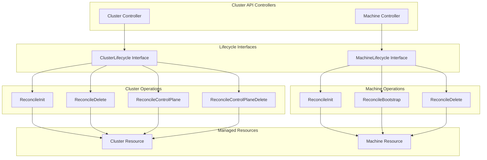

# hook
```go
// Cluster API 标准的生命周期钩子
type ClusterLifecycle interface {
    // 基础设施相关
    ReconcileDelete(ctx context.Context, cluster *clusterv1.Cluster) error
    ReconcileInit(ctx context.Context, cluster *clusterv1.Cluster) error
    
    // 控制平面相关
    ReconcileControlPlane(ctx context.Context, cluster *clusterv1.Cluster) error
    ReconcileControlPlaneDelete(ctx context.Context, cluster *clusterv1.Cluster) error
}

type MachineLifecycle interface {
    // 引导相关
    ReconcileBootstrap(ctx context.Context, machine *clusterv1.Machine) error
    
    // 基础设施相关
    ReconcileDelete(ctx context.Context, machine *clusterv1.Machine) error
    ReconcileInit(ctx context.Context, machine *clusterv1.Machine) error
}
```
你贴出的接口定义其实就是 **Cluster API 标准生命周期钩子**的抽象。它们的作用是把不同 Provider 的职责拆分清晰：Cluster 层面和 Machine 层面分别有对应的生命周期方法，控制器在调和时会调用这些接口来驱动集群和节点的创建、初始化、删除等过程。
## 📌 ClusterLifecycle
- **ReconcileInit**：集群初始化逻辑，例如创建基础设施网络、生成 kubeconfig、准备控制平面。  
- **ReconcileDelete**：集群删除逻辑，清理基础设施资源。  
- **ReconcileControlPlane**：控制平面组件的安装与升级（API Server、Controller Manager、Etcd）。  
- **ReconcileControlPlaneDelete**：控制平面删除逻辑，安全下线 API Server/Etcd 等。
## 📌 MachineLifecycle
- **ReconcileInit**：节点初始化逻辑，例如创建 VM、挂载磁盘、配置网络。  
- **ReconcileBootstrap**：节点引导逻辑，生成 cloud-init/userData，执行 `kubeadm init/join`。  
- **ReconcileDelete**：节点删除逻辑，释放底层资源。
## 🔑 设计价值
- **职责分离**：Cluster 与 Machine 生命周期分开，避免耦合。  
- **标准化接口**：不同 Provider（Infra、Bootstrap、ControlPlane）都可以实现这些接口，统一被 Cluster API 调用。  
- **可扩展性**：支持多种基础设施（AWS、Azure、BKE）、多种引导方式（kubeadm、Ignition）。  
- **一致性**：所有 Provider 遵循相同生命周期钩子，保证集群管理逻辑一致。
## 📊 总结
- **ClusterLifecycle** → 管理集群整体和控制平面。  
- **MachineLifecycle** → 管理单个节点的初始化、引导和删除。  
- 控制器在调和时调用这些接口，驱动集群和节点的完整生命周期。  
## 架构图
直观展示 Cluster API 控制器如何调用生命周期接口来驱动集群和节点的创建与删除：

### 图解说明
- **Cluster Controller**：负责调和集群资源，调用 `ClusterLifecycle` 接口。  
- **Machine Controller**：负责调和节点资源，调用 `MachineLifecycle` 接口。  
- **ClusterLifecycle**：提供集群级别的生命周期钩子，包括初始化、删除、控制平面管理。  
- **MachineLifecycle**：提供节点级别的生命周期钩子，包括初始化、引导、删除。  
- **资源对象**：最终操作作用于 `Cluster` 和 `Machine` 资源，驱动集群和节点的完整生命周期。  
### 价值
- **标准化**：所有 Provider 都实现统一的生命周期接口。  
- **解耦**：Cluster 与 Machine 生命周期分离，职责清晰。  
- **自动化**：控制器在调和时自动调用对应接口，完成集群和节点的创建、引导、删除。  

这样你就能直观理解：**Cluster API 控制器通过调用 ClusterLifecycle 和 MachineLifecycle 接口，把声明式的资源对象转化为实际的集群和节点操作。**
