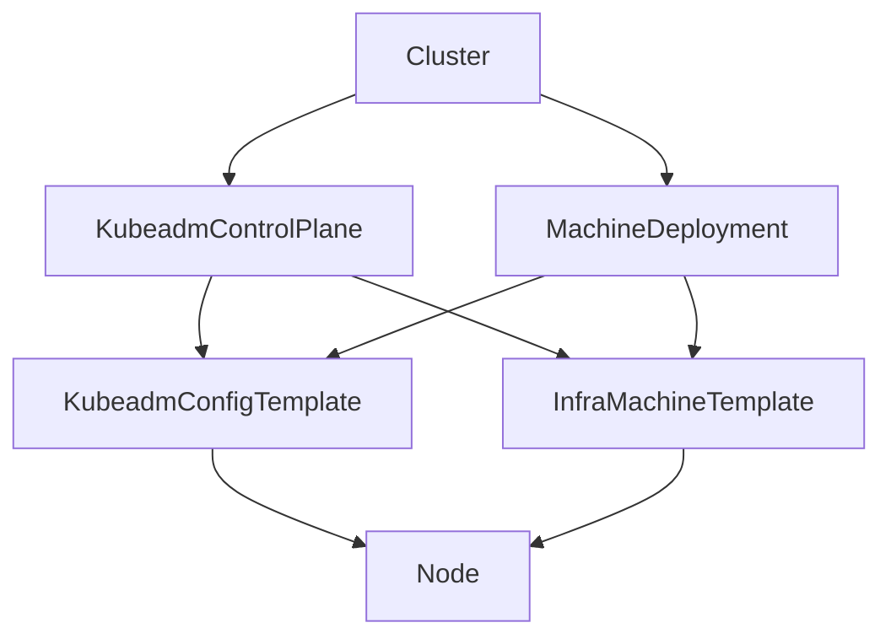

# KubeadmConfig
**`KubeadmConfig` 是 Cluster API 中的一个 Bootstrap 资源，用来定义节点在加入集群时的初始化配置。它封装了 kubeadm 的配置文件逻辑，使得控制平面和工作节点能够通过声明式方式完成初始化与加入。**

## ✨ 关键作用
- **节点引导配置**  
  提供 kubeadm 初始化和加入所需的参数，例如 `InitConfiguration`、`JoinConfiguration`。

- **控制平面与工作节点区分**  
  控制平面节点使用 `KubeadmControlPlane`（内部引用 `KubeadmConfigTemplate`），工作节点使用 `MachineDeployment` 搭配 `KubeadmConfigTemplate`。

- **声明式管理**  
  将 kubeadm 的配置文件转化为 Kubernetes CRD，支持 GitOps、版本化和自动化。

- **支持自定义参数**  
  可以通过 `ClusterConfiguration` 或 `KubeletConfiguration` 自定义 API Server、Controller Manager、Scheduler、Kubelet 等组件的参数。

## 📑 常见字段
| **字段** | **作用** |
|----------------|----------------|
| `initConfiguration` | 控制平面初始化配置（如证书、API Server 地址） |
| `clusterConfiguration` | 集群范围配置（如 Pod CIDR、Service CIDR、DNS） |
| `joinConfiguration` | 工作节点加入配置（如 discovery token、CA 证书） |
| `preKubeadmCommands` | 在运行 kubeadm 前执行的命令 |
| `postKubeadmCommands` | 在运行 kubeadm 后执行的命令 |
| `files` | 在节点上生成的额外文件（如配置文件、脚本） |

## ⚠️ 注意事项
- **控制平面节点必须使用 KubeadmControlPlane**，不要直接用 `KubeadmConfig`。  
- **工作节点使用 KubeadmConfigTemplate**，由 `MachineDeployment` 引用。  
- **升级策略**：修改 `KubeadmConfigTemplate` 会触发节点替换，需提前规划。  
- **安全性**：Bootstrap Token 有时效性，需确保在节点加入时有效。  

## ✅ 总结
`KubeadmConfig` 是 Cluster API 的 **Bootstrap 配置资源**，用于声明式管理 kubeadm 初始化与加入逻辑。它通过模板化方式支持控制平面和工作节点的自动化配置，是 Cluster API **节点生命周期管理的核心组件**。  

## 架构图

🔎 图解说明
- **Cluster**  
  顶层对象，声明整个集群。

- **KubeadmControlPlane**  
  管理控制平面节点，引用 `KubeadmConfigTemplate` 和 `InfraMachineTemplate`，分别定义引导配置和底层机器规格。

- **MachineDeployment**  
  管理工作节点，同样引用 `KubeadmConfigTemplate` 和 `InfraMachineTemplate`。

- **KubeadmConfigTemplate**  
  提供 kubeadm 初始化与加入的模板配置。

- **InfraMachineTemplate**  
  定义底层基础设施机器（如 VM 类型、磁盘大小、网络配置），由不同的 provider 实现（AWSMachineTemplate、AzureMachineTemplate、DockerMachineTemplate 等）。

- **Node**  
  最终生成的 Kubernetes 节点，结合引导配置和基础设施模板运行在实际环境中。

这样你可以清晰看到：**Cluster** 通过控制器（`KubeadmControlPlane` 和 `MachineDeployment`）分别引用 **引导配置模板** 和 **基础设施模板**，最终生成实际的 **Node**。  

# KubeadmConfigSpec的Files/DiskSetup/Mounts/Users/NTP/Format依赖哪个组件执行生效
**最重要的结论先说：**  
在 **KubeadmConfigSpec** 中的：
- **Files**  
- **DiskSetup**  
- **Mounts**  
- **Users**  
- **NTP**  
- **Format**  

这些字段 **全部不是 kubeadm 执行的**，也不是 CAPI 控制器执行的，而是：

## **由 cloud-init 或 Ignition 执行生效（取决于 format）**  
这是官方文档明确说明的：  
KubeadmConfigSpec 中这些字段属于 **bootstrap provider（CABPK）生成的 cloud-init 或 Ignition 配置的一部分**，最终由 **cloud-init 或 Ignition 在虚拟机/裸金属节点启动时执行**。  
  [release-1-0.cluster-api.sigs.k8s.io](https://release-1-0.cluster-api.sigs.k8s.io/tasks/kubeadm-bootstrap.html)  [deepwiki.com](https://deepwiki.com/kubernetes-sigs/cluster-api/2.4-bootstrap-resources)

## 为什么这些字段依赖 cloud-init / Ignition？

因为 CABPK（kubeadm bootstrap provider）做的事情是：
1. 读取 KubeadmConfigSpec  
2. 生成 **cloud-init 或 Ignition user-data**  
3. 写入 Secret  
4. 由 Infra Provider（如 Metal3、vSphere、AWS）注入到机器  
5. **cloud-init / Ignition 在节点启动时执行这些配置**

这些字段本质上是 cloud-init 的模块映射：

| KubeadmConfigSpec 字段 | cloud-init 模块 | 执行者 |
|------------------------|------------------|--------|
| **Files** | write_files | cloud-init |
| **DiskSetup** | disk_setup + fs_setup | cloud-init |
| **Mounts** | mounts | cloud-init |
| **Users** | users | cloud-init |
| **NTP** | ntp | cloud-init |
| **Format** | cloud-config / ignition | CABPK → cloud-init/ignition |

官方文档明确指出：  
> “KubeadmConfig generates cloud-init or Ignition data needed to bootstrap nodes.”  
  [deepwiki.com](https://deepwiki.com/kubernetes-sigs/cluster-api/2.4-bootstrap-resources)

## 那 kubeadm 执行什么？

kubeadm **只执行 init/join**，不负责：
- 创建文件  
- 分区  
- 挂载  
- 创建用户  
- 配置 NTP  

这些都是 cloud-init 的职责。

## 如果你不用 cloud-init，会发生什么？

**这些字段全部失效。** 因为：
- CABPK 只生成 cloud-init/ignition user-data  
- 它不会自己执行  
- kubeadm 也不会执行  
- Infra Provider 也不会执行  

所以如果你自研 baremetal provider（你正在做的事情），并且 **不使用 cloud-init**，你必须：

## **自己实现 cloud-init 的执行器（cloud-init executor）**

也就是：
- 解析 Files → 写文件  
- 解析 DiskSetup → 分区 + mkfs  
- 解析 Mounts → 写 /etc/fstab + mount  
- 解析 Users → 创建用户  
- 解析 NTP → 写 ntp.conf  
- 解析 pre/postKubeadmCommands → 执行 shell  

否则这些字段完全不会生效。

## 一张图总结执行链路

```
KubeadmConfigSpec
     ↓
CABPK 生成 cloud-init/ignition user-data
     ↓
Infra Provider 注入 user-data
     ↓
cloud-init / Ignition 执行：
   - Files
   - DiskSetup
   - Mounts
   - Users
   - NTP
   - pre/postKubeadmCommands
     ↓
kubeadm init/join
```

## 一句话总结

> **KubeadmConfigSpec 中 Files/DiskSetup/Mounts/Users/NTP/Format 全部由 cloud-init 或 Ignition 执行，不是 kubeadm 执行。如果你不用 cloud-init，这些字段不会生效，必须自己实现执行逻辑。**

