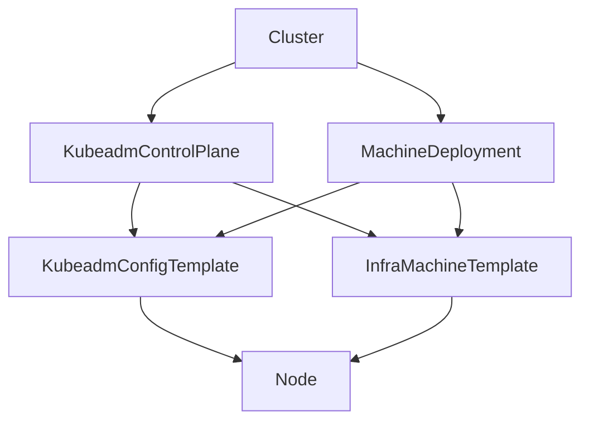

# KubeadmConfig
**`KubeadmConfig` 是 Cluster API 中的一个 Bootstrap 资源，用来定义节点在加入集群时的初始化配置。它封装了 kubeadm 的配置文件逻辑，使得控制平面和工作节点能够通过声明式方式完成初始化与加入。**

## ✨ 关键作用
- **节点引导配置**  
  提供 kubeadm 初始化和加入所需的参数，例如 `InitConfiguration`、`JoinConfiguration`。

- **控制平面与工作节点区分**  
  控制平面节点使用 `KubeadmControlPlane`（内部引用 `KubeadmConfigTemplate`），工作节点使用 `MachineDeployment` 搭配 `KubeadmConfigTemplate`。

- **声明式管理**  
  将 kubeadm 的配置文件转化为 Kubernetes CRD，支持 GitOps、版本化和自动化。

- **支持自定义参数**  
  可以通过 `ClusterConfiguration` 或 `KubeletConfiguration` 自定义 API Server、Controller Manager、Scheduler、Kubelet 等组件的参数。

## 📑 常见字段
| **字段** | **作用** |
|----------------|----------------|
| `initConfiguration` | 控制平面初始化配置（如证书、API Server 地址） |
| `clusterConfiguration` | 集群范围配置（如 Pod CIDR、Service CIDR、DNS） |
| `joinConfiguration` | 工作节点加入配置（如 discovery token、CA 证书） |
| `preKubeadmCommands` | 在运行 kubeadm 前执行的命令 |
| `postKubeadmCommands` | 在运行 kubeadm 后执行的命令 |
| `files` | 在节点上生成的额外文件（如配置文件、脚本） |

## ⚠️ 注意事项
- **控制平面节点必须使用 KubeadmControlPlane**，不要直接用 `KubeadmConfig`。  
- **工作节点使用 KubeadmConfigTemplate**，由 `MachineDeployment` 引用。  
- **升级策略**：修改 `KubeadmConfigTemplate` 会触发节点替换，需提前规划。  
- **安全性**：Bootstrap Token 有时效性，需确保在节点加入时有效。  

## ✅ 总结
`KubeadmConfig` 是 Cluster API 的 **Bootstrap 配置资源**，用于声明式管理 kubeadm 初始化与加入逻辑。它通过模板化方式支持控制平面和工作节点的自动化配置，是 Cluster API **节点生命周期管理的核心组件**。  

## 架构图

🔎 图解说明
- **Cluster**  
  顶层对象，声明整个集群。

- **KubeadmControlPlane**  
  管理控制平面节点，引用 `KubeadmConfigTemplate` 和 `InfraMachineTemplate`，分别定义引导配置和底层机器规格。

- **MachineDeployment**  
  管理工作节点，同样引用 `KubeadmConfigTemplate` 和 `InfraMachineTemplate`。

- **KubeadmConfigTemplate**  
  提供 kubeadm 初始化与加入的模板配置。

- **InfraMachineTemplate**  
  定义底层基础设施机器（如 VM 类型、磁盘大小、网络配置），由不同的 provider 实现（AWSMachineTemplate、AzureMachineTemplate、DockerMachineTemplate 等）。

- **Node**  
  最终生成的 Kubernetes 节点，结合引导配置和基础设施模板运行在实际环境中。

这样你可以清晰看到：**Cluster** 通过控制器（`KubeadmControlPlane` 和 `MachineDeployment`）分别引用 **引导配置模板** 和 **基础设施模板**，最终生成实际的 **Node**。  
