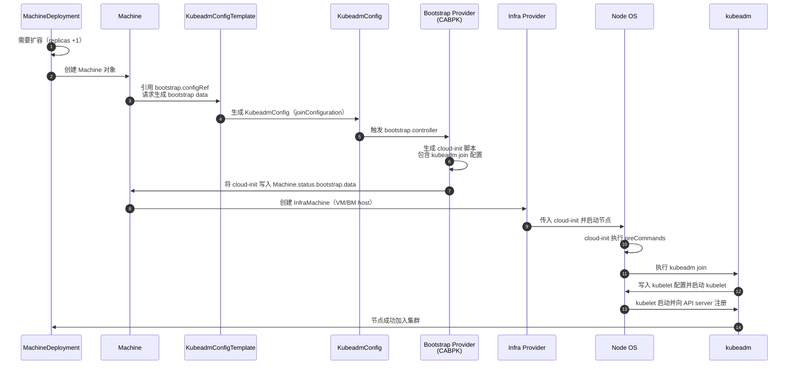

# KubeadmConfigTemplate 
**`KubeadmConfigTemplate` 是 Cluster API 的 *Bootstrap Provider 模板*，用于批量生成节点加入集群所需的 kubeadm 配置（init/join），通常由 MachineDeployment 或 KubeadmControlPlane 引用，用来创建节点的 bootstrap data。**

它不是直接执行 kubeadm，而是生成 cloud-init（或 ignition）里要执行的 kubeadm 配置和命令。

## KubeadmConfigTemplate 是什么（核心定义）

**KubeadmConfigTemplate = kubeadm bootstrap 配置的模板（Template）**  
它本身不会创建节点，而是被 MachineDeployment 或 KubeadmControlPlane 用来：
- 生成 kubeadm init/join 配置  
- 生成 cloud-init 脚本  
- 提供 kubelet 配置  
- 提供 pre/post kubeadm commands  
- 提供额外文件（如 systemd、脚本、证书等）

它的作用类似于：
> “给我一个模板，我要用它批量创建节点的 kubeadm 配置。”

## 它在 Cluster API 中的位置（架构图）

```
MachineDeployment
   └── Machine
         ├── bootstrap.configRef → KubeadmConfigTemplate
         └── infrastructureRef   → InfraMachineTemplate
```

控制平面则是：
```
KubeadmControlPlane
   ├── infrastructureTemplate → InfraMachineTemplate
   └── kubeadmConfigSpec      → 内嵌的 KubeadmConfigTemplate
```

## 它解决了什么问题？

### 1. **批量创建节点的 kubeadm 配置**
MachineDeployment 扩容时，每个 Machine 都需要：
- kubeadm join 配置  
- discovery token  
- caCertHashes  
- kubeletExtraArgs  
- cloud-init 脚本

这些都由 **KubeadmConfigTemplate 自动生成**。

### 2. **声明式管理 kubeadm 配置**
你可以把 kubeadm 配置写成 CRD，而不是写在 cloud-init 里。

### 3. **支持滚动升级**
修改 KubeadmConfigTemplate → MachineDeployment 会触发滚动替换节点。

## 一个典型的 KubeadmConfigTemplate 示例（worker 节点）

```yaml
apiVersion: bootstrap.cluster.x-k8s.io/v1beta1
kind: KubeadmConfigTemplate
metadata:
  name: worker-template
spec:
  template:
    spec:
      joinConfiguration:
        nodeRegistration:
          kubeletExtraArgs:
            cloud-provider: external
      preKubeadmCommands:
        - echo "before join"
      postKubeadmCommands:
        - echo "after join"
```

它会被 MachineDeployment 引用：

```yaml
spec:
  template:
    spec:
      bootstrap:
        configRef:
          apiVersion: bootstrap.cluster.x-k8s.io/v1beta1
          kind: KubeadmConfigTemplate
          name: worker-template
```

## 🧩 KubeadmConfigTemplate vs KubeadmConfig（区别）

| 资源 | 用途 |
|------|------|
| **KubeadmConfig** | 单个节点的 kubeadm 配置（由 controller 自动生成） |
| **KubeadmConfigTemplate** | 模板，用来批量生成多个 KubeadmConfig |

你永远不会手动创建 KubeadmConfig，它由 Machine controller 自动生成。

## 🧩 KubeadmConfigTemplate 在控制平面中的角色

控制平面不直接使用 KubeadmConfigTemplate，而是：
- **KubeadmControlPlane 内嵌了一个 KubeadmConfigTemplate 的 spec**

所以控制平面节点的 bootstrap 配置写在：
```
KubeadmControlPlane.spec.kubeadmConfigSpec
```
而不是单独的 CRD。

## 总结（最关键一句）

**KubeadmConfigTemplate 是 kubeadm bootstrap 配置的模板，用于 MachineDeployment 或 KubeadmControlPlane 批量生成节点加入集群所需的 kubeadm 配置。**


# **KubeadmConfigTemplate → Machine → cloud-init → kubeadm join 全流程时序图**


## **流程解读（关键步骤）**

### 1. MachineDeployment 扩容 → 创建 Machine  
MachineDeployment 发现需要扩容时，会创建一个新的 **Machine**。

Machine 上包含两个引用：
- `bootstrap.configRef` → **KubeadmConfigTemplate**
- `infrastructureRef` → InfraMachineTemplate

### 2. KubeadmConfigTemplate → 生成 KubeadmConfig  
KubeadmConfigTemplate 是模板，Machine controller 会根据它生成一个 **KubeadmConfig**：
- joinConfiguration  
- discovery token  
- caCertHashes  
- kubeletExtraArgs  
- pre/post commands  

### 3. Bootstrap Provider（CABPK）生成 cloud-init  
CABPK controller 读取 KubeadmConfig 并生成：
- cloud-init user-data  
- kubeadm join 命令  
- kubelet 配置  
- systemd 单元  
- 证书/文件（如有）

并写入：
```
Machine.status.bootstrap.data
```

### 4. Infra Provider 创建节点并执行 cloud-init  
Infra provider（如 baremetal、vsphere、openstack）负责：
- 创建 VM / 裸金属主机  
- 注入 cloud-init  
- 启动节点  

### 5. cloud-init 执行 kubeadm join  
cloud-init 执行：
1. preKubeadmCommands  
2. `kubeadm join ...`  
3. postKubeadmCommands  

kubeadm 完成：
- kubelet 配置  
- TLS bootstrap  
- 节点注册  

最终节点加入集群。

## **一句话总结**
**KubeadmConfigTemplate 只是模板 → Machine 生成 KubeadmConfig → CABPK 生成 cloud-init → Infra provider 执行 cloud-init → kubeadm join 完成节点加入。**

# 控制平面 vs 工作节点：Bootstrap 配置对比表

| 项目 | **控制平面节点（KubeadmControlPlane）** | **工作节点（MachineDeployment + KubeadmConfigTemplate）** |
|------|------------------------------------------|------------------------------------------------------------|
| **负责组件** | API Server / Controller Manager / Scheduler / etcd | 普通 Worker 节点（kubelet） |
| **Bootstrap CRD 来源** | `KubeadmControlPlane.spec.kubeadmConfigSpec`（内嵌） | `KubeadmConfigTemplate`（外部模板） |
| **生成的 KubeadmConfig 类型** | `initConfiguration` + `clusterConfiguration` + `joinConfiguration.controlPlane` | `joinConfiguration.nodeRegistration` |
| **是否需要 certificateKey** | ✔ 需要，用于分发控制平面证书 | ✘ 不需要 |
| **是否加入 etcd** | ✔ 是（etcd 成员） | ✘ 否 |
| **是否运行 kubeadm init** | ✔ 第一个控制平面节点执行 init | ✘ 永远不执行 init |
| **是否运行 kubeadm join** | ✔ 后续控制平面节点执行 join --control-plane | ✔ worker 节点执行 join |
| **cloud-init 生成者** | CABPK（bootstrap provider） | CABPK（bootstrap provider） |
| **cloud-init 内容复杂度** | 高（证书、etcd、API server 参数、静态 Pod） | 低（kubeadm join + kubelet 配置） |
| **升级方式** | KCP 滚动升级控制平面 | MachineDeployment 滚动替换 worker |
| **扩容方式** | KCP replicas | MachineDeployment replicas |
| **是否需要管理 etcd 成员变更** | ✔ 是 | ✘ 否 |
| **是否需要管理 API Server 端点** | ✔ 是（controlPlaneEndpoint） | ✘ 否 |
| **是否需要 pre/post kubeadm commands** | 可选（常用于 systemd、内核参数） | 可选（常用于 CNI、驱动安装） |
| **典型使用场景** | 控制平面节点生命周期管理 | Worker 节点批量扩容/缩容 |

## 关键差异总结（最重要的 5 点）

### 1. **控制平面节点使用 KubeadmControlPlane（内嵌 bootstrap spec）**  
工作节点使用 **KubeadmConfigTemplate（外部模板）**。

### 2. 控制平面节点需要 **certificateKey + etcd 成员管理**  
工作节点完全不需要。

### 3. 控制平面节点可能执行 **kubeadm init**  
工作节点永远只执行 **kubeadm join**。

### 4. 控制平面由 **KCP** 管理滚动升级  
工作节点由 **MachineDeployment** 管理滚动升级。

### 5. 控制平面 cloud-init 内容复杂度远高于 worker  
因为涉及：
- etcd 静态 Pod
- API server 参数
- 证书分发
- controlPlaneEndpoint

**一句话先回答你：**  
**`KubeadmConfigTemplate` 是 Cluster API 的 *Bootstrap Provider 模板*，用于批量生成节点加入集群所需的 kubeadm 配置（init/join），通常由 MachineDeployment 或 KubeadmControlPlane 引用，用来创建节点的 bootstrap data。**

#  KubeadmConfigTemplate 是什么（核心定义）
**KubeadmConfigTemplate = kubeadm bootstrap 配置的模板（Template）**  
它本身不会创建节点，而是被 MachineDeployment 或 KubeadmControlPlane 用来：
- 生成 kubeadm init/join 配置  
- 生成 cloud-init 脚本  
- 提供 kubelet 配置  
- 提供 pre/post kubeadm commands  
- 提供额外文件（如 systemd、脚本、证书等）

它的作用类似于：

> “给我一个模板，我要用它批量创建节点的 kubeadm 配置。”

## 它在 Cluster API 中的位置（架构图）
```
MachineDeployment
   └── Machine
         ├── bootstrap.configRef → KubeadmConfigTemplate
         └── infrastructureRef   → InfraMachineTemplate
```

控制平面则是：

```
KubeadmControlPlane
   ├── infrastructureTemplate → InfraMachineTemplate
   └── kubeadmConfigSpec      → 内嵌的 KubeadmConfigTemplate
```

## 它解决了什么问题？

### 1. **批量创建节点的 kubeadm 配置**
MachineDeployment 扩容时，每个 Machine 都需要：

- kubeadm join 配置  
- discovery token  
- caCertHashes  
- kubeletExtraArgs  
- cloud-init 脚本

这些都由 **KubeadmConfigTemplate 自动生成**。

### 2. **声明式管理 kubeadm 配置**
你可以把 kubeadm 配置写成 CRD，而不是写在 cloud-init 里。

### 3. **支持滚动升级**
修改 KubeadmConfigTemplate → MachineDeployment 会触发滚动替换节点。

## 一个典型的 KubeadmConfigTemplate 示例（worker 节点）
```yaml
apiVersion: bootstrap.cluster.x-k8s.io/v1beta1
kind: KubeadmConfigTemplate
metadata:
  name: worker-template
spec:
  template:
    spec:
      joinConfiguration:
        nodeRegistration:
          kubeletExtraArgs:
            cloud-provider: external
      preKubeadmCommands:
        - echo "before join"
      postKubeadmCommands:
        - echo "after join"
```

它会被 MachineDeployment 引用：

```yaml
spec:
  template:
    spec:
      bootstrap:
        configRef:
          apiVersion: bootstrap.cluster.x-k8s.io/v1beta1
          kind: KubeadmConfigTemplate
          name: worker-template
```
## KubeadmConfigTemplate vs KubeadmConfig（区别）

| 资源 | 用途 |
|------|------|
| **KubeadmConfig** | 单个节点的 kubeadm 配置（由 controller 自动生成） |
| **KubeadmConfigTemplate** | 模板，用来批量生成多个 KubeadmConfig |

你永远不会手动创建 KubeadmConfig，它由 Machine controller 自动生成。

## KubeadmConfigTemplate 在控制平面中的角色

控制平面不直接使用 KubeadmConfigTemplate，而是：
- **KubeadmControlPlane 内嵌了一个 KubeadmConfigTemplate 的 spec**

所以控制平面节点的 bootstrap 配置写在：
```
KubeadmControlPlane.spec.kubeadmConfigSpec
```
而不是单独的 CRD。

## 总结（最关键一句）

**KubeadmConfigTemplate 是 kubeadm bootstrap 配置的模板，用于 MachineDeployment 或 KubeadmControlPlane 批量生成节点加入集群所需的 kubeadm 配置。**

