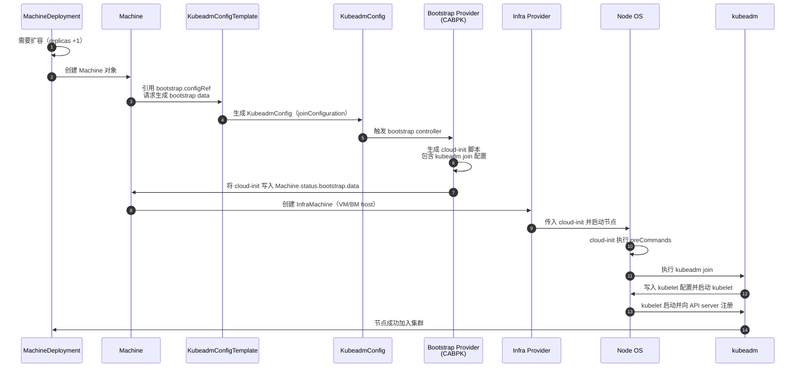

# KubeadmConfigTemplate 
**`KubeadmConfigTemplate` 是 Cluster API 的 *Bootstrap Provider 模板*，用于批量生成节点加入集群所需的 kubeadm 配置（init/join），通常由 MachineDeployment 或 KubeadmControlPlane 引用，用来创建节点的 bootstrap data。**

它不是直接执行 kubeadm，而是生成 cloud-init（或 ignition）里要执行的 kubeadm 配置和命令。

## KubeadmConfigTemplate 是什么（核心定义）

**KubeadmConfigTemplate = kubeadm bootstrap 配置的模板（Template）**  
它本身不会创建节点，而是被 MachineDeployment 或 KubeadmControlPlane 用来：
- 生成 kubeadm init/join 配置  
- 生成 cloud-init 脚本  
- 提供 kubelet 配置  
- 提供 pre/post kubeadm commands  
- 提供额外文件（如 systemd、脚本、证书等）

它的作用类似于：
> “给我一个模板，我要用它批量创建节点的 kubeadm 配置。”

## 它在 Cluster API 中的位置（架构图）

```
MachineDeployment
   └── Machine
         ├── bootstrap.configRef → KubeadmConfigTemplate
         └── infrastructureRef   → InfraMachineTemplate
```

控制平面则是：
```
KubeadmControlPlane
   ├── infrastructureTemplate → InfraMachineTemplate
   └── kubeadmConfigSpec      → 内嵌的 KubeadmConfigTemplate
```

## 它解决了什么问题？

### 1. **批量创建节点的 kubeadm 配置**
MachineDeployment 扩容时，每个 Machine 都需要：
- kubeadm join 配置  
- discovery token  
- caCertHashes  
- kubeletExtraArgs  
- cloud-init 脚本

这些都由 **KubeadmConfigTemplate 自动生成**。

### 2. **声明式管理 kubeadm 配置**
你可以把 kubeadm 配置写成 CRD，而不是写在 cloud-init 里。

### 3. **支持滚动升级**
修改 KubeadmConfigTemplate → MachineDeployment 会触发滚动替换节点。

## 一个典型的 KubeadmConfigTemplate 示例（worker 节点）

```yaml
apiVersion: bootstrap.cluster.x-k8s.io/v1beta1
kind: KubeadmConfigTemplate
metadata:
  name: worker-template
spec:
  template:
    spec:
      joinConfiguration:
        nodeRegistration:
          kubeletExtraArgs:
            cloud-provider: external
      preKubeadmCommands:
        - echo "before join"
      postKubeadmCommands:
        - echo "after join"
```

它会被 MachineDeployment 引用：

```yaml
spec:
  template:
    spec:
      bootstrap:
        configRef:
          apiVersion: bootstrap.cluster.x-k8s.io/v1beta1
          kind: KubeadmConfigTemplate
          name: worker-template
```

## 🧩 KubeadmConfigTemplate vs KubeadmConfig（区别）

| 资源 | 用途 |
|------|------|
| **KubeadmConfig** | 单个节点的 kubeadm 配置（由 controller 自动生成） |
| **KubeadmConfigTemplate** | 模板，用来批量生成多个 KubeadmConfig |

你永远不会手动创建 KubeadmConfig，它由 Machine controller 自动生成。

## 🧩 KubeadmConfigTemplate 在控制平面中的角色

控制平面不直接使用 KubeadmConfigTemplate，而是：
- **KubeadmControlPlane 内嵌了一个 KubeadmConfigTemplate 的 spec**

所以控制平面节点的 bootstrap 配置写在：
```
KubeadmControlPlane.spec.kubeadmConfigSpec
```
而不是单独的 CRD。

## 总结（最关键一句）

**KubeadmConfigTemplate 是 kubeadm bootstrap 配置的模板，用于 MachineDeployment 或 KubeadmControlPlane 批量生成节点加入集群所需的 kubeadm 配置。**


# **KubeadmConfigTemplate → Machine → cloud-init → kubeadm join 全流程时序图**


## **流程解读（关键步骤）**

### 1. MachineDeployment 扩容 → 创建 Machine  
MachineDeployment 发现需要扩容时，会创建一个新的 **Machine**。

Machine 上包含两个引用：
- `bootstrap.configRef` → **KubeadmConfigTemplate**
- `infrastructureRef` → InfraMachineTemplate

### 2. KubeadmConfigTemplate → 生成 KubeadmConfig  
KubeadmConfigTemplate 是模板，Machine controller 会根据它生成一个 **KubeadmConfig**：
- joinConfiguration  
- discovery token  
- caCertHashes  
- kubeletExtraArgs  
- pre/post commands  

### 3. Bootstrap Provider（CABPK）生成 cloud-init  
CABPK controller 读取 KubeadmConfig 并生成：
- cloud-init user-data  
- kubeadm join 命令  
- kubelet 配置  
- systemd 单元  
- 证书/文件（如有）

并写入：
```
Machine.status.bootstrap.data
```

### 4. Infra Provider 创建节点并执行 cloud-init  
Infra provider（如 baremetal、vsphere、openstack）负责：
- 创建 VM / 裸金属主机  
- 注入 cloud-init  
- 启动节点  

### 5. cloud-init 执行 kubeadm join  
cloud-init 执行：
1. preKubeadmCommands  
2. `kubeadm join ...`  
3. postKubeadmCommands  

kubeadm 完成：
- kubelet 配置  
- TLS bootstrap  
- 节点注册  

最终节点加入集群。

## **一句话总结**
**KubeadmConfigTemplate 只是模板 → Machine 生成 KubeadmConfig → CABPK 生成 cloud-init → Infra provider 执行 cloud-init → kubeadm join 完成节点加入。**

# 控制平面 vs 工作节点：Bootstrap 配置对比表

| 项目 | **控制平面节点（KubeadmControlPlane）** | **工作节点（MachineDeployment + KubeadmConfigTemplate）** |
|------|------------------------------------------|------------------------------------------------------------|
| **负责组件** | API Server / Controller Manager / Scheduler / etcd | 普通 Worker 节点（kubelet） |
| **Bootstrap CRD 来源** | `KubeadmControlPlane.spec.kubeadmConfigSpec`（内嵌） | `KubeadmConfigTemplate`（外部模板） |
| **生成的 KubeadmConfig 类型** | `initConfiguration` + `clusterConfiguration` + `joinConfiguration.controlPlane` | `joinConfiguration.nodeRegistration` |
| **是否需要 certificateKey** | ✔ 需要，用于分发控制平面证书 | ✘ 不需要 |
| **是否加入 etcd** | ✔ 是（etcd 成员） | ✘ 否 |
| **是否运行 kubeadm init** | ✔ 第一个控制平面节点执行 init | ✘ 永远不执行 init |
| **是否运行 kubeadm join** | ✔ 后续控制平面节点执行 join --control-plane | ✔ worker 节点执行 join |
| **cloud-init 生成者** | CABPK（bootstrap provider） | CABPK（bootstrap provider） |
| **cloud-init 内容复杂度** | 高（证书、etcd、API server 参数、静态 Pod） | 低（kubeadm join + kubelet 配置） |
| **升级方式** | KCP 滚动升级控制平面 | MachineDeployment 滚动替换 worker |
| **扩容方式** | KCP replicas | MachineDeployment replicas |
| **是否需要管理 etcd 成员变更** | ✔ 是 | ✘ 否 |
| **是否需要管理 API Server 端点** | ✔ 是（controlPlaneEndpoint） | ✘ 否 |
| **是否需要 pre/post kubeadm commands** | 可选（常用于 systemd、内核参数） | 可选（常用于 CNI、驱动安装） |
| **典型使用场景** | 控制平面节点生命周期管理 | Worker 节点批量扩容/缩容 |

## 关键差异总结（最重要的 5 点）

### 1. **控制平面节点使用 KubeadmControlPlane（内嵌 bootstrap spec）**  
工作节点使用 **KubeadmConfigTemplate（外部模板）**。

### 2. 控制平面节点需要 **certificateKey + etcd 成员管理**  
工作节点完全不需要。

### 3. 控制平面节点可能执行 **kubeadm init**  
工作节点永远只执行 **kubeadm join**。

### 4. 控制平面由 **KCP** 管理滚动升级  
工作节点由 **MachineDeployment** 管理滚动升级。

### 5. 控制平面 cloud-init 内容复杂度远高于 worker  
因为涉及：
- etcd 静态 Pod
- API server 参数
- 证书分发
- controlPlaneEndpoint

**一句话先回答你：**  
**`KubeadmConfigTemplate` 是 Cluster API 的 *Bootstrap Provider 模板*，用于批量生成节点加入集群所需的 kubeadm 配置（init/join），通常由 MachineDeployment 或 KubeadmControlPlane 引用，用来创建节点的 bootstrap data。**

#  KubeadmConfigTemplate 是什么（核心定义）
**KubeadmConfigTemplate = kubeadm bootstrap 配置的模板（Template）**  
它本身不会创建节点，而是被 MachineDeployment 或 KubeadmControlPlane 用来：
- 生成 kubeadm init/join 配置  
- 生成 cloud-init 脚本  
- 提供 kubelet 配置  
- 提供 pre/post kubeadm commands  
- 提供额外文件（如 systemd、脚本、证书等）

它的作用类似于：

> “给我一个模板，我要用它批量创建节点的 kubeadm 配置。”

## 它在 Cluster API 中的位置（架构图）
```
MachineDeployment
   └── Machine
         ├── bootstrap.configRef → KubeadmConfigTemplate
         └── infrastructureRef   → InfraMachineTemplate
```

控制平面则是：

```
KubeadmControlPlane
   ├── infrastructureTemplate → InfraMachineTemplate
   └── kubeadmConfigSpec      → 内嵌的 KubeadmConfigTemplate
```

## 它解决了什么问题？

### 1. **批量创建节点的 kubeadm 配置**
MachineDeployment 扩容时，每个 Machine 都需要：

- kubeadm join 配置  
- discovery token  
- caCertHashes  
- kubeletExtraArgs  
- cloud-init 脚本

这些都由 **KubeadmConfigTemplate 自动生成**。

### 2. **声明式管理 kubeadm 配置**
你可以把 kubeadm 配置写成 CRD，而不是写在 cloud-init 里。

### 3. **支持滚动升级**
修改 KubeadmConfigTemplate → MachineDeployment 会触发滚动替换节点。

## 一个典型的 KubeadmConfigTemplate 示例（worker 节点）
```yaml
apiVersion: bootstrap.cluster.x-k8s.io/v1beta1
kind: KubeadmConfigTemplate
metadata:
  name: worker-template
spec:
  template:
    spec:
      joinConfiguration:
        nodeRegistration:
          kubeletExtraArgs:
            cloud-provider: external
      preKubeadmCommands:
        - echo "before join"
      postKubeadmCommands:
        - echo "after join"
```

它会被 MachineDeployment 引用：

```yaml
spec:
  template:
    spec:
      bootstrap:
        configRef:
          apiVersion: bootstrap.cluster.x-k8s.io/v1beta1
          kind: KubeadmConfigTemplate
          name: worker-template
```
## KubeadmConfigTemplate vs KubeadmConfig（区别）

| 资源 | 用途 |
|------|------|
| **KubeadmConfig** | 单个节点的 kubeadm 配置（由 controller 自动生成） |
| **KubeadmConfigTemplate** | 模板，用来批量生成多个 KubeadmConfig |

你永远不会手动创建 KubeadmConfig，它由 Machine controller 自动生成。

## KubeadmConfigTemplate 在控制平面中的角色

控制平面不直接使用 KubeadmConfigTemplate，而是：
- **KubeadmControlPlane 内嵌了一个 KubeadmConfigTemplate 的 spec**

所以控制平面节点的 bootstrap 配置写在：
```
KubeadmControlPlane.spec.kubeadmConfigSpec
```
而不是单独的 CRD。

## 总结（最关键一句）

**KubeadmConfigTemplate 是 kubeadm bootstrap 配置的模板，用于 MachineDeployment 或 KubeadmControlPlane 批量生成节点加入集群所需的 kubeadm 配置。**


# 自研 baremetal provider 应该如何实现 bootstrap data 注入
自研 infra provider 的“灵魂”其实就在 bootstrap data 怎么喂给机器上

我给你分三层说：**CAPI 合同层 → baremetal 典型实现模式 → 你可以怎么设计。**

## 1. 先搞清楚：CAPI 对 Infra Provider 的“合同”是什么
对任何基础设施 provider（包括你自研 baremetal），CAPI 的约定非常简单：
1. **Bootstrap data 由 Bootstrap Provider 生成（比如 CABPK）**
   - 写到一个 `Secret` 里
   - 然后把 `Secret` 名字挂到：
     
     ```yaml
     Machine.spec.bootstrap.dataSecretName
     ```
2. **Infra Provider 必须做的事：**
   - 监听 `Machine` 和对应的 `InfraMachine`
   - 等 `Machine.spec.bootstrap.dataSecretName` 有值
   - 读出对应 `Secret` 里的 `data["value"]`（通常是 cloud-init user-data）
   - 把这段 user-data 注入到真实的机器启动流程里（VM、裸金属、PXE、虚拟介质等）

> 换句话说：**Bootstrap Provider 只负责“写 Secret”，Infra Provider 负责“把 Secret 里的 user-data 喂给机器”。**

### 2. baremetal 场景下的典型实现模式（可以直接借鉴）
最典型的就是 Metal3（CAPM3）的做法，它用一个中间 CR：`BareMetalHost`。

#### 2.1 资源关系（抽象版）
```yaml
Cluster API:
  Machine
    ├─ spec.bootstrap.dataSecretName  -> Secret (cloud-init user-data)
    └─ spec.infrastructureRef         -> BareMetalMachine

Baremetal Provider:
  BareMetalMachine
    └─ spec.consumerRef -> BareMetalHost

  BareMetalHost
    └─ spec.userData -> Secret (cloud-init user-data)
```
流程是：
1. **CABPK** 生成 cloud-init user-data → 写入 `Secret`
2. **Machine** 上的 `spec.bootstrap.dataSecretName` 指向这个 Secret
3. **BareMetalMachine controller**：
   - 读取 `Machine.spec.bootstrap.dataSecretName`
   - 找到 Secret，拿到 user-data
   - 把这个 Secret 名字写到 `BareMetalHost.spec.userData`
4. **BareMetalHost controller**：
   - 在真正的裸金属机器上，通过：
     - 虚拟介质（virtual media）
     - iPXE + HTTP user-data
     - Redfish / IPMI 等
   - 把 user-data 传给 cloud-init
5. 机器启动 → cloud-init 执行 → `kubeadm join` → 节点入集群

### 3. 你自研 baremetal provider 的推荐设计

#### 3.1 控制器职责拆分
**Infra CR（例如 BaremetalMachine）controller 要做的事：**
1. **Watch Machine + BaremetalMachine**
2. 当满足条件：
   - `Machine.spec.bootstrap.dataSecretName` 已经有值
   - BaremetalMachine 绑定了某个物理 host（或能找到 host）
3. 读取 bootstrap Secret：

   ```go
   secretName := machine.Spec.Bootstrap.DataSecretName
   secret := getSecret(secretName)
   userData := secret.Data["value"] // cloud-init user-data
   ```
4. 把 `userData` 传递给你定义的底层 host 对象：
   - 要么写到 `BaremetalHost.spec.userData`（类似 Metal3）
   - 要么写到某个 `ProvisioningJob`、`InstallProfile` 等 CR
5. 标记 BaremetalMachine 的状态：
   - `status.ready = true`（当 host 已经成功 provision 并 kubelet 注册）

#### 3.2 user-data 注入路径的几种实现方式
你可以根据你们现有的 baremetal 能力选一种：
- **方式 A：虚拟介质（Virtual Media + ISO）**
  - 生成一个包含 cloud-init user-data 的 ISO
  - 通过 BMC（Redfish/IPMI）挂载虚拟光驱
  - 机器从该 ISO 启动，cloud-init 读取 user-data

- **方式 B：iPXE + HTTP user-data**
  - PXE 启动加载 iPXE 脚本
  - iPXE 从 HTTP 拉取 kernel/initrd 和 user-data
  - 内核启动时把 user-data 传给 cloud-init

- **方式 C：预装 OS + SSH 注入**
  - 机器已有基础 OS
  - 通过 BMC/控制平面拿到 IP
  - SSH 进去写 user-data 或直接执行 kubeadm join（不太优雅，但可行）

> 推荐：**A 或 B**，因为它们更贴近 cloud-init 的标准路径，也更容易自动化。

### 4. 关键时序（简化版）
```text
1. KubeadmConfigTemplate → KubeadmConfig → CABPK 生成 cloud-init user-data Secret
2. Machine.spec.bootstrap.dataSecretName = 这个 Secret 名字
3. BaremetalMachine controller 看到：
   - Machine 已绑定 BaremetalMachine
   - dataSecretName 已就绪
4. BaremetalMachine controller：
   - 读取 Secret.data["value"]
   - 写入 BaremetalHost.spec.userData（或等价字段）
5. BaremetalHost controller：
   - 调用 BMC / PXE 系统
   - 注入 user-data 并启动机器
6. 机器启动 → cloud-init → kubeadm join → 节点 Ready
7. BaremetalMachine.status.ready = true
```

### 5. 你在实现时要特别注意的几个点
- **不要自己生成 kubeadm 命令**  
  那是 CABPK 的职责，你只管“搬运 user-data”。

- **要处理 bootstrap data 尚未就绪的情况**
  - 如果 `Machine.spec.bootstrap.dataSecretName == nil`，就等
  - 不要提前创建 host 并启动，否则会缺 user-data

- **要考虑重试和幂等**
  - Secret 可能晚于 BaremetalMachine 出现
  - BMC 操作可能失败，需要重试

- **要把 Infra 状态回写到 Machine**
  - 当 host provision 完成且 kubelet 注册成功时：
    - `BaremetalMachine.status.ready = true`
  - 这样 Cluster API 才认为这个节点可用

### 6. 一句话总结
> **自研 baremetal provider 不需要“懂 kubeadm”，只需要：从 `Machine.spec.bootstrap.dataSecretName` 对应的 Secret 里拿到 cloud-init user-data，并通过你们的 baremetal 启动链路（PXE/虚拟介质等）喂给机器。**

如果你愿意，我们可以下一步一起把这个流程**画成你们自研 baremetal provider 的专用架构图**，顺便把 CRD 结构也定一下，比如：
- `BaremetalCluster`
- `BaremetalMachine`
- `BaremetalHost`


# [Metal3](*https://github.com/metal3-io/cluster-api-provider-metal3)（**Cluster API Provider Metal3 / CAPM3**）

## Metal3 生态的核心仓库
为了方便你深入研究 baremetal provider 的实现，我把 Metal3 的关键仓库都列出来了，每个都带了 Guided Link，随时点开继续问我。

### 1. **cluster-api-provider-metal3**  
CAPI 的 baremetal provider（CAPM3）  
负责：
- BareMetalMachine controller  
- BareMetalCluster controller  
- 与 Ironic/BMH 的绑定逻辑  
- bootstrap data 注入（你最关心的部分）

### 2. **baremetal-operator**  
Metal3 的核心裸金属生命周期管理组件  
负责：
- BareMetalHost CRD  
- Provisioning（PXE、VirtualMedia）  
- userData 注入  
- BMC（Redfish/IPMI）交互

### 3. **ironic-image**  
Ironic + Inspector 的容器化版本  
CAPM3 默认依赖它。

### 4. **ip-address-manager**  
Metal3 的 IPAM 组件  
负责：
- IPPool  
- IPClaim  
- IPAddress 分配

## 如果你正在自研 baremetal provider，这些仓库最值得重点参考

### 必看 1：**BareMetalMachine controller 的 bootstrap 注入逻辑**  
路径：
```
cluster-api-provider-metal3/controllers/baremetalmachine_controller.go
```
它做的事就是你也要做的：
- 读取 `Machine.spec.bootstrap.dataSecretName`
- 获取 cloud-init user-data
- 写入 `BareMetalHost.spec.userData`
- 触发 BMH provisioning

### 必看 2：**BareMetalHost 的 userData 处理逻辑**  
路径：
```
baremetal-operator/controllers/metal3.io/baremetalhost_controller.go
```
它负责：
- 将 user-data 传给 Ironic
- 通过 PXE / VirtualMedia 注入 cloud-init
- 启动机器

### 必看 3：**cloud-init user-data 的格式与传递链路**  
路径：
```
baremetal-operator/pkg/provisioner/ironic/userdata.go
```
你会看到：
- CABPK 生成的 user-data 是如何被 BMH 消费的
- 如何传给 Ironic
- 如何最终传给 cloud-init

## 一句话总结
Metal3 的 GitHub 仓库是：

👉 **cluster-api-provider-metal3**

如果你要自研 baremetal provider，Metal3 是最好的参考实现，尤其是：

- BareMetalMachine controller  
- BareMetalHost controller  
- user-data 注入链路  
- Ironic provisioning 流程  
