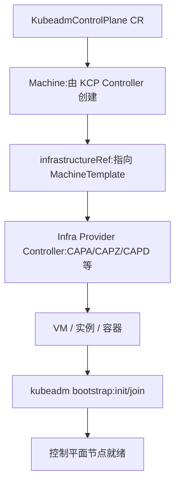

# KubeadmControlPlane的infrastructureRef的设计原理，如何触发控制面节点的创建
在 **Cluster API** 中，`KubeadmControlPlane` 的 `infrastructureRef` 是一个关键设计点，它决定了控制平面节点的底层基础设施资源如何被创建和管理。  
## 🔑 设计原理
- **抽象层次**：  
  - `KubeadmControlPlane` 专注于控制平面节点的 *Kubernetes 层面*（kubeadm 配置、证书、版本升级）。  
  - `infrastructureRef` 指向一个 **基础设施提供者资源**（例如 AWSMachineTemplate、AzureMachineTemplate、DockerMachineTemplate）。  
  - 这样就把 **集群逻辑** 和 **底层资源实现** 解耦。  
- **控制器协作**：  
  - KubeadmControlPlane Controller 负责生成控制平面节点的 `Machine` 对象。  
  - 每个 `Machine` 的 `spec.infrastructureRef` 会引用到 `KubeadmControlPlane.spec.infrastructureRef`。  
  - 基础设施提供者的 Controller（如 CAPA、CAPZ、CAPD）会根据这个引用去创建实际的 VM、实例或容器。  
## ⚙️ 控制面节点创建流程
1. **定义 KubeadmControlPlane**  
   ```yaml
   apiVersion: controlplane.cluster.x-k8s.io/v1beta1
   kind: KubeadmControlPlane
   spec:
     version: v1.29.3
     replicas: 3
     infrastructureRef:
       apiVersion: infrastructure.cluster.x-k8s.io/v1beta1
       kind: AWSMachineTemplate
       name: control-plane-template
   ```
   - 这里的 `infrastructureRef` 指向一个 AWSMachineTemplate。
2. **控制器触发**  
   - KubeadmControlPlane Controller 看到 `replicas: 3`，会创建 3 个 `Machine` 对象。  
   - 每个 `Machine.spec.infrastructureRef` 都引用 `AWSMachineTemplate/control-plane-template`。  
3. **基础设施提供者执行**  
   - AWS Provider Controller（CAPA）接管这些 `Machine`，根据 `infrastructureRef` 创建 EC2 实例。  
   - 实例启动后，kubeadm bootstrap provider 会在 VM 内执行 kubeadm init/join，完成控制平面节点配置。  
## ⚖️ 总结
- `KubeadmControlPlane` 的 `infrastructureRef` 是一个 **模板引用**，告诉控制器如何创建底层资源。  
- 控制面节点的创建流程是：  
  - KubeadmControlPlane Controller → 创建 Machine → Machine 引用 infrastructureRef → Infra Provider Controller → 创建 VM/容器 → kubeadm bootstrap → 节点加入控制平面。  

✅ **一句话结论**：  
`infrastructureRef` 是 KubeadmControlPlane 的桥梁，它把控制平面节点的声明式定义交给底层基础设施 Provider，从而触发实际的 VM/容器创建，再由 kubeadm 完成控制平面初始化。  
## 流程图
直观展示 `KubeadmControlPlane → Machine → infrastructureRef → Infra Provider → VM → kubeadm bootstrap` 的触发链路：  

### 图解说明
- **KubeadmControlPlane CR**：声明控制平面副本数、版本、模板引用。  
- **Machine**：由 KCP Controller 创建，每个 Machine 都带有 `infrastructureRef`。  
- **infrastructureRef**：指向具体的 MachineTemplate（如 AWSMachineTemplate、AzureMachineTemplate）。  
- **Infra Provider Controller**：根据模板创建实际的 VM 或容器。  
- **VM / 实例 / 容器**：底层资源启动。  
- **kubeadm bootstrap**：在资源内执行 kubeadm init/join，完成控制平面配置。  
- **控制平面节点就绪**：最终节点加入集群，形成高可用控制平面。  

这样你就能一眼看到：**KubeadmControlPlane 负责声明，Machine 负责桥接，infrastructureRef 负责落地，Infra Provider 负责执行，kubeadm 完成初始化**。  
