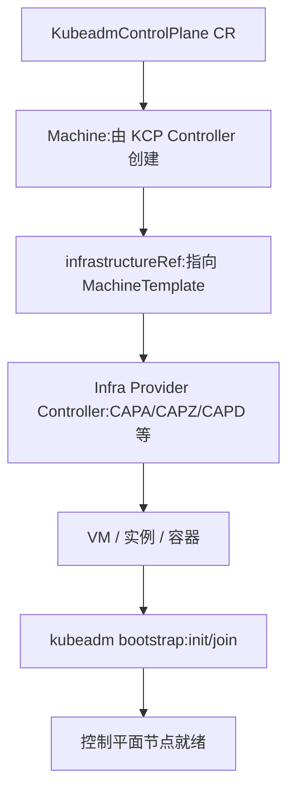

# KubeadmControlPlane中的machineTemplate为什么不直接引用Infra中的XXXMachineTemplate？
这是一个很好的问题，涉及到 **Cluster API 的抽象设计原则**。为什么 `KubeadmControlPlane` 中的 `machineTemplate` 不直接引用 `Cluster.spec.infrastructureRef`，而是必须引用某个具体的 `XXXMachineTemplate`（如 `AWSMachineTemplate`、`AzureMachineTemplate`）呢？  
## 🔑 设计原理
1. **职责分离**  
   - `Cluster.spec.infrastructureRef` → 描述的是整个集群的基础设施环境（如 VPC、网络、负载均衡、集群级别的 Infra 资源）。  
   - `KubeadmControlPlane.machineTemplate` → 描述的是单个控制平面节点的计算资源模板（如 VM 规格、镜像、磁盘）。  
   - 两者层级不同：一个是集群级别，一个是节点级别。  
2. **可复用性与解耦**  
   - `Cluster.infrastructureRef` 通常指向 `AWSCluster`、`AzureCluster` 等，负责集群网络、子网、安全组等全局配置。  
   - `MachineTemplate`（如 `AWSMachineTemplate`）则是节点级别的模板，可以被多个 `Machine` 实例复用。  
   - 这样设计可以让控制平面和工作节点共享同一个集群环境，但使用不同的节点模板。  
3. **声明式扩展**  
   - 控制平面节点和工作节点往往需要不同的规格（例如控制平面用 `t3.medium`，工作节点用 `m5.large`）。  
   - 如果直接引用 `Cluster.infrastructureRef`，就无法区分不同节点池的资源规格。  
   - 使用 `MachineTemplate` 可以灵活定义不同的节点池。  
4. **控制器协作**  
   - `KubeadmControlPlane Controller` 只关心控制平面节点的副本数和 kubeadm 配置。  
   - 它通过 `machineTemplate` 生成 `Machine`，再由 `Machine Controller` 和 `Infra Provider Controller` 去落地为 VM。  
   - 如果直接引用 `Cluster.infrastructureRef`，控制器无法知道如何生成单个节点的资源。  
## 📑 样例对比
### Cluster.infrastructureRef（集群级别）
```yaml
apiVersion: cluster.x-k8s.io/v1beta1
kind: Cluster
metadata:
  name: my-cluster
spec:
  infrastructureRef:
    apiVersion: infrastructure.cluster.x-k8s.io/v1beta1
    kind: AWSCluster
    name: my-cluster-aws
```
### KubeadmControlPlane.machineTemplate（节点级别）
```yaml
apiVersion: controlplane.cluster.x-k8s.io/v1beta1
kind: KubeadmControlPlane
metadata:
  name: my-cluster-control-plane
spec:
  replicas: 3
  version: v1.29.3
  machineTemplate:
    infrastructureRef:
      apiVersion: infrastructure.cluster.x-k8s.io/v1beta1
      kind: AWSMachineTemplate
      name: cp-template
```
## ✅ 总结
- **Cluster.infrastructureRef** → 集群环境（网络、VPC、负载均衡）。  
- **KubeadmControlPlane.machineTemplate.infrastructureRef** → 控制平面节点的 VM 模板。  
- 这种设计保证了 **集群级别与节点级别的解耦**，支持多节点池、多规格的灵活组合。  

换句话说：**Cluster 的 infraRef 定义“集群在哪儿跑”，MachineTemplate 的 infraRef 定义“节点怎么跑”。**  

# Cluster API KubeadmControlPlane Controller 完整业务流程
## 一、Cluster API 核心架构回顾
Cluster API 采用 **Provider 分离** 架构，由四类 Provider 协同工作：
```
┌───────────────────────────────────────────────────────────────────┐
│                        Cluster API Core                           │
│                                                                   │
│  ┌──────────────┐  ┌────────────────────┐  ┌──────────────────┐   │
│  │   Cluster    │  │     Machine        │  │  MachineSet /    │   │
│  │  Controller  │  │    Controller      │  │  MachineDeploy   │   │
│  └──────┬───────┘  └────────┬───────────┘  └────────┬─────────┘   │
│         │                   │                        │            │
└─────────┼───────────────────┼────────────────────────┼────────────┘
          │                   │                        │
          ▼                   ▼                        ▼
┌─────────────────┐  ┌──────────────────┐  ┌──────────────────────┐
│ Infrastructure  │  │    Bootstrap     │  │   Control Plane      │
│   Provider      │  │    Provider      │  │   Provider (KCP)     │
│                 │  │                  │  │                      │
│ • XXXCluster    │  │ • KubeadmConfig  │  │ • KubeadmControlPlane│
│ • XXXMachine    │  │ • KubeadmConfig  │  │ • KubeadmConfig      │
│ • XXXMachine    │  │   Template       │  │   Template           │
│   Template      │  │                  │  │                      │
└─────────────────┘  └──────────────────┘  └──────────────────────┘
```
## 二、资源创建入口：用户提交的资源清单
用户创建集群时，需要提交以下核心资源（以典型 IPI 模式为例）：
```yaml
# 1. Cluster - 集群顶层抽象
apiVersion: cluster.x-k8s.io/v1beta1
kind: Cluster
metadata:
  name: my-cluster
  namespace: default
spec:
  clusterNetwork:
    pods:
      cidrBlocks: ["192.168.0.0/16"]
    serviceDomain: "cluster.local"
    services:
      cidrBlocks: ["10.128.0.0/12"]
  controlPlaneRef:
    apiVersion: controlplane.cluster.x-k8s.io/v1beta1
    kind: KubeadmControlPlane
    name: my-cluster-control-plane
  infrastructureRef:
    apiVersion: infrastructure.cluster.x-k8s.io/v1beta1
    kind: DockerCluster
    name: my-cluster

---
# 2. InfrastructureCluster - 基础设施提供者
apiVersion: infrastructure.cluster.x-k8s.io/v1beta1
kind: DockerCluster
metadata:
  name: my-cluster
spec:
  controlPlaneEndpoint:
    host: ""
    port: 6443

---
# 3. KubeadmControlPlane - 控制平面管理器
apiVersion: controlplane.cluster.x-k8s.io/v1beta1
kind: KubeadmControlPlane
metadata:
  name: my-cluster-control-plane
spec:
  version: "v1.29.0"
  replicas: 3
  machineTemplate:
    infrastructureRef:
      apiVersion: infrastructure.cluster.x-k8s.io/v1beta1
      kind: DockerMachineTemplate
      name: my-cluster-control-plane
  kubeadmConfigSpec:
    clusterConfiguration:
      apiServer:
        extraArgs:
          authorization-mode: "Node,RBAC"
      controllerManager:
        extraArgs:
          bind-address: "0.0.0.0"
      etcd:
        local:
          dataDir: "/var/lib/etcd"
    initConfiguration:
      nodeRegistration:
        kubeletExtraArgs:
          eviction-hard: "nodefs.available<0%,nodefs.inodesFree<0%,imagefs.available<0%"
    joinConfiguration:
      nodeRegistration:
        kubeletExtraArgs:
          eviction-hard: "nodefs.available<0%,nodefs.inodesFree<0%,imagefs.available<0%"

---
# 4. InfrastructureMachineTemplate - 控制平面节点的基础设施模板
apiVersion: infrastructure.cluster.x-k8s.io/v1beta1
kind: DockerMachineTemplate
metadata:
  name: my-cluster-control-plane
spec:
  template:
    spec:
      customImage: "kindest/node:v1.29.0"
```
## 三、完整调谐流程（时序图）
```
User                Cluster Controller    KCP Controller       Bootstrap Controller    Infra Controller
  │                       │                     │                       │                     │
  │ Create Cluster ──────>│                     │                       │                     │
  │ Create DockerCluster─>│                     │                       │                     │
  │ Create KCP ──────────>│                     │                       │                     │
  │ Create DockerMachine ─│─────────────────────│───────────────────────│────────────────────>│
  │ Template              │                     │                       │                     │
  │                       │                     │                       │                     │
  │                       │◄── Reconcile ───────│                       │                     │
  │                       │                     │                       │                     │
  │     ① Cluster Controller 处理 Cluster       │                       │                     │
  │                       │                     │                       │                     │
  │                       │── Reconcile ───────>│                       │                     │
  │                       │                     │                       │                     │
  │     ② Infra Provider 处理 XXXCluster        │                       │                     │
  │                       │                     │                       │                     │
  │                       │◄── Reconcile ───────│                       │                     │
  │                       │                     │                       │                     │
  │     ③ KCP Controller 创建 Machine           │                       │                     │
  │                       │                     │                       │                     │
  │                       │                     │── Create Machine ────>│                     │
  │                       │                     │  (含 BootstrapRef     │                     │
  │                       │                     │   和 InfraRef)        │                     │
  │                       │                     │                       │                     │
  │                       │                     │                       │◄── Reconcile ───────│
  │                       │                     │                       │                     │
  │     ④ Bootstrap Provider 生成 cloud-init    │                       │                     │
  │                       │                     │                       │                     │
  │                       │                     │                       │── Reconcile ──────>│
  │                       │                     │                       │                     │
  │     ⑤ Infra Provider 创建基础设施           │                       │                     │
  │                       │                     │                       │                     │
  │                       │                     │◄──────────────────────│                     │
  │                       │                     │                       │                     │
  │     ⑥ Machine Controller 协调生命周期       │                       │                     │
  │                       │                     │                       │                     │
```
## 四、各 Controller 的详细调谐逻辑
### 4.1 Cluster Controller
**职责**：作为集群的顶层编排者，协调 Cluster、InfrastructureCluster 和 ControlPlane 三者关系。

**调谐流程**：
```
Cluster Reconcile
│
├── 1. 获取 Cluster 对象
│
├── 2. 处理 OwnerReference（Cluster 是 InfrastructureCluster 的 Owner）
│   ├── 如果 Cluster.Spec.InfrastructureRef 存在
│   │   ├── 获取 XXXCluster 对象
│   │   ├── 确保 Cluster 是 XXXCluster 的 Owner
│   │   └── 检查 XXXCluster.Status.Ready
│   │
│   └── 如果 XXXCluster.Status.Ready == false
│       └── 等待 Infrastructure Provider 就绪
│
├── 3. 处理 ControlPlaneRef
│   ├── 如果 Cluster.Spec.ControlPlaneRef 存在
│   │   ├── 获取 KubeadmControlPlane 对象
│   │   ├── 确保 Cluster 是 KCP 的 Owner
│   │   └── 检查 KCP.Status.Ready
│   │
│   └── 如果 KCP.Status.Initialized == false
│       └── 等待 ControlPlane 初始化
│
├── 4. 汇总状态
│   ├── 设置 Condition: InfrastructureReady
│   ├── 设置 Condition: ControlPlaneReady
│   ├── 设置 Condition: ControlPlaneInitialized
│   └── 更新 Cluster.Status
│
└── 5. 返回 Requeue 或完成
```
### 4.2 KubeadmControlPlane Controller（核心）
**职责**：管理控制平面节点的全生命周期，包括创建、升级、扩缩容。

**调谐流程**：
```
KubeadmControlPlane Reconcile
│
├── 1. 获取 KCP、Cluster、XXXCluster 对象
│   ├── 获取 KCP
│   ├── 通过 OwnerReference 获取 Cluster
│   ├── 通过 Cluster.Spec.InfrastructureRef 获取 XXXCluster
│   └── 检查 Cluster.Spec.InfrastructureRef 是否就绪
│
├── 2. 初始化检查
│   ├── 如果 Cluster.Status.InfrastructureReady == false
│   │   └── 返回等待（基础设施未就绪）
│   │
│   └── 如果是首次调谐
│       └── 初始化 KCP.Status
│
├── 3. 证书管理
│   ├── 获取或创建证书 Secret
│   │   ├── Secret: <cluster-name>-kubeadm-config
│   │   └── 包含: CA cert/key, SA cert/key, etcd CA cert/key, front-proxy CA cert/key
│   │
│   └── 检查证书是否需要轮换
│
├── 4. 控制平面初始化（首次创建）
│   ├── 检查是否已有初始化节点
│   │   ├── Cluster.Status.ControlPlaneInitialized == false
│   │   └── 且不存在 Ready 的 Control Plane Machine
│   │
│   ├── 创建第一个控制平面 Machine
│   │   ├── 生成 KubeadmConfig（initConfiguration）
│   │   ├── 生成 InfrastructureMachine（从 Template 克隆）
│   │   └── 创建 Machine 对象
│   │       ├── Machine.Spec.BootstrapRef → KubeadmConfig
│   │       └── Machine.Spec.InfrastructureRef → InfrastructureMachine
│   │
│   └── 等待第一个节点初始化完成
│       └── 监听 Cluster.Status.ControlPlaneInitialized
│
├── 5. 控制平面扩容（加入后续节点）
│   ├── 计算期望副本数 vs 当前副本数
│   │   ├── 期望: KCP.Spec.Replicas
│   │   └── 当前: len(ControlPlane Machines)
│   │
│   ├── 如果需要扩容
│   │   ├── 创建新的 Machine
│   │   │   ├── 生成 KubeadmConfig（joinConfiguration + controlPlane: {}）
│   │   │   ├── 从 InfrastructureMachineTemplate 克隆 InfrastructureMachine
│   │   │   └── 创建 Machine
│   │   │
│   │   └── 逐个创建（串行，确保稳定性）
│   │
│   └── 如果需要缩容
│       └── 选择 Machine 删除（按优先级）
│
├── 6. 控制平面升级
│   ├── 检测版本变化
│   │   ├── KCP.Spec.Version 变更
│   │   └── 或 KCP.Spec.KubeadmConfigSpec 变更
│   │
│   ├── 生成升级策略
│   │   ├── 逐个节点滚动升级
│   │   └── 顺序: 先升级的节点先完成
│   │
│   ├── 执行滚动升级
│   │   ├── 选择一个旧版本 Machine
│   │   ├── 创建新 Machine（新版本）
│   │   ├── 等待新 Machine Ready
│   │   ├── 删除旧 Machine
│   │   └── 重复直到所有节点升级完成
│   │
│   └── 更新 KCP.Status
│
├── 7. Machine 健康检查
│   ├── 检查所有 Control Plane Machine 的健康状态
│   ├── 如果 Machine 不健康
│   │   ├── 根据 RemediationStrategy 决定是否修复
│   │   └── 创建新 Machine 替换不健康 Machine
│   │
│   └── 更新 KCP.Status
│
└── 8. 状态汇总
    ├── KCP.Status.Ready
    ├── KCP.Status.Initialized
    ├── KCP.Status.Replicas
    ├── KCP.Status.UpdatedReplicas
    ├── KCP.Status.UnavailableReplicas
    └── KCP.Status.Version
```
### 4.3 KCP 创建 Machine 的详细过程
这是 KCP Controller 的核心逻辑，详细展开：
```
KCP.createMachine()
│
├── 1. 生成 InfrastructureMachine
│   ├── 从 KCP.Spec.MachineTemplate.InfrastructureRef 获取 Template
│   │   例: DockerMachineTemplate "my-cluster-control-plane"
│   │
│   ├── 基于 Template 生成 InfrastructureMachine 名称
│   │   命名规则: <cluster-name>-<hash>
│   │
│   ├── 设置 OwnerReference
│   │   ├── Owner: Machine（循环引用，Machine 创建后设置）
│   │   └── 实际: 先创建 InfraMachine，再创建 Machine 时引用
│   │
│   └── 调用 API 创建 InfrastructureMachine
│       例: DockerMachine "my-cluster-control-plane-abc12"
│
├── 2. 生成 KubeadmConfig
│   ├── 判断是 Init 还是 Join
│   │   ├── Init（第一个节点）:
│   │   │   ├── 使用 KCP.Spec.KubeadmConfigSpec.InitConfiguration
│   │   │   ├── 注入 CA 证书（从 Secret 获取）
│   │   │   ├── 注入 etcd 配置
│   │   │   └── 设置 nodeRegistration
│   │   │
│   │   └── Join（后续节点）:
│   │       ├── 使用 KCP.Spec.KubeadmConfigSpec.JoinConfiguration
│   │       ├── 设置 controlPlane: {}
│   │       ├── 注入 discovery（CA cert hash 或 bootstrap token）
│   │       └── 设置 nodeRegistration
│   │
│   ├── 合并 ClusterConfiguration
│   │   ├── apiServer certSANs（包含 ControlPlaneEndpoint）
│   │   ├── etcd 配置
│   │   ├── networking 配置
│   │   └── controllerManager / scheduler 配置
│   │
│   ├── 设置 OwnerReference
│   │   └── Owner: Machine
│   │
│   └── 调用 API 创建 KubeadmConfig
│       例: KubeadmConfig "my-cluster-control-plane-abc12"
│
├── 3. 创建 Machine
│   ├── 设置 Machine.Spec
│   │   ├── Machine.Spec.ClusterName = Cluster.Name
│   │   ├── Machine.Spec.Version = KCP.Spec.Version
│   │   ├── Machine.Spec.BootstrapRef
│   │   │   └── Kind: KubeadmConfig
│   │   │       Name: my-cluster-control-plane-abc12
│   │   ├── Machine.Spec.InfrastructureRef
│   │   │   └── Kind: DockerMachine
│   │   │       Name: my-cluster-control-plane-abc12
│   │   └── Machine.Labels
│   │       ├── cluster.x-k8s.io/cluster-name: my-cluster
│   │       ├── cluster.x-k8s.io/control-plane: ""
│   │       └── machine.cluster.x-k8s.io/control-plane-name: my-cluster-control-plane
│   │
│   ├── 设置 OwnerReference
│   │   └── Owner: KubeadmControlPlane
│   │
│   └── 调用 API 创建 Machine
│       例: Machine "my-cluster-control-plane-abc12"
│
└── 4. 更新 KCP.Status
    └── 记录创建的 Machine
```
### 4.4 Bootstrap Controller（KubeadmConfig Controller）
**职责**：将 KubeadmConfig 转换为节点引导数据（cloud-init / ignition）。
```
KubeadmConfig Reconcile
│
├── 1. 获取 KubeadmConfig 和关联的 Machine
│
├── 2. 检查前置条件
│   ├── Machine.Spec.InfrastructureRef 是否存在
│   ├── InfrastructureMachine 是否已创建
│   └── InfrastructureMachine.Spec.ProviderID 是否已设置
│
├── 3. 生成引导数据
│   ├── 根据 InitConfiguration 或 JoinConfiguration 生成
│   │
│   ├── Init 节点:
│   │   └── 生成 kubeadm init 的 cloud-init 配置
│   │       ├── 写入 kubeadm-config.yaml
│   │       ├── 执行 kubeadm init --config /tmp/kubeadm-config.yaml
│   │       ├── 启动 kubelet
│   │       └── 上传配置到 kube-system/kubeadm-config
│   │
│   ├── Join 节点:
│   │   └── 生成 kubeadm join 的 cloud-init 配置
│   │       ├── 写入 kubeadm-config.yaml
│   │       ├── 执行 kubeadm join --config /tmp/kubeadm-config.yaml
│   │       └── 启动 kubelet
│   │
│   └── 生成 cloud-init 格式
│       ├── #cloud-config
│       ├── write_files:
│       │   - path: /tmp/kubeadm-config.yaml
│       │     content: <kubeadm config>
│       ├── runcmd:
│       │   - kubeadm init/join
│       └── users/groups 等
│
├── 4. 存储引导数据
│   ├── 创建 Secret: <machine-name>-bootstrap-data
│   │   ├── data:
│   │   │   └── value: <base64-encoded cloud-init>
│   │   └── type: cluster.x-k8s.io/secret
│   │
│   └── 更新 KubeadmConfig.Status
│       ├── Status.Ready = true
│       └── Status.DataSecretName = "<machine-name>-bootstrap-data"
│
└── 5. 返回
```
### 4.5 Infrastructure Provider Controller（以 DockerMachine 为例）
**职责**：创建/管理实际的基础设施资源。
```
DockerMachine Reconcile
│
├── 1. 获取 DockerMachine 和关联的 Machine
│
├── 2. 检查前置条件
│   ├── Machine.Spec.BootstrapRef 是否存在
│   ├── KubeadmConfig.Status.Ready == true
│   └── Bootstrap Secret 是否存在
│
├── 3. 创建基础设施
│   ├── DockerMachine: 创建 Docker 容器
│   │   ├── 拉取镜像: kindest/node:v1.29.0
│   │   ├── 创建容器
│   │   ├── 注入 cloud-init 数据
│   │   └── 启动容器
│   │
│   ├── AWSMachine: 创建 EC2 实例
│   │   ├── 创建 IAM Role/Profile
│   │   ├── 创建 EC2 实例
│   │   ├── 注入 user-data (cloud-init)
│   │   └── 等待实例 Running
│   │
│   └── 其他 Provider 类似
│
├── 4. 设置 ProviderID
│   ├── DockerMachine: docker://<container-id>
│   ├── AWSMachine: aws:///<region>/<instance-id>
│   └── 更新 DockerMachine.Spec.ProviderID
│
├── 5. 等待节点就绪
│   ├── 检查容器/实例状态
│   └── 更新 DockerMachine.Status.Ready = true
│
└── 6. 返回
```
### 4.6 Machine Controller
**职责**：协调 Machine 的整体生命周期，是 Bootstrap 和 Infrastructure 的上层编排者。
```
Machine Reconcile
│
├── 1. 获取 Machine、Cluster、Bootstrap、Infrastructure 对象
│
├── 2. 前置检查
│   ├── Cluster 是否存在
│   ├── Cluster.Status.InfrastructureReady == true
│   └── ControlPlane 是否已初始化（对 Worker 节点）
│
├── 3. 协调 Infrastructure
│   ├── 获取 InfrastructureMachine
│   ├── 检查 InfrastructureMachine.Status.Ready
│   ├── 如果未就绪
│   │   └── 等待
│   └── 如果就绪
│       └── 获取 ProviderID
│
├── 4. 协调 Bootstrap
│   ├── 获取 KubeadmConfig
│   ├── 检查 KubeadmConfig.Status.Ready
│   ├── 如果未就绪
│   │   └── 等待
│   └── 如果就绪
│       └── 获取 DataSecretName
│
├── 5. 关联节点
│   ├── 通过 ProviderID 在目标集群中查找 Node
│   ├── 如果 Node 存在
│   │   ├── 设置 Machine.Status.NodeRef
│   │   └── 检查 Node.Ready
│   └── 如果 Node 不存在
│       └── 等待
│
├── 6. 更新 Machine 状态
│   ├── Machine.Status.Phase
│   ├── Machine.Status.Conditions
│   └── Machine.Status.NodeRef
│
└── 7. 返回
```
## 五、资源关系图
```
Cluster
  │
  ├── Spec.InfrastructureRef ────► XXXCluster (e.g., DockerCluster)
  │                                  │
  │                                  └── Status.Ready
  │
  └── Spec.ControlPlaneRef ────► KubeadmControlPlane
                                   │
                                   ├── Spec.MachineTemplate.InfrastructureRef
                                   │       │
                                   │       └──► XXXMachineTemplate (e.g., DockerMachineTemplate)
                                   │               │
                                   │               └── Spec.Template.Spec (基础设施规格)
                                   │
                                   ├── Spec.KubeadmConfigSpec
                                   │       │
                                   │       ├── InitConfiguration
                                   │       ├── JoinConfiguration
                                   │       └── ClusterConfiguration
                                   │
                                   └── 创建的 Machine 列表
                                       │
                                       ├── Machine #1 (Control Plane)
                                       │   │
                                       │   ├── Spec.BootstrapRef ──► KubeadmConfig #1
                                       │   │                            │
                                       │   │                            └── Status.DataSecretName
                                       │   │                                  │
                                       │   │                                  └──► Secret (cloud-init)
                                       │   │
                                       │   ├── Spec.InfrastructureRef ──► XXXMachine #1
                                       │   │                                  │
                                       │   │                                  ├── Spec.ProviderID
                                       │   │                                  └── Status.Ready
                                       │   │
                                       │   └── Status.NodeRef ──► Node #1
                                       │
                                       ├── Machine #2 (Control Plane)
                                       │   ├── Spec.BootstrapRef ──► KubeadmConfig #2
                                       │   └── Spec.InfrastructureRef ──► XXXMachine #2
                                       │
                                       └── Machine #3 (Control Plane)
                                           ├── Spec.BootstrapRef ──► KubeadmConfig #3
                                           └── Spec.InfrastructureRef ──► XXXMachine #3
```
## 六、Worker 节点的创建流程
Worker 节点由 **MachineDeployment** 管理，流程类似但独立于 KCP：
```
用户创建:
  MachineDeployment
    ├── Spec.Template.Spec.InfrastructureRef → XXXMachineTemplate (Worker)
    ├── Spec.Template.Spec.BootstrapRef → KubeadmConfigTemplate (Worker)
    └── Spec.Replicas: 3

MachineDeployment Controller:
  │
  ├── 创建 MachineSet
  │   └── MachineSet 创建 N 个 Machine
  │       │
  │       ├── Machine #1 (Worker)
  │       │   ├── BootstrapRef → KubeadmConfig (joinConfiguration, 无 controlPlane)
  │       │   └── InfrastructureRef → XXXMachine
  │       │
  │       ├── Machine #2 (Worker)
  │       └── Machine #3 (Worker)
  │
  └── 后续流程与 Control Plane Machine 相同
```
## 七、升级流程（KCP 滚动升级）
当用户修改 `KubeadmControlPlane.Spec.Version` 时：
```
KCP Upgrade Reconcile
│
├── 1. 检测版本变化
│   ├── KCP.Spec.Version: v1.28.0 → v1.29.0
│   └── 标记需要升级的 Machine
│
├── 2. 生成升级计划
│   ├── 计算需要升级的 Machine 数量
│   ├── 确定升级顺序
│   └── 确定并发策略（默认逐个）
│
├── 3. 逐个滚动升级
│   │
│   ├── 3.1 选择一个旧版本 Machine
│   │   └── 标记为删除候选
│   │
│   ├── 3.2 创建新版本 Machine
│   │   ├── 新 KubeadmConfig (joinConfiguration, version=v1.29.0)
│   │   ├── 新 XXXMachine (从 Template 克隆)
│   │   └── 新 Machine (version=v1.29.0)
│   │
│   ├── 3.3 等待新 Machine Ready
│   │   ├── InfrastructureMachine.Status.Ready == true
│   │   ├── Node Ready
│   │   └── etcd member healthy
│   │
│   ├── 3.4 删除旧 Machine
│   │   ├── 从 etcd 移除 member
│   │   ├── 删除 Machine
│   │   │   ├── 触发 XXXMachine 删除（Infrastructure Provider 清理）
│   │   │   └── 触发 KubeadmConfig 删除
│   │   └── 等待 Machine 完全删除
│   │
│   └── 3.5 重复 3.1-3.4 直到所有节点升级完成
│
└── 4. 更新 KCP.Status
    ├── Status.Version = v1.29.0
    ├── Status.UpdatedReplicas = 3
    └── Status.Ready = true
```
## 八、关键设计模式总结
| 设计模式 | 体现位置 | 说明 |
|----------|----------|------|
| **Provider 接口分离** | Cluster API Core | Infrastructure / Bootstrap / ControlPlane 三类 Provider 独立实现 |
| **Template 克隆** | Machine 创建 | 从 XXXMachineTemplate 克隆出 XXXMachine 实例 |
| **声明式状态驱动** | 所有 Controller | 用户声明期望状态，Controller 持续调谐至一致 |
| **OwnerReference 链** | 资源关系 | Cluster → KCP → Machine → KubeadmConfig / XXXMachine |
| **Condition 机制** | 状态汇报 | 通过 Condition 类型化状态（InfrastructureReady、ControlPlaneInitialized 等） |
| **滚动升级** | KCP 升级 | 逐个替换 Machine，确保始终有足够健康节点 |
| **Bootstrap 数据注入** | 节点初始化 | KubeadmConfig → Secret (cloud-init) → Infrastructure Provider 注入 |
## 九、Controller 间的协作时序（完整）
```
时间轴 ─────────────────────────────────────────────────────────────────►

T1: 用户创建 Cluster + DockerCluster + KCP + DockerMachineTemplate

T2: Cluster Controller Reconcile
    ├── 发现 InfrastructureRef → DockerCluster
    ├── 设置 DockerCluster.OwnerReference → Cluster
    └── Condition: InfrastructureReady = False (等待)

T3: DockerCluster Controller Reconcile
    ├── 创建 Docker 网络/负载均衡
    ├── 设置 ControlPlaneEndpoint
    └── Status.Ready = True

T4: Cluster Controller 再次 Reconcile
    ├── 发现 DockerCluster.Status.Ready = True
    ├── Condition: InfrastructureReady = True
    └── 发现 ControlPlaneRef → KCP

T5: KCP Controller Reconcile
    ├── 发现 Cluster.InfrastructureReady = True
    ├── 发现 ControlPlane 未初始化
    ├── 生成证书 Secret
    ├── 创建 KubeadmConfig (initConfiguration)
    ├── 创建 DockerMachine (从 Template 克隆)
    ├── 创建 Machine #1
    │   ├── BootstrapRef → KubeadmConfig #1
    │   └── InfrastructureRef → DockerMachine #1
    └── 等待

T6: KubeadmConfig Controller Reconcile
    ├── 生成 cloud-init (kubeadm init)
    ├── 创建 Secret: machine-1-bootstrap-data
    └── Status.Ready = True, DataSecretName = "machine-1-bootstrap-data"

T7: DockerMachine Controller Reconcile
    ├── 发现 Bootstrap Secret 存在
    ├── 创建 Docker 容器
    ├── 注入 cloud-init (user-data)
    ├── 容器启动，执行 kubeadm init
    ├── 设置 ProviderID
    └── Status.Ready = True

T8: Machine Controller Reconcile
    ├── 发现 InfrastructureMachine.Ready = True
    ├── 发现 Bootstrap.Ready = True
    ├── 通过 ProviderID 查找 Node
    ├── 发现 Node Ready
    ├── 设置 Machine.Status.NodeRef
    └── Machine.Status.Phase = Running

T9: KCP Controller 再次 Reconcile
    ├── 发现 Machine #1 Ready
    ├── 发现 Cluster.ControlPlaneInitialized = True
    ├── 需要扩容到 3 副本
    ├── 创建 Machine #2 (joinConfiguration, controlPlane)
    │   └── ... 同 T5-T8 流程
    └── 创建 Machine #3 (joinConfiguration, controlPlane)
        └── ... 同 T5-T8 流程

T10: 所有 Control Plane Machine Ready
     └── KCP.Status.Ready = True, Replicas = 3
```
这就是 Cluster API 中 KubeadmControlPlane Controller 从资源创建到驱动 XXXMachineTemplate 及 Infrastructure Provider Controller 的完整业务流程。核心要点是：**KCP 不直接操作基础设施，而是通过创建 Machine → 引用 Bootstrap 和 Infrastructure 资源 → 由各自的 Provider Controller 异步执行**，实现了关注点分离和解耦。

  
# Cluster API KubeadmControlPlane 创建流程真实样例
## 场景设定
在管理集群上创建一个 3 节点控制平面 + 2 节点工作节点的 Kubernetes 集群，Infrastructure Provider 使用 Docker（最易理解）。
## 第零步：用户提交的资源清单
用户一次性提交 6 个资源：
```yaml
# ──────────────────────────────────────────
# 资源 1: Cluster - 集群顶层入口
# ──────────────────────────────────────────
apiVersion: cluster.x-k8s.io/v1beta1
kind: Cluster
metadata:
  name: prod-cluster
  namespace: default
spec:
  clusterNetwork:
    pods:
      cidrBlocks: ["10.244.0.0/16"]
    services:
      cidrBlocks: ["10.96.0.0/12"]
    serviceDomain: "cluster.local"
  controlPlaneRef:
    apiVersion: controlplane.cluster.x-k8s.io/v1beta1
    kind: KubeadmControlPlane
    name: prod-cluster-cp
  infrastructureRef:
    apiVersion: infrastructure.cluster.x-k8s.io/v1beta1
    kind: DockerCluster
    name: prod-cluster
```

```yaml
# ──────────────────────────────────────────
# 资源 2: DockerCluster - 基础设施集群
# ──────────────────────────────────────────
apiVersion: infrastructure.cluster.x-k8s.io/v1beta1
kind: DockerCluster
metadata:
  name: prod-cluster
  namespace: default
spec:
  controlPlaneEndpoint:
    host: ""
    port: 6443
```

```yaml
# ──────────────────────────────────────────
# 资源 3: KubeadmControlPlane - 控制平面
# ──────────────────────────────────────────
apiVersion: controlplane.cluster.x-k8s.io/v1beta1
kind: KubeadmControlPlane
metadata:
  name: prod-cluster-cp
  namespace: default
spec:
  version: v1.29.0
  replicas: 3
  machineTemplate:
    infrastructureRef:
      apiVersion: infrastructure.cluster.x-k8s.io/v1beta1
      kind: DockerMachineTemplate
      name: prod-cluster-cp-template
  kubeadmConfigSpec:
    clusterConfiguration:
      apiServer:
        extraArgs:
          authorization-mode: Node,RBAC
      controllerManager:
        extraArgs:
          bind-address: 0.0.0.0
      etcd:
        local:
          dataDir: /var/lib/etcd
    initConfiguration:
      nodeRegistration:
        kubeletExtraArgs:
          eviction-hard: nodefs.available<0%
    joinConfiguration:
      nodeRegistration:
        kubeletExtraArgs:
          eviction-hard: nodefs.available<0%
```

```yaml
# ──────────────────────────────────────────
# 资源 4: DockerMachineTemplate - 控制平面机器模板
# ──────────────────────────────────────────
apiVersion: infrastructure.cluster.x-k8s.io/v1beta1
kind: DockerMachineTemplate
metadata:
  name: prod-cluster-cp-template
  namespace: default
spec:
  template:
    spec:
      customImage: kindest/node:v1.29.0
```

```yaml
# ──────────────────────────────────────────
# 资源 5: MachineDeployment - 工作节点部署
# ──────────────────────────────────────────
apiVersion: cluster.x-k8s.io/v1beta1
kind: MachineDeployment
metadata:
  name: prod-cluster-md-0
  namespace: default
spec:
  clusterName: prod-cluster
  replicas: 2
  selector:
    matchLabels:
      cluster.x-k8s.io/cluster-name: prod-cluster
  template:
    spec:
      clusterName: prod-cluster
      version: v1.29.0
      bootstrap:
        configRef:
          apiVersion: bootstrap.cluster.x-k8s.io/v1beta1
          kind: KubeadmConfigTemplate
          name: prod-cluster-md-0-bootstrap
      infrastructureRef:
        apiVersion: infrastructure.cluster.x-k8s.io/v1beta1
        kind: DockerMachineTemplate
        name: prod-cluster-md-0-template
```

```yaml
# ──────────────────────────────────────────
# 资源 6: KubeadmConfigTemplate - 工作节点引导模板
# ──────────────────────────────────────────
# 资源 7: DockerMachineTemplate - 工作节点机器模板
# ──────────────────────────────────────────
apiVersion: bootstrap.cluster.x-k8s.io/v1beta1
kind: KubeadmConfigTemplate
metadata:
  name: prod-cluster-md-0-bootstrap
  namespace: default
spec:
  template:
    spec:
      joinConfiguration:
        nodeRegistration:
          kubeletExtraArgs:
            eviction-hard: nodefs.available<0%
---
apiVersion: infrastructure.cluster.x-k8s.io/v1beta1
kind: DockerMachineTemplate
metadata:
  name: prod-cluster-md-0-template
  namespace: default
spec:
  template:
    spec:
      customImage: kindest/node:v1.29.0
```
## 第一步：Cluster Controller 处理 Cluster
**触发**：Cluster 资源被创建，Cluster Controller Watch 到事件。

**处理逻辑**：
```
Cluster Controller 发现:
  ├── Cluster.Spec.InfrastructureRef = DockerCluster/prod-cluster
  ├── Cluster.Spec.ControlPlaneRef = KubeadmControlPlane/prod-cluster-cp
  │
  ├── 获取 DockerCluster → Status.Ready = false (刚创建，还没处理)
  ├── 获取 KubeadmControlPlane → Status.Ready = false
  │
  └── 设置 OwnerReference:
      DockerCluster.OwnerReferences = [{Cluster, prod-cluster}]
      KCP.OwnerReferences = [{Cluster, prod-cluster}]
```
**此时集群中的资源状态**：
```
Cluster/prod-cluster
  ├── Status.InfrastructureReady = false
  ├── Status.ControlPlaneReady = false
  └── Status.ControlPlaneInitialized = false

DockerCluster/prod-cluster
  └── Status.Ready = false
  └── Status.ControlPlaneEndpoint.Host = "" (空)

KubeadmControlPlane/prod-cluster-cp
  └── Status.Ready = false
  └── Status.Replicas = 0
```
## 第二步：DockerCluster Controller 处理基础设施
**触发**：DockerCluster 资源被创建/更新。

**处理逻辑**：
```
DockerCluster Controller:
  ├── 创建 Docker 网络: kind-prod-cluster
  ├── 创建 Docker 负载均衡容器: prod-cluster-lb
  │   └── 监听 0.0.0.0:6443 → 后端指向控制平面节点
  ├── 获取 LB 容器 IP: 172.17.0.2
  │
  └── 更新 DockerCluster.Status:
      ├── Ready = true
      └── ControlPlaneEndpoint.Host = "172.17.0.2"
          ControlPlaneEndpoint.Port = 6443
```
**此时资源状态**：
```
DockerCluster/prod-cluster
  ├── Status.Ready = true  ✅
  └── Status.ControlPlaneEndpoint = {Host: "172.17.0.2", Port: 6443}
```
## 第三步：Cluster Controller 更新状态
**触发**：DockerCluster Status 变化触发 Cluster 重新调谐。
```
Cluster Controller:
  ├── 发现 DockerCluster.Status.Ready = true
  ├── 设置 Condition: InfrastructureReady = true  ✅
  │
  └── 发现 ControlPlaneRef → KCP，但 KCP 还没处理
      └── Condition: ControlPlaneInitialized = false (等待)
```
**此时资源状态**：
```
Cluster/prod-cluster
  ├── Status.InfrastructureReady = true  ✅
  ├── Status.ControlPlaneReady = false
  └── Status.ControlPlaneInitialized = false
```
## 第四步：KCP Controller 创建第一个控制平面节点
**触发**：KCP 资源被创建/更新，且 Cluster.InfrastructureReady = true。

**这是整个流程中最核心的步骤。**
```
KCP Controller:
  │
  ├── 4.1 前置检查
  │   ├── Cluster.InfrastructureReady = true  ✅
  │   ├── 当前 Control Plane Machine 数量 = 0
  │   └── 需要初始化第一个节点
  │
  ├── 4.2 生成证书
  │   ├── 创建 Secret: prod-cluster-cp-ca
  │   │   ├── data:
  │   │   │   ├── ca.crt: <base64 CA 证书>
  │   │   │   ├── ca.key: <base64 CA 私钥>
  │   │   │   ├── sa.crt: <base64 SA 证书>
  │   │   │   ├── sa.key: <base64 SA 私钥>
  │   │   │   ├── etcd-ca.crt: <base64 etcd CA 证书>
  │   │   │   ├── etcd-ca.key: <base64 etcd CA 私钥>
  │   │   │   ├── front-proxy-ca.crt: <base64 front-proxy CA 证书>
  │   │   │   └── front-proxy-ca.key: <base64 front-proxy CA 私钥>
  │   │   └── type: cluster.x-k8s.io/secret
  │   │
  │   └── 创建 Secret: prod-cluster-cp-kubeadm-config
  │       └── data:
  │           └── ClusterConfiguration: <base64 编码的 ClusterConfiguration>
  │
  ├── 4.3 创建 InfrastructureMachine（从 Template 克隆）
  │   │
  │   │   读取 DockerMachineTemplate: prod-cluster-cp-template
  │   │   基于模板创建新的 DockerMachine:
  │   │
  │   └──► 创建资源:
       apiVersion: infrastructure.cluster.x-k8s.io/v1beta1
       kind: DockerMachine
       metadata:
         name: prod-cluster-cp-7xk2m        ← 自动生成名称
         namespace: default
         ownerReferences:
         - apiVersion: cluster.x-k8s.io/v1beta1
           kind: Machine
           name: prod-cluster-cp-7xk2m      ← 将在下一步创建
           uid: ""                            ← 尚未创建，后续补全
       spec:
         customImage: kindest/node:v1.29.0   ← 从 Template 克隆
  │
  ├── 4.4 创建 KubeadmConfig（Init 配置）
  │   │
  │   │   因为是第一个节点，使用 initConfiguration:
  │   │
  │   └──► 创建资源:
       apiVersion: bootstrap.cluster.x-k8s.io/v1beta1
       kind: KubeadmConfig
       metadata:
         name: prod-cluster-cp-7xk2m        ← 与 Machine 同名
         namespace: default
         ownerReferences:
         - apiVersion: cluster.x-k8s.io/v1beta1
           kind: Machine
           name: prod-cluster-cp-7xk2m
       spec:
         clusterConfiguration:               ← 从 KCP.Spec 注入
           apiServer:
             extraArgs:
               authorization-mode: Node,RBAC
             certSANs:
             - 172.17.0.2                    ← 注入 ControlPlaneEndpoint
             - prod-cluster-cp-apiserver
             - 10.96.0.1                     ← Service CIDR 第一个 IP
           controllerManager:
             extraArgs:
               bind-address: 0.0.0.0
           etcd:
             local:
               dataDir: /var/lib/etcd
           networking:
             dnsDomain: cluster.local
             podSubnet: 10.244.0.0/16
             serviceSubnet: 10.96.0.0/12
         initConfiguration:                  ← 第一个节点用 init
           nodeRegistration:
             criSocket: /run/containerd/containerd.sock
             kubeletExtraArgs:
               eviction-hard: nodefs.available<0%
  │
  └── 4.5 创建 Machine（连接 Bootstrap 和 Infrastructure）
      │
      └──► 创建资源:
       apiVersion: cluster.x-k8s.io/v1beta1
       kind: Machine
       metadata:
         name: prod-cluster-cp-7xk2m
         namespace: default
         labels:
           cluster.x-k8s.io/cluster-name: prod-cluster
           cluster.x-k8s.io/control-plane: ""
         ownerReferences:
         - apiVersion: controlplane.cluster.x-k8s.io/v1beta1
           kind: KubeadmControlPlane
           name: prod-cluster-cp             ← KCP 是 Machine 的 Owner
       spec:
         clusterName: prod-cluster
         version: v1.29.0
         bootstrap:
           configRef:
             apiVersion: bootstrap.cluster.x-k8s.io/v1beta1
             kind: KubeadmConfig
             name: prod-cluster-cp-7xk2m     ← 引用 KubeadmConfig
         infrastructureRef:
           apiVersion: infrastructure.cluster.x-k8s.io/v1beta1
           kind: DockerMachine
           name: prod-cluster-cp-7xk2m       ← 引用 DockerMachine
```
**此时集群中的资源关系**：
```
KubeadmControlPlane/prod-cluster-cp
  │
  └── Machine/prod-cluster-cp-7xk2m (OwnerRef → KCP)
       ├── BootstrapRef → KubeadmConfig/prod-cluster-cp-7xk2m
       └── InfrastructureRef → DockerMachine/prod-cluster-cp-7xk2m
```
## 第五步：KubeadmConfig Controller 生成引导数据
**触发**：KubeadmConfig 资源被创建。
```
KubeadmConfig Controller:
  │
  ├── 5.1 检查前置条件
  │   ├── 关联的 Machine 存在  ✅
  │   └── InfrastructureMachine 存在  ✅
  │
  ├── 5.2 生成 cloud-init 数据
  │   │
  │   └── 生成内容:
       #cloud-config
       write_files:
       - path: /tmp/kubeadm-config.yaml
         owner: root:root
         permissions: '0640'
         content: |
           apiVersion: kubeadm.k8s.io/v1beta3
           kind: InitConfiguration
           nodeRegistration:
             criSocket: /run/containerd/containerd.sock
             kubeletExtraArgs:
               eviction-hard: nodefs.available<0%
           ---
           apiVersion: kubeadm.k8s.io/v1beta3
           kind: ClusterConfiguration
           apiServer:
             extraArgs:
               authorization-mode: Node,RBAC
             certSANs:
             - 172.17.0.2
             - prod-cluster-cp-apiserver
           etcd:
             local:
               dataDir: /var/lib/etcd
           networking:
             dnsDomain: cluster.local
             podSubnet: 10.244.0.0/16
             serviceSubnet: 10.96.0.0/12
       runcmd:
       - kubeadm init --config /tmp/kubeadm-config.yaml --skip-phases=addon/kube-proxy
       - systemctl enable kubelet
  │
  └── 5.3 创建 Bootstrap Secret
      │
      └──► 创建资源:
       apiVersion: v1
       kind: Secret
       metadata:
         name: prod-cluster-cp-7xk2m-bootstrap-data
         namespace: default
         ownerReferences:
         - apiVersion: bootstrap.cluster.x-k8s.io/v1beta1
           kind: KubeadmConfig
           name: prod-cluster-cp-7xk2m
       type: cluster.x-k8s.io/secret
       data:
         value: <base64 编码的 cloud-init 内容>
  │
  └── 5.4 更新 KubeadmConfig Status
      ├── Status.Ready = true  ✅
      └── Status.DataSecretName = "prod-cluster-cp-7xk2m-bootstrap-data"
```
**此时资源状态**：
```
KubeadmConfig/prod-cluster-cp-7xk2m
  ├── Status.Ready = true  ✅
  └── Status.DataSecretName = "prod-cluster-cp-7xk2m-bootstrap-data"

Secret/prod-cluster-cp-7xk2m-bootstrap-data
  └── data.value = "#cloud-config\nwrite_files:..."
```
## 第六步：DockerMachine Controller 创建基础设施
**触发**：DockerMachine 资源被创建，且 Bootstrap Secret 已就绪。
```
DockerMachine Controller:
  │
  ├── 6.1 检查前置条件
  │   ├── 关联的 Machine 存在  ✅
  │   ├── KubeadmConfig.Status.Ready = true  ✅
  │   └── Bootstrap Secret 存在  ✅
  │
  ├── 6.2 创建 Docker 容器
  │   ├── docker run -d \
  │   │   --name prod-cluster-cp-7xk2m \
  │   │   --network kind-prod-cluster \
  │   │   --hostname prod-cluster-cp-7xk2m \
  │   │   kindest/node:v1.29.0
  │   │
  │   ├── 获取容器 IP: 172.17.0.3
  │   │
  │   └── 注入 cloud-init 数据到容器
  │       ├── 将 Secret 中的 cloud-init 写入容器
  │       └── 容器内部执行:
  │           ├── kubeadm init --config /tmp/kubeadm-config.yaml
  │           │   ├── 生成 CA 证书
  │           │   ├── 生成 API Server 证书
  │           │   ├── 启动 etcd
  │           │   ├── 启动 kube-apiserver
  │           │   ├── 启动 kube-controller-manager
  │           │   ├── 启动 kube-scheduler
  │           │   └── 生成 bootstrap token
  │           │
  │           └── 启动 kubelet
  │
  ├── 6.3 设置 ProviderID
  │   └── DockerMachine.Spec.ProviderID = "docker:///prod-cluster-cp-7xk2m"
  │
  └── 6.4 更新 DockerMachine Status
      └── Status.Ready = true  ✅
```
**此时容器内部已完成的操作**：
```
Docker 容器 prod-cluster-cp-7xk2m (172.17.0.3):
  ├── kubeadm init 执行完成
  ├── etcd 运行中
  ├── kube-apiserver 运行中
  ├── kube-controller-manager 运行中
  ├── kube-scheduler 运行中
  └── kubelet 运行中
```
## 第七步：Machine Controller 关联 Node
**触发**：Machine 的 Bootstrap 和 Infrastructure 都已就绪。
```
Machine Controller:
  │
  ├── 7.1 检查前置条件
  │   ├── InfrastructureMachine.Ready = true  ✅
  │   └── Bootstrap.Ready = true  ✅
  │
  ├── 7.2 通过 ProviderID 查找 Node
  │   ├── Machine.Spec.ProviderID = "docker:///prod-cluster-cp-7xk2m"
  │   ├── 在目标集群中执行: kubectl get nodes -o json
  │   └── 找到 Node: prod-cluster-cp-7xk2m
  │
  └── 7.3 更新 Machine Status
      ├── Status.NodeRef = {Name: "prod-cluster-cp-7xk2m"}
      ├── Status.Phase = "Running"
      └── Status.Conditions:
          ├── InfrastructureReady = true
          └── BootstrapReady = true
```
## 第八步：KCP Controller 标记控制平面已初始化
**触发**：第一个 Machine Ready，KCP 重新调谐。
```
KCP Controller:
  │
  ├── 8.1 检测到第一个 Control Plane Machine Ready
  │   └── Machine/prod-cluster-cp-7xk2m.Status.Phase = Running
  │
  ├── 8.2 更新 Cluster Status
  │   └── Cluster.Status.ControlPlaneInitialized = true  ✅
  │
  └── 8.3 更新 KCP Status
      ├── Status.Initialized = true  ✅
      ├── Status.Ready = false       ← 还需要 2 个节点
      └── Status.Replicas = 1
```
**此时资源状态**：
```
Cluster/prod-cluster
  ├── Status.InfrastructureReady = true  ✅
  ├── Status.ControlPlaneInitialized = true  ✅
  └── Status.ControlPlaneReady = false

KubeadmControlPlane/prod-cluster-cp
  ├── Status.Initialized = true  ✅
  ├── Status.Ready = false
  ├── Status.Replicas = 1
  └── Status.UnavailableReplicas = 2  ← 期望3，当前1
```
## 第九步：KCP Controller 创建第二个控制平面节点
**触发**：KCP 重新调谐，发现 Replicas < 期望值。
```
KCP Controller:
  │
  ├── 9.1 计算期望副本数
  │   ├── 期望: KCP.Spec.Replicas = 3
  │   └── 当前: 1 (prod-cluster-cp-7xk2m)
  │   └── 差值: 需要创建 2 个
  │
  ├── 9.2 创建第二个节点（使用 joinConfiguration + controlPlane）
  │   │
  │   ├── 创建 DockerMachine/prod-cluster-cp-v9n4p
  │   │
  │   ├── 创建 KubeadmConfig/prod-cluster-cp-v9n4p
  │   │   │
  │   │   │  注意：这次使用 joinConfiguration，不是 initConfiguration！
  │   │   │
  │   │   └── spec:
  │   │       joinConfiguration:              ← Join，不是 Init
  │   │         controlPlane: {}              ← 标记为控制平面 Join
  │   │         nodeRegistration:
  │   │           criSocket: /run/containerd/containerd.sock
  │   │           kubeletExtraArgs:
  │   │             eviction-hard: nodefs.available<0%
  │   │         discovery:
  │   │           bootstrapToken:
  │   │             apiServerEndpoint: 172.17.0.2:6443  ← LB 地址
  │   │             token: abcdef.0123456789abcdef        ← 自动生成
  │   │             caCertHashes:
  │   │             - sha256:xxxxx                        ← 从 CA 证书计算
  │   │       clusterConfiguration:        ← 仍然需要，用于配置组件
  │   │         apiServer:
  │   │           extraArgs:
  │   │             authorization-mode: Node,RBAC
  │   │         ...
  │   │
  │   └── 创建 Machine/prod-cluster-cp-v9n4p
  │       ├── BootstrapRef → KubeadmConfig/prod-cluster-cp-v9n4p
  │       └── InfrastructureRef → DockerMachine/prod-cluster-cp-v9n4p
  │
  └── 9.3 等待第二个节点就绪
      │ (后续流程与第五步~第七步相同)
      │
      ├── KubeadmConfig Controller 生成 cloud-init
      │   └── 生成内容:
      │       #cloud-config
      │       write_files:
      │       - path: /tmp/kubeadm-config.yaml
      │         content: |
      │           apiVersion: kubeadm.k8s.io/v1beta3
      │           kind: JoinConfiguration
      │           controlPlane: {}
      │           discovery:
      │             bootstrapToken:
      │               apiServerEndpoint: 172.17.0.2:6443
      │               token: abcdef.0123456789abcdef
      │               caCertHashes:
      │               - sha256:xxxxx
      │           nodeRegistration: ...
      │       runcmd:
      │       - kubeadm join --config /tmp/kubeadm-config.yaml
      │
      ├── DockerMachine Controller 创建容器
      │   └── 容器内执行:
      │       ├── kubeadm join 172.17.0.2:6443 --token abcdef...
      │       │   ├── 从 API Server 下载集群信息
      │       │   ├── 生成 etcd 客户端证书
      │       │   ├── 加入 etcd 集群
      │       │   ├── 启动 kube-apiserver
      │       │   ├── 启动 kube-controller-manager
      │       │   └── 启动 kube-scheduler
      │       └── 启动 kubelet
      │
      └── Machine Controller 关联 Node
```
## 第十步：KCP Controller 创建第三个控制平面节点
与第九步完全相同，创建 `prod-cluster-cp-q8w5r`。

**此时所有控制平面节点就绪**：
```
KubeadmControlPlane/prod-cluster-cp
  ├── Status.Initialized = true  ✅
  ├── Status.Ready = true  ✅
  ├── Status.Replicas = 3
  ├── Status.ReadyReplicas = 3
  ├── Status.UpdatedReplicas = 3
  └── Status.Version = v1.29.0

Cluster/prod-cluster
  ├── Status.InfrastructureReady = true  ✅
  ├── Status.ControlPlaneInitialized = true  ✅
  └── Status.ControlPlaneReady = true  ✅
```
## 第十一步：MachineDeployment 创建工作节点
**触发**：MachineDeployment 检测到 Cluster.ControlPlaneInitialized = true。
```
MachineDeployment Controller:
  │
  ├── 11.1 创建 MachineSet
  │   │
  │   └──► 创建资源:
  │    apiVersion: cluster.x-k8s.io/v1beta1
  │    kind: MachineSet
  │    metadata:
  │      name: prod-cluster-md-0-6b8fc7d8f
  │      namespace: default
  │      ownerReferences:
  │      - apiVersion: cluster.x-k8s.io/v1beta1
  │        kind: MachineDeployment
  │        name: prod-cluster-md-0
  │    spec:
  │      clusterName: prod-cluster
  │      replicas: 2
  │      selector:
  │        matchLabels:
  │          cluster.x-k8s.io/cluster-name: prod-cluster
  │          cluster.x-k8s.io/deployment-name: prod-cluster-md-0
  │      template:
  │        spec:
  │          clusterName: prod-cluster
  │          version: v1.29.0
  │          bootstrap:
  │            configRef:
  │              kind: KubeadmConfigTemplate
  │              name: prod-cluster-md-0-bootstrap
  │          infrastructureRef:
  │            kind: DockerMachineTemplate
  │            name: prod-cluster-md-0-template
  │
  ├── 11.2 MachineSet 创建 Worker Machine #1
  │   │
  │   ├── 从 DockerMachineTemplate 克隆 → DockerMachine/prod-cluster-md-0-k3m7x
  │   │
  │   ├── 从 KubeadmConfigTemplate 生成 → KubeadmConfig/prod-cluster-md-0-k3m7x
  │   │   └── spec:
  │   │       joinConfiguration:           ← Worker Join，没有 controlPlane
  │   │         nodeRegistration:
  │   │           criSocket: /run/containerd/containerd.sock
  │   │           kubeletExtraArgs:
  │   │             eviction-hard: nodefs.available<0%
  │   │         discovery:
  │   │           bootstrapToken:
  │   │             apiServerEndpoint: 172.17.0.2:6443
  │   │             token: abcdef.0123456789abcdef
  │   │             caCertHashes:
  │   │             - sha256:xxxxx
  │   │       注意: 没有 controlPlane: {} ← 这是 Worker 的关键区别
  │   │
  │   └── 创建 Machine/prod-cluster-md-0-k3m7x
  │       ├── Labels:
  │       │   cluster.x-k8s.io/cluster-name: prod-cluster
  │       │   cluster.x-k8s.io/deployment-name: prod-cluster-md-0
  │       │   (注意: 没有 cluster.x-k8s.io/control-plane 标签)
  │       ├── BootstrapRef → KubeadmConfig/prod-cluster-md-0-k3m7x
  │       └── InfrastructureRef → DockerMachine/prod-cluster-md-0-k3m7x
  │
  └── 11.3 MachineSet 创建 Worker Machine #2
      └── 同上，创建 prod-cluster-md-0-p9j2n
```
**Worker 节点容器内执行**：
```bash
# Worker 节点只执行 kubeadm join，不启动控制平面组件
kubeadm join 172.17.0.2:6443 \
  --token abcdef.0123456789abcdef \
  --discovery-token-ca-cert-hash sha256:xxxxx

# 结果:
# - 下载 kubelet 配置
# - 启动 kubelet
# - Node 加入集群
# - 不启动 etcd / apiserver / controller-manager / scheduler
```
## 最终状态：所有资源就绪
```
管理集群中的资源拓扑:

Cluster/prod-cluster  ✅ Ready
│
├── DockerCluster/prod-cluster  ✅ Ready
│   └── ControlPlaneEndpoint: 172.17.0.2:6443
│
├── KubeadmControlPlane/prod-cluster-cp  ✅ Ready
│   ├── Secret/prod-cluster-cp-ca (证书)
│   ├── Secret/prod-cluster-cp-kubeadm-config
│   │
│   ├── Machine/prod-cluster-cp-7xk2m  ✅ Running (第一个节点, Init)
│   │   ├── KubeadmConfig/prod-cluster-cp-7xk2m (initConfiguration)
│   │   ├── Secret/prod-cluster-cp-7xk2m-bootstrap-data
│   │   └── DockerMachine/prod-cluster-cp-7xk2m  ✅ Ready
│   │       └── ProviderID: docker:///prod-cluster-cp-7xk2m
│   │
│   ├── Machine/prod-cluster-cp-v9n4p  ✅ Running (Join)
│   │   ├── KubeadmConfig/prod-cluster-cp-v9n4p (joinConfiguration + controlPlane)
│   │   ├── Secret/prod-cluster-cp-v9n4p-bootstrap-data
│   │   └── DockerMachine/prod-cluster-cp-v9n4p  ✅ Ready
│   │
│   └── Machine/prod-cluster-cp-q8w5r  ✅ Running (Join)
│       ├── KubeadmConfig/prod-cluster-cp-q8w5r (joinConfiguration + controlPlane)
│       ├── Secret/prod-cluster-cp-q8w5r-bootstrap-data
│       └── DockerMachine/prod-cluster-cp-q8w5r  ✅ Ready
│
└── MachineDeployment/prod-cluster-md-0  ✅ Ready
    └── MachineSet/prod-cluster-md-0-6b8fc7d8f
        ├── Machine/prod-cluster-md-0-k3m7x  ✅ Running (Worker Join)
        │   ├── KubeadmConfig/prod-cluster-md-0-k3m7x (joinConfiguration, 无 controlPlane)
        │   ├── Secret/prod-cluster-md-0-k3m7x-bootstrap-data
        │   └── DockerMachine/prod-cluster-md-0-k3m7x  ✅ Ready
        │
        └── Machine/prod-cluster-md-0-p9j2n  ✅ Running (Worker Join)
            ├── KubeadmConfig/prod-cluster-md-0-p9j2n (joinConfiguration, 无 controlPlane)
            ├── Secret/prod-cluster-md-0-p9j2n-bootstrap-data
            └── DockerMachine/prod-cluster-md-0-p9j2n  ✅ Ready


目标集群中的节点:

$ kubectl get nodes
NAME                       STATUS   ROLES           AGE   VERSION
prod-cluster-cp-7xk2m      Ready    control-plane   10m   v1.29.0
prod-cluster-cp-v9n4p      Ready    control-plane   8m    v1.29.0
prod-cluster-cp-q8w5r      Ready    control-plane   6m    v1.29.0
prod-cluster-md-0-k3m7x    Ready    <none>          3m    v1.29.0
prod-cluster-md-0-p9j2n    Ready    <none>          2m    v1.29.0
```
## 关键步骤对比总结
| 步骤 | Controller | 创建的资源 | 关键动作 |
|------|-----------|-----------|----------|
| 1 | Cluster | 无 | 设置 OwnerReference，检查 InfrastructureReady |
| 2 | DockerCluster | Docker 网络 + LB 容器 | 提供 ControlPlaneEndpoint |
| 3 | Cluster | 无 | 标记 InfrastructureReady |
| **4** | **KCP** | **DockerMachine + KubeadmConfig + Machine** | **核心：创建第一个 CP 节点** |
| 5 | KubeadmConfig | Secret (cloud-init) | 生成 initConfiguration 引导数据 |
| 6 | DockerMachine | Docker 容器 | 创建容器并注入 cloud-init |
| 7 | Machine | 无 | 关联 Node |
| 8 | KCP | 无 | 标记 ControlPlaneInitialized |
| **9-10** | **KCP** | **2x (DockerMachine + KubeadmConfig + Machine)** | **创建后续 CP 节点 (join)** |
| 11 | MachineDeployment | MachineSet → 2x Machine | 创建 Worker 节点 |

**核心要点**：KCP Controller 是控制平面的编排者，它不直接操作基础设施，而是通过创建 Machine（引用 Bootstrap + Infrastructure 资源）→ 由各自的 Provider Controller 异步执行，实现了关注点分离。
        
# KubeadmControlPlane的infrastructureRef的设计原理，如何触发控制面节点的创建
在 **Cluster API** 中，`KubeadmControlPlane` 的 `infrastructureRef` 是一个关键设计点，它决定了控制平面节点的底层基础设施资源如何被创建和管理。  
## 🔑 设计原理
- **抽象层次**：  
  - `KubeadmControlPlane` 专注于控制平面节点的 *Kubernetes 层面*（kubeadm 配置、证书、版本升级）。  
  - `infrastructureRef` 指向一个 **基础设施提供者资源**（例如 AWSMachineTemplate、AzureMachineTemplate、DockerMachineTemplate）。  
  - 这样就把 **集群逻辑** 和 **底层资源实现** 解耦。  
- **控制器协作**：  
  - KubeadmControlPlane Controller 负责生成控制平面节点的 `Machine` 对象。  
  - 每个 `Machine` 的 `spec.infrastructureRef` 会引用到 `KubeadmControlPlane.spec.infrastructureRef`。  
  - 基础设施提供者的 Controller（如 CAPA、CAPZ、CAPD）会根据这个引用去创建实际的 VM、实例或容器。  
## ⚙️ 控制面节点创建流程
1. **定义 KubeadmControlPlane**  
   ```yaml
   apiVersion: controlplane.cluster.x-k8s.io/v1beta1
   kind: KubeadmControlPlane
   spec:
     version: v1.29.3
     replicas: 3
     infrastructureRef:
       apiVersion: infrastructure.cluster.x-k8s.io/v1beta1
       kind: AWSMachineTemplate
       name: control-plane-template
   ```
   - 这里的 `infrastructureRef` 指向一个 AWSMachineTemplate。
2. **控制器触发**  
   - KubeadmControlPlane Controller 看到 `replicas: 3`，会创建 3 个 `Machine` 对象。  
   - 每个 `Machine.spec.infrastructureRef` 都引用 `AWSMachineTemplate/control-plane-template`。  
3. **基础设施提供者执行**  
   - AWS Provider Controller（CAPA）接管这些 `Machine`，根据 `infrastructureRef` 创建 EC2 实例。  
   - 实例启动后，kubeadm bootstrap provider 会在 VM 内执行 kubeadm init/join，完成控制平面节点配置。  
## ⚖️ 总结
- `KubeadmControlPlane` 的 `infrastructureRef` 是一个 **模板引用**，告诉控制器如何创建底层资源。  
- 控制面节点的创建流程是：  
  - KubeadmControlPlane Controller → 创建 Machine → Machine 引用 infrastructureRef → Infra Provider Controller → 创建 VM/容器 → kubeadm bootstrap → 节点加入控制平面。  

✅ **一句话结论**：  
`infrastructureRef` 是 KubeadmControlPlane 的桥梁，它把控制平面节点的声明式定义交给底层基础设施 Provider，从而触发实际的 VM/容器创建，再由 kubeadm 完成控制平面初始化。  
## 流程图
直观展示 `KubeadmControlPlane → Machine → infrastructureRef → Infra Provider → VM → kubeadm bootstrap` 的触发链路：  

### 图解说明
- **KubeadmControlPlane CR**：声明控制平面副本数、版本、模板引用。  
- **Machine**：由 KCP Controller 创建，每个 Machine 都带有 `infrastructureRef`。  
- **infrastructureRef**：指向具体的 MachineTemplate（如 AWSMachineTemplate、AzureMachineTemplate）。  
- **Infra Provider Controller**：根据模板创建实际的 VM 或容器。  
- **VM / 实例 / 容器**：底层资源启动。  
- **kubeadm bootstrap**：在资源内执行 kubeadm init/join，完成控制平面配置。  
- **控制平面节点就绪**：最终节点加入集群，形成高可用控制平面。  

这样你就能一眼看到：**KubeadmControlPlane 负责声明，Machine 负责桥接，infrastructureRef 负责落地，Infra Provider 负责执行，kubeadm 完成初始化**。  

# **KubeadmControlPlane 的 `kubeadmConfigSpec` 在语义上相当于 MachineDeployment 中的 `bootstrap` 字段**
但两者的作用范围和使用方式略有不同。  
## 🔑 对比解析
### KubeadmControlPlane.kubeadmConfigSpec
- **作用范围**：控制平面节点。  
- **定义方式**：直接在 KCP 对象中内嵌 `kubeadmConfigSpec`。  
- **内容**：包含 `clusterConfiguration`、`initConfiguration`、`joinConfiguration` 等 kubeadm 的详细配置。  
- **控制器行为**：KCP Controller 在创建 Machine 时，会自动生成对应的 `KubeadmConfig`，并把它挂到 `Machine.spec.bootstrap.configRef`。  
### MachineDeployment.bootstrap
- **作用范围**：工作节点池。  
- **定义方式**：MachineDeployment 引用一个 `BootstrapConfigTemplate`（常见是 `KubeadmConfigTemplate`）。  
- **内容**：通常只包含 `joinConfiguration`，因为工作节点只需要 join 集群。  
- **控制器行为**：MachineDeployment Controller 在扩容时，会根据模板生成多个 `KubeadmConfig`，并挂到每个 Machine 的 `bootstrap.configRef`。  
## 📑 样例对比
### KubeadmControlPlane（控制平面）
```yaml
apiVersion: controlplane.cluster.x-k8s.io/v1beta1
kind: KubeadmControlPlane
metadata:
  name: my-cluster-control-plane
spec:
  version: v1.29.3
  replicas: 3
  kubeadmConfigSpec:
    clusterConfiguration:
      apiServer:
        extraArgs:
          authorization-mode: Node,RBAC
    initConfiguration:
      nodeRegistration:
        kubeletExtraArgs:
          cloud-provider: aws
    joinConfiguration:
      nodeRegistration:
        kubeletExtraArgs:
          cloud-provider: aws
```
### MachineDeployment（工作节点池）
```yaml
apiVersion: cluster.x-k8s.io/v1beta1
kind: MachineDeployment
metadata:
  name: my-cluster-md-0
spec:
  replicas: 3
  template:
    spec:
      bootstrap:
        configRef:
          apiVersion: bootstrap.cluster.x-k8s.io/v1beta1
          kind: KubeadmConfigTemplate
          name: worker-join-template
      infrastructureRef:
        apiVersion: infrastructure.cluster.x-k8s.io/v1beta1
        kind: AWSMachineTemplate
        name: worker-template
```
### KubeadmConfigTemplate（工作节点 join 配置）
```yaml
apiVersion: bootstrap.cluster.x-k8s.io/v1beta1
kind: KubeadmConfigTemplate
metadata:
  name: worker-join-template
spec:
  template:
    spec:
      joinConfiguration:
        nodeRegistration:
          kubeletExtraArgs:
            cloud-provider: aws
```
## ✅ 总结
- **相似点**：两者都定义了节点的引导配置，最终都会生成 `KubeadmConfig`，并挂到 `Machine.bootstrap.configRef`。  
- **不同点**：  
  - KCP 的 `kubeadmConfigSpec` 是内嵌的，专门用于控制平面节点。  
  - MachineDeployment 的 `bootstrap` 是引用外部模板，专门用于工作节点。  

换句话说：**KCP 的 kubeadmConfigSpec ≈ MachineDeployment 的 bootstrap.configRef，但一个是内嵌，一个是引用模板，分别服务于控制平面和工作节点。**  
