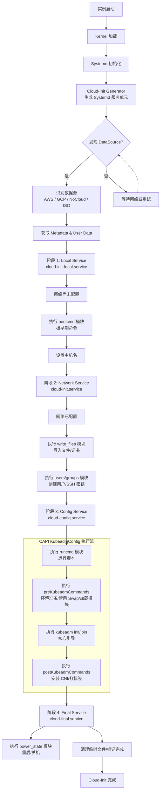

# Cloud-Init 完全指南

Cloud-Init 是 Linux 虚拟机和实例初始化的行业标准工具。它能够在系统首次启动时，自动完成主机名设置、用户创建、软件安装、配置注入等任务，是实现基础设施即代码 (IaC) 和零接触配置 (Zero-Touch Provisioning) 的核心组件。

## 1. 概述

Cloud-Init 是一个在 Linux 实例启动早期运行的服务。它通过读取**数据源 (DataSource)** 提供的配置数据（通常称为 User Data），按照预定义的阶段执行初始化任务。

**核心目标**: 将一台"空白"的操作系统实例，自动转化为配置好的、可工作的服务节点。

## 2. Cloud-Init 解决的核心问题

| 痛点 | 解决方案 |
|------|----------|
| **镜像爆炸 (Image Sprawl)** | 维护一个通用基础镜像，通过注入配置实现个性化，无需制作成百上千个专用镜像。 |
| **大规模自动化困难** | 支持声明式 YAML 配置，实现零接触配置，无需人工 SSH 登录逐台设置。 |
| **云平台碎片化** | 内置对 AWS, GCP, Azure, VMware, OpenStack 等数据源的统一支持，实现跨云可移植性。 |
| **启动依赖复杂** | 分阶段执行模型 (Local -> Network -> Config)，确保命令在正确的时机执行。 |
| **安全与凭据注入** | 敏感信息 (密码/Key) 在启动时注入，不打包在静态镜像中，提高安全性。 |

## 3. 架构与执行流程

Cloud-Init 的生命周期与 Systemd 紧密集成，分为四个主要阶段。

### 3.1 执行流程图



### 3.2 四个执行阶段详解

| 阶段 | 服务名称 | 网络状态 | 核心任务 |
|------|----------|----------|----------|
| **1. Generator** | `cloud-init-generator` | N/A | 生成 Systemd 服务单元文件。 |
| **2. Local** | `cloud-init-local.service` | ❌ 未配置 | 发现数据源，设置主机名，执行 `bootcmd`。 |
| **3. Network** | `cloud-init.service` | ✅ 已配置 | 读取完整配置，执行 `write_files`, `users`, `runcmd`。 |
| **4. Config** | `cloud-config.service` | ✅ 已配置 | 执行 `runcmd` 剩余部分，处理包安装等。 |
| **5. Final** | `cloud-final.service` | ✅ 已配置 | 执行 `power_state` (重启/关机)，清理临时文件。 |

> **关键**: 绝大多数引导逻辑（包括 CAPI 的 `pre/postKubeadmCommands`）都在 **Network/Config** 阶段的 `runcmd` 模块中执行。

## 4. Cloud-Config 配置语法

Cloud-Init 使用 `#cloud-config` 开头的 YAML 格式进行配置。

### 4.1 基础结构

```yaml
#cloud-config
hostname: k8s-node-01
timezone: Asia/Shanghai

users:
  - name: admin
    sudo: ['ALL=(ALL) NOPASSWD:ALL']
    ssh_authorized_keys:
      - ssh-rsa AAAAB3...

write_files:
  - path: /etc/kubernetes/kubeadm.yaml
    content: |
      apiVersion: kubeadm.k8s.io/v1beta3
      kind: JoinConfiguration
    owner: root:root
    permissions: '0644'

runcmd:
  - swapoff -a
  - kubeadm join 192.168.1.100:6443 --token abcdef.0123456789abcdef
```

### 4.2 核心模块

| 模块 | 用途 | 执行阶段 |
|------|------|----------|
| `bootcmd` | 极早期命令 (网络前) | Local |
| `write_files` | 写入文件到磁盘 | Network |
| `users` / `groups` | 创建用户和组 | Network |
| `packages` | 安装软件包 | Network |
| `runcmd` | 运行任意命令 | Network/Config |
| `power_state` | 重启或关机 | Final |

## 5. 常见使用场景

### 5.1 基础系统配置
设置主机名、时区、创建用户、配置 SSH 密钥。

### 5.2 网络配置
配置静态 IP、DNS、网卡 Bonding、VLAN。

### 5.3 存储与磁盘管理
自动分区、格式化文件系统、挂载数据盘 (如 `/var/lib/etcd`)。

### 5.4 包管理与软件安装
配置 APT/YUM 源，安装 `containerd`, `curl`, `jq` 等基础工具。

### 5.5 文件生成与配置注入
生成 `kubeadm-config.yaml`、Systemd Unit 文件、TLS 证书。

### 5.6 命令执行与引导脚本
禁用 Swap、加载内核模块 (`br_netfilter`)、执行 `kubeadm init/join`、安装 CNI 插件。

## 6. Cluster-API 中的 Cloud-Init

在 CAPI 中，`KubeadmConfig` 和 `KubeadmConfigTemplate` 使用 Cloud-Init 来引导节点。

### 6.1 命令映射

| CAPI 字段 | Cloud-Init 模块 | 执行时机 |
|-----------|-----------------|----------|
| `bootCommands` | `bootcmd` | 网络配置前 (极早) |
| `files` | `write_files` | `kubeadm` 执行前 |
| `preKubeadmCommands` | `runcmd` (前部) | `kubeadm` 执行前 |
| **(kubeadm init/join)** | `runcmd` (中部) | 核心引导 |
| `postKubeadmCommands` | `runcmd` (后部) | `kubeadm` 执行后 |

### 6.2 执行机制

CAPI 生成的 `runcmd` 结构如下：

```yaml
runcmd:
  # 1. preKubeadmCommands
  - "swapoff -a"
  - "modprobe br_netfilter"
  
  # 2. 核心引导 (由 CAPI 自动生成)
  - "kubeadm init --config /run/kubeadm/kubeadm.yaml"
  
  # 3. postKubeadmCommands
  - "kubectl apply -f /tmp/calico.yaml"
```
**注意**: 无论使用 `cloud-config` 还是 `ignition` 格式，这些命令都会按顺序执行。

## 7. 调试与排查

如果节点启动卡住或配置未生效，按以下顺序检查：

### 7.1 检查状态
```bash
cloud-init status
# 正常输出: status: done
```

### 7.2 查看日志
| 日志文件 | 内容 |
|----------|------|
| `/var/log/cloud-init.log` | 详细调试信息，包括模块加载、数据源发现等。 |
| `/var/log/cloud-init-output.log` | `runcmd` 等模块的标准输出和错误输出。 |

### 7.3 常见问题
* **命令未执行**: 检查 `runcmd` 之前的命令是否失败退出 (Cloud-Init 默认 `set -e`)。
* **网络不通**: 检查是否在 `Local` 阶段尝试了网络请求 (应移至 `Network` 阶段)。
* **文件未找到**: 检查 `write_files` 是否成功，路径是否正确。
* **权限问题**: 确保 `write_files` 的 `owner` 和 `permissions` 设置正确。

## 8. 总结

Cloud-Init 是连接**静态操作系统镜像**与**动态工作负载**的桥梁。它通过标准化的配置格式和分阶段执行模型，解决了大规模基础设施管理中的初始化难题。在 Cluster-API 生态中，Cloud-Init 是 Kubeadm Bootstrap Provider 的核心载体，负责将声明式的集群配置转化为节点上的实际动作。
