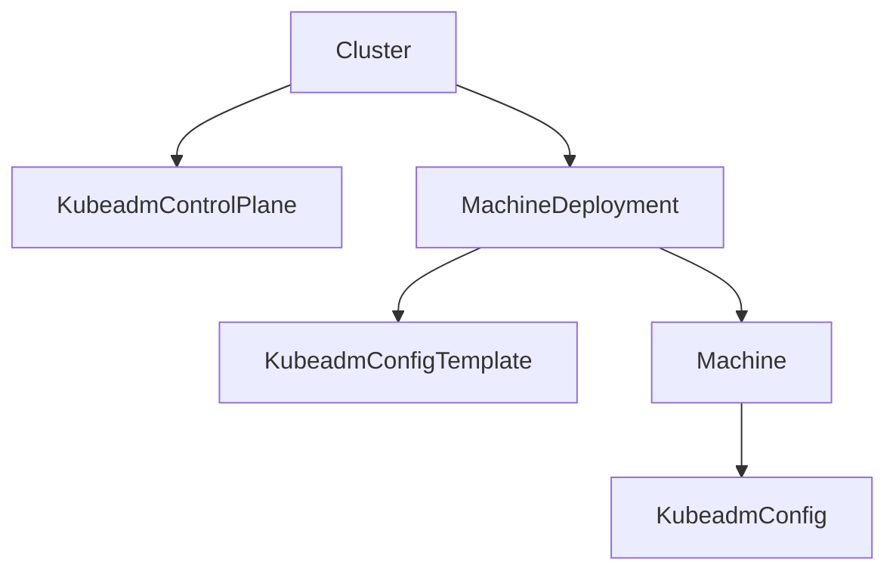
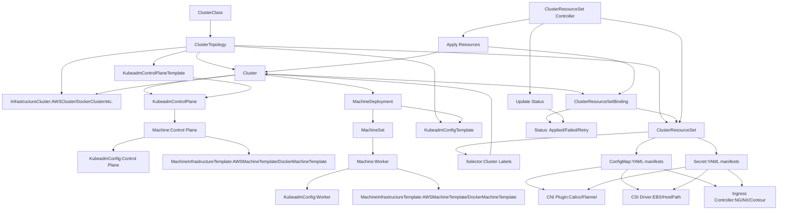
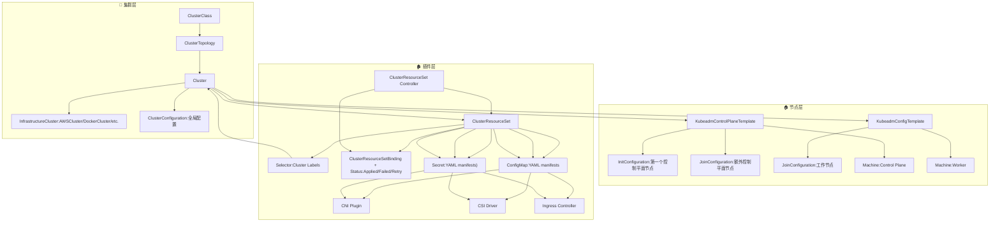
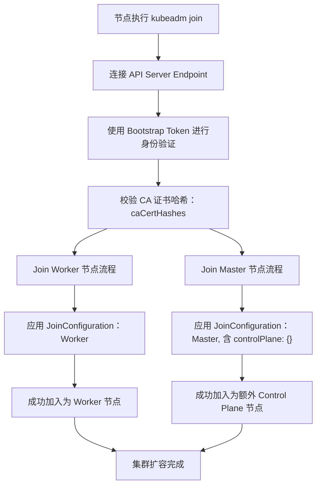

# cluster-api中有关kubeadm的资源
**在 Cluster API 中，和 kubeadm 相关的资源主要分为两类：用于节点引导的 `KubeadmConfig` 系列，以及用于控制平面管理的 `KubeadmControlPlane` 系列。它们分别负责工作节点的初始化和控制平面的生命周期管理。**
## 主要 kubeadm 相关资源
### 1. 引导（Bootstrap）资源
- **`KubeadmConfig`**
  - 描述单个节点的 kubeadm 初始化配置。
  - 包含 kubelet 配置、加入集群的参数、证书生成等。
- **`KubeadmConfigTemplate`**
  - 用于批量生成多个节点的 `KubeadmConfig`。
  - 常与 `MachineDeployment` 搭配，用来统一管理一组工作节点的引导配置。
### 2. 控制平面（Control Plane）资源
- **`KubeadmControlPlane`**
  - 管理一组控制平面节点（通常是 3 个或更多）。
  - 提供扩缩容、升级、证书轮换等功能。
  - 确保控制平面节点的状态与期望配置保持一致。
- **`KubeadmControlPlaneTemplate`**
  - 类似于 `KubeadmConfigTemplate`，用于批量生成控制平面配置。
  - 常与 `ClusterClass` 搭配，实现集群的声明式定义。
## 对比表
| 资源类型                  | 作用范围         | 典型用途                          |
|---------------------------|------------------|-----------------------------------|
| **KubeadmConfig**         | 单个节点         | 定义节点初始化/加入集群的配置      |
| **KubeadmConfigTemplate** | 一组工作节点     | 批量生成工作节点的引导配置         |
| **KubeadmControlPlane**   | 控制平面节点组   | 管理控制平面生命周期（扩缩容/升级）|
| **KubeadmControlPlaneTemplate** | 控制平面模板 | 与 ClusterClass 搭配，声明式管理   |
## 使用场景
- **集群引导**：通过 `KubeadmConfig` 或 `KubeadmConfigTemplate`，定义工作节点如何使用 kubeadm 加入集群。
- **控制平面管理**：通过 `KubeadmControlPlane`，实现控制平面的自动扩缩容、升级和健康检查。
- **集群类（ClusterClass）**：结合 `KubeadmControlPlaneTemplate` 和 `KubeadmConfigTemplate`，实现集群的标准化定义和快速复用。

✅ 总结：Cluster API 中的 kubeadm 资源主要是 **`KubeadmConfig` / `KubeadmConfigTemplate`**（负责节点引导）和 **`KubeadmControlPlane` / `KubeadmControlPlaneTemplate`**（负责控制平面管理）。它们共同构成了基于 kubeadm 的集群生命周期管理核心。  [The Cluster API Book](https://cluster-api.sigs.k8s.io/)  [Kubernetes](https://kubernetes.io/blog/2026/01/27/cluster-api-v1-12-release/)
## 资源关系图

### 图解说明
- **Cluster**：顶层对象，定义整个集群的期望状态。
- **KubeadmControlPlane (KCP)**：由 Cluster 引用，负责控制平面节点的生命周期管理。
- **MachineDeployment (MDT)**：由 Cluster 引用，负责工作节点组的声明式管理。
- **KubeadmConfigTemplate (KCT)**：由 MachineDeployment 引用，用来批量生成工作节点的 kubeadm 引导配置。
- **Machine**：具体的节点对象，由 MachineDeployment 创建。
- **KubeadmConfig (KC)**：与单个 Machine 绑定，定义该节点的 kubeadm 初始化/加入集群配置。

这样你可以看到完整的链条：
- **Cluster** 管理控制平面和工作节点。
- 控制平面通过 **KubeadmControlPlane** 管理。
- 工作节点通过 **MachineDeployment** 管理，并使用 **KubeadmConfigTemplate** 批量生成配置。
- 每个 **Machine** 都会关联一个 **KubeadmConfig**，用于节点的 kubeadm 引导。
## 整个 **Cluster API + kubeadm + ClusterClass + CRS** 的资源关系图  

### 图解说明（完整资源链）
- **ClusterClass / ClusterTopology / Cluster**：顶层声明式定义 → 实例化 → 集群对象。
- **InfrastructureCluster**：集群级基础设施（AWSCluster、DockerCluster）。
- **MachineInfrastructureTemplate**：节点级基础设施模板（AWSMachineTemplate、DockerMachineTemplate）。
- **控制平面链路**：`KubeadmControlPlaneTemplate` → `KubeadmControlPlane` → `Machine (Control Plane)` → `KubeadmConfig` + `MachineInfrastructureTemplate`。
- **工作节点链路**：`MachineDeployment` → `MachineSet` → `Machine (Worker)` → `KubeadmConfig` + `MachineInfrastructureTemplate`。
- **ClusterResourceSet (CRS)**：定义要注入的资源（CNI、CSI、Ingress）。
- **Selector**：通过 Cluster 标签选择目标集群。
- **ClusterResourceSetBinding**：绑定关系，记录 CRS 应用到某个 Cluster。
- **Status 字段**：反映应用结果（Applied / Failed / Retry）。
- **ConfigMap / Secret**：存放具体 YAML 清单。
- **Controller → Apply → Status**：控制器自动执行应用流程并更新状态。

✅ 至此，整个 **Cluster API + kubeadm + ClusterClass + CRS** 的资源体系已经完整：  
- 顶层（ClusterClass/Topology）  
- 集群（Cluster + InfraCluster）  
- 控制平面链路  
- 工作节点链路  
- 插件注入链路（CRS + Binding + Selector + ConfigMap/Secret + Status）  

这样你就拥有了一个全景图，涵盖了 Cluster API 的主要资源对象及它们之间的关系。  
## 三层视角（集群层 / 节点层 / 插件层）
把整个 **Cluster API 资源体系**分成三层视角来看：  

```mermaid
graph TD

    %% 集群层
    subgraph 集群层
        ClusterClass["ClusterClass"]
        ClusterTopology["ClusterTopology"]
        Cluster["Cluster"]
        InfraCluster["InfrastructureCluster:AWSCluster/DockerCluster/etc."]
    end

    %% 节点层
    subgraph 节点层
        KCPTemplate["KubeadmControlPlaneTemplate"]
        KCP["KubeadmControlPlane"]
        CP_Machine["Machine:Control Plane)"]
        CP_KC["KubeadmConfig:Control Plane)"]
        CP_MachineInfraTemplate["MachineInfrastructureTemplate:AWSMachineTemplate/DockerMachineTemplate"]

        MDT["MachineDeployment"]
        MS["MachineSet"]
        KCT["KubeadmConfigTemplate"]
        Worker_Machine["Machine:Worker)"]
        Worker_KC["KubeadmConfig:Worker)"]
        Worker_MachineInfraTemplate["MachineInfrastructureTemplate:AWSMachineTemplate/DockerMachineTemplate"]
    end

    %% 插件层
    subgraph 插件层
        CRS["ClusterResourceSet"]
        CRSSelector["Selector:Cluster Labels"]
        CRSBinding["ClusterResourceSetBinding"]
        CRSBindingStatus["Status: Applied/Failed/Retry"]
        ConfigMap["ConfigMap:YAML manifests"]
        Secret["Secret:YAML manifests)"]
        CNI["CNI Plugin:Calico/Flannel"]
        CSI["CSI Driver:EBS/HostPath"]
        Ingress["Ingress Controller:NGINX/Contour"]
        CRSController["ClusterResourceSet Controller"]
    end

    %% 关系
    ClusterClass --> ClusterTopology
    ClusterTopology --> Cluster
    ClusterTopology --> KCPTemplate
    ClusterTopology --> KCT
    ClusterTopology --> InfraCluster
    ClusterTopology --> CRS

    Cluster --> KCP
    Cluster --> MDT
    Cluster --> InfraCluster
    Cluster --> CRSBinding

    KCPTemplate --> KCP
    KCP --> CP_Machine
    CP_Machine --> CP_KC
    CP_Machine --> CP_MachineInfraTemplate

    MDT --> MS
    MS --> Worker_Machine
    MDT --> KCT
    Worker_Machine --> Worker_KC
    Worker_Machine --> Worker_MachineInfraTemplate

    CRS --> CRSSelector
    CRSSelector --> Cluster
    CRSBinding --> CRS
    CRSBinding --> CRSBindingStatus

    CRS --> ConfigMap
    CRS --> Secret
    ConfigMap --> CNI
    ConfigMap --> CSI
    ConfigMap --> Ingress
    Secret --> CNI
    Secret --> CSI
    Secret --> Ingress

    CRSController --> CRS
    CRSController --> CRSBinding
    CRSController --> CRSBindingStatus
```

### 三层视角职责说明
- **集群层**  
  - **ClusterClass / ClusterTopology / Cluster**：定义和实例化集群整体结构。  
  - **InfrastructureCluster**：指定集群运行的底层环境（AWS、Docker、Azure 等）。  
- **节点层**  
  - **控制平面链路**：`KubeadmControlPlaneTemplate` → `KubeadmControlPlane` → `Machine (Control Plane)` → `KubeadmConfig` + `MachineInfrastructureTemplate`。  
  - **工作节点链路**：`MachineDeployment` → `MachineSet` → `Machine (Worker)` → `KubeadmConfig` + `MachineInfrastructureTemplate`。  
- **插件层**  
  - **ClusterResourceSet (CRS)**：定义要注入的插件资源。  
  - **Selector**：通过 Cluster 标签选择目标集群。  
  - **ClusterResourceSetBinding**：绑定关系，记录 CRS 应用到某个 Cluster。  
  - **Status 字段**：反映应用结果（Applied / Failed / Retry）。  
  - **ConfigMap / Secret**：存放具体 YAML 清单。  
  - **Addons**：CNI、CSI、Ingress 等插件。  
  - **Controller**：负责自动执行 Apply → 更新 Status → 维护 Binding。  

这样分层后，你可以更清晰地理解：  
- **集群层**负责整体定义和基础设施挂接。  
- **节点层**负责控制平面和工作节点的生命周期管理。  
- **插件层**负责自动注入网络、存储和入口等功能，保证集群开箱即用。  
## 分层架构图

```mermaid
graph TD

    %% 集群层
    subgraph 集群层
        ClusterClass["ClusterClass"]
        ClusterTopology["ClusterTopology"]
        Cluster["Cluster"]
        InfraCluster["InfrastructureCluster:AWSCluster/DockerCluster/etc."]
    end

    %% 节点层
    subgraph 节点层
        KCPTemplate["KubeadmControlPlaneTemplate"]
        KCP["KubeadmControlPlane"]
        CP_Machine["Machine:Control Plane"]
        CP_KC["KubeadmConfig:Control Plane"]
        CP_MachineInfraTemplate["MachineInfrastructureTemplate:AWSMachineTemplate/DockerMachineTemplate"]

        MDT["MachineDeployment"]
        MS["MachineSet"]
        KCT["KubeadmConfigTemplate"]
        Worker_Machine["Machine:Worker)"]
        Worker_KC["KubeadmConfig:Worker"]
        Worker_MachineInfraTemplate["MachineInfrastructureTemplate:AWSMachineTemplate/DockerMachineTemplate"]
    end

    %% 插件层
    subgraph 插件层
        CRS["ClusterResourceSet"]
        CRSSelector["Selector:Cluster Labels"]
        CRSBinding["ClusterResourceSetBinding"]
        CRSBindingStatus["Status: Applied/Failed/Retry"]
        ConfigMap["ConfigMap:YAML manifests"]
        Secret["Secret:YAML manifests"]
        CNI["CNI Plugin:Calico/Flannel"]
        CSI["CSI Driver:EBS/HostPath"]
        Ingress["Ingress Controller:NGINX/Contour"]
        CRSController["ClusterResourceSet Controller"]
    end

    %% 层间关系
    ClusterClass --> ClusterTopology
    ClusterTopology --> Cluster
    ClusterTopology --> KCPTemplate
    ClusterTopology --> KCT
    ClusterTopology --> InfraCluster
    ClusterTopology --> CRS

    Cluster --> KCP
    Cluster --> MDT
    Cluster --> InfraCluster
    Cluster --> CRSBinding

    KCPTemplate --> KCP
    KCP --> CP_Machine
    CP_Machine --> CP_KC
    CP_Machine --> CP_MachineInfraTemplate

    MDT --> MS
    MS --> Worker_Machine
    MDT --> KCT
    Worker_Machine --> Worker_KC
    Worker_Machine --> Worker_MachineInfraTemplate

    CRS --> CRSSelector
    CRSSelector --> Cluster
    CRSBinding --> CRS
    CRSBinding --> CRSBindingStatus

    CRS --> ConfigMap
    CRS --> Secret
    ConfigMap --> CNI
    ConfigMap --> CSI
    ConfigMap --> Ingress
    Secret --> CNI
    Secret --> CSI
    Secret --> Ingress

    CRSController --> CRS
    CRSController --> CRSBinding
    CRSController --> CRSBindingStatus
```

### 三层分层架构职责
- **集群层**：负责整体定义与实例化，包括 `ClusterClass`、`ClusterTopology`、`Cluster` 以及集群级基础设施对象 `InfrastructureCluster`。  
- **节点层**：负责控制平面与工作节点的生命周期管理，包括 `KubeadmControlPlaneTemplate`、`KubeadmControlPlane`、`MachineDeployment`、`MachineSet`、`Machine`、`KubeadmConfig`、`MachineInfrastructureTemplate`。  
- **插件层**：负责自动注入网络、存储和入口等功能，包括 `ClusterResourceSet`、`Selector`、`ClusterResourceSetBinding`、`ConfigMap`、`Secret`、`CNI`、`CSI`、`Ingress`，并由 `ClusterResourceSet Controller` 驱动应用流程和状态更新。  

这样分层后，整个 **Cluster API 架构**就像一个三层楼：  
- **顶层（集群层）**：定义和实例化集群整体。  
- **中层（节点层）**：管理控制平面和工作节点。  
- **底层（插件层）**：自动注入网络、存储和入口等基础功能。  

   
# Cluster API核心资源详解
## 一、资源关系总览
```
┌─────────────────────────────────────────────────────────────┐
│                     Cluster API 资源层级                     │
├─────────────────────────────────────────────────────────────┤
│                                                              │
│  Cluster                                                     │
│    │                                                         │
│    ├─ ControlPlaneRef ──> KubeadmControlPlane               │
│    │                          │                              │
│    │                          ├─ KubeadmControlPlaneTemplate │
│    │                          │                              │
│    │                          └─ MachineTemplate             │
│    │                                 │                       │
│    │                                 └─ InfrastructureRef    │
│    │                                     │                   │
│    │                                     └─ MachineInfrastructureTemplate
│    │                                                         │
│    └─ InfrastructureRef ──> InfrastructureCluster            │
│                                                              │
│  MachineDeployment                                           │
│    │                                                         │
│    ├─ Bootstrap ──> KubeadmConfigTemplate                    │
│    │                        │                                │
│    │                        └─ KubeadmConfig                 │
│    │                                                         │
│    └─ InfrastructureRef ──> MachineInfrastructureTemplate    │
│                                                              │
└─────────────────────────────────────────────────────────────┘
```
## 二、KubeadmControlPlane
### 2.1 规格定义
```go
type KubeadmControlPlaneSpec struct {
    // 副本数
    Replicas *int32 `json:"replicas"`
    
    // Kubernetes版本
    Version string `json:"version"`
    
    // 机器模板
    MachineTemplate KubeadmControlPlaneMachineTemplate `json:"machineTemplate"`
    
    // Kubeadm配置
    KubeadmConfigSpec KubeadmConfigSpec `json:"kubeadmConfigSpec"`
    
    // Rollout策略
    RolloutStrategy *RolloutStrategy `json:"rolloutStrategy,omitempty"`
    
    // 租户ID（多租户场景）
    TenantID *string `json:"tenantID,omitempty"`
}

type KubeadmControlPlaneMachineTemplate struct {
    // 基础设施引用
    InfrastructureRef corev1.ObjectReference `json:"infrastructureRef"`
    
    // 节点驱逐超时时间
    NodeDrainTimeout *metav1.Duration `json:"nodeDrainTimeout,omitempty"`
}

type RolloutStrategy struct {
    // 滚动更新策略
    RollingUpdate *RollingUpdateStrategy `json:"rollingUpdate,omitempty"`
    
    // 部署类型
    Type RolloutStrategyType `json:"type,omitempty"`
}

type RollingUpdateStrategy struct {
    // 最大不可用数
    MaxUnavailable *int `json:"maxUnavailable,omitempty"`
    
    // 最大激增数
    MaxSurge *int `json:"maxSurge,omitempty"`
}
```
### 2.2 作用
**核心职责**：
- 管理Kubernetes控制平面节点的生命周期
- 自动化控制平面节点的创建、升级、删除
- 管理etcd集群（内置etcd模式）
- 提供控制平面高可用能力

**关键功能**：
1. **自动初始化**：第一个控制平面节点执行kubeadm init
2. **自动加入**：后续控制平面节点执行kubeadm join
3. **滚动升级**：支持控制平面节点的滚动升级
4. **自愈能力**：自动替换失败的控制平面节点
### 2.3 使用场景
| 场景 | 说明 |
|------|------|
| **创建高可用集群** | 部署多个控制平面节点，提供容错能力 |
| **控制平面升级** | 滚动升级控制平面节点到新版本 |
| **控制平面扩缩容** | 动态调整控制平面节点数量 |
| **故障自愈** | 自动替换失败的控制平面节点 |
### 2.4 完整样例
```yaml
apiVersion: controlplane.cluster.x-k8s.io/v1beta1
kind: KubeadmControlPlane
metadata:
  name: my-cluster-control-plane
  namespace: default
spec:
  replicas: 3
  version: v1.28.0
  
  machineTemplate:
    infrastructureRef:
      apiVersion: infrastructure.cluster.x-k8s.io/v1beta1
      kind: AWSMachine
      name: my-cluster-control-plane
    nodeDrainTimeout: 10m
  
  kubeadmConfigSpec:
    clusterConfiguration:
      apiServer:
        extraArgs:
          cloud-provider: aws
          oidc-issuer-url: https://oidc.example.com
          oidc-client-id: kubernetes
        extraVolumes:
        - name: oidc-ca
          hostPath: /etc/ssl/oidc
          mountPath: /etc/ssl/oidc
          readOnly: true
      
      controllerManager:
        extraArgs:
          cloud-provider: aws
          cluster-signing-cert-file: /etc/kubernetes/pki/ca.crt
          cluster-signing-key-file: /etc/kubernetes/pki/ca.key
      
      etcd:
        local:
          dataDir: /var/lib/etcd
          extraArgs:
            heartbeat-interval: "100"
            election-timeout: "1000"
      
      networking:
        podSubnet: 192.168.0.0/16
        serviceSubnet: 10.96.0.0/12
        dnsDomain: cluster.local
      
      kubernetesVersion: v1.28.0
    
    initConfiguration:
      nodeRegistration:
        name: '{{ ds.meta_data.local_hostname }}'
        criSocket: unix:///var/run/containerd/containerd.sock
        kubeletExtraArgs:
          cloud-provider: aws
          cgroup-driver: systemd
        taints:
        - key: node-role.kubernetes.io/control-plane
          effect: NoSchedule
    
    joinConfiguration:
      nodeRegistration:
        name: '{{ ds.meta_data.local_hostname }}'
        criSocket: unix:///var/run/containerd/containerd.sock
        kubeletExtraArgs:
          cloud-provider: aws
          cgroup-driver: systemd
        taints:
        - key: node-role.kubernetes.io/control-plane
          effect: NoSchedule
    
    files:
    - path: /etc/kubernetes/audit-policy.yaml
      owner: root:root
      permissions: "0640"
      content: |
        apiVersion: audit.k8s.io/v1
        kind: Policy
        rules:
        - level: Metadata
    
    preKubeadmCommands:
    - systemctl enable containerd
    - systemctl start containerd
    
    postKubeadmCommands:
    - kubectl apply -f https://raw.githubusercontent.com/projectcalico/calico/v3.26.0/manifests/calico.yaml
  
  rolloutStrategy:
    type: RollingUpdate
    rollingUpdate:
      maxUnavailable: 1
      maxSurge: 1
```
## 三、KubeadmControlPlaneTemplate
### 3.1 规格定义
```go
type KubeadmControlPlaneTemplateSpec struct {
    Template KubeadmControlPlaneTemplateResource `json:"template"`
}

type KubeadmControlPlaneTemplateResource struct {
    Spec KubeadmControlPlaneTemplateResourceSpec `json:"spec"`
}

type KubeadmControlPlaneTemplateResourceSpec struct {
    // Kubeadm配置（不包含Replicas和Version）
    KubeadmConfigSpec KubeadmConfigSpec `json:"kubeadmConfigSpec"`
    
    // 机器模板
    MachineTemplate KubeadmControlPlaneMachineTemplate `json:"machineTemplate,omitempty"`
}
```
### 3.2 作用
**核心职责**：
- 定义可复用的控制平面配置模板
- 支持多集群场景下的配置标准化
- 与ClusterClass配合使用

**关键功能**：
1. **配置复用**：避免重复定义相同的控制平面配置
2. **标准化管理**：统一管理多个集群的控制平面配置
3. **版本控制**：通过模板版本管理配置变更
### 3.3 使用场景
| 场景 | 说明 |
|------|------|
| **多集群管理** | 为多个集群提供统一的控制平面配置 |
| **ClusterClass** | 作为ClusterClass的控制平面模板 |
| **配置标准化** | 标准化组织内的控制平面配置 |
### 3.4 完整样例
```yaml
apiVersion: controlplane.cluster.x-k8s.io/v1beta1
kind: KubeadmControlPlaneTemplate
metadata:
  name: production-control-plane-template
  namespace: default
spec:
  template:
    spec:
      machineTemplate:
        infrastructureRef:
          apiVersion: infrastructure.cluster.x-k8s.io/v1beta1
          kind: AWSMachineTemplate
          name: production-control-plane
      
      kubeadmConfigSpec:
        clusterConfiguration:
          apiServer:
            extraArgs:
              enable-admission-plugins: NodeRestriction,PodSecurityPolicy
              audit-log-path: /var/log/kubernetes/audit.log
              audit-log-maxage: "30"
              audit-log-maxbackup: "10"
              audit-log-maxsize: "100"
            extraVolumes:
            - name: audit-log
              hostPath: /var/log/kubernetes
              mountPath: /var/log/kubernetes
              readOnly: false
          
          controllerManager:
            extraArgs:
              enable-hostpath-provisioner: "false"
              horizontal-pod-autoscaler-sync-period: 15s
          
          scheduler:
            extraArgs:
              bind-address: 0.0.0.0
              secure-port: 10259
          
          etcd:
            local:
              extraArgs:
                auto-compaction-retention: "1"
                snapshot-count: "10000"
          
          networking:
            podSubnet: 192.168.0.0/16
            serviceSubnet: 10.96.0.0/12
            dnsDomain: cluster.local
        
        initConfiguration:
          nodeRegistration:
            criSocket: unix:///var/run/containerd/containerd.sock
            kubeletExtraArgs:
              cgroup-driver: systemd
              max-pods: "110"
              pod-max-pids: "4096"
            taints:
            - key: node-role.kubernetes.io/control-plane
              effect: NoSchedule
        
        joinConfiguration:
          nodeRegistration:
            criSocket: unix:///var/run/containerd/containerd.sock
            kubeletExtraArgs:
              cgroup-driver: systemd
              max-pods: "110"
              pod-max-pids: "4096"
            taints:
            - key: node-role.kubernetes.io/control-plane
              effect: NoSchedule
        
        files:
        - path: /etc/kubernetes/audit-policy.yaml
          owner: root:root
          permissions: "0640"
          content: |
            apiVersion: audit.k8s.io/v1
            kind: Policy
            rules:
            - level: RequestResponse
              resources:
              - group: ""
                resources: ["pods", "services"]
            - level: Metadata
              resources:
              - group: ""
                resources: ["secrets", "configmaps"]
        
        preKubeadmCommands:
        - systemctl enable containerd
        - systemctl start containerd
        - modprobe br_netfilter
        - sysctl -w net.bridge.bridge-nf-call-iptables=1
---
apiVersion: cluster.x-k8s.io/v1beta1
kind: ClusterClass
metadata:
  name: production-cluster-class
spec:
  controlPlane:
    ref:
      apiVersion: controlplane.cluster.x-k8s.io/v1beta1
      kind: KubeadmControlPlaneTemplate
      name: production-control-plane-template
  
  infrastructure:
    ref:
      apiVersion: infrastructure.cluster.x-k8s.io/v1beta1
      kind: AWSClusterTemplate
      name: production-cluster-template
---
apiVersion: cluster.x-k8s.io/v1beta1
kind: Cluster
metadata:
  name: my-production-cluster
  labels:
    clusterclass: production-cluster-class
spec:
  topology:
    class: production-cluster-class
    version: v1.28.0
    controlPlane:
      replicas: 3
    workers:
      machineDeployments:
      - class: default-worker
        replicas: 5
```
## 四、KubeadmConfig
### 4.1 规格定义
```go
type KubeadmConfigSpec struct {
    // 集群配置（仅用于init）
    ClusterConfiguration *ClusterConfiguration `json:"clusterConfiguration,omitempty"`
    
    // 初始化配置（仅用于init）
    InitConfiguration *InitConfiguration `json:"initConfiguration,omitempty"`
    
    // 加入配置（仅用于join）
    JoinConfiguration *JoinConfiguration `json:"joinConfiguration,omitempty"`
    
    // 文件列表
    Files []File `json:"files,omitempty"`
    
    // 前置命令
    PreKubeadmCommands []string `json:"preKubeadmCommands,omitempty"`
    
    // 后置命令
    PostKubeadmCommands []string `json:"postKubeadmCommands,omitempty"`
    
    // 用户
    Users []User `json:"users,omitempty"`
    
    // NTP配置
    NTP *NTP `json:"ntp,omitempty"`
    
    // 格式化磁盘
    Format string `json:"format,omitempty"`
    
    // 忽略验证错误
    IgnorePreflightErrors []string `json:"ignorePreflightErrors,omitempty"`
}

type ClusterConfiguration struct {
    // API Server配置
    APIServer *APIServer `json:"apiServer,omitempty"`
    
    // Controller Manager配置
    ControllerManager *ControlPlaneComponent `json:"controllerManager,omitempty"`
    
    // Scheduler配置
    Scheduler *ControlPlaneComponent `json:"scheduler,omitempty"`
    
    // Etcd配置
    Etcd Etcd `json:"etcd,omitempty"`
    
    // DNS配置
    DNS DNS `json:"dns,omitempty"`
    
    // 网络配置
    Networking Networking `json:"networking,omitempty"`
    
    // Kubernetes版本
    KubernetesVersion string `json:"kubernetesVersion,omitempty"`
    
    // 控制平面端点
    ControlPlaneEndpoint string `json:"controlPlaneEndpoint,omitempty"`
    
    // 证书目录
    CertificatesDir string `json:"certificatesDir,omitempty"`
    
    // 镜像仓库
    ImageRepository string `json:"imageRepository,omitempty"`
    
    // 使用3层网络
    UseHyperKubeImage bool `json:"useHyperKubeImage,omitempty"`
}

type InitConfiguration struct {
    // 节点注册配置
    NodeRegistration NodeRegistrationOptions `json:"nodeRegistration,omitempty"`
    
    // 本地API端点
    LocalAPIEndpoint APIEndpoint `json:"localAPIEndpoint,omitempty"`
    
    // 证书密钥
    CertificateKey string `json:"certificateKey,omitempty"`
    
    // 引导令牌
    BootstrapTokens []BootstrapToken `json:"bootstrapTokens,omitempty"`
}

type JoinConfiguration struct {
    // 节点注册配置
    NodeRegistration NodeRegistrationOptions `json:"nodeRegistration,omitempty"`
    
    // 控制平面配置
    ControlPlane *JoinControlPlane `json:"controlPlane,omitempty"`
    
    // 发现配置
    Discovery Discovery `json:"discovery"`
    
    // CA证书路径
    CACertPathes []string `json:"caCertPathes,omitempty"`
}
```
### 4.2 作用
**核心职责**：
- 定义节点的kubeadm配置
- 控制节点的初始化和加入过程
- 管理节点级别的配置

**关键功能**：
1. **节点初始化**：配置kubeadm init参数
2. **节点加入**：配置kubeadm join参数
3. **文件分发**：在节点上创建配置文件
4. **命令执行**：执行前置和后置脚本
### 4.3 使用场景
| 场景 | 说明 |
|------|------|
| **控制平面节点** | 配置第一个控制平面节点的初始化 |
| **工作节点** | 配置工作节点加入集群 |
| **自定义配置** | 自定义kubelet、kube-proxy等组件配置 |
| **安全加固** | 配置审计、证书、安全策略 |
### 4.4 完整样例
#### 控制平面节点配置
```yaml
apiVersion: bootstrap.cluster.x-k8s.io/v1beta1
kind: KubeadmConfig
metadata:
  name: my-cluster-control-plane-0
  namespace: default
spec:
  clusterConfiguration:
    apiServer:
      extraArgs:
        authorization-mode: Node,RBAC
        enable-admission-plugins: NodeRestriction,PodSecurityPolicy,ServiceAccount
        audit-log-path: /var/log/kubernetes/audit.log
        audit-log-maxage: "30"
        audit-log-maxbackup: "10"
        audit-log-maxsize: "100"
        oidc-issuer-url: https://oidc.example.com
        oidc-client-id: kubernetes
        oidc-username-claim: email
        oidc-groups-claim: groups
      extraVolumes:
      - name: audit-log
        hostPath: /var/log/kubernetes
        mountPath: /var/log/kubernetes
        readOnly: false
      - name: oidc-ca
        hostPath: /etc/ssl/oidc
        mountPath: /etc/ssl/oidc
        readOnly: true
      certSANs:
      - my-cluster.example.com
      - 192.168.1.100
    
    controllerManager:
      extraArgs:
        allocate-node-cidrs: "true"
        cluster-cidr: 192.168.0.0/16
        service-cluster-ip-range: 10.96.0.0/12
        cluster-signing-cert-file: /etc/kubernetes/pki/ca.crt
        cluster-signing-key-file: /etc/kubernetes/pki/ca.key
        horizontal-pod-autoscaler-sync-period: 15s
        node-cidr-mask-size: "24"
    
    scheduler:
      extraArgs:
        bind-address: 0.0.0.0
        secure-port: 10259
        port: "0"
    
    etcd:
      local:
        dataDir: /var/lib/etcd
        extraArgs:
          heartbeat-interval: "100"
          election-timeout: "1000"
          snapshot-count: "10000"
          auto-compaction-retention: "1"
    
    dns:
      type: CoreDNS
      imageRepository: registry.k8s.io/coredns
      imageTag: v1.10.1
    
    networking:
      podSubnet: 192.168.0.0/16
      serviceSubnet: 10.96.0.0/12
      dnsDomain: cluster.local
    
    kubernetesVersion: v1.28.0
    controlPlaneEndpoint: my-cluster.example.com:6443
    certificatesDir: /etc/kubernetes/pki
    imageRepository: registry.k8s.io
  
  initConfiguration:
    nodeRegistration:
      name: '{{ ds.meta_data.local_hostname }}'
      criSocket: unix:///var/run/containerd/containerd.sock
      kubeletExtraArgs:
        cgroup-driver: systemd
        max-pods: "110"
        pod-max-pids: "4096"
        eviction-hard: memory.available<500Mi,nodefs.available<10%
        kube-reserved: cpu=500m,memory=1Gi
        system-reserved: cpu=500m,memory=1Gi
      taints:
      - key: node-role.kubernetes.io/control-plane
        effect: NoSchedule
      - key: node-role.kubernetes.io/master
        effect: NoSchedule
      ignorePreflightErrors:
      - SystemVerification
      - FileContent--proc-sys-net-bridge-bridge-nf-call-iptables
    
    localAPIEndpoint:
      advertiseAddress: '{{ ds.meta_data.local_ipv4 }}'
      bindPort: 6443
    
    certificateKey: 8a7b9c6d5e4f3a2b1c0d9e8f7a6b5c4d3e2f1a0b9c8d7e6f5a4b3c2d1e0f9a8b
  
  files:
  - path: /etc/kubernetes/audit-policy.yaml
    owner: root:root
    permissions: "0640"
    content: |
      apiVersion: audit.k8s.io/v1
      kind: Policy
      rules:
      - level: RequestResponse
        resources:
        - group: ""
          resources: ["pods", "services", "configmaps", "secrets"]
        verbs: ["create", "update", "patch", "delete"]
      - level: Metadata
        resources:
        - group: ""
          resources: ["secrets"]
      - level: None
        resources:
        - group: ""
          resources: ["events"]
  
  - path: /etc/containerd/config.toml
    owner: root:root
    permissions: "0644"
    content: |
      version = 2
      [plugins."io.containerd.grpc.v1.cri"]
        sandbox_image = "registry.k8s.io/pause:3.9"
        [plugins."io.containerd.grpc.v1.cri".containerd]
          snapshotter = "overlayfs"
          [plugins."io.containerd.grpc.v1.cri".containerd.runtimes.runc]
            runtime_type = "io.containerd.runc.v2"
            [plugins."io.containerd.grpc.v1.cri".containerd.runtimes.runc.options]
              SystemdCgroup = true
        [plugins."io.containerd.grpc.v1.cri".registry.mirrors]
          [plugins."io.containerd.grpc.v1.cri".registry.mirrors."docker.io"]
            endpoint = ["https://mirror.gcr.io"]
  
  - path: /etc/sysctl.d/k8s.conf
    owner: root:root
    permissions: "0644"
    content: |
      net.bridge.bridge-nf-call-iptables  = 1
      net.bridge.bridge-nf-call-ip6tables = 1
      net.ipv4.ip_forward                 = 1
      vm.max_map_count                    = 262144
      fs.may_detach_mounts                = 1
  
  preKubeadmCommands:
  - systemctl enable containerd
  - systemctl start containerd
  - modprobe br_netfilter
  - modprobe overlay
  - sysctl --system
  - mkdir -p /var/log/kubernetes
  - mkdir -p /etc/kubernetes/pki
  
  postKubeadmCommands:
  - mkdir -p /root/.kube
  - cp /etc/kubernetes/admin.conf /root/.kube/config
  - chown root:root /root/.kube/config
  - chmod 600 /root/.kube/config
  
  users:
  - name: kubernetes
    sudo: ALL=(ALL) NOPASSWD:ALL
    shell: /bin/bash
    sshAuthorizedKeys:
    - ssh-rsa AAAAB3NzaC1yc2EAAAADAQABAAABgQC...
  
  ntp:
    servers:
    - 0.pool.ntp.org
    - 1.pool.ntp.org
    - 2.pool.ntp.org
    - 3.pool.ntp.org
    enabled: true
```
#### 工作节点配置
```yaml
apiVersion: bootstrap.cluster.x-k8s.io/v1beta1
kind: KubeadmConfig
metadata:
  name: my-cluster-worker-0
  namespace: default
spec:
  joinConfiguration:
    nodeRegistration:
      name: '{{ ds.meta_data.local_hostname }}'
      criSocket: unix:///var/run/containerd/containerd.sock
      kubeletExtraArgs:
        cgroup-driver: systemd
        max-pods: "250"
        pod-max-pids: "8192"
        eviction-hard: memory.available<1Gi,nodefs.available<15%
        kube-reserved: cpu=1,memory=2Gi
        system-reserved: cpu=500m,memory=1Gi
        feature-gates: KubeletInUserNamespace=true
      taints: []
      ignorePreflightErrors:
      - SystemVerification
    
    discovery:
      bootstrapToken:
        apiServerEndpoint: my-cluster.example.com:6443
        token: abcdef.0123456789abcdef
        unsafeSkipCAVerification: true
      timeout: 5m0s
    
    caCertPathes:
    - /etc/kubernetes/pki/ca.crt
  
  files:
  - path: /etc/containerd/config.toml
    owner: root:root
    permissions: "0644"
    content: |
      version = 2
      [plugins."io.containerd.grpc.v1.cri"]
        sandbox_image = "registry.k8s.io/pause:3.9"
        [plugins."io.containerd.grpc.v1.cri".containerd]
          snapshotter = "overlayfs"
          [plugins."io.containerd.grpc.v1.cri".containerd.runtimes.runc]
            runtime_type = "io.containerd.runc.v2"
            [plugins."io.containerd.grpc.v1.cri".containerd.runtimes.runc.options]
              SystemdCgroup = true
  
  - path: /etc/sysctl.d/k8s.conf
    owner: root:root
    permissions: "0644"
    content: |
      net.bridge.bridge-nf-call-iptables  = 1
      net.bridge.bridge-nf-call-ip6tables = 1
      net.ipv4.ip_forward                 = 1
      vm.max_map_count                    = 262144
  
  preKubeadmCommands:
  - systemctl enable containerd
  - systemctl start containerd
  - modprobe br_netfilter
  - modprobe overlay
  - sysctl --system
  
  postKubeadmCommands:
  - echo "Node joined successfully"
```
## 五、KubeadmConfigTemplate
### 5.1 规格定义
```go
type KubeadmConfigTemplateSpec struct {
    Template KubeadmConfigTemplateResource `json:"template"`
}

type KubeadmConfigTemplateResource struct {
    Spec KubeadmConfigSpec `json:"spec"`
}
```
### 5.2 作用
**核心职责**：
- 定义可复用的节点配置模板
- 用于MachineDeployment批量创建工作节点
- 支持配置标准化和版本管理

**关键功能**：
1. **批量配置**：为多个工作节点提供统一配置
2. **配置复用**：避免重复定义相同的节点配置
3. **版本管理**：通过模板版本管理配置变更
### 5.3 使用场景
| 场景 | 说明 |
|------|------|
| **MachineDeployment** | 为MachineDeployment提供节点配置模板 |
| **工作节点池** | 为不同类型的工作节点池提供不同配置 |
| **配置标准化** | 标准化组织内的节点配置 |
### 5.4 完整样例
```yaml
apiVersion: bootstrap.cluster.x-k8s.io/v1beta1
kind: KubeadmConfigTemplate
metadata:
  name: my-cluster-worker-template
  namespace: default
spec:
  template:
    spec:
      joinConfiguration:
        nodeRegistration:
          name: '{{ ds.meta_data.local_hostname }}'
          criSocket: unix:///var/run/containerd/containerd.sock
          kubeletExtraArgs:
            cgroup-driver: systemd
            max-pods: "250"
            pod-max-pids: "8192"
            eviction-hard: memory.available<1Gi,nodefs.available<15%
            kube-reserved: cpu=1,memory=2Gi
            system-reserved: cpu=500m,memory=1Gi
            feature-gates: KubeletInUserNamespace=true
          taints: []
        
        discovery:
          bootstrapToken:
            apiServerEndpoint: my-cluster.example.com:6443
            token: abcdef.0123456789abcdef
            unsafeSkipCAVerification: true
          timeout: 5m0s
      
      files:
      - path: /etc/containerd/config.toml
        owner: root:root
        permissions: "0644"
        content: |
          version = 2
          [plugins."io.containerd.grpc.v1.cri"]
            sandbox_image = "registry.k8s.io/pause:3.9"
            [plugins."io.containerd.grpc.v1.cri".containerd]
              snapshotter = "overlayfs"
              [plugins."io.containerd.grpc.v1.cri".containerd.runtimes.runc]
                runtime_type = "io.containerd.runc.v2"
                [plugins."io.containerd.grpc.v1.cri".containerd.runtimes.runc.options]
                  SystemdCgroup = true
      
      - path: /etc/sysctl.d/k8s.conf
        owner: root:root
        permissions: "0644"
        content: |
          net.bridge.bridge-nf-call-iptables  = 1
          net.bridge.bridge-nf-call-ip6tables = 1
          net.ipv4.ip_forward                 = 1
          vm.max_map_count                    = 262144
      
      preKubeadmCommands:
      - systemctl enable containerd
      - systemctl start containerd
      - modprobe br_netfilter
      - modprobe overlay
      - sysctl --system
      
      postKubeadmCommands:
      - echo "Node joined successfully"
---
apiVersion: cluster.x-k8s.io/v1beta1
kind: MachineDeployment
metadata:
  name: my-cluster-workers
  namespace: default
spec:
  clusterName: my-cluster
  replicas: 5
  selector:
    matchLabels:
      cluster.x-k8s.io/cluster-name: my-cluster
      nodepool: default-workers
  
  template:
    spec:
      clusterName: my-cluster
      
      bootstrap:
        configRef:
          apiVersion: bootstrap.cluster.x-k8s.io/v1beta1
          kind: KubeadmConfigTemplate
          name: my-cluster-worker-template
      
      infrastructureRef:
        apiVersion: infrastructure.cluster.x-k8s.io/v1beta1
        kind: AWSMachineTemplate
        name: my-cluster-worker
      
      version: v1.28.0
  
  strategy:
    type: RollingUpdate
    rollingUpdate:
      maxUnavailable: 1
      maxSurge: 1
```
## 六、MachineInfrastructureTemplate
### 6.1 规格定义
MachineInfrastructureTemplate是基础设施Provider定义的资源，以AWSMachineTemplate为例：
```go
type AWSMachineTemplateSpec struct {
    Template AWSMachineTemplateResource `json:"template"`
}

type AWSMachineTemplateResource struct {
    Spec AWSMachineSpec `json:"spec"`
}

type AWSMachineSpec struct {
    // 实例类型
    InstanceType string `json:"instanceType"`
    
    // AMI ID
    AMI AMIReference `json:"ami"`
    
    // SSH密钥名称
    SSHKeyName *string `json:"sshKeyName,omitempty"`
    
    // IAM实例配置文件
    IAMInstanceProfile string `json:"iamInstanceProfile,omitempty"`
    
    // 安全组
    AdditionalSecurityGroups []AWSResourceReference `json:"additionalSecurityGroups,omitempty"`
    
    // 根卷配置
    RootVolume *Volume `json:"rootVolume,omitempty"`
    
    // 非根卷配置
    AdditionalBlocks []BlockDevice `json:"additionalBlocks,omitempty"`
    
    // 子网
    Subnet *AWSResourceReference `json:"subnet,omitempty"`
    
    // 公网IP
    PublicIP *bool `json:"publicIP,omitempty"`
    
    // 用户数据
    UserDataSecretRef *corev1.SecretReference `json:"userDataSecretRef,omitempty"`
    
    // 标签
    AdditionalTags Tags `json:"additionalTags,omitempty"`
    
    // 云初始化
    CloudInit CloudInit `json:"cloudInit,omitempty"`
}
```
### 6.2 作用
**核心职责**：
- 定义基础设施资源的模板
- 支持批量创建基础设施资源
- 管理基础设施配置的标准化

**关键功能**：
1. **基础设施定义**：定义VM规格、网络、存储等配置
2. **批量创建**：支持批量创建相同规格的基础设施资源
3. **配置复用**：避免重复定义相同的基础设施配置
### 6.3 使用场景
| 场景 | 说明 |
|------|------|
| **控制平面节点** | 定义控制平面节点的基础设施规格 |
| **工作节点池** | 为不同类型的工作节点池定义基础设施规格 |
| **多云部署** | 为不同云平台定义基础设施模板 |
### 6.4 完整样例
#### AWS Machine Template
```yaml
apiVersion: infrastructure.cluster.x-k8s.io/v1beta1
kind: AWSMachineTemplate
metadata:
  name: my-cluster-control-plane
  namespace: default
spec:
  template:
    spec:
      instanceType: m5.xlarge
      
      ami:
        id: ami-0abcdef1234567890
      
      iamInstanceProfile: control-plane.cluster-api-provider-aws.sigs.k8s.io
      
      sshKeyName: my-cluster-key
      
      additionalSecurityGroups:
      - id: sg-0123456789abcdef0
      - id: sg-0abcdef1234567890
      
      rootVolume:
        size: 100
        type: gp3
        encrypted: true
        encryptionKey: alias/aws/ebs
      
      additionalBlocks:
      - deviceName: /dev/sdb
        size: 200
        type: gp3
        encrypted: true
      
      subnet:
        id: subnet-0123456789abcdef0
      
      publicIP: true
      
      additionalTags:
        cluster.k8s.io/cluster-name: my-cluster
        node-role: control-plane
        environment: production
      
      cloudInit:
        insecureSkipSecretsManager: true
        secureSecretsBackend: secrets-manager
---
apiVersion: infrastructure.cluster.x-k8s.io/v1beta1
kind: AWSMachineTemplate
metadata:
  name: my-cluster-worker
  namespace: default
spec:
  template:
    spec:
      instanceType: m5.2xlarge
      
      ami:
        id: ami-0abcdef1234567890
      
      iamInstanceProfile: nodes.cluster-api-provider-aws.sigs.k8s.io
      
      sshKeyName: my-cluster-key
      
      additionalSecurityGroups:
      - id: sg-0123456789abcdef0
      
      rootVolume:
        size: 200
        type: gp3
        encrypted: true
      
      additionalBlocks:
      - deviceName: /dev/sdb
        size: 500
        type: gp3
        encrypted: true
      - deviceName: /dev/sdc
        size: 1000
        type: st1
        encrypted: true
      
      subnet:
        id: subnet-0abcdef1234567890
      
      publicIP: false
      
      additionalTags:
        cluster.k8s.io/cluster-name: my-cluster
        node-role: worker
        environment: production
        nodepool: default-workers
```
#### vSphere Machine Template
```yaml
apiVersion: infrastructure.cluster.x-k8s.io/v1beta1
kind: VSphereMachineTemplate
metadata:
  name: my-cluster-control-plane
  namespace: default
spec:
  template:
    spec:
      virtualMachineCloneSpec:
        template: ubuntu-2004-kube-v1.28.0
        
        datacenter: dc1
        datastore: datastore1
        folder: /dc1/vm/my-cluster
        resourcePool: /dc1/host/cluster1/Resources
        
        network:
          devices:
          - networkName: VM Network
            dhcp4: true
            dhcp6: false
        
        numCPUs: 4
        numCoresPerSocket: 2
        memoryMiB: 8192
        diskGiB: 100
        
        server: vcenter.example.com
        thumbprint: AA:BB:CC:DD:EE:FF:00:11:22:33:44:55:66:77:88:99:AA:BB:CC:DD
        
        additionalDisks:
        - diskGiB: 200
          datastore: datastore2
        
        customVMXKeys:
          disk.enableUUID: "true"
        
        os: Linux
---
apiVersion: infrastructure.cluster.x-k8s.io/v1beta1
kind: VSphereMachineTemplate
metadata:
  name: my-cluster-worker
  namespace: default
spec:
  template:
    spec:
      virtualMachineCloneSpec:
        template: ubuntu-2004-kube-v1.28.0
        
        datacenter: dc1
        datastore: datastore1
        folder: /dc1/vm/my-cluster
        resourcePool: /dc1/host/cluster1/Resources
        
        network:
          devices:
          - networkName: VM Network
            dhcp4: true
            dhcp6: false
        
        numCPUs: 8
        numCoresPerSocket: 4
        memoryMiB: 16384
        diskGiB: 200
        
        server: vcenter.example.com
        thumbprint: AA:BB:CC:DD:EE:FF:00:11:22:33:44:55:66:77:88:99:AA:BB:CC:DD
        
        additionalDisks:
        - diskGiB: 500
          datastore: datastore2
        - diskGiB: 1000
          datastore: datastore3
        
        os: Linux
```
## 七、资源关系总结
### 7.1 完整示例
```yaml
apiVersion: cluster.x-k8s.io/v1beta1
kind: Cluster
metadata:
  name: my-cluster
  namespace: default
spec:
  clusterNetwork:
    pods:
      cidrBlocks: ["192.168.0.0/16"]
    services:
      cidrBlocks: ["10.96.0.0/12"]
    serviceDomain: cluster.local
  
  controlPlaneRef:
    apiVersion: controlplane.cluster.x-k8s.io/v1beta1
    kind: KubeadmControlPlane
    name: my-cluster-control-plane
  
  infrastructureRef:
    apiVersion: infrastructure.cluster.x-k8s.io/v1beta1
    kind: AWSCluster
    name: my-cluster
---
apiVersion: infrastructure.cluster.x-k8s.io/v1beta1
kind: AWSCluster
metadata:
  name: my-cluster
  namespace: default
spec:
  region: us-west-2
  sshKeyName: my-cluster-key
  network:
    vpc:
      id: vpc-0123456789abcdef0
  controlPlaneEndpoint:
    host: my-cluster.example.com
    port: 6443
---
apiVersion: controlplane.cluster.x-k8s.io/v1beta1
kind: KubeadmControlPlane
metadata:
  name: my-cluster-control-plane
  namespace: default
spec:
  replicas: 3
  version: v1.28.0
  
  machineTemplate:
    infrastructureRef:
      apiVersion: infrastructure.cluster.x-k8s.io/v1beta1
      kind: AWSMachineTemplate
      name: my-cluster-control-plane
  
  kubeadmConfigSpec:
    clusterConfiguration:
      apiServer:
        extraArgs:
          cloud-provider: aws
      controllerManager:
        extraArgs:
          cloud-provider: aws
      networking:
        podSubnet: 192.168.0.0/16
        serviceSubnet: 10.96.0.0/12
    
    initConfiguration:
      nodeRegistration:
        criSocket: unix:///var/run/containerd/containerd.sock
        kubeletExtraArgs:
          cloud-provider: aws
        taints:
        - key: node-role.kubernetes.io/control-plane
          effect: NoSchedule
    
    joinConfiguration:
      nodeRegistration:
        criSocket: unix:///var/run/containerd/containerd.sock
        kubeletExtraArgs:
          cloud-provider: aws
        taints:
        - key: node-role.kubernetes.io/control-plane
          effect: NoSchedule
---
apiVersion: infrastructure.cluster.x-k8s.io/v1beta1
kind: AWSMachineTemplate
metadata:
  name: my-cluster-control-plane
  namespace: default
spec:
  template:
    spec:
      instanceType: m5.xlarge
      ami:
        id: ami-0abcdef1234567890
      iamInstanceProfile: control-plane.cluster-api-provider-aws.sigs.k8s.io
      sshKeyName: my-cluster-key
---
apiVersion: cluster.x-k8s.io/v1beta1
kind: MachineDeployment
metadata:
  name: my-cluster-workers
  namespace: default
spec:
  clusterName: my-cluster
  replicas: 5
  selector:
    matchLabels:
      cluster.x-k8s.io/cluster-name: my-cluster
  
  template:
    spec:
      clusterName: my-cluster
      version: v1.28.0
      
      bootstrap:
        configRef:
          apiVersion: bootstrap.cluster.x-k8s.io/v1beta1
          kind: KubeadmConfigTemplate
          name: my-cluster-worker
      
      infrastructureRef:
        apiVersion: infrastructure.cluster.x-k8s.io/v1beta1
        kind: AWSMachineTemplate
        name: my-cluster-worker
---
apiVersion: bootstrap.cluster.x-k8s.io/v1beta1
kind: KubeadmConfigTemplate
metadata:
  name: my-cluster-worker
  namespace: default
spec:
  template:
    spec:
      joinConfiguration:
        nodeRegistration:
          criSocket: unix:///var/run/containerd/containerd.sock
          kubeletExtraArgs:
            cloud-provider: aws
---
apiVersion: infrastructure.cluster.x-k8s.io/v1beta1
kind: AWSMachineTemplate
metadata:
  name: my-cluster-worker
  namespace: default
spec:
  template:
    spec:
      instanceType: m5.2xlarge
      ami:
        id: ami-0abcdef1234567890
      iamInstanceProfile: nodes.cluster-api-provider-aws.sigs.k8s.io
      sshKeyName: my-cluster-key
```
### 7.2 资源职责对比
| 资源 | 职责 | 作用范围 | 是否可复用 |
|------|------|---------|-----------|
| **KubeadmControlPlane** | 管理控制平面节点 | 单个集群 | ❌ |
| **KubeadmControlPlaneTemplate** | 定义控制平面配置模板 | 多个集群 | ✅ |
| **KubeadmConfig** | 定义单个节点配置 | 单个节点 | ❌ |
| **KubeadmConfigTemplate** | 定义节点配置模板 | 多个节点 | ✅ |
| **MachineInfrastructureTemplate** | 定义基础设施模板 | 多个节点 | ✅ |
### 7.3 使用建议
1. **简单场景**：直接使用KubeadmControlPlane和KubeadmConfig
2. **多集群场景**：使用Template资源实现配置复用
3. **ClusterClass场景**：使用Template资源配合ClusterClass
4. **生产环境**：使用Template资源实现配置标准化和版本管理

# 模板模式
**KubeadmConfigTemplate 属于一种“模板模式（Template Pattern）”的设计思想，它通过定义不可变的配置模板来实现配置的复用和一致性。它的核心价值在于：集群中不同的节点（尤其是工作节点）可以共享同一个模板，从而避免重复定义和人为错误。**  
## 设计模式解析
- **模板模式（Template Pattern）**  
  在软件设计中，模板模式的思想是：先定义一个通用的配置或操作流程，然后在实际使用时通过实例化或引用该模板来生成具体对象。  
  - 在 Cluster API 中，`KubeadmConfigTemplate` 就是这种模板，它定义了节点的引导配置（bootstrap config）。  
  - 当 `MachineDeployment` 或 `MachineSet` 创建新的 `Machine` 时，会引用该模板来生成对应的 `KubeadmConfig`。  
- **不可变性（Immutability）**  
  模板一旦创建，就不应随意修改。因为修改模板不会触发已有节点的滚动更新，可能导致集群状态不一致。正确的做法是：  
  1. **复制现有模板**（kubectl get 导出 YAML）。  
  2. **修改需要的字段**（如 SSH key、实例类型）。  
  3. **创建新模板并更新引用**。  
  这样保证了模板的可复用性和版本化管理。  [The Cluster API Book](https://cluster-api.sigs.k8s.io/tasks/updating-machine-templates.html)  
## 如何做到复用
- **集中定义**：在 ClusterClass 或 MachineDeployment 中引用同一个 `KubeadmConfigTemplate`，所有节点都会使用相同的引导配置。  
- **版本化管理**：通过复制和更新模板，可以创建不同版本的配置，方便在不同环境或场景下复用。  
- **避免重复**：不需要为每个节点单独写配置，而是通过模板自动生成，减少人为错误。  
- **组合使用**：模板不仅用于 bootstrap（如 KubeadmConfigTemplate），还用于基础设施层（如 AWSMachineTemplate），形成完整的声明式复用体系。  
## 举例说明
假设你有一个 **工作节点组**：  
- 定义一个 `KubeadmConfigTemplate`，里面写好 kubeadm join 的参数。  
- 在 `MachineDeployment` 中引用这个模板。  
- 当扩容时，新的 `Machine` 会自动使用该模板生成 `KubeadmConfig`，保证所有节点配置一致。  

如果需要修改（比如换成更大的实例类型）：  
- 复制原模板 → 修改 → 创建新模板 → 更新 MachineDeployment 的引用。  
- 这样就能实现 **配置的复用 + 版本化更新**。  
## 总结
- **KubeadmConfigTemplate 是模板模式的应用**，通过不可变的模板实现配置的复用和一致性。  
- **复用方式**：集中定义、版本化管理、避免重复、组合使用。  
- **好处**：减少错误、提高一致性、支持声明式集群管理。  

👉 换句话说，它就像 **“蓝图”**：你先画好一张蓝图（模板），然后每次建房子（节点）都照着蓝图来，不需要重新设计。  

# KubeadmConfig
把（**Init / Join Worker / Join Master / Cluster 配置**、它们在 **Cluster API 的 KubeadmConfigTemplate 中的嵌入方式**、以及它们的复用机制总结）整合到一个完整说明里，形成一个全景视图。  
## 一、四类 KubeadmConfig 配置及场景
| 配置类型 | 使用场景 | 关键字段 | 示例用途 |
|----------|----------|----------|----------|
| **InitConfiguration + ClusterConfiguration** | 初始化第一个控制平面节点 | `initConfiguration` + `clusterConfiguration` | 创建新集群 |
| **JoinConfiguration (Worker)** | 工作节点加入集群 | `joinConfiguration` | 添加 worker 节点 |
| **JoinConfiguration (Master)** | 额外控制平面节点加入集群 | `joinConfiguration` + `controlPlane: {}` | 添加新的 master 节点 |
| **ClusterConfiguration** | 集群全局配置 | `clusterConfiguration` | 升级、共享配置 |
## 二、典型配置样例
### 1. Init + Cluster（第一个控制平面节点）
```yaml
apiVersion: kubeadm.k8s.io/v1beta3
kind: InitConfiguration
nodeRegistration:
  kubeletExtraArgs:
    cloud-provider: aws
---
apiVersion: kubeadm.k8s.io/v1beta3
kind: ClusterConfiguration
kubernetesVersion: v1.29.0
controlPlaneEndpoint: "my-cluster.example.com:6443"
networking:
  podSubnet: "192.168.0.0/16"
```
### 2. Join Worker（工作节点）
```yaml
apiVersion: kubeadm.k8s.io/v1beta3
kind: JoinConfiguration
discovery:
  bootstrapToken:
    apiServerEndpoint: "my-cluster.example.com:6443"
    token: "abcdef.0123456789abcdef"
    caCertHashes:
      - "sha256:1234567890abcdef..."
nodeRegistration:
  kubeletExtraArgs:
    cloud-provider: aws
```
### 3. Join Master（额外控制平面节点）
```yaml
apiVersion: kubeadm.k8s.io/v1beta3
kind: JoinConfiguration
discovery:
  bootstrapToken:
    apiServerEndpoint: "my-cluster.example.com:6443"
    token: "abcdef.0123456789abcdef"
    caCertHashes:
      - "sha256:1234567890abcdef..."
nodeRegistration:
  kubeletExtraArgs:
    cloud-provider: aws
controlPlane: {}
```
### 4. Cluster（全局配置）
```yaml
apiVersion: kubeadm.k8s.io/v1beta3
kind: ClusterConfiguration
kubernetesVersion: v1.29.0
controlPlaneEndpoint: "my-cluster.example.com:6443"
networking:
  serviceSubnet: "10.96.0.0/12"
  podSubnet: "192.168.0.0/16"
```
## 三、在 Cluster API 中的嵌入方式
### 控制平面（Init + Cluster + Join Master）
```yaml
apiVersion: cluster.x-k8s.io/v1beta1
kind: KubeadmControlPlaneTemplate
metadata:
  name: my-cluster-control-plane
spec:
  template:
    spec:
      kubeadmConfigSpec:
        initConfiguration:
          nodeRegistration:
            kubeletExtraArgs:
              cloud-provider: aws
        clusterConfiguration:
          kubernetesVersion: v1.29.0
          controlPlaneEndpoint: "my-cluster.example.com:6443"
          networking:
            podSubnet: "192.168.0.0/16"
        joinConfiguration:
          controlPlane: {}
          discovery:
            bootstrapToken:
              apiServerEndpoint: "my-cluster.example.com:6443"
              token: "abcdef.0123456789abcdef"
              caCertHashes:
                - "sha256:1234567890abcdef..."
```
### 工作节点（Join Worker）
```yaml
apiVersion: cluster.x-k8s.io/v1beta1
kind: KubeadmConfigTemplate
metadata:
  name: my-cluster-workers
spec:
  template:
    spec:
      joinConfiguration:
        discovery:
          bootstrapToken:
            apiServerEndpoint: "my-cluster.example.com:6443"
            token: "abcdef.0123456789abcdef"
            caCertHashes:
              - "sha256:1234567890abcdef..."
        nodeRegistration:
          kubeletExtraArgs:
            cloud-provider: aws
```
## 四、复用机制总结
- **模板化**：通过 `KubeadmConfigTemplate` / `KubeadmControlPlaneTemplate` 定义统一的配置蓝图。  
- **集中引用**：ClusterClass / MachineDeployment 引用模板，自动生成节点配置。  
- **一致性**：所有节点共享同一份 Init / Join / Cluster 配置，避免人为差异。  
- **版本化**：修改时通过复制模板 → 更新 → 引用新模板，保证可追踪。  

✨ 整合后你可以看到：  
- **Init + Cluster** → 第一个控制平面节点初始化。  
- **Join Worker** → 工作节点加入。  
- **Join Master** → 额外控制平面节点加入。  
- **Cluster** → 全局配置共享。  
- **模板化嵌入** → 在 Cluster API 中通过 `KubeadmConfigTemplate` 和 `KubeadmControlPlaneTemplate` 统一管理，保证声明式和复用。  
## 把四类配置（**Init / Join Worker / Join Master / Cluster**）在 **纵向分层架构图（集群层 / 节点层 / 插件层）** 中标注出来 

```mermaid
graph TD

    %% 集群层
    subgraph 集群层
        ClusterClass["ClusterClass"]
        ClusterTopology["ClusterTopology"]
        Cluster["Cluster"]
        InfraCluster["InfrastructureCluster:AWSCluster/DockerCluster/etc."]

        ClusterConfig["ClusterConfiguration:全局配置"]
    end

    %% 节点层
    subgraph 节点层
        KCPTemplate["KubeadmControlPlaneTemplate"]
        KCP["KubeadmControlPlane"]

        InitConfig["InitConfiguration:第一个控制平面节点)"]
        JoinMasterConfig["JoinConfiguration:额外控制平面节点"]

        CP_Machine["Machine:Control Plane)"]
        CP_KC["KubeadmConfig:Control Plane)"]
        CP_MachineInfraTemplate["MachineInfrastructureTemplate"]

        MDT["MachineDeployment"]
        MS["MachineSet"]
        KCT["KubeadmConfigTemplate"]

        JoinWorkerConfig["JoinConfiguration:工作节点"]

        Worker_Machine["Machine:Worker"]
        Worker_KC["KubeadmConfig:Worker"]
        Worker_MachineInfraTemplate["MachineInfrastructureTemplate"]
    end

    %% 插件层
    subgraph 插件层
        CRS["ClusterResourceSet"]
        CRSSelector["Selector:Cluster Labels"]
        CRSBinding["ClusterResourceSetBinding"]
        CRSBindingStatus["Status: Applied/Failed/Retry"]

        ConfigMap["ConfigMap:YAML manifests"]
        Secret["Secret:YAML manifests"]

        CNI["CNI Plugin:Calico/Flannel"]
        CSI["CSI Driver:EBS/HostPath"]
        Ingress["Ingress Controller:NGINX/Contour"]

        CRSController["ClusterResourceSet Controller"]
    end

    %% 层间关系
    ClusterClass --> ClusterTopology
    ClusterTopology --> Cluster
    ClusterTopology --> KCPTemplate
    ClusterTopology --> KCT
    ClusterTopology --> InfraCluster
    ClusterTopology --> CRS

    Cluster --> KCP
    Cluster --> MDT
    Cluster --> InfraCluster
    Cluster --> CRSBinding
    Cluster --> ClusterConfig

    KCPTemplate --> KCP
    KCP --> InitConfig
    KCP --> JoinMasterConfig
    KCP --> CP_Machine
    CP_Machine --> CP_KC
    CP_Machine --> CP_MachineInfraTemplate

    MDT --> MS
    MS --> Worker_Machine
    MDT --> KCT
    KCT --> JoinWorkerConfig
    Worker_Machine --> Worker_KC
    Worker_Machine --> Worker_MachineInfraTemplate

    CRS --> CRSSelector
    CRSSelector --> Cluster
    CRSBinding --> CRS
    CRSBinding --> CRSBindingStatus

    CRS --> ConfigMap
    CRS --> Secret
    ConfigMap --> CNI
    ConfigMap --> CSI
    ConfigMap --> Ingress
    Secret --> CNI
    Secret --> CSI
    Secret --> Ingress

    CRSController --> CRS
    CRSController --> CRSBinding
    CRSController --> CRSBindingStatus
```

### 分层职责说明
- **集群层**  
  - `ClusterClass` / `ClusterTopology` / `Cluster`：定义和实例化集群整体。  
  - `InfrastructureCluster`：指定集群运行的底层环境。  
  - `ClusterConfiguration`：全局配置（API Server、网络、版本），所有控制平面共享。  
- **节点层**  
  - **控制平面**：  
    - `InitConfiguration` → 第一个控制平面节点初始化。  
    - `JoinConfiguration (Master)` → 额外控制平面节点加入。  
  - **工作节点**：  
    - `JoinConfiguration (Worker)` → 工作节点加入。  
  - **模板化**：通过 `KubeadmControlPlaneTemplate` 和 `KubeadmConfigTemplate` 复用配置。  
- **插件层**  
  - `ClusterResourceSet`：定义要注入的插件资源。  
  - `Selector`：通过标签选择目标集群。  
  - `ClusterResourceSetBinding` + `Status`：记录应用情况（Applied / Failed / Retry）。  
  - `ConfigMap` / `Secret`：存放具体 YAML 清单。  
  - `CNI` / `CSI` / `Ingress`：实际插件资源。  
  - `Controller`：自动执行 Apply → 更新 Status → 维护 Binding。  

这样你就能一眼看出：  
- **集群层**负责整体定义和全局配置。  
- **节点层**负责控制平面和工作节点的生命周期管理（Init / Join Worker / Join Master）。  
- **插件层**负责自动注入网络、存储和入口等功能，保证集群开箱即用。  
## 把四类配置（**Init / Join Worker / Join Master / Cluster**）三层楼房结构图

### 三层楼房结构说明
- **集群层（顶层）**  
  - 定义和实例化集群整体：`ClusterClass`、`ClusterTopology`、`Cluster`。  
  - 指定运行环境：`InfrastructureCluster`。  
  - 全局配置：`ClusterConfiguration`。  

- **节点层（中层）**  
  - 控制平面：`InitConfiguration`（第一个 master）、`JoinConfiguration (Master)`（额外 master）。  
  - 工作节点：`JoinConfiguration (Worker)`。  
  - 模板化：`KubeadmControlPlaneTemplate`、`KubeadmConfigTemplate`。  
  - 实例化：`Machine (Control Plane)`、`Machine (Worker)`。  

- **插件层（底层）**  
  - 插件注入机制：`ClusterResourceSet`。  
  - 匹配机制：`Selector (Cluster Labels)`。  
  - 应用记录：`ClusterResourceSetBinding + Status`。  
  - 资源来源：`ConfigMap` / `Secret`。  
  - 插件类型：`CNI`、`CSI`、`Ingress`。  
  - 自动化执行：`ClusterResourceSet Controller`。  

这样简化后，整个架构就像一栋三层楼：  
- **顶层（集群层）**：定义蓝图和全局配置。  
- **中层（节点层）**：管理控制平面和工作节点生命周期。  
- **底层（插件层）**：自动注入网络、存储和入口等功能。  

# discovery
**在 kubeadm 的 `JoinConfiguration` 中，`discovery` 的原理是通过 **Bootstrap Token + CA 证书哈希** 来建立新节点与控制平面之间的双向信任。Token 是一种短期凭证，通常由 `kubeadm init` 自动生成，默认有效期 24 小时，也可以通过命令手动创建。**  
## 🔑 Discovery 的原理
- **目标**：让新节点安全地发现并加入已有集群。  
- **机制**：  
  1. **API Server Endpoint**：新节点通过配置的 API Server 地址访问控制平面。  
  2. **Bootstrap Token**：作为临时凭证，允许新节点请求加入。  
  3. **CA Cert Hashes**：新节点验证控制平面的 CA 证书哈希，确保连接的是真实的集群，而不是伪造的。  
- **安全性**：结合 Token 和 CA 哈希，保证了双向认证（节点信任控制平面，控制平面也信任节点）。  
## 🔐 Token 的生成方式
- **自动生成**：执行 `kubeadm init` 时，会自动生成一个初始 Token，默认有效期为 **24 小时**。  
- **手动生成**：可以使用命令创建新的 Token：  
  ```bash
  kubeadm token create
  ```
  - 格式：`abcdef.0123456789abcdef`  
  - 由两部分组成：前 6 位随机字符串 + 后 16 位随机字符串。  
  - 可指定参数：  
    - `--ttl` 设置有效期（如 `--ttl 0` 表示永久有效）。  
    - `--description` 添加描述。  
    - `--usages` 指定用途（如 `signing`、`authentication`）。  
- **查看现有 Token**：  
  ```bash
  kubeadm token list
  ```
## 📌 使用场景
- **Worker 节点加入**：通过 `JoinConfiguration` 的 `discovery.bootstrapToken` 使用 Token + CA 哈希加入集群。  
- **Master 节点加入**：同样使用 Token，但需要额外指定 `controlPlane: {}` 字段。  
- **生产环境最佳实践**：  
  - 避免使用永久 Token，降低安全风险。  
  - 使用 RBAC 限制 Token 的权限。  
  - 定期轮换 Token。  
## ⚠️ 风险与注意事项
- **Token 泄露风险**：如果 Token 被泄露，攻击者可能尝试伪造节点加入集群。  
- **过期问题**：默认 24 小时有效期，过期后需要重新生成。  
- **CA 哈希必需**：仅凭 Token 不够安全，必须结合 CA 哈希验证控制平面身份。  

✅ 总结：  
- **Discovery 原理**：新节点通过 API Server + Token + CA 哈希发现并验证集群。  
- **Token 生成**：`kubeadm init` 自动生成，或用 `kubeadm token create` 手动生成。  
- **安全性**：Token + CA 哈希保证双向信任，避免伪造集群。  
## Discovery 流程图

### 流程说明
1. **节点执行 kubeadm join**：读取 `JoinConfiguration`。  
2. **连接 API Server**：通过 `apiServerEndpoint` 与控制平面建立连接。  
3. **Token 验证**：使用 `bootstrapToken` 作为临时凭证。  
4. **CA 哈希校验**：验证控制平面的 CA 证书哈希，确保连接的是真实集群。  
5. **分支路径**：  
   - **Join Worker**：应用 `JoinConfiguration (Worker)`，节点作为工作节点加入。  
   - **Join Master**：应用 `JoinConfiguration (Master)`，带 `controlPlane: {}` 字段，节点作为额外控制平面节点加入。  
6. **成功加入**：节点完成认证与配置，成为集群的一部分。  

这样你就能清晰看到：  
- **Worker 节点加入流程** → 普通 `joinConfiguration`。  
- **Master 节点加入流程** → `joinConfiguration` + `controlPlane: {}`。  


