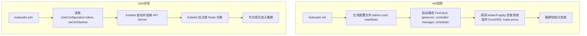

# kubeadm init/join纳管节点
在 `kubeadm init` 或 `kubeadm join` 的流程里，最终把节点纳入集群并不是直接调用某个单一的 `kubectl` 命令，而是通过 **kubeadm 内部逻辑**来完成一系列操作，其中关键步骤确实会用到 `kubectl`。  
## 关键点解析
1. **kubeadm init**  
   - 初始化第一个控制平面节点时，kubeadm 会生成 `admin.conf`，并在本地配置好 `kubectl` 的上下文。  
   - 它会用 `kubectl apply` 的方式把 **CoreDNS、kube-proxy 等系统组件的 YAML 清单**提交到 API Server。  
   - 所以这里的核心调用是：  
     ```bash
     kubectl apply -f <manifest>
     ```
     （例如 `/etc/kubernetes/manifests/` 下的静态 Pod 配置文件，或内置的 addon YAML）
2. **kubeadm join**  
   - Worker 节点加入时，主要是通过 kubelet 与 API Server 建立连接，并注册成一个 Node 对象。  
   - 这个注册过程不是直接调用 `kubectl`，而是 kubelet 自身向 API Server 发起请求。  
   - 但在控制平面节点加入时（`join --control-plane`），kubeadm 会同步一些配置，并可能调用 `kubectl` 去更新集群的 ConfigMap（如 `kubeadm-config`）。  
3. **总结**  
   - **init 阶段**：最终调用的是 `kubectl apply` 来安装系统组件。  
   - **join 阶段**：普通节点加入主要靠 kubelet 的 Node 注册，不直接调用 `kubectl`；控制平面节点加入时，可能会调用 `kubectl` 去更新配置。  

✅ **一句话总结**：  
- `kubeadm init` → 最终会调用 `kubectl apply` 来安装核心组件。  
- `kubeadm join` → 普通节点靠 kubelet 自注册，不直接用 `kubectl`；控制平面节点加入时可能会用 `kubectl` 更新配置。  
## 简化的 **kubeadm init / join 流程图**  

### 关键区别
- **Init**：最终会调用 `kubectl apply` 把系统组件（如 CoreDNS、kube-proxy）安装到集群。  
- **Join**：主要依靠 **kubelet 自注册 Node**，不是直接调用 `kubectl`。  

这样你就能一眼看出：  
- `init` → 负责集群初始化和系统组件安装。  
- `join` → 负责节点注册，靠 kubelet 与 API Server 建立连接。  

# **kubeadm 的 Go SDK（即 kubeadm 的内部库）目前并不支持直接配置和管理外部 etcd 集群**。  
## 为什么不支持
- **设计定位**：kubeadm SDK 的目标是简化集群初始化和节点加入，默认使用 **内置的静态 Pod etcd**。  
- **外部 etcd**：虽然在命令行 `kubeadm init` 时可以通过 `ClusterConfiguration` 指定 `externalEtcd` 参数来使用外部 etcd，但 SDK 并没有提供完整的 API 封装来管理外部 etcd 的生命周期。  
- **原因**：外部 etcd 通常由用户或运维团队独立部署和维护，kubeadm 不负责其安装、升级或健康检查。  
## 实际影响
- 使用 kubeadm SDK 时，如果你需要外部 etcd：  
  - 只能在配置文件中手动指定 `externalEtcd` 的地址和证书。  
  - kubeadm SDK 不会帮你创建或管理 etcd，只是把 API Server 指向你提供的 etcd 集群。  
- 如果你调用 SDK 初始化控制平面，它会默认生成 **本地静态 Pod etcd**，而不是外部 etcd。  
## 解决方案
- **命令行方式**：通过 `kubeadm init --config=config.yaml`，在 `ClusterConfiguration` 中写入 `externalEtcd` 配置。  
- **SDK方式**：目前只能绕过 SDK 的 etcd 管理逻辑，自己维护外部 etcd，再在 kubeadm 配置里指定。  
- **替代工具**：如果你需要自动化管理外部 etcd，可以考虑使用 **Cluster API** 或 **etcd-operator** 来配合。  

✅ **总结**：  
- kubeadm SDK 默认只支持内置 etcd，不支持外部 etcd 的生命周期管理。  
- 外部 etcd 可以通过配置文件指定，但需要你自己部署和维护。
-  
# 实现 **外部 etcd 的自动化管理**
常见的两条路径是：  
## 方案一：Cluster API + External etcd
- **思路**：Cluster API（CAPI）负责集群生命周期管理，外部 etcd 由单独的 provider 或 infra 管理。  
- **实现方式**：  
  - 在 `ClusterConfiguration` 中指定 `externalEtcd` 地址和证书。  
  - 使用 Cluster API 的 **EtcdCluster CRD**（部分 provider支持）来声明 etcd 集群。  
  - CAPI 控制器负责调度、扩缩容、滚动升级。  
- **优点**：  
  - 与 Kubernetes 集群生命周期紧密集成。  
  - 可以统一管理 etcd 与控制平面升级。  
- **缺点**：  
  - 依赖 CAPI provider 的支持，生态成熟度不如 etcd-operator。  
## 方案二：etcd-operator
- **思路**：在 Kubernetes 内运行一个 Operator，专门管理 etcd 集群。  
- **实现方式**：  
  - 部署 `etcd-operator`。  
  - 创建 `EtcdCluster` CR（自定义资源），定义副本数、存储、备份策略。  
  - Operator 自动创建 StatefulSet、PVC，并负责故障恢复。  
- **优点**：  
  - 专注于 etcd 管理，功能完善（备份、恢复、扩缩容）。  
  - 独立于 kubeadm/Cluster API，可单独使用。  
- **缺点**：  
  - 需要额外维护 Operator 本身。  
  - 与 kubeadm 的集群升级流程耦合度较低。  
## 对比表
| 特性 | Cluster API + External etcd | etcd-operator |
|------|-----------------------------|---------------|
| **集成度** | 与集群生命周期统一管理 | 独立管理 etcd |
| **成熟度** | 依赖 provider 支持，部分功能仍在发展 | 功能较成熟，已有生产案例 |
| **功能** | 升级、扩缩容与控制平面联动 | 备份、恢复、扩缩容、故障自动修复 |
| **复杂度** | 部署和配置较复杂 | 部署简单，专注 etcd |
| **适用场景** | 大规模多集群管理 | 单集群或专注 etcd 高可用管理 |

✅ **总结**：  
- 如果你要在 **多集群环境**里统一管理 etcd，推荐 **Cluster API + External etcd**。  
- 如果你只需要一个 **稳定的 etcd 管理方案**，推荐 **etcd-operator**。  
