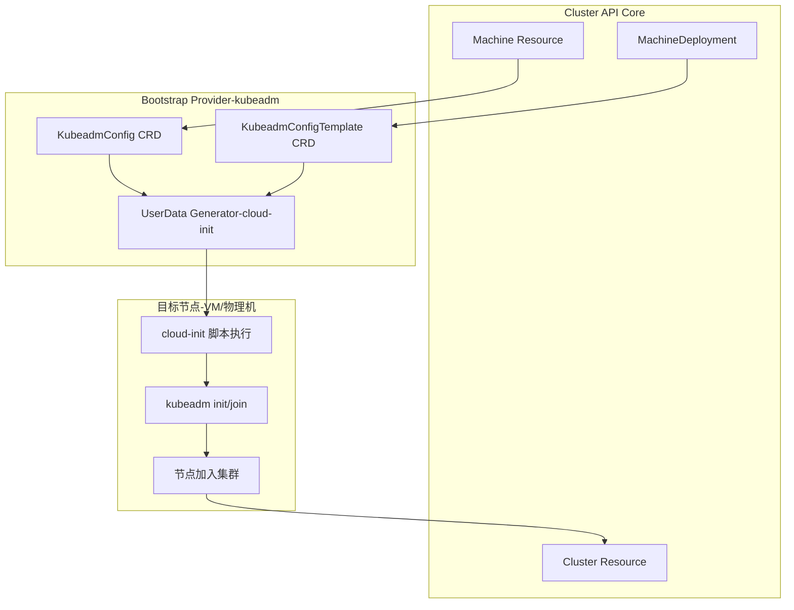

# kubeadmconfig
在 **kubeadm** 的上下文里，`kubectl get kubeadmconfig` 并不是一个标准的 Kubernetes API 资源命令。原因是：
## 📌 为什么会出现这个命令
- **Cluster API 集成**：在使用 Cluster API (CAPI) 时，kubeadm 的配置会被封装成一个 CRD —— **KubeadmConfig**。  
- **资源定义**：`KubeadmConfig` 属于 `bootstrap.cluster.x-k8s.io` API 组，用来描述节点的引导配置（cloud-init/userData），例如 kubeadm init/join 的参数。  
- **用途**：通过 `kubectl get kubeadmconfig` 可以查看集群中所有的 kubeadm 引导配置对象。
## 🔑 KubeadmConfig 的作用
- **封装 kubeadm 配置**：把 `kubeadm init` 或 `kubeadm join` 的参数声明为 Kubernetes 资源。  
- **自动生成 UserData**：Cluster API 的 Bootstrap Provider 会读取 `KubeadmConfig`，生成 cloud-init 脚本，注入到节点。  
- **支持版本管理**：不同节点可以引用不同的 `KubeadmConfig`，实现灵活的控制平面和工作节点配置。  
- **与 KubeadmConfigTemplate 配合**：用于 MachineDeployment，批量生成一致的配置。
## 📊 示例
```yaml
apiVersion: bootstrap.cluster.x-k8s.io/v1beta1
kind: KubeadmConfig
metadata:
  name: cp-init
spec:
  initConfiguration:
    nodeRegistration:
      kubeletExtraArgs:
        cloud-provider: aws
  clusterConfiguration:
    apiServer:
      extraArgs:
        authorization-mode: Node,RBAC
```
查询命令：
```bash
kubectl get kubeadmconfig
```
输出类似：
```
NAME        AGE
cp-init     10m
worker-join 5m
```
## ✅ 总结
- 在 **纯 kubeadm** 环境下，`kubectl get kubeadmconfig` 不存在。  
- 在 **Cluster API + kubeadm bootstrap provider** 环境下，`KubeadmConfig` 是一个 CRD，用来声明和管理 kubeadm 的初始化/加入配置。  
- 它是 **Bootstrap Provider** 的核心资源，负责把 kubeadm 配置转化为节点的引导脚本。  
## 架构图
展示 `KubeadmConfig` 在 Cluster API 中的作用：它如何被 **Bootstrap Provider** 使用，生成节点的 cloud-init 配置并驱动集群初始化。

### 图解说明
- **Cluster API Core**：定义集群、机器、部署等核心资源。  
- **KubeadmConfig / KubeadmConfigTemplate**：声明 kubeadm 的初始化/加入配置。  
- **Bootstrap Provider**：读取这些配置，生成 cloud-init UserData。  
- **目标节点**：在节点启动时执行 cloud-init 脚本，运行 `kubeadm init` 或 `kubeadm join`，完成集群初始化。  
- **最终结果**：节点成功加入集群，形成完整的控制平面或工作节点。  
### 业务价值
- **声明式管理**：kubeadm 配置以 CRD 形式存在，便于版本控制与审计。  
- **自动化引导**：Bootstrap Provider 自动生成 cloud-init，减少人工操作。  
- **灵活扩展**：不同节点可引用不同的 KubeadmConfig，实现差异化配置。  
- **与 Cluster API 集成**：统一在 Kubernetes API 下管理集群生命周期。  

这样你就能直观理解：**KubeadmConfig 是 Cluster API Bootstrap Provider 的核心资源，它负责把声明式配置转化为节点的 cloud-init 脚本，从而驱动 kubeadm 初始化和节点加入集群。**
