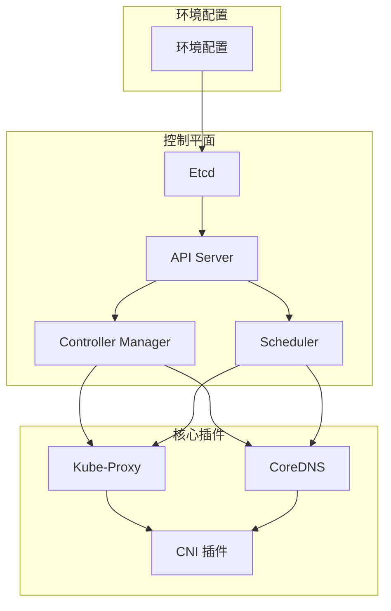
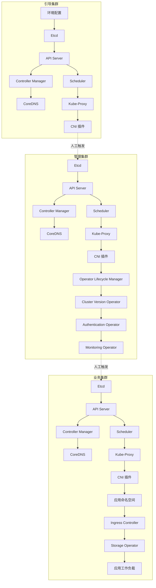

# 把 **kubeadm 的安装流程**重构为 **声明式、可编排的 DAG（有向无环图）**
可以的，把 **kubeadm 的安装流程**重构为 **声明式、可编排的 DAG（有向无环图）**，能够实现并行安装和依赖控制。下面给你一个完整的实现思路和样例设计。

## 📑 实现思路
1. **声明式配置**  
   - 使用 YAML/CRD 定义安装目标（环境配置、etcd、apiserver、controller-manager、scheduler、coredns、kube-proxy、CNI）。  
   - 每个组件定义自身的依赖关系和安装动作。
2. **DAG 编排**  
   - 把安装步骤建模为 DAG 节点。  
   - 节点之间通过依赖关系连接，保证顺序正确。  
   - DAG 引擎（如 Argo Workflows、Airflow、或自定义控制器）负责调度执行。  
3. **并行执行**  
   - DAG 中没有依赖关系的节点可以并行执行，例如：  
     - `coredns` 和 `kube-proxy` 可以在控制平面完成后并行安装。  
     - `CNI` 插件可以在 kube-proxy 部署后并行。  
4. **状态回写**  
   - 每个节点执行完成后更新状态（成功/失败）。  
   - DAG 引擎根据状态决定是否继续执行后续节点。  
## ⚙️ 样例 DAG 设计（Mermaid）

## 📊 样例声明式 YAML（简化版）
```yaml
apiVersion: kubeadm.workflow/v1alpha1
kind: InstallPlan
metadata:
  name: kubeadm-dag-install
spec:
  steps:
    - name: env-setup
      action: shell
      command: ./scripts/env_setup.sh
      dependsOn: []

    - name: etcd
      action: kubeadm
      command: kubeadm init phase etcd local
      dependsOn: [env-setup]

    - name: apiserver
      action: kubeadm
      command: kubeadm init phase control-plane apiserver
      dependsOn: [etcd]

    - name: controller-manager
      action: kubeadm
      command: kubeadm init phase control-plane controller-manager
      dependsOn: [apiserver]

    - name: scheduler
      action: kubeadm
      command: kubeadm init phase control-plane scheduler
      dependsOn: [apiserver]

    - name: coredns
      action: kubeadm
      command: kubeadm init phase addon coredns
      dependsOn: [controller-manager, scheduler]

    - name: kube-proxy
      action: kubeadm
      command: kubeadm init phase addon kube-proxy
      dependsOn: [controller-manager, scheduler]

    - name: cni
      action: shell
      command: ./scripts/install_cni.sh
      dependsOn: [coredns, kube-proxy]
```
## ✅ 总结
- **声明式配置**：用 YAML/CRD 定义安装步骤和依赖。  
- **DAG 编排**：保证顺序正确，支持并行执行。  
- **可扩展性**：可以用 Argo Workflows、Airflow 或自定义控制器来执行 DAG。  
- **优势**：安装过程可审计、可重试、可并行，完全声明式。  

#  OpenShift Installer 的安装流程声明式化，并用 **DAG 编排**实现依赖控制和人工触发机制
好的，我们来设计一个 **完整的重构方案**，把 OpenShift Installer 的安装流程声明式化，并用 **DAG 编排**实现依赖控制和人工触发机制。这里特别强调：**管理集群和业务集群也需要安装各自的 Kubernetes 控制面**，并且安装流程是 **分阶段人工触发**的。
## 📑 总体设计原则
1. **分层集群**  
   - **引导集群（Bootstrap Cluster）**：最小化控制面，用于拉起管理集群。  
   - **管理集群（Management Cluster）**：完整控制面 + Operator 管理能力。  
   - **业务集群（Workload Cluster）**：完整控制面 + 应用工作负载。  
2. **声明式 DAG**  
   - 每个集群的安装步骤建模为 DAG 节点。  
   - 节点之间通过 `dependsOn` 定义依赖关系。  
   - DAG 引擎负责调度，支持并行执行。  
3. **人工触发机制**  
   - 引导集群安装完成后，**人工确认**才能触发管理集群安装。  
   - 管理集群安装完成后，**人工确认**才能触发业务集群安装。  
   - 通过 CRD 字段或 Workflow 参数控制触发。  
## ⚙️ DAG 结构示例（Mermaid）

## 📊 声明式 YAML 样例（简化版）
```yaml
apiVersion: openshift.workflow/v1alpha1
kind: InstallPlan
metadata:
  name: openshift-dag-install
spec:
  phases:
    - name: bootstrap
      autoStart: true
      steps:
        - name: etcd-bootstrap
          command: openshift-install create etcd
        - name: apiserver-bootstrap
          command: openshift-install create apiserver
          dependsOn: [etcd-bootstrap]
        - name: controller-bootstrap
          command: openshift-install create controller-manager
          dependsOn: [apiserver-bootstrap]
        - name: scheduler-bootstrap
          command: openshift-install create scheduler
          dependsOn: [apiserver-bootstrap]
        - name: coredns-bootstrap
          command: openshift-install create coredns
          dependsOn: [controller-bootstrap, scheduler-bootstrap]
        - name: kube-proxy-bootstrap
          command: openshift-install create kube-proxy
          dependsOn: [controller-bootstrap, scheduler-bootstrap]
        - name: cni-bootstrap
          command: ./scripts/install_cni.sh
          dependsOn: [coredns-bootstrap, kube-proxy-bootstrap]

    - name: management
      autoStart: false   # 需要人工触发
      steps:
        - name: etcd-management
          command: openshift-install create etcd
        - name: apiserver-management
          command: openshift-install create apiserver
          dependsOn: [etcd-management]
        - name: controller-management
          command: openshift-install create controller-manager
          dependsOn: [apiserver-management]
        - name: scheduler-management
          command: openshift-install create scheduler
          dependsOn: [apiserver-management]
        - name: coredns-management
          command: openshift-install create coredns
          dependsOn: [controller-management, scheduler-management]
        - name: kube-proxy-management
          command: openshift-install create kube-proxy
          dependsOn: [controller-management, scheduler-management]
        - name: cni-management
          command: ./scripts/install_cni.sh
          dependsOn: [coredns-management, kube-proxy-management]
        - name: olm
          command: openshift-install create olm
          dependsOn: [cni-management]
        - name: cvo
          command: openshift-install create cvo
          dependsOn: [olm]
        - name: auth
          command: openshift-install create auth
          dependsOn: [cvo]
        - name: monitor
          command: openshift-install create monitoring
          dependsOn: [auth]

    - name: workload
      autoStart: false   # 需要人工触发
      steps:
        - name: etcd-workload
          command: openshift-install create etcd
        - name: apiserver-workload
          command: openshift-install create apiserver
          dependsOn: [etcd-workload]
        - name: controller-workload
          command: openshift-install create controller-manager
          dependsOn: [apiserver-workload]
        - name: scheduler-workload
          command: openshift-install create scheduler
          dependsOn: [apiserver-workload]
        - name: coredns-workload
          command: openshift-install create coredns
          dependsOn: [controller-workload, scheduler-workload]
        - name: kube-proxy-workload
          command: openshift-install create kube-proxy
          dependsOn: [controller-workload, scheduler-workload]
        - name: cni-workload
          command: ./scripts/install_cni.sh
          dependsOn: [coredns-workload, kube-proxy-workload]
        - name: workload-ns
          command: kubectl create ns workloads
          dependsOn: [cni-workload]
        - name: ingress
          command: openshift-install create ingress
          dependsOn: [workload-ns]
        - name: storage
          command: openshift-install create storage
          dependsOn: [workload-ns]
        - name: workload
          command: kubectl apply -f workloads.yaml
          dependsOn: [ingress, storage]
```
## ✅ 总结
- **三层集群**：引导 → 管理 → 业务，每层都有完整的 K8s 控制面。  
- **人工触发机制**：引导集群完成后人工触发管理集群，管理集群完成后人工触发业务集群。  
- **声明式 DAG**：每个步骤定义依赖，支持并行执行。  
- **可编排性**：可用 Argo Workflows 或自定义控制器执行 DAG，实现自动化和可审计。  
