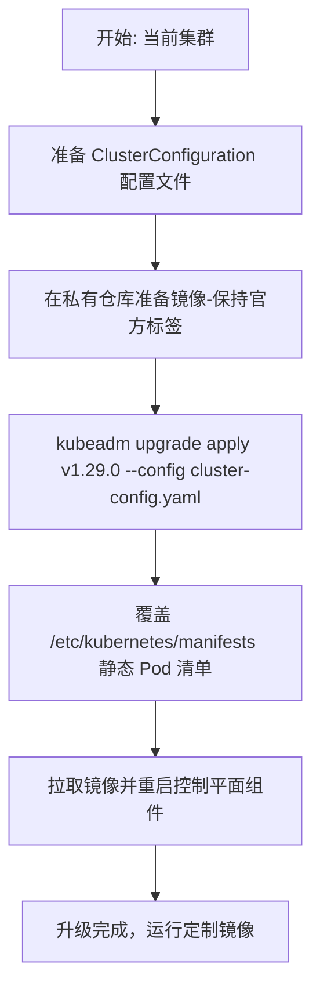

# kubeadm组件定制方案
下面我为你整理一个 **完整的方案输出**，涵盖对照表、设计思路、样例配置、版本兼容机制，并附上流程图，帮助你系统化掌握 **kubeadm 控制平面组件的升级与自定义镜像策略**。  
## 📑 设计思路
1. **保持 kubeadm 升级流程完整性**：不要直接修改镜像标签，而是通过配置文件或私有仓库替换镜像内容。  
2. **分层管理**：控制平面组件（apiserver、controller-manager、scheduler、etcd）由 kubeadm 管理；kubelet/kubectl 通过包管理器独立升级。  
3. **版本兼容机制**：  
   - kubeadm 与 kubelet/kubectl 必须保持在 **3 个小版本以内的兼容范围**。  
   - 控制平面组件必须与目标 Kubernetes 版本严格匹配，否则可能导致 API 不兼容。  
   - 推荐使用私有仓库镜像替换，保持标签一致（如 `v1.29.0`），避免破坏升级逻辑。  
## 📊 组件升级与自定义镜像策略对照表
| 组件 | 默认运行方式 | 升级方式 | 自定义镜像策略 |
|------|--------------|----------|----------------|
| **kube-apiserver** | 静态 Pod (`/etc/kubernetes/manifests/kube-apiserver.yaml`) | `kubeadm upgrade apply <version>` 自动更新镜像与清单 | 在 `ClusterConfiguration` 中指定 `imageRepository`，保持标签一致；或升级后手动修改清单 |
| **kube-controller-manager** | 静态 Pod (`/etc/kubernetes/manifests/kube-controller-manager.yaml`) | 同上，由 `kubeadm upgrade` 管理 | 同上，推荐通过私有仓库替换镜像内容而非改标签 |
| **kube-scheduler** | 静态 Pod (`/etc/kubernetes/manifests/kube-scheduler.yaml`) | 同上，由 `kubeadm upgrade` 管理 | 同上，保持标签一致，仓库可自定义 |
| **etcd** | 静态 Pod (`/etc/kubernetes/manifests/etcd.yaml`) | `kubeadm upgrade` 更新内置 etcd 镜像版本 | 在配置文件中指定镜像仓库；如使用外部 etcd，需手动管理 |
| **kubelet** | 系统服务（包管理器安装） | 手动升级：`apt/yum install kubelet=<version>`，需与 kubeadm 版本兼容 | 无镜像，版本通过包管理器控制 |
| **kubectl** | 命令行工具（包管理器安装） | 手动升级：`apt/yum install kubectl=<version>`，需与 kubeadm 版本兼容 | 无镜像，版本通过包管理器控制 |
## 📑 样例配置文件（ClusterConfiguration）
```yaml
apiVersion: kubeadm.k8s.io/v1beta3
kind: ClusterConfiguration
kubernetesVersion: v1.29.0
imageRepository: myregistry.local/k8s
controlPlaneEndpoint: "mycluster.example.com:6443"
```
- **kubernetesVersion**：指定目标版本。  
- **imageRepository**：替换镜像仓库地址（例如私有仓库）。  
- 镜像标签保持与官方一致（如 `v1.29.0`），但仓库内容可定制。  
## 📈 升级流程图（Mermaid）
```mermaid
flowchart TD
    A[开始: 当前集群] --> B[准备 ClusterConfiguration 配置文件]
    B --> C[在私有仓库准备镜像 (保持官方标签)]
    C --> D[kubeadm upgrade apply <version> --config cluster-config.yaml]
    D --> E[覆盖 /etc/kubernetes/manifests 静态 Pod 清单]
    E --> F[拉取镜像并重启控制平面组件]
    F --> G{是否需要进一步定制?}
    G -->|是| H[手动修改静态 Pod 清单镜像标签]
    G -->|否| I[升级完成]
    H --> I[升级完成]
    I --> J[单独升级 kubelet/kubectl (包管理器)]
    J --> K[集群升级完成]
```
## ✅ 总结
- **控制平面组件**：通过 `ClusterConfiguration` 指定镜像仓库，保持标签一致。  
- **kubelet/kubectl**：必须通过包管理器升级，保持与 kubeadm 兼容。  
- **最佳实践**：使用私有仓库替换镜像内容，而不是改标签，确保 `kubeadm upgrade` 流程不被破坏。  

这样，你就有一个 **完整的、可操作的方案**，既能保持 kubeadm 的升级流程，又能灵活使用自定义镜像。  

# 语义化版本匹配机制
**kubeadm 在升级时对镜像标签的检查是基于严格的语义化版本匹配机制，必须符合 `vX.Y.Z` 格式；它不会接受 `v1.29.0-ofep` 这样的扩展标签。最佳实践是保持标签与官方一致（如 `v1.29.0`），仓库可定制，镜像内容可定制。**
## 📑 版本号匹配的实现逻辑
- **语义化版本检查**：kubeadm 使用 Kubernetes 的 version skew policy [(github.com in Bing)](https://www.bing.com/search?q="https%3A%2F%2Fgithub.com%2Fkubernetes%2Fkubernetes%2Fblob%2Fmaster%2FCHANGELOG%2FREADME.md") 来确保兼容性。它会解析 `ClusterConfiguration.kubernetesVersion` 并生成静态 Pod 清单。  
- **代码位置**：在 `kubernetes/kubernetes` 仓库的 `cmd/kubeadm/app/util/version.go` 和 `constants.go` 中，定义了版本解析与校验逻辑。  
  - `kubernetesVersion` 字段必须符合 `vX.Y.Z`。  
  - kubeadm 会调用 `semver.Parse()` 来验证版本号。  
- **升级流程**：`kubeadm upgrade apply` 会检查目标版本与当前版本是否兼容，并拒绝非标准标签。  
## ⚠️ 关于扩展标签（如 `v1.29.0-ofep`）
- kubeadm **不支持**这种标签，因为它无法通过语义化版本解析。  
- 如果强行使用，会导致：
  - `kubeadm upgrade` 报错，无法识别版本。  
  - 静态 Pod 清单与 `ClusterConfiguration.kubernetesVersion` 不匹配。  
  - 集群可能出现 API 不兼容或升级失败。  
## 📊 推荐方案
- **保持标签一致**：例如 `v1.29.0`。  
- **仓库可定制**：通过 `imageRepository` 指向私有仓库。  
- **镜像内容可定制**：在私有仓库中构建你需要的镜像，但标签必须与官方版本一致。  
- **升级流程**：  
  ```bash
  kubeadm upgrade apply v1.29.0 --config cluster-config.yaml
  ```
  - kubeadm 会拉取 `myregistry.local/k8s/kube-apiserver:v1.29.0` 等镜像。  
  - 实际运行的是你定制过的镜像，但标签与官方保持一致。  
## 📈 升级流程图（Mermaid）

## ✅ 总结
- **版本号检查代码在 kubeadm 的 util/version.go 与 constants.go 中，基于语义化版本解析。**  
- **不支持扩展标签（如 `v1.29.0-ofep`），必须使用标准 `vX.Y.Z` 格式。**  
- **最佳实践**：保持标签一致，仓库可定制，镜像内容可定制。  
