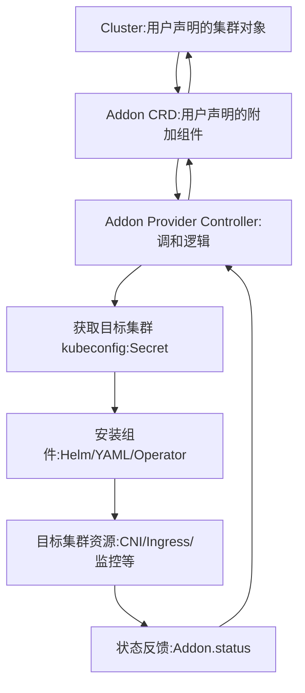

# cluster-api中的Addon Provider与ClusterResourceSet
在 **Cluster API** 中，针对集群附加组件（addons）的管理有两种主要方案：**Addon Provider** 和 **ClusterResourceSet**。它们的目标都是在集群创建后自动安装和管理额外的组件（如 CNI 插件、监控、日志、Ingress 控制器等），但实现方式不同。  
## 📌 Addon Provider
- **定义**：Addon Provider 是一个专门的控制器，用来管理集群的附加组件。  
- **工作方式**：
  - 提供 CRD（如 `Addon`、`AddonConfiguration`），描述需要安装的组件。  
  - 控制器监听这些 CRD，并在目标集群中应用相应的资源（通常通过 Helm、YAML manifests 或 Operator）。  
- **特点**：
  - 更加灵活，可以支持复杂的安装逻辑（版本管理、依赖关系、升级策略）。  
  - 适合需要长期维护和升级的组件。  
- **场景**：
  - 企业环境中需要统一管理多个集群的组件。  
  - 需要对组件进行版本控制和生命周期管理。  
## 📊 ClusterResourceSet
- **定义**：ClusterResourceSet 是 Cluster API 内置的一种机制，用来在集群创建时自动应用一组 Kubernetes 资源。  
- **工作方式**：
  - 用户定义一个 `ClusterResourceSet` 对象，其中包含 ConfigMap 或 Secret 引用。  
  - 当新的 Cluster/Machine 被创建时，ClusterResourceSet Controller 会自动将这些资源应用到目标集群。  
- **特点**：
  - 简单直接，适合一次性安装或轻量级组件。  
  - 不具备复杂的版本管理和升级逻辑。  
- **场景**：
  - 在集群初始化时自动安装 CNI 插件（如 Calico、Cilium）。  
  - 部署一些静态的 YAML 资源（RBAC、命名空间、基础配置）。  
## ⚖️ 对比总结
| 维度 | **Addon Provider** | **ClusterResourceSet** |
|------|--------------------|-------------------------|
| **复杂度** | 高，支持版本管理和升级 | 低，简单应用资源 |
| **适用场景** | 长期维护的组件（监控、Ingress、存储插件） | 一次性安装的基础资源（CNI、RBAC） |
| **实现方式** | 独立控制器 + CRD | Cluster API 内置机制 |
| **灵活性** | 高，可扩展 | 中等，主要依赖 ConfigMap/Secret |

✅ **总结**：  
- **ClusterResourceSet** 更像是一个“开箱即用”的轻量机制，适合在集群创建时自动打包基础资源。  
- **Addon Provider** 则是一个更专业的解决方案，适合需要长期维护、升级和版本控制的组件。  

# Addon Provider实现后如何由cluster-api调用与集成
在 **Cluster API** 中，Addon Provider 并不是内置的，而是一个独立的 Provider。它的集成方式是通过 **CRD + Controller** 的模式与 Cluster API 框架打通。下面我给你一个完整的说明，包括样例和执行路径。  
## 📌 集成机制
1. **定义 Addon CRD**  
   - Addon Provider需要定义自己的 CRD（如 `Addon`、`AddonConfiguration`），描述需要安装的组件。  
   - 例如：CNI 插件、Ingress Controller、监控工具。  
2. **Cluster 引用 Addon**  
   - 在 `Cluster` 对象中，用户通过 `spec` 或额外的引用字段声明需要的 Addon。  
   - Addon Provider Controller 监听这些 CRD，并与 Cluster 生命周期绑定。  
3. **Controller 调和逻辑**  
   - 当 Cluster 创建或更新时，Addon Provider Controller 会：  
     - 读取 Addon CRD 配置。  
     - 获取目标集群的 kubeconfig（Cluster API 会生成并存储在 Secret 中）。  
     - 在目标集群中安装或更新组件（通过 Helm、YAML manifests 或 Operator）。  
4. **状态反馈**  
   - Addon Provider 更新 Addon CRD 的 `status` 字段，标记组件是否安装成功、版本号、错误信息。  
   - 用户或 Cluster API 上层控制器可以通过查询 Addon CRD 来了解组件状态。  
## 📊 样例 YAML
**Cluster 对象：**
```yaml
apiVersion: cluster.x-k8s.io/v1beta1
kind: Cluster
metadata:
  name: demo-cluster
spec:
  infrastructureRef:
    apiVersion: infrastructure.cluster.x-k8s.io/v1beta1
    kind: DockerCluster
    name: demo-cluster-infra
  addons:
    - apiVersion: addons.cluster.x-k8s.io/v1beta1
      kind: Addon
      name: cni-addon
```
**Addon 对象：**
```yaml
apiVersion: addons.cluster.x-k8s.io/v1beta1
kind: Addon
metadata:
  name: cni-addon
spec:
  clusterName: demo-cluster
  source:
    helm:
      chart: cilium
      version: 1.15.0
      repo: https://helm.cilium.io/
```
## 📌 执行路径（完整链路）
1. **用户创建 Cluster** → 引用 Addon。  
2. **Cluster API 控制器** → 创建基础设施集群（如 DockerCluster）。  
3. **Addon Provider Controller** → 监听 Addon CRD，获取目标集群 kubeconfig。  
4. **Addon Provider Controller** → 在目标集群安装 CNI 插件（通过 Helm）。  
5. **Addon Provider 更新状态** → 将安装结果写入 Addon CRD 的 `status`。  
6. **用户查询 Addon 状态** → 确认组件已安装并运行。  

✅ **总结**：  
Addon Provider通过 **CRD + Controller** 与 Cluster API 集成，用户只需在 Cluster 中声明需要的 Addon，控制器就会自动在目标集群安装并维护这些组件，形成一个完整的闭环：  

**Cluster → Addon CRD → Addon Provider Controller → 集群组件安装 → 状态反馈**。  
## 架构图
直观展示 Addon Provider 在 Cluster API 中的执行路径：  

📌 图解说明
1. **Cluster**  
   - 用户创建的顶层对象，声明集群期望状态。  
2. **Addon CRD**  
   - 用户在 Cluster 中引用 Addon，描述需要安装的组件（如 CNI 插件）。  
3. **Addon Provider Controller**  
   - 监听 Addon CRD 的变化。  
   - 获取目标集群的 kubeconfig。  
   - 执行安装逻辑（Helm、YAML、Operator）。  
4. **目标集群资源**  
   - 实际安装的组件，如 CNI、Ingress Controller、监控工具。  
5. **状态反馈**  
   - Addon Provider 将安装结果写入 Addon CRD 的 `status` 字段。  
   - 用户或 Cluster API 上层控制器查询 Addon 状态。  

✅ **总结**：  
Addon Provider 的集成路径是：  
**Cluster → Addon CRD → Addon Provider Controller → 获取 kubeconfig → 安装组件 → 状态反馈 → Addon CRD → Cluster**。  

这样，用户只需在 Cluster 中声明需要的 Addon，控制器就能自动在目标集群安装并维护这些组件，形成完整闭环。  
## 执行样例 YAML + 状态反馈结果
展示 Addon 安装成功后 `Addon.status` 的典型字段。  
### 📌 样例 YAML
**Cluster 对象：**
```yaml
apiVersion: cluster.x-k8s.io/v1beta1
kind: Cluster
metadata:
  name: demo-cluster
spec:
  infrastructureRef:
    apiVersion: infrastructure.cluster.x-k8s.io/v1beta1
    kind: DockerCluster
    name: demo-cluster-infra
  addons:
    - apiVersion: addons.cluster.x-k8s.io/v1beta1
      kind: Addon
      name: cni-addon
```
**Addon 对象：**
```yaml
apiVersion: addons.cluster.x-k8s.io/v1beta1
kind: Addon
metadata:
  name: cni-addon
spec:
  clusterName: demo-cluster
  source:
    helm:
      chart: cilium
      version: 1.15.0
      repo: https://helm.cilium.io/
```
### 📊 状态反馈结果（Addon.status）
当 Addon Provider 成功安装组件后，`Addon.status` 可能会更新为类似下面的内容：
```yaml
status:
  phase: Installed
  observedGeneration: 2
  conditions:
    - type: Ready
      status: "True"
      lastTransitionTime: "2026-04-10T11:00:00Z"
      reason: ComponentsInstalled
      message: "Cilium CNI v1.15.0 successfully installed"
    - type: Error
      status: "False"
      lastTransitionTime: "2026-04-10T11:00:00Z"
  installedVersion: "1.15.0"
  lastAppliedRevision: "helm/cilium-1.15.0"
  clusterRef:
    name: demo-cluster
    namespace: default
```
 📌 字段说明
- **phase**：当前阶段（如 Pending、Installing、Installed、Failed）。  
- **conditions**：组件安装的状态条件（Ready/NotReady/Error）。  
- **installedVersion**：实际安装的版本号。  
- **lastAppliedRevision**：最后一次应用的资源版本（便于升级/回滚）。  
- **clusterRef**：指向目标 Cluster。  

✅ **总结**：  
用户只需在 Cluster 中声明 Addon，Addon Provider Controller 会自动安装组件，并在 `Addon.status` 中反馈安装结果。这样用户可以通过查询 Addon CRD 的状态来确认组件是否安装成功、版本号是否正确。  

# Cluster API Addon管理方案开发指南
## 一、方案对比总览
### 1.1 核心差异
| 维度 | ClusterResourceSet | Addon Provider |
|------|-------------------|----------------|
| **复杂度** | 低（内置功能） | 高（需自定义开发） |
| **时序控制** | ❌ 无 | ✅ 完整支持 |
| **状态管理** | ⚠️ 基础 | ✅ 完善 |
| **依赖管理** | ❌ 无 | ✅ 支持 |
| **错误处理** | ⚠️ 简单 | ✅ 可定制 |
| **配置灵活性** | ⚠️ 静态资源 | ✅ 动态生成 |
| **适用场景** | 简单、静态Addon | 复杂、动态Addon |
### 1.2 选择建议
```
选择ClusterResourceSet的场景：
├─ Addon配置固定，无需动态生成
├─ 不需要严格的安装顺序
├─ 快速原型开发
└─ 简单的Dev/Test环境

选择Addon Provider的场景：
├─ 需要时序控制（如CNI必须在CSI前安装）
├─ 需要根据集群状态动态生成配置
├─ 需要复杂的状态管理和错误处理
├─ 生产环境要求高可靠性
└─ 需要支持多种Addon类型和版本
```
## 二、ClusterResourceSet方案开发指南
### 2.1 架构理解
```
ClusterResourceSet工作流程：
┌──────────────┐
│   Cluster    │ ──创建──> 触发Reconcile
└──────────────┘
       │
       ▼
┌──────────────────────┐
│ ClusterResourceSet   │
│ Controller           │
└──────────────────────┘
       │
       ├─ 匹配Cluster标签
       │
       ├─ 读取资源列表
       │
       └─ 应用到目标集群
              │
              ▼
       ┌──────────────┐
       │ 目标集群资源  │
       └──────────────┘
```
### 2.2 CRD定义（内置）
ClusterResourceSet是Cluster API内置的CRD，无需自定义：
```yaml
apiVersion: addons.cluster.x-k8s.io/v1beta1
kind: ClusterResourceSet
metadata:
  name: my-addons
  namespace: default
spec:
  clusterSelector:
    matchLabels:
      cluster.x-k8s.io/cluster-name: my-cluster
  resources:
  - kind: ConfigMap
    name: calico-cni
  - kind: ConfigMap
    name: aws-ebs-csi
```
### 2.3 开发步骤
#### 步骤1：准备Addon资源
```yaml
apiVersion: v1
kind: ConfigMap
metadata:
  name: calico-cni
  namespace: default
data:
  calico.yaml: |
    # Calico完整Manifest
    apiVersion: v1
    kind: Namespace
    metadata:
      name: kube-system
    ---
    apiVersion: apps/v1
    kind: DaemonSet
    metadata:
      name: calico-node
      namespace: kube-system
    spec:
      # ... Calico配置
```
#### 步骤2：创建ClusterResourceSet
```yaml
apiVersion: addons.cluster.x-k8s.io/v1beta1
kind: ClusterResourceSet
metadata:
  name: production-addons
spec:
  clusterSelector:
    matchLabels:
      environment: production
  resources:
  - kind: ConfigMap
    name: calico-cni
  - kind: ConfigMap
    name: aws-ebs-csi
  - kind: Secret
    name: csi-credentials
```
#### 步骤3：为Cluster打标签
```yaml
apiVersion: cluster.x-k8s.io/v1beta1
kind: Cluster
metadata:
  name: my-cluster
  labels:
    environment: production
spec:
  # ... 集群配置
```
### 2.4 高级用法
#### 动态资源生成
使用Kustomize或Helm生成资源：
```bash
# 使用Kustomize生成ConfigMap
kustomize build ./addons/calico | kubectl create configmap calico-cni --from-file=calico.yaml=/dev/stdin -o yaml --dry-run=client > calico-configmap.yaml

# 使用Helm生成Manifest
helm template calico tigera-operator --repo https://projectcalico.docs.tigera.io/charts > calico-manifest.yaml
kubectl create configmap calico-cni --from-file=calico.yaml=calico-manifest.yaml -o yaml --dry-run=client > calico-configmap.yaml
```
#### 使用Secret存储敏感信息
``yaml
apiVersion: v1
kind: Secret
metadata:
  name: csi-credentials
  namespace: default
type: Opaque
stringData:
  credentials.yaml: |
    apiVersion: v1
    kind: Secret
    metadata:
      name: aws-secret
      namespace: kube-system
    type: Opaque
    data:
      key_id: <base64-encoded>
      access_key: <base64-encoded>
```
### 2.5 最佳实践
#### 实践1：按环境分离
```yaml
# 开发环境
apiVersion: addons.cluster.x-k8s.io/v1beta1
kind: ClusterResourceSet
metadata:
  name: dev-addons
spec:
  clusterSelector:
    matchLabels:
      environment: dev
  resources:
  - kind: ConfigMap
    name: calico-cni-dev

---
# 生产环境
apiVersion: addons.cluster.x-k8s.io/v1beta1
kind: ClusterResourceSet
metadata:
  name: prod-addons
spec:
  clusterSelector:
    matchLabels:
      environment: prod
  resources:
  - kind: ConfigMap
    name: calico-cni-prod
```
#### 实践2：模块化管理
```yaml
# CNI模块
apiVersion: addons.cluster.x-k8s.io/v1beta1
kind: ClusterResourceSet
metadata:
  name: cni-addons
spec:
  clusterSelector:
    matchLabels:
      cni: calico
  resources:
  - kind: ConfigMap
    name: calico-cni
---
# CSI模块
apiVersion: addons.cluster.x-k8s.io/v1beta1
kind: ClusterResourceSet
metadata:
  name: csi-addons
spec:
  clusterSelector:
    matchLabels:
      csi: aws-ebs
  resources:
  - kind: ConfigMap
    name: aws-ebs-csi
```
#### 实践3：版本管理
```yaml
apiVersion: v1
kind: ConfigMap
metadata:
  name: calico-cni-v3.26
  namespace: default
  labels:
    addon: calico
    version: "3.26"
data:
  calico.yaml: |
    # Calico v3.26 Manifest
```
### 2.6 限制与注意事项
**限制**：
1. **无时序控制**：所有资源同时应用，无法保证顺序
2. **无状态验证**：不检查资源是否成功创建
3. **无依赖管理**：不处理资源间的依赖关系
4. **配置固定**：资源内容在创建时固定，无法动态调整

**注意事项**：
1. 资源必须是Cluster级别的（不依赖特定命名空间）
2. 资源更新不会自动应用到已创建的集群
3. 删除ClusterResourceSet不会删除已应用的资源
## 三、Addon Provider方案开发指南
### 3.1 架构设计
```
Addon Provider架构：
┌─────────────────────────────────────────┐
│         Management Cluster               │
│  ┌────────────────────────────────────┐ │
│  │   Addon Controller                 │ │
│  │   ┌──────────────────────────────┐ │ │
│  │   │  Reconcile Loop              │ │ │
│  │   │  ├─ 依赖检查                 │ │ │
│  │   │  ├─ 配置渲染                 │ │ │
│  │   │  ├─ 资源应用                 │ │ │
│  │   │  └─ 状态验证                 │ │ │
│  │   └──────────────────────────────┘ │ │
│  └────────────────────────────────────┘ │
│              │                           │
│              ▼                           │
│  ┌────────────────────────────────────┐ │
│  │   CRD Resources                    │ │
│  │   ├─ ClusterAddon                  │ │
│  │   ├─ CNIConfig                     │ │
│  │   └─ CSIConfig                     │ │
│  └────────────────────────────────────┘ │
└─────────────────────────────────────────┘
              │
              │ 连接目标集群
              ▼
┌─────────────────────────────────────────┐
│         Workload Cluster                 │
│  ┌────────────────────────────────────┐ │
│  │   Addon Resources                  │ │
│  │   ├─ CNI Pods                      │ │
│  │   └─ CSI Pods                      │ │
│  └────────────────────────────────────┘ │
└─────────────────────────────────────────┘
```
### 3.2 开发步骤
#### 步骤1：定义CRD
```yaml
apiVersion: apiextensions.k8s.io/v1
kind: CustomResourceDefinition
metadata:
  name: clusteraddons.addons.cluster.x-k8s.io
spec:
  group: addons.cluster.x-k8s.io
  versions:
  - name: v1beta1
    served: true
    storage: true
    schema:
      openAPIV3Schema:
        type: object
        properties:
          spec:
            type: object
            properties:
              clusterRef:
                type: object
                properties:
                  name:
                    type: string
                  namespace:
                    type: string
              cni:
                type: object
                properties:
                  enabled:
                    type: boolean
                  type:
                    type: string
                  version:
                    type: string
                  config:
                    type: object
                    x-kubernetes-preserve-unknown-fields: true
              csi:
                type: object
                properties:
                  enabled:
                    type: boolean
                  type:
                    type: string
                  version:
                    type: string
                  config:
                    type: object
                    x-kubernetes-preserve-unknown-fields: true
          status:
            type: object
            properties:
              phase:
                type: string
              cniReady:
                type: boolean
              csiReady:
                type: boolean
              conditions:
                type: array
                items:
                  type: object
                  properties:
                    type:
                      type: string
                    status:
                      type: string
                    reason:
                      type: string
                    message:
                      type: string
```
#### 步骤2：实现控制器
**项目结构**：
```
addon-provider/
├── api/
│   └── v1beta1/
│       ├── groupversion_info.go
│       ├── clusteraddon_types.go
│       └── zz_generated.deepcopy.go
├── controllers/
│   ├── clusteraddon_controller.go
│   ├── cni_installer.go
│   └── csi_installer.go
├── pkg/
│   ├── installer/
│   │   ├── interface.go
│   │   ├── helm.go
│   │   └── manifest.go
│   └── dependency/
│       └── checker.go
├── main.go
└── Dockerfile
```
**核心控制器代码**：
```go
package controllers

import (
    "context"
    "time"
    
    "k8s.io/apimachinery/pkg/runtime"
    ctrl "sigs.k8s.io/controller-runtime"
    "sigs.k8s.io/controller-runtime/pkg/client"
    "sigs.k8s.io/controller-runtime/pkg/log"
    
    clusterv1 "sigs.k8s.io/cluster-api/api/v1beta1"
    addonv1beta1 "addon-provider/api/v1beta1"
)

type ClusterAddonReconciler struct {
    client.Client
    Scheme    *runtime.Scheme
    Installer *Installer
}

func (r *ClusterAddonReconciler) Reconcile(ctx context.Context, req ctrl.Request) (ctrl.Result, error) {
    logger := log.FromContext(ctx)
    
    // 1. 获取ClusterAddon资源
    addon := &addonv1beta1.ClusterAddon{}
    if err := r.Get(ctx, req.NamespacedName, addon); err != nil {
        return ctrl.Result{}, client.IgnoreNotFound(err)
    }
    
    // 2. 获取关联的Cluster
    cluster := &clusterv1.Cluster{}
    clusterKey := client.ObjectKey{
        Namespace: addon.Spec.ClusterRef.Namespace,
        Name:      addon.Spec.ClusterRef.Name,
    }
    if err := r.Get(ctx, clusterKey, cluster); err != nil {
        logger.Error(err, "failed to get cluster")
        return ctrl.Result{}, err
    }
    
    // 3. 检查集群是否就绪
    if !cluster.Status.ControlPlaneReady {
        logger.Info("waiting for control plane to be ready")
        return ctrl.Result{RequeueAfter: 10 * time.Second}, nil
    }
    
    // 4. 安装CNI
    if addon.Spec.CNI.Enabled && !addon.Status.CNIReady {
        if err := r.Installer.InstallCNI(ctx, cluster, addon); err != nil {
            logger.Error(err, "failed to install CNI")
            return ctrl.Result{}, err
        }
        addon.Status.CNIReady = true
    }
    
    // 5. 安装CSI（依赖CNI）
    if addon.Spec.CSI.Enabled && addon.Status.CNIReady && !addon.Status.CSIReady {
        if err := r.Installer.InstallCSI(ctx, cluster, addon); err != nil {
            logger.Error(err, "failed to install CSI")
            return ctrl.Result{}, err
        }
        addon.Status.CSIReady = true
    }
    
    // 6. 更新状态
    if addon.Status.CNIReady && addon.Status.CSIReady {
        addon.Status.Phase = "Ready"
    }
    
    if err := r.Status().Update(ctx, addon); err != nil {
        return ctrl.Result{}, err
    }
    
    return ctrl.Result{}, nil
}

func (r *ClusterAddonReconciler) SetupWithManager(mgr ctrl.Manager) error {
    return ctrl.NewControllerManagedBy(mgr).
        For(&addonv1beta1.ClusterAddon{}).
        Complete(r)
}
```
#### 步骤3：实现安装器
**安装器接口**：
```go
package installer

import (
    "context"
    
    clusterv1 "sigs.k8s.io/cluster-api/api/v1beta1"
)

type Installer interface {
    Install(ctx context.Context, cluster *clusterv1.Cluster, config interface{}) error
    Verify(ctx context.Context, cluster *clusterv1.Cluster, config interface{}) (bool, error)
    Uninstall(ctx context.Context, cluster *clusterv1.Cluster, config interface{}) error
}

type CNIInstaller struct {
    Client client.Client
}

func (i *CNIInstaller) Install(ctx context.Context, cluster *clusterv1.Cluster, config interface{}) error {
    // 实现CNI安装逻辑
    return nil
}
```
**Helm安装器**：
```go
package installer

import (
    "context"
    "fmt"
    
    "helm.sh/helm/v3/pkg/action"
    "helm.sh/helm/v3/pkg/cli"
    "helm.sh/helm/v3/pkg/release"
)

type HelmInstaller struct {
    Settings *cli.EnvSettings
}

func (h *HelmInstaller) Install(ctx context.Context, 
    kubeconfig string, 
    chartName string, 
    releaseName string,
    namespace string,
    values map[string]interface{}) (*release.Release, error) {
    
    actionConfig := new(action.Configuration)
    if err := actionConfig.Init(nil, namespace, "secret", func(format string, v ...interface{}) {
        fmt.Printf(format, v...)
    }); err != nil {
        return nil, err
    }
    
    install := action.NewInstall(actionConfig)
    install.ReleaseName = releaseName
    install.Namespace = namespace
    install.CreateNamespace = true
    
    chartPath, err := install.LocateChart(chartName, h.Settings)
    if err != nil {
        return nil, err
    }
    
    return install.Run(chartPath, values)
}
```
#### 步骤4：实现依赖检查器
```go
package dependency

import (
    "context"
    
    corev1 "k8s.io/api/core/v1"
    "sigs.k8s.io/controller-runtime/pkg/client"
    clusterv1 "sigs.k8s.io/cluster-api/api/v1beta1"
)

type DependencyChecker struct {
    Client client.Client
}

func (d *DependencyChecker) CheckControlPlaneReady(ctx context.Context, cluster *clusterv1.Cluster) bool {
    return cluster.Status.ControlPlaneReady
}

func (d *DependencyChecker) CheckNodesReady(ctx context.Context, minNodes int) bool {
    nodes := &corev1.NodeList{}
    if err := d.Client.List(ctx, nodes); err != nil {
        return false
    }
    
    readyCount := 0
    for _, node := range nodes.Items {
        for _, condition := range node.Status.Conditions {
            if condition.Type == corev1.NodeReady && condition.Status == corev1.ConditionTrue {
                readyCount++
                break
            }
        }
    }
    
    return readyCount >= minNodes
}

func (d *DependencyChecker) CheckCNIReady(ctx context.Context) bool {
    pods := &corev1.PodList{}
    if err := d.Client.List(ctx, pods, client.InNamespace("kube-system")); err != nil {
        return false
    }
    
    for _, pod := range pods.Items {
        if isCNIPod(pod) && pod.Status.Phase != corev1.PodRunning {
            return false
        }
    }
    
    return true
}

func isCNIPod(pod corev1.Pod) bool {
    cniNames := []string{"calico", "flannel", "cilium", "weave"}
    for _, name := range cniNames {
        if strings.Contains(pod.Name, name) {
            return true
        }
    }
    return false
}
```
#### 步骤5：构建和部署
**Dockerfile**：
```dockerfile
FROM golang:1.21 as builder

WORKDIR /workspace
COPY go.mod go.sum ./
RUN go mod download

COPY . .
RUN CGO_ENABLED=0 GOOS=linux GOARCH=amd64 go build -a -o manager main.go

FROM gcr.io/distroless/static:nonroot
WORKDIR /
COPY --from=builder /workspace/manager .
USER nonroot:nonroot
ENTRYPOINT ["/manager"]
```

**部署清单**：
```yaml
apiVersion: apps/v1
kind: Deployment
metadata:
  name: addon-provider-controller
  namespace: cluster-api-system
spec:
  replicas: 1
  selector:
    matchLabels:
      app: addon-provider
  template:
    metadata:
      labels:
        app: addon-provider
    spec:
      containers:
      - name: manager
        image: addon-provider:latest
        args:
        - --leader-elect
        env:
        - name: POD_NAMESPACE
          valueFrom:
            fieldRef:
              fieldPath: metadata.namespace
```
### 3.3 高级功能实现
#### 功能1：配置模板引擎
```go
package template

import (
    "bytes"
    "text/template"
    
    clusterv1 "sigs.k8s.io/cluster-api/api/v1beta1"
)

type TemplateEngine struct{}

func (t *TemplateEngine) Render(templateStr string, data interface{}) (string, error) {
    tmpl, err := template.New("addon").Parse(templateStr)
    if err != nil {
        return "", err
    }
    
    var buf bytes.Buffer
    if err := tmpl.Execute(&buf, data); err != nil {
        return "", err
    }
    
    return buf.String(), nil
}

type CNITemplateData struct {
    PodCIDR     string
    ServiceCIDR string
    MTU         int
}

func GenerateCalicoManifest(cluster *clusterv1.Cluster, config map[string]interface{}) (string, error) {
    template := `
apiVersion: projectcalico.org/v3
kind: IPPool
metadata:
  name: default-ipv4-ippool
spec:
  cidr: {{.PodCIDR}}
  mtu: {{.MTU}}
`
    
    data := CNITemplateData{
        PodCIDR: cluster.Spec.ClusterNetwork.Pods.CIDRBlocks[0],
        MTU:     config["mtu"].(int),
    }
    
    engine := &TemplateEngine{}
    return engine.Render(template, data)
}
```
#### 功能2：状态验证
```go
package verifier

import (
    "context"
    "time"
    
    appsv1 "k8s.io/api/apps/v1"
    corev1 "k8s.io/api/core/v1"
    "sigs.k8s.io/controller-runtime/pkg/client"
)

type Verifier struct {
    Client client.Client
}

func (v *Verifier) VerifyDeployment(ctx context.Context, namespace, name string, timeout time.Duration) error {
    ctx, cancel := context.WithTimeout(ctx, timeout)
    defer cancel()
    
    ticker := time.NewTicker(5 * time.Second)
    defer ticker.Stop()
    
    for {
        select {
        case <-ctx.Done():
            return ctx.Err()
        case <-ticker.C:
            deploy := &appsv1.Deployment{}
            if err := v.Client.Get(ctx, client.ObjectKey{Namespace: namespace, Name: name}, deploy); err != nil {
                continue
            }
            
            if deploy.Status.ReadyReplicas == *deploy.Spec.Replicas {
                return nil
            }
        }
    }
}

func (v *Verifier) VerifyDaemonSet(ctx context.Context, namespace, name string, timeout time.Duration) error {
    ctx, cancel := context.WithTimeout(ctx, timeout)
    defer cancel()
    
    ticker := time.NewTicker(5 * time.Second)
    defer ticker.Stop()
    
    for {
        select {
        case <-ctx.Done():
            return ctx.Err()
        case <-ticker.C:
            ds := &appsv1.DaemonSet{}
            if err := v.Client.Get(ctx, client.ObjectKey{Namespace: namespace, Name: name}, ds); err != nil {
                continue
            }
            
            if ds.Status.NumberReady == ds.Status.DesiredNumberScheduled {
                return nil
            }
        }
    }
}
```
#### 功能3：错误处理和重试
```go
package retry

import (
    "context"
    "time"
    
    "k8s.io/apimachinery/pkg/util/wait"
)

type RetryOptions struct {
    MaxAttempts int
    InitialDelay time.Duration
    MaxDelay     time.Duration
    Multiplier   float64
}

func DefaultRetryOptions() *RetryOptions {
    return &RetryOptions{
        MaxAttempts:  5,
        InitialDelay: 1 * time.Second,
        MaxDelay:     30 * time.Second,
        Multiplier:   2.0,
    }
}

func Retry(ctx context.Context, fn func() error, opts *RetryOptions) error {
    backoff := wait.Backoff{
        Steps:    opts.MaxAttempts,
        Duration: opts.InitialDelay,
        Factor:   opts.Multiplier,
        Cap:      opts.MaxDelay,
    }
    
    return wait.ExponentialBackoff(backoff, func() (bool, error) {
        if err := fn(); err != nil {
            return false, nil
        }
        return true, nil
    })
}
```
### 3.4 最佳实践
#### 实践1：使用Finalizer确保清理
```go
const addonFinalizer = "addon.cluster.x-k8s.io/finalizer"

func (r *ClusterAddonReconciler) Reconcile(ctx context.Context, req ctrl.Request) (ctrl.Result, error) {
    addon := &addonv1beta1.ClusterAddon{}
    if err := r.Get(ctx, req.NamespacedName, addon); err != nil {
        return ctrl.Result{}, client.IgnoreNotFound(err)
    }
    
    // 处理删除
    if !addon.DeletionTimestamp.IsZero() {
        if controllerutil.ContainsFinalizer(addon, addonFinalizer) {
            if err := r.cleanup(ctx, addon); err != nil {
                return ctrl.Result{}, err
            }
            controllerutil.RemoveFinalizer(addon, addonFinalizer)
            if err := r.Update(ctx, addon); err != nil {
                return ctrl.Result{}, err
            }
        }
        return ctrl.Result{}, nil
    }
    
    // 添加Finalizer
    if !controllerutil.ContainsFinalizer(addon, addonFinalizer) {
        controllerutil.AddFinalizer(addon, addonFinalizer)
        if err := r.Update(ctx, addon); err != nil {
            return ctrl.Result{}, err
        }
    }
    
    // 正常协调逻辑
    // ...
}
```
#### 实践2：使用Conditions报告状态
```go
import (
    clusterv1 "sigs.k8s.io/cluster-api/api/v1beta1"
    "sigs.k8s.io/cluster-api/util/conditions"
)

func (r *ClusterAddonReconciler) updateConditions(ctx context.Context, addon *addonv1beta1.ClusterAddon) {
    if addon.Status.CNIReady {
        conditions.MarkTrue(addon, "CNIReady")
    } else {
        conditions.MarkFalse(addon, "CNIReady", "Installing", "CNI is being installed")
    }
    
    if addon.Status.CSIReady {
        conditions.MarkTrue(addon, "CSIReady")
    } else {
        conditions.MarkFalse(addon, "CSIReady", "Waiting", "Waiting for CNI to be ready")
    }
    
    if addon.Status.CNIReady && addon.Status.CSIReady {
        conditions.MarkTrue(addon, clusterv1.ReadyCondition)
    }
}
```
#### 实践3：配置验证
```go
func (r *ClusterAddonReconciler) validateConfig(addon *addonv1beta1.ClusterAddon) error {
    if addon.Spec.CNI.Enabled {
        if addon.Spec.CNI.Type == "" {
            return fmt.Errorf("CNI type must be specified when CNI is enabled")
        }
        if addon.Spec.CNI.Version == "" {
            return fmt.Errorf("CNI version must be specified when CNI is enabled")
        }
    }
    
    if addon.Spec.CSI.Enabled {
        if addon.Spec.CSI.Type == "" {
            return fmt.Errorf("CSI type must be specified when CSI is enabled")
        }
        if addon.Spec.CSI.Version == "" {
            return fmt.Errorf("CSI version must be specified when CSI is enabled")
        }
    }
    
    return nil
}
```
## 四、两种方案结合使用
### 4.1 混合架构
```
┌─────────────────────────────────────────┐
│         Management Cluster               │
│                                          │
│  ┌────────────────────────────────────┐ │
│  │ ClusterResourceSet (简单Addon)     │ │
│  │ ├─ Monitoring                      │ │
│  │ └─ Logging                         │ │
│  └────────────────────────────────────┘ │
│                                          │
│  ┌────────────────────────────────────┐ │
│  │ Addon Provider (复杂Addon)         │ │
│  │ ├─ CNI (需要时序控制)              │ │
│  │ └─ CSI (依赖CNI)                   │ │
│  └────────────────────────────────────┘ │
└─────────────────────────────────────────┘
```
### 4.2 示例配置
```yaml
# 使用ClusterResourceSet安装简单Addon
apiVersion: addons.cluster.x-k8s.io/v1beta1
kind: ClusterResourceSet
metadata:
  name: monitoring-addons
spec:
  clusterSelector:
    matchLabels:
      monitoring: enabled
  resources:
  - kind: ConfigMap
    name: prometheus-stack

---
# 使用Addon Provider安装复杂Addon
apiVersion: addons.cluster.x-k8s.io/v1beta1
kind: ClusterAddon
metadata:
  name: core-addons
spec:
  clusterRef:
    name: my-cluster
  cni:
    enabled: true
    type: calico
    version: "3.26.0"
  csi:
    enabled: true
    type: aws-ebs
    version: "1.20.0"
```
## 五、开发检查清单
### 5.1 ClusterResourceSet检查清单
```
□ 准备Addon资源
  ├─ 创建ConfigMap/Secret
  ├─ 验证资源格式
  └─ 测试资源可应用性

□ 创建ClusterResourceSet
  ├─ 定义clusterSelector
  ├─ 配置资源列表
  └─ 验证标签匹配

□ 测试验证
  ├─ 创建测试集群
  ├─ 验证资源应用
  └─ 检查Addon功能
```
### 5.2 Addon Provider检查清单
```
□ CRD设计
  ├─ 定义Spec结构
  ├─ 定义Status结构
  └─ 添加验证逻辑

□ 控制器实现
  ├─ 实现Reconcile循环
  ├─ 添加Finalizer
  ├─ 实现状态管理
  └─ 添加错误处理

□ 安装器实现
  ├─ 实现Install接口
  ├─ 实现Verify接口
  └─ 实现Uninstall接口

□ 依赖检查
  ├─ 实现控制平面检查
  ├─ 实现节点检查
  └─ 实现自定义检查

□ 测试验证
  ├─ 单元测试
  ├─ 集成测试
  └─ E2E测试

□ 文档编写
  ├─ API文档
  ├─ 用户指南
  └─ 开发指南
```
## 六、总结
### 选择建议
| 场景 | 推荐方案 |
|------|---------|
| 快速原型开发 | ClusterResourceSet |
| 简单静态Addon | ClusterResourceSet |
| 需要时序控制 | Addon Provider |
| 需要动态配置 | Addon Provider |
| 生产环境 | Addon Provider |
| 混合场景 | 两者结合 |
### 开发建议
1. **从简单开始**：先用ClusterResourceSet验证概念
2. **按需升级**：需求复杂时再开发Addon Provider
3. **模块化设计**：保持组件职责单一
4. **充分测试**：确保可靠性和稳定性
5. **完善文档**：降低使用和维护成本

 
# Cluster API Addon管理方案开发指南
## 一、方案对比总览
### 1.1 核心差异
| 维度 | ClusterResourceSet | Addon Provider |
|------|-------------------|----------------|
| **复杂度** | 低（内置功能） | 高（需自定义开发） |
| **时序控制** | ❌ 无 | ✅ 完整支持 |
| **状态管理** | ⚠️ 基础 | ✅ 完善 |
| **依赖管理** | ❌ 无 | ✅ 支持 |
| **错误处理** | ⚠️ 简单 | ✅ 可定制 |
| **配置灵活性** | ⚠️ 静态资源 | ✅ 动态生成 |
| **适用场景** | 简单、静态Addon | 复杂、动态Addon |
### 1.2 选择建议
```
选择ClusterResourceSet的场景：
├─ Addon配置固定，无需动态生成
├─ 不需要严格的安装顺序
├─ 快速原型开发
└─ 简单的Dev/Test环境

选择Addon Provider的场景：
├─ 需要时序控制（如CNI必须在CSI前安装）
├─ 需要根据集群状态动态生成配置
├─ 需要复杂的状态管理和错误处理
├─ 生产环境要求高可靠性
└─ 需要支持多种Addon类型和版本
```
## 二、ClusterResourceSet方案开发指南
### 2.1 架构理解
```
ClusterResourceSet工作流程：
┌──────────────┐
│   Cluster    │ ──创建──> 触发Reconcile
└──────────────┘
       │
       ▼
┌──────────────────────┐
│ ClusterResourceSet   │
│ Controller           │
└──────────────────────┘
       │
       ├─ 匹配Cluster标签
       │
       ├─ 读取资源列表
       │
       └─ 应用到目标集群
              │
              ▼
       ┌──────────────┐
       │ 目标集群资源  │
       └──────────────┘
```
### 2.2 CRD定义（内置）
ClusterResourceSet是Cluster API内置的CRD，无需自定义：

```yaml
apiVersion: addons.cluster.x-k8s.io/v1beta1
kind: ClusterResourceSet
metadata:
  name: my-addons
  namespace: default
spec:
  clusterSelector:
    matchLabels:
      cluster.x-k8s.io/cluster-name: my-cluster
  resources:
  - kind: ConfigMap
    name: calico-cni
  - kind: ConfigMap
    name: aws-ebs-csi
```

### 2.3 开发步骤
#### 步骤1：准备Addon资源
```yaml
apiVersion: v1
kind: ConfigMap
metadata:
  name: calico-cni
  namespace: default
data:
  calico.yaml: |
    # Calico完整Manifest
    apiVersion: v1
    kind: Namespace
    metadata:
      name: kube-system
    ---
    apiVersion: apps/v1
    kind: DaemonSet
    metadata:
      name: calico-node
      namespace: kube-system
    spec:
      # ... Calico配置
```
#### 步骤2：创建ClusterResourceSet
```yaml
apiVersion: addons.cluster.x-k8s.io/v1beta1
kind: ClusterResourceSet
metadata:
  name: production-addons
spec:
  clusterSelector:
    matchLabels:
      environment: production
  resources:
  - kind: ConfigMap
    name: calico-cni
  - kind: ConfigMap
    name: aws-ebs-csi
  - kind: Secret
    name: csi-credentials
```
#### 步骤3：为Cluster打标签
```yaml
apiVersion: cluster.x-k8s.io/v1beta1
kind: Cluster
metadata:
  name: my-cluster
  labels:
    environment: production
spec:
  # ... 集群配置
```
### 2.4 高级用法
#### 动态资源生成
使用Kustomize或Helm生成资源：
```bash
# 使用Kustomize生成ConfigMap
kustomize build ./addons/calico | kubectl create configmap calico-cni --from-file=calico.yaml=/dev/stdin -o yaml --dry-run=client > calico-configmap.yaml

# 使用Helm生成Manifest
helm template calico tigera-operator --repo https://projectcalico.docs.tigera.io/charts > calico-manifest.yaml
kubectl create configmap calico-cni --from-file=calico.yaml=calico-manifest.yaml -o yaml --dry-run=client > calico-configmap.yaml
```
#### 使用Secret存储敏感信息
```yaml
apiVersion: v1
kind: Secret
metadata:
  name: csi-credentials
  namespace: default
type: Opaque
stringData:
  credentials.yaml: |
    apiVersion: v1
    kind: Secret
    metadata:
      name: aws-secret
      namespace: kube-system
    type: Opaque
    data:
      key_id: <base64-encoded>
      access_key: <base64-encoded>
```
### 2.5 最佳实践
#### 实践1：按环境分离
```yaml
# 开发环境
apiVersion: addons.cluster.x-k8s.io/v1beta1
kind: ClusterResourceSet
metadata:
  name: dev-addons
spec:
  clusterSelector:
    matchLabels:
      environment: dev
  resources:
  - kind: ConfigMap
    name: calico-cni-dev

---
# 生产环境
apiVersion: addons.cluster.x-k8s.io/v1beta1
kind: ClusterResourceSet
metadata:
  name: prod-addons
spec:
  clusterSelector:
    matchLabels:
      environment: prod
  resources:
  - kind: ConfigMap
    name: calico-cni-prod
```
#### 实践2：模块化管理
```yaml
# CNI模块
apiVersion: addons.cluster.x-k8s.io/v1beta1
kind: ClusterResourceSet
metadata:
  name: cni-addons
spec:
  clusterSelector:
    matchLabels:
      cni: calico
  resources:
  - kind: ConfigMap
    name: calico-cni

---
# CSI模块
apiVersion: addons.cluster.x-k8s.io/v1beta1
kind: ClusterResourceSet
metadata:
  name: csi-addons
spec:
  clusterSelector:
    matchLabels:
      csi: aws-ebs
  resources:
  - kind: ConfigMap
    name: aws-ebs-csi
```
#### 实践3：版本管理
```yaml
apiVersion: v1
kind: ConfigMap
metadata:
  name: calico-cni-v3.26
  namespace: default
  labels:
    addon: calico
    version: "3.26"
data:
  calico.yaml: |
    # Calico v3.26 Manifest
```
### 2.6 限制与注意事项
**限制**：
1. **无时序控制**：所有资源同时应用，无法保证顺序
2. **无状态验证**：不检查资源是否成功创建
3. **无依赖管理**：不处理资源间的依赖关系
4. **配置固定**：资源内容在创建时固定，无法动态调整

**注意事项**：
1. 资源必须是Cluster级别的（不依赖特定命名空间）
2. 资源更新不会自动应用到已创建的集群
3. 删除ClusterResourceSet不会删除已应用的资源

## 三、ddon Provider方案开发指南
### 3.1 架构设计
```
Addon Provider架构：
┌─────────────────────────────────────────┐
│         Management Cluster               │
│  ┌────────────────────────────────────┐ │
│  │   Addon Controller                 │ │
│  │   ┌──────────────────────────────┐ │ │
│  │   │  Reconcile Loop              │ │ │
│  │   │  ├─ 依赖检查                 │ │ │
│  │   │  ├─ 配置渲染                 │ │ │
│  │   │  ├─ 资源应用                 │ │ │
│  │   │  └─ 状态验证                 │ │ │
│  │   └──────────────────────────────┘ │ │
│  └────────────────────────────────────┘ │
│              │                           │
│              ▼                           │
│  ┌────────────────────────────────────┐ │
│  │   CRD Resources                    │ │
│  │   ├─ ClusterAddon                  │ │
│  │   ├─ CNIConfig                     │ │
│  │   └─ CSIConfig                     │ │
│  └────────────────────────────────────┘ │
└─────────────────────────────────────────┘
              │
              │ 连接目标集群
              ▼
┌─────────────────────────────────────────┐
│         Workload Cluster                 │
│  ┌────────────────────────────────────┐ │
│  │   Addon Resources                  │ │
│  │   ├─ CNI Pods                      │ │
│  │   └─ CSI Pods                      │ │
│  └────────────────────────────────────┘ │
└─────────────────────────────────────────┘
```
### 3.2 开发步骤
#### 步骤1：定义CRD
```yaml
apiVersion: apiextensions.k8s.io/v1
kind: CustomResourceDefinition
metadata:
  name: clusteraddons.addons.cluster.x-k8s.io
spec:
  group: addons.cluster.x-k8s.io
  versions:
  - name: v1beta1
    served: true
    storage: true
    schema:
      openAPIV3Schema:
        type: object
        properties:
          spec:
            type: object
            properties:
              clusterRef:
                type: object
                properties:
                  name:
                    type: string
                  namespace:
                    type: string
              cni:
                type: object
                properties:
                  enabled:
                    type: boolean
                  type:
                    type: string
                  version:
                    type: string
                  config:
                    type: object
                    x-kubernetes-preserve-unknown-fields: true
              csi:
                type: object
                properties:
                  enabled:
                    type: boolean
                  type:
                    type: string
                  version:
                    type: string
                  config:
                    type: object
                    x-kubernetes-preserve-unknown-fields: true
          status:
            type: object
            properties:
              phase:
                type: string
              cniReady:
                type: boolean
              csiReady:
                type: boolean
              conditions:
                type: array
                items:
                  type: object
                  properties:
                    type:
                      type: string
                    status:
                      type: string
                    reason:
                      type: string
                    message:
                      type: string
```
#### 步骤2：实现控制器
**项目结构**：
```
addon-provider/
├── api/
│   └── v1beta1/
│       ├── groupversion_info.go
│       ├── clusteraddon_types.go
│       └── zz_generated.deepcopy.go
├── controllers/
│   ├── clusteraddon_controller.go
│   ├── cni_installer.go
│   └── csi_installer.go
├── pkg/
│   ├── installer/
│   │   ├── interface.go
│   │   ├── helm.go
│   │   └── manifest.go
│   └── dependency/
│       └── checker.go
├── main.go
└── Dockerfile
```
**核心控制器代码**：
```go
package controllers

import (
    "context"
    "time"
    
    "k8s.io/apimachinery/pkg/runtime"
    ctrl "sigs.k8s.io/controller-runtime"
    "sigs.k8s.io/controller-runtime/pkg/client"
    "sigs.k8s.io/controller-runtime/pkg/log"
    
    clusterv1 "sigs.k8s.io/cluster-api/api/v1beta1"
    addonv1beta1 "addon-provider/api/v1beta1"
)

type ClusterAddonReconciler struct {
    client.Client
    Scheme    *runtime.Scheme
    Installer *Installer
}

func (r *ClusterAddonReconciler) Reconcile(ctx context.Context, req ctrl.Request) (ctrl.Result, error) {
    logger := log.FromContext(ctx)
    
    // 1. 获取ClusterAddon资源
    addon := &addonv1beta1.ClusterAddon{}
    if err := r.Get(ctx, req.NamespacedName, addon); err != nil {
        return ctrl.Result{}, client.IgnoreNotFound(err)
    }
    
    // 2. 获取关联的Cluster
    cluster := &clusterv1.Cluster{}
    clusterKey := client.ObjectKey{
        Namespace: addon.Spec.ClusterRef.Namespace,
        Name:      addon.Spec.ClusterRef.Name,
    }
    if err := r.Get(ctx, clusterKey, cluster); err != nil {
        logger.Error(err, "failed to get cluster")
        return ctrl.Result{}, err
    }
    
    // 3. 检查集群是否就绪
    if !cluster.Status.ControlPlaneReady {
        logger.Info("waiting for control plane to be ready")
        return ctrl.Result{RequeueAfter: 10 * time.Second}, nil
    }
    
    // 4. 安装CNI
    if addon.Spec.CNI.Enabled && !addon.Status.CNIReady {
        if err := r.Installer.InstallCNI(ctx, cluster, addon); err != nil {
            logger.Error(err, "failed to install CNI")
            return ctrl.Result{}, err
        }
        addon.Status.CNIReady = true
    }
    
    // 5. 安装CSI（依赖CNI）
    if addon.Spec.CSI.Enabled && addon.Status.CNIReady && !addon.Status.CSIReady {
        if err := r.Installer.InstallCSI(ctx, cluster, addon); err != nil {
            logger.Error(err, "failed to install CSI")
            return ctrl.Result{}, err
        }
        addon.Status.CSIReady = true
    }
    
    // 6. 更新状态
    if addon.Status.CNIReady && addon.Status.CSIReady {
        addon.Status.Phase = "Ready"
    }
    
    if err := r.Status().Update(ctx, addon); err != nil {
        return ctrl.Result{}, err
    }
    
    return ctrl.Result{}, nil
}

func (r *ClusterAddonReconciler) SetupWithManager(mgr ctrl.Manager) error {
    return ctrl.NewControllerManagedBy(mgr).
        For(&addonv1beta1.ClusterAddon{}).
        Complete(r)
}
```
#### 步骤3：实现安装器
**安装器接口**：
```go
package installer

import (
    "context"
    
    clusterv1 "sigs.k8s.io/cluster-api/api/v1beta1"
)

type Installer interface {
    Install(ctx context.Context, cluster *clusterv1.Cluster, config interface{}) error
    Verify(ctx context.Context, cluster *clusterv1.Cluster, config interface{}) (bool, error)
    Uninstall(ctx context.Context, cluster *clusterv1.Cluster, config interface{}) error
}

type CNIInstaller struct {
    Client client.Client
}

func (i *CNIInstaller) Install(ctx context.Context, cluster *clusterv1.Cluster, config interface{}) error {
    // 实现CNI安装逻辑
    return nil
}
```
**Helm安装器**：
```go
package installer

import (
    "context"
    "fmt"
    
    "helm.sh/helm/v3/pkg/action"
    "helm.sh/helm/v3/pkg/cli"
    "helm.sh/helm/v3/pkg/release"
)

type HelmInstaller struct {
    Settings *cli.EnvSettings
}

func (h *HelmInstaller) Install(ctx context.Context, 
    kubeconfig string, 
    chartName string, 
    releaseName string,
    namespace string,
    values map[string]interface{}) (*release.Release, error) {
    
    actionConfig := new(action.Configuration)
    if err := actionConfig.Init(nil, namespace, "secret", func(format string, v ...interface{}) {
        fmt.Printf(format, v...)
    }); err != nil {
        return nil, err
    }
    
    install := action.NewInstall(actionConfig)
    install.ReleaseName = releaseName
    install.Namespace = namespace
    install.CreateNamespace = true
    
    chartPath, err := install.LocateChart(chartName, h.Settings)
    if err != nil {
        return nil, err
    }
    
    return install.Run(chartPath, values)
}
```
#### 步骤4：实现依赖检查器
```go
package dependency

import (
    "context"
    
    corev1 "k8s.io/api/core/v1"
    "sigs.k8s.io/controller-runtime/pkg/client"
    clusterv1 "sigs.k8s.io/cluster-api/api/v1beta1"
)

type DependencyChecker struct {
    Client client.Client
}

func (d *DependencyChecker) CheckControlPlaneReady(ctx context.Context, cluster *clusterv1.Cluster) bool {
    return cluster.Status.ControlPlaneReady
}

func (d *DependencyChecker) CheckNodesReady(ctx context.Context, minNodes int) bool {
    nodes := &corev1.NodeList{}
    if err := d.Client.List(ctx, nodes); err != nil {
        return false
    }
    
    readyCount := 0
    for _, node := range nodes.Items {
        for _, condition := range node.Status.Conditions {
            if condition.Type == corev1.NodeReady && condition.Status == corev1.ConditionTrue {
                readyCount++
                break
            }
        }
    }
    
    return readyCount >= minNodes
}

func (d *DependencyChecker) CheckCNIReady(ctx context.Context) bool {
    pods := &corev1.PodList{}
    if err := d.Client.List(ctx, pods, client.InNamespace("kube-system")); err != nil {
        return false
    }
    
    for _, pod := range pods.Items {
        if isCNIPod(pod) && pod.Status.Phase != corev1.PodRunning {
            return false
        }
    }
    
    return true
}

func isCNIPod(pod corev1.Pod) bool {
    cniNames := []string{"calico", "flannel", "cilium", "weave"}
    for _, name := range cniNames {
        if strings.Contains(pod.Name, name) {
            return true
        }
    }
    return false
}
```
#### 步骤5：构建和部署
**Dockerfile**：
```dockerfile
FROM golang:1.21 as builder

WORKDIR /workspace
COPY go.mod go.sum ./
RUN go mod download

COPY . .
RUN CGO_ENABLED=0 GOOS=linux GOARCH=amd64 go build -a -o manager main.go

FROM gcr.io/distroless/static:nonroot
WORKDIR /
COPY --from=builder /workspace/manager .
USER nonroot:nonroot
ENTRYPOINT ["/manager"]
```

**部署清单**：
```yaml
apiVersion: apps/v1
kind: Deployment
metadata:
  name: addon-provider-controller
  namespace: cluster-api-system
spec:
  replicas: 1
  selector:
    matchLabels:
      app: addon-provider
  template:
    metadata:
      labels:
        app: addon-provider
    spec:
      containers:
      - name: manager
        image: addon-provider:latest
        args:
        - --leader-elect
        env:
        - name: POD_NAMESPACE
          valueFrom:
            fieldRef:
              fieldPath: metadata.namespace
```
### 3.3 高级功能实现
#### 功能1：配置模板引擎
```go
package template

import (
    "bytes"
    "text/template"
    
    clusterv1 "sigs.k8s.io/cluster-api/api/v1beta1"
)

type TemplateEngine struct{}

func (t *TemplateEngine) Render(templateStr string, data interface{}) (string, error) {
    tmpl, err := template.New("addon").Parse(templateStr)
    if err != nil {
        return "", err
    }
    
    var buf bytes.Buffer
    if err := tmpl.Execute(&buf, data); err != nil {
        return "", err
    }
    
    return buf.String(), nil
}

type CNITemplateData struct {
    PodCIDR     string
    ServiceCIDR string
    MTU         int
}

func GenerateCalicoManifest(cluster *clusterv1.Cluster, config map[string]interface{}) (string, error) {
    template := `
apiVersion: projectcalico.org/v3
kind: IPPool
metadata:
  name: default-ipv4-ippool
spec:
  cidr: {{.PodCIDR}}
  mtu: {{.MTU}}
`
    
    data := CNITemplateData{
        PodCIDR: cluster.Spec.ClusterNetwork.Pods.CIDRBlocks[0],
        MTU:     config["mtu"].(int),
    }
    
    engine := &TemplateEngine{}
    return engine.Render(template, data)
}
```
#### 功能2：状态验证
```go
package verifier

import (
    "context"
    "time"
    
    appsv1 "k8s.io/api/apps/v1"
    corev1 "k8s.io/api/core/v1"
    "sigs.k8s.io/controller-runtime/pkg/client"
)

type Verifier struct {
    Client client.Client
}

func (v *Verifier) VerifyDeployment(ctx context.Context, namespace, name string, timeout time.Duration) error {
    ctx, cancel := context.WithTimeout(ctx, timeout)
    defer cancel()
    
    ticker := time.NewTicker(5 * time.Second)
    defer ticker.Stop()
    
    for {
        select {
        case <-ctx.Done():
            return ctx.Err()
        case <-ticker.C:
            deploy := &appsv1.Deployment{}
            if err := v.Client.Get(ctx, client.ObjectKey{Namespace: namespace, Name: name}, deploy); err != nil {
                continue
            }
            
            if deploy.Status.ReadyReplicas == *deploy.Spec.Replicas {
                return nil
            }
        }
    }
}

func (v *Verifier) VerifyDaemonSet(ctx context.Context, namespace, name string, timeout time.Duration) error {
    ctx, cancel := context.WithTimeout(ctx, timeout)
    defer cancel()
    
    ticker := time.NewTicker(5 * time.Second)
    defer ticker.Stop()
    
    for {
        select {
        case <-ctx.Done():
            return ctx.Err()
        case <-ticker.C:
            ds := &appsv1.DaemonSet{}
            if err := v.Client.Get(ctx, client.ObjectKey{Namespace: namespace, Name: name}, ds); err != nil {
                continue
            }
            
            if ds.Status.NumberReady == ds.Status.DesiredNumberScheduled {
                return nil
            }
        }
    }
}
```
#### 功能3：错误处理和重试
```go
package retry

import (
    "context"
    "time"
    
    "k8s.io/apimachinery/pkg/util/wait"
)

type RetryOptions struct {
    MaxAttempts int
    InitialDelay time.Duration
    MaxDelay     time.Duration
    Multiplier   float64
}

func DefaultRetryOptions() *RetryOptions {
    return &RetryOptions{
        MaxAttempts:  5,
        InitialDelay: 1 * time.Second,
        MaxDelay:     30 * time.Second,
        Multiplier:   2.0,
    }
}

func Retry(ctx context.Context, fn func() error, opts *RetryOptions) error {
    backoff := wait.Backoff{
        Steps:    opts.MaxAttempts,
        Duration: opts.InitialDelay,
        Factor:   opts.Multiplier,
        Cap:      opts.MaxDelay,
    }
    
    return wait.ExponentialBackoff(backoff, func() (bool, error) {
        if err := fn(); err != nil {
            return false, nil
        }
        return true, nil
    })
}
```
### 3.4 最佳实践
#### 实践1：使用Finalizer确保清理
```go
const addonFinalizer = "addon.cluster.x-k8s.io/finalizer"

func (r *ClusterAddonReconciler) Reconcile(ctx context.Context, req ctrl.Request) (ctrl.Result, error) {
    addon := &addonv1beta1.ClusterAddon{}
    if err := r.Get(ctx, req.NamespacedName, addon); err != nil {
        return ctrl.Result{}, client.IgnoreNotFound(err)
    }
    
    // 处理删除
    if !addon.DeletionTimestamp.IsZero() {
        if controllerutil.ContainsFinalizer(addon, addonFinalizer) {
            if err := r.cleanup(ctx, addon); err != nil {
                return ctrl.Result{}, err
            }
            controllerutil.RemoveFinalizer(addon, addonFinalizer)
            if err := r.Update(ctx, addon); err != nil {
                return ctrl.Result{}, err
            }
        }
        return ctrl.Result{}, nil
    }
    
    // 添加Finalizer
    if !controllerutil.ContainsFinalizer(addon, addonFinalizer) {
        controllerutil.AddFinalizer(addon, addonFinalizer)
        if err := r.Update(ctx, addon); err != nil {
            return ctrl.Result{}, err
        }
    }
    
    // 正常协调逻辑
    // ...
}
```
#### 实践2：使用Conditions报告状态
```go
import (
    clusterv1 "sigs.k8s.io/cluster-api/api/v1beta1"
    "sigs.k8s.io/cluster-api/util/conditions"
)

func (r *ClusterAddonReconciler) updateConditions(ctx context.Context, addon *addonv1beta1.ClusterAddon) {
    if addon.Status.CNIReady {
        conditions.MarkTrue(addon, "CNIReady")
    } else {
        conditions.MarkFalse(addon, "CNIReady", "Installing", "CNI is being installed")
    }
    
    if addon.Status.CSIReady {
        conditions.MarkTrue(addon, "CSIReady")
    } else {
        conditions.MarkFalse(addon, "CSIReady", "Waiting", "Waiting for CNI to be ready")
    }
    
    if addon.Status.CNIReady && addon.Status.CSIReady {
        conditions.MarkTrue(addon, clusterv1.ReadyCondition)
    }
}
```
#### 实践3：配置验证
```go
func (r *ClusterAddonReconciler) validateConfig(addon *addonv1beta1.ClusterAddon) error {
    if addon.Spec.CNI.Enabled {
        if addon.Spec.CNI.Type == "" {
            return fmt.Errorf("CNI type must be specified when CNI is enabled")
        }
        if addon.Spec.CNI.Version == "" {
            return fmt.Errorf("CNI version must be specified when CNI is enabled")
        }
    }
    
    if addon.Spec.CSI.Enabled {
        if addon.Spec.CSI.Type == "" {
            return fmt.Errorf("CSI type must be specified when CSI is enabled")
        }
        if addon.Spec.CSI.Version == "" {
            return fmt.Errorf("CSI version must be specified when CSI is enabled")
        }
    }
    
    return nil
}
```
## 四、两种方案结合使用
### 4.1 混合架构
```
┌─────────────────────────────────────────┐
│         Management Cluster               │
│                                          │
│  ┌────────────────────────────────────┐ │
│  │ ClusterResourceSet (简单Addon)     │ │
│  │ ├─ Monitoring                      │ │
│  │ └─ Logging                         │ │
│  └────────────────────────────────────┘ │
│                                          │
│  ┌────────────────────────────────────┐ │
│  │ Addon Provider (复杂Addon)         │ │
│  │ ├─ CNI (需要时序控制)              │ │
│  │ └─ CSI (依赖CNI)                   │ │
│  └────────────────────────────────────┘ │
└─────────────────────────────────────────┘
```
### 4.2 示例配置
```yaml
# 使用ClusterResourceSet安装简单Addon
apiVersion: addons.cluster.x-k8s.io/v1beta1
kind: ClusterResourceSet
metadata:
  name: monitoring-addons
spec:
  clusterSelector:
    matchLabels:
      monitoring: enabled
  resources:
  - kind: ConfigMap
    name: prometheus-stack

---
# 使用Addon Provider安装复杂Addon
apiVersion: addons.cluster.x-k8s.io/v1beta1
kind: ClusterAddon
metadata:
  name: core-addons
spec:
  clusterRef:
    name: my-cluster
  cni:
    enabled: true
    type: calico
    version: "3.26.0"
  csi:
    enabled: true
    type: aws-ebs
    version: "1.20.0"
```
## 五、开发检查清单
### 5.1 ClusterResourceSet检查清单
```
□ 准备Addon资源
  ├─ 创建ConfigMap/Secret
  ├─ 验证资源格式
  └─ 测试资源可应用性

□ 创建ClusterResourceSet
  ├─ 定义clusterSelector
  ├─ 配置资源列表
  └─ 验证标签匹配

□ 测试验证
  ├─ 创建测试集群
  ├─ 验证资源应用
  └─ 检查Addon功能
```
### 5.2 Addon Provider检查清单
```
□ CRD设计
  ├─ 定义Spec结构
  ├─ 定义Status结构
  └─ 添加验证逻辑

□ 控制器实现
  ├─ 实现Reconcile循环
  ├─ 添加Finalizer
  ├─ 实现状态管理
  └─ 添加错误处理

□ 安装器实现
  ├─ 实现Install接口
  ├─ 实现Verify接口
  └─ 实现Uninstall接口

□ 依赖检查
  ├─ 实现控制平面检查
  ├─ 实现节点检查
  └─ 实现自定义检查

□ 测试验证
  ├─ 单元测试
  ├─ 集成测试
  └─ E2E测试

□ 文档编写
  ├─ API文档
  ├─ 用户指南
  └─ 开发指南
```
## 六、总结
### 选择建议
| 场景 | 推荐方案 |
|------|---------|
| 快速原型开发 | ClusterResourceSet |
| 简单静态Addon | ClusterResourceSet |
| 需要时序控制 | Addon Provider |
| 需要动态配置 | Addon Provider |
| 生产环境 | Addon Provider |
| 混合场景 | 两者结合 |
### 开发建议
1. **从简单开始**：先用ClusterResourceSet验证概念
2. **按需升级**：需求复杂时再开发Addon Provider
3. **模块化设计**：保持组件职责单一
4. **充分测试**：确保可靠性和稳定性
5. **完善文档**：降低使用和维护成本
