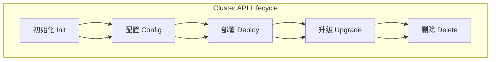

#  Cluster API

**Cluster API 是 Kubernetes 社区的一个子项目，用于以声明式方式管理 Kubernetes 集群的生命周期，包括创建、扩缩容、升级和删除。它通过 CRD（自定义资源定义）和控制器来统一管理集群，就像管理 Pod 一样。**  

## 📖 Cluster API 核心概念
- **声明式管理**：用户只需定义集群的期望状态，Cluster API 控制器会自动执行创建、更新和删除操作。  
- **CRD资源**：包括 `Cluster`、`Machine`、`MachineDeployment`、`ControlPlane` 等，用于描述集群和节点。  
- **clusterctl工具**：命令行工具，支持初始化、生成配置、升级和删除集群。  
- **多云支持**：通过不同的 provider（AWS、Azure、GCP、vSphere、OpenStack 等）实现跨平台集群管理。  

## 📖 主要功能
- **集群创建**：快速在云或本地环境中创建 Kubernetes 集群。  
- **自动扩缩容**：支持节点池的自动扩展与缩减。  
- **升级管理**：支持滚动升级和 **in-place updates**，减少服务中断。  [Kubernetes](https://kubernetes.io/blog/2026/01/27/cluster-api-v1-12-release/)  
- **健康检查**：自动检测并修复异常节点。  
- **GitOps集成**：支持通过 GitOps 管理集群配置。  

## 📖 应用场景
- **企业多云管理**：统一管理跨 AWS、Azure、GCP 的 Kubernetes 集群。  
- **DevOps 自动化**：结合 CI/CD，实现集群的自动化部署与升级。  
- **边缘计算**：在分布式环境中快速创建和管理小型集群。  
- **测试与研发**：快速搭建临时集群，支持实验和验证。  

## 📖 总结
Cluster API 是一个 **Kubernetes 原生的集群生命周期管理框架**，通过声明式 API 和控制器机制，简化了集群的创建、扩缩容和升级，适合多云环境和自动化运维场景。  

## 📖 Cluster API 与传统工具对比

| 工具 | 特点 | 优势 | 劣势 | 适用场景 |
|------|------|------|------|----------|
| **Cluster API** | Kubernetes 原生的集群生命周期管理框架 | 声明式 API，统一管理多云集群，支持自动扩缩容与升级 | 部署复杂，需要理解 CRD 与控制器 | 多云环境、自动化运维、GitOps 集成 |
| **kubeadm** | 官方提供的集群初始化工具 | 简单直接，轻量，适合快速搭建集群 | 功能有限，不支持多云与自动化管理 | 学习、测试环境，小规模集群 |
| **Rancher** | 开源的 Kubernetes 管理平台 | 图形化界面，支持多集群管理，易用性强 | 对底层控制有限，依赖 Rancher 生态 | 中小企业，团队协作，简化管理 |
| **OpenShift** | Red Hat 企业级 Kubernetes 发行版 | 集成 CI/CD、安全策略、企业支持 | 成本高，复杂度大，学习曲线陡峭 | 大型企业，安全合规要求高的场景 |

### 📖 总结
- **Cluster API**：优势在于 **声明式、自动化、多云统一管理**，适合企业级 DevOps 与 GitOps 场景。  
- **kubeadm**：轻量快速，适合学习和小规模集群。  
- **Rancher**：图形化管理，降低门槛，适合中小企业。  
- **OpenShift**：企业级解决方案，功能全面但成本高。

## 📖 Cluster API 应用场景指南

### 1. **多云环境管理**
- **场景**：企业在 AWS、Azure、GCP、vSphere 等多平台同时运行 Kubernetes 集群。  
- **优势**：Cluster API 提供统一的声明式 API，跨云管理一致，避免不同平台的运维割裂。  
- **实践**：通过不同 Provider（如 CAPA for AWS、CAPZ for Azure）实现集群生命周期管理。  

### 2. **DevOps 自动化**
- **场景**：开发团队需要频繁创建、升级和销毁集群，用于测试与交付。  
- **优势**：支持 GitOps 集成，集群配置可版本化，自动化 CI/CD 流程。  
- **实践**：结合 ArgoCD 或 Flux，自动化触发集群创建与升级，减少人工操作。  

### 3. **边缘计算**
- **场景**：在分布式环境（如 IoT、零售门店、工厂）快速部署小型集群。  
- **优势**：Cluster API 提供声明式管理，支持轻量级集群快速创建与销毁。  
- **实践**：结合 K3s 或 MicroK8s，利用 Cluster API 管理边缘节点生命周期。  

### 4. **企业级集群升级**
- **场景**：企业需要在不中断业务的情况下升级 Kubernetes 集群。  
- **优势**：Cluster API 支持滚动升级与健康检查，减少服务中断风险。  
- **实践**：使用 `MachineDeployment` 和 `ControlPlane` CRD，实现平滑升级。  

### 5. **测试与研发环境**
- **场景**：研发团队需要快速搭建临时集群进行实验。  
- **优势**：Cluster API 提供声明式配置，几分钟即可创建或销毁集群。  
- **实践**：结合 `clusterctl` 工具，快速生成配置并部署。  

## 📖 总结
- **多云环境** → 统一管理，避免平台割裂。  
- **DevOps 自动化** → GitOps 集成，提升交付效率。  
- **边缘计算** → 快速部署轻量集群。  
- **企业升级** → 平滑升级，保障业务连续性。  
- **研发测试** → 快速创建销毁，支持实验。  

Cluster API 的核心优势在于 **声明式、自动化、跨平台统一管理**，它让 Kubernetes 集群的生命周期管理像管理 Pod 一样简单。  

## 📖 Cluster API 最佳实践清单

### 1. **常用 CRD（自定义资源定义）**
- **Cluster**：定义集群的整体信息（网络、Provider、版本）。  
- **Machine**：描述单个节点的配置（CPU、内存、镜像）。  
- **MachineDeployment**：类似于 Kubernetes 的 Deployment，用于节点池的声明式管理和滚动升级。  
- **ControlPlane**：定义控制平面节点的配置和数量。  
- **MachineSet**：管理一组相同配置的节点，支持自动扩缩容。  

### 2. **工具 clusterctl**
- **初始化**：`clusterctl init` 初始化管理集群，安装必要的 CRD 和控制器。  
- **生成配置**：`clusterctl generate cluster` 根据模板生成集群配置 YAML。  
- **升级集群**：`clusterctl upgrade` 支持控制平面和工作节点的平滑升级。  
- **删除集群**：`clusterctl delete cluster` 快速销毁集群，释放资源。  

### 3. **GitOps 集成方式**
- **版本化配置**：将 Cluster API 的 CRD YAML 文件存放在 Git 仓库中，版本化管理。  
- **自动化部署**：结合 ArgoCD 或 Flux，自动同步 Git 仓库中的配置到管理集群。  
- **声明式升级**：通过修改 Git 中的配置文件（如 Kubernetes 版本号），触发自动升级流程。  
- **多环境管理**：使用 Git 分支或目录区分 dev、staging、prod 环境，统一管理。  

### 📖 总结
- **CRD**：Cluster、Machine、MachineDeployment、ControlPlane、MachineSet 是核心资源，负责集群生命周期管理。  
- **clusterctl**：提供命令行工具，简化初始化、配置生成、升级和删除操作。  
- **GitOps**：通过 ArgoCD/Flux 将集群配置声明式管理，实现自动化部署与升级。  

## **Cluster API 运维流程图（Mermaid 语法）**

展示完整生命周期：  

### 📖 流程说明

- **初始化**：使用 `clusterctl init` 初始化管理集群，安装 CRD 和控制器。  
- **配置**：生成 YAML 配置文件，定义集群、节点池、控制平面。  
- **部署**：应用配置，创建集群与节点。  
- **升级**：通过修改配置或 `clusterctl upgrade` 平滑升级。  
- **删除**：销毁集群，释放资源。  

### ✅ 总结
这份流程图直观展示了 **Cluster API 的运维生命周期**：从初始化到配置，再到部署、升级和删除，形成一个完整闭环。  

换句话说，Cluster API 更像是 **Kubernetes 原生的“集群控制器”**，而 kubeadm、Rancher、OpenShift 则分别偏向 **轻量工具、管理平台、企业发行版**。  
