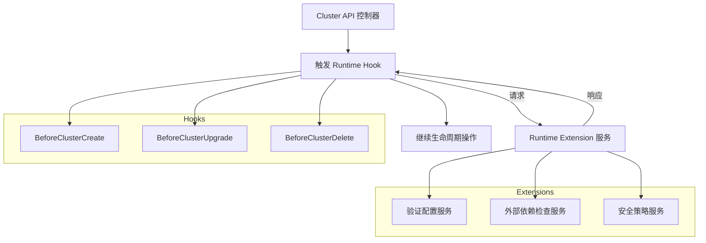

# Runtime Extension 与 Runtime Hook
**在 Cluster API 中，Runtime Extension 与 Runtime Hook 并不是同一个概念：Runtime Hook 是定义好的生命周期接口，而 Runtime Extension 是实现这些 Hook 的外部服务。换句话说，Hook 是“规范”，Extension 是“实现”。**

## 概念区分

### **Runtime Hook**
- **定义**：Cluster API 在集群生命周期（创建、升级、删除等）中预留的可扩展点。  
- **作用**：描述在某个阶段可以触发的请求/响应接口（OpenAPI 规范）。  
- **类似于**：Kubernetes Admission Webhook 的“调用点”，但专注于 Cluster API 生命周期。  
- **例子**：Cluster 创建前的 `BeforeClusterCreate` Hook，升级时的 `BeforeClusterUpgrade` Hook。

### **Runtime Extension**
- **定义**：由开发者实现的 HTTPS 服务，负责处理某个或多个 Runtime Hook 的请求。  
- **作用**：在 Hook 被触发时，执行自定义逻辑（如验证、修改配置、调用外部系统）。  
- **类似于**：Admission Webhook 的“服务端实现”。  
- **例子**：一个 Extension 可以在 `BeforeClusterUpgrade` Hook 中检查外部依赖是否满足条件。
### 好流程图
直观展示 Cluster API 生命周期中 **Runtime Hook 与 Runtime Extension** 的调用关系：

图解说明
- **Runtime Hook**：由 Cluster API 定义的生命周期触发点（如创建前、升级前、删除前）。  
- **Runtime Extension**：外部服务，负责实现 Hook 的逻辑（如验证、依赖检查、安全策略）。  
- **调用流程**：  
  1. 控制器在生命周期事件触发时调用 Hook。  
  2. Hook 将请求发送给已注册的 Extension 服务。  
  3. Extension 返回响应，控制器根据结果继续或中止操作。  

这个图清楚地展示了 **Hook 是接口规范，Extension 是实现服务**，两者配合才能扩展 Cluster API 生命周期。  

## 关系总结
- **Hook = 接口定义**（规范、触发点）  
- **Extension = Hook 的实现**（外部服务，执行逻辑）  
- **运行机制**：Cluster API 控制器在生命周期事件触发时，会调用已注册的 Runtime Extension 服务，后者根据 Hook 规范返回结果。  [The Cluster API Book](https://cluster-api.sigs.k8s.io/tasks/experimental-features/runtime-sdk/implement-extensions)  [deepwiki.com](https://deepwiki.com/kubernetes-sigs/cluster-api/5.5-runtime-extensions)

## 对比表
| 概念 | 角色 | 作用 | 示例 |
|------|------|------|------|
| **Runtime Hook** | 接口规范 | 定义生命周期触发点及请求/响应格式 | `BeforeClusterCreate` |
| **Runtime Extension** | 实现服务 | 提供逻辑处理，响应 Hook 请求 | 自定义验证服务 |

## 关键结论
- **Runtime Hook 是“规范”，Runtime Extension 是“实现”。**  
- Hook 本身不执行逻辑，只定义调用点；Extension 才是实际运行的服务。  
- 两者关系类似于 **接口与实现类**，必须配合使用才能扩展 Cluster API 生命周期。


# Cluster API Runtime Extension
## Cluster API Runtime Extension 关键组件设计思路与功能说明

### 一、整体架构视角
Runtime Extension 是 **外部可扩展服务**，由用户实现并部署，CAPI 通过 HTTPS 调用。系统分为 **两端**：
```
┌─────────────────────────────────────────┐         ┌──────────────────────────────────────────┐
│           CAPI 侧 (Client)               │        │        Extension 侧 (Server)             │
│                                          │        │                                          │
│  ┌─────────────┐   ┌──────────────┐     │         │     ┌──────────────┐   ┌───────────────┐ │
│  │   Client    │──▶│   Registry   │     │  HTTPS  │    │    Server    │   │   Catalog      │ │
│  │ (调用编排)   │   │ (扩展注册表)  │     │  POST   │    │ (HTTP框架)    │   │  (类型系统)    │ │
│  └─────────────┘   └──────────────┘     │         │     └──────────────┘   └───────────────┘ │
│                                          │        │                                          │
│  ┌──────────────────────────────────┐    │        │     ┌──────────────────────────────────┐ │
│  │       ExtensionConfig CRD        │    │        │     │    Extension Handlers (用户代码)  │ │
│  │   (扩展配置与发现结果)             │    │        │     ┌────────────────────────────────┐ │ │
│  └──────────────────────────────────┘    │        │     │ BeforeClusterCreate, ...       │ │ │
└─────────────────────────────────────────┘         │     └────────────────────────────────┘ │ │
                                                    └──────────────────────────────────────────┘
```

### 二、核心组件详解

#### 1. Server（扩展服务端框架）
**文件：** `exp/runtime/server/server.go`

**设计思路：**
- 为扩展开发者提供 **开箱即用的 HTTPS 框架**
- 封装 HTTP 请求/响应生命周期（反序列化 → 调用 Handler → 序列化）
- 自动注入 Discovery 端点，实现自描述 API
- 基于 `controller-runtime` webhook server 构建

**核心结构：**
```go
type Server struct {
    webhook.Server                     // 嵌入 controller-runtime webhook server
    catalog  *runtimecatalog.Catalog  // 类型目录
    handlers map[string]ExtensionHandler  // path → handler 映射
}

type ExtensionHandler struct {
    gvh             runtimecatalog.GroupVersionHook  // 自动计算
    requestObject   runtime.Object                   // 自动创建
    responseObject  runtime.Object                   // 自动创建
    Hook            runtimecatalog.Hook              // 用户传入
    Name            string                           // Handler 名称
    HandlerFunc     runtimecatalog.Hook              // 用户逻辑 func(ctx, *Req, *Resp)
    TimeoutSeconds  *int32                           // 超时（返回给 Discovery）
    FailurePolicy   *runtimehooksv1.FailurePolicy    // 失败策略（返回给 Discovery）
}
```

**关键方法流程：**

| 方法 | 功能 |
|------|------|
| `New(options)` | 创建 Server，配置 TLS、端口、证书目录 |
| `AddExtensionHandler(handler)` | 注册 Handler：验证签名、计算 GVH、创建请求/响应对象、计算 HTTP 路径 |
| `Start(ctx)` | 自动添加 Discovery Handler，包装所有 Handlers，启动 HTTPS 服务 |
| `wrapHandler(handler)` | 创建 HTTP Handler：读取请求体 → 反序列化 → 反射调用 → 序列化响应 |
| `callHandler(handler, r)` | 核心调用逻辑 |
| `discoveryHandler(handlers)` | 生成 Discovery 响应，列出所有已注册 Handlers |

**Handler 路径计算：**
```
/{group}/{version}/{hook}/{name}
例：/hooks.runtime.cluster.x-k8s.io/v1alpha1/beforeclustercreate/before-cluster-create
```

**设计模式：**
- **适配器模式**：包装 controller-runtime webhook server
- **模板方法模式**：`wrapHandler` 提供请求/响应生命周期，委托用户 Handler
- **自动发现模式**：内置 Discovery 端点，无需手动实现

#### 2. Catalog（类型目录）
**文件：** `exp/runtime/catalog/catalog.go`

**在 Extension 侧的作用：**
- 注册所有 Hook 定义（函数签名、Request/Response 类型）
- 用于 Server 验证 Handler 签名是否正确
- 用于创建请求/响应对象实例
- 生成 OpenAPI 定义（用于 Discovery 响应）

**核心结构：**
```go
type Catalog struct {
    scheme              *runtime.Scheme
    gvhToType           map[GroupVersionHook]reflect.Type   // GVH → 函数类型
    typeToGVH           map[reflect.Type]GroupVersionHook   // 函数类型 → GVH
    gvhToHookDescriptor map[GroupVersionHook]hookDescriptor // GVH → 元数据
    openAPIDefinitions  []OpenAPIDefinitionsGetter          // OpenAPI 定义
}
```

**Extension 侧使用方式：**
```go
var catalog = runtimecatalog.New()

func init() {
    // 注册所有 CAPI 定义的 Hook
    _ = runtimehooksv1.AddToCatalog(catalog)
}
```

#### 3. ExtensionConfig CRD（扩展配置）
**文件：** `api/runtime/v1beta2/extensionconfig_types.go`

**设计思路：**
- 作为 CAPI 与扩展之间的 **配置契约**
- Spec 定义连接方式和策略
- Status 通过 Discovery 自动填充支持的 Handlers
- 支持集群内 Service 或外部 URL 两种连接模式

**核心结构：**
```go
type ExtensionConfigSpec struct {
    ClientConfig      ClientConfig              // 连接配置
    NamespaceSelector *metav1.LabelSelector     // 命名空间过滤
    Settings          map[string]string         // 全局 Settings
}

type ClientConfig struct {
    URL      string             // 外部 URL (https://...)
    Service  ServiceReference   // 集群内 Service
    CABundle []byte             // CA 证书
}

type ExtensionConfigStatus struct {
    Conditions []metav1.Condition   // Discovered, Paused
    Handlers   []ExtensionHandler   // 发现的 Handlers
}
```

**Discovery 流程：**
```
1. 用户创建 ExtensionConfig CR
2. CAPI Controller 调用 Extension 的 /discovery 端点
3. Extension Server 返回所有已注册的 Handlers
4. CAPI 更新 ExtensionConfig.Status.Handlers
5. CAPI Registry 根据 Status.Handlers 注册 ExtensionRegistration
```

#### 4. Discovery 机制
**设计思路：**
- 扩展 **自描述** 支持哪些 Hooks
- CAPI 无需预先知道扩展能力
- 通过 HTTP POST 调用 `/hooks.runtime.cluster.x-k8s.io/v1alpha1/discovery`

**Discovery 请求/响应：**
```go
// 请求
type DiscoveryRequest struct {}

// 响应
type DiscoveryResponse struct {
    CommonResponse `json:",inline"`
    Handlers       []ExtensionHandler `json:"handlers"`
}

type ExtensionHandler struct {
    Name           string           // Handler 名称
    RequestHook    GroupVersionHook // 支持的 Hook
    TimeoutSeconds int32            // 超时
    FailurePolicy  FailurePolicy    // 失败策略
}
```

**Server 自动实现：**
```go
// Start() 中自动添加
discoveryHandler := server.ExtensionHandler{
    Hook:        runtimehooksv1.Discovery,
    Name:        "discovery",
    HandlerFunc: s.discoveryHandler,
}
s.AddExtensionHandler(discoveryHandler)
```

#### 5. ExtensionRegistration（运行时注册条目）
**文件：** `internal/runtime/registry/registry.go`

**设计思路：**
- Registry 中的内存条目，由 ExtensionConfig 解析而来
- 包含调用扩展所需的所有信息

**核心结构：**
```go
type ExtensionRegistration struct {
    Name                           string                     // Handler 唯一名称
    ExtensionConfigName            string                     // 所属 ExtensionConfig
    ExtensionConfigResourceVersion string                     // 资源版本
    GroupVersionHook               runtimecatalog.GroupVersionHook
    NamespaceSelector              labels.Selector            // 命名空间过滤
    ClientConfig                   runtimev1.ClientConfig     // 连接配置
    TimeoutSeconds                 int32                      // 超时
    FailurePolicy                  runtimev1.FailurePolicy    // 失败策略
    Settings                       map[string]string          // 全局 Settings
}
```

### 三、组件协作流程

#### 注册与发现流程
```
1. 开发者实现 Extension Server，注册 Handlers
   └── server.AddExtensionHandler(ExtensionHandler{Hook, Name, HandlerFunc})

2. 部署 Extension（Deployment + Service + Certificate）

3. 用户创建 ExtensionConfig CR
   └── spec.clientConfig.service = {namespace, name, port}
   └── spec.namespaceSelector = {...}
   └── spec.settings = {...}

4. CAPI Controller 调用 Discovery
   └── POST /hooks.runtime.cluster.x-k8s.io/v1alpha1/discovery
   └── Server 返回 {Handlers: [{Name, RequestHook, TimeoutSeconds, FailurePolicy}]}

5. CAPI 更新 ExtensionConfig.Status.Handlers

6. CAPI Registry.Add(ExtensionConfig)
   └── 解析 Handlers，创建 ExtensionRegistration 条目
```

#### Hook 调用流程
```
1. CAPI Controller 调用 CallAllExtensions(BeforeClusterCreate, ...)

2. Client 查找 Registry
   └── Registry.List(GroupHook{..., "BeforeClusterCreate"})
   └→ 得到 ExtensionRegistration 列表

3. 对每个 Registration：
   ├── 检查 NamespaceSelector 是否匹配 Cluster 所在命名空间
   ├── 构建 HTTP 请求
   │   ├── URL: https://{service}.{namespace}.svc:{port}/{group}/{version}/{hook}/{name}
   │   ├── TLS: 使用 CABundle 验证
   │   ├── Timeout: Registration.TimeoutSeconds
   │   └── Body: JSON 序列化的 Request（包含 Settings）
   ├── 发送 POST 请求
   └── 接收响应
       ├── 反序列化 Response
       ├── 检查 Status (Success/Failure)
       └── 应用 FailurePolicy

4. 聚合响应，返回给 Controller
```

### 四、设计原则总结
| 原则 | 实现方式 |
|------|----------|
| **自描述** | Discovery 端点自动发现扩展能力 |
| **类型安全** | Catalog 验证 Handler 签名，反射确保类型匹配 |
| **灵活连接** | 支持集群内 Service 或外部 URL |
| **弹性设计** | Timeout + FailurePolicy（Fail/Ignore） |
| **作用域控制** | NamespaceSelector 限制扩展影响范围 |
| **配置覆盖** | Settings 可在 ClusterClass 级别覆盖 |
| **安全性** | mTLS（CABundle）、自动 CA 注入注解 |
| **可观测性** | Conditions（Discovered, Paused）、结构化日志 |
| **关注点分离** | Server（框架）、Catalog（类型）、ExtensionConfig（配置）、Registry（运行时状态） |

### 五、关键注解
| 注解 | 用途 |
|------|------|
| `runtime.cluster.x-k8s.io/inject-ca-from-secret` | 自动从 Secret 注入 CA 到 `caBundle` |
| `runtime.cluster.x-k8s.io/pending-hooks` | 跟踪待完成的 Hook 调用 |
| `runtime.cluster.x-k8s.io/ok-to-delete` | 标记 Cluster 可安全删除 |

# Cluster-API Runtime Extensions 完整能力列表

## Cluster-API Runtime Extensions 完整能力列表

### 一、Hook 分类总览
| 分类 | Hook 数量 | 状态 |
|------|-----------|------|
| Discovery | 1 | GA |
| Lifecycle Hooks | 9 | GA |
| Topology Mutation | 3 | GA |
| Chained Upgrade | 1 | GA |
| In-Place Update | 3 | Alpha |
| **总计** | **17** | |

### 二、完整 Hook 列表

#### 1. Discovery Hook
| Hook 名称 | 调用时机 | 用途 |
|-----------|----------|------|
| **Discovery** | ExtensionConfig 被 Reconcile 时 | 扩展服务向 CAPI 注册自己支持的所有 Handler，包括 Hook 类型、超时、失败策略 |

#### 2. Lifecycle Hooks (生命周期钩子)
| Hook 名称 | 调用时机 | 阻塞类型 | 用途 |
|-----------|----------|----------|------|
| **BeforeClusterCreate** | 集群拓扑创建前 | 阻塞 | 在集群对象创建后、拓扑对象创建前执行任务（如预检查、资源准备） |
| **AfterControlPlaneInitialized** | 控制面首次可访问后 | 非阻塞 | 控制面初始化完成后执行任务（如安装基础插件） |
| **BeforeClusterUpgrade** | 集群升级前、新版本传播到控制面前 | 阻塞 | 升级前验证、创建快照、通知外部系统 |
| **BeforeControlPlaneUpgrade** | 控制面升级前（每个中间版本） | 阻塞 | 控制面每个版本升级前的检查/准备 |
| **AfterControlPlaneUpgrade** | 控制面升级完成后、Worker 升级前 | 阻塞 | 控制面升级后的验证/清理 |
| **BeforeWorkersUpgrade** | Worker 升级前 | 阻塞 | Worker 升级前的检查/准备 |
| **AfterWorkersUpgrade** | Worker 升级完成后 | 阻塞 | Worker 升级后的验证 |
| **AfterClusterUpgrade** | 整个集群升级完成后 | 阻塞 | 集群升级完成后的最终处理 |
| **BeforeClusterDelete** | 集群删除前 | 阻塞 | 删除前清理外部资源、备份数据 |

#### 3. Topology Mutation Hooks (拓扑变更钩子)
| Hook 名称 | 调用时机 | 用途 |
|-----------|----------|------|
| **GeneratePatches** | 计算集群拓扑时（每次 Reconcile） | 对从 ClusterClass 派生的模板生成 JSON Patch，实现动态配置注入 |
| **ValidateTopology** | 所有 Patch 应用后 | 验证最终拓扑配置的正确性 |
| **DiscoverVariables** | ClusterClass Reconcile 时 | 动态发现并注册变量 Schema，供 Cluster 使用 |

#### 4. Chained Upgrade Hook (链式升级钩子)
| Hook 名称 | 调用时机 | 用途 |
|-----------|----------|------|
| **GenerateUpgradePlan** | 集群升级计划生成时 | 定义升级的中间版本路径（如 v1.29→v1.30→v1.31→v1.32），支持控制面和 Worker 分别定义升级路径 |

#### 5. In-Place Update Hooks (原地升级钩子) - Alpha
| Hook 名称 | 调用时机 | 用途 |
|-----------|----------|------|
| **CanUpdateMachine** | 升级规划阶段 | 判断扩展是否支持对特定 Machine 的变更进行原地升级，返回支持的 Patch |
| **CanUpdateMachineSet** | 升级规划阶段 (MachineDeployment) | 判断扩展是否支持对 MachineSet 的变更进行原地升级 |
| **UpdateMachine** | 原地升级执行阶段 | 执行实际的原地升级操作，支持轮询（通过 RetryAfterSeconds 表示进行中） |

### 三、核心数据结构

#### ExtensionConfig - 扩展注册
```yaml
apiVersion: runtime.cluster.x-k8s.io/v1alpha1
kind: ExtensionConfig
metadata:
  name: my-extension
spec:
  clientConfig:
    service:
      name: my-extension-service
      namespace: capi-system
      port: 443
    # 可选：URL 方式（非 Service）
    # url: https://my-extension.example.com/hook
  namespaceSelector:
    matchLabels:
      capi-enabled: "true"
```

#### ExtensionHandler - Handler 注册信息
```json
{
  "name": "my-lifecycle-hook",
  "requestHook": {
    "apiVersion": "v1alpha1",
    "hook": "BeforeClusterCreate"
  },
  "timeoutSeconds": 30,
  "failurePolicy": "Fail"  // 或 "Ignore"
}
```

### 四、响应类型
| 响应类型 | 字段 | 用途 |
|----------|------|------|
| **ResponseObject** | Status, Message | 简单成功/失败响应 |
| **RetryResponseObject** | Status, Message, RetryAfterSeconds | 支持重试的响应（RetryAfterSeconds > 0 表示稍后重试） |
| **GeneratePatchesResponse** | Items (Patch 列表) | 返回 JSON Patch 或 JSON Merge Patch |

### 五、Feature Gate 状态
| 功能 | Feature Gate | 默认值 | 阶段 |
|------|-------------|--------|------|
| Lifecycle Hooks | 无（始终启用） | 启用 | GA |
| Topology Mutation | ClusterTopology | 启用 | GA |
| GenerateUpgradePlan | 无（始终启用） | 启用 | GA |
| **In-Place Update** | **InPlaceUpdates** | **禁用** | **Alpha** |

### 六、关键限制
| 限制 | 说明 |
|------|------|
| In-Place Update 不支持自动回滚 | 失败后需手动修复或替换机器 |
| 当前仅支持 1 个 In-Place Updater | 未来会支持多个 |
| Runtime SDK 为 Alpha | API 可能变化，需关注社区进展 |
| 超时默认 10 秒 | 可通过 ExtensionHandler.TimeoutSeconds 自定义 |
| 失败策略默认 Fail | 可设置为 Ignore 忽略非关键错误 |

# Runtime Extensions 是 Cluster-API 的原生能力

### 1. 源码位置
在 CAPI 仓库中可以找到完整的实现：
- **API 定义**: `api/runtime/hooks/v1alpha1/` - 定义了所有 Hook 类型
- **Runtime SDK**: `exp/runtime/` - 包含 catalog、client、server、topologymutation
- **ExtensionConfig CRD**: `api/runtime/v1beta2/extensionconfig_types.go`

### 2. 提供的 Hook 类型
| Hook 类别 | Hook 名称 | 用途 |
|-----------|-----------|------|
| **Lifecycle Hooks** | BeforeClusterCreate | 集群创建前阻塞 |
| | AfterControlPlaneInitialized | 控制面初始化后 |
| | BeforeClusterUpgrade | 升级前阻塞 |
| | BeforeControlPlaneUpgrade | 控制面升级前 |
| | AfterControlPlaneUpgrade | 控制面升级后 |
| | BeforeWorkersUpgrade | Worker 升级前 |
| | AfterWorkersUpgrade | Worker 升级后 |
| | AfterClusterUpgrade | 集群升级后 |
| | BeforeClusterDelete | 集群删除前 |
| **Topology Mutation** | GeneratePatches | 拓扑模板补丁生成 |
| | ValidateTopology | 拓扑验证 |
| | DiscoverVariables | 变量发现 |
| **In-Place Update** | CanUpdateMachine | 判断是否支持原地升级 |
| | CanUpdateMachineSet | 判断 MachineSet 是否支持原地升级 |
| | UpdateMachine | 执行原地升级 |

### 3. 注册机制
通过 `ExtensionConfig` CRD 注册外部扩展服务：
```yaml
apiVersion: runtime.cluster.x-k8s.io/v1alpha1
kind: ExtensionConfig
metadata:
  name: my-extension
spec:
  clientConfig:
    service:
      name: my-extension-service
      namespace: capi-system
      port: 443
  namespaceSelector: {}
```

### 4. 当前成熟度
| 功能 | 状态 | Feature Gate |
|------|------|--------------|
| Lifecycle Hooks | GA | 默认启用 |
| Topology Mutation (GeneratePatches) | GA | 默认启用 |
| DiscoverVariables | GA | 默认启用 |
| **In-Place Update** | **Alpha** | `InPlaceUpdates` (默认关闭) |

### 5. 关键限制
- **In-Place Update 当前不支持自动回滚** - proposal 中明确列为 Non-Goal
- 失败后需要**手动修复**或**替换机器**
- 目前仅支持**一个**外部 updater (未来会支持多个)

所以方案中使用的 Runtime Extensions 完全是 CAPI 官方提供的扩展机制，不是第三方组件。

# Runtime Extensions 开发与注册到 CAPI 生命周期的完整指南

## Runtime Extensions 开发与注册完整指南

### 一、开发流程概览
```
┌──────────────────────────────────────────────────────────────────────┐
│                        开发流程                                       │
│                                                                      │
│  1. 创建 Go 项目                                                     │
│     ├── 引入 CAPI Runtime SDK                                        │
│     └── 引入 controller-runtime                                      │
│                                                                      │
│  2. 实现 Handler 函数                                                │
│     ├── 定义 Handler struct (可选)                                   │
│     ├── 实现 Discovery Hook (必需)                                   │
│     └── 实现业务 Hook (按需选择)                                     │
│                                                                      │
│  3. 创建 HTTP Server                                                 │
│     ├── 使用 CAPI server.New() 创建 Webhook Server                   │
│     ├── 注册 ExtensionHandler                                        │
│     └── 配置 TLS 证书                                                │
│                                                                      │
│  4. 部署到 Kubernetes                                               │
│     ├── 构建 Docker 镜像                                             │
│     ├── 创建 Deployment + Service                                    │
│     └── 配置 TLS Secret                                              │
│                                                                      │
│  5. 注册到 CAPI                                                      │
│     └── 创建 ExtensionConfig CRD                                     │
└──────────────────────────────────────────────────────────────────────┘
```

### 二、开发步骤详解

#### 步骤 1: 创建项目结构
```
my-extension/
├── cmd/
│   └── main.go              # 入口文件
├── internal/
│   └── handlers/
│       ├── discovery.go     # Discovery Hook
│       ├── lifecycle.go     # Lifecycle Hooks
│       └── topology.go      # Topology Mutation Hooks
├── go.mod
└── go.sum
```

#### 步骤 2: 实现 Handler 函数
**Handler 函数签名** - 每个 Hook 有固定的签名：
```go
func HandlerName(ctx context.Context, request *RequestType, response *ResponseType)
```

**示例：实现 BeforeClusterCreate Hook**
```go
package handlers

import (
    "context"
    "fmt"

    ctrl "sigs.k8s.io/controller-runtime"
    "sigs.k8s.io/controller-runtime/pkg/client"

    clusterv1 "sigs.k8s.io/cluster-api/api/core/v1beta2"
    runtimehooksv1 "sigs.k8s.io/cluster-api/api/runtime/hooks/v1alpha1"
)

type LifecycleHandlers struct {
    client client.Client
}

func NewLifecycleHandlers(c client.Client) *LifecycleHandlers {
    return &LifecycleHandlers{client: c}
}

// DoBeforeClusterCreate 实现 BeforeClusterCreate Hook
func (h *LifecycleHandlers) DoBeforeClusterCreate(
    ctx context.Context,
    request *runtimehooksv1.BeforeClusterCreateRequest,
    response *runtimehooksv1.BeforeClusterCreateResponse,
) {
    log := ctrl.LoggerFrom(ctx).WithValues("Cluster", request.Cluster.Name)
    log.Info("BeforeClusterCreate hook called")

    // ===== 自定义业务逻辑 =====
    
    // 1. 获取集群信息
    cluster := request.Cluster
    
    // 2. 执行预检查
    if err := h.preFlightCheck(ctx, cluster); err != nil {
        response.Status = runtimehooksv1.ResponseStatusFailure
        response.Message = fmt.Sprintf("Pre-flight check failed: %v", err)
        return
    }
    
    // 3. 准备外部资源 (如创建负载均衡器)
    if err := h.prepareExternalResources(ctx, cluster); err != nil {
        response.Status = runtimehooksv1.ResponseStatusFailure
        response.Message = fmt.Sprintf("Failed to prepare resources: %v", err)
        response.RetryAfterSeconds = 30  // 30秒后重试
        return
    }
    
    // 4. 返回成功
    response.Status = runtimehooksv1.ResponseStatusSuccess
    response.Message = "Pre-flight checks passed, resources prepared"
}

func (h *LifecycleHandlers) preFlightCheck(ctx context.Context, cluster clusterv1.Cluster) error {
    // 实现预检查逻辑
    return nil
}

func (h *LifecycleHandlers) prepareExternalResources(ctx context.Context, cluster clusterv1.Cluster) error {
    // 实现外部资源准备逻辑
    return nil
}
```

**示例：实现 AfterControlPlaneInitialized Hook**
```go
func (h *LifecycleHandlers) DoAfterControlPlaneInitialized(
    ctx context.Context,
    request *runtimehooksv1.AfterControlPlaneInitializedRequest,
    response *runtimehooksv1.AfterControlPlaneInitializedResponse,
) {
    log := ctrl.LoggerFrom(ctx)
    log.Info("AfterControlPlaneInitialized hook called")

    // 获取 workload cluster 的 client
    workloadClient, err := h.getWorkloadClient(ctx, request.Cluster)
    if err != nil {
        response.Status = runtimehooksv1.ResponseStatusFailure
        response.Message = fmt.Sprintf("Failed to get workload client: %v", err)
        return
    }

    // 安装基础插件 (Calico, CoreDNS 等)
    if err := h.installBaseAddons(ctx, workloadClient); err != nil {
        response.Status = runtimehooksv1.ResponseStatusFailure
        response.Message = fmt.Sprintf("Failed to install addons: %v", err)
        return
    }

    response.Status = runtimehooksv1.ResponseStatusSuccess
}
```

**示例：实现 GeneratePatches Hook (Topology Mutation)**
```go
func (h *TopologyHandlers) GeneratePatches(
    ctx context.Context,
    request *runtimehooksv1.GeneratePatchesRequest,
    response *runtimehooksv1.GeneratePatchesResponse,
) {
    log := ctrl.LoggerFrom(ctx)
    log.Info("GeneratePatches hook called")

    // 遍历所有模板，为特定类型生成 Patch
    for _, item := range request.Items {
        // 检查模板类型
        if item.HolderReference.Kind == "KubeadmConfigTemplate" {
            // 生成 JSON Patch
            patch := h.generateKubeadmPatch(ctx, item, request.Variables)
            if patch != nil {
                response.Items = append(response.Items, runtimehooksv1.GeneratePatchesResponseItem{
                    UID:       item.UID,
                    PatchType: runtimehooksv1.JSONPatchType,
                    Patch:     patch,
                })
            }
        }
    }

    response.Status = runtimehooksv1.ResponseStatusSuccess
}

func (h *TopologyHandlers) generateKubeadmPatch(ctx context.Context, item runtimehooksv1.GeneratePatchesRequestItem, variables []runtimehooksv1.Variable) []byte {
    // 从变量中获取镜像仓库地址
    registry := h.getVariableValue(variables, "registryEndpoint")
    
    // 生成 JSON Patch
    return []byte(fmt.Sprintf(`[
        {"op": "add", "path": "/spec/template/spec/clusterConfiguration/imageRepository", "value": "%s"}
    ]`, registry))
}
```

**示例：实现 In-Place Update Hooks**
```go
type InPlaceUpdateHandlers struct {
    client client.Client
}

// DoCanUpdateMachine 判断是否支持原地升级
func (h *InPlaceUpdateHandlers) DoCanUpdateMachine(
    ctx context.Context,
    request *runtimehooksv1.CanUpdateMachineRequest,
    response *runtimehooksv1.CanUpdateMachineResponse,
) {
    currentVersion := request.Current.Machine.Spec.Version
    desiredVersion := request.Desired.Machine.Spec.Version

    if currentVersion != desiredVersion {
        // 支持版本升级的原地更新
        response.MachinePatch = runtimehooksv1.Patch{
            PatchType: "JSONPatch",
            Patch: []byte(fmt.Sprintf(
                `[{"op":"replace","path":"/spec/version","value":"%s"}]`,
                desiredVersion,
            )),
        }
    }

    response.Status = runtimehooksv1.ResponseStatusSuccess
}

// DoUpdateMachine 执行原地升级
func (h *InPlaceUpdateHandlers) DoUpdateMachine(
    ctx context.Context,
    request *runtimehooksv1.UpdateMachineRequest,
    response *runtimehooksv1.UpdateMachineResponse,
) {
    machine := request.Desired.Machine
    targetVersion := machine.Spec.Version

    // 1. SSH 连接到目标机器
    client, err := h.sshConnect(machine)
    if err != nil {
        response.Status = runtimehooksv1.ResponseStatusFailure
        response.Message = fmt.Sprintf("SSH failed: %v", err)
        return
    }

    // 2. 执行升级脚本
    output, err := client.Run(h.buildUpgradeScript(targetVersion))
    if err != nil {
        response.Status = runtimehooksv1.ResponseStatusFailure
        response.Message = fmt.Sprintf("Upgrade failed: %v\n%s", err, output)
        return
    }

    response.Status = runtimehooksv1.ResponseStatusSuccess
}
```

#### 步骤 3: 创建 HTTP Server
```go
package main

import (
    "flag"
    "os"

    "github.com/spf13/pflag"
    "k8s.io/apimachinery/pkg/runtime"
    clientgoscheme "k8s.io/client-go/kubernetes/scheme"
    ctrl "sigs.k8s.io/controller-runtime"
    "sigs.k8s.io/controller-runtime/pkg/client"

    runtimehooksv1 "sigs.k8s.io/cluster-api/api/runtime/hooks/v1alpha1"
    runtimecatalog "sigs.k8s.io/cluster-api/exp/runtime/catalog"
    "sigs.k8s.io/cluster-api/exp/runtime/server"
)

var (
    catalog = runtimecatalog.New()
    scheme  = runtime.NewScheme()
)

func init() {
    _ = clientgoscheme.AddToScheme(scheme)
    // 注册 Runtime Hook 类型到 catalog
    _ = runtimehooksv1.AddToCatalog(catalog)
}

func main() {
    var webhookPort int
    var webhookCertDir, webhookCertName, webhookKeyName string

    pflag.IntVar(&webhookPort, "webhook-port", 9443, "Webhook Server port")
    pflag.StringVar(&webhookCertDir, "webhook-cert-dir", "/tmp/k8s-webhook-server/serving-certs/", "Webhook cert dir")
    pflag.StringVar(&webhookCertName, "webhook-cert-name", "tls.crt", "Webhook cert name")
    pflag.StringVar(&webhookKeyName, "webhook-key-name", "tls.key", "Webhook key name")
    pflag.Parse()

    ctrl.SetLogger(ctrl.Log)

    // 创建 controller-runtime manager
    mgr, err := ctrl.NewManager(ctrl.GetConfigOrDie(), ctrl.Options{
        Scheme: scheme,
    })
    if err != nil {
        setupLog.Error(err, "Unable to create manager")
        os.Exit(1)
    }

    // 创建 Runtime Extension Webhook Server
    webhookServer, err := server.New(server.Options{
        Port:     webhookPort,
        CertDir:  webhookCertDir,
        CertName: webhookCertName,
        KeyName:  webhookKeyName,
        Catalog:  catalog,
    })
    if err != nil {
        setupLog.Error(err, "Error creating webhook server")
        os.Exit(1)
    }

    // 初始化 Handler
    lifecycleHandlers := handlers.NewLifecycleHandlers(mgr.GetClient())
    topologyHandlers := handlers.NewTopologyHandlers()
    inplaceUpdateHandlers := handlers.NewInPlaceUpdateHandlers(mgr.GetClient())

    // ===== 注册 Extension Handler =====
    
    // 注册 Lifecycle Hooks
    if err := webhookServer.AddExtensionHandler(server.ExtensionHandler{
        Hook:        runtimehooksv1.BeforeClusterCreate,
        Name:        "before-cluster-create",
        HandlerFunc: lifecycleHandlers.DoBeforeClusterCreate,
    }); err != nil {
        setupLog.Error(err, "Error adding handler")
        os.Exit(1)
    }

    if err := webhookServer.AddExtensionHandler(server.ExtensionHandler{
        Hook:        runtimehooksv1.AfterControlPlaneInitialized,
        Name:        "after-control-plane-initialized",
        HandlerFunc: lifecycleHandlers.DoAfterControlPlaneInitialized,
    }); err != nil {
        setupLog.Error(err, "Error adding handler")
        os.Exit(1)
    }

    if err := webhookServer.AddExtensionHandler(server.ExtensionHandler{
        Hook:        runtimehooksv1.BeforeClusterUpgrade,
        Name:        "before-cluster-upgrade",
        HandlerFunc: lifecycleHandlers.DoBeforeClusterUpgrade,
    }); err != nil {
        setupLog.Error(err, "Error adding handler")
        os.Exit(1)
    }

    if err := webhookServer.AddExtensionHandler(server.ExtensionHandler{
        Hook:        runtimehooksv1.BeforeClusterDelete,
        Name:        "before-cluster-delete",
        HandlerFunc: lifecycleHandlers.DoBeforeClusterDelete,
    }); err != nil {
        setupLog.Error(err, "Error adding handler")
        os.Exit(1)
    }

    // 注册 Topology Mutation Hooks
    if err := webhookServer.AddExtensionHandler(server.ExtensionHandler{
        Hook:        runtimehooksv1.GeneratePatches,
        Name:        "generate-patches",
        HandlerFunc: topologyHandlers.GeneratePatches,
    }); err != nil {
        setupLog.Error(err, "Error adding handler")
        os.Exit(1)
    }

    // 注册 In-Place Update Hooks
    if err := webhookServer.AddExtensionHandler(server.ExtensionHandler{
        Hook:        runtimehooksv1.CanUpdateMachine,
        Name:        "can-update-machine",
        HandlerFunc: inplaceUpdateHandlers.DoCanUpdateMachine,
    }); err != nil {
        setupLog.Error(err, "Error adding handler")
        os.Exit(1)
    }

    if err := webhookServer.AddExtensionHandler(server.ExtensionHandler{
        Hook:        runtimehooksv1.UpdateMachine,
        Name:        "update-machine",
        HandlerFunc: inplaceUpdateHandlers.DoUpdateMachine,
    }); err != nil {
        setupLog.Error(err, "Error adding handler")
        os.Exit(1)
    }

    // 添加健康检查
    if err := mgr.AddReadyzCheck("webhook", webhookServer.StartedChecker()); err != nil {
        setupLog.Error(err, "Unable to create ready check")
        os.Exit(1)
    }

    if err := mgr.AddHealthzCheck("webhook", webhookServer.StartedChecker()); err != nil {
        setupLog.Error(err, "Unable to create health check")
        os.Exit(1)
    }

    setupLog.Info("Starting manager")
    if err := mgr.Start(ctrl.SetupSignalHandler()); err != nil {
        setupLog.Error(err, "Problem running manager")
        os.Exit(1)
    }
}
```

#### 步骤 4: 部署到 Kubernetes
**Dockerfile**
```dockerfile
FROM golang:1.22 AS builder
WORKDIR /workspace
COPY go.mod go.mod
COPY go.sum go.sum
RUN go mod download
COPY . .
RUN CGO_ENABLED=0 GOOS=linux GOARCH=amd64 go build -a -o extension-manager cmd/main.go

FROM gcr.io/distroless/static:nonroot
WORKDIR /
COPY --from=builder /workspace/extension-manager .
USER 65532:65532
ENTRYPOINT ["/extension-manager"]
```

**Kubernetes 部署清单**
```yaml
---
# Namespace
apiVersion: v1
kind: Namespace
metadata:
  name: capi-extension-system
  labels:
    control-plane: controller-manager

---
# TLS Secret (证书需要正确配置)
apiVersion: v1
kind: Secret
metadata:
  name: capi-extension-webhook-cert
  namespace: capi-extension-system
type: kubernetes.io/tls
data:
  tls.crt: <base64-encoded-cert>
  tls.key: <base64-encoded-key>

---
# ServiceAccount
apiVersion: v1
kind: ServiceAccount
metadata:
  name: capi-extension-controller-manager
  namespace: capi-extension-system

---
# ClusterRole
apiVersion: rbac.authorization.k8s.io/v1
kind: ClusterRole
metadata:
  name: capi-extension-manager-role
rules:
  - apiGroups: ["cluster.x-k8s.io"]
    resources: ["clusters", "machines", "machinedeployments", "machinesets"]
    verbs: ["get", "list", "watch"]
  - apiGroups: ["controlplane.cluster.x-k8s.io"]
    resources: ["kubeadmcontrolplanes"]
    verbs: ["get", "list", "watch"]
  - apiGroups: ["bootstrap.cluster.x-k8s.io"]
    resources: ["kubeadmconfigs", "kubeadmconfigtemplates"]
    verbs: ["get", "list", "watch"]
  - apiGroups: [""]
    resources: ["secrets", "configmaps"]
    verbs: ["get", "list", "watch", "create", "update", "patch"]

---
# ClusterRoleBinding
apiVersion: rbac.authorization.k8s.io/v1
kind: ClusterRoleBinding
metadata:
  name: capi-extension-manager-rolebinding
roleRef:
  apiGroup: rbac.authorization.k8s.io
  kind: ClusterRole
  name: capi-extension-manager-role
subjects:
  - kind: ServiceAccount
    name: capi-extension-controller-manager
    namespace: capi-extension-system

---
# Service (CAPI 通过此 Service 调用 Extension)
apiVersion: v1
kind: Service
metadata:
  name: capi-extension-webhook-service
  namespace: capi-extension-system
spec:
  ports:
    - port: 443
      targetPort: webhook-server
  selector:
    control-plane: controller-manager

---
# Deployment
apiVersion: apps/v1
kind: Deployment
metadata:
  name: capi-extension-controller-manager
  namespace: capi-extension-system
  labels:
    control-plane: controller-manager
spec:
  replicas: 1
  selector:
    matchLabels:
      control-plane: controller-manager
  template:
    metadata:
      labels:
        control-plane: controller-manager
    spec:
      serviceAccountName: capi-extension-controller-manager
      containers:
        - name: manager
          image: my-registry/capi-extension:v0.1.0
          args:
            - --webhook-port=9443
            - --webhook-cert-dir=/tmp/k8s-webhook-server/serving-certs
            - --webhook-cert-name=tls.crt
            - --webhook-key-name=tls.key
            - --leader-elect
          ports:
            - name: webhook-server
              containerPort: 9443
              protocol: TCP
          volumeMounts:
            - name: webhook-cert
              mountPath: /tmp/k8s-webhook-server/serving-certs
              readOnly: true
          livenessProbe:
            httpGet:
              path: /healthz
              port: 9440
              scheme: HTTP
            initialDelaySeconds: 15
            periodSeconds: 20
          readinessProbe:
            httpGet:
              path: /readyz
              port: 9440
              scheme: HTTP
            initialDelaySeconds: 5
            periodSeconds: 10
          resources:
            requests:
              cpu: 100m
              memory: 128Mi
            limits:
              cpu: 500m
              memory: 512Mi
      volumes:
        - name: webhook-cert
          secret:
            secretName: capi-extension-webhook-cert
```

#### 步骤 5: 注册到 CAPI 生命周期
**创建 ExtensionConfig CRD**
```yaml
apiVersion: runtime.cluster.x-k8s.io/v1alpha1
kind: ExtensionConfig
metadata:
  name: my-capi-extension
spec:
  # Extension 服务的连接信息
  clientConfig:
    service:
      name: capi-extension-webhook-service
      namespace: capi-extension-system
      port: 443
      path: /  # 可选，默认为 /
  
  # 可选：指定哪些 namespace 的集群会使用此 Extension
  namespaceSelector:
    matchLabels:
      capi-extension-enabled: "true"
  
  # 可选：为特定 Handler 覆盖配置
  settings:
    # 传递给 Hook 的键值对
    myCustomSetting: "value"
```

**为 Cluster 启用 Extension**
```yaml
# 确保 Cluster 所在 namespace 有对应标签
apiVersion: v1
kind: Namespace
metadata:
  name: my-cluster-namespace
  labels:
    capi-extension-enabled: "true"
---
# Cluster 使用 ClusterClass 时自动触发
apiVersion: cluster.x-k8s.io/v1beta2
kind: Cluster
metadata:
  name: my-cluster
  namespace: my-cluster-namespace
spec:
  clusterNetwork:
    pods:
      cidrBlocks: ["10.244.0.0/16"]
    services:
      cidrBlocks: ["10.96.0.0/12"]
  topology:
    class: my-cluster-class
    version: v1.31.0
```

### 三、Hook 调用时机
| Hook | 触发时机 | 阻塞/非阻塞 |
|------|----------|-------------|
| **Discovery** | ExtensionConfig 创建/更新时 | 阻塞 |
| **BeforeClusterCreate** | Cluster 创建后、拓扑对象创建前 | 阻塞 (可重试) |
| **AfterControlPlaneInitialized** | 控制面首次可访问后 | **非阻塞** |
| **BeforeClusterUpgrade** | 用户修改 Cluster 版本后、控制面升级前 | 阻塞 (可重试) |
| **BeforeControlPlaneUpgrade** | 每个控制面版本升级前 | 阻塞 (可重试) |
| **AfterControlPlaneUpgrade** | 控制面所有节点升级完成后 | 阻塞 (可重试) |
| **BeforeWorkersUpgrade** | Worker 升级前 | 阻塞 (可重试) |
| **AfterWorkersUpgrade** | Worker 升级完成后 | 阻塞 (可重试) |
| **AfterClusterUpgrade** | 整个集群升级完成后 | 阻塞 (可重试) |
| **BeforeClusterDelete** | Cluster 删除触发后、资源删除前 | 阻塞 (可重试) |
| **GeneratePatches** | 每次 ClusterClass 拓扑计算时 | 阻塞 |
| **ValidateTopology** | 所有 Patch 应用后 | 阻塞 |
| **DiscoverVariables** | ClusterClass Reconcile 时 | 阻塞 |
| **GenerateUpgradePlan** | 升级计划生成时 | 阻塞 |
| **CanUpdateMachine** | 升级规划阶段 | 阻塞 |
| **CanUpdateMachineSet** | 升级规划阶段 (MD) | 阻塞 |
| **UpdateMachine** | 原地升级执行阶段 | 阻塞 (可轮询) |

### 四、关键注意事项
1. **TLS 证书**: Extension 服务必须使用 TLS，证书需正确配置
2. **超时**: 默认 10 秒，可通过 Handler 配置自定义
3. **失败策略**: 默认 Fail，可设置为 Ignore 忽略非关键错误
4. **重试机制**: 阻塞 Hook 可通过 `RetryAfterSeconds` 实现重试
5. **幂等性**: Hook 实现应保证幂等，CAPI 可能多次调用同一 Hook
6. **日志**: 使用 `ctrl.LoggerFrom(ctx)` 获取上下文日志
