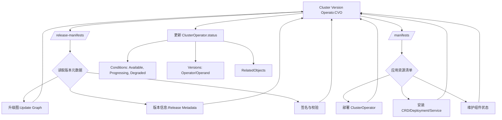
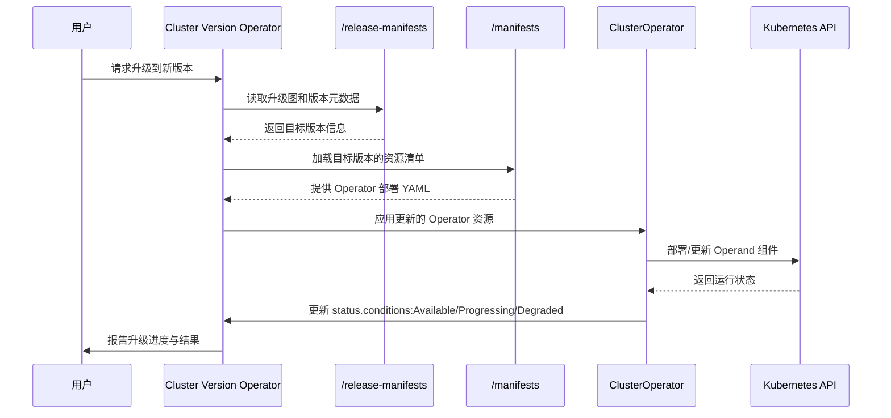
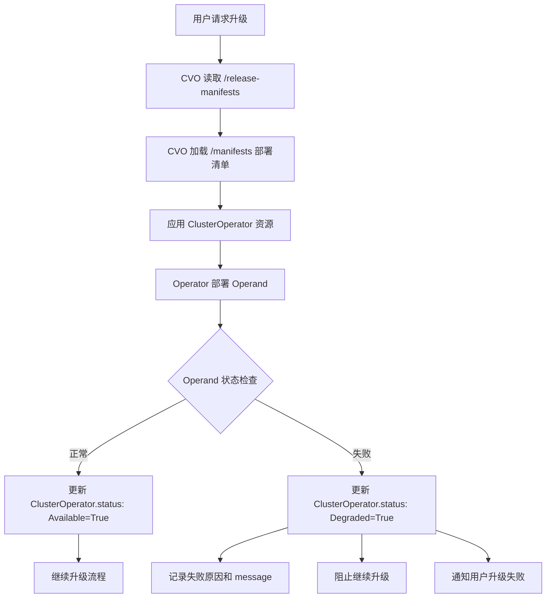
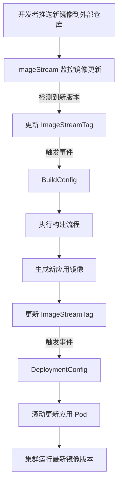
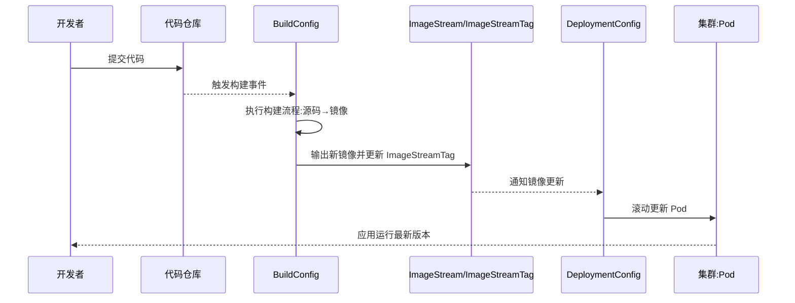
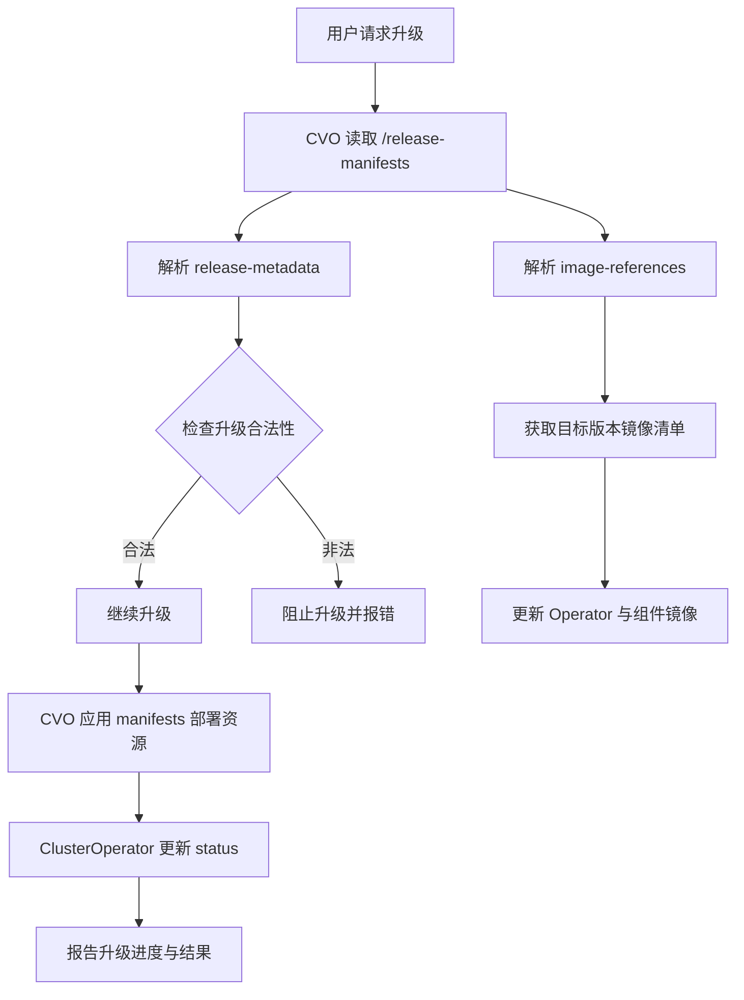

# CVO
## ClusterOperator
**在 OpenShift 中，`ClusterOperator` 的 `status` 字段用于描述某个 Operator 的运行状态、健康状况以及版本信息，是 CVO（Cluster Version Operator）用来协调和监控集群升级的核心机制。它帮助用户和控制器理解 Operator 是否正常工作、是否正在升级、是否出现异常。**
### 📌 `ClusterOperator.status` 字段详解
`status` 是一个复合结构，主要包含以下关键部分：
#### 1. **conditions**
- **作用**：记录 Operator 的健康状态，类似 Kubernetes 资源的 Conditions。
- **常见类型**：
  - `Available`：Operator 是否处于可用状态。
  - `Progressing`：是否正在进行升级或变更。
  - `Degraded`：是否检测到错误或异常。
  - `Upgradeable`：是否允许升级到更高版本。
- **字段结构**：
  - `type`：条件类型（如 Available）。
  - `status`：布尔值或字符串（True/False/Unknown）。
  - `lastTransitionTime`：最近一次状态变化的时间。
  - `reason`：简短的原因描述。
  - `message`：详细说明。
#### 2. **versions**
- **作用**：记录 Operator 当前运行的版本信息。
- **字段结构**：
  - `name`：组件名称（如 operator、operand）。
  - `version`：对应的版本号。
#### 3. **relatedObjects**
- **作用**：列出与该 Operator 相关的 Kubernetes 对象，便于排查和追踪。
- **字段结构**：
  - `group`、`resource`、`name`、`namespace`：标识相关对象。
#### 4. **extension**
- **作用**：为 Operator 提供扩展状态信息，通常由具体 Operator 自定义。
### 📊 示例结构
```yaml
status:
  conditions:
    - type: Available
      status: True
      lastTransitionTime: "2026-03-25T07:00:00Z"
      reason: AsExpected
      message: "The operator is functioning normally."
    - type: Progressing
      status: False
      lastTransitionTime: "2026-03-25T07:00:00Z"
      reason: NoChanges
      message: "No upgrade in progress."
  versions:
    - name: operator
      version: "4.13.0"
    - name: operand
      version: "4.13.0"
  relatedObjects:
    - group: ""
      resource: namespaces
      name: openshift-cluster-version
```
### ⚠️ 使用注意事项
- **只读字段**：`status` 由 Operator 更新，用户不能直接修改。  
- **升级依赖**：CVO 会根据 `Upgradeable` Condition 判断是否允许升级。  
- **监控与告警**：运维人员可通过 `status.conditions` 快速定位问题。  

✅ 总结：`ClusterOperator.status` 是 OpenShift 升级与健康监控的核心接口，包含 **conditions（状态）、versions（版本）、relatedObjects（关联对象）、extension（扩展信息）** 四大部分。它既是 CVO 协调升级的依据，也是运维人员排查问题的关键入口。  

# OpenShift Cluster Version Operator (CVO) 概要设计

## 1. 概述

**Cluster Version Operator (CVO)** 是 OpenShift 4.x 的核心组件，负责管理整个 OpenShift 集群的版本生命周期，包括：
- 集群安装
- 版本升级
- 组件状态监控
- ClusterOperator 生命周期管理

CVO 是 OpenShift "Operator 化"架构的核心实现，将整个集群视为一个由 Operator 组成的分布式系统。

## 2. 架构图

```
┌─────────────────────────────────────────────────────────────────────────────┐
│                         OpenShift Control Plane                             │
├─────────────────────────────────────────────────────────────────────────────┤
│                                                                             │
│  ┌─────────────────────────────────────────────────────────────────────┐   │
│  │              Cluster Version Operator (CVO)                          │   │
│  │  ┌─────────────┐  ┌─────────────┐  ┌─────────────┐                  │   │
│  │  │  Reconciler │  │  Payload    │  │  Status     │                  │   │
│  │  │  Controller │  │  Processor  │  │  Aggregator │                  │   │
│  │  └─────────────┘  └─────────────┘  └─────────────┘                  │   │
│  └─────────────────────────────────────────────────────────────────────┘   │
│         │                    │                    │                         │
│         ▼                    ▼                    ▼                         │
│  ┌─────────────┐    ┌─────────────────┐    ┌─────────────────┐            │
│  │ClusterVersion│    │   Payload       │    │ ClusterOperator │            │
│  │     CRD      │    │   (Release      │    │      CRDs       │            │
│  │              │    │    Image)       │    │                 │            │
│  └─────────────┘    └─────────────────┘    └─────────────────┘            │
│                                                                             │
└─────────────────────────────────────────────────────────────────────────────┘
                                    │
                    ┌───────────────┼───────────────┐
                    ▼               ▼               ▼
            ┌──────────────┐ ┌──────────────┐ ┌──────────────┐
            │   etcd       │ │   dns        │ │  ingress     │
            │  Operator    │ │  Operator    │ │  Operator    │
            └──────────────┘ └──────────────┘ └──────────────┘
            ┌──────────────┐ ┌──────────────┐ ┌──────────────┐
            │  kube-       │ │  monitoring  │ │  console     │
            │  apiserver   │ │  Operator    │ │  Operator    │
            └──────────────┘ └──────────────┘ └──────────────┘
                              ... (更多 ClusterOperator)
```
## 3. 核心概念
### 3.1 ClusterVersion CRD
```yaml
apiVersion: config.openshift.io/v1
kind: ClusterVersion
metadata:
  name: version
spec:
  clusterID: xxxxxxxx-xxxx-xxxx-xxxx-xxxxxxxxxxxx
  desiredUpdate:
    image: quay.io/openshift-release-dev/ocp-release:4.14.0
    version: 4.14.0
  channel: stable-4.14
  upstream: https://api.openshift.com/api/upgrades_info/v1/graph
status:
  availableUpdates:
    - version: 4.14.1
      image: quay.io/openshift-release-dev/ocp-release:4.14.1
  conditions:
    - type: Available
      status: "True"
    - type: Progressing
      status: "False"
    - type: Degraded
      status: "False"
  history:
    - version: 4.13.0
      state: Completed
    - version: 4.14.0
      state: Completed
  desired:
    version: 4.14.0
    image: quay.io/openshift-release-dev/ocp-release:4.14.0
```
### 3.2 ClusterOperator CRD
```yaml
apiVersion: config.openshift.io/v1
kind: ClusterOperator
metadata:
  name: etcd
spec:
status:
  versions:
    - name: operator
      version: 4.14.0
  conditions:
    - type: Available
      status: "True"
      message: "etcd is available"
    - type: Progressing
      status: "False"
    - type: Degraded
      status: "False"
    - type: Upgradeable
      status: "True"
  relatedObjects:
    - group: operator.openshift.io
      resource: etcds
      name: cluster
```
### 3.3 Payload (Release Image)
```
┌─────────────────────────────────────────────────────────────┐
│                  Release Image (Payload)                    │
├─────────────────────────────────────────────────────────────┤
│                                                             │
│  release-manifests/                                         │
│   ├── 0000_50_cluster-version-operator_01_cvo.yaml         │
│   ├── 0000_50_cluster-version-operator_02_cvo-config.yaml  │
│   ├── image-references                                      │
│   └── ...                                                   │
│                                                             │
│  manifests/                                                 │
│   ├── 0000_10_etcd-operator_00_namespace.yaml              │
│   ├── 0000_10_etcd-operator_01_crd.yaml                    │
│   ├── 0000_10_etcd-operator_02_deployment.yaml             │
│   ├── 0000_10_dns-operator_00_namespace.yaml               │
│   ├── 0000_10_dns-operator_01_crd.yaml                     │
│   └── ... (所有 ClusterOperator 的清单)                     │
│                                                             │
│  sha256_xxxxxx (各组件镜像层)                                │
│                                                             │
└─────────────────────────────────────────────────────────────┘
```
## 4. 核心组件设计
### 4.1 CVO 控制器架构
```
┌─────────────────────────────────────────────────────────────────┐
│                    CVO Controller                               │
├─────────────────────────────────────────────────────────────────┤
│                                                                 │
│  ┌──────────────────────────────────────────────────────────┐  │
│  │                    Reconcile Loop                         │  │
│  │                                                           │  │
│  │   1. Watch ClusterVersion CR                              │  │
│  │   2. Fetch Payload from Release Image                     │  │
│  │   3. Parse Manifests                                      │  │
│  │   4. Apply Resources (ordered by name prefix)             │  │
│  │   5. Monitor ClusterOperator Status                       │  │
│  │   6. Update ClusterVersion Status                         │  │
│  │                                                           │  │
│  └──────────────────────────────────────────────────────────┘  │
│                                                                 │
│  ┌──────────────┐  ┌──────────────┐  ┌──────────────┐         │
│  │   Payload    │  │   Manifest   │  │   Status     │         │
│  │   Fetcher    │  │   Applier    │  │   Monitor    │         │
│  └──────────────┘  └──────────────┘  └──────────────┘         │
│                                                                 │
└─────────────────────────────────────────────────────────────────┘
```
### 4.2 Manifest 处理流程
```
┌──────────────────────────────────────────────────────────────────┐
│                    Manifest Processing                           │
├──────────────────────────────────────────────────────────────────┤
│                                                                  │
│  Release Image                                                   │
│       │                                                          │
│       ▼                                                          │
│  ┌─────────────┐                                                │
│  │  Extract    │  ──►  manifests/                               │
│  │  Payload    │       ├── 0000_10_... (优先级高)               │
│  └─────────────┘       ├── 0000_50_... (中等优先级)             │
│                        └── 0000_90_... (低优先级)               │
│       │                                                          │
│       ▼                                                          │
│  ┌─────────────┐                                                │
│  │   Sort by   │  ──► 按文件名前缀排序                          │
│  │   Prefix    │       0000_10 < 0000_50 < 0000_90             │
│  └─────────────┘                                                │
│       │                                                          │
│       ▼                                                          │
│  ┌─────────────┐                                                │
│  │   Apply     │  ──► kubectl apply --server-side               │
│  │   Manifests │       支持幂等操作                              │
│  └─────────────┘                                                │
│                                                                  │
└──────────────────────────────────────────────────────────────────┘
```
## 5. 升级流程
```
┌─────────────────────────────────────────────────────────────────────────────┐
│                         Cluster Upgrade Flow                                 │
├─────────────────────────────────────────────────────────────────────────────┤
│                                                                              │
│  1. 用户触发升级                                                             │
│     oc adm upgrade --to=4.14.1                                               │
│                                                                              │
│     ┌─────────────────────────────────────────────────────────────────┐    │
│     │  ClusterVersion.spec.desiredUpdate = {version: "4.14.1"}        │    │
│     └─────────────────────────────────────────────────────────────────┘    │
│                              │                                               │
│                              ▼                                               │
│  2. CVO 检测到变更                                                           │
│     ┌─────────────────────────────────────────────────────────────────┐    │
│     │  - 拉取新版本 Release Image                                      │    │
│     │  - 解析新版本 Manifests                                          │    │
│     │  - 计算更新策略                                                   │    │
│     └─────────────────────────────────────────────────────────────────┘    │
│                              │                                               │
│                              ▼                                               │
│  3. 逐个更新 ClusterOperator                                                 │
│     ┌─────────────────────────────────────────────────────────────────┐    │
│     │  for each operator in sorted order:                             │    │
│     │      - Apply new manifests                                       │    │
│     │      - Wait for operator Available=True                          │    │
│     │      - Wait for operator Progressing=False                       │    │
│     │      - Wait for operator Degraded=False                          │    │
│     └─────────────────────────────────────────────────────────────────┘    │
│                              │                                               │
│                              ▼                                               │
│  4. 更新状态                                                                 │
│     ┌─────────────────────────────────────────────────────────────────┐    │
│     │  ClusterVersion.status.history:                                  │    │
│     │    - version: 4.14.1                                             │    │
│     │    - state: Completed                                            │    │
│     └─────────────────────────────────────────────────────────────────┘    │
│                                                                              │
└─────────────────────────────────────────────────────────────────────────────┘
```
## 6. CVO 与 OLM 的区别
| 维度 | CVO (Cluster Version Operator) | OLM (Operator Lifecycle Manager) |
|------|-------------------------------|----------------------------------|
| **管理对象** | ClusterOperator (系统级) | 常规 Operator (用户级) |
| **安装时机** | OpenShift 安装时自动部署 | 用户按需安装 |
| **更新来源** | Release Image (Payload) | CatalogSource |
| **更新机制** | 声明式版本升级 | Subscription + InstallPlan |
| **权限范围** | 集群级，所有命名空间 | 可配置，特定命名空间 |
| **状态表示** | ClusterOperator CR | ClusterServiceVersion (CSV) |
## 7. 关键设计特性
### 7.1 声明式版本管理
```yaml
spec:
  desiredUpdate:
    version: 4.14.0
    image: quay.io/openshift-release-dev/ocp-release:4.14.0
```
- 用户声明期望版本，CVO 负责实现
- 支持自动和手动更新模式
### 7.2 组件解耦
```
┌─────────────────────────────────────────────────────────────────┐
│                    组件解耦设计                                  │
├─────────────────────────────────────────────────────────────────┤
│                                                                 │
│  CVO 不直接管理组件，而是通过 ClusterOperator 间接管理:          │
│                                                                 │
│  CVO ──► ClusterOperator CR ──► Operator Controller            │
│                                                                 │
│  例如:                                                          │
│  CVO ──► etcd ClusterOperator ──► etcd-operator ──► etcd pods  │
│                                                                 │
└─────────────────────────────────────────────────────────────────┘
```
### 7.3 状态聚合
```go
type ClusterOperatorStatus struct {
    Conditions []ClusterOperatorStatusCondition
    
    // 条件类型:
    // - Available: 组件是否可用
    // - Progressing: 是否正在更新
    // - Degraded: 是否降级
    // - Upgradeable: 是否可升级
}
```
### 7.4 安全更新
- 支持 `PartialUpgrade`：仅更新部分组件
- 支持 `Paused`：暂停特定组件更新
- 支持回滚到之前版本
## 8. 与 BKE 的对比
| 维度 | OpenShift CVO | BKE (cluster-api-provider-bke) |
|------|---------------|-------------------------------|
| **架构模式** | Operator 模式 | Cluster API Provider 模式 |
| **版本管理** | ClusterVersion CRD | BKECluster CRD |
| **组件管理** | ClusterOperator CRD | 自定义 Controller |
| **升级机制** | Release Image Payload | Manifests + Template |
| **状态监控** | 条件聚合 | Phase 状态机 |
## 9. 总结
**Cluster Version Operator (CVO)** 是 OpenShift 4.x 的核心组件，其设计特点：

1. **声明式版本管理**：通过 ClusterVersion CRD 声明期望版本
2. **Operator 化架构**：所有系统组件都是 Operator，实现解耦
3. **Payload 机制**：通过 Release Image 统一分发所有组件清单
4. **状态聚合**：通过 ClusterOperator CRD 聚合各组件状态
5. **安全升级**：支持渐进式升级、暂停、回滚等操作

CVO 的设计思想对 BKE 的版本管理和升级机制有很好的参考价值。

## ClusterVersion
**在 OpenShift 的 `ClusterVersion` 中，`unmanaged` 模式表示集群版本操作器（CVO）不再自动管理或升级集群，用户需要自行负责更新与维护。这通常用于调试、开发或特殊场景下的手动控制。**
### 📌 `ClusterVersion.spec` 中的 `overrides` 与 `unmanaged`
- 在 `ClusterVersion` 的 `spec.overrides` 字段中，可以对某些组件或 Operator 设置 `unmanaged`。  
- 当某个 Operator 被标记为 `unmanaged` 时：
  - **CVO 不会再升级或修改该 Operator**。  
  - 用户必须手动维护该 Operator 的版本与状态。  
  - 这可能导致集群升级时出现不一致或风险。  
### 🔑 使用场景
- **调试/开发**：当需要测试某个 Operator 的新版本或自定义行为时，可以临时设置为 `unmanaged`。  
- **特殊需求**：某些企业可能需要对特定 Operator 保持自定义版本，不希望被 CVO 自动覆盖。  
### ⚠️ 风险与注意事项
- **升级风险**：如果某个关键 Operator被设置为 `unmanaged`，集群升级可能失败或进入不一致状态。  
- **支持限制**：Red Hat 官方通常不支持长期运行在 `unmanaged` 模式下的集群。  
- **恢复方法**：要恢复自动管理，只需移除 `unmanaged` 设置，CVO 会重新接管该 Operator。  
### 📊 示例配置
```yaml
apiVersion: config.openshift.io/v1
kind: ClusterVersion
metadata:
  name: version
spec:
  overrides:
    - kind: ClusterOperator
      name: authentication
      unmanaged: true
```
在这个例子中，`authentication` Operator 被标记为 `unmanaged`，CVO 将不再自动升级它。

✅ 总结：**`unmanaged` 是一种“手动接管”模式，允许用户绕过 CVO 的自动升级机制，但会带来维护和一致性风险。**它适合短期调试或特殊场景，不建议在生产环境中长期使用。  

## Operator/Operand
**在 Kubernetes / OpenShift 语境中，Operator 是负责管理应用或组件生命周期的控制器，而 Operand 则是 Operator 管理的实际应用或资源。简单来说：Operator 是“管家”，Operand 是“被管的对象”。**
### 📌 Operator
- **定义**：一种扩展 Kubernetes API 的模式，用来自动化复杂应用的部署、升级、监控和修复。  
- **作用**：  
  - 编排应用的整个生命周期（安装、升级、备份、恢复）。  
  - 将人类运维经验编码为自动化逻辑。  
  - 通过 CRD（Custom Resource Definition）与控制器实现。  
- **示例**：  
  - **Cluster Version Operator (CVO)**：管理 OpenShift 集群升级。  
  - **Etcd Operator**：管理 etcd 集群的部署与扩缩容。  
### 📌 Operand
- **定义**：由 Operator 管理的实际应用或资源，即 Operator 的“操作对象”。  
- **作用**：  
  - Operator 通过 CRD 创建和维护 Operand。  
  - Operand 是最终运行的服务或组件。  
- **示例**：  
  - 在 Etcd Operator 中，**etcd 集群**就是 Operand。  
  - 在 Monitoring Operator 中，**Prometheus 实例**就是 Operand。  
### 📊 对比表
| 项目        | Operator | Operand |
|-------------|----------|---------|
| **角色**    | 管理者（控制器） | 被管理对象（应用/资源） |
| **定义方式** | CRD + 控制器逻辑 | CRD 实例（Custom Resource） |
| **功能**    | 部署、升级、监控、修复 | 提供实际服务或功能 |
| **示例**    | Etcd Operator, CVO | etcd 集群, Prometheus 实例 |
### ⚠️ 注意事项
- **Operator 不等于应用本身**：它是应用的“自动化运维工具”。  
- **Operand 依赖 Operator**：如果 Operator 停止维护，Operand 的生命周期管理就需要人工介入。  
- **升级场景**：在 OpenShift 中，ClusterOperator 记录 Operator 状态，而 Operand 的版本信息也会在 `status.versions` 中体现。  

✅ 总结：**Operator 是负责自动化管理的控制器，Operand 是它所管理的实际应用或资源。**两者关系类似于“管理员”和“被管理的服务”。这一区分在 OpenShift 的升级与监控体系中尤为重要。  

## /manifests 与 /release-manifests
**在 OpenShift 中，`/manifests` 与 `/release-manifests` 目录的区别在于：`/manifests` 存放的是集群运行时需要应用的 Operator 与组件的安装清单，而 `/release-manifests` 存放的是整个 OpenShift 版本的发布元数据与升级图信息。前者是“实际部署的资源”，后者是“版本与升级的描述”。**
### 📌 `/manifests` 目录
- **内容**：包含各个 ClusterOperator 的 Kubernetes 资源清单（Deployment、Service、CRD 等）。  
- **作用**：  
  - 用于 CVO（Cluster Version Operator）在集群中应用和维护这些 Operator。  
  - 每个 Operator 的安装与更新都依赖这里的清单。  
- **特点**：  
  - 面向运行时，直接影响集群中实际部署的组件。  
  - 文件通常是 YAML 格式的 Kubernetes manifests。  
### 📌 `/release-manifests` 目录
- **内容**：包含 OpenShift 整个版本的元信息，包括：  
  - **升级图（update graph）**：描述从哪个版本可以升级到哪个版本。  
  - **版本元数据**：如 release image 的标签、组件版本号。  
  - **签名与校验信息**：保证版本的完整性与可信度。  
- **作用**：  
  - 为 CVO 提供升级策略和版本边界。  
  - 确保集群升级过程遵循官方定义的路径。  
- **特点**：  
  - 面向版本管理，不直接部署资源。  
  - 主要用于升级与回滚逻辑。  
### 📊 对比表
| 目录              | 内容类型 | 作用 | 面向对象 |
|-------------------|----------|------|----------|
| **/manifests**    | Operator 与组件的 Kubernetes 资源清单 | 部署和维护集群中的实际组件 | 集群运行时 |
| **/release-manifests** | 版本元数据、升级图、签名信息 | 定义版本升级路径与策略 | 集群升级过程 |
### ⚠️ 注意事项
- **不要混淆**：`/manifests` 是“部署用的 YAML”，`/release-manifests` 是“版本升级的元信息”。  
- **升级风险**：如果手动修改 `/release-manifests`，可能导致集群无法正常升级。  
- **调试场景**：开发者在调试 Operator 时通常关注 `/manifests`，而在研究升级策略时则查看 `/release-manifests`。  

✅ 总结：**`/manifests` 负责集群组件的实际部署，`/release-manifests` 负责版本升级的策略与元数据。**两者共同作用，保证 OpenShift 集群既能正常运行，又能安全升级。  
### CVO 工作流程图
表示它在 OpenShift 中如何处理 `/manifests` 和 `/release-manifests`：  

 📌 图解说明
- **CVO**：核心控制器，负责集群升级与组件部署。  
- **/release-manifests**：提供版本升级图、元数据和签名校验，确保升级路径合法。  
- **/manifests**：包含各 Operator 的 Kubernetes 资源清单，CVO 用它来部署和维护组件。  
- **ClusterOperator.status**：CVO 根据执行结果更新状态，反映集群健康与升级进度。  

这样你就能直观地看到：**`/release-manifests` 决定升级策略，`/manifests` 决定实际部署内容，CVO 在两者之间循环工作并更新状态。**  
### OpenShift 集群升级流程的时序图
表示 CVO 在升级过程中各个步骤的交互：  

📌 图解说明
- **用户**：触发升级请求。  
- **CVO**：核心控制器，负责协调升级。  
- **/release-manifests**：提供升级路径和版本元数据。  
- **/manifests**：提供实际的 Operator 部署清单。  
- **ClusterOperator**：执行具体的 Operator 部署与维护。  
- **Kubernetes API**：最终应用资源并返回运行状态。  

这样你可以直观地看到：升级流程从用户请求开始，CVO 读取版本信息，应用新的 Operator 清单，更新 Operand，最后通过 `ClusterOperator.status` 报告升级进度。  
### 升级失败的分支流程图
展示当某个 Operator 出现 `Degraded` 状态时，CVO 如何处理：  

 📌 图解说明
- **正常路径**：Operand 部署成功，ClusterOperator 报告 `Available=True`，升级继续。  
- **失败路径**：Operand 部署失败，ClusterOperator 报告 `Degraded=True`，CVO 会：  
  - 在 `status.conditions` 中写入失败原因和详细信息。  
  - 阻止继续升级，避免集群进入不一致状态。  
  - 通知用户升级失败，需要人工介入或修复。  

这样你就能直观地看到：**一旦某个 Operator 出现 `Degraded`，CVO 会立即中断升级并报告错误，确保集群安全。**  

## ImageStream
**在 OpenShift 中，ImageStream 的作用是为镜像提供一个“逻辑引用层”，让你在集群内部通过标签来管理和追踪镜像版本，而不是直接依赖外部镜像地址。它能触发自动构建和部署，使应用始终保持最新镜像。**  [docs.redhat.com](https://docs.redhat.com/en/documentation/openshift_container_platform/4.18/html/images/managing-image-streams)  [Tutorial Works](https://www.tutorialworks.com/openshift-imagestreams/)  [Devopsschool.com](https://www.devopsschool.com/blog/what-is-imagestreams-step-by-step-tutorials/)  
### 🔑 ImageStream 的核心作用
- **镜像引用管理**：ImageStream 并不存储镜像本身，而是保存镜像的引用（通常是外部仓库的镜像地址），并通过标签（tags）来标识不同版本。  
- **版本追踪**：当外部镜像更新时，ImageStream 可以检测到变化，并更新对应的 tag。  
- **自动触发**：结合 BuildConfig 或 DeploymentConfig，ImageStream 的更新可以触发自动构建或应用滚动更新。  
- **集群内统一入口**：开发者和运维人员可以通过 ImageStream 名称来引用镜像，而不必关心具体的外部仓库地址。  
### 📊 与直接使用镜像的区别
| 使用方式 | 特点 | 缺点 |
|----------|------|------|
| **直接使用镜像地址** | Pod 直接拉取 `nginx:latest` | Kubernetes 不会自动检测镜像更新，需手动重启或 rollout |
| **使用 ImageStream** | 通过 `ImageStreamTag` 引用镜像，自动追踪更新 | 需要额外的 OpenShift 配置，但能实现自动化和版本管理 |
### 📌 使用场景
- **CI/CD 流程**：当构建完成并推送新镜像时，ImageStream 更新触发新的部署。  
- **版本管理**：通过 `ImageStreamTag` 管理不同版本（如 `frontend:v1`、`frontend:v2`）。  
- **隔离与安全**：集群内部统一使用 ImageStream 引用，避免直接暴露外部镜像仓库地址。  
### ⚠️ 注意事项
- **不是镜像仓库**：ImageStream 不存储镜像，只是引用和管理。  
- **依赖 OpenShift 特性**：这是 OpenShift 特有的功能，原生 Kubernetes 没有 ImageStream。  
- **更新策略**：要结合 BuildConfig/DeploymentConfig 才能发挥自动化优势。  

✅ 总结：**ImageStream 是 OpenShift 的镜像管理抽象层，提供版本追踪、自动触发和统一引用入口。它让应用在集群内始终保持最新镜像，而无需手动干预。**  
### ImageStream 与 BuildConfig/DeploymentConfig 的交互流程图
直观展示它如何触发自动构建和部署：  

📌 图解说明
- **ImageStream**：监控外部镜像仓库或构建结果，一旦发现新镜像就更新 `ImageStreamTag`。  
- **BuildConfig**：当 ImageStream 更新时，可以触发新的构建流程，生成应用镜像。  
- **DeploymentConfig**：当 ImageStreamTag 更新时，会触发应用的滚动更新，确保 Pod 使用最新镜像。  
- **最终效果**：开发者只需推送新镜像，OpenShift 就能自动完成构建与部署更新。  

这样你就能直观地看到：**ImageStream 是连接镜像更新、构建和部署的桥梁**，让 CI/CD 流程在 OpenShift 中实现自动化。  

## ImageStream/ImageStreamTag 与 BuildConfig/DeploymentConfig
在 OpenShift 中，**ImageStream/ImageStreamTag 与 BuildConfig/DeploymentConfig 是实现自动化构建与部署的关键组合**。它们之间的关系可以这样理解：  
### 📌 ImageStream / ImageStreamTag
- **ImageStream**：镜像的逻辑引用层，不存储镜像本身，而是追踪镜像的版本。  
- **ImageStreamTag**：ImageStream 的具体版本标签，例如 `frontend:latest` 或 `frontend:v1`。  
- **作用**：当镜像更新时，ImageStreamTag 会变化，并触发相关的构建或部署。  
### 📌 BuildConfig
- **作用**：定义应用的构建流程（源码 → 镜像）。  
- **与 ImageStreamTag 的关系**：  
  - 可以指定某个 ImageStreamTag 作为 **构建基础镜像**。  
  - 构建完成后会将新镜像写入目标 ImageStreamTag。  
- **效果**：镜像更新后，ImageStreamTag 变化，触发后续部署。  
### 📌 DeploymentConfig
- **作用**：定义应用的部署策略（副本数、滚动更新等）。  
- **与 ImageStreamTag 的关系**：  
  - 使用某个 ImageStreamTag 作为应用运行镜像。  
  - 当该 ImageStreamTag 更新时，DeploymentConfig 会触发滚动更新，确保 Pod 使用最新镜像。  
### 📊 三者关系总结
| 组件 | 作用 | 与 ImageStreamTag 的关系 |
|------|------|----------------------|
| **ImageStream** | 镜像版本追踪与事件触发 | 提供统一引用入口 |
| **BuildConfig** | 定义构建流程，生成镜像 | 输入/输出依赖 ImageStreamTag |
| **DeploymentConfig** | 定义部署策略，管理 Pod | 使用 ImageStreamTag 作为运行镜像 |
### 📌 示例说明
假设你有一个前端应用：  
1. **BuildConfig** 定义：  
   - 使用 `nodejs:14` 作为基础镜像（来自 ImageStreamTag）。  
   - 构建完成后输出镜像到 `frontend:latest` ImageStreamTag。  
2. **ImageStream**：  
   - 管理 `frontend` 镜像的版本。  
   - 当构建完成时，`frontend:latest` 更新。  
3. **DeploymentConfig**：  
   - 使用 `frontend:latest` 作为应用运行镜像。  
   - 当 `frontend:latest` 更新时，自动触发滚动更新 Pod。  
### 📌 示例 YAML 片段
```yaml
apiVersion: build.openshift.io/v1
kind: BuildConfig
metadata:
  name: frontend-build
spec:
  output:
    to:
      kind: ImageStreamTag
      name: frontend:latest
---
apiVersion: apps.openshift.io/v1
kind: DeploymentConfig
metadata:
  name: frontend-deploy
spec:
  template:
    spec:
      containers:
      - name: frontend
        image: frontend:latest
```
✅ 总结：**ImageStreamTag 是连接 BuildConfig 与 DeploymentConfig 的纽带**。BuildConfig 负责生成镜像并更新 ImageStreamTag，DeploymentConfig 监听该标签变化并自动更新 Pod，从而实现完整的 CI/CD 流程。  
### CI/CD 时序图
展示从“代码提交 → 构建 → 镜像更新 → 部署更新”的全过程：  

 📌 图解说明
1. **开发者提交代码** → 推送到 Git 仓库。  
2. **BuildConfig** 检测到代码变更 → 执行构建流程，生成新镜像。  
3. **ImageStreamTag 更新** → 记录新镜像版本。  
4. **DeploymentConfig** 监听到 ImageStreamTag 更新 → 自动触发滚动更新。  
5. **集群 Pod 更新** → 应用运行最新镜像版本，完成 CI/CD 流程。  

这样你就能直观地看到：**ImageStream 是连接构建与部署的桥梁，BuildConfig 负责生成镜像，DeploymentConfig 负责应用更新。**  

## /release-manifests中的image-references与release-metadata
在 OpenShift 的 **`/release-manifests`** 目录中，常见的两个关键文件是 **`image-references`** 和 **`release-metadata`**，它们分别承担不同的作用：  
### 📌 `image-references`
- **内容**：列出该版本所包含的所有镜像引用。  
- **结构**：通常是一个 YAML 文件，包含镜像名称、标签、以及对应的 registry 地址。  
- **作用**：  
  - 为 CVO 提供集群升级时需要拉取的镜像清单。  
  - 确保集群中每个 Operator 和组件都能找到对应的镜像。  
  - 在升级过程中，CVO 会根据 `image-references` 来更新各个组件的镜像版本。  

**示例片段：**
```yaml
kind: ImageStream
metadata:
  name: cluster-version-operator
spec:
  tags:
    - name: v4.13.0
      from:
        kind: DockerImage
        name: quay.io/openshift/cluster-version-operator:v4.13.0
```
### 📌 `release-metadata`
- **内容**：描述该 OpenShift 版本的元信息。  
- **字段**：  
  - `metadata.name`：版本号，例如 `4.13.0`。  
  - `metadata.creationTimestamp`：版本构建时间。  
  - `metadata.description`：版本说明。  
  - `metadata.upgrades`：可升级的目标版本范围。  
- **作用**：  
  - 为 CVO 提供升级策略和版本边界。  
  - 确保集群升级遵循官方定义的路径。  
  - 用于校验当前集群是否允许升级到目标版本。  

**示例片段：**
```yaml
metadata:
  name: 4.13.0
  creationTimestamp: "2026-03-01T12:00:00Z"
  description: "OpenShift 4.13.0 release"
  upgrades:
    - 4.12.0
    - 4.12.5
```
### 📊 对比总结
| 文件 | 内容 | 作用 |
|------|------|------|
| **image-references** | 镜像清单（Operator/组件镜像） | 提供升级时需要的镜像地址 |
| **release-metadata** | 版本元信息（版本号、升级路径、说明） | 定义升级策略与版本边界 |
✅ 总结：**`image-references` 是镜像层面的清单，`release-metadata` 是版本层面的描述。**前者保证升级时镜像可用，后者保证升级路径合法，两者共同作用，确保 OpenShift 集群升级安全、可控。  
### 流程图
展示 CVO 如何同时使用 `/release-manifests` 中的 `image-references` 与 `release-metadata` 来完成升级：  

📌 图解说明
- **release-metadata**：提供版本号、升级路径、合法性校验。CVO 会先检查当前版本是否允许升级到目标版本。  
- **image-references**：提供目标版本所需的镜像清单。CVO 根据它来拉取并更新各个 Operator 与组件的镜像。  
- **升级流程**：  
  1. 用户请求升级。  
  2. CVO 读取 `release-metadata` → 校验升级合法性。  
  3. CVO 读取 `image-references` → 获取镜像清单。  
  4. 应用 `/manifests` 部署资源。  
  5. 更新 `ClusterOperator.status` → 报告升级进度。  

这样你就能直观地看到：**`release-metadata` 决定能不能升级，`image-references` 决定升级用哪些镜像，CVO 将两者结合来完成整个升级过程。**  


# OpenShift Cluster Version Operator (CVO) 详细设计

## 1. 概述

### 1.1 设计目标

Cluster Version Operator (CVO) 是 OpenShift 4.x 的核心组件，负责：
- 管理 OpenShift 集群的完整生命周期
- 协调所有 ClusterOperator 的安装和升级
- 提供声明式的版本管理能力
- 实现安全、可控的集群升级流程

### 1.2 核心特性

| 特性 | 描述 |
|------|------|
| **声明式版本管理** | 通过 ClusterVersion CRD 声明期望版本 |
| **Payload 机制** | 通过 Release Image 统一分发所有组件清单 |
| **Runlevel 分级** | 按优先级分阶段应用 Manifest |
| **状态聚合** | 聚合所有 ClusterOperator 的健康状态 |
| **安全升级** | 支持渐进式升级、暂停、回滚 |

## 2. 架构设计

### 2.1 整体架构

```
┌─────────────────────────────────────────────────────────────────────────────────┐
│                              OpenShift Control Plane                            │
├─────────────────────────────────────────────────────────────────────────────────┤
│                                                                                 │
│  ┌─────────────────────────────────────────────────────────────────────────┐   │
│  │                    Cluster Version Operator (CVO)                        │   │
│  │  ┌─────────────┐  ┌─────────────┐  ┌─────────────┐  ┌─────────────┐    │   │
│  │  │   Reconcile │  │   Payload   │  │   Manifest  │  │   Status    │    │   │
│  │  │   Loop      │  │   Manager   │  │   Applier   │  │   Monitor   │    │   │
│  │  └─────────────┘  └─────────────┘  └─────────────┘  └─────────────┘    │   │
│  │                                                                         │   │
│  │  ┌─────────────┐  ┌─────────────┐  ┌─────────────┐  ┌─────────────┐    │   │
│  │  │   Update    │  │   Operator  │  │   Condition │  │   Override  │    │   │
│  │  │   Graph     │  │   Status    │  │   Manager   │  │   Handler   │    │   │
│  │  │   Client    │  │   Tracker   │  │             │  │             │    │   │
│  │  └─────────────┘  └─────────────┘  └─────────────┘  └─────────────┘    │   │
│  └─────────────────────────────────────────────────────────────────────────┘   │
│         │                    │                    │                    │        │
│         ▼                    ▼                    ▼                    ▼        │
│  ┌─────────────┐    ┌─────────────────┐    ┌─────────────────┐    ┌────────┐  │
│  │ClusterVersion│    │   Release       │    │ ClusterOperator │    │ Config │  │
│  │     CRD      │    │   Image         │    │      CRDs       │    │  Maps  │  │
│  │ (config.open-│    │   (Payload)     │    │ (config.open-   │    │        │  │
│  │  shift.io)   │    │                 │    │  shift.io)      │    │        │  │
│  └─────────────┘    └─────────────────┘    └─────────────────┘    └────────┘  │
│                                                                                 │
│  ┌─────────────────────────────────────────────────────────────────────────┐   │
│  │                         ClusterOperators                                 │   │
│  │  ┌──────────┐ ┌──────────┐ ┌──────────┐ ┌──────────┐ ┌──────────┐      │   │
│  │  │   etcd   │ │   dns    │ │ ingress  │ │ console  │ │monitoring│      │   │
│  │  │ Operator │ │ Operator │ │ Operator │ │ Operator │ │ Operator │      │   │
│  │  └──────────┘ └──────────┘ └──────────┘ └──────────┘ └──────────┘      │   │
│  │  ┌──────────┐ ┌──────────┐ ┌──────────┐ ┌──────────┐ ┌──────────┐      │   │
│  │  │  kube-   │ │  api-    │ │ machine- │ │ network  │ │  cvo     │      │   │
│  │  │apiserver │ │ server   │ │  config  │ │ operator │ │(self)    │      │   │
│  │  └──────────┘ └──────────┘ └──────────┘ └──────────┘ └──────────┘      │   │
│  └─────────────────────────────────────────────────────────────────────────┘   │
│                                                                                 │
└─────────────────────────────────────────────────────────────────────────────────┘
```

### 2.2 组件交互图

```
┌─────────────────────────────────────────────────────────────────────────────┐
│                           CVO 组件交互流程                                   │
├─────────────────────────────────────────────────────────────────────────────┤
│                                                                             │
│  用户/管理员                                                                │
│       │                                                                     │
│       │ oc adm upgrade --to=4.14.1                                          │
│       ▼                                                                     │
│  ┌─────────────┐                                                           │
│  │ClusterVersion│ ◄───── CVO Watch                                         │
│  │     CR       │                                                          │
│  └─────────────┘                                                           │
│       │                                                                     │
│       │ spec.desiredUpdate.version = "4.14.1"                              │
│       ▼                                                                     │
│  ┌─────────────────────────────────────────────────────────────────────┐   │
│  │                         CVO Reconcile Loop                           │   │
│  │                                                                     │   │
│  │  1. Fetch Release Image                                             │   │
│  │     ┌─────────────┐                                                 │   │
│  │     │   Payload   │ ◄── quay.io/openshift-release-dev/ocp-release  │   │
│  │     │   Manager   │                                                 │   │
│  │     └─────────────┘                                                 │   │
│  │           │                                                         │   │
│  │           ▼                                                         │   │
│  │  2. Extract & Parse Manifests                                       │   │
│  │     ┌─────────────┐                                                 │   │
│  │     │  Manifest   │ ──► Sort by Runlevel (0000_10, 0000_50...)     │   │
│  │     │  Processor  │                                                 │   │
│  │     └─────────────┘                                                 │   │
│  │           │                                                         │   │
│  │           ▼                                                         │   │
│  │  3. Apply Manifests (Runlevel by Runlevel)                          │   │
│  │     ┌─────────────┐                                                 │   │
│  │     │  Manifest   │ ──► kubectl apply --server-side                 │   │
│  │     │  Applier    │                                                 │   │
│  │     └─────────────┘                                                 │   │
│  │           │                                                         │   │
│  │           ▼                                                         │   │
│  │  4. Monitor ClusterOperator Status                                  │   │
│  │     ┌─────────────┐                                                 │   │
│  │     │   Status    │ ──► Wait for Available=True, Progressing=False  │   │
│  │     │   Monitor   │                                                 │   │
│  │     └─────────────┘                                                 │   │
│  │           │                                                         │   │
│  │           ▼                                                         │   │
│  │  5. Update ClusterVersion Status                                    │   │
│  │     ┌─────────────┐                                                 │   │
│  │     │   Status    │ ──► Update history, conditions                  │   │
│  │     │   Updater   │                                                 │   │
│  │     └─────────────┘                                                 │   │
│  │                                                                     │   │
│  └─────────────────────────────────────────────────────────────────────┘   │
│                                                                             │
└─────────────────────────────────────────────────────────────────────────────┘
```

## 3. 核心数据结构

### 3.1 ClusterVersion CRD

```go
type ClusterVersion struct {
    metav1.TypeMeta   `json:",inline"`
    metav1.ObjectMeta `json:"metadata,omitempty"`

    Spec   ClusterVersionSpec   `json:"spec,omitempty"`
    Status ClusterVersionStatus `json:"status,omitempty"`
}

type ClusterVersionSpec struct {
    ClusterID string `json:"clusterID"`
    
    DesiredUpdate *Update `json:"desiredUpdate,omitempty"`
    
    Channel string `json:"channel,omitempty"`
    
    Upstream string `json:"upstream,omitempty"`
    
    Overrides []ComponentOverride `json:"overrides,omitempty"`
}

type Update struct {
    Version string `json:"version"`
    Image   string `json:"image"`
    Force   bool   `json:"force,omitempty"`
}

type ComponentOverride struct {
    Kind      string `json:"kind"`
    Name      string `json:"name"`
    Namespace string `json:"namespace,omitempty"`
    Unmanaged bool   `json:"unmanaged"`
    Force     bool   `json:"force,omitempty"`
}

type ClusterVersionStatus struct {
    Desired Version `json:"desired"`
    
    History []UpdateHistory `json:"history"`
    
    AvailableUpdates []Update `json:"availableUpdates,omitempty"`
    
    Conditions []metav1.Condition `json:"conditions,omitempty"`
}

type UpdateHistory struct {
    Version    string          `json:"version"`
    Image      string          `json:"image"`
    State      UpdateState     `json:"state"`
    Started    metav1.Time     `json:"startedTime"`
    Completion *metav1.Time    `json:"completionTime,omitempty"`
}

type UpdateState string

const (
    UpdateStateCompleted UpdateState = "Completed"
    UpdateStatePartial   UpdateState = "Partial"
    UpdateStatePending   UpdateState = "Pending"
)
```

### 3.2 ClusterOperator CRD

```go
type ClusterOperator struct {
    metav1.TypeMeta   `json:",inline"`
    metav1.ObjectMeta `json:"metadata,omitempty"`

    Spec   ClusterOperatorSpec   `json:"spec,omitempty"`
    Status ClusterOperatorStatus `json:"status,omitempty"`
}

type ClusterOperatorSpec struct {
    ManagementState ManagementState `json:"managementState,omitempty"`
}

type ManagementState string

const (
    Managed    ManagementState = "Managed"
    Unmanaged  ManagementState = "Unmanaged"
    Removed    ManagementState = "Removed"
)

type ClusterOperatorStatus struct {
    Versions []OperandVersion `json:"versions,omitempty"`
    
    Conditions []ClusterOperatorStatusCondition `json:"conditions,omitempty"`
    
    RelatedObjects []ObjectReference `json:"relatedObjects,omitempty"`
    
    Extension runtime.RawExtension `json:"extension,omitempty"`
}

type OperandVersion struct {
    Name    string `json:"name"`
    Version string `json:"version"`
}

type ClusterOperatorStatusCondition struct {
    Type               ConditionStatus   `json:"type"`
    Status             corev1.ConditionStatus `json:"status"`
    Reason             string `json:"reason,omitempty"`
    Message            string `json:"message,omitempty"`
    LastTransitionTime metav1.Time `json:"lastTransitionTime,omitempty"`
}

type ConditionStatus string

const (
    ConditionAvailable   ConditionStatus = "Available"
    ConditionProgressing ConditionStatus = "Progressing"
    ConditionDegraded    ConditionStatus = "Degraded"
    ConditionUpgradeable ConditionStatus = "Upgradeable"
)
```

### 3.3 Release Image (Payload) 结构

```
┌─────────────────────────────────────────────────────────────────────────────┐
│                         Release Image 结构                                   │
├─────────────────────────────────────────────────────────────────────────────┤
│                                                                             │
│  quay.io/openshift-release-dev/ocp-release:4.14.0                           │
│                                                                             │
│  ├── release-manifests/                                                     │
│  │   ├── 0000_00_cluster-version-operator_01_cvo-crd.yaml                  │
│  │   ├── 0000_00_cluster-version-operator_02_cvo-deployment.yaml           │
│  │   ├── image-references                                                   │
│  │   └── release-metadata                                                   │
│  │                                                                         │
│  ├── manifests/                                                             │
│  │   ├── 0000_10_etcd-operator_00_namespace.yaml                           │
│  │   ├── 0000_10_etcd-operator_01_crd.yaml                                 │
│  │   ├── 0000_10_etcd-operator_02_rbac.yaml                                │
│  │   ├── 0000_10_etcd-operator_03_deployment.yaml                          │
│  │   ├── 0000_10_dns-operator_00_namespace.yaml                            │
│  │   ├── 0000_10_dns-operator_01_crd.yaml                                  │
│  │   ├── 0000_50_cluster-openshift-controller_...                          │
│  │   ├── 0000_90_cluster-openshift-ingress_...                             │
│  │   └── ... (所有 ClusterOperator 的清单)                                  │
│  │                                                                         │
│  └── sha256:xxxxx (各组件镜像层)                                             │
│                                                                             │
└─────────────────────────────────────────────────────────────────────────────┘
```

### 3.4 Manifest 文件命名规范

```
┌─────────────────────────────────────────────────────────────────────────────┐
│                    Manifest 文件命名规范                                     │
├─────────────────────────────────────────────────────────────────────────────┤
│                                                                             │
│  格式: 0000_XX_operator-name_YY_resource-type.yaml                          │
│                                                                             │
│  ┌─────────────────────────────────────────────────────────────────────┐   │
│  │  0000_10_etcd-operator_01_crd.yaml                                  │   │
│  │  │     │              │   └── 资源序号 + 类型                         │   │
│  │  │     │              └── Operator 名称                              │   │
│  │  │     └── Runlevel (优先级，数字越小越先执行)                        │   │
│  │  └── 固定前缀                                                        │   │
│  └─────────────────────────────────────────────────────────────────────┘   │
│                                                                             │
│  Runlevel 分级:                                                             │
│  ├── 0000_00_... : CRD 定义 (最先执行)                                      │
│  ├── 0000_01_... : RBAC 定义                                               │
│  ├── 0000_10_... : 核心组件 (etcd, dns, kube-apiserver)                    │
│  ├── 0000_50_... : 中等优先级组件                                          │
│  └── 0000_90_... : 低优先级组件 (最后执行)                                  │
│                                                                             │
└─────────────────────────────────────────────────────────────────────────────┘
```

## 4. 核心模块设计

### 4.1 Reconcile Loop

```go
func (c *ClusterVersionOperator) Reconcile(ctx context.Context, req ctrl.Request) (ctrl.Result, error) {
    cv := &configv1.ClusterVersion{}
    if err := c.client.Get(ctx, req.NamespacedName, cv); err != nil {
        return ctrl.Result{}, client.IgnoreNotFound(err)
    }

    if cv.Spec.DesiredUpdate == nil {
        return ctrl.Result{}, nil
    }

    desiredVersion := cv.Spec.DesiredUpdate.Version
    currentVersion := cv.Status.Desired.Version

    if desiredVersion == currentVersion {
        return c.monitorClusterOperators(ctx, cv)
    }

    return c.performUpdate(ctx, cv)
}

func (c *ClusterVersionOperator) performUpdate(ctx context.Context, cv *configv1.ClusterVersion) (ctrl.Result, error) {
    payload, err := c.payloadManager.Fetch(ctx, cv.Spec.DesiredUpdate.Image)
    if err != nil {
        return ctrl.Result{}, fmt.Errorf("failed to fetch payload: %w", err)
    }

    manifests, err := c.manifestProcessor.ExtractAndSort(payload)
    if err != nil {
        return ctrl.Result{}, fmt.Errorf("failed to extract manifests: %w", err)
    }

    for runlevel, runlevelManifests := range manifests.ByRunlevel() {
        if err := c.applyRunlevel(ctx, runlevel, runlevelManifests); err != nil {
            return ctrl.Result{}, fmt.Errorf("failed to apply runlevel %d: %w", runlevel, err)
        }

        if err := c.waitForRunlevelCompletion(ctx, runlevel); err != nil {
            return ctrl.Result{RequeueAfter: 10 * time.Second}, nil
        }
    }

    c.updateClusterVersionStatus(ctx, cv, desiredVersion)
    return ctrl.Result{}, nil
}
```

### 4.2 Payload Manager

```go
type PayloadManager interface {
    Fetch(ctx context.Context, image string) (*Payload, error)
    Extract(payload *Payload) ([]byte, error)
    Verify(payload *Payload) error
}

type payloadManager struct {
    imageRegistry imageRegistry
    cache         payloadCache
}

func (p *payloadManager) Fetch(ctx context.Context, image string) (*Payload, error) {
    if cached, ok := p.cache.Get(image); ok {
        return cached, nil
    }

    ref, err := parseImageReference(image)
    if err != nil {
        return nil, err
    }

    manifest, err := p.imageRegistry.PullManifest(ctx, ref)
    if err != nil {
        return nil, err
    }

    payload := &Payload{
        Image:    image,
        Manifest: manifest,
        Layers:   make(map[string][]byte),
    }

    for _, layer := range manifest.Layers {
        data, err := p.imageRegistry.PullLayer(ctx, ref, layer)
        if err != nil {
            return nil, err
        }
        payload.Layers[layer.Digest] = data
    }

    p.cache.Set(image, payload)
    return payload, nil
}
```

### 4.3 Manifest Processor

```go
type ManifestProcessor interface {
    ExtractAndSort(payload *Payload) (*SortedManifests, error)
    Apply(ctx context.Context, manifest *unstructured.Unstructured) error
}

type manifestProcessor struct {
    client    client.Client
    applier   *apply.Applier
    overrides []ComponentOverride
}

type SortedManifests struct {
    manifests map[int][]*unstructured.Unstructured
}

func (m *manifestProcessor) ExtractAndSort(payload *Payload) (*SortedManifests, error) {
    sorted := &SortedManifests{
        manifests: make(map[int][]*unstructured.Unstructured),
    }

    for _, layer := range payload.Layers {
        tarReader := tar.NewReader(bytes.NewReader(layer))
        
        for {
            header, err := tarReader.Next()
            if err == io.EOF {
                break
            }
            if err != nil {
                return nil, err
            }

            if !strings.HasPrefix(header.Name, "manifests/") {
                continue
            }

            data, err := io.ReadAll(tarReader)
            if err != nil {
                return nil, err
            }

            obj := &unstructured.Unstructured{}
            if err := yaml.Unmarshal(data, obj); err != nil {
                continue
            }

            runlevel := m.extractRunlevel(header.Name)
            sorted.manifests[runlevel] = append(sorted.manifests[runlevel], obj)
        }
    }

    return sorted, nil
}

func (m *manifestProcessor) extractRunlevel(filename string) int {
    parts := strings.Split(filename, "_")
    if len(parts) < 2 {
        return 50
    }
    
    runlevel, err := strconv.Atoi(parts[1])
    if err != nil {
        return 50
    }
    
    return runlevel
}

func (m *manifestProcessor) Apply(ctx context.Context, obj *unstructured.Unstructured) error {
    if m.isOverridden(obj) {
        return nil
    }

    return m.applier.Apply(ctx, obj, apply.Options{
        ServerSideApply: true,
        ForceOwnership:  true,
    })
}
```

### 4.4 Status Monitor

```go
type StatusMonitor interface {
    WatchClusterOperator(ctx context.Context, name string) error
    GetClusterOperatorStatus(ctx context.Context, name string) (*ClusterOperatorStatus, error)
    AggregateStatus(ctx context.Context) (*AggregatedStatus, error)
}

type statusMonitor struct {
    client client.Client
    cache  statusCache
}

type AggregatedStatus struct {
    Available   bool
    Progressing bool
    Degraded    bool
    Details     []OperatorStatusDetail
}

func (s *statusMonitor) AggregateStatus(ctx context.Context) (*AggregatedStatus, error) {
    operators := &configv1.ClusterOperatorList{}
    if err := s.client.List(ctx, operators); err != nil {
        return nil, err
    }

    aggregated := &AggregatedStatus{
        Available:   true,
        Progressing: false,
        Degraded:    false,
        Details:     make([]OperatorStatusDetail, 0),
    }

    for _, co := range operators.Items {
        detail := OperatorStatusDetail{
            Name: co.Name,
        }

        for _, cond := range co.Status.Conditions {
            switch cond.Type {
            case configv1.OperatorAvailable:
                if cond.Status != corev1.ConditionTrue {
                    aggregated.Available = false
                }
                detail.Available = cond.Status == corev1.ConditionTrue
                
            case configv1.OperatorProgressing:
                if cond.Status == corev1.ConditionTrue {
                    aggregated.Progressing = true
                }
                detail.Progressing = cond.Status == corev1.ConditionTrue
                
            case configv1.OperatorDegraded:
                if cond.Status == corev1.ConditionTrue {
                    aggregated.Degraded = true
                }
                detail.Degraded = cond.Status == corev1.ConditionTrue
            }
        }

        aggregated.Details = append(aggregated.Details, detail)
    }

    return aggregated, nil
}
```

### 4.5 Update Graph Client

```go
type UpdateGraphClient interface {
    FetchAvailableUpdates(ctx context.Context, currentVersion string, channel string) ([]Update, error)
    ValidateUpdatePath(ctx context.Context, from, to string) error
}

type updateGraphClient struct {
    upstream string
    client   *http.Client
}

func (u *updateGraphClient) FetchAvailableUpdates(ctx context.Context, currentVersion, channel string) ([]Update, error) {
    url := fmt.Sprintf("%s/api/upgrades_info/v1/graph?channel=%s&version=%s", 
        u.upstream, channel, currentVersion)

    req, err := http.NewRequestWithContext(ctx, "GET", url, nil)
    if err != nil {
        return nil, err
    }

    resp, err := u.client.Do(req)
    if err != nil {
        return nil, err
    }
    defer resp.Body.Close()

    var graph UpdateGraph
    if err := json.NewDecoder(resp.Body).Decode(&graph); err != nil {
        return nil, err
    }

    return u.findAvailableUpdates(currentVersion, &graph), nil
}

type UpdateGraph struct {
    Nodes []Node `json:"nodes"`
    Edges []Edge `json:"edges"`
}

type Node struct {
    Version string `json:"version"`
    Image   string `json:"payload"`
}

type Edge struct {
    From int `json:"from"`
    To   int `json:"to"`
}
```

## 5. 升级流程详细设计

### 5.1 升级状态机

```
┌─────────────────────────────────────────────────────────────────────────────┐
│                           升级状态机                                         │
├─────────────────────────────────────────────────────────────────────────────┤
│                                                                             │
│  ┌──────────┐    用户触发升级    ┌──────────┐                              │
│  │  Idle    │ ──────────────────►│Checking  │                              │
│  │ (空闲)   │                    │Updates   │                              │
│  └──────────┘                    └──────────┘                              │
│       ▲                                │                                    │
│       │                                │ 检查通过                            │
│       │                                ▼                                    │
│       │                         ┌──────────┐                               │
│       │                         │ Fetching │                               │
│       │                         │ Payload  │                               │
│       │                         └──────────┘                               │
│       │                                │                                    │
│       │                                │ Payload 下载完成                     │
│       │                                ▼                                    │
│       │                         ┌──────────┐                               │
│       │                         │ Applying │                               │
│       │                         │Manifests │                               │
│       │                         └──────────┘                               │
│       │                                │                                    │
│       │                                │ Manifests 应用完成                   │
│       │                                ▼                                    │
│       │                         ┌──────────┐                               │
│       │                         │ Waiting  │                               │
│       │                         │Operators │                               │
│       │                         └──────────┘                               │
│       │                                │                                    │
│       │                                │ 所有 Operator 就绪                   │
│       │                                ▼                                    │
│       │                         ┌──────────┐                               │
│       └─────────────────────────│Completed │                               │
│                                   └──────────┘                               │
│                                                                             │
│  错误状态:                                                                   │
│  ┌──────────┐                                                              │
│  │ Degraded │ ◄─── 任何阶段失败                                            │
│  └──────────┘                                                              │
│                                                                             │
└─────────────────────────────────────────────────────────────────────────────┘
```

### 5.2 Runlevel 执行流程

```
┌─────────────────────────────────────────────────────────────────────────────┐
│                      Runlevel 执行流程                                       │
├─────────────────────────────────────────────────────────────────────────────┤
│                                                                             │
│  Runlevel 00 (CRD 定义)                                                     │
│  ┌─────────────────────────────────────────────────────────────────────┐   │
│  │  0000_00_cluster-version-operator_01_cvo-crd.yaml                   │   │
│  │  0000_00_cluster-operator_01_clusteroperator-crd.yaml               │   │
│  │  ...                                                                 │   │
│  │  执行: kubectl apply --server-side                                   │   │
│  │  等待: CRD Established                                               │   │
│  └─────────────────────────────────────────────────────────────────────┘   │
│                              │                                              │
│                              ▼                                              │
│  Runlevel 10 (核心组件)                                                     │
│  ┌─────────────────────────────────────────────────────────────────────┐   │
│  │  0000_10_etcd-operator_00_namespace.yaml                            │   │
│  │  0000_10_etcd-operator_01_crd.yaml                                  │   │
│  │  0000_10_etcd-operator_02_deployment.yaml                           │   │
│  │  0000_10_dns-operator_...                                           │   │
│  │  0000_10_kube-apiserver-operator_...                                │   │
│  │  ...                                                                 │   │
│  │  执行: kubectl apply --server-side                                   │   │
│  │  等待: ClusterOperator.Available=True                               │   │
│  │        ClusterOperator.Progressing=False                            │   │
│  │        ClusterOperator.Degraded=False                               │   │
│  └─────────────────────────────────────────────────────────────────────┘   │
│                              │                                              │
│                              ▼                                              │
│  Runlevel 50 (中等优先级组件)                                               │
│  ┌─────────────────────────────────────────────────────────────────────┐   │
│  │  0000_50_cluster-openshift-controller_...                           │   │
│  │  0000_50_cluster-openshift-apiserver_...                            │   │
│  │  ...                                                                 │   │
│  │  执行 + 等待 (同上)                                                  │   │
│  └─────────────────────────────────────────────────────────────────────┘   │
│                              │                                              │
│                              ▼                                              │
│  Runlevel 90 (低优先级组件)                                                 │
│  ┌─────────────────────────────────────────────────────────────────────┐   │
│  │  0000_90_cluster-openshift-ingress_...                              │   │
│  │  0000_90_cluster-openshift-console_...                              │   │
│  │  ...                                                                 │   │
│  │  执行 + 等待 (同上)                                                  │   │
│  └─────────────────────────────────────────────────────────────────────┘   │
│                              │                                              │
│                              ▼                                              │
│  更新 ClusterVersion Status                                                 │
│  ┌─────────────────────────────────────────────────────────────────────┐   │
│  │  status:                                                              │   │
│  │    history:                                                           │   │
│  │      - version: 4.14.1                                               │   │
│  │        state: Completed                                              │   │
│  │    conditions:                                                        │   │
│  │      - type: Available                                               │   │
│  │        status: "True"                                                │   │
│  │      - type: Progressing                                             │   │
│  │        status: "False"                                               │   │
│  └─────────────────────────────────────────────────────────────────────┘   │
│                                                                             │
└─────────────────────────────────────────────────────────────────────────────┘
```

### 5.3 ClusterOperator 状态等待逻辑

```go
func (c *ClusterVersionOperator) waitForClusterOperator(ctx context.Context, name string, timeout time.Duration) error {
    ticker := time.NewTicker(5 * time.Second)
    defer ticker.Stop()

    timeoutCh := time.After(timeout)

    for {
        select {
        case <-ctx.Done():
            return ctx.Err()
        case <-timeoutCh:
            return fmt.Errorf("timeout waiting for ClusterOperator %s", name)
        case <-ticker.C:
            co := &configv1.ClusterOperator{}
            if err := c.client.Get(ctx, client.ObjectKey{Name: name}, co); err != nil {
                continue
            }

            available := false
            progressing := false
            degraded := false

            for _, cond := range co.Status.Conditions {
                switch cond.Type {
                case configv1.OperatorAvailable:
                    available = cond.Status == corev1.ConditionTrue
                case configv1.OperatorProgressing:
                    progressing = cond.Status == corev1.ConditionTrue
                case configv1.OperatorDegraded:
                    degraded = cond.Status == corev1.ConditionTrue
                }
            }

            if available && !progressing && !degraded {
                return nil
            }

            if degraded {
                return fmt.Errorf("ClusterOperator %s is degraded: %s", name, getConditionMessage(co, configv1.OperatorDegraded))
            }
        }
    }
}
```

## 6. 安全机制

### 6.1 Override 机制

```yaml
apiVersion: config.openshift.io/v1
kind: ClusterVersion
metadata:
  name: version
spec:
  overrides:
    - kind: Deployment
      name: etcd-operator
      namespace: openshift-etcd-operator
      unmanaged: true
```

```go
func (c *ClusterVersionOperator) isOverridden(obj *unstructured.Unstructured) bool {
    for _, override := range c.overrides {
        if override.Kind == obj.GetKind() &&
           override.Name == obj.GetName() &&
           override.Namespace == obj.GetNamespace() &&
           override.Unmanaged {
            return true
        }
    }
    return false
}
```

### 6.2 版本验证

```go
func (c *ClusterVersionOperator) validateUpdate(ctx context.Context, from, to string) error {
    if err := c.validateVersionFormat(to); err != nil {
        return err
    }

    if err := c.validateUpdatePath(ctx, from, to); err != nil {
        return err
    }

    if err := c.validatePayloadSignature(ctx, to); err != nil {
        return err
    }

    return nil
}

func (c *ClusterVersionOperator) validateUpdatePath(ctx context.Context, from, to string) error {
    graph, err := c.updateClient.FetchUpdateGraph(ctx, c.channel)
    if err != nil {
        return err
    }

    fromIndex := -1
    toIndex := -1

    for i, node := range graph.Nodes {
        if node.Version == from {
            fromIndex = i
        }
        if node.Version == to {
            toIndex = i
        }
    }

    if fromIndex == -1 || toIndex == -1 {
        return fmt.Errorf("invalid version in update graph")
    }

    if !c.hasPath(graph, fromIndex, toIndex) {
        return fmt.Errorf("no valid update path from %s to %s", from, to)
    }

    return nil
}
```

## 7. 与其他组件的交互

### 7.1 CVO 与 MCO (Machine Config Operator) 交互

```
┌─────────────────────────────────────────────────────────────────────────────┐
│                      CVO 与 MCO 交互流程                                     │
├─────────────────────────────────────────────────────────────────────────────┤
│                                                                             │
│  1. CVO 更新 Control Plane 组件                                             │
│     ┌─────────────┐                                                        │
│     │    CVO      │ ──► 更新 kube-apiserver, etcd, controller-manager      │
│     └─────────────┘                                                        │
│                                                                             │
│  2. CVO 更新 MCO                                                            │
│     ┌─────────────┐                                                        │
│     │    CVO      │ ──► 更新 machine-config-operator                       │
│     └─────────────┘                                                        │
│                                                                             │
│  3. MCO 更新节点操作系统                                                    │
│     ┌─────────────┐    ┌─────────────┐    ┌─────────────┐                 │
│     │    MCO      │ ──►│ Machine     │ ──►│ Machine     │                 │
│     │             │    │ Config      │    │ Config      │                 │
│     │             │    │ Server      │    │ Daemon      │                 │
│     └─────────────┘    └─────────────┘    └─────────────┘                 │
│                                                   │                         │
│                                                   ▼                         │
│                                            滚动更新节点                      │
│                                            (CoreOS + Kubelet)              │
│                                                                             │
└─────────────────────────────────────────────────────────────────────────────┘
```

### 7.2 CVO 与 OLM 的关系

```
┌─────────────────────────────────────────────────────────────────────────────┐
│                        CVO 与 OLM 的职责划分                                 │
├─────────────────────────────────────────────────────────────────────────────┤
│                                                                             │
│  ┌─────────────────────────────────────────────────────────────────────┐   │
│  │                         CVO 管理范围                                 │   │
│  │  - ClusterOperator (系统级 Operator)                                │   │
│  │  - 核心组件: etcd, dns, kube-apiserver, ingress, console...         │   │
│  │  - 通过 Release Image 分发                                          │   │
│  │  - 安装时自动部署                                                    │   │
│  └─────────────────────────────────────────────────────────────────────┘   │
│                                                                             │
│  ┌─────────────────────────────────────────────────────────────────────┐   │
│  │                         OLM 管理范围                                 │   │
│  │  - 用户级 Operator                                                   │   │
│  │  - 可选组件: cert-manager, prometheus, custom operators...          │   │
│  │  - 通过 CatalogSource 分发                                          │   │
│  │  - 用户按需安装                                                      │   │
│  └─────────────────────────────────────────────────────────────────────┘   │
│                                                                             │
│  交互点:                                                                    │
│  - OLM 本身是 CVO 管理的 ClusterOperator                                   │
│  - CVO 升级时可能触发 OLM 升级                                              │
│  - OLM 管理的 Operator 不受 CVO 版本约束                                    │
│                                                                             │
└─────────────────────────────────────────────────────────────────────────────┘
```

## 8. 总结

### 8.1 设计亮点

| 特性 | 描述 |
|------|------|
| **声明式版本管理** | 通过 ClusterVersion CRD 实现声明式版本控制 |
| **Payload 机制** | 统一打包和分发所有组件清单 |
| **Runlevel 分级** | 按优先级有序执行，确保依赖关系 |
| **状态聚合** | 聚合所有 ClusterOperator 状态，提供全局视图 |
| **安全升级** | 支持渐进式升级、暂停、回滚、Override |
| **幂等操作** | 使用 Server-Side Apply 确保幂等性 |

### 8.2 与 BKE 的对比

| 维度 | OpenShift CVO | BKE |
|------|---------------|-----|
| **架构模式** | Operator 模式 | Cluster API Provider 模式 |
| **版本管理** | ClusterVersion CRD | BKECluster CRD |
| **组件管理** | ClusterOperator CRD | 自定义 Controller |
| **升级机制** | Release Image + Runlevel | Manifests + Template |
| **状态监控** | 条件聚合 | Phase 状态机 |
| **分发方式** | Release Image (容器镜像) | Manifests (文件系统) |

CVO 的设计思想为 BKE 的版本管理和升级机制提供了很好的参考，特别是：
- 声明式版本管理
- 组件状态聚合
- 分级执行机制
- 安全升级策略
        
       
# Cluster Version Operator (CVO) 实现思路

## 1. 系统架构实现思路

### 1.1 整体架构设计思路

**核心设计理念：声明式版本管理、Operator模式、渐进式升级**

CVO采用Operator模式设计，将集群版本管理抽象为Kubernetes原生资源。核心思路是：

1. **控制循环模式**：
   - 持续监控ClusterVersion资源的期望状态
   - 对比当前集群状态与期望状态
   - 执行必要的操作使集群达到期望状态
   - 更新状态以反映当前实际情况

2. **分层架构设计**：
   - **API层**：定义ClusterVersion、ClusterOperator等CRD
   - **控制器层**：实现版本协调和组件管理逻辑
   - **Payload层**：管理版本镜像和清单
   - **执行层**：应用Manifest和监控进度

3. **职责分离原则**：
   - CVO负责版本协调和Manifest应用
   - 各ClusterOperator负责具体组件的部署和管理
   - 通过明确的接口和状态报告进行协作

### 1.2 控制器核心实现思路

**设计思路：状态机驱动、事件触发、幂等操作**

控制器的核心是实现一个可靠的协调循环：

1. **事件监听机制**：
   - 监听ClusterVersion资源的变更事件
   - 监听ConfigMap和Secret的变更
   - 监听集群健康状态的变化
   - 定期执行全量协调（防止遗漏）

2. **协调流程**：
   - 获取当前ClusterVersion的期望状态
   - 计算当前集群的实际状态
   - 比较期望状态和实际状态的差异
   - 执行必要的操作缩小差异
   - 更新ClusterVersion的状态字段

3. **幂等性保证**：
   - 每次协调都从当前状态开始
   - 操作可重复执行而不产生副作用
   - 使用条件判断避免重复操作
   - 记录操作历史支持回滚

**关键实现点**：
- 使用client-go的Informer机制高效监听资源
- 实现乐观并发控制处理资源冲突
- 使用Finalizer处理资源清理
- 提供详细的协调日志用于调试

## 2. Payload管理实现思路

### 2.1 Payload结构设计思路

**设计思路：容器化交付、分层组织、可扩展架构**

Payload是CVO管理的核心数据结构，代表一个完整的OpenShift版本：

1. **镜像组织策略**：
   - 使用OCI镜像作为Payload载体
   - 镜像内包含所有组件的Manifest
   - 使用标签标识版本和架构
   - 支持镜像签名验证

2. **目录结构设计**：
   - 按组件分目录组织Manifest
   - 使用runlevel定义部署顺序
   - 区分基础组件和可选组件
   - 支持平台特定的Manifest

3. **版本信息管理**：
   - 在镜像中包含版本元数据
   - 记录组件版本和依赖关系
   - 包含升级路径信息
   - 提供变更日志

**关键实现点**：
- 使用image registry API拉取Payload镜像
- 实现镜像层的缓存和复用
- 处理镜像拉取的认证和授权
- 支持离线环境的镜像同步

### 2.2 Manifest管理思路

**设计思路：声明式定义、模板化生成、条件渲染**

Manifest管理是Payload处理的核心：

1. **Manifest类型**：
   - 基础Manifest：必须部署的核心组件
   - 可选Manifest：根据配置决定是否部署
   - 平台Manifest：特定平台的组件
   - 补丁Manifest：修改现有资源

2. **模板渲染机制**：
   - 使用Go模板语法
   - 注入集群配置参数
   - 支持条件逻辑和循环
   - 提供内置函数和过滤器

3. **Manifest应用策略**：
   - 按runlevel顺序应用
   - 同一runlevel内并行应用
   - 支持增量更新和全量替换
   - 处理资源依赖关系

**关键实现点**：
- 实现高效的Manifest解析和验证
- 处理Manifest间的引用关系
- 支持用户自定义Manifest覆盖
- 提供Manifest差异对比功能

## 3. 版本升级流程实现思路

### 3.1 升级策略设计思路

**设计思路：渐进式升级、健康检查、自动回滚**

升级流程是CVO最核心的功能：

1. **升级前置检查**：
   - 验证当前版本到目标版本的升级路径
   - 检查集群健康状态
   - 验证资源配额和容量
   - 检查配置兼容性

2. **升级执行策略**：
   - 按组件优先级顺序升级
   - 每个组件升级后进行健康检查
   - 支持暂停和恢复升级
   - 记录升级进度和状态

3. **失败处理机制**：
   - 检测升级失败的组件
   - 尝试自动重试和恢复
   - 必要时回滚到之前版本
   - 提供详细的错误诊断信息

**关键实现点**：
- 实现原子性的版本切换
- 处理升级过程中的中断和恢复
- 协调多个组件的升级顺序
- 提供升级进度可视化

### 3.2 Runlevel机制实现思路

**设计思路：依赖排序、并行优化、故障隔离**

Runlevel机制确保组件按正确顺序部署：

1. **Runlevel定义**：
   - Runlevel 0000：基础依赖（如CRD、Namespace）
   - Runlevel 0001：核心组件（如API Server）
   - Runlevel 0002-0009：其他组件
   - 数字越小优先级越高

2. **执行策略**：
   - 按Runlevel从小到大执行
   - 同一Runlevel内的Manifest并行执行
   - 等待前一Runlevel完成后再执行下一级
   - 每个Runlevel设置超时时间

3. **依赖处理**：
   - 显式声明组件间依赖
   - 自动推导隐式依赖
   - 处理循环依赖检测
   - 支持跨Runlevel依赖

**关键实现点**：
- 实现拓扑排序算法处理依赖
- 提供并行执行的安全边界
- 处理Runlevel间的状态传递
- 支持动态调整Runlevel

## 4. 组件部署策略实现思路

### 4.1 Manifest应用策略思路

**设计思路：声明式应用、三向合并、冲突解决**

Manifest应用是组件部署的核心操作：

1. **应用流程**：
   - 解析Manifest内容
   - 验证Manifest合法性
   - 计算需要的变更
   - 应用变更到集群
   - 验证变更生效

2. **三向合并策略**：
   - 比较当前状态、期望状态和上次应用状态
   - 保留用户自定义的修改
   - 处理字段冲突
   - 记录合并历史

3. **冲突解决机制**：
   - 优先保留CVO管理的字段
   - 用户修改的字段标记为受管
   - 提供冲突检测和告警
   - 支持强制覆盖选项

**关键实现点**：
- 使用Server-Side Apply实现声明式更新
- 实现字段级别的所有权管理
- 处理资源版本冲突和重试
- 提供变更审计日志

### 4.2 组件健康检查思路

**设计思路：多维监控、渐进验证、自动修复**

健康检查确保组件正确部署和运行：

1. **健康检查维度**：
   - 资源存在性检查
   - Pod运行状态检查
   - 服务可用性检查
   - 自定义健康检查

2. **检查策略**：
   - 部署后立即检查
   - 定期周期性检查
   - 失败时增加检查频率
   - 成功后降低检查频率

3. **故障处理**：
   - 检测到不健康时标记组件状态
   - 尝试自动修复常见问题
   - 触发告警通知
   - 记录故障历史

**关键实现点**：
- 实现可扩展的健康检查框架
- 支持组件自定义健康检查逻辑
- 处理健康检查的超时和重试
- 提供健康检查结果聚合

## 5. 状态管理实现思路

### 5.1 ClusterVersion状态管理思路

**设计思路：完整状态快照、历史记录、条件聚合**

ClusterVersion状态是集群版本管理的核心数据：

1. **状态字段设计**：
   - **desired**：期望的版本信息
   - **history**：版本变更历史
   - **availableUpdates**：可用更新列表
   - **conditions**：当前状态条件

2. **状态更新策略**：
   - 每次协调后更新状态
   - 记录所有重要事件
   - 维护状态的时间戳
   - 处理状态更新的冲突

3. **历史记录管理**：
   - 记录每次版本变更
   - 保存变更原因和结果
   - 支持历史查询和审计
   - 限制历史记录数量

**关键实现点**：
- 使用Status subresource避免冲突
- 实现状态更新的原子性
- 处理大规模历史记录的性能
- 提供状态压缩和归档

### 5.2 ClusterOperator状态管理思路

**设计思路：组件自治、状态聚合、问题隔离**

ClusterOperator状态反映各组件的健康状况：

1. **状态条件类型**：
   - **Available**：组件是否可用
   - **Progressing**：组件是否在变更
   - **Degraded**：组件是否降级
   - **Upgradeable**：组件是否可升级

2. **状态聚合逻辑**：
   - 各Operator负责更新自己的状态
   - CVO聚合所有Operator状态
   - 计算集群整体健康状态
   - 提供状态汇总视图

3. **问题隔离策略**：
   - 单个组件问题不影响其他组件
   - 标记问题组件但不阻塞整体
   - 提供问题诊断信息
   - 支持部分降级运行

**关键实现点**：
- 定义清晰的状态条件语义
- 实现状态聚合的容错机制
- 处理状态更新的延迟和丢失
- 提供状态可视化界面

## 6. 错误处理与恢复实现思路

### 6.1 错误分类与处理思路

**设计思路：错误分级、自动恢复、人工干预**

错误处理是保证系统可靠性的关键：

1. **错误分类**：
   - **临时错误**：网络抖动、资源暂时不可用
   - **配置错误**：用户配置不合法
   - **资源错误**：资源不足、配额限制
   - **系统错误**：内部bug、数据损坏

2. **自动恢复策略**：
   - 临时错误：指数退避重试
   - 资源错误：等待资源可用
   - 配置错误：标记错误并等待修复
   - 系统错误：记录日志并告警

3. **人工干预机制**：
   - 提供详细的错误诊断信息
   - 支持手动触发重试
   - 提供回滚选项
   - 记录干预历史

**关键实现点**：
- 实现错误分类的自动判断
- 处理错误恢复的幂等性
- 提供错误聚合和去重
- 支持错误通知和告警

### 6.2 回滚机制实现思路

**设计思路：版本快照、原子回滚、状态验证**

回滚是处理严重升级失败的最后手段：

1. **回滚准备**：
   - 升级前保存当前版本信息
   - 记录所有配置和状态
   - 保存Payload镜像引用
   - 准备回滚所需的资源

2. **回滚执行**：
   - 验证回滚路径的合法性
   - 按相反顺序回滚组件
   - 恢复之前的配置
   - 验证回滚后的状态

3. **回滚后处理**：
   - 更新ClusterVersion状态
   - 记录回滚原因和结果
   - 清理升级过程中的临时资源
   - 通知相关人员

**关键实现点**：
- 实现回滚的原子性保证
- 处理回滚过程中的失败
- 验证回滚后的集群健康
- 提供回滚的审计日志

## 7. 安全性设计实现思路

### 7.1 Payload验证思路

**设计思路：签名验证、完整性检查、来源可信**

Payload验证确保升级包的安全性：

1. **镜像签名验证**：
   - 使用cosign或类似工具验证签名
   - 验证签名者的身份和权限
   - 检查签名是否过期
   - 支持多签名验证

2. **完整性检查**：
   - 计算镜像的摘要值
   - 验证镜像层完整性
   - 检查Manifest格式
   - 验证资源引用

3. **来源验证**：
   - 验证镜像来自可信registry
   - 检查registry证书
   - 验证访问权限
   - 记录镜像来源

**关键实现点**：
- 实现签名验证的容错机制
- 处理离线环境的验证
- 支持自定义验证策略
- 提供验证失败的详细原因

### 7.2 权限控制思路

**设计思路：最小权限、角色分离、审计追踪**

权限控制确保CVO的安全运行：

1. **RBAC设计**：
   - 定义CVO所需的ClusterRole
   - 限制对敏感资源的访问
   - 使用ServiceAccount运行
   - 定期审计权限使用

2. **操作审计**：
   - 记录所有关键操作
   - 记录操作者和时间
   - 保存操作前后的状态
   - 支持审计日志查询

3. **敏感信息保护**：
   - 使用Secret存储敏感数据
   - 限制Secret的访问范围
   - 加密敏感配置
   - 定期轮换密钥

**关键实现点**：
- 实现权限的最小化原则
- 处理权限不足的优雅降级
- 提供权限问题的诊断工具
- 支持权限的动态调整

## 8. 性能优化实现思路

### 8.1 并发处理思路

**设计思路：并行执行、资源池化、负载均衡**

并发处理提升CVO的执行效率：

1. **并行策略**：
   - 同一Runlevel内并行应用Manifest
   - 并行执行健康检查
   - 并行拉取和解析Payload
   - 控制并发度避免资源耗尽

2. **资源池化**：
   - 复用Kubernetes客户端连接
   - 缓存已解析的Manifest
   - 池化HTTP连接
   - 复用goroutine

3. **负载控制**：
   - 限制并发API请求
   - 实现请求队列和优先级
   - 动态调整并发度
   - 监控资源使用

**关键实现点**：
- 实现高效的并发调度器
- 处理并发操作的错误传播
- 提供并发度的动态配置
- 监控并发性能指标

### 8.2 缓存优化思路

**设计思路：多级缓存、智能失效、内存管理**

缓存减少重复计算和API调用：

1. **缓存层次**：
   - **本地内存缓存**：频繁访问的数据
   - **磁盘缓存**：Payload镜像和Manifest
   - **分布式缓存**：跨实例共享数据

2. **缓存策略**：
   - LRU淘汰最近最少使用的数据
   - TTL自动过期
   - 主动失效：资源变更时清除
   - 懒加载：首次访问时填充

3. **缓存内容**：
   - Payload镜像和Manifest
   - 已解析的模板结果
   - 组件健康状态
   - 版本信息和更新列表

**关键实现点**：
- 实现线程安全的缓存
- 处理缓存一致性问题
- 监控缓存命中率和效果
- 提供缓存清理机制

## 9. 可观测性实现思路

### 9.1 指标收集思路

**设计思路：多维指标、实时监控、历史分析**

指标收集提供系统运行的可视性：

1. **指标类型**：
   - **计数器**：操作次数、错误次数
   - **仪表盘**：当前状态、队列长度
   - **直方图**：操作延迟、资源大小
   - **摘要**：百分位数统计

2. **关键指标**：
   - 版本升级进度和状态
   - 组件健康状态分布
   - Manifest应用延迟
   - API请求速率和延迟

3. **指标暴露**：
   - 使用Prometheus格式暴露
   - 通过/metrics端点访问
   - 支持指标标签和维度
   - 提供指标文档

**关键实现点**：
- 使用client_golang实现指标
- 处理高基数标签问题
- 提供指标的聚合和下采样
- 支持自定义指标扩展

### 9.2 日志记录思路

**设计思路：结构化日志、分级记录、上下文关联**

日志记录提供问题诊断的依据：

1. **日志级别**：
   - **ERROR**：严重错误需要关注
   - **WARN**：警告信息可能有问题
   - **INFO**：重要操作和状态变更
   - **DEBUG**：详细的调试信息

2. **日志内容**：
   - 操作类型和目标资源
   - 操作结果和耗时
   - 错误详情和堆栈
   - 关联的请求ID

3. **日志输出**：
   - 输出到标准输出
   - 使用JSON格式便于解析
   - 支持日志采样
   - 集成日志聚合系统

**关键实现点**：
- 使用结构化日志库
- 实现日志级别的动态调整
- 处理敏感信息的脱敏
- 提供日志查询和分析工具

## 10. 总结

Cluster Version Operator的实现思路体现了以下核心设计原则：

1. **声明式管理**：通过CRD定义期望状态，系统自动协调实现
2. **Operator模式**：将运维知识编码为自动化控制器
3. **渐进式升级**：分阶段、可监控、可回滚的升级策略
4. **容错设计**：完善的错误处理和自动恢复机制
5. **安全内置**：从Payload验证到权限控制的全链路安全
6. **可观测性**：丰富的指标、日志和状态报告
7. **性能优化**：并发执行和缓存机制提升效率

这些实现思路共同构成了OpenShift集群版本管理的核心能力，确保集群能够安全、可靠地进行版本升级和组件管理。
        
