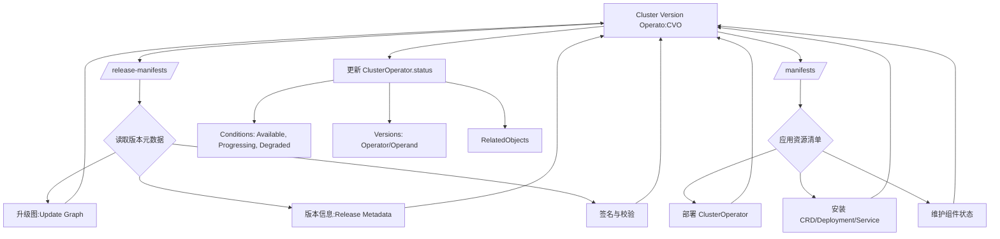
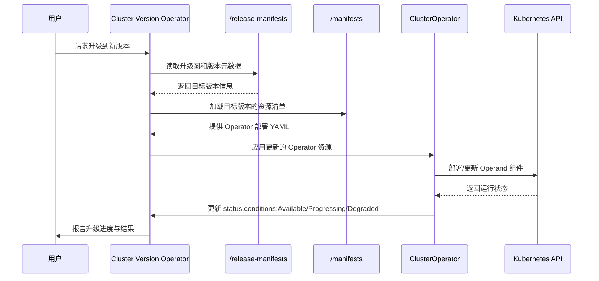
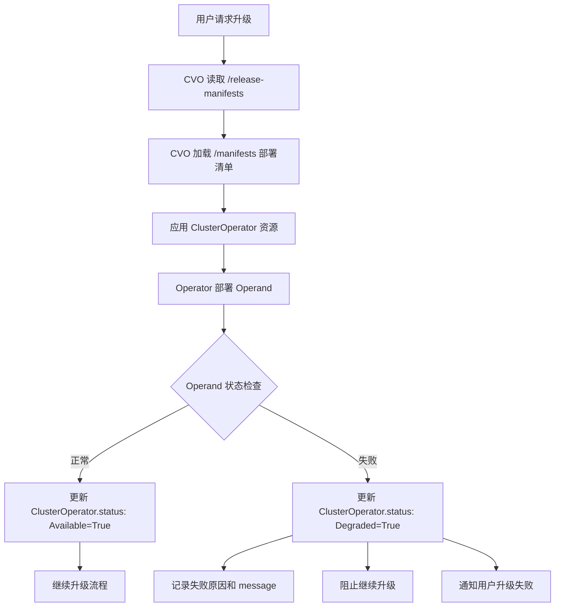
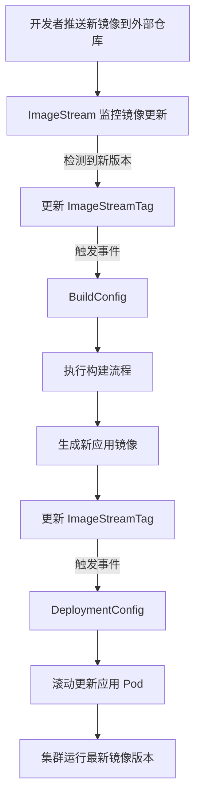
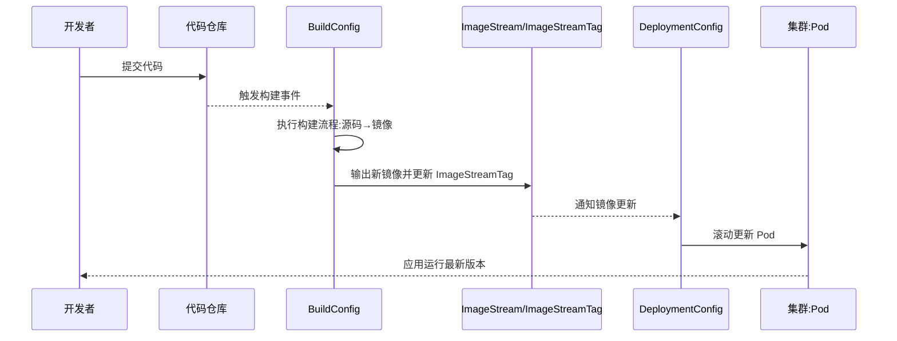
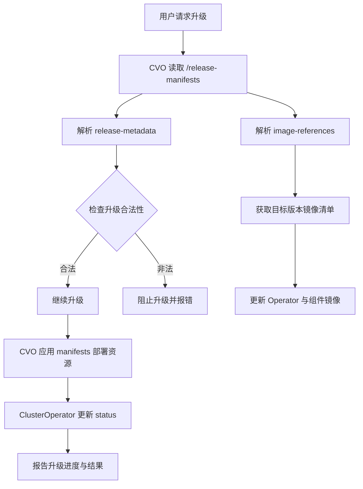

# CVO
## ClusterOperator
**在 OpenShift 中，`ClusterOperator` 的 `status` 字段用于描述某个 Operator 的运行状态、健康状况以及版本信息，是 CVO（Cluster Version Operator）用来协调和监控集群升级的核心机制。它帮助用户和控制器理解 Operator 是否正常工作、是否正在升级、是否出现异常。**
### 📌 `ClusterOperator.status` 字段详解
`status` 是一个复合结构，主要包含以下关键部分：
#### 1. **conditions**
- **作用**：记录 Operator 的健康状态，类似 Kubernetes 资源的 Conditions。
- **常见类型**：
  - `Available`：Operator 是否处于可用状态。
  - `Progressing`：是否正在进行升级或变更。
  - `Degraded`：是否检测到错误或异常。
  - `Upgradeable`：是否允许升级到更高版本。
- **字段结构**：
  - `type`：条件类型（如 Available）。
  - `status`：布尔值或字符串（True/False/Unknown）。
  - `lastTransitionTime`：最近一次状态变化的时间。
  - `reason`：简短的原因描述。
  - `message`：详细说明。
#### 2. **versions**
- **作用**：记录 Operator 当前运行的版本信息。
- **字段结构**：
  - `name`：组件名称（如 operator、operand）。
  - `version`：对应的版本号。
#### 3. **relatedObjects**
- **作用**：列出与该 Operator 相关的 Kubernetes 对象，便于排查和追踪。
- **字段结构**：
  - `group`、`resource`、`name`、`namespace`：标识相关对象。
#### 4. **extension**
- **作用**：为 Operator 提供扩展状态信息，通常由具体 Operator 自定义。
### 📊 示例结构
```yaml
status:
  conditions:
    - type: Available
      status: True
      lastTransitionTime: "2026-03-25T07:00:00Z"
      reason: AsExpected
      message: "The operator is functioning normally."
    - type: Progressing
      status: False
      lastTransitionTime: "2026-03-25T07:00:00Z"
      reason: NoChanges
      message: "No upgrade in progress."
  versions:
    - name: operator
      version: "4.13.0"
    - name: operand
      version: "4.13.0"
  relatedObjects:
    - group: ""
      resource: namespaces
      name: openshift-cluster-version
```
### ⚠️ 使用注意事项
- **只读字段**：`status` 由 Operator 更新，用户不能直接修改。  
- **升级依赖**：CVO 会根据 `Upgradeable` Condition 判断是否允许升级。  
- **监控与告警**：运维人员可通过 `status.conditions` 快速定位问题。  

✅ 总结：`ClusterOperator.status` 是 OpenShift 升级与健康监控的核心接口，包含 **conditions（状态）、versions（版本）、relatedObjects（关联对象）、extension（扩展信息）** 四大部分。它既是 CVO 协调升级的依据，也是运维人员排查问题的关键入口。  

# OpenShift Cluster Version Operator (CVO) 概要设计

## 1. 概述

**Cluster Version Operator (CVO)** 是 OpenShift 4.x 的核心组件，负责管理整个 OpenShift 集群的版本生命周期，包括：
- 集群安装
- 版本升级
- 组件状态监控
- ClusterOperator 生命周期管理

CVO 是 OpenShift "Operator 化"架构的核心实现，将整个集群视为一个由 Operator 组成的分布式系统。

## 2. 架构图

```
┌─────────────────────────────────────────────────────────────────────────────┐
│                         OpenShift Control Plane                             │
├─────────────────────────────────────────────────────────────────────────────┤
│                                                                             │
│  ┌─────────────────────────────────────────────────────────────────────┐   │
│  │              Cluster Version Operator (CVO)                          │   │
│  │  ┌─────────────┐  ┌─────────────┐  ┌─────────────┐                  │   │
│  │  │  Reconciler │  │  Payload    │  │  Status     │                  │   │
│  │  │  Controller │  │  Processor  │  │  Aggregator │                  │   │
│  │  └─────────────┘  └─────────────┘  └─────────────┘                  │   │
│  └─────────────────────────────────────────────────────────────────────┘   │
│         │                    │                    │                         │
│         ▼                    ▼                    ▼                         │
│  ┌─────────────┐    ┌─────────────────┐    ┌─────────────────┐            │
│  │ClusterVersion│    │   Payload       │    │ ClusterOperator │            │
│  │     CRD      │    │   (Release      │    │      CRDs       │            │
│  │              │    │    Image)       │    │                 │            │
│  └─────────────┘    └─────────────────┘    └─────────────────┘            │
│                                                                             │
└─────────────────────────────────────────────────────────────────────────────┘
                                    │
                    ┌───────────────┼───────────────┐
                    ▼               ▼               ▼
            ┌──────────────┐ ┌──────────────┐ ┌──────────────┐
            │   etcd       │ │   dns        │ │  ingress     │
            │  Operator    │ │  Operator    │ │  Operator    │
            └──────────────┘ └──────────────┘ └──────────────┘
            ┌──────────────┐ ┌──────────────┐ ┌──────────────┐
            │  kube-       │ │  monitoring  │ │  console     │
            │  apiserver   │ │  Operator    │ │  Operator    │
            └──────────────┘ └──────────────┘ └──────────────┘
                              ... (更多 ClusterOperator)
```
## 3. 核心概念
### 3.1 ClusterVersion CRD
```yaml
apiVersion: config.openshift.io/v1
kind: ClusterVersion
metadata:
  name: version
spec:
  clusterID: xxxxxxxx-xxxx-xxxx-xxxx-xxxxxxxxxxxx
  desiredUpdate:
    image: quay.io/openshift-release-dev/ocp-release:4.14.0
    version: 4.14.0
  channel: stable-4.14
  upstream: https://api.openshift.com/api/upgrades_info/v1/graph
status:
  availableUpdates:
    - version: 4.14.1
      image: quay.io/openshift-release-dev/ocp-release:4.14.1
  conditions:
    - type: Available
      status: "True"
    - type: Progressing
      status: "False"
    - type: Degraded
      status: "False"
  history:
    - version: 4.13.0
      state: Completed
    - version: 4.14.0
      state: Completed
  desired:
    version: 4.14.0
    image: quay.io/openshift-release-dev/ocp-release:4.14.0
```
### 3.2 ClusterOperator CRD
```yaml
apiVersion: config.openshift.io/v1
kind: ClusterOperator
metadata:
  name: etcd
spec:
status:
  versions:
    - name: operator
      version: 4.14.0
  conditions:
    - type: Available
      status: "True"
      message: "etcd is available"
    - type: Progressing
      status: "False"
    - type: Degraded
      status: "False"
    - type: Upgradeable
      status: "True"
  relatedObjects:
    - group: operator.openshift.io
      resource: etcds
      name: cluster
```
### 3.3 Payload (Release Image)
```
┌─────────────────────────────────────────────────────────────┐
│                  Release Image (Payload)                    │
├─────────────────────────────────────────────────────────────┤
│                                                             │
│  release-manifests/                                         │
│   ├── 0000_50_cluster-version-operator_01_cvo.yaml         │
│   ├── 0000_50_cluster-version-operator_02_cvo-config.yaml  │
│   ├── image-references                                      │
│   └── ...                                                   │
│                                                             │
│  manifests/                                                 │
│   ├── 0000_10_etcd-operator_00_namespace.yaml              │
│   ├── 0000_10_etcd-operator_01_crd.yaml                    │
│   ├── 0000_10_etcd-operator_02_deployment.yaml             │
│   ├── 0000_10_dns-operator_00_namespace.yaml               │
│   ├── 0000_10_dns-operator_01_crd.yaml                     │
│   └── ... (所有 ClusterOperator 的清单)                     │
│                                                             │
│  sha256_xxxxxx (各组件镜像层)                                │
│                                                             │
└─────────────────────────────────────────────────────────────┘
```
## 4. 核心组件设计
### 4.1 CVO 控制器架构
```
┌─────────────────────────────────────────────────────────────────┐
│                    CVO Controller                               │
├─────────────────────────────────────────────────────────────────┤
│                                                                 │
│  ┌──────────────────────────────────────────────────────────┐  │
│  │                    Reconcile Loop                         │  │
│  │                                                           │  │
│  │   1. Watch ClusterVersion CR                              │  │
│  │   2. Fetch Payload from Release Image                     │  │
│  │   3. Parse Manifests                                      │  │
│  │   4. Apply Resources (ordered by name prefix)             │  │
│  │   5. Monitor ClusterOperator Status                       │  │
│  │   6. Update ClusterVersion Status                         │  │
│  │                                                           │  │
│  └──────────────────────────────────────────────────────────┘  │
│                                                                 │
│  ┌──────────────┐  ┌──────────────┐  ┌──────────────┐         │
│  │   Payload    │  │   Manifest   │  │   Status     │         │
│  │   Fetcher    │  │   Applier    │  │   Monitor    │         │
│  └──────────────┘  └──────────────┘  └──────────────┘         │
│                                                                 │
└─────────────────────────────────────────────────────────────────┘
```
### 4.2 Manifest 处理流程
```
┌──────────────────────────────────────────────────────────────────┐
│                    Manifest Processing                           │
├──────────────────────────────────────────────────────────────────┤
│                                                                  │
│  Release Image                                                   │
│       │                                                          │
│       ▼                                                          │
│  ┌─────────────┐                                                │
│  │  Extract    │  ──►  manifests/                               │
│  │  Payload    │       ├── 0000_10_... (优先级高)               │
│  └─────────────┘       ├── 0000_50_... (中等优先级)             │
│                        └── 0000_90_... (低优先级)               │
│       │                                                          │
│       ▼                                                          │
│  ┌─────────────┐                                                │
│  │   Sort by   │  ──► 按文件名前缀排序                          │
│  │   Prefix    │       0000_10 < 0000_50 < 0000_90             │
│  └─────────────┘                                                │
│       │                                                          │
│       ▼                                                          │
│  ┌─────────────┐                                                │
│  │   Apply     │  ──► kubectl apply --server-side               │
│  │   Manifests │       支持幂等操作                              │
│  └─────────────┘                                                │
│                                                                  │
└──────────────────────────────────────────────────────────────────┘
```
## 5. 升级流程
```
┌─────────────────────────────────────────────────────────────────────────────┐
│                         Cluster Upgrade Flow                                 │
├─────────────────────────────────────────────────────────────────────────────┤
│                                                                              │
│  1. 用户触发升级                                                             │
│     oc adm upgrade --to=4.14.1                                               │
│                                                                              │
│     ┌─────────────────────────────────────────────────────────────────┐    │
│     │  ClusterVersion.spec.desiredUpdate = {version: "4.14.1"}        │    │
│     └─────────────────────────────────────────────────────────────────┘    │
│                              │                                               │
│                              ▼                                               │
│  2. CVO 检测到变更                                                           │
│     ┌─────────────────────────────────────────────────────────────────┐    │
│     │  - 拉取新版本 Release Image                                      │    │
│     │  - 解析新版本 Manifests                                          │    │
│     │  - 计算更新策略                                                   │    │
│     └─────────────────────────────────────────────────────────────────┘    │
│                              │                                               │
│                              ▼                                               │
│  3. 逐个更新 ClusterOperator                                                 │
│     ┌─────────────────────────────────────────────────────────────────┐    │
│     │  for each operator in sorted order:                             │    │
│     │      - Apply new manifests                                       │    │
│     │      - Wait for operator Available=True                          │    │
│     │      - Wait for operator Progressing=False                       │    │
│     │      - Wait for operator Degraded=False                          │    │
│     └─────────────────────────────────────────────────────────────────┘    │
│                              │                                               │
│                              ▼                                               │
│  4. 更新状态                                                                 │
│     ┌─────────────────────────────────────────────────────────────────┐    │
│     │  ClusterVersion.status.history:                                  │    │
│     │    - version: 4.14.1                                             │    │
│     │    - state: Completed                                            │    │
│     └─────────────────────────────────────────────────────────────────┘    │
│                                                                              │
└─────────────────────────────────────────────────────────────────────────────┘
```
## 6. CVO 与 OLM 的区别
| 维度 | CVO (Cluster Version Operator) | OLM (Operator Lifecycle Manager) |
|------|-------------------------------|----------------------------------|
| **管理对象** | ClusterOperator (系统级) | 常规 Operator (用户级) |
| **安装时机** | OpenShift 安装时自动部署 | 用户按需安装 |
| **更新来源** | Release Image (Payload) | CatalogSource |
| **更新机制** | 声明式版本升级 | Subscription + InstallPlan |
| **权限范围** | 集群级，所有命名空间 | 可配置，特定命名空间 |
| **状态表示** | ClusterOperator CR | ClusterServiceVersion (CSV) |
## 7. 关键设计特性
### 7.1 声明式版本管理
```yaml
spec:
  desiredUpdate:
    version: 4.14.0
    image: quay.io/openshift-release-dev/ocp-release:4.14.0
```
- 用户声明期望版本，CVO 负责实现
- 支持自动和手动更新模式
### 7.2 组件解耦
```
┌─────────────────────────────────────────────────────────────────┐
│                    组件解耦设计                                  │
├─────────────────────────────────────────────────────────────────┤
│                                                                 │
│  CVO 不直接管理组件，而是通过 ClusterOperator 间接管理:          │
│                                                                 │
│  CVO ──► ClusterOperator CR ──► Operator Controller            │
│                                                                 │
│  例如:                                                          │
│  CVO ──► etcd ClusterOperator ──► etcd-operator ──► etcd pods  │
│                                                                 │
└─────────────────────────────────────────────────────────────────┘
```
### 7.3 状态聚合
```go
type ClusterOperatorStatus struct {
    Conditions []ClusterOperatorStatusCondition
    
    // 条件类型:
    // - Available: 组件是否可用
    // - Progressing: 是否正在更新
    // - Degraded: 是否降级
    // - Upgradeable: 是否可升级
}
```
### 7.4 安全更新
- 支持 `PartialUpgrade`：仅更新部分组件
- 支持 `Paused`：暂停特定组件更新
- 支持回滚到之前版本
## 8. 与 BKE 的对比
| 维度 | OpenShift CVO | BKE (cluster-api-provider-bke) |
|------|---------------|-------------------------------|
| **架构模式** | Operator 模式 | Cluster API Provider 模式 |
| **版本管理** | ClusterVersion CRD | BKECluster CRD |
| **组件管理** | ClusterOperator CRD | 自定义 Controller |
| **升级机制** | Release Image Payload | Manifests + Template |
| **状态监控** | 条件聚合 | Phase 状态机 |
## 9. 总结
**Cluster Version Operator (CVO)** 是 OpenShift 4.x 的核心组件，其设计特点：

1. **声明式版本管理**：通过 ClusterVersion CRD 声明期望版本
2. **Operator 化架构**：所有系统组件都是 Operator，实现解耦
3. **Payload 机制**：通过 Release Image 统一分发所有组件清单
4. **状态聚合**：通过 ClusterOperator CRD 聚合各组件状态
5. **安全升级**：支持渐进式升级、暂停、回滚等操作

CVO 的设计思想对 BKE 的版本管理和升级机制有很好的参考价值。

## ClusterVersion
**在 OpenShift 的 `ClusterVersion` 中，`unmanaged` 模式表示集群版本操作器（CVO）不再自动管理或升级集群，用户需要自行负责更新与维护。这通常用于调试、开发或特殊场景下的手动控制。**
### 📌 `ClusterVersion.spec` 中的 `overrides` 与 `unmanaged`
- 在 `ClusterVersion` 的 `spec.overrides` 字段中，可以对某些组件或 Operator 设置 `unmanaged`。  
- 当某个 Operator 被标记为 `unmanaged` 时：
  - **CVO 不会再升级或修改该 Operator**。  
  - 用户必须手动维护该 Operator 的版本与状态。  
  - 这可能导致集群升级时出现不一致或风险。  
### 🔑 使用场景
- **调试/开发**：当需要测试某个 Operator 的新版本或自定义行为时，可以临时设置为 `unmanaged`。  
- **特殊需求**：某些企业可能需要对特定 Operator 保持自定义版本，不希望被 CVO 自动覆盖。  
### ⚠️ 风险与注意事项
- **升级风险**：如果某个关键 Operator被设置为 `unmanaged`，集群升级可能失败或进入不一致状态。  
- **支持限制**：Red Hat 官方通常不支持长期运行在 `unmanaged` 模式下的集群。  
- **恢复方法**：要恢复自动管理，只需移除 `unmanaged` 设置，CVO 会重新接管该 Operator。  
### 📊 示例配置
```yaml
apiVersion: config.openshift.io/v1
kind: ClusterVersion
metadata:
  name: version
spec:
  overrides:
    - kind: ClusterOperator
      name: authentication
      unmanaged: true
```
在这个例子中，`authentication` Operator 被标记为 `unmanaged`，CVO 将不再自动升级它。

✅ 总结：**`unmanaged` 是一种“手动接管”模式，允许用户绕过 CVO 的自动升级机制，但会带来维护和一致性风险。**它适合短期调试或特殊场景，不建议在生产环境中长期使用。  

## Operator/Operand
**在 Kubernetes / OpenShift 语境中，Operator 是负责管理应用或组件生命周期的控制器，而 Operand 则是 Operator 管理的实际应用或资源。简单来说：Operator 是“管家”，Operand 是“被管的对象”。**
### 📌 Operator
- **定义**：一种扩展 Kubernetes API 的模式，用来自动化复杂应用的部署、升级、监控和修复。  
- **作用**：  
  - 编排应用的整个生命周期（安装、升级、备份、恢复）。  
  - 将人类运维经验编码为自动化逻辑。  
  - 通过 CRD（Custom Resource Definition）与控制器实现。  
- **示例**：  
  - **Cluster Version Operator (CVO)**：管理 OpenShift 集群升级。  
  - **Etcd Operator**：管理 etcd 集群的部署与扩缩容。  
### 📌 Operand
- **定义**：由 Operator 管理的实际应用或资源，即 Operator 的“操作对象”。  
- **作用**：  
  - Operator 通过 CRD 创建和维护 Operand。  
  - Operand 是最终运行的服务或组件。  
- **示例**：  
  - 在 Etcd Operator 中，**etcd 集群**就是 Operand。  
  - 在 Monitoring Operator 中，**Prometheus 实例**就是 Operand。  
### 📊 对比表
| 项目        | Operator | Operand |
|-------------|----------|---------|
| **角色**    | 管理者（控制器） | 被管理对象（应用/资源） |
| **定义方式** | CRD + 控制器逻辑 | CRD 实例（Custom Resource） |
| **功能**    | 部署、升级、监控、修复 | 提供实际服务或功能 |
| **示例**    | Etcd Operator, CVO | etcd 集群, Prometheus 实例 |
### ⚠️ 注意事项
- **Operator 不等于应用本身**：它是应用的“自动化运维工具”。  
- **Operand 依赖 Operator**：如果 Operator 停止维护，Operand 的生命周期管理就需要人工介入。  
- **升级场景**：在 OpenShift 中，ClusterOperator 记录 Operator 状态，而 Operand 的版本信息也会在 `status.versions` 中体现。  

✅ 总结：**Operator 是负责自动化管理的控制器，Operand 是它所管理的实际应用或资源。**两者关系类似于“管理员”和“被管理的服务”。这一区分在 OpenShift 的升级与监控体系中尤为重要。  

## /manifests 与 /release-manifests
**在 OpenShift 中，`/manifests` 与 `/release-manifests` 目录的区别在于：`/manifests` 存放的是集群运行时需要应用的 Operator 与组件的安装清单，而 `/release-manifests` 存放的是整个 OpenShift 版本的发布元数据与升级图信息。前者是“实际部署的资源”，后者是“版本与升级的描述”。**
### 📌 `/manifests` 目录
- **内容**：包含各个 ClusterOperator 的 Kubernetes 资源清单（Deployment、Service、CRD 等）。  
- **作用**：  
  - 用于 CVO（Cluster Version Operator）在集群中应用和维护这些 Operator。  
  - 每个 Operator 的安装与更新都依赖这里的清单。  
- **特点**：  
  - 面向运行时，直接影响集群中实际部署的组件。  
  - 文件通常是 YAML 格式的 Kubernetes manifests。  
### 📌 `/release-manifests` 目录
- **内容**：包含 OpenShift 整个版本的元信息，包括：  
  - **升级图（update graph）**：描述从哪个版本可以升级到哪个版本。  
  - **版本元数据**：如 release image 的标签、组件版本号。  
  - **签名与校验信息**：保证版本的完整性与可信度。  
- **作用**：  
  - 为 CVO 提供升级策略和版本边界。  
  - 确保集群升级过程遵循官方定义的路径。  
- **特点**：  
  - 面向版本管理，不直接部署资源。  
  - 主要用于升级与回滚逻辑。  
### 📊 对比表
| 目录              | 内容类型 | 作用 | 面向对象 |
|-------------------|----------|------|----------|
| **/manifests**    | Operator 与组件的 Kubernetes 资源清单 | 部署和维护集群中的实际组件 | 集群运行时 |
| **/release-manifests** | 版本元数据、升级图、签名信息 | 定义版本升级路径与策略 | 集群升级过程 |
### ⚠️ 注意事项
- **不要混淆**：`/manifests` 是“部署用的 YAML”，`/release-manifests` 是“版本升级的元信息”。  
- **升级风险**：如果手动修改 `/release-manifests`，可能导致集群无法正常升级。  
- **调试场景**：开发者在调试 Operator 时通常关注 `/manifests`，而在研究升级策略时则查看 `/release-manifests`。  

✅ 总结：**`/manifests` 负责集群组件的实际部署，`/release-manifests` 负责版本升级的策略与元数据。**两者共同作用，保证 OpenShift 集群既能正常运行，又能安全升级。  
### CVO 工作流程图
表示它在 OpenShift 中如何处理 `/manifests` 和 `/release-manifests`：  

 📌 图解说明
- **CVO**：核心控制器，负责集群升级与组件部署。  
- **/release-manifests**：提供版本升级图、元数据和签名校验，确保升级路径合法。  
- **/manifests**：包含各 Operator 的 Kubernetes 资源清单，CVO 用它来部署和维护组件。  
- **ClusterOperator.status**：CVO 根据执行结果更新状态，反映集群健康与升级进度。  

这样你就能直观地看到：**`/release-manifests` 决定升级策略，`/manifests` 决定实际部署内容，CVO 在两者之间循环工作并更新状态。**  
### OpenShift 集群升级流程的时序图
表示 CVO 在升级过程中各个步骤的交互：  

📌 图解说明
- **用户**：触发升级请求。  
- **CVO**：核心控制器，负责协调升级。  
- **/release-manifests**：提供升级路径和版本元数据。  
- **/manifests**：提供实际的 Operator 部署清单。  
- **ClusterOperator**：执行具体的 Operator 部署与维护。  
- **Kubernetes API**：最终应用资源并返回运行状态。  

这样你可以直观地看到：升级流程从用户请求开始，CVO 读取版本信息，应用新的 Operator 清单，更新 Operand，最后通过 `ClusterOperator.status` 报告升级进度。  
### 升级失败的分支流程图
展示当某个 Operator 出现 `Degraded` 状态时，CVO 如何处理：  

 📌 图解说明
- **正常路径**：Operand 部署成功，ClusterOperator 报告 `Available=True`，升级继续。  
- **失败路径**：Operand 部署失败，ClusterOperator 报告 `Degraded=True`，CVO 会：  
  - 在 `status.conditions` 中写入失败原因和详细信息。  
  - 阻止继续升级，避免集群进入不一致状态。  
  - 通知用户升级失败，需要人工介入或修复。  

这样你就能直观地看到：**一旦某个 Operator 出现 `Degraded`，CVO 会立即中断升级并报告错误，确保集群安全。**  

## ImageStream
**在 OpenShift 中，ImageStream 的作用是为镜像提供一个“逻辑引用层”，让你在集群内部通过标签来管理和追踪镜像版本，而不是直接依赖外部镜像地址。它能触发自动构建和部署，使应用始终保持最新镜像。**  [docs.redhat.com](https://docs.redhat.com/en/documentation/openshift_container_platform/4.18/html/images/managing-image-streams)  [Tutorial Works](https://www.tutorialworks.com/openshift-imagestreams/)  [Devopsschool.com](https://www.devopsschool.com/blog/what-is-imagestreams-step-by-step-tutorials/)  
### 🔑 ImageStream 的核心作用
- **镜像引用管理**：ImageStream 并不存储镜像本身，而是保存镜像的引用（通常是外部仓库的镜像地址），并通过标签（tags）来标识不同版本。  
- **版本追踪**：当外部镜像更新时，ImageStream 可以检测到变化，并更新对应的 tag。  
- **自动触发**：结合 BuildConfig 或 DeploymentConfig，ImageStream 的更新可以触发自动构建或应用滚动更新。  
- **集群内统一入口**：开发者和运维人员可以通过 ImageStream 名称来引用镜像，而不必关心具体的外部仓库地址。  
### 📊 与直接使用镜像的区别
| 使用方式 | 特点 | 缺点 |
|----------|------|------|
| **直接使用镜像地址** | Pod 直接拉取 `nginx:latest` | Kubernetes 不会自动检测镜像更新，需手动重启或 rollout |
| **使用 ImageStream** | 通过 `ImageStreamTag` 引用镜像，自动追踪更新 | 需要额外的 OpenShift 配置，但能实现自动化和版本管理 |
### 📌 使用场景
- **CI/CD 流程**：当构建完成并推送新镜像时，ImageStream 更新触发新的部署。  
- **版本管理**：通过 `ImageStreamTag` 管理不同版本（如 `frontend:v1`、`frontend:v2`）。  
- **隔离与安全**：集群内部统一使用 ImageStream 引用，避免直接暴露外部镜像仓库地址。  
### ⚠️ 注意事项
- **不是镜像仓库**：ImageStream 不存储镜像，只是引用和管理。  
- **依赖 OpenShift 特性**：这是 OpenShift 特有的功能，原生 Kubernetes 没有 ImageStream。  
- **更新策略**：要结合 BuildConfig/DeploymentConfig 才能发挥自动化优势。  

✅ 总结：**ImageStream 是 OpenShift 的镜像管理抽象层，提供版本追踪、自动触发和统一引用入口。它让应用在集群内始终保持最新镜像，而无需手动干预。**  
### ImageStream 与 BuildConfig/DeploymentConfig 的交互流程图
直观展示它如何触发自动构建和部署：  

📌 图解说明
- **ImageStream**：监控外部镜像仓库或构建结果，一旦发现新镜像就更新 `ImageStreamTag`。  
- **BuildConfig**：当 ImageStream 更新时，可以触发新的构建流程，生成应用镜像。  
- **DeploymentConfig**：当 ImageStreamTag 更新时，会触发应用的滚动更新，确保 Pod 使用最新镜像。  
- **最终效果**：开发者只需推送新镜像，OpenShift 就能自动完成构建与部署更新。  

这样你就能直观地看到：**ImageStream 是连接镜像更新、构建和部署的桥梁**，让 CI/CD 流程在 OpenShift 中实现自动化。  

## ImageStream/ImageStreamTag 与 BuildConfig/DeploymentConfig
在 OpenShift 中，**ImageStream/ImageStreamTag 与 BuildConfig/DeploymentConfig 是实现自动化构建与部署的关键组合**。它们之间的关系可以这样理解：  
### 📌 ImageStream / ImageStreamTag
- **ImageStream**：镜像的逻辑引用层，不存储镜像本身，而是追踪镜像的版本。  
- **ImageStreamTag**：ImageStream 的具体版本标签，例如 `frontend:latest` 或 `frontend:v1`。  
- **作用**：当镜像更新时，ImageStreamTag 会变化，并触发相关的构建或部署。  
### 📌 BuildConfig
- **作用**：定义应用的构建流程（源码 → 镜像）。  
- **与 ImageStreamTag 的关系**：  
  - 可以指定某个 ImageStreamTag 作为 **构建基础镜像**。  
  - 构建完成后会将新镜像写入目标 ImageStreamTag。  
- **效果**：镜像更新后，ImageStreamTag 变化，触发后续部署。  
### 📌 DeploymentConfig
- **作用**：定义应用的部署策略（副本数、滚动更新等）。  
- **与 ImageStreamTag 的关系**：  
  - 使用某个 ImageStreamTag 作为应用运行镜像。  
  - 当该 ImageStreamTag 更新时，DeploymentConfig 会触发滚动更新，确保 Pod 使用最新镜像。  
### 📊 三者关系总结
| 组件 | 作用 | 与 ImageStreamTag 的关系 |
|------|------|----------------------|
| **ImageStream** | 镜像版本追踪与事件触发 | 提供统一引用入口 |
| **BuildConfig** | 定义构建流程，生成镜像 | 输入/输出依赖 ImageStreamTag |
| **DeploymentConfig** | 定义部署策略，管理 Pod | 使用 ImageStreamTag 作为运行镜像 |
### 📌 示例说明
假设你有一个前端应用：  
1. **BuildConfig** 定义：  
   - 使用 `nodejs:14` 作为基础镜像（来自 ImageStreamTag）。  
   - 构建完成后输出镜像到 `frontend:latest` ImageStreamTag。  
2. **ImageStream**：  
   - 管理 `frontend` 镜像的版本。  
   - 当构建完成时，`frontend:latest` 更新。  
3. **DeploymentConfig**：  
   - 使用 `frontend:latest` 作为应用运行镜像。  
   - 当 `frontend:latest` 更新时，自动触发滚动更新 Pod。  
### 📌 示例 YAML 片段
```yaml
apiVersion: build.openshift.io/v1
kind: BuildConfig
metadata:
  name: frontend-build
spec:
  output:
    to:
      kind: ImageStreamTag
      name: frontend:latest
---
apiVersion: apps.openshift.io/v1
kind: DeploymentConfig
metadata:
  name: frontend-deploy
spec:
  template:
    spec:
      containers:
      - name: frontend
        image: frontend:latest
```
✅ 总结：**ImageStreamTag 是连接 BuildConfig 与 DeploymentConfig 的纽带**。BuildConfig 负责生成镜像并更新 ImageStreamTag，DeploymentConfig 监听该标签变化并自动更新 Pod，从而实现完整的 CI/CD 流程。  
### CI/CD 时序图
展示从“代码提交 → 构建 → 镜像更新 → 部署更新”的全过程：  

 📌 图解说明
1. **开发者提交代码** → 推送到 Git 仓库。  
2. **BuildConfig** 检测到代码变更 → 执行构建流程，生成新镜像。  
3. **ImageStreamTag 更新** → 记录新镜像版本。  
4. **DeploymentConfig** 监听到 ImageStreamTag 更新 → 自动触发滚动更新。  
5. **集群 Pod 更新** → 应用运行最新镜像版本，完成 CI/CD 流程。  

这样你就能直观地看到：**ImageStream 是连接构建与部署的桥梁，BuildConfig 负责生成镜像，DeploymentConfig 负责应用更新。**  

## /release-manifests中的image-references与release-metadata
在 OpenShift 的 **`/release-manifests`** 目录中，常见的两个关键文件是 **`image-references`** 和 **`release-metadata`**，它们分别承担不同的作用：  
### 📌 `image-references`
- **内容**：列出该版本所包含的所有镜像引用。  
- **结构**：通常是一个 YAML 文件，包含镜像名称、标签、以及对应的 registry 地址。  
- **作用**：  
  - 为 CVO 提供集群升级时需要拉取的镜像清单。  
  - 确保集群中每个 Operator 和组件都能找到对应的镜像。  
  - 在升级过程中，CVO 会根据 `image-references` 来更新各个组件的镜像版本。  

**示例片段：**
```yaml
kind: ImageStream
metadata:
  name: cluster-version-operator
spec:
  tags:
    - name: v4.13.0
      from:
        kind: DockerImage
        name: quay.io/openshift/cluster-version-operator:v4.13.0
```
### 📌 `release-metadata`
- **内容**：描述该 OpenShift 版本的元信息。  
- **字段**：  
  - `metadata.name`：版本号，例如 `4.13.0`。  
  - `metadata.creationTimestamp`：版本构建时间。  
  - `metadata.description`：版本说明。  
  - `metadata.upgrades`：可升级的目标版本范围。  
- **作用**：  
  - 为 CVO 提供升级策略和版本边界。  
  - 确保集群升级遵循官方定义的路径。  
  - 用于校验当前集群是否允许升级到目标版本。  

**示例片段：**
```yaml
metadata:
  name: 4.13.0
  creationTimestamp: "2026-03-01T12:00:00Z"
  description: "OpenShift 4.13.0 release"
  upgrades:
    - 4.12.0
    - 4.12.5
```
### 📊 对比总结
| 文件 | 内容 | 作用 |
|------|------|------|
| **image-references** | 镜像清单（Operator/组件镜像） | 提供升级时需要的镜像地址 |
| **release-metadata** | 版本元信息（版本号、升级路径、说明） | 定义升级策略与版本边界 |
✅ 总结：**`image-references` 是镜像层面的清单，`release-metadata` 是版本层面的描述。**前者保证升级时镜像可用，后者保证升级路径合法，两者共同作用，确保 OpenShift 集群升级安全、可控。  
### 流程图
展示 CVO 如何同时使用 `/release-manifests` 中的 `image-references` 与 `release-metadata` 来完成升级：  

📌 图解说明
- **release-metadata**：提供版本号、升级路径、合法性校验。CVO 会先检查当前版本是否允许升级到目标版本。  
- **image-references**：提供目标版本所需的镜像清单。CVO 根据它来拉取并更新各个 Operator 与组件的镜像。  
- **升级流程**：  
  1. 用户请求升级。  
  2. CVO 读取 `release-metadata` → 校验升级合法性。  
  3. CVO 读取 `image-references` → 获取镜像清单。  
  4. 应用 `/manifests` 部署资源。  
  5. 更新 `ClusterOperator.status` → 报告升级进度。  

这样你就能直观地看到：**`release-metadata` 决定能不能升级，`image-references` 决定升级用哪些镜像，CVO 将两者结合来完成整个升级过程。**  
