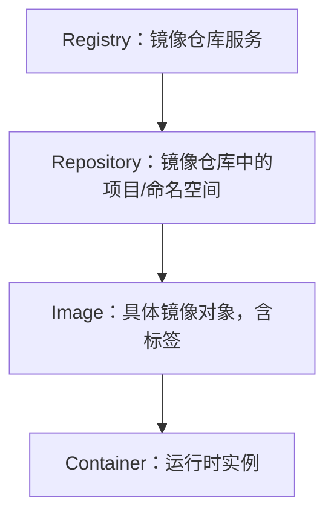
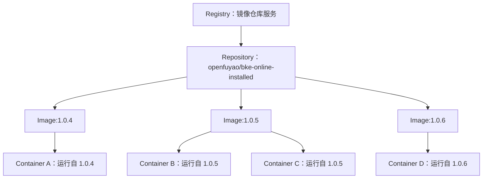
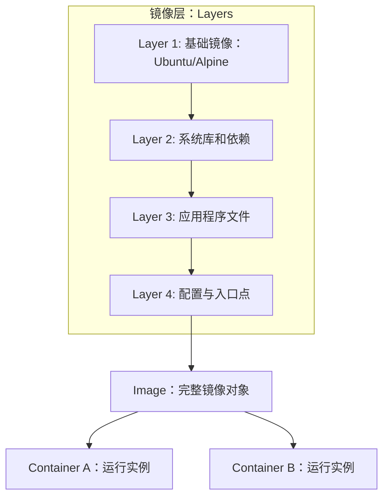
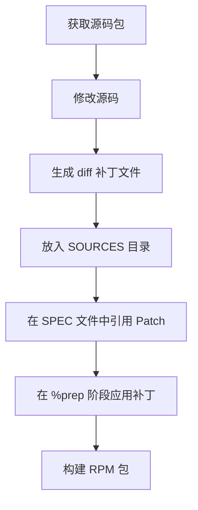

# registry和image
在 **containerd** 里，`registry` 和 `image` 是两个不同层次的概念：
## 📌 Registry 的含义
- **定义**：Registry 是镜像仓库服务，负责存储和分发镜像。  
- **作用**：提供镜像的拉取（pull）、推送（push）、索引（resolve）等功能。  
- **示例**：  
  - 公共仓库：`docker.io`、`quay.io`、`ghcr.io`  
  - 私有仓库：`cr.openfuyao.cn`、企业内部 Harbor  

在 containerd 配置中，registry 通常通过 `mirrors` 或 `hosts.toml` 指定，告诉 containerd 去哪个服务拉取镜像。
## 📌 Image 的含义
- **定义**：Image 是存放在 registry 中的具体镜像对象，由一系列层（layers）组成。  
- **命名规则**：`<registry>/<namespace>/<repository>:<tag>`  
  - 例如：`cr.openfuyao.cn/openfuyao/bke-online-installed:1.0.5`  
- **作用**：镜像是容器运行的基础，包含文件系统快照和元数据。  
- **在 containerd 中的表现**：  
  - 拉取镜像后会存储在本地 `/var/lib/containerd/io.containerd.content.v1.content`  
  - 通过 `ctr images ls` 或 `nerdctl images` 可以查看本地镜像。  
## 📊 Registry 与 Image 的关系
| 概念 | 层次 | 例子 | 在 containerd 中的作用 |
|------|------|------|------------------------|
| **Registry** | 服务层 | `cr.openfuyao.cn` | 镜像存储与分发的服务端 |
| **Image** | 对象层 | `cr.openfuyao.cn/openfuyao/bke-online-installed:1.0.5` | 存放在 registry 中的具体镜像，供拉取和运行 |
## 🎯 总结
- **Registry** 是镜像的仓库服务，负责存储和分发。  
- **Image** 是仓库里的具体镜像对象，由层组成，带有标签。  
- 在 containerd 中，配置 registry 是为了告诉它去哪里找镜像，而 image 是实际运行的内容。  
## Registry → Repository → Image → Container 的层次关系图

📌 图解说明
- **Registry**：镜像仓库服务，例如 `docker.io`、`cr.openfuyao.cn`。  
- **Repository**：仓库中的项目或命名空间，例如 `openfuyao/bke-online-installed`。  
- **Image**：具体的镜像对象，由层组成，并带有标签，例如 `:1.0.5`。  
- **Container**：镜像运行后的实例，带有进程和文件系统。  

这样你可以直观地看到：  
- Registry 是最顶层的服务。  
- Repository 是 Registry 内的分类。  
- Image 是 Repository 中的具体版本。  
- Container 是镜像运行后的实体。  
## 多镜像版本 → 多容器实例的关系图

 📌 图解说明
- **Registry**：镜像仓库服务，例如 `cr.openfuyao.cn`。  
- **Repository**：仓库中的项目，例如 `openfuyao/bke-online-installed`。  
- **Image**：同一个 Repository 下的不同版本镜像（如 `:1.0.4`、`:1.0.5`、`:1.0.6`）。  
- **Container**：镜像运行后的实例，一个镜像可以启动多个容器。  

这样你可以清晰看到：  
- 一个 Repository 可以有多个版本镜像。  
- 每个镜像可以运行多个容器实例。  
## 镜像层（layers）→ 镜像 → 容器关系图

📌 图解说明
- **Layers**：镜像由多层文件系统叠加而成，每层只保存差异。  
  - Layer 1：基础镜像（如 Ubuntu、Alpine）。  
  - Layer 2：系统库和依赖。  
  - Layer 3：应用程序文件。  
  - Layer 4：配置与入口点。  
- **Image**：所有层叠加后的整体镜像对象。  
- **Container**：镜像运行后的实例，可以同时运行多个容器。  

这样你可以直观理解：  
- 镜像是由多个层组成的。  
- 镜像可以启动多个容器实例。  
- 容器共享镜像层，但有自己的运行时读写层。  

# 镜像同步`skopeo` 和 `crane`
在 **镜像同步** 场景下，`skopeo` 和 `crane` 都是常用的工具，可以在不同的镜像仓库之间复制镜像，而无需先拉取到本地再推送。下面给你几个实用样例：  
## 📌 使用 `skopeo` 同步镜像
`skopeo` 是 Red Hat 推出的容器镜像管理工具，支持直接在仓库之间复制镜像。
### 1. 从 Docker Hub 同步到私有仓库
```bash
skopeo copy docker://nginx:1.23.0-alpine docker://cr.openfuyao.cn/openfuyao/nginx:1.23.0-alpine
```
### 2. 从私有仓库同步到本地目录
```bash
skopeo copy docker://cr.openfuyao.cn/openfuyao/nginx:1.23.0-alpine dir:/tmp/nginx-image
```
### 3. 从本地目录导入到另一个仓库
```bash
skopeo copy dir:/tmp/nginx-image docker://registry.example.com/nginx:1.23.0-alpine
```
## 📌 使用 `crane` 同步镜像
`crane` 是 Google 的 go-containerregistry 提供的工具，轻量快速，常用于 CI/CD。
### 1. 复制镜像到另一个仓库
```bash
crane cp nginx:1.23.0-alpine cr.openfuyao.cn/openfuyao/nginx:1.23.0-alpine
```
### 2. 拉取镜像到本地 tar 文件
```bash
crane pull nginx:1.23.0-alpine nginx.tar
```
### 3. 推送本地 tar 文件到仓库
```bash
crane push nginx.tar cr.openfuyao.cn/openfuyao/nginx:1.23.0-alpine
```
## 📊 对比总结
| 工具   | 优点 | 常见场景 |
|--------|------|----------|
| **skopeo** | 功能全面，支持多种存储后端（dir、tar、registry） | 跨仓库同步、离线导出导入 |
| **crane**  | 命令简洁，速度快，适合 CI/CD | 快速复制、拉取/推送 tar 文件 |

# 制作 patch 的设计思路
在 RPM 软件包维护中，**制作 patch 的设计思路**其实就是把源码的改动抽象成一个可复用的补丁文件，并在 `.spec` 文件中统一管理。这样既能保持源码包的“原汁原味”，又能保证改动的可追溯性和可维护性。  
## 📌 设计思路核心
1. **保持源码完整性**  
   - 不直接修改 `SOURCES` 下的 tar 包。  
   - 所有改动通过 `diff` 生成 patch 文件，放在 `SOURCES` 目录。  

2. **补丁文件化管理**  
   - 每个改动对应一个独立的 patch 文件。  
   - 命名规范：`mypackage-bugfix.patch`、`mypackage-feature.patch`。  
   - 在 `.spec` 文件中用 `PatchX` 引用。  

3. **在 SPEC 文件中应用补丁**  
   - 在 `%prep` 阶段使用 `%patchX -pN` 应用补丁。  
   - 保证构建时自动应用，而不是手工修改。  

4. **多补丁顺序控制**  
   - 如果有多个补丁，按顺序在 `%prep` 中应用。  
   - 避免补丁之间冲突，必要时合并。  

5. **可追溯性与维护性**  
   - 每个补丁文件都能通过 `diff` 追溯改动来源。  
   - 方便后续升级版本时重新评估哪些补丁仍然需要。  
## 🧩 设计流程图（简化）

## 📊 思路总结
| 目标 | 设计原则 |
|------|----------|
| 保持源码原始性 | 不直接改 tar 包，所有改动通过 patch |
| 管理改动 | 每个改动独立 patch 文件，命名规范 |
| 自动化构建 | 在 `.spec` 文件中统一应用补丁 |
| 可维护性 | 补丁可追溯，升级时可选择性保留或移除 |

✅ **结论**：RPM patch 的设计思路就是 **“源码不动，改动文件化，SPEC 管理，构建自动化”**。这样既能保证源码包的完整性，又能让改动清晰可追溯，方便后续维护和升级。  


✅ **总结**：  
- 如果你需要 **跨仓库同步** 或 **多种存储后端支持** → 用 **skopeo**。  
- 如果你在 **CI/CD 流水线中快速复制镜像** → 用 **crane**。  
