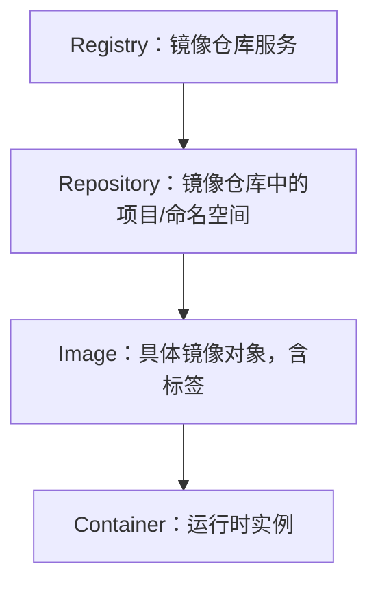
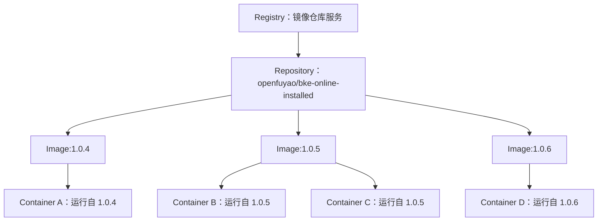
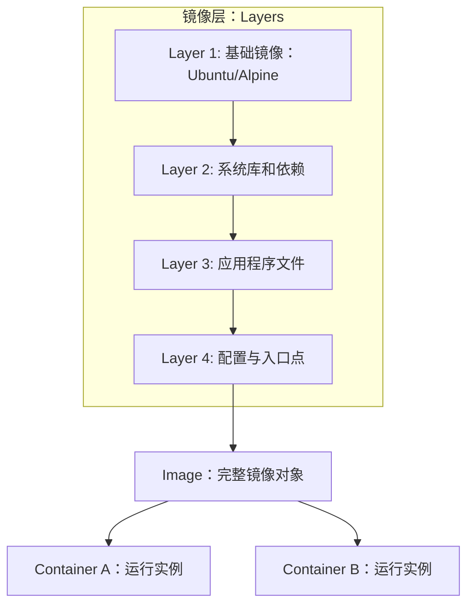

# registry和image
在 **containerd** 里，`registry` 和 `image` 是两个不同层次的概念：
## 📌 Registry 的含义
- **定义**：Registry 是镜像仓库服务，负责存储和分发镜像。  
- **作用**：提供镜像的拉取（pull）、推送（push）、索引（resolve）等功能。  
- **示例**：  
  - 公共仓库：`docker.io`、`quay.io`、`ghcr.io`  
  - 私有仓库：`cr.openfuyao.cn`、企业内部 Harbor  

在 containerd 配置中，registry 通常通过 `mirrors` 或 `hosts.toml` 指定，告诉 containerd 去哪个服务拉取镜像。
## 📌 Image 的含义
- **定义**：Image 是存放在 registry 中的具体镜像对象，由一系列层（layers）组成。  
- **命名规则**：`<registry>/<namespace>/<repository>:<tag>`  
  - 例如：`cr.openfuyao.cn/openfuyao/bke-online-installed:1.0.5`  
- **作用**：镜像是容器运行的基础，包含文件系统快照和元数据。  
- **在 containerd 中的表现**：  
  - 拉取镜像后会存储在本地 `/var/lib/containerd/io.containerd.content.v1.content`  
  - 通过 `ctr images ls` 或 `nerdctl images` 可以查看本地镜像。  
## 📊 Registry 与 Image 的关系
| 概念 | 层次 | 例子 | 在 containerd 中的作用 |
|------|------|------|------------------------|
| **Registry** | 服务层 | `cr.openfuyao.cn` | 镜像存储与分发的服务端 |
| **Image** | 对象层 | `cr.openfuyao.cn/openfuyao/bke-online-installed:1.0.5` | 存放在 registry 中的具体镜像，供拉取和运行 |
## 🎯 总结
- **Registry** 是镜像的仓库服务，负责存储和分发。  
- **Image** 是仓库里的具体镜像对象，由层组成，带有标签。  
- 在 containerd 中，配置 registry 是为了告诉它去哪里找镜像，而 image 是实际运行的内容。  
## Registry → Repository → Image → Container 的层次关系图

📌 图解说明
- **Registry**：镜像仓库服务，例如 `docker.io`、`cr.openfuyao.cn`。  
- **Repository**：仓库中的项目或命名空间，例如 `openfuyao/bke-online-installed`。  
- **Image**：具体的镜像对象，由层组成，并带有标签，例如 `:1.0.5`。  
- **Container**：镜像运行后的实例，带有进程和文件系统。  

这样你可以直观地看到：  
- Registry 是最顶层的服务。  
- Repository 是 Registry 内的分类。  
- Image 是 Repository 中的具体版本。  
- Container 是镜像运行后的实体。  
## 多镜像版本 → 多容器实例的关系图

 📌 图解说明
- **Registry**：镜像仓库服务，例如 `cr.openfuyao.cn`。  
- **Repository**：仓库中的项目，例如 `openfuyao/bke-online-installed`。  
- **Image**：同一个 Repository 下的不同版本镜像（如 `:1.0.4`、`:1.0.5`、`:1.0.6`）。  
- **Container**：镜像运行后的实例，一个镜像可以启动多个容器。  

这样你可以清晰看到：  
- 一个 Repository 可以有多个版本镜像。  
- 每个镜像可以运行多个容器实例。  
## 镜像层（layers）→ 镜像 → 容器关系图

📌 图解说明
- **Layers**：镜像由多层文件系统叠加而成，每层只保存差异。  
  - Layer 1：基础镜像（如 Ubuntu、Alpine）。  
  - Layer 2：系统库和依赖。  
  - Layer 3：应用程序文件。  
  - Layer 4：配置与入口点。  
- **Image**：所有层叠加后的整体镜像对象。  
- **Container**：镜像运行后的实例，可以同时运行多个容器。  

这样你可以直观理解：  
- 镜像是由多个层组成的。  
- 镜像可以启动多个容器实例。  
- 容器共享镜像层，但有自己的运行时读写层。  
