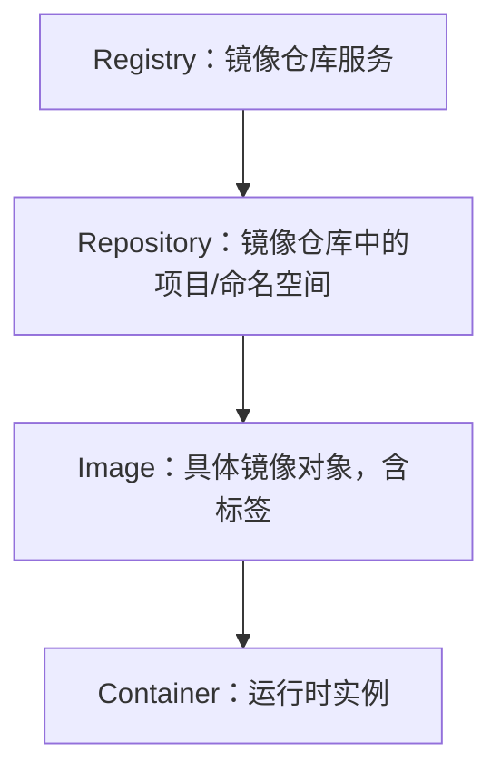
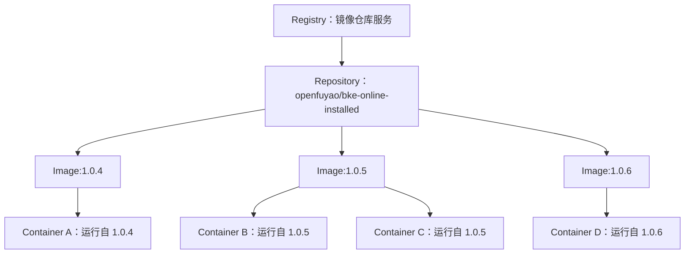
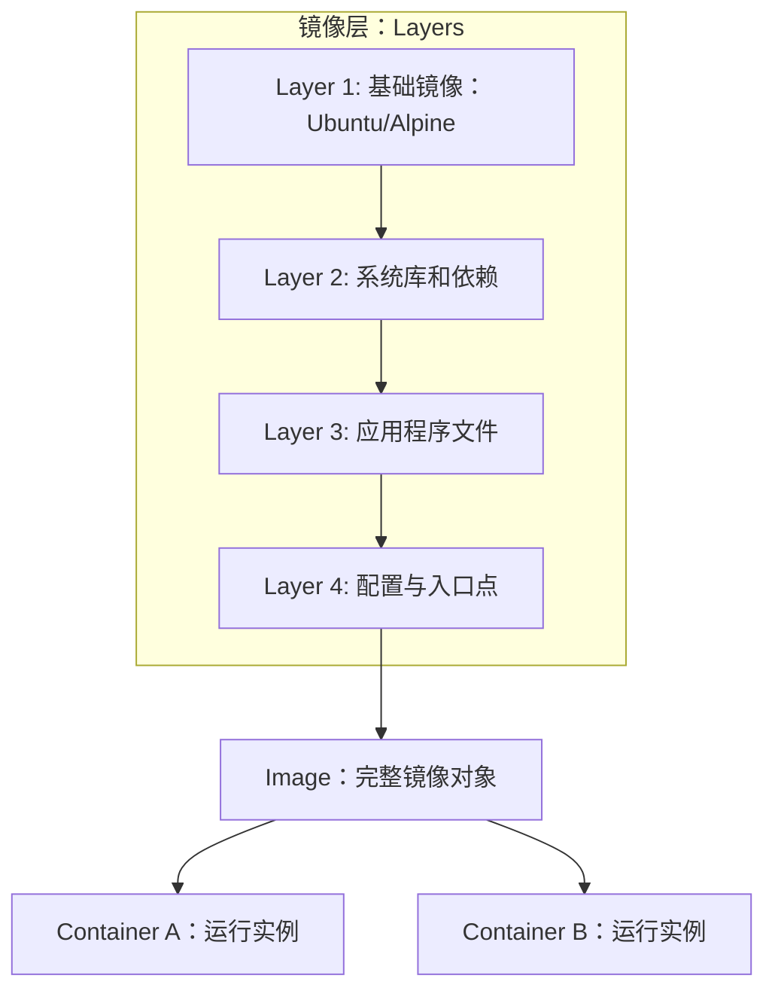
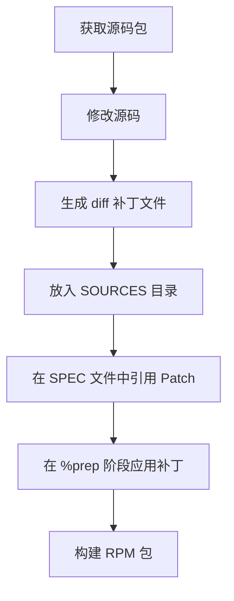

# registry和image
在 **containerd** 里，`registry` 和 `image` 是两个不同层次的概念：
## 📌 Registry 的含义
- **定义**：Registry 是镜像仓库服务，负责存储和分发镜像。  
- **作用**：提供镜像的拉取（pull）、推送（push）、索引（resolve）等功能。  
- **示例**：  
  - 公共仓库：`docker.io`、`quay.io`、`ghcr.io`  
  - 私有仓库：`cr.openfuyao.cn`、企业内部 Harbor  

在 containerd 配置中，registry 通常通过 `mirrors` 或 `hosts.toml` 指定，告诉 containerd 去哪个服务拉取镜像。
## 📌 Image 的含义
- **定义**：Image 是存放在 registry 中的具体镜像对象，由一系列层（layers）组成。  
- **命名规则**：`<registry>/<namespace>/<repository>:<tag>`  
  - 例如：`cr.openfuyao.cn/openfuyao/bke-online-installed:1.0.5`  
- **作用**：镜像是容器运行的基础，包含文件系统快照和元数据。  
- **在 containerd 中的表现**：  
  - 拉取镜像后会存储在本地 `/var/lib/containerd/io.containerd.content.v1.content`  
  - 通过 `ctr images ls` 或 `nerdctl images` 可以查看本地镜像。  
## 📊 Registry 与 Image 的关系
| 概念 | 层次 | 例子 | 在 containerd 中的作用 |
|------|------|------|------------------------|
| **Registry** | 服务层 | `cr.openfuyao.cn` | 镜像存储与分发的服务端 |
| **Image** | 对象层 | `cr.openfuyao.cn/openfuyao/bke-online-installed:1.0.5` | 存放在 registry 中的具体镜像，供拉取和运行 |
## 🎯 总结
- **Registry** 是镜像的仓库服务，负责存储和分发。  
- **Image** 是仓库里的具体镜像对象，由层组成，带有标签。  
- 在 containerd 中，配置 registry 是为了告诉它去哪里找镜像，而 image 是实际运行的内容。  
## Registry → Repository → Image → Container 的层次关系图

📌 图解说明
- **Registry**：镜像仓库服务，例如 `docker.io`、`cr.openfuyao.cn`。  
- **Repository**：仓库中的项目或命名空间，例如 `openfuyao/bke-online-installed`。  
- **Image**：具体的镜像对象，由层组成，并带有标签，例如 `:1.0.5`。  
- **Container**：镜像运行后的实例，带有进程和文件系统。  

这样你可以直观地看到：  
- Registry 是最顶层的服务。  
- Repository 是 Registry 内的分类。  
- Image 是 Repository 中的具体版本。  
- Container 是镜像运行后的实体。  
## 多镜像版本 → 多容器实例的关系图

 📌 图解说明
- **Registry**：镜像仓库服务，例如 `cr.openfuyao.cn`。  
- **Repository**：仓库中的项目，例如 `openfuyao/bke-online-installed`。  
- **Image**：同一个 Repository 下的不同版本镜像（如 `:1.0.4`、`:1.0.5`、`:1.0.6`）。  
- **Container**：镜像运行后的实例，一个镜像可以启动多个容器。  

这样你可以清晰看到：  
- 一个 Repository 可以有多个版本镜像。  
- 每个镜像可以运行多个容器实例。  
## 镜像层（layers）→ 镜像 → 容器关系图

📌 图解说明
- **Layers**：镜像由多层文件系统叠加而成，每层只保存差异。  
  - Layer 1：基础镜像（如 Ubuntu、Alpine）。  
  - Layer 2：系统库和依赖。  
  - Layer 3：应用程序文件。  
  - Layer 4：配置与入口点。  
- **Image**：所有层叠加后的整体镜像对象。  
- **Container**：镜像运行后的实例，可以同时运行多个容器。  

这样你可以直观理解：  
- 镜像是由多个层组成的。  
- 镜像可以启动多个容器实例。  
- 容器共享镜像层，但有自己的运行时读写层。  

# 镜像同步`skopeo` 和 `crane`
在 **镜像同步** 场景下，`skopeo` 和 `crane` 都是常用的工具，可以在不同的镜像仓库之间复制镜像，而无需先拉取到本地再推送。下面给你几个实用样例：  
## 📌 使用 `skopeo` 同步镜像
`skopeo` 是 Red Hat 推出的容器镜像管理工具，支持直接在仓库之间复制镜像。
### 1. 从 Docker Hub 同步到私有仓库
```bash
skopeo copy docker://nginx:1.23.0-alpine docker://cr.openfuyao.cn/openfuyao/nginx:1.23.0-alpine
```
### 2. 从私有仓库同步到本地目录
```bash
skopeo copy docker://cr.openfuyao.cn/openfuyao/nginx:1.23.0-alpine dir:/tmp/nginx-image
```
### 3. 从本地目录导入到另一个仓库
```bash
skopeo copy dir:/tmp/nginx-image docker://registry.example.com/nginx:1.23.0-alpine
```
## 📌 使用 `crane` 同步镜像
`crane` 是 Google 的 go-containerregistry 提供的工具，轻量快速，常用于 CI/CD。
### 1. 复制镜像到另一个仓库
```bash
crane cp nginx:1.23.0-alpine cr.openfuyao.cn/openfuyao/nginx:1.23.0-alpine
```
### 2. 拉取镜像到本地 tar 文件
```bash
crane pull nginx:1.23.0-alpine nginx.tar
```
### 3. 推送本地 tar 文件到仓库
```bash
crane push nginx.tar cr.openfuyao.cn/openfuyao/nginx:1.23.0-alpine
```
## 📊 对比总结
| 工具   | 优点 | 常见场景 |
|--------|------|----------|
| **skopeo** | 功能全面，支持多种存储后端（dir、tar、registry） | 跨仓库同步、离线导出导入 |
| **crane**  | 命令简洁，速度快，适合 CI/CD | 快速复制、拉取/推送 tar 文件 |

 总结：
- 如果你需要 跨仓库同步 或 多种存储后端支持 → 用 skopeo。
- 如果你在 CI/CD 流水线中快速复制镜像 → 用 crane。

# 制作 patch 的设计思路
在 RPM 软件包维护中，**制作 patch 的设计思路**其实就是把源码的改动抽象成一个可复用的补丁文件，并在 `.spec` 文件中统一管理。这样既能保持源码包的“原汁原味”，又能保证改动的可追溯性和可维护性。  
## 📌 设计思路核心
1. **保持源码完整性**  
   - 不直接修改 `SOURCES` 下的 tar 包。  
   - 所有改动通过 `diff` 生成 patch 文件，放在 `SOURCES` 目录。  

2. **补丁文件化管理**  
   - 每个改动对应一个独立的 patch 文件。  
   - 命名规范：`mypackage-bugfix.patch`、`mypackage-feature.patch`。  
   - 在 `.spec` 文件中用 `PatchX` 引用。  

3. **在 SPEC 文件中应用补丁**  
   - 在 `%prep` 阶段使用 `%patchX -pN` 应用补丁。  
   - 保证构建时自动应用，而不是手工修改。  

4. **多补丁顺序控制**  
   - 如果有多个补丁，按顺序在 `%prep` 中应用。  
   - 避免补丁之间冲突，必要时合并。  

5. **可追溯性与维护性**  
   - 每个补丁文件都能通过 `diff` 追溯改动来源。  
   - 方便后续升级版本时重新评估哪些补丁仍然需要。  
## 🧩 设计流程图（简化）

## 📊 思路总结
| 目标 | 设计原则 |
|------|----------|
| 保持源码原始性 | 不直接改 tar 包，所有改动通过 patch |
| 管理改动 | 每个改动独立 patch 文件，命名规范 |
| 自动化构建 | 在 `.spec` 文件中统一应用补丁 |
| 可维护性 | 补丁可追溯，升级时可选择性保留或移除 |

✅ **结论**：RPM patch 的设计思路就是 **“源码不动，改动文件化，SPEC 管理，构建自动化”**。这样既能保证源码包的完整性，又能让改动清晰可追溯，方便后续维护和升级。  

# Registry 格式和 OCI Layout 格式
在容器镜像分发中，**Registry 格式**和 **OCI Layout 格式**是两种常见的镜像存储/分发方式，它们的用途和场景有所不同。  
## 📌 Registry 格式
- **定义**：指镜像存储在远程镜像仓库（如 Docker Hub、Harbor、Quay、私有 Registry）中的标准格式。  
- **访问方式**：通过 `docker://` 或 `oci://` 协议访问，例如：
  ```bash
  docker pull nginx:1.23.0-alpine
  ```
- **特点**：
  - 镜像分层存储在远程仓库。
  - 支持认证、权限控制、镜像签名。
  - 适合团队协作和生产环境分发。  
## 📌 OCI Layout 格式
- **定义**：OCI（Open Container Initiative）定义的本地目录布局格式，用于在文件系统中存储镜像。  
- **访问方式**：通过 `oci:` 协议访问，例如：
  ```bash
  skopeo copy docker://nginx:1.23.0-alpine oci:/tmp/nginx-oci:latest
  ```
- **目录结构**：
  ```
  oci-layout
  index.json
  blobs/
  ```
- **特点**：
  - 镜像以标准化目录形式存储在本地。
  - 适合离线环境、CI/CD 流程中间产物。
  - 可移植性强，工具（skopeo、crane、oras）都能识别。  
## 📊 对比总结
| 格式 | 存储位置 | 使用场景 | 访问方式 |
|------|----------|----------|----------|
| **Registry** | 远程镜像仓库 | 团队协作、生产环境分发 | `docker://` |
| **OCI Layout** | 本地文件系统目录 | 离线环境、CI/CD 中间产物 | `oci:` |

✅ **总结**：  
- **Registry 格式** → 远程仓库分发，适合生产环境。  
- **OCI Layout 格式** → 本地目录存储，适合离线和构建流程。  

# Manifest List 机制
**Manifest List 机制**是容器镜像规范中的一个关键设计，用来支持 **多架构镜像（multi-arch images）**。它的核心思想是：同一个镜像标签（例如 `nginx:latest`）可以对应多个不同平台的镜像版本，客户端根据自身平台自动拉取合适的镜像。  
## 📌 Manifest List 的作用
- **统一镜像标签**：用户只需拉取一次镜像标签，不必关心平台差异。  
- **多架构支持**：同一个镜像可以包含 `amd64`、`arm64`、ppc64le 等不同架构的版本。  
- **自动选择**：Docker 或 containerd 客户端会根据本机平台自动选择合适的镜像。  
## 🧩 工作机制
1. **Manifest List** 是一个 JSON 文档，包含多个 **Manifest** 的引用。  
2. 每个 Manifest 描述一个具体平台的镜像（包括架构、操作系统、镜像层信息）。  
3. 客户端拉取镜像时：  
   - 首先获取 Manifest List。  
   - 根据本机平台（如 `linux/amd64`）选择对应的 Manifest。  
   - 拉取该平台的镜像层。  
## 📊 示例（简化版）
Manifest List JSON 结构：
```json
{
  "schemaVersion": 2,
  "mediaType": "application/vnd.oci.image.index.v1+json",
  "manifests": [
    {
      "mediaType": "application/vnd.oci.image.manifest.v1+json",
      "digest": "sha256:abcd1234...",
      "platform": {
        "architecture": "amd64",
        "os": "linux"
      }
    },
    {
      "mediaType": "application/vnd.oci.image.manifest.v1+json",
      "digest": "sha256:efgh5678...",
      "platform": {
        "architecture": "arm64",
        "os": "linux"
      }
    }
  ]
}
```
## ⚠️ 注意事项
- **构建工具支持**：`docker buildx`、`podman`、`crane`、`skopeo` 都支持生成 Manifest List。  
- **推送到 Registry**：Manifest List 存储在镜像仓库中，客户端拉取时自动解析。  
- **兼容性**：旧版 Docker 客户端可能不支持 Manifest List，需要升级。  

✅ **总结**：Manifest List 机制就是 **多架构镜像的索引表**，通过一个统一的标签指向多个平台的镜像，客户端根据自身平台自动选择合适的版本。这让镜像分发更简洁，避免用户手动区分不同架构的镜像。  

# Manifest 类型
在容器镜像规范里，**Manifest 类型**主要有两种：  
## 📌 Docker V2 Schema 2 List
- **来源**：Docker Registry API v2 定义的多架构镜像索引格式。  
- **文件类型**：`application/vnd.docker.distribution.manifest.list.v2+json`  
- **作用**：  
  - 用于描述一组镜像 Manifest，每个 Manifest 对应一个平台（架构 + 操作系统）。  
  - 客户端拉取镜像时，根据本机平台选择合适的 Manifest。  
- **特点**：  
  - Docker 专用格式，兼容 Docker CLI 与 Registry。  
  - 是 Docker 生态早期实现多架构镜像的方式。  
## 📌 OCI Image Index
- **来源**：OCI（Open Container Initiative）镜像规范定义的标准格式。  
- **文件类型**：`application/vnd.oci.image.index.v1+json`  
- **作用**：  
  - 与 Docker V2 Schema 2 List 类似，也是多架构镜像的索引。  
  - 更通用，支持 OCI Layout、本地目录、ORAS 等工具。  
- **特点**：  
  - 规范化，跨工具、跨平台兼容性更好。  
  - 是未来推荐的标准，Docker 也逐步支持 OCI 格式。  
## 📊 对比总结
| 类型 | MIME 类型 | 适用范围 | 特点 |
|------|-----------|----------|------|
| **Docker V2 Schema 2 List** | `application/vnd.docker.distribution.manifest.list.v2+json` | Docker Registry | Docker 专用，早期多架构实现 |
| **OCI Image Index** | `application/vnd.oci.image.index.v1+json` | OCI 规范、Registry、OCI Layout | 标准化，跨工具兼容性更好 |

✅ **总结**：  
- **Docker V2 Schema 2 List** → Docker Registry 的多架构镜像索引。  
- **OCI Image Index** → OCI 标准的多架构镜像索引，更通用、跨平台。  

# Bastion 节点
在 **Cluster API (CAPI)** 的语境里，**Bastion 节点** 是一个常见但容易被忽略的概念。它并不是 CAPI 的核心 CRD 对象，而是 **基础设施 Provider（Infrastructure Provider）层面的一种辅助节点**。  
## 📌 Bastion 节点的作用
- **安全跳板机 (Jump Host)**：在云环境或受限网络里，工作节点和控制平面节点通常不直接暴露到公网。  
- **用途**：Bastion 节点提供一个安全入口，管理员可以通过它 SSH 到集群节点。  
- **位置**：通常部署在公有子网，具备公网 IP，作为访问私有子网中节点的中转。  
## 🧩 在 Cluster API 中的角色
- **Infrastructure Provider**（如 CAPA for AWS、CAPZ for Azure）会在集群创建时，自动或可选地创建 Bastion 节点。  
- **Cluster 对象**里可以指定是否需要 Bastion 节点。  
- Bastion 节点本身不是 CAPI 的核心 CRD，而是 Provider 的实现细节。  
## 📊 类比理解
- **Cluster** = 整个集群蓝图  
- **ControlPlane** = 管理集群大脑  
- **MachineDeployment** = 管理工作节点组  
- **Bastion 节点** = 安全入口的“门卫”，帮助你进入集群内部  
## ✅ 总结
- Bastion 节点是 **安全访问集群的跳板机**，由 Infrastructure Provider 提供。  
- 它不是 CAPI 的核心对象，但在实际生产环境里非常重要。  
- 在 AWS、Azure 等 Provider 中，通常可以通过 Cluster 配置开启或关闭 Bastion 节点。  

