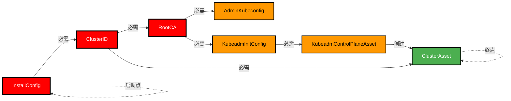
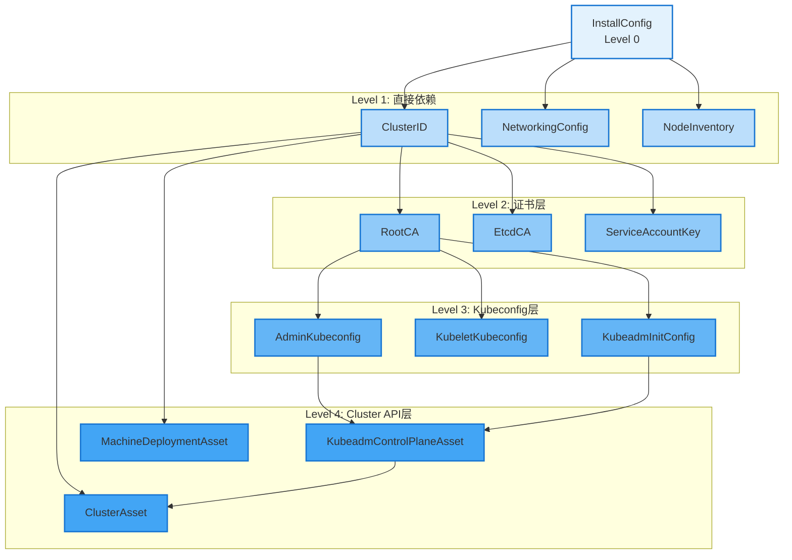

# Asset
          
# 基于openFuyao可扩展安装框架，整理完整的Asset清单及各自作用
## openFuyao Installer Asset清单
### 一、配置类Asset
#### 1.1 InstallConfig
**作用**: 集群安装配置的核心资产，包含所有安装参数

**依赖**: 无

**生成文件**:
- `install-config.yaml`: 安装配置文件

**包含内容**:
- 集群名称和基础域名
- 平台配置（UPI/IPI）
- 网络配置
- 节点清单
- Kubernetes版本
- 镜像仓库配置
- 操作系统配置

**安装阶段**: Phase 1
#### 1.2 ClusterID
**作用**: 生成唯一的集群标识符

**依赖**:
- InstallConfig

**生成文件**:
- `cluster-id.yaml`: 集群ID文件

**包含内容**:
- 集群ID（UUID格式）
- 基础设施ID
- 集群名称

**安装阶段**: Phase 1
#### 1.3 NetworkingConfig
**作用**: 网络配置资产

**依赖**:
- InstallConfig

**生成文件**:
- `network-config.yaml`: 网络配置文件

**包含内容**:
- Pod子网
- Service子网
- DNS域名
- 网络插件配置
- 网络策略配置

**安装阶段**: Phase 1
#### 1.4 DNSConfig
**作用**: DNS配置资产

**依赖**:
- InstallConfig
- ClusterID

**生成文件**:
- `dns-config.yaml`: DNS配置文件
- `dns-records.yaml`: DNS记录清单（UPI场景）

**包含内容**:
- 基础域名
- 集群域名
- API Server域名
- 应用域名
- DNS记录列表

**安装阶段**: Phase 1
#### 1.5 NodeInventory
**作用**: 节点清单资产

**依赖**:
- InstallConfig

**生成文件**:
- `node-inventory.yaml`: 节点清单文件

**包含内容**:
- Master节点列表
- Worker节点列表
- 节点角色分配
- 节点SSH信息

**安装阶段**: Phase 1
### 二、证书类Asset
#### 2.1 RootCA
**作用**: Kubernetes根CA证书

**依赖**:
- ClusterID

**生成文件**:
- `certs/ca.crt`: 根CA证书
- `certs/ca.key`: 根CA私钥

**包含内容**:
- 根CA证书（10年有效期）
- 根CA私钥（RSA 2048位）

**安装阶段**: Phase 2
#### 2.2 EtcdCA
**作用**: Etcd CA证书

**依赖**:
- ClusterID

**生成文件**:
- `certs/etcd/ca.crt`: Etcd CA证书
- `certs/etcd/ca.key`: Etcd CA私钥

**包含内容**:
- Etcd CA证书
- Etcd CA私钥

**安装阶段**: Phase 2
#### 2.3 KubeCA
**作用**: Kubernetes CA证书（用于签署客户端证书）

**依赖**:
- ClusterID

**生成文件**:
- `certs/kube-ca.crt`: Kube CA证书
- `certs/kube-ca.key`: Kube CA私钥

**包含内容**:
- Kube CA证书
- Kube CA私钥

**安装阶段**: Phase 2
#### 2.4 FrontProxyCA
**作用**: 前端代理CA证书

**依赖**:
- ClusterID

**生成文件**:
- `certs/front-proxy-ca.crt`: 前端代理CA证书
- `certs/front-proxy-ca.key`: 前端代理CA私钥

**包含内容**:
- 前端代理CA证书
- 前端代理CA私钥

**安装阶段**: Phase 2
#### 2.5 ServiceAccountKey
**作用**: 服务账户密钥对

**依赖**:
- ClusterID

**生成文件**:
- `certs/sa.pub`: 服务账户公钥
- `certs/sa.key`: 服务账户私钥

**包含内容**:
- 服务账户公钥
- 服务账户私钥

**安装阶段**: Phase 2
#### 2.6 APIServerCert
**作用**: API Server证书

**依赖**:
- RootCA
- InstallConfig

**生成文件**:
- `certs/apiserver.crt`: API Server证书
- `certs/apiserver.key`: API Server私钥

**包含内容**:
- API Server证书（包含所有SAN）
- API Server私钥

**安装阶段**: Phase 2
#### 2.7 KubeletCert
**作用**: Kubelet证书

**依赖**:
- RootCA
- NodeInventory

**生成文件**:
- `certs/kubelet.crt`: Kubelet证书
- `certs/kubelet.key`: Kubelet私钥

**包含内容**:
- Kubelet证书
- Kubelet私钥

**安装阶段**: Phase 2
#### 2.8 EtcdCert
**作用**: Etcd服务器证书

**依赖**:
- EtcdCA
- NodeInventory

**生成文件**:
- `certs/etcd/server.crt`: Etcd服务器证书
- `certs/etcd/server.key`: Etcd服务器私钥
- `certs/etcd/peer.crt`: Etcd对等证书
- `certs/etcd/peer.key`: Etcd对等私钥

**包含内容**:
- Etcd服务器证书和私钥
- Etcd对等证书和私钥

**安装阶段**: Phase 2
#### 2.9 FrontProxyClientCert
**作用**: 前端代理客户端证书

**依赖**:
- FrontProxyCA

**生成文件**:
- `certs/front-proxy-client.crt`: 前端代理客户端证书
- `certs/front-proxy-client.key`: 前端代理客户端私钥

**包含内容**:
- 前端代理客户端证书
- 前端代理客户端私钥

**安装阶段**: Phase 2
### 三、Kubeconfig类Asset
#### 3.1 AdminKubeconfig
**作用**: 管理员kubeconfig文件

**依赖**:
- RootCA
- ClusterID
- InstallConfig

**生成文件**:
- `kubeconfigs/admin.conf`: 管理员kubeconfig

**包含内容**:
- 集群信息
- 用户证书
- 上下文配置

**安装阶段**: Phase 3
#### 3.2 KubeletKubeconfig
**作用**: Kubelet kubeconfig文件

**依赖**:
- RootCA
- KubeletCert
- ClusterID

**生成文件**:
- `kubeconfigs/kubelet.conf`: Kubelet kubeconfig

**包含内容**:
- 集群信息
- Kubelet证书
- 上下文配置

**安装阶段**: Phase 3
#### 3.3 ControllerManagerKubeconfig
**作用**: Controller Manager kubeconfig文件

**依赖**:
- RootCA
- ClusterID

**生成文件**:
- `kubeconfigs/controller-manager.conf`: Controller Manager kubeconfig

**包含内容**:
- 集群信息
- Controller Manager证书
- 上下文配置

**安装阶段**: Phase 3
#### 3.4 SchedulerKubeconfig
**作用**: Scheduler kubeconfig文件

**依赖**:
- RootCA
- ClusterID

**生成文件**:
- `kubeconfigs/scheduler.conf`: Scheduler kubeconfig

**包含内容**:
- 集群信息
- Scheduler证书
- 上下文配置

**安装阶段**: Phase 3
### 四、配置文件Asset
#### 4.1 NodeSetupScripts
**作用**: 节点设置脚本

**依赖**:
- InstallConfig
- 所有证书Asset
- 所有Kubeconfig Asset

**生成文件**:
- `scripts/common.sh`: 通用配置脚本
- `scripts/master-init.sh`: Master初始化脚本
- `scripts/master-join.sh`: Master加入脚本
- `scripts/worker-join.sh`: Worker加入脚本

**包含内容**:
- 系统配置脚本
- 容器运行时安装脚本
- Kubernetes组件安装脚本
- 节点加入脚本

**安装阶段**: Phase 4
#### 4.2 KubeadmInitConfig
**作用**: Kubeadm初始化配置

**依赖**:
- InstallConfig
- 所有证书Asset

**生成文件**:
- `kubeadm/kubeadm-init.yaml`: Kubeadm初始化配置

**包含内容**:
- ClusterConfiguration
- InitConfiguration
- 证书路径配置
- 网络配置

**安装阶段**: Phase 4
#### 4.3 KubeadmJoinConfig
**作用**: Kubeadm Join配置

**依赖**:
- InstallConfig
- RootCA

**生成文件**:
- `kubeadm/kubeadm-join.yaml`: Kubeadm Join配置

**包含内容**:
- JoinConfiguration
- Discovery配置
- 节点注册配置

**安装阶段**: Phase 4
#### 4.4 ContainerdConfig
**作用**: Containerd配置文件

**依赖**:
- InstallConfig

**生成文件**:
- `configs/containerd/config.toml`: Containerd配置

**包含内容**:
- 运行时配置
- 镜像仓库配置
- Cgroup配置
- 插件配置

**安装阶段**: Phase 4
#### 4.5 SystemConfig
**作用**: 系统配置文件

**依赖**:
- InstallConfig

**生成文件**:
- `configs/sysctl/99-kubernetes.conf`: 内核参数配置
- `configs/modules/k8s.conf`: 内核模块配置

**包含内容**:
- 内核参数配置
- 内核模块配置
- 系统限制配置

**安装阶段**: Phase 4
#### 4.6 NetworkConfig
**作用**: 网络配置文件

**依赖**:
- NetworkingConfig

**生成文件**:
- `configs/network/cni.yaml`: CNI配置
- `configs/network/iptables.rules`: iptables规则

**包含内容**:
- CNI网络配置
- iptables规则
- 网络策略配置

**安装阶段**: Phase 4
### 五、清单类Asset
#### 5.1 CNIManifests
**作用**: CNI网络插件清单

**依赖**:
- InstallConfig
- NetworkingConfig

**生成文件**:
- `manifests/cni/calico.yaml`: Calico清单
- `manifests/cni/flannel.yaml`: Flannel清单
- `manifests/cni/cilium.yaml`: Cilium清单

**包含内容**:
- CNI DaemonSet
- CNI ConfigMap
- CNI RBAC

**安装阶段**: Phase 5

#### 5.2 CSIManifests
**作用**: CSI存储插件清单

**依赖**:
- InstallConfig

**生成文件**:
- `manifests/csi/csi-driver.yaml`: CSI驱动清单
- `manifests/csi/storage-class.yaml`: 存储类清单

**包含内容**:
- CSI Controller
- CSI Node
- StorageClass
- CSIDriver

**安装阶段**: Phase 5
#### 5.3 AddonManifests
**作用**: 集群插件清单

**依赖**:
- InstallConfig

**生成文件**:
- `manifests/addons/metrics-server.yaml`: Metrics Server清单
- `manifests/addons/dashboard.yaml`: Dashboard清单
- `manifests/addons/ingress-nginx.yaml`: Ingress Nginx清单

**包含内容**:
- Metrics Server
- Dashboard
- Ingress Controller
- 其他插件

**安装阶段**: Phase 5
### 六、Cluster API资源Asset
#### 6.1 ClusterAsset
**作用**: Cluster API Cluster资源

**依赖**:
- InstallConfig
- ClusterID
- BareMetalClusterAsset

**生成文件**:
- `cluster-api/cluster.yaml`: Cluster资源

**包含内容**:
- Cluster CRD
- 控制平面端点
- 基础设施引用
- 控制平面引用

**安装阶段**: Phase 6
#### 6.2 BareMetalClusterAsset
**作用**: BareMetalCluster基础设施资源

**依赖**:
- InstallConfig
- ClusterID

**生成文件**:
- `cluster-api/baremetal-cluster.yaml`: BareMetalCluster资源

**包含内容**:
- BareMetalCluster CRD
- 控制平面端点
- 网络配置
- SSH配置

**安装阶段**: Phase 6
#### 6.3 KubeadmControlPlaneAsset
**作用**: Kubeadm控制平面资源

**依赖**:
- InstallConfig
- ClusterID
- 所有证书Asset
- KubeadmInitConfig

**生成文件**:
- `cluster-api/kubeadm-control-plane.yaml`: KubeadmControlPlane资源

**包含内容**:
- KubeadmControlPlane CRD
- 副本数配置
- Kubeadm配置
- 机器模板

**安装阶段**: Phase 6
#### 6.4 MachineDeploymentAsset
**作用**: Worker节点MachineDeployment资源

**依赖**:
- InstallConfig
- ClusterID
- BareMetalMachineTemplateAsset
- KubeadmConfigTemplateAsset

**生成文件**:
- `cluster-api/machine-deployment.yaml`: MachineDeployment资源

**包含内容**:
- MachineDeployment CRD
- 副本数配置
- 选择器配置
- 机器模板

**安装阶段**: Phase 6
#### 6.5 BareMetalMachineTemplateAsset
**作用**: BareMetal机器模板资源

**依赖**:
- InstallConfig
- NodeInventory

**生成文件**:
- `cluster-api/baremetal-machine-template-master.yaml`: Master机器模板
- `cluster-api/baremetal-machine-template-worker.yaml`: Worker机器模板

**包含内容**:
- BareMetalMachineTemplate CRD
- 节点配置
- SSH配置

**安装阶段**: Phase 6
#### 6.6 KubeadmConfigTemplateAsset
**作用**: Kubeadm配置模板资源

**依赖**:
- InstallConfig
- KubeadmJoinConfig

**生成文件**:
- `cluster-api/kubeadm-config-template.yaml`: KubeadmConfigTemplate资源

**包含内容**:
- KubeadmConfigTemplate CRD
- Join配置模板
- 文件列表
- 命令列表

**安装阶段**: Phase 6
### 七、状态类Asset
#### 7.1 ClusterMetadata
**作用**: 集群元数据

**依赖**:
- InstallConfig
- ClusterID

**生成文件**:
- `metadata.json`: 集群元数据文件

**包含内容**:
- 集群名称
- 集群ID
- 基础设施ID
- API Server地址
- 安装时间

**安装阶段**: Phase 7
#### 7.2 InstallState
**作用**: 安装状态持久化

**依赖**: 无

**生成文件**:
- `.bke_install_state.json`: 安装状态文件

**包含内容**:
- 当前安装阶段
- 已完成阶段
- 资产生成状态
- 错误信息

**安装阶段**: 全程
### 八、CVO相关Asset
#### 8.1 ClusterVersionAsset
**作用**: 集群版本资源

**依赖**:
- InstallConfig
- ClusterID

**生成文件**:
- `cluster-version.yaml`: ClusterVersion资源

**包含内容**:
- ClusterVersion CRD
- 当前版本
- 升级配置
- 更新源配置

**安装阶段**: Phase 11
#### 8.2 ClusterOperatorAssets
**作用**: 集群操作员资源

**依赖**:
- ClusterVersionAsset

**生成文件**:
- `cluster-operators/etcd.yaml`: Etcd Operator
- `cluster-operators/kube-apiserver.yaml`: API Server Operator
- `cluster-operators/kube-controller-manager.yaml`: Controller Manager Operator
- `cluster-operators/kube-scheduler.yaml`: Scheduler Operator

**包含内容**:
- ClusterOperator CRD
- 操作员状态
- 版本信息

**安装阶段**: Phase 11
### 九、Asset依赖关系图
```
InstallConfig
    ├── ClusterID
    ├── NetworkingConfig
    ├── DNSConfig
    ├── NodeInventory
    │
    ├── RootCA
    │   ├── APIServerCert
    │   ├── KubeletCert
    │   ├── AdminKubeconfig
    │   ├── KubeletKubeconfig
    │   ├── ControllerManagerKubeconfig
    │   └── SchedulerKubeconfig
    │
    ├── EtcdCA
    │   └── EtcdCert
    │
    ├── FrontProxyCA
    │   └── FrontProxyClientCert
    │
    ├── ServiceAccountKey
    │
    ├── NodeSetupScripts
    ├── KubeadmInitConfig
    ├── KubeadmJoinConfig
    ├── ContainerdConfig
    ├── SystemConfig
    ├── NetworkConfig
    │
    ├── CNIManifests
    ├── CSIManifests
    ├── AddonManifests
    │
    ├── BareMetalClusterAsset
    │   └── ClusterAsset
    │
    ├── BareMetalMachineTemplateAsset
    │   └── MachineDeploymentAsset
    │
    ├── KubeadmConfigTemplateAsset
    │   └── MachineDeploymentAsset
    │
    ├── KubeadmControlPlaneAsset
    │
    ├── ClusterMetadata
    ├── InstallState
    │
    ├── ClusterVersionAsset
    │   └── ClusterOperatorAssets
```
### 十、Asset生成顺序
```
Phase 1: 配置资产
    1. InstallConfig
    2. ClusterID
    3. NetworkingConfig
    4. DNSConfig
    5. NodeInventory

Phase 2: 证书资产
    6. RootCA
    7. EtcdCA
    8. KubeCA
    9. FrontProxyCA
    10. ServiceAccountKey
    11. APIServerCert
    12. KubeletCert
    13. EtcdCert
    14. FrontProxyClientCert

Phase 3: Kubeconfig资产
    15. AdminKubeconfig
    16. KubeletKubeconfig
    17. ControllerManagerKubeconfig
    18. SchedulerKubeconfig

Phase 4: 配置文件资产
    19. NodeSetupScripts
    20. KubeadmInitConfig
    21. KubeadmJoinConfig
    22. ContainerdConfig
    23. SystemConfig
    24. NetworkConfig

Phase 5: 清单资产
    25. CNIManifests
    26. CSIManifests
    27. AddonManifests

Phase 6: Cluster API资产
    28. BareMetalClusterAsset
    29. ClusterAsset
    30. BareMetalMachineTemplateAsset
    31. KubeadmConfigTemplateAsset
    32. KubeadmControlPlaneAsset
    33. MachineDeploymentAsset

Phase 7: 状态资产
    34. ClusterMetadata
    35. InstallState

Phase 8-10: 节点配置和集群启动

Phase 11: CVO资产
    36. ClusterVersionAsset
    37. ClusterOperatorAssets

Phase 12-13: CVO初始化和就绪
```
### 十一、Asset输出目录结构
```
my-cluster/
├── .bke_install_state.json          # 安装状态
├── install-config.yaml               # 安装配置
├── cluster-id.yaml                   # 集群ID
├── network-config.yaml               # 网络配置
├── dns-config.yaml                   # DNS配置
├── dns-records.yaml                  # DNS记录清单
├── node-inventory.yaml               # 节点清单
│
├── certs/                            # 证书目录
│   ├── ca.crt
│   ├── ca.key
│   ├── apiserver.crt
│   ├── apiserver.key
│   ├── kubelet.crt
│   ├── kubelet.key
│   ├── sa.pub
│   ├── sa.key
│   ├── etcd/
│   │   ├── ca.crt
│   │   ├── ca.key
│   │   ├── server.crt
│   │   ├── server.key
│   │   ├── peer.crt
│   │   └── peer.key
│   └── front-proxy/
│       ├── ca.crt
│       ├── ca.key
│       ├── client.crt
│       └── client.key
│
├── kubeconfigs/                      # Kubeconfig目录
│   ├── admin.conf
│   ├── kubelet.conf
│   ├── controller-manager.conf
│   └── scheduler.conf
│
├── scripts/                          # 脚本目录
│   ├── common.sh
│   ├── master-init.sh
│   ├── master-join.sh
│   └── worker-join.sh
│
├── kubeadm/                          # Kubeadm配置目录
│   ├── kubeadm-init.yaml
│   └── kubeadm-join.yaml
│
├── configs/                          # 配置文件目录
│   ├── containerd/
│   │   └── config.toml
│   ├── sysctl/
│   │   └── 99-kubernetes.conf
│   ├── modules/
│   │   └── k8s.conf
│   └── network/
│       ├── cni.yaml
│       └── iptables.rules
│
├── manifests/                        # 清单目录
│   ├── cni/
│   │   ├── calico.yaml
│   │   ├── flannel.yaml
│   │   └── cilium.yaml
│   ├── csi/
│   │   ├── csi-driver.yaml
│   │   └── storage-class.yaml
│   └── addons/
│       ├── metrics-server.yaml
│       ├── dashboard.yaml
│       └── ingress-nginx.yaml
│
├── cluster-api/                      # Cluster API资源目录
│   ├── cluster.yaml
│   ├── baremetal-cluster.yaml
│   ├── kubeadm-control-plane.yaml
│   ├── machine-deployment.yaml
│   ├── baremetal-machine-template-master.yaml
│   ├── baremetal-machine-template-worker.yaml
│   └── kubeadm-config-template.yaml
│
├── cluster-version.yaml              # 集群版本资源
│
├── cluster-operators/                # 集群操作员目录
│   ├── etcd.yaml
│   ├── kube-apiserver.yaml
│   ├── kube-controller-manager.yaml
│   └── kube-scheduler.yaml
│
└── metadata.json                     # 集群元数据
```
这个完整的Asset清单涵盖了openFuyao安装器的所有资产，每个资产都有明确的作用、依赖关系和生成文件，形成了一个完整的资产依赖图和生成顺序。


          
# 基于Asset的依赖关系，生成有向无环图（DAG）
## openFuyao Installer Asset依赖关系DAG

```mermaid
graph TB
    %% 定义样式
    classDef config fill:#e1f5ff,stroke:#01579b,stroke-width:2px
    classDef cert fill:#fff3e0,stroke:#e65100,stroke-width:2px
    classDef kubeconfig fill:#f3e5f5,stroke:#4a148c,stroke-width:2px
    classDef configfile fill:#e8f5e9,stroke:#1b5e20,stroke-width:2px
    classDef manifest fill:#fce4ec,stroke:#880e4f,stroke-width:2px
    classDef clusterapi fill:#f1f8e9,stroke:#33691e,stroke-width:2px
    classDef state fill:#e0f2f1,stroke:#004d40,stroke-width:2px
    classDef cvo fill:#fff8e1,stroke:#f57f17,stroke-width:2px

    %% Phase 1: 配置类Asset
    InstallConfig[InstallConfig<br/>安装配置]:::config
    ClusterID[ClusterID<br/>集群ID]:::config
    NetworkingConfig[NetworkingConfig<br/>网络配置]:::config
    DNSConfig[DNSConfig<br/>DNS配置]:::config
    NodeInventory[NodeInventory<br/>节点清单]:::config

    %% Phase 2: 证书类Asset
    RootCA[RootCA<br/>根CA证书]:::cert
    EtcdCA[EtcdCA<br/>Etcd CA证书]:::cert
    KubeCA[KubeCA<br/>Kube CA证书]:::cert
    FrontProxyCA[FrontProxyCA<br/>前端代理CA]:::cert
    ServiceAccountKey[ServiceAccountKey<br/>服务账户密钥]:::cert
    APIServerCert[APIServerCert<br/>API Server证书]:::cert
    KubeletCert[KubeletCert<br/>Kubelet证书]:::cert
    EtcdCert[EtcdCert<br/>Etcd证书]:::cert
    FrontProxyClientCert[FrontProxyClientCert<br/>前端代理客户端证书]:::cert

    %% Phase 3: Kubeconfig类Asset
    AdminKubeconfig[AdminKubeconfig<br/>管理员kubeconfig]:::kubeconfig
    KubeletKubeconfig[KubeletKubeconfig<br/>Kubelet kubeconfig]:::kubeconfig
    ControllerManagerKubeconfig[ControllerManagerKubeconfig<br/>Controller Manager kubeconfig]:::kubeconfig
    SchedulerKubeconfig[SchedulerKubeconfig<br/>Scheduler kubeconfig]:::kubeconfig

    %% Phase 4: 配置文件Asset
    NodeSetupScripts[NodeSetupScripts<br/>节点设置脚本]:::configfile
    KubeadmInitConfig[KubeadmInitConfig<br/>Kubeadm初始化配置]:::configfile
    KubeadmJoinConfig[KubeadmJoinConfig<br/>Kubeadm Join配置]:::configfile
    ContainerdConfig[ContainerdConfig<br/>Containerd配置]:::configfile
    SystemConfig[SystemConfig<br/>系统配置]:::configfile
    NetworkConfigFile[NetworkConfig<br/>网络配置文件]:::configfile

    %% Phase 5: 清单类Asset
    CNIManifests[CNIManifests<br/>CNI清单]:::manifest
    CSIManifests[CSIManifests<br/>CSI清单]:::manifest
    AddonManifests[AddonManifests<br/>插件清单]:::manifest

    %% Phase 6: Cluster API资源Asset
    BareMetalClusterAsset[BareMetalClusterAsset<br/>BareMetal集群资产]:::clusterapi
    ClusterAsset[ClusterAsset<br/>Cluster资产]:::clusterapi
    BareMetalMachineTemplateAsset[BareMetalMachineTemplateAsset<br/>BareMetal机器模板]:::clusterapi
    KubeadmConfigTemplateAsset[KubeadmConfigTemplateAsset<br/>Kubeadm配置模板]:::clusterapi
    KubeadmControlPlaneAsset[KubeadmControlPlaneAsset<br/>Kubeadm控制平面]:::clusterapi
    MachineDeploymentAsset[MachineDeploymentAsset<br/>MachineDeployment]:::clusterapi

    %% Phase 7: 状态类Asset
    ClusterMetadata[ClusterMetadata<br/>集群元数据]:::state
    InstallState[InstallState<br/>安装状态]:::state

    %% Phase 11: CVO相关Asset
    ClusterVersionAsset[ClusterVersionAsset<br/>集群版本资产]:::cvo
    ClusterOperatorAssets[ClusterOperatorAssets<br/>集群操作员资产]:::cvo

    %% Phase 1依赖关系
    InstallConfig --> ClusterID
    InstallConfig --> NetworkingConfig
    InstallConfig --> DNSConfig
    InstallConfig --> NodeInventory
    ClusterID --> DNSConfig

    %% Phase 2依赖关系
    ClusterID --> RootCA
    ClusterID --> EtcdCA
    ClusterID --> KubeCA
    ClusterID --> FrontProxyCA
    ClusterID --> ServiceAccountKey
    
    RootCA --> APIServerCert
    InstallConfig --> APIServerCert
    
    RootCA --> KubeletCert
    NodeInventory --> KubeletCert
    
    EtcdCA --> EtcdCert
    NodeInventory --> EtcdCert
    
    FrontProxyCA --> FrontProxyClientCert

    %% Phase 3依赖关系
    RootCA --> AdminKubeconfig
    ClusterID --> AdminKubeconfig
    InstallConfig --> AdminKubeconfig
    
    RootCA --> KubeletKubeconfig
    KubeletCert --> KubeletKubeconfig
    ClusterID --> KubeletKubeconfig
    
    RootCA --> ControllerManagerKubeconfig
    ClusterID --> ControllerManagerKubeconfig
    
    RootCA --> SchedulerKubeconfig
    ClusterID --> SchedulerKubeconfig

    %% Phase 4依赖关系
    InstallConfig --> NodeSetupScripts
    RootCA --> NodeSetupScripts
    EtcdCA --> NodeSetupScripts
    KubeCA --> NodeSetupScripts
    FrontProxyCA --> NodeSetupScripts
    ServiceAccountKey --> NodeSetupScripts
    APIServerCert --> NodeSetupScripts
    KubeletCert --> NodeSetupScripts
    EtcdCert --> NodeSetupScripts
    FrontProxyClientCert --> NodeSetupScripts
    AdminKubeconfig --> NodeSetupScripts
    KubeletKubeconfig --> NodeSetupScripts
    ControllerManagerKubeconfig --> NodeSetupScripts
    SchedulerKubeconfig --> NodeSetupScripts
    
    InstallConfig --> KubeadmInitConfig
    RootCA --> KubeadmInitConfig
    EtcdCA --> KubeadmInitConfig
    KubeCA --> KubeadmInitConfig
    FrontProxyCA --> KubeadmInitConfig
    ServiceAccountKey --> KubeadmInitConfig
    APIServerCert --> KubeadmInitConfig
    EtcdCert --> KubeadmInitConfig
    
    InstallConfig --> KubeadmJoinConfig
    RootCA --> KubeadmJoinConfig
    
    InstallConfig --> ContainerdConfig
    InstallConfig --> SystemConfig
    NetworkingConfig --> NetworkConfigFile

    %% Phase 5依赖关系
    InstallConfig --> CNIManifests
    NetworkingConfig --> CNIManifests
    
    InstallConfig --> CSIManifests
    InstallConfig --> AddonManifests

    %% Phase 6依赖关系
    InstallConfig --> BareMetalClusterAsset
    ClusterID --> BareMetalClusterAsset
    
    InstallConfig --> ClusterAsset
    ClusterID --> ClusterAsset
    BareMetalClusterAsset --> ClusterAsset
    
    InstallConfig --> BareMetalMachineTemplateAsset
    NodeInventory --> BareMetalMachineTemplateAsset
    
    InstallConfig --> KubeadmConfigTemplateAsset
    KubeadmJoinConfig --> KubeadmConfigTemplateAsset
    
    InstallConfig --> KubeadmControlPlaneAsset
    ClusterID --> KubeadmControlPlaneAsset
    RootCA --> KubeadmControlPlaneAsset
    EtcdCA --> KubeadmControlPlaneAsset
    ServiceAccountKey --> KubeadmControlPlaneAsset
    KubeadmInitConfig --> KubeadmControlPlaneAsset
    
    InstallConfig --> MachineDeploymentAsset
    ClusterID --> MachineDeploymentAsset
    BareMetalMachineTemplateAsset --> MachineDeploymentAsset
    KubeadmConfigTemplateAsset --> MachineDeploymentAsset

    %% Phase 7依赖关系
    InstallConfig --> ClusterMetadata
    ClusterID --> ClusterMetadata

    %% Phase 11依赖关系
    InstallConfig --> ClusterVersionAsset
    ClusterID --> ClusterVersionAsset
    
    ClusterVersionAsset --> ClusterOperatorAssets
```

## 简化版DAG（按阶段分组）

```mermaid
graph TB
    %% 定义样式
    classDef phase1 fill:#e1f5ff,stroke:#01579b,stroke-width:3px
    classDef phase2 fill:#fff3e0,stroke:#e65100,stroke-width:3px
    classDef phase3 fill:#f3e5f5,stroke:#4a148c,stroke-width:3px
    classDef phase4 fill:#e8f5e9,stroke:#1b5e20,stroke-width:3px
    classDef phase5 fill:#fce4ec,stroke:#880e4f,stroke-width:3px
    classDef phase6 fill:#f1f8e9,stroke:#33691e,stroke-width:3px
    classDef phase7 fill:#e0f2f1,stroke:#004d40,stroke-width:3px
    classDef phase11 fill:#fff8e1,stroke:#f57f17,stroke-width:3px

    %% Phase 1: 配置类
    subgraph P1["Phase 1: 配置类Asset"]
        InstallConfig[InstallConfig]:::phase1
        ClusterID[ClusterID]:::phase1
        NetworkingConfig[NetworkingConfig]:::phase1
        DNSConfig[DNSConfig]:::phase1
        NodeInventory[NodeInventory]:::phase1
    end

    %% Phase 2: 证书类
    subgraph P2["Phase 2: 证书类Asset"]
        RootCA[RootCA]:::phase2
        EtcdCA[EtcdCA]:::phase2
        KubeCA[KubeCA]:::phase2
        FrontProxyCA[FrontProxyCA]:::phase2
        ServiceAccountKey[ServiceAccountKey]:::phase2
        APIServerCert[APIServerCert]:::phase2
        KubeletCert[KubeletCert]:::phase2
        EtcdCert[EtcdCert]:::phase2
        FrontProxyClientCert[FrontProxyClientCert]:::phase2
    end

    %% Phase 3: Kubeconfig类
    subgraph P3["Phase 3: Kubeconfig类Asset"]
        AdminKubeconfig[AdminKubeconfig]:::phase3
        KubeletKubeconfig[KubeletKubeconfig]:::phase3
        ControllerManagerKubeconfig[ControllerManagerKubeconfig]:::phase3
        SchedulerKubeconfig[SchedulerKubeconfig]:::phase3
    end

    %% Phase 4: 配置文件类
    subgraph P4["Phase 4: 配置文件Asset"]
        NodeSetupScripts[NodeSetupScripts]:::phase4
        KubeadmInitConfig[KubeadmInitConfig]:::phase4
        KubeadmJoinConfig[KubeadmJoinConfig]:::phase4
        ContainerdConfig[ContainerdConfig]:::phase4
        SystemConfig[SystemConfig]:::phase4
        NetworkConfigFile[NetworkConfig]:::phase4
    end

    %% Phase 5: 清单类
    subgraph P5["Phase 5: 清单类Asset"]
        CNIManifests[CNIManifests]:::phase5
        CSIManifests[CSIManifests]:::phase5
        AddonManifests[AddonManifests]:::phase5
    end

    %% Phase 6: Cluster API类
    subgraph P6["Phase 6: Cluster API资源Asset"]
        BareMetalClusterAsset[BareMetalClusterAsset]:::phase6
        ClusterAsset[ClusterAsset]:::phase6
        BareMetalMachineTemplateAsset[BareMetalMachineTemplateAsset]:::phase6
        KubeadmConfigTemplateAsset[KubeadmConfigTemplateAsset]:::phase6
        KubeadmControlPlaneAsset[KubeadmControlPlaneAsset]:::phase6
        MachineDeploymentAsset[MachineDeploymentAsset]:::phase6
    end

    %% Phase 7: 状态类
    subgraph P7["Phase 7: 状态类Asset"]
        ClusterMetadata[ClusterMetadata]:::phase7
        InstallState[InstallState]:::phase7
    end

    %% Phase 11: CVO类
    subgraph P11["Phase 11: CVO相关Asset"]
        ClusterVersionAsset[ClusterVersionAsset]:::phase11
        ClusterOperatorAssets[ClusterOperatorAssets]:::phase11
    end

    %% Phase 1内部依赖
    InstallConfig --> ClusterID
    InstallConfig --> NetworkingConfig
    InstallConfig --> DNSConfig
    InstallConfig --> NodeInventory
    ClusterID --> DNSConfig

    %% Phase 1 -> Phase 2
    ClusterID --> RootCA
    ClusterID --> EtcdCA
    ClusterID --> KubeCA
    ClusterID --> FrontProxyCA
    ClusterID --> ServiceAccountKey

    %% Phase 2内部依赖
    RootCA --> APIServerCert
    RootCA --> KubeletCert
    EtcdCA --> EtcdCert
    FrontProxyCA --> FrontProxyClientCert

    %% Phase 1 -> Phase 2
    InstallConfig --> APIServerCert
    NodeInventory --> KubeletCert
    NodeInventory --> EtcdCert

    %% Phase 1+2 -> Phase 3
    RootCA --> AdminKubeconfig
    ClusterID --> AdminKubeconfig
    InstallConfig --> AdminKubeconfig
    RootCA --> KubeletKubeconfig
    KubeletCert --> KubeletKubeconfig
    ClusterID --> KubeletKubeconfig
    RootCA --> ControllerManagerKubeconfig
    ClusterID --> ControllerManagerKubeconfig
    RootCA --> SchedulerKubeconfig
    ClusterID --> SchedulerKubeconfig

    %% Phase 1+2+3 -> Phase 4
    InstallConfig --> NodeSetupScripts
    RootCA --> NodeSetupScripts
    EtcdCA --> NodeSetupScripts
    ServiceAccountKey --> NodeSetupScripts
    APIServerCert --> NodeSetupScripts
    EtcdCert --> NodeSetupScripts
    AdminKubeconfig --> NodeSetupScripts

    InstallConfig --> KubeadmInitConfig
    RootCA --> KubeadmInitConfig
    EtcdCA --> KubeadmInitConfig
    ServiceAccountKey --> KubeadmInitConfig

    InstallConfig --> KubeadmJoinConfig
    RootCA --> KubeadmJoinConfig

    InstallConfig --> ContainerdConfig
    InstallConfig --> SystemConfig
    NetworkingConfig --> NetworkConfigFile

    %% Phase 1 -> Phase 5
    InstallConfig --> CNIManifests
    NetworkingConfig --> CNIManifests
    InstallConfig --> CSIManifests
    InstallConfig --> AddonManifests

    %% Phase 1 -> Phase 6
    InstallConfig --> BareMetalClusterAsset
    ClusterID --> BareMetalClusterAsset
    InstallConfig --> ClusterAsset
    ClusterID --> ClusterAsset
    BareMetalClusterAsset --> ClusterAsset

    InstallConfig --> BareMetalMachineTemplateAsset
    NodeInventory --> BareMetalMachineTemplateAsset

    InstallConfig --> KubeadmConfigTemplateAsset
    KubeadmJoinConfig --> KubeadmConfigTemplateAsset

    InstallConfig --> KubeadmControlPlaneAsset
    ClusterID --> KubeadmControlPlaneAsset
    RootCA --> KubeadmControlPlaneAsset
    EtcdCA --> KubeadmControlPlaneAsset
    ServiceAccountKey --> KubeadmControlPlaneAsset
    KubeadmInitConfig --> KubeadmControlPlaneAsset

    InstallConfig --> MachineDeploymentAsset
    ClusterID --> MachineDeploymentAsset
    BareMetalMachineTemplateAsset --> MachineDeploymentAsset
    KubeadmConfigTemplateAsset --> MachineDeploymentAsset

    %% Phase 1 -> Phase 7
    InstallConfig --> ClusterMetadata
    ClusterID --> ClusterMetadata

    %% Phase 1 -> Phase 11
    InstallConfig --> ClusterVersionAsset
    ClusterID --> ClusterVersionAsset
    ClusterVersionAsset --> ClusterOperatorAssets
```

## 核心依赖路径图

## Asset层级结构图

## Asset生成顺序流程图

```mermaid
flowchart TD
    Start([开始安装]) --> P1
    
    subgraph P1[Phase 1: 配置资产生成]
        P1A[生成InstallConfig]
        P1B[生成ClusterID]
        P1C[生成NetworkingConfig]
        P1D[生成DNSConfig]
        P1E[生成NodeInventory]
    end
    
    P1 --> P2
    
    subgraph P2[Phase 2: 证书资产生成]
        P2A[生成RootCA]
        P2B[生成EtcdCA]
        P2C[生成KubeCA]
        P2D[生成FrontProxyCA]
        P2E[生成ServiceAccountKey]
        P2F[生成APIServerCert]
        P2G[生成KubeletCert]
        P2H[生成EtcdCert]
        P2I[生成FrontProxyClientCert]
    end
    
    P2 --> P3
    
    subgraph P3[Phase 3: Kubeconfig资产生成]
        P3A[生成AdminKubeconfig]
        P3B[生成KubeletKubeconfig]
        P3C[生成ControllerManagerKubeconfig]
        P3D[生成SchedulerKubeconfig]
    end
    
    P3 --> P4
    
    subgraph P4[Phase 4: 配置文件资产生成]
        P4A[生成NodeSetupScripts]
        P4B[生成KubeadmInitConfig]
        P4C[生成KubeadmJoinConfig]
        P4D[生成ContainerdConfig]
        P4E[生成SystemConfig]
        P4F[生成NetworkConfig]
    end
    
    P4 --> P5
    
    subgraph P5[Phase 5: 清单资产生成]
        P5A[生成CNIManifests]
        P5B[生成CSIManifests]
        P5C[生成AddonManifests]
    end
    
    P5 --> P6
    
    subgraph P6[Phase 6: Cluster API资产生成]
        P6A[生成BareMetalClusterAsset]
        P6B[生成ClusterAsset]
        P6C[生成BareMetalMachineTemplateAsset]
        P6D[生成KubeadmConfigTemplateAsset]
        P6E[生成KubeadmControlPlaneAsset]
        P6F[生成MachineDeploymentAsset]
    end
    
    P6 --> P7
    
    subgraph P7[Phase 7: 状态资产生成]
        P7A[生成ClusterMetadata]
        P7B[生成InstallState]
    end
    
    P7 --> P8
    
    subgraph P8[Phase 8-10: 节点配置和集群启动]
        P8A[配置Master节点]
        P8B[配置Worker节点]
        P8C[启动集群]
    end
    
    P8 --> P11
    
    subgraph P11[Phase 11: CVO资产生成]
        P11A[生成ClusterVersionAsset]
        P11B[生成ClusterOperatorAssets]
    end
    
    P11 --> End([安装完成])
```

这些mermaid图清晰地展示了openFuyao Installer中所有Asset的依赖关系、层级结构和生成顺序，形成了一个完整的有向无环图（DAG）。

