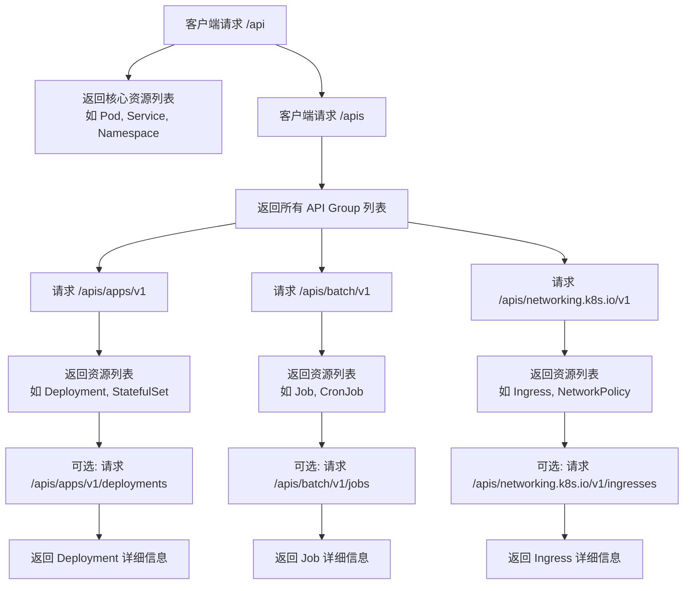

#  API 资源发现 (Discovery)

在 Kubernetes 里做 **全量 API 资源发现 (Discovery)** 时，并不是“每个资源一次请求”，而是分层次完成的。  

## 📖 Discovery 的工作方式
1. **根路径请求**  
   - 客户端首先请求 `GET /apis` 和 `GET /api`，获取所有可用的 API Group 和版本列表。  

2. **Group/Version 请求**  
   - 对每个 API Group/Version，再请求一次，例如：  
     - `GET /apis/apps/v1`  
     - `GET /apis/batch/v1`  
   - 返回该 Group/Version 下的所有资源类型（如 Deployment、Job）。  

3. **资源级别请求**  
   - 如果需要进一步获取某个资源的详细信息（如字段、子资源），才会对该资源发起请求。  
   - 例如：`GET /apis/apps/v1/deployments`。  

## ⚡ 总结
- **不是每个资源单独一次请求**，而是：  
  - **一次请求获取 Group/Version 下的所有资源列表**。  
  - 如果需要具体资源详情，再发起额外请求。  
- 因此，全量 Discovery 的请求数量 ≈ **API Group/Version 数量**，而不是资源数量。  

## 📊 举例
- 集群有 20 个 API Group，每个 Group 有 2 个版本 → Discovery 需要大约 **40 次请求**。  
- 每个版本返回多个资源类型（如 Pod、Deployment、Service），但这些资源是在同一个响应里列出。  

## 🎯 建议
- 使用 **缓存**（如 `--cache-dir`）避免频繁全量 Discovery。  
- 在大规模集群中，避免频繁调用 Discovery API，否则容易触发 **API Throttling**。  
- 如果只关心某些资源，直接请求对应 Group/Version，而不是做全量扫描。  

# Kubernetes API Discovery 请求流程图

展示从根路径到具体资源的完整调用链。  

## 🌳 Kubernetes API Discovery 请求流程图

## 📖 流程说明
- **根路径请求**：  
  - `/api` → 返回核心资源（Pod、Service、Namespace）。  
  - `/apis` → 返回所有扩展 API Group。  

- **Group/Version 请求**：  
  - 每个 Group/Version 一次请求，返回该版本下所有资源类型。  

- **资源级别请求**：  
  - 如果需要具体资源详情，再请求对应资源路径。  
  - 例如：`/apis/apps/v1/deployments`。  

## 🎯 总结
- 全量 Discovery 的请求数量 ≈ **API Group/Version 数量**，而不是资源数量。  
- 每个 Group/Version 一次请求即可返回该版本下所有资源类型。  
- 如果需要具体资源详情，再单独请求资源路径。  
