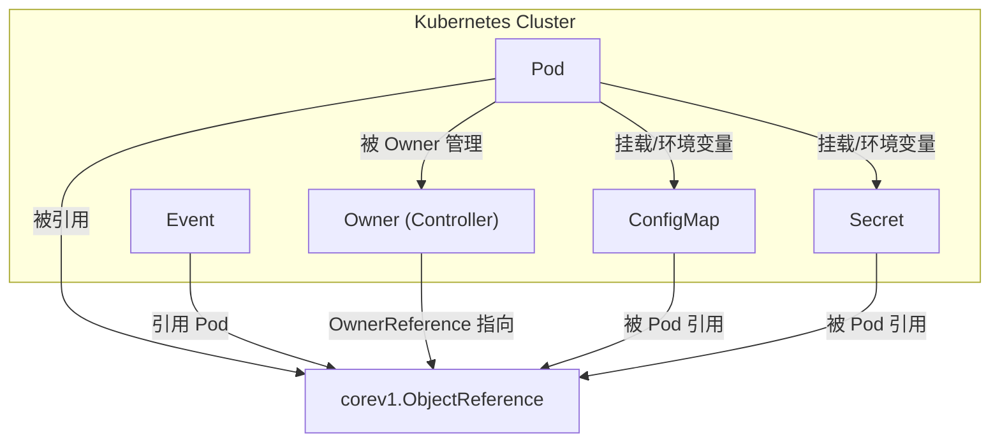

# ObjectReference
`corev1.ObjectReference` 是 Kubernetes Go 客户端（client-go）里定义的一个结构体，用来在 API 对象之间建立引用关系。它常见于 Pod、Event、OwnerReference 等场景，用来指向另一个 Kubernetes 资源。  
## 📑 定义（简化版）
在 `k8s.io/api/core/v1/types.go` 中，`ObjectReference` 的结构大致如下：
```go
type ObjectReference struct {
    Kind            string `json:"kind,omitempty"`
    Namespace       string `json:"namespace,omitempty"`
    Name            string `json:"name,omitempty"`
    UID             types.UID `json:"uid,omitempty"`
    APIVersion      string `json:"apiVersion,omitempty"`
    ResourceVersion string `json:"resourceVersion,omitempty"`
    FieldPath       string `json:"fieldPath,omitempty"`
}
```
## ⚙️ 字段说明
- **Kind**：对象的类型（如 Pod、Service、ConfigMap）。  
- **Namespace**：对象所在的命名空间。  
- **Name**：对象的名字。  
- **UID**：对象的唯一标识符。  
- **APIVersion**：对象所属的 API 版本（如 `v1`、`apps/v1`）。  
- **ResourceVersion**：对象的资源版本，用于乐观并发控制。  
- **FieldPath**：对象内部的具体字段路径（例如 Pod 中的某个容器）。  
## 📊 使用场景
- **Event**：事件对象中常用 `ObjectReference` 来指向被记录的资源。  
- **OwnerReference**：控制器通过引用来标记资源的所有者。  
- **跨资源引用**：例如 Pod 引用 Secret、ConfigMap 时，内部可能用到类似的结构。  
## ✅ 总结
`corev1.ObjectReference` 是 Kubernetes API 中的“指针结构”，用来在不同资源之间建立关联。它不包含对象的完整内容，而是通过 **Kind + Namespace + Name + UID** 等字段来唯一标识另一个资源。  

## 关系图
展示它们如何被 Pod 引用，同时保持 Pod、Event、OwnerReference 与 `ObjectReference` 的关联：  

📑 图解说明
- **Pod**：核心工作负载对象。  
- **Event**：通过 `ObjectReference` 指向 Pod，记录 Pod 的状态变化。  
- **OwnerReference**：控制器通过 `ObjectReference` 指向 Pod，标记 Pod 的所有者。  
- **ConfigMap / Secret**：Pod 在挂载配置或注入环境变量时，会通过 `ObjectReference` 引用这些资源。  
- **ObjectReference**：作为统一的“指针结构”，连接 Pod 与 Event、Owner、ConfigMap、Secret。  

这样你可以直观地看到：**Pod 是中心对象，周边的 Event、Owner、ConfigMap、Secret 都通过 `ObjectReference` 建立关联**。  
