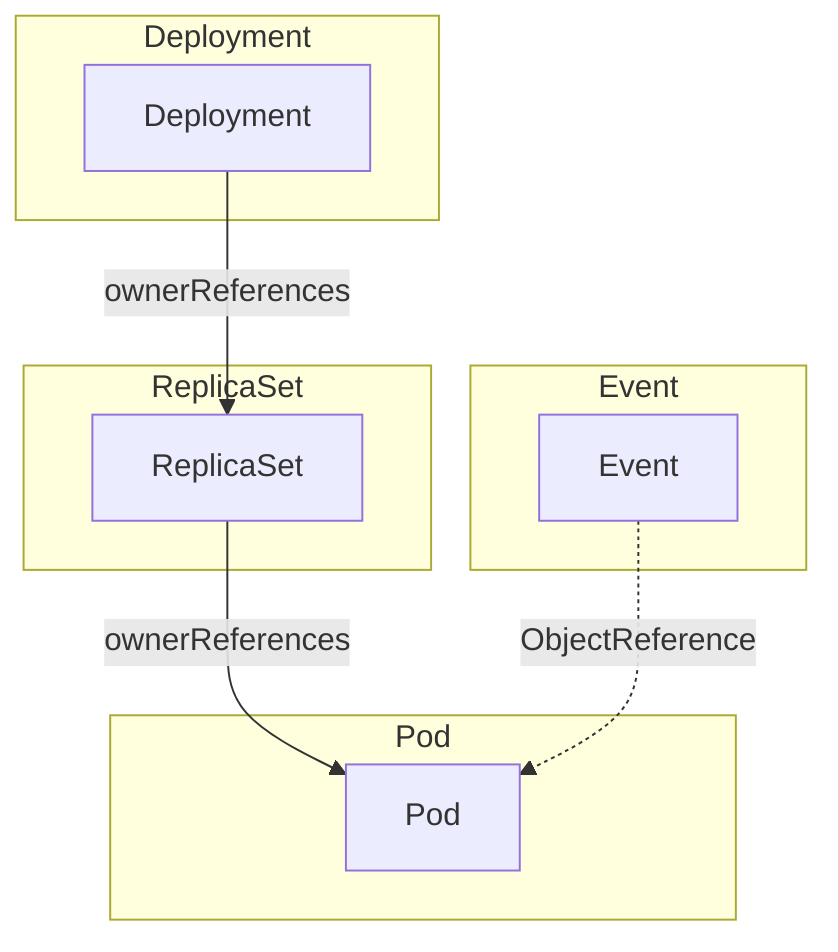
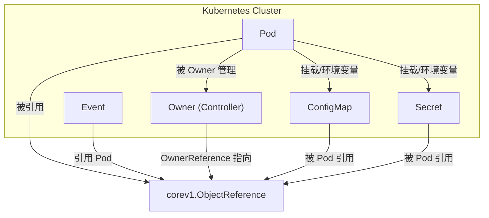

# ownerReferences 与ObjectReference
这是一个很好的问题，很多人会混淆 **`ownerReferences`** 和 **`ObjectReference`**，但它们在 Kubernetes 中的作用和语境完全不同。下面我帮你梳理一下：
## 🧾 `ownerReferences`
- **位置**：对象的 `metadata.ownerReferences` 字段
- **作用**：声明该对象的“拥有者”，用于垃圾回收（GC）和层级管理
- **典型场景**：
  - Pod 的 `ownerReferences` 指向它所属的 ReplicaSet
  - ReplicaSet 的 `ownerReferences` 指向它所属的 Deployment
- **关键字段**：
  - `apiVersion`、`kind`、`name`、`uid`
  - `controller`：是否是控制器对象
  - `blockOwnerDeletion`：是否阻止拥有者删除，直到子对象清理完毕

👉 **用途**：主要是 Kubernetes 控制器自动生成，用于资源生命周期管理。
## 🧾 `ObjectReference`
- **位置**：很多 API 字段中会用到，比如 Event、Pod 的 `serviceAccount` 引用等
- **作用**：指向另一个对象，作为引用关系，而不是所有权
- **典型场景**：
  - Event 中的 `involvedObject` 就是一个 `ObjectReference`
  - Pod 使用的 ServiceAccount 会通过 `ObjectReference` 指向对应的对象
- **关键字段**：
  - `apiVersion`、`kind`、`name`、`namespace`、`uid`
  - 用于唯一标识某个对象，但不涉及控制或垃圾回收

👉 **用途**：更多是“指针”或“引用”，告诉你这个对象和另一个对象有关联。
## 📊 对比总结
| 特性              | ownerReferences                        | ObjectReference                     |
|-------------------|----------------------------------------|-------------------------------------|
| **位置**          | metadata.ownerReferences               | 各种 API 字段（如 Event）            |
| **关系类型**      | 所有权关系（父子）                     | 引用关系（指针）                     |
| **用途**          | 垃圾回收、层级管理                     | 事件追踪、对象关联                   |
| **生成方式**      | 控制器自动生成                         | API 使用时显式引用                   |
| **是否影响删除**  | 是，父对象删除会触发子对象清理         | 否，仅仅是引用，不影响生命周期       |

换句话说：  
- **`ownerReferences`** 是“谁拥有我”的声明，用于生命周期管理。  
- **`ObjectReference`** 是“我指向谁”的引用，用于事件和关联关系。  
## 直观展示
- **Deployment → ReplicaSet → Pod** 的层级关系  
- Pod 的 `ownerReferences` 指向 ReplicaSet  
- ReplicaSet 的 `ownerReferences` 指向 Deployment  
- Event 使用 `ObjectReference` 指向 Pod  

```mermaid
graph TD

    subgraph Deployment
        D[Deployment]
    end

    subgraph ReplicaSet
        RS[ReplicaSet]
    end

    subgraph Pod
        P[Pod]
    end

    subgraph Event
        E[Event]
    end

    %% 层级关系：ownerReferences
    D -->|ownerReferences| RS
    RS -->|ownerReferences| P

    %% Event 引用 Pod：ObjectReference
    E -.->|ObjectReference| P
```
### 🔍 图解说明
- **Deployment → ReplicaSet → Pod**：这是典型的控制器层级，`ownerReferences` 用来声明父子关系，保证当父对象删除时，子对象也会被垃圾回收。
- **Event → Pod**：Event 并不“拥有” Pod，而是通过 `ObjectReference` 指向 Pod，表示这个事件与该 Pod 相关联。

这样你就能清晰看到：  
- `ownerReferences` 用于 **生命周期管理**（父子关系）  
- `ObjectReference` 用于 **事件追踪和关联**（指针关系）  

# ObjectReference
`corev1.ObjectReference` 是 Kubernetes Go 客户端（client-go）里定义的一个结构体，用来在 API 对象之间建立引用关系。它常见于 Pod、Event、OwnerReference 等场景，用来指向另一个 Kubernetes 资源。  
## 📑 定义（简化版）
在 `k8s.io/api/core/v1/types.go` 中，`ObjectReference` 的结构大致如下：
```go
type ObjectReference struct {
    Kind            string `json:"kind,omitempty"`
    Namespace       string `json:"namespace,omitempty"`
    Name            string `json:"name,omitempty"`
    UID             types.UID `json:"uid,omitempty"`
    APIVersion      string `json:"apiVersion,omitempty"`
    ResourceVersion string `json:"resourceVersion,omitempty"`
    FieldPath       string `json:"fieldPath,omitempty"`
}
```
## ⚙️ 字段说明
- **Kind**：对象的类型（如 Pod、Service、ConfigMap）。  
- **Namespace**：对象所在的命名空间。  
- **Name**：对象的名字。  
- **UID**：对象的唯一标识符。  
- **APIVersion**：对象所属的 API 版本（如 `v1`、`apps/v1`）。  
- **ResourceVersion**：对象的资源版本，用于乐观并发控制。  
- **FieldPath**：对象内部的具体字段路径（例如 Pod 中的某个容器）。  
## 📊 使用场景
- **Event**：事件对象中常用 `ObjectReference` 来指向被记录的资源。  
- **OwnerReference**：控制器通过引用来标记资源的所有者。  
- **跨资源引用**：例如 Pod 引用 Secret、ConfigMap 时，内部可能用到类似的结构。  
## ✅ 总结
`corev1.ObjectReference` 是 Kubernetes API 中的“指针结构”，用来在不同资源之间建立关联。它不包含对象的完整内容，而是通过 **Kind + Namespace + Name + UID** 等字段来唯一标识另一个资源。  

## 关系图
展示它们如何被 Pod 引用，同时保持 Pod、Event、OwnerReference 与 `ObjectReference` 的关联：  

```mermaid
graph TD

    subgraph Kubernetes Cluster
        Pod["Pod"]
        Event["Event"]
        Owner["Owner (Controller)"]
        ConfigMap["ConfigMap"]
        Secret["Secret"]
    end

    ObjectRef["corev1.ObjectReference"]

    %% Pod 与 Event 的关系
    Pod -->|被引用| ObjectRef
    Event -->|引用 Pod| ObjectRef

    %% Pod 与 Owner 的关系
    Owner -->|OwnerReference 指向| ObjectRef
    Pod -->|被 Owner 管理| Owner

    %% Pod 与 ConfigMap 的关系
    ConfigMap -->|被 Pod 引用| ObjectRef
    Pod -->|挂载/环境变量| ConfigMap

    %% Pod 与 Secret 的关系
    Secret -->|被 Pod 引用| ObjectRef
    Pod -->|挂载/环境变量| Secret
```
📑 图解说明
- **Pod**：核心工作负载对象。  
- **Event**：通过 `ObjectReference` 指向 Pod，记录 Pod 的状态变化。  
- **OwnerReference**：控制器通过 `ObjectReference` 指向 Pod，标记 Pod 的所有者。  
- **ConfigMap / Secret**：Pod 在挂载配置或注入环境变量时，会通过 `ObjectReference` 引用这些资源。  
- **ObjectReference**：作为统一的“指针结构”，连接 Pod 与 Event、Owner、ConfigMap、Secret。  

这样你可以直观地看到：**Pod 是中心对象，周边的 Event、Owner、ConfigMap、Secret 都通过 `ObjectReference` 建立关联**。  

# ownerReferences
在 Kubernetes 里，`ownerReferences` 是对象元数据（metadata）的一部分，用来声明**该资源由另一个资源所拥有**。它的作用是建立资源之间的依赖关系，方便垃圾回收（GC）和层级管理。
## 🔧 关键点解析
- **定义位置**：在对象的 `metadata.ownerReferences` 字段中。
- **内容结构**：
  ```yaml
  ownerReferences:
  - apiVersion: apps/v1
    kind: ReplicaSet
    name: my-replicaset
    uid: 12345678-1234-1234-1234-1234567890ab
    controller: true
    blockOwnerDeletion: true
  ```
- **字段说明**：
  - `apiVersion`：拥有者对象的 API 版本
  - `kind`：拥有者对象的类型（如 Deployment、ReplicaSet）
  - `name`：拥有者对象的名字
  - `uid`：拥有者对象的唯一标识符
  - `controller`：是否是控制器对象（如 Deployment 控制 ReplicaSet）
  - `blockOwnerDeletion`：是否阻止拥有者删除，直到子对象被清理
## 🧠 使用场景
- **Pod 与 ReplicaSet**：Pod 的 `ownerReferences` 指向它所属的 ReplicaSet。删除 ReplicaSet 时，Pod 会被自动清理。
- **ReplicaSet 与 Deployment**：ReplicaSet 的 `ownerReferences` 指向它所属的 Deployment。
- **自动垃圾回收**：当拥有者对象被删除时，Kubernetes 会自动删除所有带有该 `ownerReferences` 的子对象。
## 🚨 注意事项
- 如果 `ownerReferences` 设置错误，可能导致资源无法自动清理，或者被错误删除。
- 手动创建资源时，通常不需要自己写 `ownerReferences`，控制器会自动生成。
- 在 CRD（自定义资源）场景下，合理设置 `ownerReferences` 可以让子资源随父资源一起清理。
