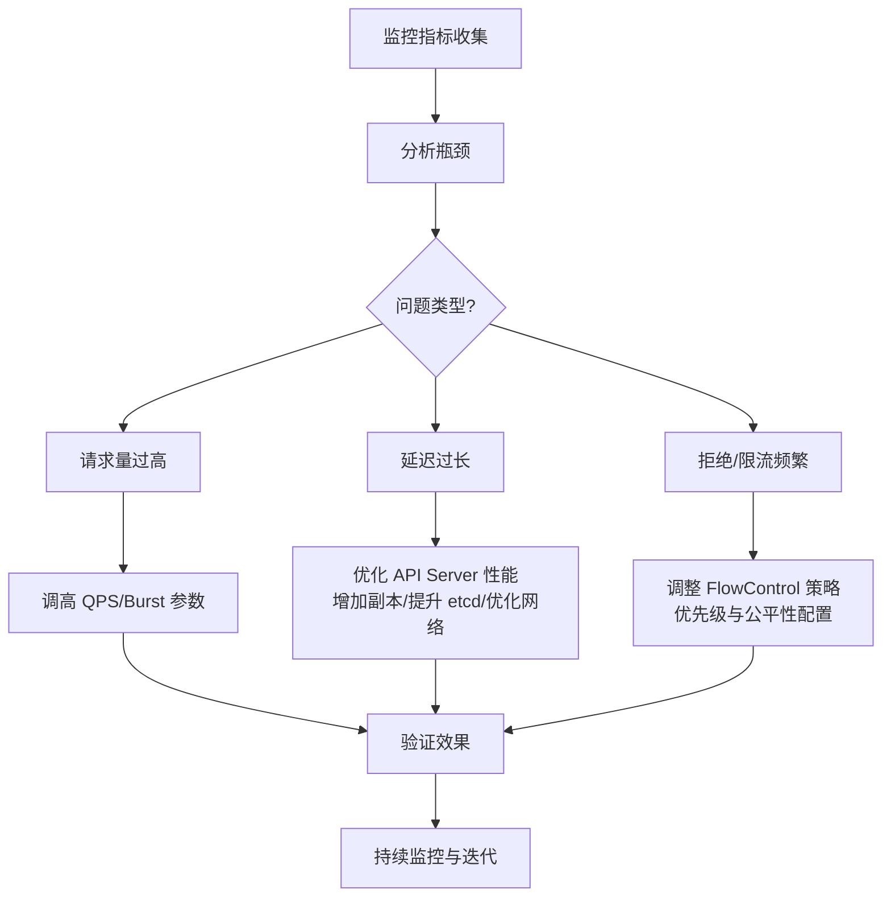

# API Throttling 

是一种流量控制机制，用来限制客户端在一定时间窗口内的 API 请求数量，以防止过载、滥用并保证服务稳定性。超过阈值时，API 会延迟或拒绝请求，常见返回码为 HTTP 429 “Too Many Requests”。** 

## 📖 API Throttling 定义
- **核心概念**：在固定时间段内（如每秒、每分钟），限制客户端可发出的请求数。  
- **目的**：保持 API 响应速度，防止单个用户消耗过多资源，确保所有用户公平使用。  
- **实现方式**：当请求超过阈值时，API 会：
  - 延迟处理（排队等待）  
  - 或直接拒绝（返回错误码）  

## ⚡ 常见特征
- **请求限制**：例如“100 requests/second”或“5000 requests/minute”。  
- **反馈机制**：  
  - **HTTP 429 Too Many Requests**  
  - **Retry-After Header**：提示客户端等待多久再重试。  
- **追踪方式**：通过 API Key、OAuth Token、IP 地址或用户账号来识别调用者。  

## 📊 常见算法
- **Token Bucket**：令牌按速率生成，请求消耗令牌，适合处理突发流量。  
- **Leaky Bucket**：固定速率处理请求，多余请求排队或丢弃。  
- **Fixed Window**：在固定时间窗口内计数，窗口结束后重置。  
- **Sliding Window**：连续统计，更精确控制突发流量。  

## 🎯 Throttling vs Rate Limiting
| 特性 | **Throttling** | **Rate Limiting** |
|------|----------------|-------------------|
| **处理方式** | 动态调节，延迟或部分拒绝请求 | 硬性限制，超过阈值直接拒绝 |
| **用户体验** | 更平滑，像“交通灯”控制流量 | 更严格，像“硬闸门”直接阻止 |
| **适用场景** | 高并发、流量波动大的 API | 固定配额、严格控制的 API |

## ⚠️ 风险与应用
- **风险**：如果阈值过低，可能导致正常用户体验下降；过高则可能导致后端过载。  
- **应用场景**：  
  - 云服务商（AWS、Azure、GCP）保护资源  
  - SaaS 平台防止 DoS 攻击  
  - 公共 API 保证公平性  

# client-side throttling

你看到的日志信息：  

```
Waited for Xs due to client-side throttling,
request: GET:https://192.168.200.95:6443/apis/...
```

这是 **Kubernetes 客户端（如 controller-manager、scheduler 或其他控制器）在访问 API Server 时触发了 client-side throttling** 的表现。  

## 📖 什么是 client-side throttling
- **API Throttling**：客户端在调用 API 时，为了避免过度请求导致 API Server 过载，会在本地做速率限制。  
- **Kubernetes 中的实现**：  
  - 使用 **QPS（Queries Per Second）** 和 **Burst** 参数控制请求速率。  
  - 当请求超过设定的 QPS，客户端会延迟请求（即日志中的 “Waited for … due to client-side throttling”）。  

## ⚡ 为什么会出现这种日志
- **QPS/Burst 配置过低**：默认 QPS=5，Burst=10，容易在控制器频繁访问 API 时触发。  
- **控制器压力大**：当集群资源对象很多（Node、Pod、CRD），controller-manager/scheduler 会频繁调用 API。  
- **API Server 响应慢**：即使客户端速率正常，API Server 性能不足也会导致请求排队。  

## 🔧 解决思路
- **调整客户端参数**：  
  - 在 controller-manager、scheduler 或自定义控制器启动参数中设置：  
    ```
    --kube-api-qps=20
    --kube-api-burst=40
    ```
    （根据集群规模适当调高）  
- **优化 API Server 性能**：  
  - 增加副本数，提升 etcd 性能，优化网络。  
- **减少不必要的请求**：  
  - 控制器逻辑优化，避免频繁 List/Watch。  

## 🎯 总结
日志中的 “Waited for … due to client-side throttling” 表示 **客户端主动限流**，不是错误，而是保护机制。它说明当前 API 调用频率超过了客户端设定的阈值，导致请求被延迟。解决方法主要是 **调高 QPS/Burst 参数** 或 **优化 API Server 性能**。  

要不要我帮你整理一个 **“Kubernetes API 调用限流参数速查表”**，把常见组件（controller-manager、scheduler、kubelet）的默认 QPS/Burst 值和推荐调整范围列出来？  

- API Throttling定义  
- Kubernetes_QPS_Burst配置  
- Kubernetes控制器压力大  
- Kubernetes_API_Server性能问题

# 整理一份 **“Kubernetes API 调用限流参数速查表”**

涵盖常见组件的默认值和推荐调整范围，方便快速查阅。  

## 📊 Kubernetes API 调用限流参数速查表

| 组件 | 参数 | 默认值 | 推荐调整范围 | 说明 |
|------|------|--------|--------------|------|
| **kube-controller-manager** | `--kube-api-qps` | 20 | 20–100 | 控制每秒最大请求数 |
| | `--kube-api-burst` | 30 | 40–200 | 短时间突发请求上限 |
| **kube-scheduler** | `--kube-api-qps` | 50 | 50–200 | 调度器频繁调用 API，需更高 QPS |
| | `--kube-api-burst` | 100 | 100–400 | 调度高峰时突发请求上限 |
| **kubelet** | `--kube-api-qps` | 5 | 10–50 | 节点代理，默认值较低，集群大时需调高 |
| | `--kube-api-burst` | 10 | 20–100 | 节点状态上报突发请求上限 |
| **kubectl** | `--request-qps` | 5 | 10–50 | 命令行工具调用 API 的速率限制 |
| | `--request-burst` | 10 | 20–100 | 短时间突发请求上限 |
| **自定义控制器** | `rest.Config.QPS` | 5 | 20–100 | client-go 默认值较低，需根据控制器逻辑调整 |
| | `rest.Config.Burst` | 10 | 40–200 | 建议与 QPS 成比例提高 |

## ⚡ 使用建议
- **小型集群**：默认值通常够用。  
- **中大型集群**：建议调高 QPS/Burst，避免频繁出现 *client-side throttling*。  
- **高可用控制平面**：多个副本分摊请求压力，参数可适度调高。  
- **监控与优化**：结合 API Server metrics (`apiserver_request_total`) 观察实际负载，动态调整。  

## 🎯 总结
- **kubelet 默认值最低**，在大规模集群中最容易触发限流。  
- **controller-manager/scheduler** 默认值较高，但在资源对象很多时仍可能需要调优。  
- **自定义控制器** 使用 client-go 时要注意默认值过低，需手动设置。  

# 整理一份 **“API Server 限流监控指标速查表”**

涵盖常见的 Prometheus 指标，用于观察 API Server 的请求速率、延迟和拒绝情况，帮助你在调优 QPS/Burst 时快速定位瓶颈。  

## 📊 API Server 限流监控指标速查表

| 指标名称 | 说明 | 常见用途 |
|----------|------|----------|
| **apiserver_request_total** | API Server 接收到的请求总数，按 verb（GET/POST/PUT）、资源类型、客户端分类统计 | 观察整体请求量，识别高频资源访问 |
| **apiserver_request_duration_seconds** | API 请求处理耗时直方图 | 分析 API 延迟，定位慢请求 |
| **apiserver_request_throttled_total** | 被限流的请求总数（client-side throttling） | 判断是否频繁触发限流 |
| **apiserver_request_rejected_total** | 被拒绝的请求总数（如超出限流或资源不可用） | 监控 API Server 拒绝率 |
| **apiserver_flowcontrol_dispatched_requests_total** | API Server 流控模块成功调度的请求数 | 验证 FlowControl 配置是否合理 |
| **apiserver_flowcontrol_rejected_requests_total** | API Server 流控模块拒绝的请求数 | 判断是否因优先级/公平性策略导致拒绝 |
| **apiserver_flowcontrol_current_inqueue_requests** | 当前排队等待的请求数 | 识别是否存在请求堆积 |
| **apiserver_flowcontrol_current_executing_requests** | 当前正在执行的请求数 | 观察 API Server 并发处理能力 |

## ⚡ 使用建议
- **高频监控**：重点关注 `apiserver_request_total` 与 `apiserver_request_duration_seconds`，判断整体负载与延迟。  
- **限流监控**：结合 `apiserver_request_throttled_total` 与 `apiserver_request_rejected_total`，确认是否需要调高 QPS/Burst。  
- **流控监控**：使用 `apiserver_flowcontrol_*` 系列指标，分析 API Server 内置 FlowControl 策略是否合理。  
- **告警配置**：建议设置延迟 >1s 或拒绝率 >5% 的告警阈值。  

## 🎯 总结
这份速查表能帮助你快速定位 API Server 的 **请求量、延迟、限流与拒绝情况**。在调优时，结合 **QPS/Burst 参数** 与 **FlowControl 策略**，可以有效提升集群稳定性和响应速度。  

# 整理一个 **“API Server 调优流程图”**

用流程化的方式展示从监控到调优的完整闭环。  

## 🌳 API Server 调优流程图（Mermaid）



## 📖 步骤说明
- **监控指标收集**：通过 Prometheus 采集 `apiserver_request_total`、`apiserver_request_duration_seconds`、`apiserver_request_throttled_total` 等指标。  
- **分析瓶颈**：判断是请求量过高、延迟过长，还是限流/拒绝频繁。  
- **调优措施**：  
  - 请求量过高 → 调整客户端 `QPS/Burst`。  
  - 延迟过长 → 优化 API Server 性能（副本数、etcd、网络）。  
  - 限流频繁 → 调整 FlowControl 策略。  
- **验证效果**：观察指标是否改善。  
- **持续监控与迭代**：形成闭环，定期复盘。  

## 🎯 总结
这个流程图展示了一个 **完整的 API Server 调优闭环**：  
监控 → 分析 → 调整参数/性能/策略 → 验证 → 持续迭代。  
它能帮助你快速定位问题并采取针对性措施，而不是盲目调高参数。  

