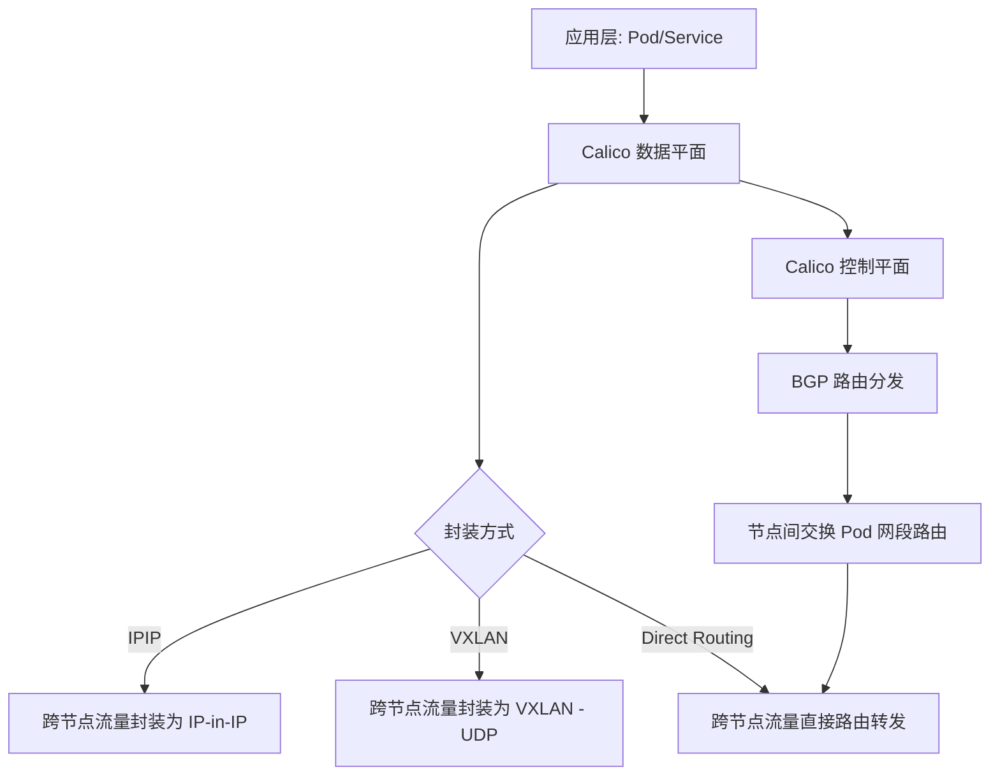

# 网络插件刷新导致 kubelet 心跳中断的详细原理

Calico 初始化时确实会导致 **宿主机网络栈刷新**，而这会间接影响到 kubelet 与 API Server 的心跳。下面是详细原理拆解：  

## 📖 原理机制
- **CNI 配置刷新**  
  - Calico 在 `/etc/cni/net.d/` 写入新的配置文件，替换原有的 Pod 网络插件配置。  
  - kubelet 在创建 Pod 时会调用 CNI 插件，如果配置文件更新，kubelet 会重新加载。  

- **iptables 规则重建**  
  - Felix 组件会安装大量 iptables 规则，用于 NAT、流量转发和 NetworkPolicy。  
  - 在规则重建过程中，宿主机的转发链可能短暂不可用，导致 kubelet 与 API Server 的 TCP 连接中断。  

- **路由表更新**  
  - Calico 为 Pod CIDR 添加路由条目，若启用 BGP，还会建立邻居关系。  
  - 路由表刷新时，宿主机的网络路径可能暂时不可达。  

- **网络设备创建**  
  - 创建 veth pair、隧道设备（IP-in-IP/VXLAN），这些操作会修改宿主机的网络接口。  
  - 在设备切换过程中，宿主机网络栈可能出现短暂抖动。  

## ⚡ kubelet 心跳中断的过程
1. kubelet 与 API Server 通过宿主机网络保持心跳。  
2. Calico 初始化时修改 iptables/路由/设备，导致宿主机网络栈短暂不可用。  
3. kubelet 心跳失败，API Server 将节点标记为 `NotReady`。  
4. 网络稳定后，心跳恢复，节点重新变为 `Ready`。  

## 🎯 总结
- Calico 初始化会修改宿主机网络（iptables、路由、设备、CNI 配置）。  
- 这些修改过程可能导致 **宿主机网络短暂中断**。  
- kubelet 与 API Server 的心跳依赖宿主机网络，因此会出现 **心跳中断 → 节点 NotReady → 恢复** 的现象。  

# VXLAN/IPIP与BGP

不是同级别的。**VXLAN/IPIP** 和 **BGP** 在 Calico 网络架构里扮演的角色不同：  

## 📖 层级关系
- **VXLAN/IPIP**  
  - 属于 **隧道封装方式**，决定跨节点 Pod 流量如何传输。  
  - IPIP → 用 IP-in-IP 封装。  
  - VXLAN → 用 UDP 封装。  
  - 它们解决的是 **跨节点通信的传输方式**。  

- **BGP**  
  - 属于 **路由分发机制**，负责节点之间如何交换路由信息。  
  - 节点通过 BGP 广播自己负责的 Pod 网段，其他节点才能知道如何转发流量。  
  - 它解决的是 **路由发现与分发问题**。  

## ⚡ 关系说明
- **VXLAN/IPIP** → 决定是否需要隧道。  
- **BGP** → 决定路由如何传播。  
- 如果 **VXLAN/IPIP 启用** → 跨节点流量走隧道，BGP 仍然可以启用，但路由分发的作用相对弱化。  
- 如果 **VXLAN/IPIP 禁用** → 必须依赖 BGP Direct Routing，否则跨节点 Pod 无法互通。  

## 🎯 总结
- **VXLAN/IPIP** 是 **数据平面传输方式**。  
- **BGP** 是 **控制平面路由分发机制**。  
- 它们不是同级别，而是 **互补关系**：  
  - VXLAN/IPIP 解决“怎么传”。  
  - BGP 解决“往哪传”。  

## 📖 Calico 网络架构分层

直观展示 **控制平面（BGP）** 与 **数据平面（VXLAN/IPIP/Direct Routing）** 的关系。

⚡ 分层说明
- **数据平面**（VXLAN/IPIP/Direct Routing）  
  - 决定跨节点 Pod 流量的传输方式。  
  - IPIP/VXLAN → 使用隧道封装。  
  - Direct Routing → 不封装，依赖底层网络直接路由。  

# Calico 控制器启用建议表

## 📖 Calico 控制器启用建议表

| 控制器 | 作用 | 建议启用场景 | 可禁用场景 |
|--------|------|--------------|------------|
| **node 控制器** | 管理节点资源、路由同步，保证 Pod 网络互通 | **必须启用**，所有场景 | 无 |
| **policy 控制器** | 同步 Kubernetes NetworkPolicy 到 Calico 策略模型 | 需要基于 NetworkPolicy 的安全隔离 | 不使用网络策略，仅做基本互通 |
| **namespace 控制器** | 同步 Namespace 标签到 Calico，用于策略匹配 | 策略依赖 Namespace 标签时 | 不使用基于 Namespace 的策略 |
| **serviceaccount 控制器** | 同步 ServiceAccount 身份到 Calico，用于策略匹配 | 策略依赖 ServiceAccount 身份时 | 不使用基于 ServiceAccount 的策略 |
| **endpoint 控制器** | 同步 Pod Endpoint 信息到 Calico WorkloadEndpoint | 需要精确的 Pod Endpoint 策略绑定 | 仅依赖节点路由，不做细粒度策略 |

## ⚡ 总结
- **必须启用**：`node 控制器`（核心路由和节点管理）。  
- **策略相关控制器**（policy、namespace、serviceaccount、endpoint） → 只有在需要 **细粒度安全策略** 时才启用。  
- 如果你的集群只关注 **网络互通** 而不使用复杂策略，可以禁用这些辅助控制器，降低资源消耗。  

- **控制平面**（BGP）  
  - 负责节点间路由信息的分发。  
  - 即使使用隧道，BGP 仍可启用；如果禁用隧道，则必须依赖 BGP。  
