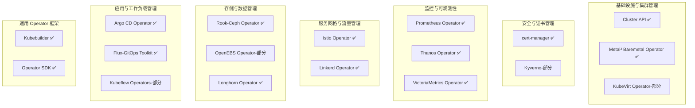

# controller-runtime
**在 Kubernetes 核心组件中，`controller-runtime` 并不是直接被 kube-apiserver、kube-scheduler 或 kube-controller-manager 使用的，而是主要被社区和扩展生态中的控制器框架（如 Kubebuilder、Operator SDK、Cluster API 等）广泛采用，用来简化自定义控制器的开发。**  
## 📑 使用场景概览
- **Kubernetes 核心控制器（kube-controller-manager）**  
  - 使用的是 `client-go` 原生库，而不是 `controller-runtime`。  
  - 原因：核心控制器需要极高性能和稳定性，直接依赖底层库。  
- **扩展生态控制器**  
  - **Kubebuilder**：基于 `controller-runtime`，是开发 CRD 控制器的主流框架。  
  - **Operator SDK**：同样基于 `controller-runtime`，用于构建复杂的 Operator。  
  - **Cluster API (CAPI)**：所有 MachineDeployment、MachineSet、Cluster 控制器都使用 `controller-runtime`。  
  - **cert-manager**、**Prometheus Operator**、**Istio Operator** 等：均使用 `controller-runtime` 来实现控制器逻辑。  
## 📊 对比表：client-go vs controller-runtime
| 特性 | client-go (核心组件用) | controller-runtime (扩展生态用) |
|------|------------------------|--------------------------------|
| **缓存机制** | 手动设置 Informer | 内置缓存，自动同步 |
| **事件处理** | 需手写队列和 worker | 提供 Reconcile 框架 |
| **Leader 选举** | 需手动实现 | 内置支持 |
| **适用场景** | 核心控制器、性能敏感 | 自定义 CRD、Operator、扩展控制器 |
| **典型用户** | kube-controller-manager | Kubebuilder、Operator SDK、Cluster API |
## ⚠️ 为什么核心组件不用 controller-runtime
- **性能考虑**：核心控制器需要极致优化，避免额外抽象层。  
- **历史原因**：核心控制器在 `controller-runtime` 出现之前就已经基于 `client-go` 实现。  
- **稳定性**：核心组件保持最小依赖，避免引入额外库。  
## ✅ 总结
- **直接使用 controller-runtime 的组件**：Kubebuilder、Operator SDK、Cluster API、cert-manager、Prometheus Operator 等。  
- **Kubernetes 核心控制器**（如 kube-controller-manager）仍然使用 `client-go`，没有直接依赖 `controller-runtime`。  
- **定位**：`controller-runtime` 是社区扩展和 Operator 的标准库，而不是 Kubernetes 核心组件的依赖。  

# 生态地图
把主流 Operator 和控制器项目分门别类，并标注哪些是基于 `controller-runtime` 的。这样你能快速看清哪些项目直接依赖它。  
## 📊 Kubernetes Operator & 控制器生态地图
### 1. **基础设施与集群管理**
- **Cluster API (CAPI)** → ✅ 基于 `controller-runtime`  
  - MachineDeployment、MachineSet、Cluster 控制器  
- **KubeVirt Operator** → 部分使用 `controller-runtime`  
- **Metal³ (Baremetal Operator)** → ✅ 基于 `controller-runtime`  
### 2. **安全与证书管理**
- **cert-manager** → ✅ 基于 `controller-runtime`  
  - 管理 TLS 证书、自动续期  
- **Kyverno** → 使用 `controller-runtime` 辅助部分控制器  
### 3. **监控与可观测性**
- **Prometheus Operator** → ✅ 基于 `controller-runtime`  
  - 管理 Prometheus、Alertmanager、Grafana CRDs  
- **Thanos Operator** → ✅ 基于 `controller-runtime`  
- **VictoriaMetrics Operator** → ✅ 基于 `controller-runtime`  
### 4. **服务网格与流量管理**
- **Istio Operator** → ✅ 基于 `controller-runtime`  
- **Linkerd Operator** → ✅ 基于 `controller-runtime`  
### 5. **存储与数据管理**
- **Rook (Ceph Operator)** → ✅ 基于 `controller-runtime`  
- **OpenEBS Operator** → 部分使用 `controller-runtime`  
- **Longhorn Operator** → ✅ 基于 `controller-runtime`  
### 6. **应用与工作负载管理**
- **Argo CD Operator** → ✅ 基于 `controller-runtime`  
- **Flux (GitOps Toolkit)** → ✅ 基于 `controller-runtime`  
- **KubeFlow Operators** → 部分使用 `controller-runtime`  
### 7. **通用 Operator 框架**
- **Kubebuilder** → ✅ 基于 `controller-runtime`（官方推荐框架）  
- **Operator SDK** → ✅ 基于 `controller-runtime`（Red Hat 主导）  
## ✅ 总结
- **核心 Kubernetes 控制器**（如 kube-controller-manager）使用 `client-go`，不依赖 `controller-runtime`。  
- **生态扩展与 Operator**（Cluster API、cert-manager、Prometheus Operator、Istio Operator、Rook、Flux 等）几乎都基于 `controller-runtime`。  
- **定位**：`controller-runtime` 已经成为 **Operator 和扩展控制器的事实标准框架**。  

# 生态分层图
把主流 Operator 和控制器项目按领域分层展示，并用 ✅ 标记哪些是基于 `controller-runtime` 的：  

## ✅ 总结
- **核心 Kubernetes 控制器**（如 kube-controller-manager）使用 `client-go`，不依赖 `controller-runtime`。  
- **生态扩展与 Operator**（Cluster API、cert-manager、Prometheus Operator、Istio Operator、Rook、Flux 等）几乎都基于 `controller-runtime`。  
- **定位**：`controller-runtime` 已经成为 **Operator 和扩展控制器的事实标准框架**。  
