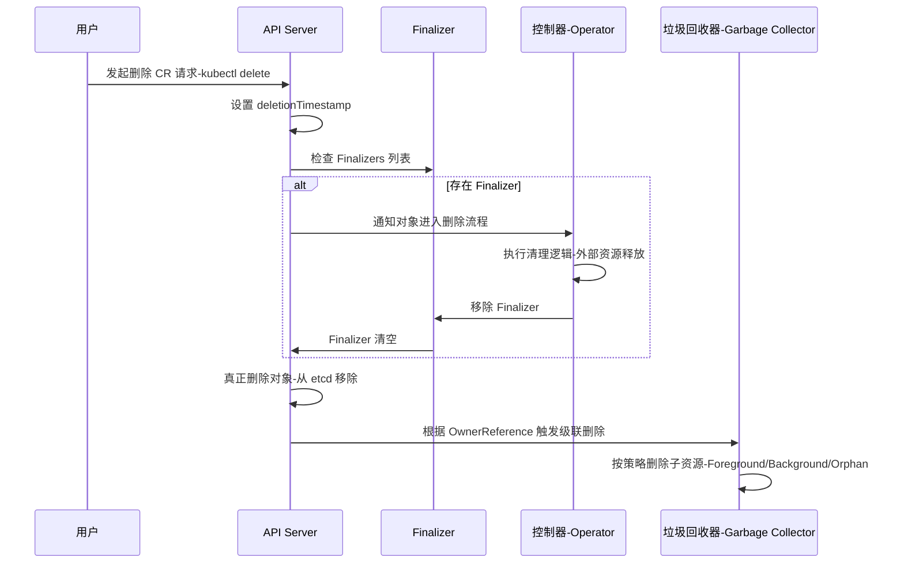

# k8s中CR资源删除的逻辑
在 Kubernetes 中，**CR（Custom Resource）资源的删除逻辑**是由 API Server、垃圾回收机制（GC）、以及 CRD 控制器共同完成的。整体流程如下：
## 📌 删除流程逻辑
1. **用户请求删除**
   - 用户执行 `kubectl delete <CR>`，API Server 接收到删除请求。
2. **Finalizers 检查**
   - 如果该 CR 对象的 `metadata.finalizers` 字段非空，API Server不会立即删除对象，而是将其标记为 **“deletionTimestamp”**。  
   - 控制器需要在看到这个标记后执行清理逻辑（例如释放外部资源），完成后移除 finalizer。
3. **控制器清理**
   - CRD 对应的控制器（Operator）检测到对象进入删除流程。  
   - 控制器执行自定义清理逻辑（如删除云资源、关闭服务）。  
   - 完成后移除 finalizer。
4. **对象真正删除**
   - 当 finalizer 被移除，API Server 才会真正删除该对象。  
   - 删除后，etcd 中的存储记录被清理。
5. **级联删除（Cascading Deletion）**
   - 如果 CR 对象被其他资源引用（OwnerReference），垃圾回收器会根据 `propagationPolicy` 决定是否级联删除子资源。  
     - **Foreground**：先删除子资源，再删除父对象。  
     - **Background**：父对象立即删除，子资源后台异步删除。  
     - **Orphan**：仅删除父对象，子资源保留。
## 📊 关键点总结
| 阶段 | 逻辑 |
|------|------|
| 用户请求 | `kubectl delete` 发起删除 |
| Finalizer | 阻塞删除，等待控制器清理外部资源 |
| 控制器清理 | Operator 执行自定义清理逻辑 |
| 真正删除 | Finalizer 移除后，API Server 删除对象 |
| 垃圾回收 | 根据 OwnerReference 和策略决定子资源是否删除 |

## 🔑 设计价值
- **安全性**：通过 finalizer 确保外部资源不会被遗留。  
- **一致性**：保证 CR 删除时，相关依赖资源也能正确清理。  
- **灵活性**：支持不同的级联策略，满足不同场景需求。  

👉 总结：Kubernetes 中 CR 的删除逻辑是 **用户请求 → Finalizer 阻塞 → 控制器清理 → Finalizer 移除 → API Server 真正删除 → 垃圾回收**。  

# 时序图
直观展示 Kubernetes 中 CR 删除过程里 **API Server、Finalizer、控制器、垃圾回收器**之间的交互逻辑：

### 🔑 图解说明
- **用户请求**：通过 `kubectl delete` 发起删除。  
- **API Server**：设置 `deletionTimestamp`，检查是否有 Finalizer。  
- **Finalizer**：阻塞删除，等待控制器完成清理。  
- **控制器**：执行自定义清理逻辑（如释放云资源），移除 Finalizer。  
- **垃圾回收器**：根据 OwnerReference 和策略决定是否级联删除子资源。  
### 📊 总结
- 删除流程是 **用户请求 → Finalizer 阻塞 → 控制器清理 → Finalizer 移除 → API Server 真正删除 → 垃圾回收器级联处理**。  
- **安装与升级的依赖顺序一致性**和 **CR 删除逻辑**一样，都是围绕依赖链和控制器驱动的声明式流程。  
