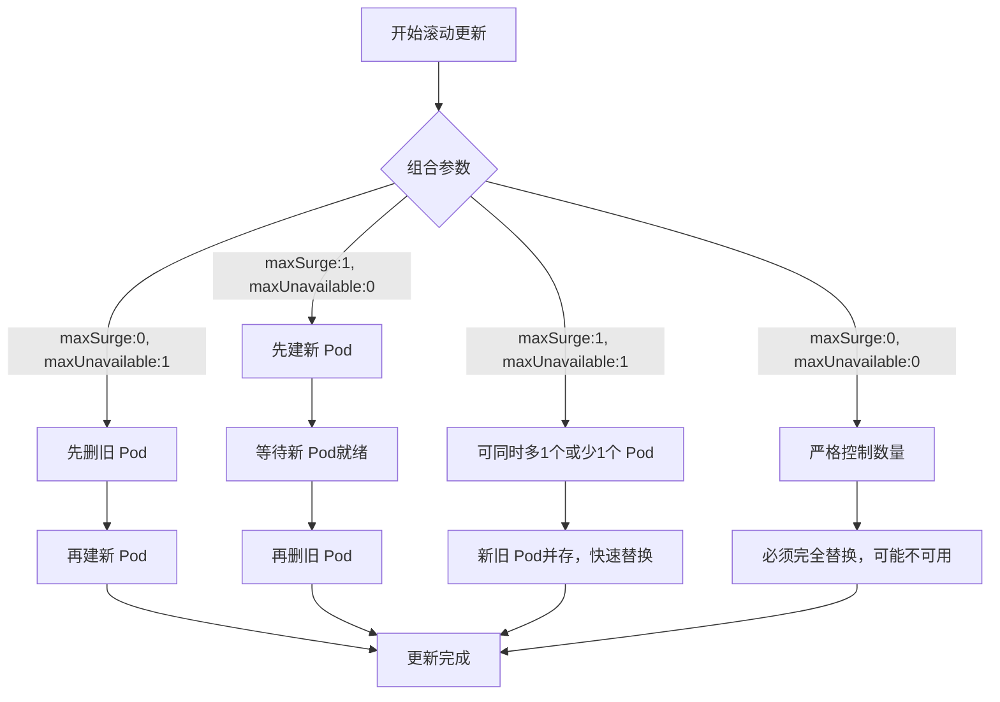

# 滚动更新策略

在 **Kubernetes Deployment 的滚动更新策略**里，`maxSurge` 和 `maxUnavailable` 是两个核心参数，它们决定了更新过程中 Pod 的数量变化和服务可用性。下面我给你详细解释，并附上样例。  

## 📖 参数作用
- **maxSurge**  
  - 定义更新时允许 **额外创建的 Pod 数量**（超过期望副本数）。  
  - 作用：保证新 Pod 可以先启动，旧 Pod 再删除，从而提高可用性。  

- **maxUnavailable**  
  - 定义更新时允许 **不可用的 Pod 数量**（低于期望副本数）。  
  - 作用：控制更新过程中服务的最低可用副本数。  

## 📊 样例对比

假设 Deployment 副本数为 **3**：

| 配置 | 更新过程 | Pod 数量变化 | 效果 |
|------|----------|--------------|------|
| **maxSurge: 0, maxUnavailable: 1** | 先删旧 Pod，再建新 Pod | 最少 2 个 Pod，最多 3 个 Pod | 节省资源，但可能短暂不可用 |
| **maxSurge: 1, maxUnavailable: 0** | 先建新 Pod，再删旧 Pod | 最少 3 个 Pod，最多 4 个 Pod | 保证服务连续性，零停机 |
| **maxSurge: 1, maxUnavailable: 1** | 可同时多 1 个 Pod，也可少 1 个 Pod | 最少 2 个 Pod，最多 4 个 Pod | 更新速度快，资源与可用性折中 |
| **maxSurge: 0, maxUnavailable: 0** | 严格控制 Pod 数量 | 始终 3 个 Pod | 更新过程可能完全不可用 |

## 流程图

🎯 总结
- **maxSurge:0, maxUnavailable:1** → 先删后建，节省资源但可能短暂不可用。  
- **maxSurge:1, maxUnavailable:0** → 先建后删，保证服务连续性。  
- **maxSurge:1, maxUnavailable:1** → 灵活，更新速度快，折中方案。  
- **maxSurge:0, maxUnavailable:0** → 严格控制，更新过程可能完全不可用。  

## 🎯 总结
- **maxSurge** → 控制是否能“多出来”Pod（保证可用性）。  
- **maxUnavailable** → 控制是否能“少掉”Pod（节省资源）。  
- 两者组合决定了更新过程是 **先建后删**（高可用）还是 **先删后建**（节省资源）。  

