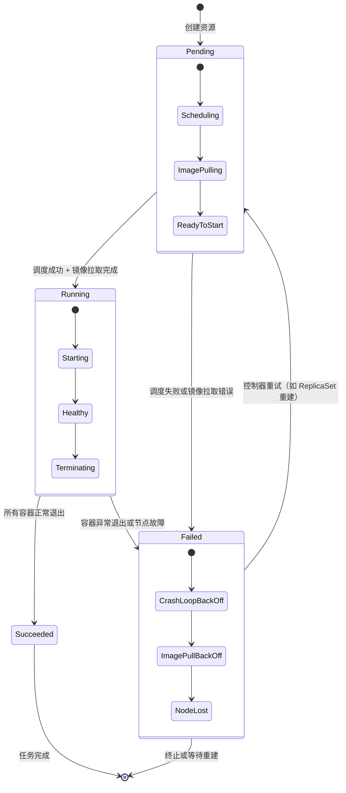

# Kubernetes 资源生命周期的状态

在 **Kubernetes** 中，资源（如 Pod、Deployment、Service 等）的生命周期状态设计遵循“**声明式控制 + 状态驱动**”原则。状态反映了资源从创建到销毁的整个过程，是控制器实现自愈与调度的核心依据。  

## 📖 资源生命周期的主要状态
以 **Pod** 为例，Kubernetes 的资源状态通常包括以下阶段：  

| 阶段 | 状态名称 | 含义 |
|------|-----------|------|
| **Pending** | 已提交但尚未调度或镜像未拉取完成 | Pod 资源已创建但未运行 |
| **Running** | 已调度到节点并启动容器 | 容器正在运行或重启中 |
| **Succeeded** | 所有容器正常退出（退出码 0） | 一次性任务完成 |
| **Failed** | 容器异常退出（退出码非 0） | 任务失败或节点异常 |
| **Unknown** | 控制器无法获取状态 | 节点通信异常或 API 不可达 |

其他资源（如 Deployment、Job、DaemonSet）也有类似的生命周期状态，只是控制器逻辑不同。  

## 🧩 状态设计原则
1. **声明式原则**  
   - 用户只需声明“期望状态”（Desired State），控制器负责将系统驱动到该状态。  
   - 状态机的设计必须支持“目标状态与实际状态的对比”。  

2. **可观测性原则**  
   - 每个状态都应可被监控与查询（通过 API 或事件）。  
   - 状态变化必须触发事件，便于外部系统响应。  

3. **幂等性原则**  
   - 状态转移操作必须可重复执行，不因重试导致副作用。  
   - 控制器应能在任意时刻恢复到一致状态。  

4. **可恢复性原则**  
   - 状态机应支持失败重试与自愈逻辑。  
   - 例如 Pod 失败后，ReplicaSet 控制器自动重建。  

5. **层次化设计原则**  
   - 顶层状态（如 Running、Failed）代表总体结果。  
   - 子状态（如镜像拉取中、容器启动中）用于细化调度与诊断。  

## 📊 状态设计示例（分层）
| 层级 | 顶层状态 | 子状态 | 控制器动作 |
|------|-----------|---------|-------------|
| 一级 | Pending | 调度中、镜像拉取中 | 调度器分配节点、kubelet拉取镜像 |
| 一级 | Running | 启动中、健康检查中 | kubelet启动容器、执行探针 |
| 一级 | Failed | CrashLoopBackOff、ImagePullBackOff | 控制器重试或报警 |

## 🌟 设计总结
- **状态是控制器的语言**：它描述系统当前的事实。  
- **状态转移是控制器的行为**：它定义系统如何趋近目标。  
- **分层状态设计**：顶层简洁、子层细化，便于监控与调试。  

# Kubernetes 控制器状态机设计图

展示 Pod 从创建到终止的完整状态转移过程。  

### 🧩 图示说明
- **顶层状态**：Pending、Running、Succeeded、Failed  
- **子状态层次**：每个顶层状态内部细分为调度、拉取、启动、健康检查等阶段  
- **控制器行为**：  
  - 当 Pod 失败时，ReplicaSet 控制器会自动重建（体现自愈机制）  
  - 状态转移遵循幂等性与声明式原则  

这种分层状态机设计体现了 Kubernetes 的核心理念：  
- **声明式控制**：用户声明期望状态，控制器自动驱动系统趋近该状态。  
- **自愈与重试**：失败状态可自动回到 Pending，重新调度。  
- **可观测性**：每个状态都可通过事件与 API 查询。  

# 分层设计

在状态机设计中，**分层设计**是一种常用方法，用来平衡“状态过多导致复杂”和“状态过少导致信息不足”的矛盾。它的核心思想是：在顶层保持简洁的抽象状态，而在内部细分为更具体的子状态。  

## 📖 分层设计的基本思路
- **顶层状态**：抽象、宏观，便于整体控制。例如：成功、失败、进行中。  
- **子状态**：细化、具体，便于精确处理。例如：失败 → 升级失败、安装失败、回滚失败。  
- **转移关系**：顶层状态之间的转移简单明了；子状态之间的转移体现业务逻辑。  
- **动作绑定**：顶层状态可绑定通用动作（如日志记录），子状态绑定具体动作（如回滚操作）。  

## 🧩 分层设计步骤
1. **识别顶层抽象状态**  
   - 把系统运行过程抽象为少量核心状态（如：初始化、运行中、成功、失败）。  

2. **分析业务差异点**  
   - 在“失败”状态下，是否需要区分不同失败原因？如果处理逻辑不同，就细分。  

3. **建立子状态层次**  
   - 在顶层“失败”下，定义子状态：升级失败、安装失败、回滚失败。  
   - 在顶层“运行中”下，定义子状态：下载中、安装中、验证中。  

4. **定义转移规则**  
   - 顶层状态之间：简单转移（运行中 → 成功 / 失败）。  
   - 子状态之间：细化转移（安装中 → 安装失败 / 验证中 → 验证失败）。  

5. **绑定动作与事件**  
   - 顶层：统一处理（如失败时写日志）。  
   - 子层：具体处理（如安装失败时触发回滚）。  

## 📊 示例对比

| 层级 | 状态 | 子状态 | 动作 |
|------|------|---------|------|
| 顶层 | 失败 | 升级失败、安装失败、回滚失败 | 统一记录失败日志 |
| 顶层 | 运行中 | 下载中、安装中、验证中 | 执行对应流程 |
| 顶层 | 成功 | 无需细分 | 通知完成 |

## 🌟 分层设计的优势
- **简洁性**：顶层状态少，逻辑清晰。  
- **灵活性**：子状态细分，便于精确处理。  
- **可维护性**：顶层与子层分工明确，避免状态爆炸。  
- **扩展性**：未来新增子状态时，不影响顶层结构。  

---

要不要我帮你进一步整理一个 **Kubernetes 控制器状态机设计图**，展示 Pod 从 Pending 到 Running、Failed 的完整状态转移路径？
