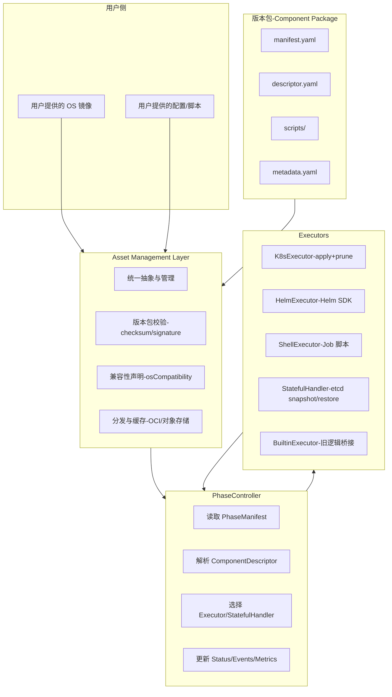

# Asset
**Asset Management Layer**，从业务层面来看，它的作用可以概括为以下几个方面：

## 业务上的问题背景
在安装与运行过程中，涉及大量的“资产”（Assets），包括：
- **镜像**：操作系统镜像、容器镜像。
- **配置文件**：集群配置、组件配置、证书、密钥。
- **二进制/包**：安装脚本、工具包、CNI 插件等。
- **版本包**：不同组件的版本描述与依赖。

这些资产分散在不同来源（用户提供、官方仓库、对象存储），缺乏统一的管理与验证机制，容易导致：
- 版本不一致、依赖缺失。
- 安装失败或运行时错误。
- 安全风险（未经校验的镜像或脚本）。
## Asset Management Layer 的业务作用
1. **统一管理与抽象**
   - 把镜像、配置、脚本、版本包等资产抽象为统一的资源对象。
   - 提供标准接口供控制器、执行器调用，避免各组件自行处理。
2. **版本与依赖控制**
   - 资产与 ComponentVersion/PhaseManifest 绑定，确保安装时使用正确版本。
   - 管理资产之间的依赖关系（例如某个 CNI 插件依赖特定内核模块）。
3. **完整性与安全校验**
   - 在安装前对资产进行校验（checksum、签名验证）。
   - 防止用户提供的镜像或脚本未经验证直接进入生产环境。
4. **分发与缓存**
   - 提供统一的分发机制（对象存储、OCI registry）。
   - 支持缓存与复用，减少重复下载与传输，提高安装效率。
5. **兼容性声明**
   - 在资产元数据中声明兼容性（支持的 OS、Kubernetes 版本）。
   - 控制器在安装前检查兼容性，避免不可控的失败。
6. **桥接旧逻辑**
   - 对旧 phase 的资产（脚本、配置）进行封装，作为 inline 类型或 BuiltinExecutor 的输入。
   - 在迁移过程中保证旧资产仍可被统一管理。
## 优化思路与业务价值
- **降低不可控风险**：通过统一校验与兼容性检查，减少因用户提供 OS/镜像不合规导致的安装失败。
- **提升运维效率**：资产集中管理，便于版本追踪、问题定位与回滚。
- **增强安全性**：所有资产必须经过签名与校验，减少供应链攻击风险。
- **支持不可变 OS 模式**：在不可变 OS 场景下，资产通过容器化/对象存储分发，不依赖运行时修改系统。
- **平滑迁移**：旧 phase 的资产通过 Asset Management Layer 封装，逐步过渡到新声明式模型。
## 总结
**Asset Management Layer** 在业务上的作用是：  
- **统一管理**所有安装运行所需的镜像、配置、脚本与版本包；  
- **保证一致性、安全性与兼容性**；  
- **降低安装失败风险**，支持不可变 OS 与多源资产场景；  
- **为旧逻辑桥接与新架构迁移提供基础设施**。  

它相当于 BKE 的“供应链管理层”，确保集群安装和升级过程中用到的每一个资产都是可控、可验证、可追踪的。  

# 架构图
直观展示 Asset Management Layer 在 BKE 中的业务作用：它如何连接用户资产、版本包、执行器与控制器，形成一个完整的供应链管理闭环。

### 图解说明
- **用户资产**（OS 镜像、配置、脚本） → 统一进入 **Asset Management Layer**。  
- **版本包**（manifest、descriptor、scripts、metadata） → 由 Asset Management Layer 校验、分发。  
- **Asset Management Layer** → 提供统一抽象、校验、兼容性声明、分发与缓存，保证资产安全与一致性。  
- **PhaseController** → 读取 PhaseManifest/ComponentDescriptor，调用 Asset Management Layer 获取资产，再选择合适的 Executor 或 StatefulHandler 执行。  
- **Executors** → 具体执行安装/升级/卸载/健康检查，返回结果给 Controller。BuiltinExecutor 用于旧逻辑桥接。  
### 业务价值
- **统一管理**：所有资产集中管理，避免分散与漂移。  
- **安全校验**：通过 checksum/signature 验证，降低供应链风险。  
- **兼容性控制**：在版本包中声明 OS/K8s 兼容性，安装前自动检查。  
- **分发与缓存**：支持对象存储/OCI registry，提升效率与一致性。  
- **桥接旧逻辑**：BuiltinExecutor 通过 Asset Layer 封装旧 phase 资产，支持渐进迁移。  

# 
