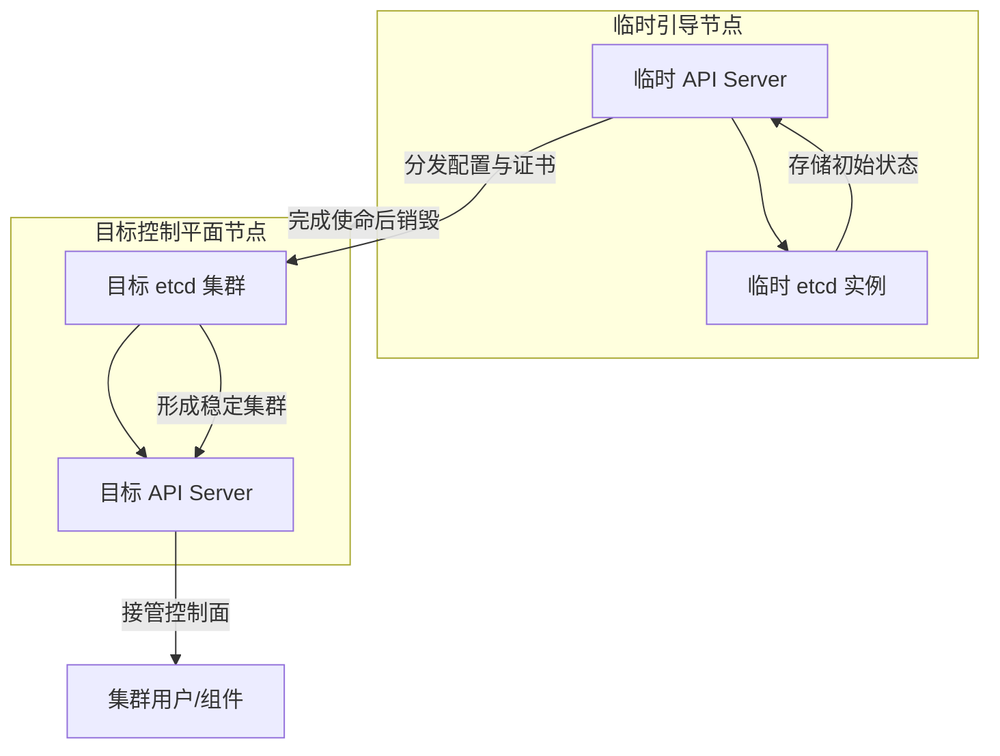

# 为什么 **引导集群** 和 **目标集群**地位看似一样，结果一个有“鸡生蛋”问题，一个没有？
关键在于它们的 **角色定位** 和 **生命周期**。  

**目标集群的困境（“鸡生蛋”问题）**：在正式的 Kubernetes / OpenShift 集群里，API Server 和 etcd 是互相依赖的：  
- API Server 要依赖 etcd 存储状态。  
- etcd 集群要依赖 API Server 分发配置和证书。  
## 🧩 区别核心
- **目标集群**：  
  - 是最终要运行的生产集群。  
  - 它必须有一个完整的控制平面（API Server、etcd、Controller Manager、Scheduler）才能正常工作。  
  - 问题在于：这些控制面组件本身需要集群环境才能运行，但集群环境又依赖它们——这就是“鸡生蛋”问题。  
- **引导集群**：  
  - 是一个临时的安装工具集群，不是生产环境的一部分。  
  - 它的任务是先行启动一个“简化版控制面”，提供最初的 etcd 和 API Server。  
  - 因为它不需要依赖已有的集群环境，而是直接运行在一个引导节点上，所以它天然绕过了“鸡生蛋”问题。  
## ⚙️ 为什么引导集群没有“鸡生蛋”问题
1. **目标集群的困境**：  
   - 要运行 API Server → 需要 etcd。  
   - 要运行 etcd → 需要集群节点和配置。  
   - 但这些节点和配置本身要通过 API Server 来分发。  
   - 形成循环依赖。  
2. **引导集群的解法**：  
   - 在一个临时节点上直接运行最初的 etcd 和 API Server，不依赖已有集群。  
   - 这个临时环境可以分发配置（Ignition 文件）、证书和参数给目标节点。  
   - 目标节点拿到配置后，就能启动真正的控制平面。  
   - 一旦目标控制平面稳定，引导节点退出。
## 🧩 理解关键点
- **目标集群的困境**  
  在正式的 Kubernetes / OpenShift 集群里，API Server 和 etcd 是互相依赖的：  
  - API Server 要依赖 etcd 存储状态。  
  - etcd 集群要依赖 API Server 分发配置和证书。  
  这就是所谓的“鸡生蛋”问题。  
- **引导节点的不同**  
  在引导节点上运行的 etcd 和 API Server **不是完整的生产控制面**，而是一个 **临时的最小化版本**：  
  - etcd：只需要在单个引导节点上运行一个实例，不需要完整的多节点集群。  
  - API Server：只需要能启动并提供基本的配置分发能力，不需要完整的高可用控制面。  
  - 这两个组件在引导节点上可以直接运行，因为它们不依赖已有集群，而是依赖安装程序提供的静态配置和证书。  
- **临时环境的作用**  
  这个最小化的 etcd + API Server 就像一个“假鸡”，它能先把“蛋”（配置、证书、Ignition 文件）分发出去。  
  当目标控制平面节点启动并形成真正的 etcd 集群后，这个临时环境就完成使命并销毁。
### etcd 集群要依赖 API Server 分发配置和证书
 **“etcd 集群要依赖 API Server 分发配置和证书”**，其实是指在 **集群引导阶段**，etcd 并不是凭空就能跑起来的，它需要一些关键的配置和安全凭证，而这些通常由安装程序或临时 API Server 来分发。  
#### 🧩 具体理解
- **配置依赖**  
  etcd 节点需要知道：  
  - 集群成员列表（peer URLs）  
  - 初始集群配置（initial-cluster）  
  - 网络地址和端口  
  这些信息通常由安装程序生成，并通过 API Server 或引导机制分发到各节点。  

- **证书依赖**  
  etcd 集群通信必须使用 TLS，成员之间和客户端（如 API Server）访问都需要证书。  
  - 证书和密钥由安装程序或控制面组件生成。  
  - 临时 API Server 或引导节点负责把这些证书分发到 etcd 节点。  
  没有这些证书，etcd 节点无法安全地组成集群。  

- **引导阶段的角色**  
  在 OpenShift 或 kubeadm 的引导流程中，临时 API Server 会承担“分发中心”的角色：  
  - 它不依赖已有集群，而是直接运行在引导节点上。  
  - 它把 etcd 所需的配置和证书下发到目标控制平面节点。  
  - 等目标 etcd 集群和 API Server 成功运行后，这个临时 API Server 就销毁。  
#### 🔄 总结
**“依赖 API Server 分发配置和证书”** 的意思是：  
- etcd 集群需要配置和 TLS 证书才能启动。  
- 这些配置和证书不是 etcd 自己生成的，而是由安装程序/临时 API Server 提供。  
- 所以在引导阶段，etcd 的启动依赖 API Server 来分发这些关键文件。  

👉 换句话说，**API Server 在引导阶段扮演“证书和配置分发器”的角色，帮助 etcd 集群先跑起来**。 
#### etcd 与 API Server 的依赖关系
在引导阶段，**etcd 与 API Server 的依赖关系**可以用一个流程图来直观展示。下面是一个 Mermaid 图，描述了它们的交互和生命周期：  

 🧩 图解说明
- **临时引导节点**：运行最初的 API Server 和 etcd，用来分发配置和证书。  
- **目标控制平面节点**：接收配置，启动真正的 etcd 集群和 API Server。  
- **依赖关系**：  
  - 临时 API Server → 分发配置和证书给目标 etcd。  
  - 临时 etcd → 提供最初的存储支持。  
  - 目标 etcd 成功启动后 → 目标 API Server 接管控制面。  
- **生命周期**：引导节点完成任务后销毁，避免长期存在。  

👉 换句话说，这个依赖关系图说明了：**临时 API Server 和 etcd 是“孵化器”，它们的唯一任务是帮助目标控制面启动，之后就退出舞台。**  

## ⚙️ 举个类比
可以把它理解为：  
- **目标集群**：要建一栋大楼，但施工图纸和施工队都需要先有办公室才能协调。  
- **引导节点**：临时搭建一个活动板房，里面放最基本的桌椅和图纸。虽然简陋，但足够把施工队组织起来。等大楼建好，板房就拆掉。  
  ## 🔄 总结
- 在引导节点上运行的 etcd 和 API Server **是临时的、最小化的版本**，它们不依赖已有集群，而是依赖安装程序提供的静态配置。  
- 它们的作用是 **打破循环依赖**，先把配置和证书分发出去，让目标控制平面能自举。  
- 一旦目标控制平面稳定运行，引导节点就销毁，避免长期存在。  

👉 换句话说：**引导节点上的 etcd 和 API Server 是“临时鸡”，它们的唯一任务是帮目标集群孵化出真正的控制面。**  
## 📊 对比总结
| **属性** | **引导集群** | **目标集群** |
|----------|--------------|--------------|
| **定位** | 临时安装工具 | 最终生产环境 |
| **生命周期** | 安装阶段存在，完成后退出 | 长期运行 |
| **控制面来源** | 临时运行在引导节点 | 由目标节点组成的稳定控制面 |
| **是否有“鸡生蛋”问题** | 没有，因为它不依赖已有集群 | 有，因为控制面和集群互相依赖 |
| **功能** | 分发配置、运行临时 etcd/API Server、引导 CVO | 提供完整 Kubernetes 服务 |

👉 总结：**目标集群的控制面必须自举，所以有“鸡生蛋”问题；引导集群是一个临时的外部环境，它直接提供最初的控制面，不依赖已有集群，因此没有这个问题。**  

# “鸡生蛋”问题
在 **OpenShift 安装流程**中，所谓的“引导集群”解决的就是一个典型的 **“鸡生蛋”问题**：没有控制平面就无法运行 API Server 和 etcd，但没有 API Server 和 etcd 又无法创建控制平面节点。  
## 🐣 “鸡生蛋”问题
- **困境**：  
  - Kubernetes 集群的核心是 **控制平面**（API Server、etcd、Controller Manager、Scheduler）。  
  - 这些组件需要一个已经存在的集群环境才能正常调度和运行。  
  - 但在集群安装初期，控制平面尚未存在，无法直接运行这些组件。  
- **解决方式**：  
  - OpenShift 使用一个 **临时引导节点（bootstrap node）** 来运行最初的 API Server 和 etcd。  
  - 这个临时环境为目标控制平面节点提供配置和服务，使它们能够启动并形成稳定的集群。  
  - 一旦目标控制平面节点完成初始化，引导节点就会退出并清理。  
## ⚙️ 自动化安装的意义
- **无需人工逐步搭建控制面**：  
  - 传统方式需要管理员手动安装 etcd、配置 API Server、分发证书和配置文件。  
  - 这不仅复杂，而且容易出错。  
- **自动化流程**：  
  - 引导节点通过 **Ignition 配置文件** 自动分发证书、配置和启动参数。  
  - 控制平面节点在启动时自动获取这些配置并完成初始化。  
  - Cluster Version Operator (CVO) 随后接管，确保所有 Operator 和组件的版本与状态一致。  
- **结果**：  
  - 管理员只需提供安装配置（如 `install-config.yaml`），其余步骤由引导集群自动完成。  
  - 避免了人工逐步搭建控制面的繁琐和风险。  
## 📊 引导集群的功能总结
| **功能** | **说明** |
|----------|----------|
| **运行临时控制面** | 提供最初的 API Server 和 etcd |
| **分发配置** | 使用 Ignition 将配置和证书分发到目标节点 |
| **初始化目标控制面** | 帮助控制平面节点形成稳定的 etcd 集群 |
| **启动核心 Operator** | 引导 CVO 等关键组件上线 |
| **退出清理** | 当目标控制面稳定后，自动移除引导节点 |

👉 总结：**引导集群的核心价值在于解决“鸡生蛋”问题，并实现自动化安装**。它不仅仅是配置分发器，更是一个临时控制面环境，确保目标集群能够顺利启动并自我维持。  

# 引导集群（Bootstrap Cluster）
在 **OpenShift** 中，所谓的 **引导集群（Bootstrap Cluster）**，是安装和初始化 OpenShift 集群时临时使用的一个辅助集群。它的作用并不是长期运行，而是帮助完成目标集群的安装和配置。  

## 🧩 引导集群的作用
- **安装入口**：在集群安装过程中，首先启动一个临时的引导节点（bootstrap node），它运行必要的服务来引导控制平面。  
- **生成配置**：负责运行部分核心组件的初始版本（如 etcd、API Server），并提供配置数据。  
- **过渡阶段**：一旦目标集群的控制平面节点完成初始化并能自我维持，引导集群就会被移除。  

## 📊 为什么要用引导集群
- **避免“鸡生蛋”问题**：在没有现成控制平面的情况下，需要一个临时环境来启动第一个 API Server 和 etcd。  
- **自动化安装**：通过引导集群，OpenShift 可以自动生成和分发配置，而不需要人工逐步搭建控制面。  
- **简化流程**：减少安装复杂度，保证集群能在标准化流程下快速上线。  

## 🔄 引导集群的功能
| **功能** | **说明** |
|----------|----------|
| **运行临时控制面** | 启动临时的 API Server、etcd，提供初始服务 |
| **分发配置** | 将安装配置（Ignition 文件）分发到目标节点 |
| **初始化 etcd** | 帮助目标控制平面节点形成稳定的 etcd 集群 |
| **启动核心 Operator** | 引导 Cluster Version Operator (CVO) 等关键组件 |
| **退出并清理** | 当目标集群控制面稳定后，引导节点会自动移除 |

## ⚠️ 功能是否都是配置相关？
- **不仅仅是配置**：引导集群确实负责分发配置（Ignition 文件），但它还承担了临时运行控制面组件的职责。  
- **配置 + 临时运行**：它既是配置分发器，也是一个临时的控制面环境。  
- **最终目标**：确保目标集群的控制面能自我维持，然后退出。  

👉 总结：**OpenShift 的引导集群是安装过程中的临时控制面环境**，它的功能不仅仅是配置分发，还包括运行临时的 API Server、etcd 等核心组件，帮助目标集群完成初始化。  
