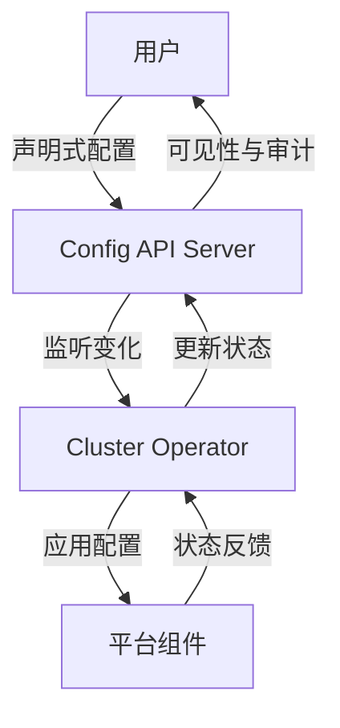

# openshift config api设计的目的
OpenShift 的 **config API 设计目的**并不是“所有组件都只能通过配置进行修改与升级”，而是为了提供一个 **集中、声明式的配置入口**，让集群管理员和平台本身能够以一致的方式管理和演进系统行为。  
## 📌 设计目的与作用
1. **集中化配置管理**  
   - 提供统一的 API 对象（如 `ClusterVersion`, `ClusterOperator`, `Config` 等），避免每个组件各自维护配置文件。  
   - 管理员可以通过 API Server 直接修改配置，而不是逐个登录节点或容器。  
2. **声明式与可追踪**  
   - 配置以 Kubernetes 风格的 CRD/资源对象形式存在，支持版本化和审计。  
   - 任何修改都能通过 `oc get` / `oc describe` / `oc edit` 等命令追踪。  
3. **升级与演进的基础**  
   - OpenShift 的升级流程依赖 `ClusterVersion` API 来协调 Operator、镜像拉取、组件滚动更新。  
   - 配置 API 让升级过程自动化，而不是人工逐步修改。  
4. **一致性与自动化**  
   - 各组件通过 Operator 监听配置 API 的变化，自动调整自身行为。  
   - 避免了“配置漂移”问题（不同节点或组件配置不一致）。  
## ⚠️ 局限与误区
- **并非所有修改都走 config API**：某些应用层或用户工作负载的配置仍需在 Deployment/ConfigMap 层面完成。  
- **不是万能升级工具**：config API 主要针对平台组件（如 API Server、Ingress、OAuth、Monitoring），而不是用户应用。  
- **需要 Operator 配合**：配置 API 本身只是声明，实际生效依赖 Operator 控制循环。  
## ✅ 总结
OpenShift config API 的设计目的在于：  
- **统一入口**：集中声明式配置，避免分散管理。  
- **自动化升级**：为平台组件升级和演进提供基础。  
- **一致性保障**：通过 Operator 自动应用配置，减少人工干预。  

它并不是说“所有组件都只能通过配置 API 修改”，而是为 **平台级别的核心组件**提供一致的管理和升级机制。
##  OpenShift 配置流转架构图 

### 📌 图解说明
1. **用户 (User)**  
   - 通过 `oc` 命令或控制台提交配置修改。  
2. **Config API Server**  
   - 集中入口，存储声明式配置对象（如 `ClusterVersion`, `OAuth`, `Ingress`, `Monitoring` 等）。  
   - 提供审计和版本化能力。  
3. **Operator**  
   - 监听 Config API 的变化。  
   - 执行控制循环，将配置应用到实际组件。  
4. **组件 (Component)**  
   - 平台核心服务（API Server、Ingress、OAuth、监控等）。  
   - 根据 Operator 下发的配置进行调整。  
5. **反馈回路**  
   - 组件状态反馈给 Operator。  
   - Operator 更新 Config API 的状态字段，用户可查询到最新运行情况。  

✅ **总结**：  
OpenShift 的 config API 并不是让所有组件都只能通过配置修改，而是提供一个 **统一声明式入口**，由 Operator 负责落地到具体组件，形成 **用户 → API → Operator → 组件 → 状态反馈** 的闭环。  

要不要我再帮你扩展一个 **风险矩阵表**，分析如果绕过 config API（直接改组件配置文件）可能带来的风险，比如配置漂移、升级失败、不可审计等？
