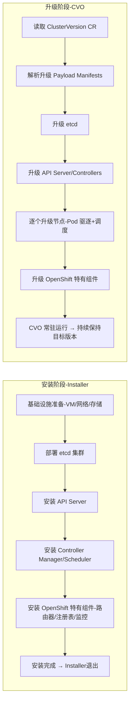

# openshift中的安装与升级的组件顺序是否是一样的？
**在 OpenShift 中，安装与升级的组件顺序并不完全一样：安装是从零开始逐步拉起核心组件，而升级则是在已有集群上按优先级逐步替换和更新，通常先升级控制平面（master/etcd），再升级节点和应用组件。**  [docs.redhat.com](https://docs.redhat.com/en/documentation/openshift_container_platform/3.11/html/upgrading_clusters/install-config-upgrading-index)  [OpenShift Documentation](https://docs.openshift.com/enterprise/3.1/////////////install_config/upgrading/manual_upgrades.html)  [kifarunix.com](https://kifarunix.com/how-to-upgrade-openshift-cluster-step-by-step/)
## 📌 安装顺序（OpenShift 4.x）
1. **基础设施准备**：操作系统、网络、存储。  
2. **etcd 集群**：作为数据存储，必须最先启动。  
3. **API Server**：提供 Kubernetes/OpenShift API。  
4. **Controller Manager / Scheduler**：负责调度与控制逻辑。  
5. **节点服务**：kubelet、CRI-O 等。  
6. **OpenShift 特有组件**：路由器、注册表、监控、日志。  
7. **应用工作负载**：用户 Pod 和服务。
## 📌 升级顺序（OpenShift 4.x OTA 升级）
- **控制平面优先**：  
  - 先升级 **etcd** 和 **master 节点**上的 API Server、Controller Manager。  
  - 保证集群管理面一致性。  
- **节点逐步升级**：  
  - 逐个节点驱逐 Pod → 升级节点 → Pod 重新调度。  
  - 避免应用中断。  
- **平台组件升级**：  
  - 路由器、注册表、监控、日志等在控制平面稳定后升级。  
- **应用保持运行**：  
  - 通过滚动升级和 Pod 驱逐机制，应用尽量不中断。  
## 📊 对比表
| 阶段 | 安装顺序 | 升级顺序 |
|------|----------|----------|
| 数据存储 | etcd 首先安装 | etcd 首先升级 |
| 控制平面 | API Server → Controller Manager → Scheduler | Master 节点组件优先升级 |
| 节点 | kubelet/CRI-O 安装 | 节点逐个升级，Pod 驱逐再调度 |
| OpenShift 特有组件 | 路由器、注册表、监控、日志安装 | 在控制平面稳定后升级 |
| 应用 | 最后部署用户工作负载 | 升级过程中保持运行，滚动更新 |
## 🔑 总结
- **安装**：自底向上，从 etcd → 控制平面 → 节点 → OpenShift 组件 → 应用。  
- **升级**：先控制平面，再节点，最后平台组件，应用不中断。  
- **差异点**：安装是“拉起”，升级是“替换”；安装强调依赖顺序，升级强调稳定性和最小化中断。

# CVO是不是只管升级，而installer只管安装？
你理解得很对：在 **OpenShift 4.x** 的架构里，**Installer** 和 **Cluster Version Operator (CVO)** 的职责是分开的：
## 📌 Installer
- **作用**：只负责集群的**初始安装**。  
- **流程**：
  - 生成并部署基础设施（VM、网络、存储）。  
  - 创建控制平面节点，拉起 etcd、API Server、Controller Manager 等核心组件。  
  - 安装最初的 Operator（包括 CVO 本身）。  
- **特点**：
  - 一次性执行，完成集群的“bootstrap”。  
  - 安装完成后退出，不再参与后续生命周期管理。  
## 📌 Cluster Version Operator (CVO)
- **作用**：只负责集群的**升级与更新**。  
- **流程**：
  - 读取 `ClusterVersion` CR 中的目标版本。  
  - 按照清单（payload manifests）逐步升级 Operators 和组件。  
  - 先升级控制平面，再升级节点，再升级平台组件。  
- **特点**：
  - 常驻运行，持续监控并驱动升级。  
  - 确保集群始终处于声明的目标版本。  
## 📊 对比表
| 角色 | Installer | CVO |
|------|-----------|-----|
| 主要职责 | 集群初始安装 | 集群升级与更新 |
| 生命周期 | 一次性执行，安装完成后退出 | 常驻运行，持续管理版本 |
| 操作对象 | 基础设施 + 控制平面初始组件 | Operators + 控制平面 + 节点组件 |
| 典型场景 | `openshift-install create cluster` | 升级 OpenShift 版本（OTA） |
## ✅ 总结
- **Installer**：只管安装，负责把集群拉起来。  
- **CVO**：只管升级，负责把集群保持在目标版本。  
- 两者职责分离，形成安装 → 升级的完整生命周期闭环。  
## 架构图
直观展示 OpenShift 生命周期中 **Installer** 与 **Cluster Version Operator (CVO)** 的分工：前者负责安装，后者负责升级。

### 图解说明
- **Installer**：一次性执行，负责集群的初始安装，从基础设施 → etcd → 控制平面 → 平台组件，完成后退出。  
- **CVO**：常驻运行，负责集群的升级与更新，读取目标版本 → 按顺序升级 etcd → 控制平面 → 节点 → 平台组件，确保集群始终处于声明的版本。  
### 🔑 差异总结
- **Installer** → “拉起”集群，生命周期一次性。  
- **CVO** → “保持”集群版本，生命周期常驻。  
- 两者职责分离，形成 **安装 → 升级** 的完整闭环。
- 
# 安装与升级的执行顺序是否可以设计成一致？使用相同的依赖
在设计层面上，**安装与升级的执行顺序可以尽量保持一致，使用相同的依赖关系**，但两者的目标和上下文不同，因此完全一致并不总是可行：
## 📌 理论上的一致性
- **依赖关系相同**：  
  - 无论是安装还是升级，组件之间的依赖链条是固定的：  
    - **etcd → API Server → Controller Manager/Scheduler → 节点服务 → 平台组件**。  
  - 这条链路决定了必须先有存储，再有 API，再有控制逻辑，最后才能拉起节点和平台服务。  
- **顺序可复用**：  
  - 安装时是“拉起”这些组件。  
  - 升级时是“替换”这些组件。  
  - 两者都遵循相同的依赖顺序。
## 📌 实际上的差异
- **安装**：从零开始，必须严格按照依赖顺序逐步拉起。  
- **升级**：已有集群运行中，强调 **最小化中断**，因此会采用滚动升级、灰度替换等策略。  
  - 例如升级节点时，会先驱逐 Pod，再升级，再调度回来。  
  - 控制平面组件升级时，通常是逐个替换，而不是一次性全部重启。  
- **并发与串行**：安装通常是串行的，而升级可以部分并发（例如节点批次升级）。  
## 📊 对比表
| 特性 | 安装 | 升级 |
|------|------|------|
| 依赖顺序 | 严格遵循 | 基本遵循，但可并发 |
| 执行目标 | 从零拉起组件 | 替换已有组件 |
| 中断容忍度 | 可接受短暂不可用 | 必须最小化中断 |
| 策略 | 串行执行 | 滚动/灰度升级 |
## ✅ 总结
- **可以设计成一致的依赖顺序**：安装与升级都遵循相同的组件依赖链。  
- **执行策略不同**：安装强调“先后顺序”，升级强调“不中断”，因此在实现上会有差异。  
- **最佳实践**：保持统一的依赖模型，但在升级时引入滚动、灰度、并发机制来保证稳定性。  
