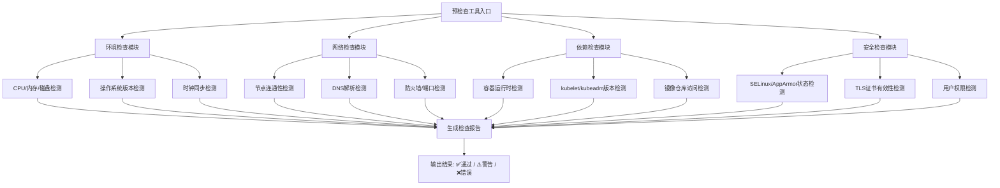

# 预检查工具
在设计 **Kubernetes 的预检查工具** 时，核心目标是：在集群安装或升级之前，自动检测环境是否满足要求，避免后续部署失败或运行异常。一个合理的设计需要覆盖 **系统环境、网络、依赖组件、配置一致性** 等方面。  

## 📌 设计思路
- **环境检查**  
  - 操作系统版本、内核参数、文件系统类型。  
  - 确认 CPU、内存、磁盘空间满足最低要求。  
- **网络检查**  
  - 节点间网络连通性（ping、端口探测）。  
  - 防火墙规则、端口开放情况。  
  - DNS 解析是否正常。  
- **依赖组件检查**  
  - Docker/CRI-O/containerd 是否安装并运行。  
  - kubelet、kubectl、kubeadm 版本是否匹配。  
  - etcd 是否可用（如已有集群）。  
- **配置一致性检查**  
  - 节点时钟同步（NTP）。  
  - 主机名解析一致性。  
  - CNI 插件配置是否正确。  
- **安全与合规检查**  
  - SELinux/AppArmor 状态。  
  - 系统用户权限。  
  - TLS 证书有效性。  

## ⚖️ 工具设计模式
1. **插件化架构**：每个检查项作为独立模块，方便扩展。  
2. **声明式配置**：用户可通过 YAML/JSON 定义需要检查的规则。  
3. **分级结果输出**：  
   - ✅ 通过  
   - ⚠️ 警告（可继续但需注意）  
   - ❌ 错误（必须修复才能继续）  
4. **可视化报告**：输出 HTML/JSON 报告，便于集成到 CI/CD 流程。  
5. **与 kubeadm 集成**：在 `kubeadm init` 或 `kubeadm upgrade` 前自动运行。  

## 🚀 总结
一个好的 Kubernetes 预检查工具应该：  
- **覆盖环境、网络、依赖、配置、安全**五大类检查。  
- **插件化、声明式、分级输出**，便于扩展和自动化。  
- **与安装/升级流程集成**，在问题发生前阻止部署。  

# 预检查工具架构图
展示模块化设计中各个检查模块（环境检查、网络检查、依赖检查、安全检查）的关系：

### 📌 架构说明
- **入口**：用户运行预检查工具。  
- **模块化设计**：分为环境、网络、依赖、安全四大模块，每个模块包含多个子检查项。  
- **结果汇总**：所有检查项结果汇总到报告模块，输出分级结果（通过/警告/错误）。  
- **扩展性**：每个模块可独立扩展，支持插件化。  

这样设计的好处是：  
- **清晰分层**：不同检查项归属不同模块，逻辑清晰。  
- **易于扩展**：未来增加新的检查项，只需在对应模块添加。  
- **自动化集成**：报告结果可直接集成到 CI/CD 流程或安装器中。  
