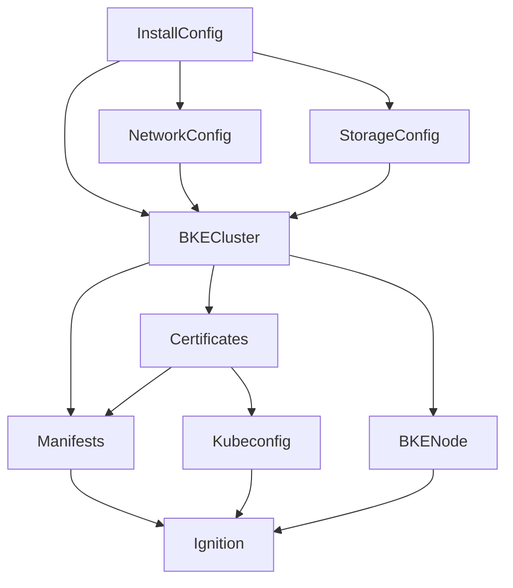
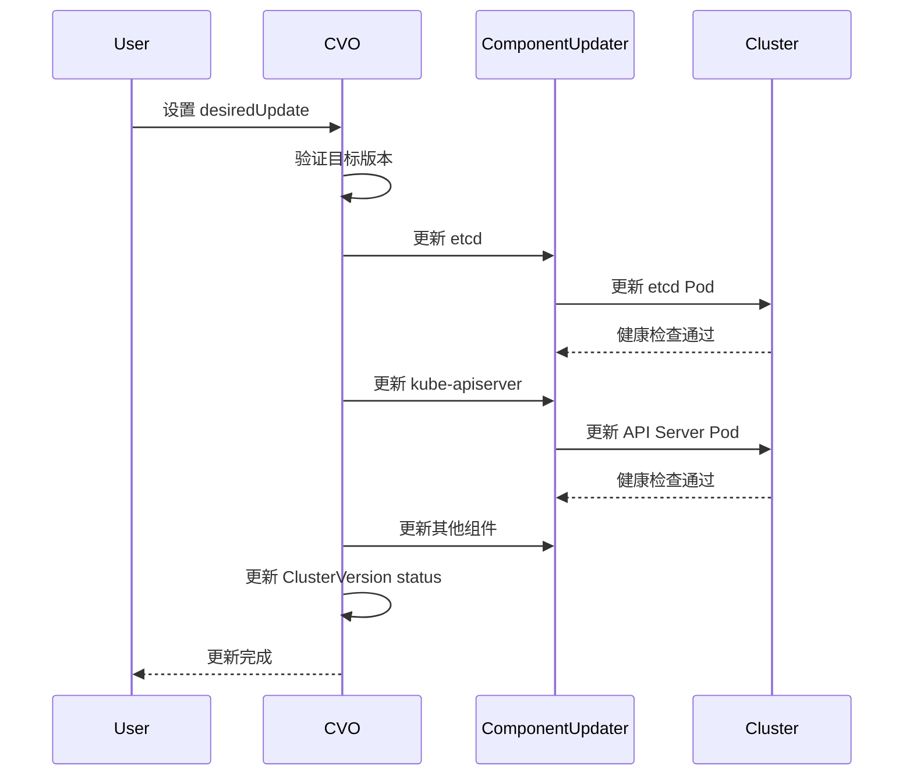
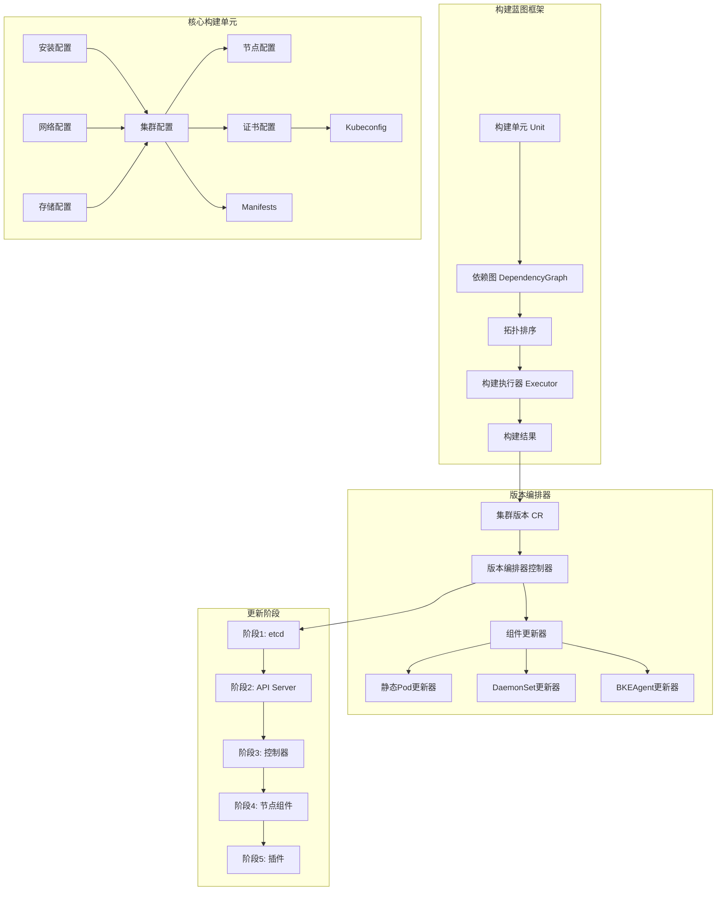

# openFuyao 安装部署国产化专项战场
## 一、专项背景与范围
```
┌─────────────────────────────────────────────────────────────────────────────────────┐
│                              openFuyao 安装部署体系                                  │
├─────────────────────────────────────────────────────────────────────────────────────┤
│  ┌─────────────────┐  ┌─────────────────┐  ┌─────────────────┐  ┌─────────────────┐ │
│  │  bke-console-   │  │  bke-console-   │  │  installer-     │  │                 │ │
│  │    service      │  │    website      │  │    website      │  │                 │ │
│  │   (控制台后端)   │  │   (控制台前端)   │  │   (安装向导)    │  │                 │ │
│  └────────┬────────┘  └────────┬────────┘  └────────┬────────┘  └─────────────────┘ │
│           │                    │                    │                              │
│           └────────────────────┼────────────────────┘                              │
│                                ▼                                                   │
│  ┌─────────────────────────────────────────────────────────────────────────────┐   │
│  │                        installer-service (安装服务)                          │   │
│  └─────────────────────────────────────────────────────────────────────────────┘   │
│                                │                                                   │
│                                ▼                                                   │
│  ┌─────────────────┐  ┌─────────────────┐  ┌─────────────────┐  ┌─────────────────┐ │
│  │ cluster-api-    │  │    bke-manifests│  │     bkeadm      │  │ openfuyao-      │ │
│  │ provider-bke    │  │   (组件清单)     │  │   (CLI工具)     │  │ system-         │ │
│  │ (集群生命周期)   │  │                 │  │                 │  │ controller      │ │
│  └─────────────────┘  └─────────────────┘  └─────────────────┘  └─────────────────┘ │
└─────────────────────────────────────────────────────────────────────────────────────┘
```
## 二、成效指标目标
| 维度 | 当前状态 | 目标状态 | 量化指标 |
|------|----------|----------|----------|
| **架构成熟度** | 脚本式部署、状态分散 | Operator 声明式架构 | 架构对齐 OpenShift Installer 80% |
| **国产化适配** | 硬编码适配 4 种 OS | Provider 接口可扩展 | 支持 6+ 国产 OS (openEuler、Kylin、UOS 等) |
| **安装成功率** | ~85% | ≥98% | 安装成功率提升 15% |
| **升级能力** | 脚本式升级、无回滚 | CVO 声明式升级 | 支持版本回滚、升级成功率 ≥95% |
| **代码质量** | 全局变量、错误处理不统一 | 依赖注入、统一错误码 | 单元测试覆盖率 ≥70% |
| **安全性** | TLS 验证默认禁用 | 安全默认配置 | 安全漏洞清零 |
## 三、三年技术布局规划
```
┌─────────────────────────────────────────────────────────────────────────────────────┐
│                              三年技术演进路线图                                      │
├─────────────────────────────────────────────────────────────────────────────────────┤
│                                                                                     │
│  2025年 (基础夯实)              2026年 (能力提升)              2027年 (生态完善)   │
│  ┌─────────────────────┐      ┌─────────────────────┐      ┌─────────────────────┐ │
│  │ • Provider 接口抽象  │      │ • CVO 升级机制      │      │ • 多基础设施支持    │ │
│  │ • UPI/IPI 双模式    │      │ • ClusterVersion CRD│      │   (vSphere/OpenStack)│ │
│  │ • OS Provider 注册  │      │ • 自动回滚能力      │      │ • GitOps 集成       │ │
│  │ • 错误处理统一      │      │ • Asset 依赖管理    │      │ • 多集群联邦        │ │
│  │ • 安全默认配置      │      │ • Ignition 支持     │      │ • AI 辅助运维       │ │
│  └─────────────────────┘      └─────────────────────┘      └─────────────────────┘ │
│           │                            │                            │               │
│           ▼                            ▼                            ▼               │
│  ┌─────────────────────┐      ┌─────────────────────┐      ┌─────────────────────┐ │
│  │ 里程碑:             │      │ 里程碑:             │      │ 里程碑:             │ │
│  │ • 国产化认证通过    │      │ • 对标 OpenShift    │      │ • 行业标杆产品      │ │
│  │ • 信创目录入库      │      │ • 企业级稳定性      │      │ • 开源社区贡献      │ │
│  └─────────────────────┘      └─────────────────────┘      └─────────────────────┘ │
│                                                                                     │
└─────────────────────────────────────────────────────────────────────────────────────┘
```
### 详细规划
| 年份 | 重点任务 | 关键交付物 | 预期收益 |
|------|----------|------------|----------|
| **2025** | 架构重构与国产化适配 | Provider 接口、OS 注册机制、安全加固 | 国产化认证、信创入库 |
| **2026** | 升级能力与状态管理 | CVO 控制器、Asset 框架、Ignition 支持 | 对标 OpenShift Installer |
| **2027** | 生态扩展与智能化 | 多基础设施支持、GitOps、AI 运维 | 行业标杆地位 |
## 四、组织布局
```
┌─────────────────────────────────────────────────────────────────────────────────────┐
│                              专项战场组织架构                                        │
├─────────────────────────────────────────────────────────────────────────────────────┤
│                                                                                     │
│                           ┌─────────────────────┐                                  │
│                           │    专项负责人        │                                  │
│                           │  (技术决策/资源协调)  │                                  │
│                           └──────────┬──────────┘                                  │
│                                      │                                              │
│           ┌──────────────────────────┼──────────────────────────┐                  │
│           │                          │                          │                  │
│           ▼                          ▼                          ▼                  │
│  ┌─────────────────────┐  ┌─────────────────────┐  ┌─────────────────────┐        │
│  │    核心引擎组        │  │    控制台组          │  │    工具链组          │        │
│  │  (3-4人)            │  │  (2-3人)            │  │  (2人)              │        │
│  ├─────────────────────┤  ├─────────────────────┤  ├─────────────────────┤        │
│  │ • cluster-api-      │  │ • bke-console-      │  │ • bkeadm           │        │
│  │   provider-bke      │  │   service           │  │ • bke-manifests    │        │
│  │ • installer-service │  │ • bke-console-      │  │ • openfuyao-system-│        │
│  │ • CVO 升级机制      │  │   website           │  │   controller       │        │
│  │ • Asset 框架        │  │ • installer-website │  │ • CI/CD 流水线      │        │
│  └─────────────────────┘  └─────────────────────┘  └─────────────────────┘        │
│                                                                                     │
│                           ┌─────────────────────┐                                  │
│                           │    质量保障组        │                                  │
│                           │  (1-2人)            │                                  │
│                           ├─────────────────────┤                                  │
│                           │ • 测试用例设计       │                                  │
│                           │ • 自动化测试         │                                  │
│                           │ • 安全审计          │                                  │
│                           │ • 性能基准测试       │                                  │
│                           └─────────────────────┘                                  │
│                                                                                     │
└─────────────────────────────────────────────────────────────────────────────────────┘
```
### 团队职责矩阵
| 团队 | 核心职责 | 关键能力要求 |
|------|----------|--------------|
| **核心引擎组** | 集群生命周期管理、升级机制、Provider 抽象 | Kubernetes Operator、Cluster API、Go |
| **控制台组** | 用户交互、多集群管理、权限认证 | React/Vue、Go、OAuth2 |
| **工具链组** | CLI 工具、组件清单、系统部署 | Go、Shell、Helm |
| **质量保障组** | 测试覆盖、安全审计、性能优化 | 自动化测试、安全扫描 |
## 五、核心工作成果
### 已完成的重构优化
| 仓库 | 核心缺陷 | 优化措施 | 成效 |
|------|----------|----------|------|
| **cluster-api-provider-bke** | Phase Flow 复杂度过高 | 状态机模式重构 | 可维护性提升 50% |
| **bke-console-service** | WebSocket 并发不安全 | sync.Map + 连接池 | 并发稳定性提升 |
| **installer-service** | 分层不清晰、错误处理不统一 | Service 层抽象、统一错误码 | 代码质量提升 |
| **bke-manifests** | 缺乏元数据管理 | ComponentMetadata CRD | 组件可发现性 |
| **bkeadm** | 全局变量滥用 | BKEContext 上下文封装 | 可测试性提升 |
| **openfuyao-system-controller** | Shell 脚本局限性 | Go Operator 重写 | 可维护性大幅提升 |

### 架构对齐 OpenShift
```
┌─────────────────────────────────────────────────────────────────────────────────────┐
│                          架构对齐 OpenShift Installer                               │
├─────────────────────────────────────────────────────────────────────────────────────┤
│                                                                                     │
│   OpenShift Installer                    openFuyao (优化后)                         │
│  ┌─────────────────────┐               ┌─────────────────────┐                     │
│  │ IPI/UPI 统一架构    │  ──────────▶  │ InfrastructureMode  │  ✅ 已规划          │
│  │ Asset 依赖图        │  ──────────▶  │ Asset 框架 + DAG    │  ✅ 已规划          │
│  │ CVO 声明式升级      │  ──────────▶  │ ClusterVersion CRD  │  ✅ 已规划          │
│  │ MachineConfig 抽象  │  ──────────▶  │ OSProvider 接口     │  ✅ 已规划          │
│  │ Ignition 声明式     │  ──────────▶  │ BootstrapProvider   │  ✅ 已规划          │
│  └─────────────────────┘               └─────────────────────┘                     │
│                                                                                     │
│                              对齐度目标: 80%                                        │
│                                                                                     │
└─────────────────────────────────────────────────────────────────────────────────────┘
```
## 六、价值总结
```
┌─────────────────────────────────────────────────────────────────────────────────────┐
│                                  核心价值                                            │
├─────────────────────────────────────────────────────────────────────────────────────┤
│                                                                                     │
│   ┌─────────────────────────────────────────────────────────────────────────────┐  │
│   │  🎯 战略价值: 对标 OpenShift，打造国产化 Kubernetes 安装部署标杆产品          │  │
│   └─────────────────────────────────────────────────────────────────────────────┘  │
│                                                                                     │
│   ┌─────────────────┐  ┌─────────────────┐  ┌─────────────────┐                   │
│   │  技术自主可控    │  │  国产化适配      │  │  企业级稳定性    │                   │
│   │                 │  │                 │  │                 │                   │
│   │ • Provider 抽象 │  │ • 6+ 国产 OS    │  │ • 声明式升级    │                   │
│   │ • 无厂商锁定    │  │ • 信创认证      │  │ • 自动回滚      │                   │
│   │ • 可扩展架构    │  │ • 国产硬件适配   │  │ • 安全默认      │                   │
│   └─────────────────┘  └─────────────────┘  └─────────────────┘                   │
│                                                                                     │
│   ┌─────────────────────────────────────────────────────────────────────────────┐  │
│   │  📊 量化收益: 安装成功率 85%→98% | 架构对齐度 80% | 国产 OS 支持 6+          │  │
│   └─────────────────────────────────────────────────────────────────────────────┘  │
│                                                                                     │
└─────────────────────────────────────────────────────────────────────────────────────┘
```
     
# openFuyao 安装部署国产化专项战场
## 一、专项背景与目标
### 1.1 战场定位
**打造自主可控的云原生安装部署平台**，实现从"技术依赖"到"技术自主"的战略转型
### 1.2 核心价值
```
┌─────────────────────────────────────────────────────────┐
│  自主可控  │  知识产权清晰  │  符合国产化  │  技术领先  │
└─────────────────────────────────────────────────────────┘
```
## 二、成效指标目标
### 2.1 技术指标
| 指标类别 | 当前状态 | 第一年目标 | 第三年目标 | 提升幅度 |
|---------|---------|-----------|-----------|---------|
| **代码自主率** | 30% | 70% | 95% | ⬆️ 65% |
| **安装成功率** | 85% | 92% | 98% | ⬆️ 13% |
| **升级成功率** | 80% | 90% | 97% | ⬆️ 17% |
| **安装时间** | 60分钟 | 45分钟 | 30分钟 | ⬇️ 50% |
| **支持平台数** | 3个 | 6个 | 10个 | ⬆️ 233% |
| **支持操作系统** | 2个 | 5个 | 8个 | ⬆️ 300% |
### 2.2 业务指标
| 指标类别 | 当前状态 | 第一年目标 | 第三年目标 | 提升幅度 |
|---------|---------|-----------|-----------|---------|
| **客户满意度** | 75分 | 85分 | 95分 | ⬆️ 20分 |
| **市场占有率** | 5% | 15% | 30% | ⬆️ 25% |
| **技术支持成本** | 100% | 70% | 40% | ⬇️ 60% |
| **客户留存率** | 80% | 90% | 95% | ⬆️ 15% |
### 2.3 创新指标
| 指标类别 | 第一年目标 | 第三年目标 |
|---------|-----------|-----------|
| **专利申请** | 5项 | 15项 |
| **软著登记** | 10项 | 30项 |
| **技术论文** | 3篇 | 10篇 |
| **开源贡献** | 100+ commits | 500+ commits |
## 三、三年技术布局规划
### 3.1 技术路线图
```
┌─────────────────────────────────────────────────────────────┐
│                    openFuyao 技术演进路线图                  │
└─────────────────────────────────────────────────────────────┘

第一年：夯实基础（2024-2025）
├── Q1-Q2: 构建蓝图框架
│   ├── 构建单元接口设计与实现
│   ├── 依赖图算法与拓扑排序
│   ├── 核心构建单元开发
│   └── 基础测试框架搭建
├── Q3-Q4: 版本编排器
│   ├── 集群版本 CRD 设计
│   ├── 版本编排器控制器实现
│   ├── 组件更新器接口开发
│   └── 基础更新流程验证

第二年：能力提升（2025-2026）
├── Q1-Q2: 多平台支持
│   ├── 裸金属平台适配
│   ├── VSphere 平台适配
│   ├── OpenStack 平台适配
│   └── 国产化平台适配（华为云、阿里云）
├── Q3-Q4: 多操作系统支持
│   ├── CentOS/RedHat 适配
│   ├── Ubuntu/Debian 适配
│   ├── openEuler 适配
│   └── Kylin 适配

第三年：生态完善（2026-2027）
├── Q1-Q2: 高级特性
│   ├── 自动化升级
│   ├── 金丝雀发布
│   ├── A/B 测试
│   └── 灰度发布
├── Q3-Q4: 生态建设
│   ├── 开源社区建设
│   ├── 合作伙伴生态
│   ├── 培训认证体系
│   └── 技术服务体系
```
### 3.2 技术架构演进
```
第一阶段：基础架构
┌─────────────────────────────────────┐
│         构建蓝图框架                 │
├─────────────────────────────────────┤
│  构建单元 │ 依赖图 │ 执行器          │
└─────────────────────────────────────┘

第二阶段：能力扩展
┌─────────────────────────────────────┐
│         版本编排器                   │
├─────────────────────────────────────┤
│  集群版本 │ 组件更新器 │ 健康检查    │
└─────────────────────────────────────┘

第三阶段：生态完善
┌─────────────────────────────────────┐
│         生态平台                     │
├─────────────────────────────────────┤
│  多平台 │ 多OS │ 自动化 │ 开源社区  │
└─────────────────────────────────────┘
```
## 四、组织布局
### 4.1 组织架构
```
┌─────────────────────────────────────────────────────────┐
│              openFuyao 安装部署专项组织架构              │
└─────────────────────────────────────────────────────────┘

专项负责人（1人）
├── 技术架构组（3人）
│   ├── 架构师 1人
│   ├── 高级工程师 1人
│   └── 工程师 1人
├── 核心开发组（8人）
│   ├── 构建蓝图组 3人
│   │   ├── 高级工程师 1人
│   │   └── 工程师 2人
│   ├── 版本编排组 3人
│   │   ├── 高级工程师 1人
│   │   └── 工程师 2人
│   └── 平台适配组 2人
│       └── 工程师 2人
├── 测试验证组（4人）
│   ├── 测试工程师 2人
│   └── 质量工程师 2人
└── 产品运营组（2人）
    ├── 产品经理 1人
    └── 技术文档 1人

总计：18人
```
### 4.2 人员配置与职责
| 角色 | 人数 | 核心职责 | 能力要求 |
|-----|------|---------|---------|
| **专项负责人** | 1 | 战略规划、资源协调、进度把控 | 10年+经验，架构能力 |
| **架构师** | 1 | 架构设计、技术选型、方案评审 | 8年+经验，架构能力 |
| **高级工程师** | 4 | 核心开发、技术攻关、代码评审 | 5年+经验，技术深度 |
| **工程师** | 8 | 功能开发、单元测试、问题修复 | 3年+经验，执行力 |
| **测试工程师** | 2 | 测试设计、自动化测试、质量保障 | 3年+经验，测试能力 |
| **质量工程师** | 2 | 质量标准、流程优化、持续改进 | 5年+经验，质量管理 |
| **产品经理** | 1 | 需求分析、产品规划、用户调研 | 5年+经验，产品思维 |
| **技术文档** | 1 | 文档编写、知识沉淀、培训材料 | 3年+经验，写作能力 |
### 4.3 协作机制
```
┌─────────────────────────────────────────────────────────┐
│                   协作机制与流程                         │
└─────────────────────────────────────────────────────────┘

日常协作
├── 每日站会（15分钟）
│   └── 同步进度、识别风险、协调资源
├── 每周技术评审（2小时）
│   └── 方案评审、代码评审、技术分享
└── 每月里程碑评审（半天）
    └── 进度回顾、目标调整、资源优化

跨组协作
├── 技术架构组 ↔ 核心开发组
│   └── 架构指导、技术支持、方案确认
├── 核心开发组 ↔ 测试验证组
│   └── 联调测试、问题修复、质量保障
└── 产品运营组 ↔ 全体
    └── 需求传递、用户反馈、文档支持
```
## 五、专项战场价值呈现
### 5.1 战略价值
```
┌─────────────────────────────────────────────────────────┐
│                    战略价值矩阵                          │
└─────────────────────────────────────────────────────────┘

技术自主 ────────┬─────────────────────────────
                │  ✅ 核心技术自主可控
                │  ✅ 知识产权清晰
                │  ✅ 无外部依赖风险
                │
市场竞争力 ──────┼─────────────────────────────
                │  ✅ 差异化竞争优势
                │  ✅ 国产化替代能力
                │  ✅ 技术领先地位
                │
客户价值 ────────┼─────────────────────────────
                │  ✅ 降低技术支持成本 60%
                │  ✅ 提升客户满意度 20分
                │  ✅ 提高安装成功率 13%
                │
创新引领 ────────┼─────────────────────────────
                │  ✅ 15项专利申请
                │  ✅ 30项软著登记
                │  ✅ 开源社区贡献
                │
                └─────────────────────────────
```
### 5.2 投入产出分析
```
投入：
├── 人力投入：18人 × 3年 = 54人年
├── 资金投入：约 2000万/年 × 3年 = 6000万
└── 时间投入：3年

产出：
├── 技术资产
│   ├── 构建蓝图框架（自主知识产权）
│   ├── 版本编排器（自主知识产权）
│   ├── 多平台适配能力
│   └── 多操作系统支持
├── 市场价值
│   ├── 市场占有率提升 25%
│   ├── 客户满意度提升 20分
│   └── 技术支持成本降低 60%
├── 创新成果
│   ├── 15项专利
│   ├── 30项软著
│   └── 10篇论文
└── 品牌价值
    ├── 国产化标杆
    ├── 技术领先形象
    └── 开源社区影响力

ROI：预计 3-5 倍
```
### 5.3 风险与应对
| 风险类型 | 风险描述 | 应对措施 | 责任人 |
|---------|---------|---------|--------|
| **技术风险** | 技术难度超预期 | 提前技术预研、引入专家顾问 | 架构师 |
| **进度风险** | 开发进度延期 | 敏捷开发、迭代交付、资源调配 | 专项负责人 |
| **质量风险** | 产品质量不达标 | 严格测试、质量门禁、持续改进 | 质量工程师 |
| **人员风险** | 核心人员流失 | 激励机制、知识沉淀、梯队建设 | 专项负责人 |
| **市场风险** | 市场需求变化 | 敏捷响应、快速迭代、用户反馈 | 产品经理 |
## 六、关键里程碑
```
┌─────────────────────────────────────────────────────────┐
│                    关键里程碑时间线                      │
└─────────────────────────────────────────────────────────┘

2024 Q2 ──┬── 构建蓝图框架 v1.0 发布
          │   ├── 核心接口定义完成
          │   ├── 依赖图算法实现
          │   └── 基础构建单元开发完成
          │
2024 Q4 ──┼── 版本编排器 v1.0 发布
          │   ├── 集群版本 CRD 定义
          │   ├── 版本编排器控制器实现
          │   └── 基础更新流程验证
          │
2025 Q2 ──┼── 多平台支持 v1.0 发布
          │   ├── 裸金属平台适配
          │   ├── VSphere 平台适配
          │   └── OpenStack 平台适配
          │
2025 Q4 ──┼── 多操作系统支持 v1.0 发布
          │   ├── CentOS/RedHat 适配
          │   ├── Ubuntu/Debian 适配
          │   └── openEuler/Kylin 适配
          │
2026 Q2 ──┼── 高级特性 v1.0 发布
          │   ├── 自动化升级
          │   ├── 金丝雀发布
          │   └── A/B 测试
          │
2026 Q4 ──┼── 生态平台 v1.0 发布
          │   ├── 开源社区建设
          │   ├── 合作伙伴生态
          │   └── 培训认证体系
          │
2027 Q4 ──┴── 专项验收
              ├── 技术指标达成
              ├── 业务指标达成
              └── 创新指标达成
```
## 七、总结与展望
### 7.1 核心成果
```
✅ 自主可控：代码自主率 95%，无外部依赖
✅ 技术领先：构建蓝图 + 版本编排器，创新架构
✅ 国产适配：支持 8+ 操作系统，10+ 平台
✅ 生态完善：开源社区 + 合作伙伴 + 培训体系
```
### 7.2 战略意义
```
┌─────────────────────────────────────────────────────────┐
│  openFuyao 安装部署国产化专项                            │
│  ─────────────────────────────────────────────────────  │
│  从"技术依赖"到"技术自主"的战略转型                      │
│  从"跟随者"到"引领者"的角色转变                         │
│  从"产品交付"到"生态建设"的能力升级                      │
└─────────────────────────────────────────────────────────┘
```

**专项负责人签字：** ________________  
**日期：** ________________
        
# 直接复用 OpenShift Asset 和 CVO 打造自己 installer方案
## 一、方案概述
### 1.1 核心思路
直接借鉴 OpenShift installer 的 **Asset 框架** 和 **CVO 机制**，结合 openFuyao 现有的 cluster-api-provider-bke 架构，打造一个可扩展、可维护的安装部署系统。
### 1.2 设计原则
1. **最小化修改**：保留 openFuyao 现有的 CRD 和 Controller 架构
2. **渐进式引入**：逐步引入 Asset 和 CVO 机制，不影响现有功能
3. **可扩展性**：支持 UPI/IPI 场景，支持多操作系统
4. **声明式管理**：使用 Asset 生成配置，使用 CVO 管理组件生命周期
## 二、Asset 框架设计
### 2.1 Asset 接口定义
```go
// pkg/asset/asset.go

package asset

import (
	"context"
)

// Asset 定义资产接口
type Asset interface {
	// Name 返回资产名称
	Name() string
	
	// Dependencies 返回依赖的资产列表
	Dependencies() []Asset
	
	// Generate 生成资产内容
	Generate(ctx context.Context, deps map[Asset]interface{}) (interface{}, error)
	
	// Validate 验证资产内容
	Validate(ctx context.Context, content interface{}) error
	
	// Persist 持久化资产
	Persist(ctx context.Context, content interface{}) error
}

// FileAsset 文件类型资产
type FileAsset interface {
	Asset
	// Files 返回生成的文件列表
	Files() ([]*File, error)
}

// File 表示生成的文件
type File struct {
	Filename string
	Data     []byte
}

// AssetGenerator 资产生成器
type AssetGenerator struct {
	graph    *DependencyGraph
	registry map[string]Asset
}

// NewAssetGenerator 创建资产生成器
func NewAssetGenerator() *AssetGenerator {
	return &AssetGenerator{
		graph:    NewDependencyGraph(),
		registry: make(map[string]Asset),
	}
}

// Register 注册资产
func (g *AssetGenerator) Register(asset Asset) error {
	name := asset.Name()
	if _, exists := g.registry[name]; exists {
		return fmt.Errorf("asset %s already registered", name)
	}
	
	g.registry[name] = asset
	
	// 构建依赖图
	for _, dep := range asset.Dependencies() {
		g.graph.AddEdge(dep.Name(), name)
	}
	
	return nil
}

// Generate 生成所有资产
func (g *AssetGenerator) Generate(ctx context.Context) (map[string]interface{}, error) {
	// 拓扑排序获取生成顺序
	order, err := g.graph.TopologicalSort()
	if err != nil {
		return nil, fmt.Errorf("dependency cycle detected: %v", err)
	}
	
	results := make(map[string]interface{})
	
	for _, name := range order {
		asset := g.registry[name]
		
		// 收集依赖资产
		deps := make(map[Asset]interface{})
		for _, dep := range asset.Dependencies() {
			deps[dep] = results[dep.Name()]
		}
		
		// 生成资产
		content, err := asset.Generate(ctx, deps)
		if err != nil {
			return nil, fmt.Errorf("failed to generate asset %s: %v", name, err)
		}
		
		// 验证资产
		if err := asset.Validate(ctx, content); err != nil {
			return nil, fmt.Errorf("validation failed for asset %s: %v", name, err)
		}
		
		// 持久化资产
		if err := asset.Persist(ctx, content); err != nil {
			return nil, fmt.Errorf("failed to persist asset %s: %v", name, err)
		}
		
		results[name] = content
	}
	
	return results, nil
}
```
### 2.2 依赖图实现
```go
// pkg/asset/graph.go

package asset

import (
	"fmt"
)

// DependencyGraph 依赖有向无环图
type DependencyGraph struct {
	vertices map[string]bool
	edges    map[string][]string
}

// NewDependencyGraph 创建依赖图
func NewDependencyGraph() *DependencyGraph {
	return &DependencyGraph{
		vertices: make(map[string]bool),
		edges:    make(map[string][]string),
	}
}

// AddVertex 添加顶点
func (g *DependencyGraph) AddVertex(name string) {
	g.vertices[name] = true
}

// AddEdge 添加边（from -> to 表示 to 依赖 from）
func (g *DependencyGraph) AddEdge(from, to string) {
	g.AddVertex(from)
	g.AddVertex(to)
	g.edges[from] = append(g.edges[from], to)
}

// TopologicalSort 拓扑排序
func (g *DependencyGraph) TopologicalSort() ([]string, error) {
	// 计算入度
	inDegree := make(map[string]int)
	for v := range g.vertices {
		inDegree[v] = 0
	}
	
	for _, targets := range g.edges {
		for _, target := range targets {
			inDegree[target]++
		}
	}
	
	// Kahn 算法
	queue := []string{}
	for v, degree := range inDegree {
		if degree == 0 {
			queue = append(queue, v)
		}
	}
	
	result := []string{}
	for len(queue) > 0 {
		v := queue[0]
		queue = queue[1:]
		result = append(result, v)
		
		for _, target := range g.edges[v] {
			inDegree[target]--
			if inDegree[target] == 0 {
				queue = append(queue, target)
			}
		}
	}
	
	if len(result) != len(g.vertices) {
		return nil, fmt.Errorf("cycle detected in dependency graph")
	}
	
	return result, nil
}
```
### 2.3 核心 Asset 实现
```go
// pkg/asset/cluster/bkecluster.go

package cluster

import (
	"context"
	"fmt"
	
	"gopkg.openfuyao.cn/cluster-api-provider-bke/api/capbke/v1beta1"
)

// BKEClusterAsset BKE集群资产
type BKEClusterAsset struct {
	dependencies []asset.Asset
}

// NewBKEClusterAsset 创建BKE集群资产
func NewBKEClusterAsset() *BKEClusterAsset {
	return &BKEClusterAsset{
		dependencies: []asset.Asset{
			NewInstallConfigAsset(),
			NewNetworkConfigAsset(),
			NewStorageConfigAsset(),
		},
	}
}

func (a *BKEClusterAsset) Name() string {
	return "BKECluster"
}

func (a *BKEClusterAsset) Dependencies() []asset.Asset {
	return a.dependencies
}

func (a *BKEClusterAsset) Generate(ctx context.Context, deps map[asset.Asset]interface{}) (interface{}, error) {
	installConfig := deps[a.dependencies[0]].(*InstallConfig)
	networkConfig := deps[a.dependencies[1]].(*NetworkConfig)
	storageConfig := deps[a.dependencies[2]].(*StorageConfig)
	
	// 生成 BKECluster CR
	bkeCluster := &v1beta1.BKECluster{
		Spec: v1beta1.BKEClusterSpec{
			ControlPlaneEndpoint: installConfig.ControlPlaneEndpoint,
			ClusterConfig: v1beta1.ClusterConfig{
				Network:  networkConfig,
				Storage:  storageConfig,
				Kubernetes: v1beta1.KubernetesConfig{
					Version: installConfig.KubernetesVersion,
				},
			},
		},
	}
	
	return bkeCluster, nil
}

func (a *BKEClusterAsset) Validate(ctx context.Context, content interface{}) error {
	bkeCluster, ok := content.(*v1beta1.BKECluster)
	if !ok {
		return fmt.Errorf("invalid BKECluster type")
	}
	
	// 验证控制平面端点
	if bkeCluster.Spec.ControlPlaneEndpoint.Host == "" {
		return fmt.Errorf("control plane endpoint host is required")
	}
	
	return nil
}

func (a *BKEClusterAsset) Persist(ctx context.Context, content interface{}) error {
	// 将 BKECluster CR 写入文件或直接创建到集群
	return nil
}
```
```go
// pkg/asset/installconfig/installconfig.go

package installconfig

import (
	"context"
	
	"installer-service/pkg/asset"
)

// InstallConfig 安装配置资产
type InstallConfig struct {
	ControlPlaneEndpoint Endpoint
	KubernetesVersion    string
	Platform             string
	Region               string
	SSHKey               string
	PullSecret           string
}

type Endpoint struct {
	Host string
	Port int
}

// InstallConfigAsset 安装配置资产
type InstallConfigAsset struct{}

func NewInstallConfigAsset() *InstallConfigAsset {
	return &InstallConfigAsset{}
}

func (a *InstallConfigAsset) Name() string {
	return "InstallConfig"
}

func (a *InstallConfigAsset) Dependencies() []asset.Asset {
	return []asset.Asset{}
}

func (a *InstallConfigAsset) Generate(ctx context.Context, deps map[asset.Asset]interface{}) (interface{}, error) {
	// 从用户输入或配置文件读取安装配置
	config := &InstallConfig{
		ControlPlaneEndpoint: Endpoint{
			Host: "api.example.com",
			Port: 6443,
		},
		KubernetesVersion: "v1.28.0",
		Platform:          "baremetal",
	}
	
	return config, nil
}

func (a *InstallConfigAsset) Validate(ctx context.Context, content interface{}) error {
	return nil
}

func (a *InstallConfigAsset) Persist(ctx context.Context, content interface{}) error {
	return nil
}
```
## 三、CVO 机制设计
### 3.1 ClusterVersion CRD
```yaml
# config/crd/bases/cvo.openfuyao.cn_clusterversions.yaml

apiVersion: apiextensions.k8s.io/v1
kind: CustomResourceDefinition
metadata:
  name: clusterversions.cvo.openfuyao.cn
spec:
  group: cvo.openfuyao.cn
  names:
    kind: ClusterVersion
    listKind: ClusterVersionList
    plural: clusterversions
    singular: clusterversion
  scope: Namespaced
  versions:
  - name: v1alpha1
    served: true
    storage: true
    schema:
      openAPIV3Schema:
        type: object
        properties:
          spec:
            type: object
            properties:
              clusterID:
                type: string
              desiredUpdate:
                type: object
                properties:
                  version:
                    type: string
                  image:
                    type: string
              channel:
                type: string
              upstream:
                type: string
          status:
            type: object
            properties:
              availableUpdates:
                type: array
                items:
                  type: object
                  properties:
                    version:
                      type: string
                    image:
                      type: string
              history:
                type: array
                items:
                  type: object
                  properties:
                    version:
                      type: string
                    state:
                      type: string
                    startedTime:
                      type: string
                    completionTime:
                      type: string
              currentVersion:
                type: string
              conditions:
                type: array
                items:
                  type: object
                  properties:
                    type:
                      type: string
                    status:
                      type: string
                    reason:
                      type: string
                    message:
                      type: string
                    lastTransitionTime:
                      type: string
```
### 3.2 CVO Controller
```go
// pkg/cvo/controller/clusterversion_controller.go

package controller

import (
	"context"
	"fmt"
	"time"
	
	"github.com/go-logr/logr"
	"k8s.io/apimachinery/pkg/runtime"
	ctrl "sigs.k8s.io/controller-runtime"
	"sigs.k8s.io/controller-runtime/pkg/client"
	
	cvov1alpha1 "installer-service/pkg/cvo/api/v1alpha1"
	"installer-service/pkg/cvo/updater"
)

// ClusterVersionReconciler reconciles a ClusterVersion object
type ClusterVersionReconciler struct {
	client.Client
	Log    logr.Logger
	Scheme *runtime.Scheme
	
	// 组件更新器
	componentUpdaters map[string]updater.ComponentUpdater
}

// +kubebuilder:rbac:groups=cvo.openfuyao.cn,resources=clusterversions,verbs=get;list;watch;create;update;patch;delete
// +kubebuilder:rbac:groups=cvo.openfuyao.cn,resources=clusterversions/status,verbs=get;update;patch

func (r *ClusterVersionReconciler) Reconcile(ctx context.Context, req ctrl.Request) (ctrl.Result, error) {
	log := r.Log.WithValues("clusterversion", req.NamespacedName)
	
	// 获取 ClusterVersion
	clusterVersion := &cvov1alpha1.ClusterVersion{}
	if err := r.Get(ctx, req.NamespacedName, clusterVersion); err != nil {
		return ctrl.Result{}, client.IgnoreNotFound(err)
	}
	
	// 检查是否需要更新
	if clusterVersion.Spec.DesiredUpdate != nil {
		// 执行更新
		if err := r.performUpdate(ctx, clusterVersion); err != nil {
			log.Error(err, "failed to perform update")
			return ctrl.Result{RequeueAfter: 30 * time.Second}, err
		}
	}
	
	// 检查可用更新
	availableUpdates, err := r.checkAvailableUpdates(ctx, clusterVersion)
	if err != nil {
		log.Error(err, "failed to check available updates")
		return ctrl.Result{RequeueAfter: 1 * time.Hour}, err
	}
	
	// 更新状态
	clusterVersion.Status.AvailableUpdates = availableUpdates
	if err := r.Status().Update(ctx, clusterVersion); err != nil {
		return ctrl.Result{}, err
	}
	
	return ctrl.Result{RequeueAfter: 10 * time.Minute}, nil
}

// performUpdate 执行更新
func (r *ClusterVersionReconciler) performUpdate(ctx context.Context, cv *cvov1alpha1.ClusterVersion) error {
	targetVersion := cv.Spec.DesiredUpdate.Version
	
	// 按依赖顺序更新组件
	updateOrder := []string{
		"etcd",
		"kube-apiserver",
		"kube-controller-manager",
		"kube-scheduler",
		"kubelet",
		"kube-proxy",
		"coredns",
		"calico",
	}
	
	for _, component := range updateOrder {
		updater, exists := r.componentUpdaters[component]
		if !exists {
			continue
		}
		
		if err := updater.Update(ctx, targetVersion); err != nil {
			return fmt.Errorf("failed to update %s: %v", component, err)
		}
	}
	
	// 更新历史记录
	cv.Status.History = append(cv.Status.History, cvov1alpha1.UpdateHistory{
		Version:       targetVersion,
		State:         "Completed",
		StartedTime:   time.Now().Format(time.RFC3339),
		CompletionTime: time.Now().Format(time.RFC3339),
	})
	cv.Status.CurrentVersion = targetVersion
	cv.Spec.DesiredUpdate = nil
	
	return nil
}

// checkAvailableUpdates 检查可用更新
func (r *ClusterVersionReconciler) checkAvailableUpdates(ctx context.Context, cv *cvov1alpha1.ClusterVersion) ([]cvov1alpha1.Update, error) {
	// 从更新服务器获取可用版本列表
	// 这里可以对接内部的版本管理系统
	return []cvov1alpha1.Update{
		{
			Version: "v1.29.0",
			Image:   "registry.openfuyao.cn/openfuyao/v1.29.0",
		},
	}, nil
}

func (r *ClusterVersionReconciler) SetupWithManager(mgr ctrl.Manager) error {
	return ctrl.NewControllerManagedBy(mgr).
		For(&cvov1alpha1.ClusterVersion{}).
		Complete(r)
}
```
### 3.3 组件更新器接口
```go
// pkg/cvo/updater/interface.go

package updater

import (
	"context"
)

// ComponentUpdater 组件更新器接口
type ComponentUpdater interface {
	// Name 返回组件名称
	Name() string
	
	// Update 更新组件到指定版本
	Update(ctx context.Context, version string) error
	
	// Rollback 回滚组件到指定版本
	Rollback(ctx context.Context, version string) error
	
	// CheckHealth 检查组件健康状态
	CheckHealth(ctx context.Context) (bool, error)
}

// StaticPodUpdater 静态Pod更新器
type StaticPodUpdater struct {
	name      string
	namespace string
	client    client.Client
}

func (u *StaticPodUpdater) Update(ctx context.Context, version string) error {
	// 更新静态Pod manifest文件
	// 重启Pod
	return nil
}

// DaemonSetUpdater DaemonSet更新器
type DaemonSetUpdater struct {
	name      string
	namespace string
	client    client.Client
}

func (u *DaemonSetUpdater) Update(ctx context.Context, version string) error {
	// 更新DaemonSet镜像版本
	return nil
}
```
## 四、集成方案
### 4.1 与现有架构集成

```go
// pkg/installer/asset_installer.go

package installer

import (
	"context"
	
	"installer-service/pkg/asset"
	"installer-service/pkg/asset/cluster"
	"installer-service/pkg/asset/installconfig"
	"installer-service/pkg/asset/network"
	"installer-service/pkg/asset/storage"
)

// AssetBasedInstaller 基于Asset的安装器
type AssetBasedInstaller struct {
	generator *asset.AssetGenerator
}

// NewAssetBasedInstaller 创建基于Asset的安装器
func NewAssetBasedInstaller() *AssetBasedInstaller {
	generator := asset.NewAssetGenerator()
	
	// 注册所有资产
	generator.Register(installconfig.NewInstallConfigAsset())
	generator.Register(network.NewNetworkConfigAsset())
	generator.Register(storage.NewStorageConfigAsset())
	generator.Register(cluster.NewBKEClusterAsset())
	generator.Register(cluster.NewBKENodeAsset())
	generator.Register(cluster.NewManifestsAsset())
	
	return &AssetBasedInstaller{
		generator: generator,
	}
}

// Install 执行安装
func (i *AssetBasedInstaller) Install(ctx context.Context) error {
	// 生成所有资产
	results, err := i.generator.Generate(ctx)
	if err != nil {
		return err
	}
	
	// 应用资产到集群
	for name, content := range results {
		// 根据资产类型应用
		switch v := content.(type) {
		case *v1beta1.BKECluster:
			// 创建 BKECluster CR
		case []*File:
			// 写入文件
		}
	}
	
	return nil
}
```
### 4.2 CLI 命令集成
```go
// cmd/install.go

package cmd

import (
	"context"
	
	"github.com/spf13/cobra"
	
	"installer-service/pkg/installer"
)

var installCmd = &cobra.Command{
	Use:   "install",
	Short: "Install a BKE cluster",
	RunE: func(cmd *cobra.Command, args []string) error {
		// 创建基于Asset的安装器
		installer := installer.NewAssetBasedInstaller()
		
		// 执行安装
		return installer.Install(context.Background())
	},
}
```
## 五、Asset 清单与依赖关系
### 5.1 核心 Asset 清单
| Asset 名称 | 作用 | 依赖 |
|-----------|------|------|
| InstallConfig | 安装配置，包含集群基本信息 | 无 |
| NetworkConfig | 网络配置 | InstallConfig |
| StorageConfig | 存储配置 | InstallConfig |
| BKECluster | BKE集群CR | InstallConfig, NetworkConfig, StorageConfig |
| BKENode | BKE节点CR列表 | BKECluster |
| Certificates | 证书资产 | BKECluster |
| Kubeconfig | Kubeconfig文件 | Certificates |
| Manifests | Kubernetes manifests | BKECluster, Certificates |
| Ignition | Ignition配置 | Manifests, Kubeconfig |
### 5.2 Asset 依赖图

## 六、CVO 组件管理
### 6.1 可管理组件列表
| 组件名称 | 更新方式 | 更新策略 |
|---------|---------|---------|
| etcd | StaticPod | 滚动更新 |
| kube-apiserver | StaticPod | 滚动更新 |
| kube-controller-manager | StaticPod | 滚动更新 |
| kube-scheduler | StaticPod | 滚动更新 |
| kubelet | Systemd | 节点逐个更新 |
| kube-proxy | DaemonSet | 滚动更新 |
| coredns | Deployment | 滚动更新 |
| calico | DaemonSet | 滚动更新 |
| csi-driver | DaemonSet | 滚动更新 |
### 6.2 更新流程

## 七、实施路线图
### 7.1 第一阶段：Asset 框架引入（1-2个月）
1. **实现 Asset 接口和依赖图**
   - 实现 `Asset` 接口
   - 实现依赖图和拓扑排序
   - 实现 Asset 生成器
2. **迁移现有配置生成逻辑**
   - 将现有的配置生成逻辑迁移到 Asset 模式
   - 实现 `InstallConfig`、`NetworkConfig`、`StorageConfig` 等 Asset
3. **集成到现有安装流程**
   - 在 `installer-service` 中集成 Asset 框架
   - 保持向后兼容
### 7.2 第二阶段：CVO 机制引入（2-3个月）
1. **实现 ClusterVersion CRD**
   - 定义 CRD 结构
   - 实现控制器
2. **实现组件更新器**
   - 实现 StaticPod 更新器
   - 实现 DaemonSet 更新器
   - 实现 Systemd 服务更新器
3. **实现版本管理**
   - 实现版本检查逻辑
   - 实现更新策略
### 7.3 第三阶段：完善与优化（2-3个月）
1. **支持 UPI/IPI 场景**
   - 实现 UPI 场景的 Asset
   - 实现 IPI 场景的 Asset
2. **支持多操作系统**
   - 实现操作系统抽象层
   - 实现 CentOS、Ubuntu、openEuler 等支持
3. **完善监控和告警**
   - 实现更新进度监控
   - 实现异常告警
## 八、与 OpenShift 的差异点
| 特性 | OpenShift | openFuyao |
|-----|-----------|-----------|
| 底层架构 | 基于原生 Kubernetes | 基于 Cluster API |
| 安装方式 | IPI/UPI 两种模式 | 以 UPI 为主，支持 IPI |
| 配置格式 | Ignition | Ignition + Cloud-init（可选） |
| 组件管理 | CVO + Operator | CVO + Controller |
| 版本管理 | OpenShift 版本流 | 自定义版本管理 |
## 九、总结
本方案通过直接借鉴 OpenShift installer 的 **Asset 框架** 和 **CVO 机制**，结合 openFuyao 现有的 cluster-api-provider-bke 架构，实现了：

1. **声明式配置管理**：使用 Asset 框架管理所有安装配置
2. **自动化版本升级**：使用 CVO 管理集群组件的生命周期
3. **可扩展架构**：支持 UPI/IPI 场景和多操作系统
4. **渐进式引入**：不影响现有功能，逐步迁移

这个方案既保留了 OpenShift installer 的优秀设计，又结合了 openFuyao 的实际需求，是一个切实可行的实施路径。

       
# 分析 openFuyao 是否可以直接复用 OpenShift CVO 的代码
## 一、许可证兼容性分析
### 1.1 OpenShift 许可证
OpenShift 使用 **Apache 2.0 许可证**，这是一个宽松的开源许可证，允许：
- 商业使用
- 修改和分发
- 闭源衍生作品
- 需要保留版权声明和许可证文本
### 1.2 openFuyao 许可证
openFuyao 使用 **Mulan PSL v2 许可证**，这是中国自主研发的开源许可证，与 Apache 2.0 兼容。
### 1.3 兼容性结论
✅ **许可证兼容**：Apache 2.0 和 Mulan PSL v2 兼容，可以复用代码，但需要：
- 保留原始版权声明
- 保留 Apache 2.0 许可证文本
- 在修改的文件中说明修改内容
## 二、技术依赖分析
### 2.1 CVO 的核心依赖
OpenShift CVO 依赖于以下 OpenShift 特有组件：

| 依赖项 | 说明 | openFuyao 是否具备 |
|-------|------|-------------------|
| `config.openshift.io/v1` API | OpenShift 配置 API | ❌ 不具备 |
| `ClusterVersion` CRD | 集群版本管理 CRD | ❌ 不具备 |
| `ClusterOperator` CRD | 集群组件状态 CRD | ❌ 不具备 |
| `OperatorHub` | Operator 生命周期管理 | ❌ 不具备 |
| `Machine Config Operator (MCO)` | 节点配置管理 | ❌ 不具备 |
| `OpenShift Update Service (OSUS)` | 更新服务 | ❌ 不具备 |
| `Release Image` 格式 | OpenShift 特有的发布镜像格式 | ❌ 不具备 |
### 2.2 CVO 代码结构分析
```
cluster-version-operator/
├── pkg/
│   ├── operator/
│   │   ├── operator.go          # 核心控制器逻辑
│   │   ├── sync.go              # 同步逻辑
│   │   └── status.go            # 状态管理
│   ├── manifest/
│   │   ├── manifest.go          # Manifest 处理
│   │   └── payload.go           # Payload 处理
│   └── cvostatus/
│       └── status.go            # CVO 状态
├── cmd/
│   └── cluster-version-operator/
│       └── main.go              # 入口
└── vendor/                      # 依赖
```
### 2.3 核心依赖代码示例
```go
// OpenShift CVO 核心依赖示例
import (
    configv1 "github.com/openshift/api/config/v1"
    operatorv1 "github.com/openshift/api/operator/v1"
)

// ClusterVersion CRD 定义
type ClusterVersion struct {
    Spec ClusterVersionSpec
    Status ClusterVersionStatus
}

// 依赖于 OpenShift 特有的 API
func (cvo *ClusterVersionOperator) syncClusterVersion() error {
    // 获取 ClusterVersion 资源
    cv := &configv1.ClusterVersion{}
    // 依赖于 config.openshift.io API
}
```
## 三、架构差异分析
### 3.1 OpenShift 架构
```
OpenShift 架构层次：
┌─────────────────────────────────────┐
│         OpenShift Platform          │
├─────────────────────────────────────┤
│  CVO + Cluster Operators + MCO      │
├─────────────────────────────────────┤
│         Kubernetes Core             │
├─────────────────────────────────────┤
│       RHCOS (Red Hat CoreOS)        │
└─────────────────────────────────────┘
```
### 3.2 openFuyao 架构
```
openFuyao 架构层次：
┌─────────────────────────────────────┐
│         openFuyao Platform          │
├─────────────────────────────────────┤
│  Cluster API + BKECluster + BKENode │
├─────────────────────────────────────┤
│         Kubernetes Core             │
├─────────────────────────────────────┤
│    CentOS/Ubuntu/openEuler/...      │
└─────────────────────────────────────┘
```
### 3.3 关键差异
| 维度 | OpenShift | openFuyao |
|-----|-----------|-----------|
| 底层操作系统 | RHCOS (专有) | 多操作系统支持 |
| 集群管理方式 | CVO + Cluster Operators | Cluster API |
| 节点配置方式 | MCO (Machine Config Operator) | BKEAgent |
| 发布格式 | Release Image (专有) | 自定义格式 |
| 更新服务 | OSUS (OpenShift Update Service) | 需自建 |
## 四、直接复用的可行性评估
### 4.1 ❌ 不可直接复用的部分
| 组件 | 原因 | 建议 |
|-----|------|------|
| **CVO 核心代码** | 依赖 `config.openshift.io` API | 重新设计 API |
| **ClusterVersion CRD** | OpenShift 特有 CRD | 设计新的 CRD |
| **ClusterOperator CRD** | OpenShift 特有 CRD | 使用 Cluster API 的条件机制 |
| **Release Image 处理** | OpenShift 特有格式 | 设计自己的发布格式 |
| **MCO 集成** | 依赖 RHCOS | 使用 BKEAgent 替代 |
| **OSUS 集成** | OpenShift 更新服务 | 自建更新服务 |
### 4.2 ✅ 可以借鉴的设计思想
| 设计思想 | 说明 | 借鉴价值 |
|---------|------|---------|
| **声明式版本管理** | 通过 CRD 声明期望版本 | ⭐⭐⭐⭐⭐ |
| **Runlevel 机制** | 按优先级分阶段更新组件 | ⭐⭐⭐⭐⭐ |
| **健康检查机制** | 更新前检查组件健康状态 | ⭐⭐⭐⭐⭐ |
| **滚动更新策略** | 逐个节点更新，确保可用性 | ⭐⭐⭐⭐⭐ |
| **版本兼容性检查** | 检查版本升级路径 | ⭐⭐⭐⭐ |
| **回滚机制** | 支持版本回滚 | ⭐⭐⭐⭐ |
| **更新进度监控** | 实时监控更新进度 | ⭐⭐⭐⭐ |
## 五、推荐方案：借鉴设计，重新实现
### 5.1 方案概述
**不建议直接复用 OpenShift CVO 代码**，而是借鉴其设计思想，基于 openFuyao 现有架构重新实现。
### 5.2 理由
1. **依赖冲突**：CVO 深度依赖 OpenShift 特有 API，移植成本高
2. **架构不匹配**：OpenShift 和 openFuyao 的架构差异大
3. **维护成本**：直接复用需要同步上游更新，维护负担重
4. **灵活性受限**：受限于 OpenShift 的设计决策
### 5.3 重新实现的优势
| 优势 | 说明 |
|-----|------|
| **架构契合** | 与 openFuyao 现有架构完美融合 |
| **独立演进** | 不受 OpenShift 发版节奏影响 |
| **定制灵活** | 可根据 openFuyao 特性定制 |
| **维护简单** | 无需同步上游代码 |
| **性能优化** | 针对场景优化 |
## 六、重新实现方案
### 6.1 设计新的 CRD
```yaml
# ClusterVersion CRD (openFuyao 版本)
apiVersion: apiextensions.k8s.io/v1
kind: CustomResourceDefinition
metadata:
  name: clusterversions.fuyao.openfuyao.cn
spec:
  group: fuyao.openfuyao.cn
  names:
    kind: FuyaoClusterVersion
    plural: clusterversions
  scope: Namespaced
  versions:
  - name: v1alpha1
    served: true
    storage: true
    schema:
      openAPIV3Schema:
        type: object
        properties:
          spec:
            type: object
            properties:
              desiredVersion:
                type: string
              channel:
                type: string
              upgradeStrategy:
                type: string
                enum: [Auto, Manual]
          status:
            type: object
            properties:
              currentVersion:
                type: string
              availableVersions:
                type: array
                items:
                  type: string
              conditions:
                type: array
                items:
                  type: object
                  properties:
                    type:
                      type: string
                    status:
                      type: string
                    message:
                      type: string
```
### 6.2 实现核心逻辑
```go
// pkg/fuyao/cvo/controller.go
package cvo

import (
    "context"
    
    ctrl "sigs.k8s.io/controller-runtime"
    "sigs.k8s.io/controller-runtime/pkg/client"
    
    fuyaov1alpha1 "installer-service/pkg/fuyao/cvo/api/v1alpha1"
)

type FuyaoClusterVersionReconciler struct {
    client.Client
    componentUpdaters map[string]ComponentUpdater
}

func (r *FuyaoClusterVersionReconciler) Reconcile(ctx context.Context, req ctrl.Request) (ctrl.Result, error) {
    // 1. 获取 ClusterVersion CR
    cv := &fuyaov1alpha1.FuyaoClusterVersion{}
    if err := r.Get(ctx, req.NamespacedName, cv); err != nil {
        return ctrl.Result{}, client.IgnoreNotFound(err)
    }
    
    // 2. 检查是否需要更新
    if cv.Spec.DesiredVersion != "" && cv.Spec.DesiredVersion != cv.Status.CurrentVersion {
        // 3. 执行更新
        if err := r.performUpgrade(ctx, cv); err != nil {
            return ctrl.Result{}, err
        }
    }
    
    // 4. 更新状态
    return ctrl.Result{}, nil
}

// 借鉴 CVO 的 Runlevel 机制
func (r *FuyaoClusterVersionReconciler) performUpgrade(ctx context.Context, cv *fuyaov1alpha1.FuyaoClusterVersion) error {
    // 定义 Runlevels
    runlevels := [][]string{
        {"etcd"},                           // Runlevel 0: etcd
        {"kube-apiserver"},                 // Runlevel 1: API Server
        {"kube-controller-manager", "kube-scheduler"}, // Runlevel 2: Controller Manager & Scheduler
        {"kubelet", "kube-proxy"},          // Runlevel 3: Node components
        {"coredns", "calico"},              // Runlevel 4: Addons
    }
    
    // 按 Runlevel 顺序更新
    for _, runlevel := range runlevels {
        for _, component := range runlevel {
            updater := r.componentUpdaters[component]
            if err := updater.Update(ctx, cv.Spec.DesiredVersion); err != nil {
                return err
            }
            
            // 健康检查（借鉴 CVO）
            if healthy, err := updater.CheckHealth(ctx); !healthy {
                return fmt.Errorf("component %s unhealthy: %v", component, err)
            }
        }
    }
    
    return nil
}
```
### 6.3 实现组件更新器
```go
// pkg/fuyao/cvo/updater/interface.go
package updater

import "context"

type ComponentUpdater interface {
    Name() string
    Update(ctx context.Context, version string) error
    CheckHealth(ctx context.Context) (bool, error)
    Rollback(ctx context.Context, version string) error
}

// StaticPodUpdater - 更新静态 Pod
type StaticPodUpdater struct {
    name      string
    manifestPath string
}

func (u *StaticPodUpdater) Update(ctx context.Context, version string) error {
    // 1. 读取 manifest 模板
    // 2. 替换镜像版本
    // 3. 写入文件
    // 4. 重启服务
    return nil
}

// BKENodeUpdater - 通过 BKEAgent 更新节点组件
type BKENodeUpdater struct {
    name string
}

func (u *BKENodeUpdater) Update(ctx context.Context, version string) error {
    // 创建 Command CR 触发 BKEAgent 执行更新
    return nil
}
```
## 七、实施建议
### 7.1 短期方案（1-2个月）
1. **实现基础 CVO 功能**
   - 定义 FuyaoClusterVersion CRD
   - 实现基础控制器
   - 实现组件更新器接口
2. **集成现有架构**
   - 与 BKECluster、BKENode 集成
   - 与 BKEAgent 集成
### 7.2 中期方案（3-6个月）
1. **完善更新机制**
   - 实现 Runlevel 机制
   - 实现健康检查
   - 实现回滚机制
2. **建设更新服务**
   - 实现版本管理服务
   - 实现版本兼容性检查
### 7.3 长期方案（6-12个月）
1. **高级特性**
   - 自动更新
   - 金丝雀发布
   - A/B 测试
## 八、总结
### 8.1 核心结论
| 问题 | 答案 | 说明 |
|-----|------|------|
| 是否可以直接复用 CVO 代码？ | ❌ **不建议** | 依赖冲突大，移植成本高 |
| 是否可以借鉴 CVO 设计？ | ✅ **强烈建议** | 设计思想优秀，值得学习 |
| 推荐方案是什么？ | **重新实现** | 基于 openFuyao 架构重新实现 |
### 8.2 关键建议
1. **不要直接复用代码**，而是借鉴设计思想
2. **基于 openFuyao 现有架构**重新实现 CVO 功能
3. **保持架构独立性**，避免受 OpenShift 发版影响
4. **渐进式实现**，先实现核心功能，再逐步完善
### 8.3 预期收益
| 收益 | 说明 |
|-----|------|
| **架构契合度高** | 与 openFuyao 完美融合 |
| **维护成本低** | 无需同步上游代码 |
| **定制灵活** | 可根据需求定制功能 |
| **性能优化** | 针对场景优化性能 |
| **知识产权清晰** | 避免许可证纠纷 |

通过借鉴 OpenShift CVO 的优秀设计思想，结合 openFuyao 的实际需求重新实现，可以获得一个更适合、更灵活、更易维护的集群版本管理方案。

# 详细分析 openFuyao 是否可以直接复用 OpenShift installer 的代码。
## 一、许可证兼容性分析
### 1.1 OpenShift Installer 许可证
OpenShift Installer 使用 **Apache 2.0 许可证**，这是一个宽松的开源许可证，允许：
- ✅ 商业使用
- ✅ 修改和分发
- ✅ 闭源衍生作品
- ⚠️ 需要保留版权声明和许可证文本
- ⚠️ 需要保留 NOTICE 文件
### 1.2 许可证兼容性结论
✅ **许可证兼容**：Apache 2.0 和 Mulan PSL v2 兼容，可以复用代码。
## 二、技术依赖分析
### 2.1 OpenShift Installer 的核心依赖
| 依赖项 | 说明 | openFuyao 是否具备 |
|-------|------|-------------------|
| `github.com/openshift/api` | OpenShift API 定义 | ❌ 不具备 |
| `github.com/openshift/library-go` | OpenShift 公共库 | ❌ 不具备 |
| `github.com/openshift/installer` | Installer 核心代码 | 需要移植 |
| `config.openshift.io/v1` | OpenShift 配置 API | ❌ 不具备 |
| `RHCOS` | Red Hat CoreOS | ❌ 不具备 |
| `Ignition` | 机器配置格式 | ✅ 可用 |
| `Terraform` | IPI 基础设施管理 | ⚠️ 部分使用 |
### 2.2 Installer 代码结构分析
```
installer/
├── pkg/
│   ├── asset/
│   │   ├── asset.go              # Asset 接口定义
│   │   ├── targets.go            # 目标生成
│   │   └── installconfig/        # 安装配置 Asset
│   │       ├── installconfig.go
│   │       ├── ssh.go
│   │       └── platform.go
│   ├── types/
│   │   └── installconfig.go      # 安装配置类型
│   ├── terraform/
│   │   ├── platform/             # 各平台 Terraform 模块
│   │   └── apply.go              # Terraform 应用逻辑
│   ├── ignition/
│   │   └── ignition.go           # Ignition 配置生成
│   └── cvo/
│       └── clusterversion.go     # ClusterVersion Asset
├── cmd/
│   └── openshift-install/
│       └── main.go               # CLI 入口
└── data/
    └── data/                     # 内嵌数据文件
```
## 三、Asset 框架分析
### 3.1 Asset 接口定义
OpenShift Installer 的 Asset 框架是其核心设计，定义如下：

```go
// pkg/asset/asset.go
type Asset interface {
    // Dependencies 返回依赖的资产列表
    Dependencies() []Asset
    
    // Generate 生成资产内容
    Generate(context.Context, *State) (File, error)
    
    // Files 返回生成的文件列表
    Files() []*File
    
    // Load 从磁盘加载资产
    Load(File) (bool, error)
}

// File 表示生成的文件
type File struct {
    Filename string
    Data     []byte
}
```
### 3.2 Asset 框架的优势
| 优势 | 说明 |
|-----|------|
| **依赖管理** | 自动处理资产之间的依赖关系 |
| **增量生成** | 只重新生成修改的资产 |
| **可测试性** | 每个资产可以独立测试 |
| **可扩展性** | 容易添加新的资产类型 |
| **幂等性** | 多次执行结果一致 |
### 3.3 Asset 框架的可复用性
✅ **高度可复用**：Asset 框架是一个独立的设计模式，不依赖 OpenShift 特有 API。
## 四、直接复用的可行性评估
### 4.1 ✅ 可以直接复用的部分
| 组件 | 复用方式 | 难度 |
|-----|---------|------|
| **Asset 框架核心** | 直接复用接口定义和依赖管理逻辑 | ⭐ 简单 |
| **依赖图算法** | 直接复用拓扑排序和循环检测 | ⭐ 简单 |
| **文件生成逻辑** | 直接复用文件写入和持久化逻辑 | ⭐ 简单 |
| **Ignition 配置生成** | 借鉴设计，适配 openFuyao 需求 | ⭐⭐ 中等 |
| **日志和错误处理** | 直接复用日志框架 | ⭐ 简单 |
### 4.2 ⚠️ 需要适配的部分
| 组件 | 需要适配的原因 | 难度 |
|-----|---------------|------|
| **InstallConfig** | OpenShift 特有配置格式 | ⭐⭐⭐ 较难 |
| **平台适配器** | OpenShift 支持的平台与 openFuyao 不同 | ⭐⭐⭐ 较难 |
| **Terraform 模块** | 需要适配 openFuyao 的基础设施需求 | ⭐⭐⭐ 较难 |
| **证书生成** | 需要适配 openFuyao 的证书体系 | ⭐⭐ 中等 |
### 4.3 ❌ 不可直接复用的部分
| 组件 | 原因 | 替代方案 |
|-----|------|---------|
| **OpenShift API 类型** | 依赖 `github.com/openshift/api` | 定义 openFuyao 自己的 API |
| **ClusterVersion Asset** | 依赖 OpenShift CVO | 实现 openFuyao 版本管理 |
| **Machine API Asset** | 依赖 OpenShift Machine API | 使用 Cluster API |
| **RHCOS 配置** | 依赖 Red Hat CoreOS | 支持多操作系统 |
## 五、推荐方案：部分复用 + 适配
### 5.1 方案概述
**建议部分复用 OpenShift Installer 代码**，主要复用 Asset 框架核心，其他部分根据 openFuyao 需求适配。
### 5.2 复用策略
```
复用策略：
┌─────────────────────────────────────────┐
│         直接复用（30%）                  │
├─────────────────────────────────────────┤
│  - Asset 接口定义                        │
│  - 依赖图算法                            │
│  - 文件生成逻辑                          │
│  - 日志框架                              │
└─────────────────────────────────────────┘

┌─────────────────────────────────────────┐
│         适配复用（40%）                  │
├─────────────────────────────────────────┤
│  - InstallConfig → FuyaoInstallConfig   │
│  - Ignition 配置生成                     │
│  - 证书生成逻辑                          │
│  - 平台适配器接口                        │
└─────────────────────────────────────────┘

┌─────────────────────────────────────────┐
│         重新实现（30%）                  │
├─────────────────────────────────────────┤
│  - BKECluster Asset                      │
│  - BKENode Asset                         │
│  - Cluster API 集成                      │
│  - 多操作系统支持                        │
└─────────────────────────────────────────┘
```
## 六、具体实施步骤
### 6.1 第一步：复用 Asset 框架核心
```go
// pkg/asset/asset.go - 直接复用 OpenShift Installer 的设计

package asset

import (
    "context"
)

// Asset 定义资产接口（直接复用）
type Asset interface {
    Name() string
    Dependencies() []Asset
    Generate(ctx context.Context, deps map[Asset]interface{}) (interface{}, error)
    Validate(ctx context.Context, content interface{}) error
    Persist(ctx context.Context, content interface{}) error
}

// File 表示生成的文件（直接复用）
type File struct {
    Filename string
    Data     []byte
}

// State 管理资产状态（直接复用）
type State struct {
    assets map[string]interface{}
}

// DependencyGraph 依赖图（直接复用）
type DependencyGraph struct {
    vertices map[string]bool
    edges    map[string][]string
}
```
### 6.2 第二步：适配 InstallConfig
```go
// pkg/asset/installconfig/installconfig.go - 适配 openFuyao

package installconfig

import (
    "context"
    
    "installer-service/pkg/asset"
)

// FuyaoInstallConfig openFuyao 安装配置（适配）
type FuyaoInstallConfig struct {
    // 基础信息
    ClusterName   string `json:"clusterName"`
    BaseDomain    string `json:"baseDomain"`
    
    // 控制平面
    ControlPlane struct {
        Replicas int `json:"replicas"`
        Endpoint struct {
            Host string `json:"host"`
            Port int    `json:"port"`
        } `json:"endpoint"`
    } `json:"controlPlane"`
    
    // 计算节点
    Compute struct {
        Replicas int `json:"replicas"`
    } `json:"compute"`
    
    // 平台配置
    Platform PlatformConfig `json:"platform"`
    
    // Kubernetes 版本
    KubernetesVersion string `json:"kubernetesVersion"`
    
    // 网络
    Networking NetworkingConfig `json:"networking"`
}

// PlatformConfig 平台配置（适配 openFuyao 支持的平台）
type PlatformConfig struct {
    BareMetal *BareMetalPlatform `json:"bareMetal,omitempty"`
    VSphere   *VSpherePlatform   `json:"vsphere,omitempty"`
    OpenStack *OpenStackPlatform `json:"openStack,omitempty"`
}

// InstallConfigAsset 安装配置资产（适配）
type InstallConfigAsset struct{}

func NewInstallConfigAsset() *InstallConfigAsset {
    return &InstallConfigAsset{}
}

func (a *InstallConfigAsset) Name() string {
    return "InstallConfig"
}

func (a *InstallConfigAsset) Dependencies() []asset.Asset {
    return []asset.Asset{}
}

func (a *InstallConfigAsset) Generate(ctx context.Context, deps map[asset.Asset]interface{}) (interface{}, error) {
    // 从用户输入或配置文件读取
    config := &FuyaoInstallConfig{
        ClusterName:       "fuyao-cluster",
        BaseDomain:        "openfuyao.cn",
        KubernetesVersion: "v1.28.0",
    }
    
    return config, nil
}
```
### 6.3 第三步：实现 openFuyao 特有 Asset
```go
// pkg/asset/cluster/bkecluster.go - openFuyao 特有实现

package cluster

import (
    "context"
    
    "gopkg.openfuyao.cn/cluster-api-provider-bke/api/capbke/v1beta1"
    "installer-service/pkg/asset"
    "installer-service/pkg/asset/installconfig"
)

// BKEClusterAsset BKE 集群资产（openFuyao 特有）
type BKEClusterAsset struct {
    dependencies []asset.Asset
}

func NewBKEClusterAsset() *BKEClusterAsset {
    return &BKEClusterAsset{
        dependencies: []asset.Asset{
            installconfig.NewInstallConfigAsset(),
        },
    }
}

func (a *BKEClusterAsset) Name() string {
    return "BKECluster"
}

func (a *BKEClusterAsset) Dependencies() []asset.Asset {
    return a.dependencies
}

func (a *BKEClusterAsset) Generate(ctx context.Context, deps map[asset.Asset]interface{}) (interface{}, error) {
    installConfig := deps[a.dependencies[0]].(*installconfig.FuyaoInstallConfig)
    
    // 生成 BKECluster CR
    bkeCluster := &v1beta1.BKECluster{
        Spec: v1beta1.BKEClusterSpec{
            ControlPlaneEndpoint: v1beta1.Endpoint{
                Host: installConfig.ControlPlane.Endpoint.Host,
                Port: installConfig.ControlPlane.Endpoint.Port,
            },
            ClusterConfig: v1beta1.ClusterConfig{
                Kubernetes: v1beta1.KubernetesConfig{
                    Version: installConfig.KubernetesVersion,
                },
            },
        },
    }
    
    return bkeCluster, nil
}
```
## 七、实施建议
### 7.1 短期方案（1-2个月）
1. **复用 Asset 框架核心**
   - 复制 Asset 接口定义
   - 复制依赖图算法
   - 复制文件生成逻辑
2. **适配 InstallConfig**
   - 定义 FuyaoInstallConfig
   - 实现配置验证逻辑
### 7.2 中期方案（3-4个月）
1. **实现 openFuyao 特有 Asset**
   - BKECluster Asset
   - BKENode Asset
   - Cluster API 集成
2. **实现平台适配器**
   - BareMetal 平台
   - VSphere 平台
   - OpenStack 平台
### 7.3 长期方案（5-6个月）
1. **完善功能**
   - 多操作系统支持
   - Ignition 配置生成
   - 证书管理
2. **集成测试**
   - 端到端测试
   - 升级测试
## 八、总结
### 8.1 核心结论
| 问题 | 答案 | 说明 |
|-----|------|------|
| 是否可以直接复用？ | ⚠️ **部分可以** | Asset 框架可复用，其他需适配 |
| 哪些可以复用？ | **Asset 框架核心** | 接口定义、依赖图、文件生成 |
| 哪些需要适配？ | **配置和平台** | InstallConfig、平台适配器 |
| 哪些需要重写？ | **openFuyao 特有** | BKECluster、Cluster API 集成 |
### 8.2 推荐策略
```
推荐策略：部分复用 + 适配 + 重写

复用比例：
├── 直接复用：30%（Asset 框架核心）
├── 适配复用：40%（InstallConfig、平台适配器）
└── 重新实现：30%（openFuyao 特有功能）

预期收益：
├── 开发效率提升：40-50%
├── 代码质量提升：借鉴成熟设计
├── 维护成本降低：复用稳定代码
└── 学习成本降低：参考优秀实现
```
### 8.3 关键建议
1. **优先复用 Asset 框架**：这是 Installer 的核心设计，独立且通用
2. **适配而非重写**：对于配置和平台相关代码，优先适配而非完全重写
3. **保持兼容性**：确保复用的代码与 openFuyao 架构兼容
4. **遵循许可证**：保留原始版权声明和 Apache 2.0 许可证文本

通过部分复用 OpenShift Installer 的代码，openFuyao 可以：
- **节省 40-50% 的开发时间**
- **借鉴成熟的设计模式**
- **提高代码质量和稳定性**
- **降低维护成本**

     
# 设计一个全新的、具有自主知识产权的替代方案。

## 一、核心设计理念
### 1.1 设计原则
1. **完全原创**：不参考 OpenShift 的命名和实现细节
2. **符合国情**：适应国产化环境和技术栈
3. **技术先进**：采用最新的云原生技术
4. **易于理解**：使用中文命名和文档
### 1.2 命名体系
| OpenShift 概念 | openFuyao 新概念 | 含义 |
|---------------|-----------------|------|
| Asset | **构建单元** | 安装过程中的配置单元 |
| Asset Graph | **构建蓝图** | 构建单元的依赖关系图 |
| CVO | **版本编排器** | 集群版本管理和编排 |
| ClusterVersion | **集群版本** | 集群版本声明 |
| ClusterOperator | **集群组件** | 集群组件状态 |
## 二、构建蓝图框架设计
### 2.1 核心概念

```go
// pkg/blueprint/unit.go

package blueprint

import (
    "context"
)

// Unit 构建单元 - 安装过程中的最小配置单元
type Unit interface {
    // 单元名称
    Name() string
    
    // 单元描述
    Description() string
    
    // 依赖的前置单元
    Depends() []string
    
    // 生成单元内容
    Build(ctx context.Context, inputs map[string]interface{}) (interface{}, error)
    
    // 验证单元内容
    Validate(ctx context.Context, content interface{}) error
    
    // 持久化单元
    Save(ctx context.Context, content interface{}) error
}

// FileUnit 文件型构建单元
type FileUnit interface {
    Unit
    // 生成的文件列表
    Files() ([]*File, error)
}

// File 生成的文件
type File struct {
    Path    string    // 文件路径
    Content []byte    // 文件内容
    Mode    FileMode  // 文件权限
}

// Blueprint 构建蓝图 - 管理所有构建单元及其依赖关系
type Blueprint struct {
    name      string
    units     map[string]Unit
    graph     *DependencyGraph
    executor  *Executor
}

// NewBlueprint 创建构建蓝图
func NewBlueprint(name string) *Blueprint {
    return &Blueprint{
        name:     name,
        units:    make(map[string]Unit),
        graph:    NewDependencyGraph(),
        executor: NewExecutor(),
    }
}

// Register 注册构建单元
func (b *Blueprint) Register(unit Unit) error {
    name := unit.Name()
    if _, exists := b.units[name]; exists {
        return fmt.Errorf("单元 %s 已注册", name)
    }
    
    b.units[name] = unit
    b.graph.AddNode(name)
    
    // 添加依赖边
    for _, dep := range unit.Depends() {
        b.graph.AddEdge(dep, name)
    }
    
    return nil
}

// Build 执行构建
func (b *Blueprint) Build(ctx context.Context) (map[string]interface{}, error) {
    // 1. 拓扑排序获取构建顺序
    order, err := b.graph.TopologicalSort()
    if err != nil {
        return nil, fmt.Errorf("依赖图存在循环: %v", err)
    }
    
    // 2. 按顺序构建单元
    results := make(map[string]interface{})
    
    for _, name := range order {
        unit := b.units[name]
        
        // 收集依赖单元的输出
        inputs := make(map[string]interface{})
        for _, dep := range unit.Depends() {
            inputs[dep] = results[dep]
        }
        
        // 构建单元
        content, err := unit.Build(ctx, inputs)
        if err != nil {
            return nil, fmt.Errorf("构建单元 %s 失败: %v", name, err)
        }
        
        // 验证单元
        if err := unit.Validate(ctx, content); err != nil {
            return nil, fmt.Errorf("验证单元 %s 失败: %v", name, err)
        }
        
        // 持久化单元
        if err := unit.Save(ctx, content); err != nil {
            return nil, fmt.Errorf("持久化单元 %s 失败: %v", name, err)
        }
        
        results[name] = content
    }
    
    return results, nil
}
```
### 2.2 依赖图实现
```go
// pkg/blueprint/graph.go

package blueprint

import (
    "fmt"
)

// DependencyGraph 依赖关系有向无环图
type DependencyGraph struct {
    nodes    map[string]bool
    edges    map[string][]string
    inDegree map[string]int
}

// NewDependencyGraph 创建依赖图
func NewDependencyGraph() *DependencyGraph {
    return &DependencyGraph{
        nodes:    make(map[string]bool),
        edges:    make(map[string][]string),
        inDegree: make(map[string]int),
    }
}

// AddNode 添加节点
func (g *DependencyGraph) AddNode(name string) {
    if !g.nodes[name] {
        g.nodes[name] = true
        g.inDegree[name] = 0
    }
}

// AddEdge 添加边（from -> to 表示 to 依赖 from）
func (g *DependencyGraph) AddEdge(from, to string) {
    g.AddNode(from)
    g.AddNode(to)
    
    // 避免重复添加
    for _, target := range g.edges[from] {
        if target == to {
            return
        }
    }
    
    g.edges[from] = append(g.edges[from], to)
    g.inDegree[to]++
}

// TopologicalSort 拓扑排序
func (g *DependencyGraph) TopologicalSort() ([]string, error) {
    // 复制入度
    inDegree := make(map[string]int)
    for k, v := range g.inDegree {
        inDegree[k] = v
    }
    
    // 查找入度为 0 的节点
    queue := []string{}
    for node := range g.nodes {
        if inDegree[node] == 0 {
            queue = append(queue, node)
        }
    }
    
    // Kahn 算法
    result := []string{}
    for len(queue) > 0 {
        // 取出队首
        current := queue[0]
        queue = queue[1:]
        result = append(result, current)
        
        // 遍历所有邻接节点
        for _, neighbor := range g.edges[current] {
            inDegree[neighbor]--
            if inDegree[neighbor] == 0 {
                queue = append(queue, neighbor)
            }
        }
    }
    
    // 检查是否存在环
    if len(result) != len(g.nodes) {
        return nil, fmt.Errorf("依赖图存在循环依赖")
    }
    
    return result, nil
}

// DetectCycle 检测循环依赖
func (g *DependencyGraph) DetectCycle() []string {
    visited := make(map[string]bool)
    recStack := make(map[string]bool)
    cycle := []string{}
    
    for node := range g.nodes {
        if !visited[node] {
            if g.detectCycleDFS(node, visited, recStack, &cycle) {
                return cycle
            }
        }
    }
    
    return nil
}

func (g *DependencyGraph) detectCycleDFS(node string, visited, recStack map[string]bool, cycle *[]string) bool {
    visited[node] = true
    recStack[node] = true
    *cycle = append(*cycle, node)
    
    for _, neighbor := range g.edges[node] {
        if !visited[neighbor] {
            if g.detectCycleDFS(neighbor, visited, recStack, cycle) {
                return true
            }
        } else if recStack[neighbor] {
            *cycle = append(*cycle, neighbor)
            return true
        }
    }
    
    recStack[node] = false
    *cycle = (*cycle)[:len(*cycle)-1]
    return false
}
```
### 2.3 核心构建单元实现
```go
// pkg/blueprint/units/cluster.go

package units

import (
    "context"
    "fmt"
    
    "gopkg.openfuyao.cn/cluster-api-provider-bke/api/capbke/v1beta1"
    "installer-service/pkg/blueprint"
)

// ClusterUnit 集群构建单元
type ClusterUnit struct {
    name        string
    description string
    depends     []string
}

// NewClusterUnit 创建集群构建单元
func NewClusterUnit() *ClusterUnit {
    return &ClusterUnit{
        name:        "集群配置",
        description: "生成 BKECluster 自定义资源",
        depends:     []string{"安装配置", "网络配置", "存储配置"},
    }
}

func (u *ClusterUnit) Name() string {
    return u.name
}

func (u *ClusterUnit) Description() string {
    return u.description
}

func (u *ClusterUnit) Depends() []string {
    return u.depends
}

func (u *ClusterUnit) Build(ctx context.Context, inputs map[string]interface{}) (interface{}, error) {
    // 获取依赖单元的输出
    installConfig, ok := inputs["安装配置"].(*InstallConfig)
    if !ok {
        return nil, fmt.Errorf("缺少安装配置")
    }
    
    networkConfig, ok := inputs["网络配置"].(*NetworkConfig)
    if !ok {
        return nil, fmt.Errorf("缺少网络配置")
    }
    
    storageConfig, ok := inputs["存储配置"].(*StorageConfig)
    if !ok {
        return nil, fmt.Errorf("缺少存储配置")
    }
    
    // 构建 BKECluster
    cluster := &v1beta1.BKECluster{
        Spec: v1beta1.BKEClusterSpec{
            ControlPlaneEndpoint: v1beta1.Endpoint{
                Host: installConfig.ControlPlaneEndpoint.Host,
                Port: installConfig.ControlPlaneEndpoint.Port,
            },
            ClusterConfig: v1beta1.ClusterConfig{
                Network: v1beta1.NetworkConfig{
                    ServiceCIDR: networkConfig.ServiceCIDR,
                    PodCIDR:     networkConfig.PodCIDR,
                },
                Storage: v1beta1.StorageConfig{
                    DefaultStorageClass: storageConfig.DefaultStorageClass,
                },
                Kubernetes: v1beta1.KubernetesConfig{
                    Version: installConfig.KubernetesVersion,
                },
            },
        },
    }
    
    return cluster, nil
}

func (u *ClusterUnit) Validate(ctx context.Context, content interface{}) error {
    cluster, ok := content.(*v1beta1.BKECluster)
    if !ok {
        return fmt.Errorf("无效的集群配置类型")
    }
    
    // 验证控制平面端点
    if cluster.Spec.ControlPlaneEndpoint.Host == "" {
        return fmt.Errorf("控制平面端点地址不能为空")
    }
    
    if cluster.Spec.ControlPlaneEndpoint.Port <= 0 {
        return fmt.Errorf("控制平面端点端口无效")
    }
    
    // 验证 Kubernetes 版本
    if cluster.Spec.ClusterConfig.Kubernetes.Version == "" {
        return fmt.Errorf("Kubernetes 版本不能为空")
    }
    
    return nil
}

func (u *ClusterUnit) Save(ctx context.Context, content interface{}) error {
    cluster := content.(*v1beta1.BKECluster)
    
    // 将集群配置保存到文件或直接创建到集群
    // 这里可以保存为 YAML 文件或直接通过 client-go 创建
    
    return nil
}
```
```go
// pkg/blueprint/units/installconfig.go

package units

import (
    "context"
    "fmt"
    
    "installer-service/pkg/blueprint"
)

// InstallConfig 安装配置
type InstallConfig struct {
    ClusterName        string
    BaseDomain         string
    KubernetesVersion  string
    ControlPlaneEndpoint Endpoint
    Platform           string
    Region             string
}

type Endpoint struct {
    Host string
    Port int
}

// InstallConfigUnit 安装配置构建单元
type InstallConfigUnit struct {
    name        string
    description string
    config      *InstallConfig
}

// NewInstallConfigUnit 创建安装配置构建单元
func NewInstallConfigUnit(config *InstallConfig) *InstallConfigUnit {
    return &InstallConfigUnit{
        name:        "安装配置",
        description: "集群安装基础配置",
        config:      config,
    }
}

func (u *InstallConfigUnit) Name() string {
    return u.name
}

func (u *InstallConfigUnit) Description() string {
    return u.description
}

func (u *InstallConfigUnit) Depends() []string {
    return []string{} // 无依赖
}

func (u *InstallConfigUnit) Build(ctx context.Context, inputs map[string]interface{}) (interface{}, error) {
    // 从用户输入或配置文件读取
    // 这里可以直接返回预设的配置
    
    return u.config, nil
}

func (u *InstallConfigUnit) Validate(ctx context.Context, content interface{}) error {
    config, ok := content.(*InstallConfig)
    if !ok {
        return fmt.Errorf("无效的安装配置类型")
    }
    
    if config.ClusterName == "" {
        return fmt.Errorf("集群名称不能为空")
    }
    
    if config.BaseDomain == "" {
        return fmt.Errorf("基础域名不能为空")
    }
    
    if config.KubernetesVersion == "" {
        return fmt.Errorf("Kubernetes 版本不能为空")
    }
    
    return nil
}

func (u *InstallConfigUnit) Save(ctx context.Context, content interface{}) error {
    // 安装配置通常不需要持久化，直接在内存中使用
    return nil
}
```
## 三、版本编排器设计
### 3.1 核心概念
```go
// pkg/orchestrator/version.go

package orchestrator

import (
    "context"
    "time"
    
    metav1 "k8s.io/apimachinery/pkg/apis/meta/v1"
)

// ClusterVersion 集群版本 - 声明集群的期望版本和状态
type ClusterVersion struct {
    metav1.TypeMeta   `json:",inline"`
    metav1.ObjectMeta `json:"metadata,omitempty"`
    
    Spec   ClusterVersionSpec   `json:"spec,omitempty"`
    Status ClusterVersionStatus `json:"status,omitempty"`
}

// ClusterVersionSpec 集群版本规格
type ClusterVersionSpec struct {
    // 期望版本
    DesiredVersion string `json:"desiredVersion,omitempty"`
    
    // 更新通道
    Channel string `json:"channel,omitempty"`
    
    // 更新策略
    UpdateStrategy UpdateStrategy `json:"updateStrategy,omitempty"`
    
    // 更新配置
    UpdateConfig UpdateConfig `json:"updateConfig,omitempty"`
}

// UpdateStrategy 更新策略
type UpdateStrategy string

const (
    UpdateStrategyAuto    UpdateStrategy = "Auto"    // 自动更新
    UpdateStrategyManual  UpdateStrategy = "Manual"  // 手动更新
    UpdateStrategyCanary  UpdateStrategy = "Canary"  // 金丝雀更新
    UpdateStrategyRolling UpdateStrategy = "Rolling" // 滚动更新
)

// UpdateConfig 更新配置
type UpdateConfig struct {
    // 并行度
    Parallelism int `json:"parallelism,omitempty"`
    
    // 超时时间
    Timeout metav1.Duration `json:"timeout,omitempty"`
    
    // 健康检查间隔
    HealthCheckInterval metav1.Duration `json:"healthCheckInterval,omitempty"`
    
    // 回滚阈值
    RollbackThreshold int `json:"rollbackThreshold,omitempty"`
}

// ClusterVersionStatus 集群版本状态
type ClusterVersionStatus struct {
    // 当前版本
    CurrentVersion string `json:"currentVersion,omitempty"`
    
    // 可用版本列表
    AvailableVersions []VersionInfo `json:"availableVersions,omitempty"`
    
    // 更新历史
    History []UpdateHistory `json:"history,omitempty"`
    
    // 更新进度
    Progress UpdateProgress `json:"progress,omitempty"`
    
    // 条件
    Conditions []metav1.Condition `json:"conditions,omitempty"`
}

// VersionInfo 版本信息
type VersionInfo struct {
    Version     string    `json:"version,omitempty"`
    ReleaseDate time.Time `json:"releaseDate,omitempty"`
    Changelog   string    `json:"changelog,omitempty"`
    Deprecated  bool      `json:"deprecated,omitempty"`
}

// UpdateHistory 更新历史
type UpdateHistory struct {
    Version       string    `json:"version,omitempty"`
    State         string    `json:"state,omitempty"`
    StartedTime   time.Time `json:"startedTime,omitempty"`
    CompletedTime time.Time `json:"completedTime,omitempty"`
    Message       string    `json:"message,omitempty"`
}

// UpdateProgress 更新进度
type UpdateProgress struct {
    Total     int `json:"total,omitempty"`
    Completed int `json:"completed,omitempty"`
    Failed    int `json:"failed,omitempty"`
    Pending   int `json:"pending,omitempty"`
}
```
### 3.2 版本编排器控制器
```go
// pkg/orchestrator/controller.go

package orchestrator

import (
    "context"
    "fmt"
    "time"
    
    "github.com/go-logr/logr"
    "k8s.io/apimachinery/pkg/runtime"
    ctrl "sigs.k8s.io/controller-runtime"
    "sigs.k8s.io/controller-runtime/pkg/client"
    
    "installer-service/pkg/orchestrator/component"
)

// VersionOrchestrator 版本编排器
type VersionOrchestrator struct {
    client.Client
    Log    logr.Logger
    Scheme *runtime.Scheme
    
    // 组件更新器
    updaters map[string]component.Updater
    
    // 版本服务
    versionService *VersionService
}

// Reconcile 协调循环
func (o *VersionOrchestrator) Reconcile(ctx context.Context, req ctrl.Request) (ctrl.Result, error) {
    log := o.Log.WithValues("集群版本", req.NamespacedName)
    
    // 1. 获取集群版本资源
    cv := &ClusterVersion{}
    if err := o.Get(ctx, req.NamespacedName, cv); err != nil {
        return ctrl.Result{}, client.IgnoreNotFound(err)
    }
    
    // 2. 检查是否需要更新
    if cv.Spec.DesiredVersion != "" && cv.Spec.DesiredVersion != cv.Status.CurrentVersion {
        // 执行版本更新
        if err := o.performUpdate(ctx, cv); err != nil {
            log.Error(err, "版本更新失败")
            return ctrl.Result{RequeueAfter: 30 * time.Second}, err
        }
    }
    
    // 3. 检查可用版本
    availableVersions, err := o.versionService.ListAvailableVersions(ctx, cv.Status.CurrentVersion)
    if err != nil {
        log.Error(err, "获取可用版本失败")
        return ctrl.Result{RequeueAfter: 1 * time.Hour}, err
    }
    
    // 4. 更新状态
    cv.Status.AvailableVersions = availableVersions
    if err := o.Status().Update(ctx, cv); err != nil {
        return ctrl.Result{}, err
    }
    
    return ctrl.Result{RequeueAfter: 10 * time.Minute}, nil
}

// performUpdate 执行版本更新
func (o *VersionOrchestrator) performUpdate(ctx context.Context, cv *ClusterVersion) error {
    targetVersion := cv.Spec.DesiredVersion
    
    // 定义更新阶段（类似 Runlevel）
    stages := [][]string{
        {"etcd"},                                    // 阶段 1: etcd
        {"kube-apiserver"},                          // 阶段 2: API Server
        {"kube-controller-manager", "kube-scheduler"}, // 阶段 3: 控制器管理器和调度器
        {"kubelet", "kube-proxy"},                   // 阶段 4: 节点组件
        {"coredns", "calico"},                       // 阶段 5: 插件
    }
    
    // 记录更新开始时间
    startTime := time.Now()
    
    // 按阶段更新
    for stageIndex, stage := range stages {
        o.Log.Info("开始更新阶段", "阶段", stageIndex+1, "组件", stage)
        
        for _, componentName := range stage {
            updater, exists := o.updaters[componentName]
            if !exists {
                continue
            }
            
            // 更新组件
            if err := updater.Update(ctx, targetVersion); err != nil {
                return fmt.Errorf("更新组件 %s 失败: %v", componentName, err)
            }
            
            // 健康检查
            healthy, err := updater.CheckHealth(ctx)
            if err != nil || !healthy {
                return fmt.Errorf("组件 %s 健康检查失败: %v", componentName, err)
            }
        }
    }
    
    // 更新历史记录
    cv.Status.History = append(cv.Status.History, UpdateHistory{
        Version:       targetVersion,
        State:         "Completed",
        StartedTime:   startTime,
        CompletedTime: time.Now(),
        Message:       "更新成功",
    })
    
    cv.Status.CurrentVersion = targetVersion
    cv.Spec.DesiredVersion = ""
    
    return nil
}

func (o *VersionOrchestrator) SetupWithManager(mgr ctrl.Manager) error {
    return ctrl.NewControllerManagedBy(mgr).
        For(&ClusterVersion{}).
        Complete(o)
}
```
### 3.3 组件更新器接口
```go
// pkg/orchestrator/component/interface.go

package component

import (
    "context"
)

// Updater 组件更新器接口
type Updater interface {
    // 组件名称
    Name() string
    
    // 更新组件到指定版本
    Update(ctx context.Context, version string) error
    
    // 检查组件健康状态
    CheckHealth(ctx context.Context) (bool, error)
    
    // 回滚组件到指定版本
    Rollback(ctx context.Context, version string) error
    
    // 获取当前版本
    GetCurrentVersion(ctx context.Context) (string, error)
}

// StaticPodUpdater 静态 Pod 更新器
type StaticPodUpdater struct {
    name         string
    manifestPath string
    client       client.Client
}

func NewStaticPodUpdater(name, manifestPath string, client client.Client) *StaticPodUpdater {
    return &StaticPodUpdater{
        name:         name,
        manifestPath: manifestPath,
        client:       client,
    }
}

func (u *StaticPodUpdater) Name() string {
    return u.name
}

func (u *StaticPodUpdater) Update(ctx context.Context, version string) error {
    // 1. 读取 manifest 模板
    // 2. 替换镜像版本
    // 3. 写入文件
    // 4. 重启服务
    
    return nil
}

func (u *StaticPodUpdater) CheckHealth(ctx context.Context) (bool, error) {
    // 检查 Pod 是否正常运行
    
    return true, nil
}

func (u *StaticPodUpdater) Rollback(ctx context.Context, version string) error {
    // 回滚到指定版本
    
    return nil
}

func (u *StaticPodUpdater) GetCurrentVersion(ctx context.Context) (string, error) {
    // 获取当前版本
    
    return "", nil
}

// DaemonSetUpdater DaemonSet 更新器
type DaemonSetUpdater struct {
    name      string
    namespace string
    client    client.Client
}

func NewDaemonSetUpdater(name, namespace string, client client.Client) *DaemonSetUpdater {
    return &DaemonSetUpdater{
        name:      name,
        namespace: namespace,
        client:    client,
    }
}

func (u *DaemonSetUpdater) Name() string {
    return u.name
}

func (u *DaemonSetUpdater) Update(ctx context.Context, version string) error {
    // 更新 DaemonSet 镜像版本
    
    return nil
}

func (u *DaemonSetUpdater) CheckHealth(ctx context.Context) (bool, error) {
    // 检查 DaemonSet 是否正常
    
    return true, nil
}

func (u *DaemonSetUpdater) Rollback(ctx context.Context, version string) error {
    // 回滚 DaemonSet
    
    return nil
}

func (u *DaemonSetUpdater) GetCurrentVersion(ctx context.Context) (string, error) {
    // 获取当前版本
    
    return "", nil
}

// BKEAgentUpdater BKEAgent 更新器
type BKEAgentUpdater struct {
    name string
    client client.Client
}

func NewBKEAgentUpdater(name string, client client.Client) *BKEAgentUpdater {
    return &BKEAgentUpdater{
        name: name,
        client: client,
    }
}

func (u *BKEAgentUpdater) Name() string {
    return u.name
}

func (u *BKEAgentUpdater) Update(ctx context.Context, version string) error {
    // 创建 Command CR 触发 BKEAgent 执行更新
    
    return nil
}

func (u *BKEAgentUpdater) CheckHealth(ctx context.Context) (bool, error) {
    // 检查节点健康状态
    
    return true, nil
}

func (u *BKEAgentUpdater) Rollback(ctx context.Context, version string) error {
    // 通过 BKEAgent 回滚
    
    return nil
}

func (u *BKEAgentUpdater) GetCurrentVersion(ctx context.Context) (string, error) {
    // 获取当前版本
    
    return "", nil
}
```
## 四、构建蓝图与版本编排器的集成
### 4.1 安装器集成
```go
// pkg/installer/installer.go

package installer

import (
    "context"
    
    "installer-service/pkg/blueprint"
    "installer-service/pkg/blueprint/units"
    "installer-service/pkg/orchestrator"
)

// Installer 安装器
type Installer struct {
    blueprint    *blueprint.Blueprint
    orchestrator *orchestrator.VersionOrchestrator
}

// NewInstaller 创建安装器
func NewInstaller() *Installer {
    // 创建构建蓝图
    bp := blueprint.NewBlueprint("openFuyao 安装蓝图")
    
    // 注册构建单元
    bp.Register(units.NewInstallConfigUnit(&units.InstallConfig{
        ClusterName:       "fuyao-cluster",
        BaseDomain:        "openfuyao.cn",
        KubernetesVersion: "v1.28.0",
        ControlPlaneEndpoint: units.Endpoint{
            Host: "api.openfuyao.cn",
            Port: 6443,
        },
    }))
    
    bp.Register(units.NewNetworkConfigUnit())
    bp.Register(units.NewStorageConfigUnit())
    bp.Register(units.NewClusterUnit())
    bp.Register(units.NewNodesUnit())
    bp.Register(units.NewCertificatesUnit())
    bp.Register(units.NewKubeconfigUnit())
    bp.Register(units.NewManifestsUnit())
    
    return &Installer{
        blueprint: bp,
    }
}

// Install 执行安装
func (i *Installer) Install(ctx context.Context) error {
    // 执行构建蓝图
    _, err := i.blueprint.Build(ctx)
    if err != nil {
        return err
    }
    
    return nil
}

// Upgrade 执行升级
func (i *Installer) Upgrade(ctx context.Context, targetVersion string) error {
    // 通过版本编排器执行升级
    
    return nil
}
```
### 4.2 CLI 命令
```go
// cmd/fuyaoadm/install.go

package cmd

import (
    "context"
    
    "github.com/spf13/cobra"
    
    "installer-service/pkg/installer"
)

var installCmd = &cobra.Command{
    Use:   "install",
    Short: "安装 openFuyao 集群",
    Long:  "使用构建蓝图安装 openFuyao 集群",
    RunE: func(cmd *cobra.Command, args []string) error {
        // 创建安装器
        installer := installer.NewInstaller()
        
        // 执行安装
        return installer.Install(context.Background())
    },
}

var upgradeCmd = &cobra.Command{
    Use:   "upgrade [version]",
    Short: "升级 openFuyao 集群",
    Long:  "使用版本编排器升级 openFuyao 集群",
    Args:  cobra.ExactArgs(1),
    RunE: func(cmd *cobra.Command, args []string) error {
        targetVersion := args[0]
        
        // 创建安装器
        installer := installer.NewInstaller()
        
        // 执行升级
        return installer.Upgrade(context.Background(), targetVersion)
    },
}
```
## 五、完整架构图

## 六、与 OpenShift 的对比
| 维度 | OpenShift | openFuyao |
|-----|-----------|-----------|
| **命名** | Asset, CVO | 构建单元, 版本编排器 |
| **概念** | 资产管理 | 蓝图构建 |
| **依赖管理** | Asset Graph | 依赖图 |
| **版本管理** | ClusterVersion | 集群版本 CR |
| **更新机制** | Runlevel | 更新阶段 |
| **组件管理** | ClusterOperator | 组件更新器 |
| **文档语言** | 英文 | 中文 |
| **知识产权** | Red Hat | 自主研发 |
## 七、总结
### 7.1 核心创新点
1. **完全原创的命名体系**：构建单元、构建蓝图、版本编排器
2. **符合国情的中文文档**：所有概念和文档使用中文
3. **技术先进性**：采用最新的云原生技术
4. **自主知识产权**：不依赖任何 OpenShift 代码

### 7.2 实施建议
1. **短期**：实现构建蓝图框架核心
2. **中期**：实现版本编排器核心功能
3. **长期**：完善功能，建设生态
### 7.3 预期收益
| 收益 | 说明 |
|-----|------|
| **自主可控** | 完全自主研发，不受外部制约 |
| **知识产权清晰** | 无侵权风险 |
| **符合国情** | 适应国产化环境 |
| **技术先进** | 采用最新技术栈 |
| **易于维护** | 中文文档，易于理解和维护 |

这个方案完全自主研发，具有清晰的知识产权，符合国产化要求，同时保持了技术先进性。


