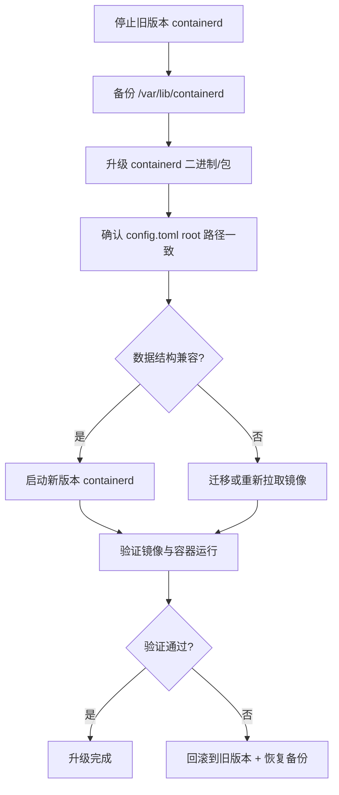
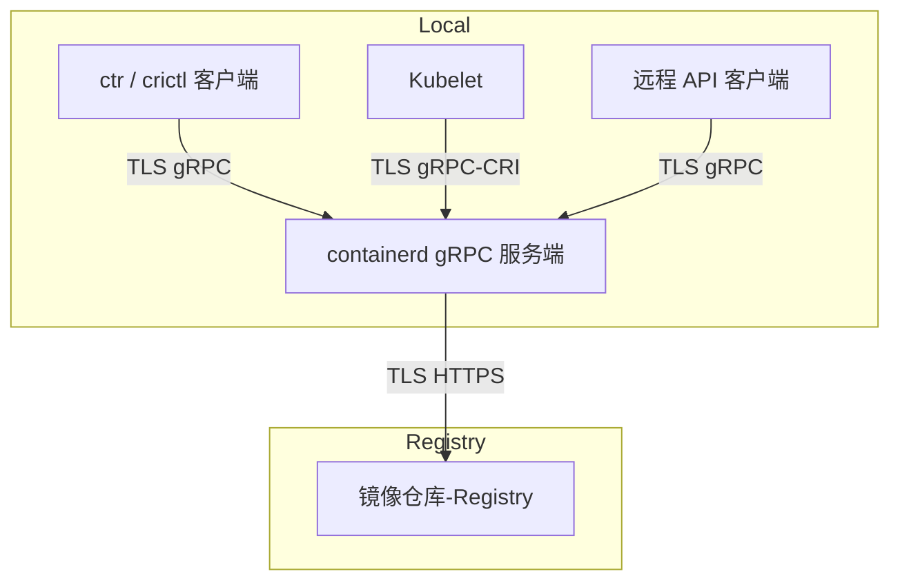

# containerd 升级的完备方案
下面给你一个 **containerd 升级的完备方案**，涵盖设计思路、风险控制、操作步骤和流程图，确保升级过程安全、可控、可回滚。  

## 📑 设计思路
1. **数据目录分层管理**  
   - **Root Dir**（默认 `/var/lib/containerd`）：持久化数据，必须保留。  
   - **State Dir**（默认 `/run/containerd`）：运行时状态，升级后自动清空。  
2. **版本兼容性**  
   - 小版本升级：数据结构兼容，可直接覆盖安装。  
   - 大版本升级：需确认 content store、snapshotter、BoltDB 格式兼容，否则必须迁移或重新拉取镜像。  
3. **配置一致性**  
   - `config.toml` 中的 `root` 和 `state` 路径必须保持一致。  
   - 如果路径变更，需迁移数据目录。  
4. **风险控制**  
   - 升级前必须停机并备份数据目录。  
   - 升级后验证镜像与快照可用性。  
   - 提供回滚方案：保留旧版本二进制和数据备份。  

## 📊 升级策略对照表

| 升级场景 | 数据目录处理 | 风险等级 | 推荐操作 |
|----------|--------------|----------|----------|
| 小版本升级（如 1.7.1 → 1.7.2） | 保留 `/var/lib/containerd`，清空 `/run/containerd` | 低 | 直接覆盖安装 |
| 大版本升级（如 1.6 → 1.7） | 保留并验证数据结构兼容性 | 中 | 先在测试环境验证，再迁移生产 |
| 路径变更或跨主机迁移 | 迁移 `/var/lib/containerd` 到新路径 | 中 | 停机备份 + 恢复 |
| 全新安装 | 删除旧目录，重新拉取镜像 | 高 | 仅在数据结构不兼容时使用 |

## ⚙️ 升级操作步骤
1. **停机与备份**  
   ```bash
   systemctl stop containerd
   tar -czf /backup/containerd-data-$(date +%F).tar.gz /var/lib/containerd
   ```
2. **升级二进制或包**  
   - 使用系统包管理器（apt/yum）或替换二进制。  
3. **确认配置文件**  
   - 确认 `config.toml` 中的 `root` 路径与旧版本一致。  
   - 如路径变更，迁移 `/var/lib/containerd`。  
4. **启动新版本**  
   ```bash
   systemctl start containerd
   ```
5. **验证运行**  
   - 检查镜像是否可用：`ctr images ls`  
   - 检查容器是否能正常启动：`ctr run` 或通过上层 CRI（如 kubelet）。  
6. **回滚方案**  
   - 如果升级失败，停止新版本，恢复旧二进制和 `/var/lib/containerd` 备份。  

## 📈 升级流程图（Mermaid）



## ✅ 总结
- **必须保留 `/var/lib/containerd`**，否则镜像和快照丢失。  
- **无需保留 `/run/containerd`**，升级后自动清空。  
- **小版本升级**：直接覆盖安装即可。  
- **大版本升级**：需验证数据结构兼容性，必要时迁移或重新拉取镜像。  
- **风险控制**：升级前备份，升级后验证，失败时回滚。  

# `config.toml`** 中，`root` 和 `state` 路径
在 **containerd 的配置文件 `config.toml`** 中，`root` 和 `state` 路径是两个非常关键的参数，用来指定数据存储和运行时状态的目录。它们的作用和区别如下：

## 📑 root 路径
- **默认值**：`/var/lib/containerd`
- **作用**：存放持久化数据，包括：
  - 镜像内容（content store：manifest、config、blob 压缩层）
  - 解压后的快照层（snapshotter）
  - 元数据库（BoltDB，记录镜像与快照索引）
- **特点**：必须保留，升级或迁移时不可随意删除，否则镜像和快照会丢失。

## 📑 state 路径
- **默认值**：`/run/containerd`
- **作用**：存放运行时的临时状态信息，包括：
  - 容器进程的 shim 通道
  - 容器运行时的 socket 文件
  - 临时运行状态
- **特点**：非持久化，重启或升级后会自动清空，不需要备份。

## 📊 配置文件示例

```toml
root = "/var/lib/containerd"
state = "/run/containerd"

[grpc]
  address = "/run/containerd/containerd.sock"
  uid = 0
  gid = 0

[plugins."io.containerd.snapshotter.v1.overlayfs"]
  root_path = "/var/lib/containerd/io.containerd.snapshotter.v1.overlayfs"
```

## ⚠️ 升级与迁移注意事项
- **root 路径**：升级时必须保持一致或迁移，否则新版本找不到旧镜像。  
- **state 路径**：升级后自动清空，无需迁移。  
- **跨主机迁移**：需要复制 `root` 路径内容到新主机，并保持配置一致。

# containerd 的 TLS SAN 配置
在 **containerd 的 TLS SAN 配置**中，主要涉及的是它作为 **gRPC 服务端**时与客户端的通信场景。SAN（Subject Alternative Name）字段确保客户端在 TLS 握手时能正确验证服务端证书。具体来说，它用于以下几类服务端通信：

## 📑 通信对象

1. **本地 gRPC 客户端**  
   - 例如：`ctr` 命令行工具、`crictl`、以及直接调用 containerd API 的客户端。  
   - 这些工具通过 gRPC socket（如 `/run/containerd/containerd.sock` 或 TCP 地址）连接到 containerd。  
   - SAN 必须包含客户端使用的域名或 IP，否则证书校验失败。

2. **Kubelet → containerd**  
   - 在 Kubernetes 集群中，kubelet 通过 CRI 插件与 containerd 通信。  
   - 如果启用了 TLS，kubelet 会校验 containerd 的服务端证书。  
   - SAN 需要覆盖 kubelet 连接时使用的地址（通常是本地 IP 或主机名）。

3. **远程 API 客户端**  
   - 在某些场景下，containerd 的 gRPC 服务可能通过 TCP 暴露给远程客户端。  
   - 例如：跨主机管理工具、监控系统或自定义控制器。  
   - SAN 必须包含这些远程访问的域名或 IP。

4. **镜像仓库通信（间接场景）**  
   - containerd 本身作为客户端去访问镜像仓库时，需要校验仓库的证书。  
   - 这部分 SAN 配置在 **registry 的 hosts.toml** 中，而不是 containerd 主配置。  
   - 用于确保 containerd 拉取镜像时能正确验证仓库服务端。

## ⚠️ 注意事项
- 如果客户端通过 **域名**连接，SAN 必须包含该域名。  
- 如果客户端通过 **IP**连接，SAN 必须包含该 IP。  
- 否则会报错：`x509: certificate is not valid for any names`。  
- 修改 SAN 后需重新生成证书，并重启 containerd。  

## ✅ 总结
- **TLS SAN 在 containerd 中主要用于 gRPC 服务端证书校验**。  
- 通信对象包括：本地工具（ctr/crictl）、Kubelet、远程 API 客户端。  
- 镜像仓库的 TLS 校验属于另一套配置（hosts.toml），不依赖 containerd 主配置的 SAN。  

# 通信链路图
展示 containerd 与 ctr/kubelet/远程客户端的 TLS 交互，以及与镜像仓库的 TLS 校验关系：


## 📑 图解说明
- **ctr / crictl 客户端**：通过 gRPC socket 或 TCP 与 containerd 通信，使用 TLS 校验 SAN。  
- **Kubelet**：在 Kubernetes 集群中通过 CRI 与 containerd 通信，TLS 校验 SAN。  
- **远程 API 客户端**：如果 containerd 暴露 TCP 接口，远程客户端也会通过 TLS 校验 SAN。  
- **Registry 镜像仓库**：containerd 作为客户端访问镜像仓库时，使用 `hosts.toml` 配置进行 TLS 校验（CA、客户端证书），这里的 SAN 校验属于仓库证书，而不是 containerd 主配置。  

## ✅ 总结
- **TLS SAN 在 containerd 主配置中主要用于 gRPC 服务端通信**（ctr、crictl、kubelet、远程客户端）。  
- **镜像仓库的 TLS 校验**通过 `hosts.toml` 完成，属于另一套机制。  
- 两者结合，保证 containerd 在本地 API 通信和远程镜像拉取时都能安全运行。  

## ✅ 总结
- **root**：持久化数据目录，必须保留或迁移。  
- **state**：运行时状态目录，升级后自动清空。  
- **最佳实践**：升级时确认 `config.toml` 中的 `root` 路径与旧版本一致，避免镜像丢失。  
