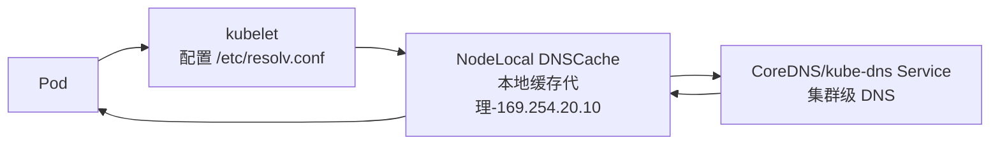

# 升级 kubelet 与 NodeLocal DNSCache（nodelocaldns）的关系
**升级 kubelet 与 NodeLocal DNSCache（nodelocaldns）的关系在于：kubelet 负责为 Pod 配置 DNS，而 NodeLocal DNSCache 是在每个节点上运行的本地 DNS 缓存代理。两者结合后，Pod 的 DNS 查询会优先走节点本地缓存，从而减少延迟和 conntrack 负载，提高稳定性。**  

## 📑 关系说明
- **kubelet 的角色**  
  - 在 Pod 启动时，kubelet 会生成 Pod 的 `/etc/resolv.conf` 文件。  
  - 默认情况下，Pod 的 DNS 指向集群的 kube-dns/CoreDNS Service IP。  

- **NodeLocal DNSCache 的角色**  
  - 以 DaemonSet 部署在每个节点上，监听一个本地 IP（通常是 `169.254.20.10`）。  
  - Pod 的 DNS 查询会直接发到本地缓存代理，而不是跨节点访问 kube-dns Service。  
  - 本地代理在缓存未命中时再去查询 kube-dns/CoreDNS。  

- **两者的结合点**  
  - kubelet 的 `--cluster-dns` 参数需要指向 NodeLocal DNSCache 的本地监听 IP。  
  - 当 NodeLocal DNSCache 部署后，kubelet 会为 Pod 配置 `/etc/resolv.conf`，让 Pod 的 DNS 查询走本地缓存。  
  - 如果 kube-proxy 使用 IPVS 模式，则必须显式修改 kubelet 的 `--cluster-dns` 参数；否则 NodeLocal DNSCache 会同时监听 kube-dns Service IP 和本地 IP，无需额外修改。  [Kubernetes](https://kubernetes.io/docs/tasks/administer-cluster/nodelocaldns/)  [Stack Overflow](https://stackoverflow.com/questions/71920188/how-to-enable-node-local-dns-cache-on-eks)  

## 📊 优势
| 优势 | 说明 |
|------|------|
| **降低延迟** | Pod DNS 查询直接走本地代理，避免跨节点访问。 |
| **减少 conntrack 压力** | 跳过 iptables DNAT 和 UDP conntrack，降低表溢出风险。 |
| **提高稳定性** | DNS 查询可升级为 TCP，减少 UDP 丢包导致的超时。 |
| **增强可观测性** | 在节点级别收集 DNS 请求指标，便于排查问题。 |
## DNS 查询路径图
直观展示 Pod → kubelet → NodeLocal DNSCache → CoreDNS 的交互流程：  

📑 图解说明
- **Pod**：在启动时，kubelet 为其生成 `/etc/resolv.conf`，DNS 指向 NodeLocal DNSCache 的本地 IP。  
- **kubelet**：负责为 Pod 注入 DNS 配置，确保查询走本地代理。  
- **NodeLocal DNSCache**：运行在每个节点上，先尝试缓存命中；未命中时转发到 CoreDNS。  
- **CoreDNS/kube-dns**：集群级 DNS 服务，负责最终解析域名。  
- **返回路径**：CoreDNS 返回结果 → NodeLocal DNSCache 缓存 → Pod。  

这样你就能直观理解：**Pod 的 DNS 查询先走 kubelet 配置的本地代理，再由 NodeLocal DNSCache 缓存或转发到 CoreDNS，最后返回结果给 Pod**。  

## ⚠️ 注意事项
- 部署 NodeLocal DNSCache 后，必须确保 kubelet 的 `--cluster-dns` 参数正确指向本地缓存 IP，否则 Pod 仍会走 kube-dns Service。  
- 如果节点上 containerd/kubelet 重启，NodeLocal DNSCache Pod 也会短暂不可用，Pod 的 DNS 查询可能回退到 kube-dns Service。  
- 建议在大规模集群或高 QPS DNS 查询场景启用，以避免 DNS 成为瓶颈。  

✅ 总结：**kubelet 决定 Pod 的 DNS 配置，NodeLocal DNSCache 提供本地缓存代理。两者结合后，Pod 的 DNS 查询路径由 kubelet 指向本地代理，从而提升性能和稳定性。**  

# KubeletConfiguration中与nodelocaldns相关的参数
**在 kubeadm 的 `KubeletConfiguration` 中，与 NodeLocal DNSCache 相关的参数主要是 `clusterDNS` 和 `clusterDomain`。通过配置这两个参数，kubelet 会为 Pod 的 `/etc/resolv.conf` 注入正确的 DNS 地址（例如 NodeLocal DNSCache 的本地监听 IP），从而让 Pod 的 DNS 查询优先走本地缓存代理。**

## 📑 关键参数
- **`clusterDNS`**  
  - 类型：数组（IP 地址列表）  
  - 作用：指定 kubelet 为 Pod 配置的 DNS 服务器地址。  
  - 当启用 NodeLocal DNSCache 时，这里应设置为 NodeLocal DNSCache 的本地监听 IP（常见为 `169.254.20.10`）。  
  - 示例：  
    ```yaml
    clusterDNS:
      - 169.254.20.10
    ```

- **`clusterDomain`**  
  - 类型：字符串  
  - 作用：指定集群内的 DNS 域名后缀，默认是 `cluster.local`。  
  - NodeLocal DNSCache 会缓存并解析带有该后缀的域名。  
  - 示例：  
    ```yaml
    clusterDomain: cluster.local
    ```

## ⚙️ 配置示例
在 `/var/lib/kubelet/config.yaml` 中：
```yaml
apiVersion: kubelet.config.k8s.io/v1beta1
kind: KubeletConfiguration

clusterDNS:
  - 169.254.20.10
clusterDomain: cluster.local
```

## 📊 使用场景
- **启用 NodeLocal DNSCache**：  
  - kubelet 配置 Pod 的 DNS 指向本地缓存代理 IP。  
  - Pod 的 DNS 查询 → NodeLocal DNSCache → CoreDNS → 外部 DNS。  
- **未启用 NodeLocal DNSCache**：  
  - kubelet 配置 Pod 的 DNS 指向 kube-dns/CoreDNS Service IP。  

## ⚠️ 注意事项
- 必须保证 NodeLocal DNSCache DaemonSet 已部署，并且监听的 IP 地址与 `clusterDNS` 参数一致。  
- 如果 kube-proxy 使用 IPVS 模式，需显式修改 kubelet 的 `clusterDNS` 参数；否则 NodeLocal DNSCache 会同时监听 Service IP 和本地 IP。  
- 错误配置可能导致 Pod DNS 查询失败，表现为服务无法解析域名。  

✅ 总结：在 kubeadm 的 `KubeletConfiguration` 中，**与 NodeLocal DNSCache 相关的核心参数是 `clusterDNS`（指定本地缓存代理 IP）和 `clusterDomain`（指定集群域名后缀）**。正确配置这两个参数，才能让 Pod 的 DNS 查询走 NodeLocal DNSCache，从而提升性能和稳定性。  

# KubeletConfiguration中nodelocaldns相关参数与kube-proxy的关系
在 kubeadm 的 `KubeletConfiguration` 中，**与 NodeLocal DNSCache 相关的参数主要是 `clusterDNS` 和 `clusterDomain`**。它们决定了 Pod 的 `/etc/resolv.conf` 配置，从而影响 Pod 的 DNS 查询路径。而这与 **kube-proxy 的工作模式**（iptables 或 IPVS）有直接关系。  

## 📑 参数与关系
- **`clusterDNS`**  
  - kubelet 为 Pod 配置的 DNS 服务器地址。  
  - 当启用 NodeLocal DNSCache 时，通常设置为本地监听 IP（如 `169.254.20.10`）。  
  - kube-proxy 的模式决定是否需要显式修改：  
    - **iptables 模式**：NodeLocal DNSCache 可以同时监听 Service ClusterIP 和本地 IP，Pod 默认仍能解析，无需修改。  
    - **IPVS 模式**：由于 IPVS 会强制转发到 kube-dns Service IP，必须显式将 kubelet 的 `clusterDNS` 改为 NodeLocal DNSCache 的本地 IP，否则 Pod DNS 查询不会走本地缓存。  

- **`clusterDomain`**  
  - 指定集群内的 DNS 域名后缀（默认 `cluster.local`）。  
  - NodeLocal DNSCache 会缓存并解析带有该后缀的域名。  

## ⚙️ 工作流程
1. kubelet 在 Pod 启动时写入 `/etc/resolv.conf`，DNS 指向 `clusterDNS` 参数。  
2. Pod 发起 DNS 查询 → NodeLocal DNSCache（本地代理）。  
3. NodeLocal DNSCache 命中缓存或转发到 CoreDNS/kube-dns。  
4. kube-proxy 决定 Service IP 的转发方式：  
   - iptables：直接 DNAT 到 CoreDNS Pod。  
   - IPVS：通过虚拟服务转发。  
## 对比结构图
展示在 **iptables 模式** 和 **IPVS 模式** 下，Pod DNS 查询路径与 `clusterDNS` 配置的差异：  

```mermaid
flowchart TB
    subgraph iptables模式
        P1[Pod] --> K1[kubelet<br/>clusterDNS 默认指向 Service IP]
        K1 --> N1[NodeLocal DNSCache<br/>监听 Service IP + 本地 IP]
        N1 --> C1[CoreDNS Service]
        C1 --> N1
        N1 --> P1
    end

    subgraph IPVS模式
        P2[Pod] --> K2[kubelet<br/>clusterDNS 必须显式配置为本地 IP]
        K2 --> N2[NodeLocal DNSCache<br/>仅监听本地 IP (如 169.254.20.10)]
        N2 --> C2[CoreDNS Service]
        C2 --> N2
        N2 --> P2
    end
```
 📑 图解说明
- **iptables 模式**  
  - NodeLocal DNSCache 可以同时监听 **CoreDNS Service IP** 和 **本地 IP**。  
  - 即使 kubelet 默认配置 `clusterDNS` 为 Service IP，Pod DNS 查询也能被 NodeLocal DNSCache 拦截并缓存。  

- **IPVS 模式**  
  - IPVS 会强制转发到 Service IP，因此 NodeLocal DNSCache无法透明拦截。  
  - 必须在 kubelet 的 `KubeletConfiguration` 中显式配置 `clusterDNS` 为 NodeLocal DNSCache 的本地 IP（如 `169.254.20.10`）。  
  - 否则 Pod 的 DNS 查询不会走本地缓存代理。  

✅ 总结：**iptables 模式下 NodeLocal DNSCache 可兼容默认配置，而 IPVS 模式下必须显式修改 kubelet 的 `clusterDNS` 参数为本地 IP，才能让 Pod DNS 查询走 NodeLocal DNSCache。**  
## 📊 总结
- **kubelet 的 `clusterDNS` 参数** 决定 Pod DNS 查询是否走 NodeLocal DNSCache。  
- **kube-proxy 的模式** 决定是否需要显式修改该参数：  
  - iptables 模式 → 默认可兼容。  
  - IPVS 模式 → 必须显式配置为 NodeLocal DNSCache 的本地 IP。  
- **两者关系**：kubelet 配置 Pod 的 DNS 指向，kube-proxy 决定 Service IP 的转发方式，NodeLocal DNSCache 在其中充当本地缓存代理。  


