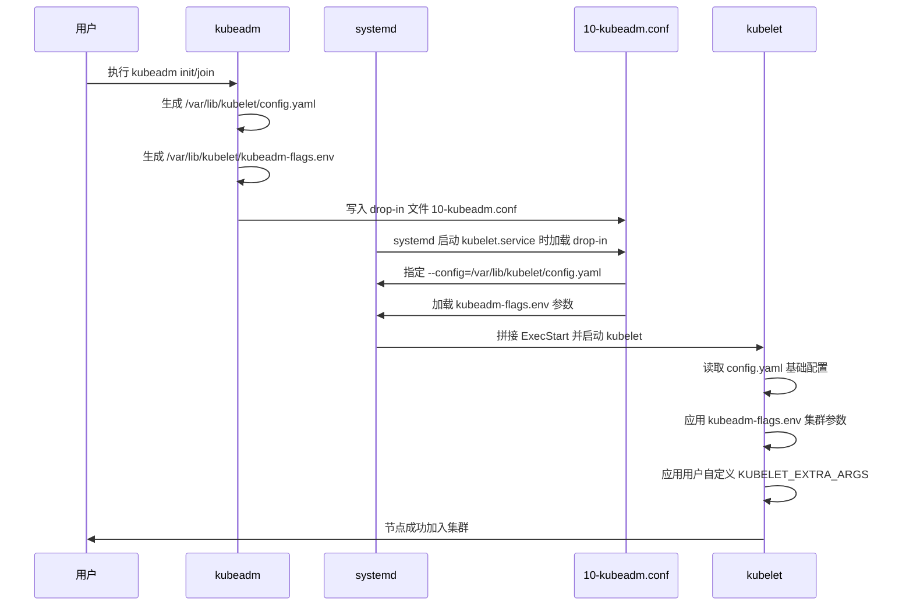
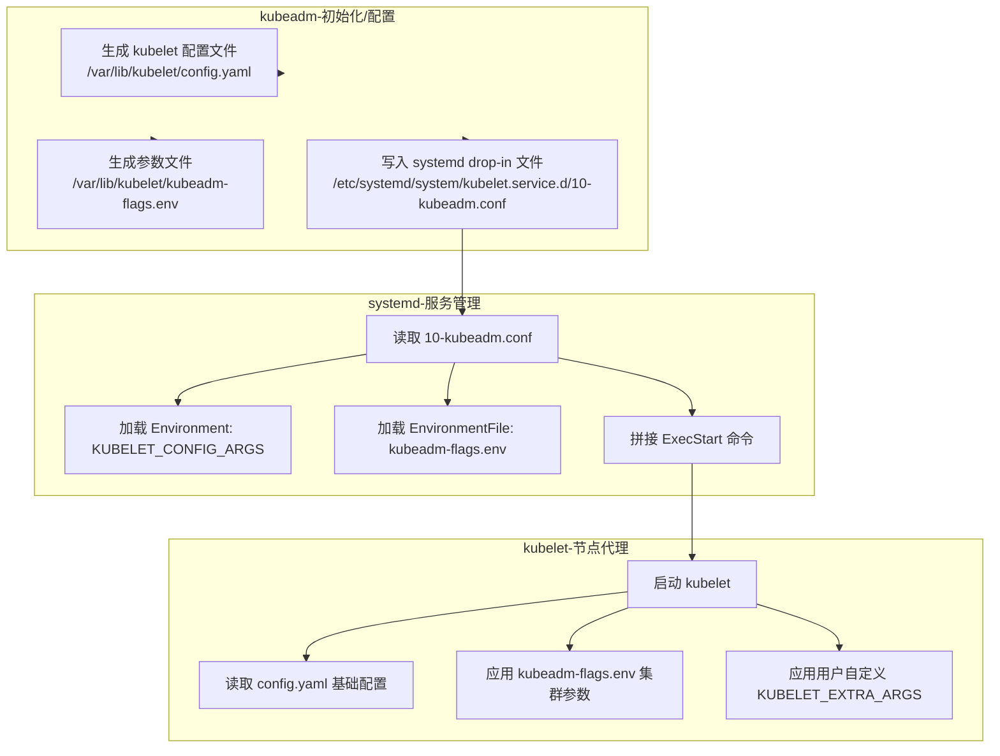
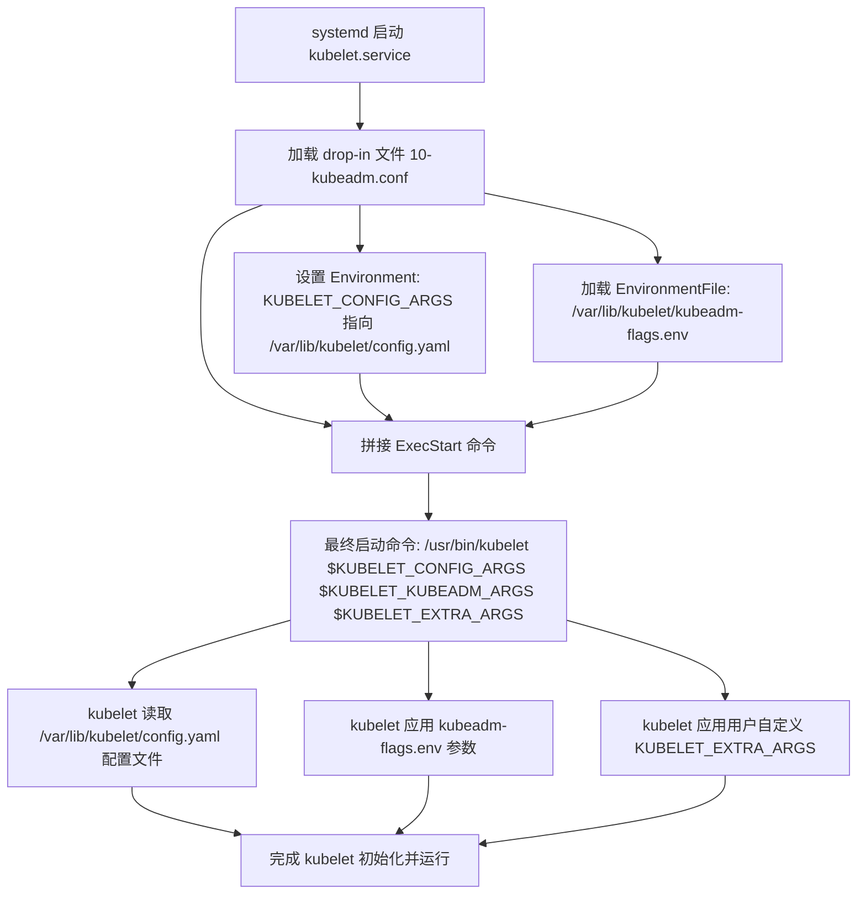
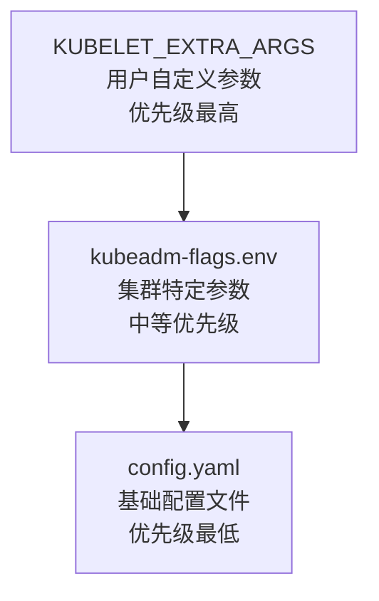

# 升级kubelet会中断业务吗？
升级 **kubelet** 是否会中断业务，取决于你如何操作。核心点在于：**kubelet 重启时，节点上的 Pod 会受到影响**。  

## 📑 影响机制
- **kubelet 是节点代理**：负责管理 Pod 的生命周期、与 API Server 通信、资源监控。  
- **升级过程需要重启 kubelet**：当你更新 kubelet 包并执行 `systemctl restart kubelet` 时，节点上的 kubelet 会短暂不可用。  
- **Pod 状态**：  
  - kubelet 重启时，节点上的 Pod 不会立刻被删除，但调度和健康检查会中断。  
  - 如果重启时间过长，API Server 可能认为节点 NotReady，从而触发 Pod 驱逐或重新调度。  
- **业务影响**：  
  - 对无状态应用（如 Web 服务），影响较小，Pod 可在其他节点继续运行。  
  - 对有状态应用（如数据库），如果没有副本或持久卷，可能会导致业务中断。  

## ⚙️ 如何避免业务中断
1. **提前 drain 节点**  
   ```bash
   kubectl drain <node> --ignore-daemonsets --delete-emptydir-data
   ```
   - 把 Pod 调度到其他节点，确保业务不中断。  

2. **逐节点升级**  
   - 一次只升级一个节点，避免集群整体不可用。  

3. **升级完成后恢复调度**  
   ```bash
   kubectl uncordon <node>
   ```
   - 让节点重新参与调度。  

4. **验证节点状态**  
   ```bash
   kubectl get nodes
   ```
   - 确认节点恢复为 Ready。  

## ✅ 总结
- **直接重启 kubelet**：可能导致节点短暂 NotReady，Pod 被驱逐或业务中断。  
- **正确操作（drain → 升级 → uncordon）**：可以避免业务中断，保证平滑升级。  
- **最佳实践**：逐节点升级，提前 drain，确保关键应用有副本或高可用架构。  

# kubelet升级方案
**kubelet 的升级方案通常与 kubeadm 集群升级绑定：先升级控制平面，再升级工作节点，每次升级 kubelet 前必须 drain 节点，升级完成后再 uncordon 恢复调度。升级时要确保 kubelet 与 kubeadm 版本匹配或在允许的版本偏差范围内。**  [Kubernetes](https://kubernetes.io/docs/tasks/administer-cluster/kubeadm/kubeadm-upgrade/)  [GoLinuxCloud](https://www.golinuxcloud.com/kubernetes-upgrade-version/)  [kifarunix.com](https://kifarunix.com/safely-upgrade-kubeadm-kubernetes-cluster-a-step-by-step-guide/)  

## 📑 升级流程概览
1. **准备工作**  
   - 阅读目标版本的 **Kubernetes Release Notes**，确认兼容性。  
   - **备份 etcd** 和关键应用数据。  
   - 确认 **swap 已禁用**。  
   - 确认升级路径：只能逐个 minor 版本升级，不能跳过。  

2. **控制平面节点升级**  
   - 更新 kubeadm 包：`apt-get install -y kubeadm=<version>`  
   - 执行 `kubeadm upgrade plan` 查看可升级版本。  
   - 执行 `kubeadm upgrade apply <version>` 升级控制平面。  
   - 更新 kubelet 和 kubectl：`apt-get install -y kubelet=<version> kubectl=<version>`  
   - 重启 kubelet：`systemctl restart kubelet`  
   - 验证：`systemctl status kubelet` 或 `journalctl -xeu kubelet`。  

3. **工作节点升级**  
   - 对每个工作节点依次执行：  
     - `kubectl drain <node> --ignore-daemonsets --delete-emptydir-data`  
     - 更新 kubeadm、kubelet、kubectl 包。  
     - 重启 kubelet。  
     - `kubectl uncordon <node>` 恢复调度。  

## 📊 升级优先级与注意事项
| 步骤 | 说明 | 风险点 |
|------|------|--------|
| 控制平面优先 | 先升级主控节点，再升级其他控制平面和工作节点 | 升级时 API Server/etcd 短暂不可用 |
| 节点逐个升级 | 每次只升级一个节点，避免集群大面积不可用 | 并行升级可能导致调度失败 |
| 版本匹配 | kubelet 与 kubeadm 建议保持一致，最多允许 kubelet 落后 3 个版本 | 版本偏差过大可能导致 kubelet 无法正常注册 |
| 容器重启 | 升级 kubelet 后所有容器会重启 | 需提前通知业务方，避免影响关键应用 |

## ✅ 总结
- **升级顺序**：控制平面 → 其他控制平面 → 工作节点。  
- **关键动作**：每次升级 kubelet 前必须 drain 节点，升级后再 uncordon。  
- **版本策略**：逐个 minor 升级，保持 kubelet 与 kubeadm 版本匹配。  
- **风险控制**：提前备份 etcd，确认 swap 禁用，逐节点升级避免大规模中断。  

# kubelet 升级操作清单表格
下面给你一个 **kubelet 升级操作清单表格**，逐步命令行步骤，确保不遗漏关键动作。这个流程适用于使用 **kubeadm 管理的集群**，并且 kubelet 是通过系统包管理器安装的场景。  

## 📊 kubelet 升级操作清单

| 步骤 | 命令 | 说明 |
|------|------|------|
| 1. 查看当前版本 | `kubectl get nodes` | 确认节点状态和版本。 |
| 2. 备份 etcd（控制平面节点） | `ETCDCTL_API=3 etcdctl snapshot save backup.db` | 升级前备份 etcd 数据。 |
| 3. 升级 kubeadm 包 | `apt-get install -y kubeadm=<version>` 或 `yum install -y kubeadm-<version>` | 先升级 kubeadm，保证集群升级流程一致。 |
| 4. 规划升级 | `kubeadm upgrade plan` | 查看可升级版本和兼容性。 |
| 5. 应用升级（控制平面） | `kubeadm upgrade apply <version>` | 升级 API Server、控制器、调度器等。 |
| 6. 升级 kubelet/kubectl 包 | `apt-get install -y kubelet=<version> kubectl=<version>` | 在控制平面和工作节点分别执行。 |
| 7. 重启 kubelet | `systemctl daemon-reload && systemctl restart kubelet` | 让新版本 kubelet 生效。 |
| 8. 升级工作节点（逐个） | `kubectl drain <node> --ignore-daemonsets --delete-emptydir-data` | 先排空节点，避免业务中断。 |
| 9. 更新工作节点 kubeadm/kubelet/kubectl | 同第 6 步 | 在每个工作节点执行。 |
| 10. 重启工作节点 kubelet | 同第 7 步 | 让新版本 kubelet 生效。 |
| 11. 恢复节点调度 | `kubectl uncordon <node>` | 升级完成后恢复节点。 |
| 12. 验证升级结果 | `kubectl get nodes -o wide` | 确认所有节点 kubelet 版本一致，状态为 Ready。 |

## ⚠️ 注意事项
- **顺序**：必须先升级控制平面，再逐个升级工作节点。  
- **版本策略**：kubelet 版本最多可以落后 kubeadm 3 个 minor 版本，但建议保持一致。  
- **风险控制**：逐节点升级，避免大规模中断；升级前必须 drain 节点。  
- **验证**：升级后检查 kubelet 日志：`journalctl -xeu kubelet`。  

这样你就有一个 **逐步可执行的操作清单**，可以直接跟着执行 kubelet 升级。  

# 升级kubelet为什么备份etcd数据？
这是一个很好的问题。严格来说，**升级 kubelet 本身并不会直接修改 etcd 数据**，因为 kubelet 是节点代理，主要负责 Pod 生命周期管理、与 API Server 通信、资源监控等，它不直接写入 etcd。  

但在实际的 **集群升级流程**（尤其是通过 kubeadm 升级控制平面和节点时），通常会建议在升级前备份 etcd，原因有以下几点：  

## 📑 为什么要备份 etcd
1. **集群状态核心存储**  
   - etcd 保存了整个 Kubernetes 集群的状态：Pod、Service、ConfigMap、Secret、Deployment、节点信息等。  
   - 如果升级过程中出现严重错误（例如 API Server 无法启动、证书配置错误），恢复 etcd 快照是唯一能快速还原集群的办法。  

2. **控制平面升级风险**  
   - 升级 kubeadm → 升级 API Server → 升级 kubelet。  
   - 在控制平面升级过程中，API Server 与 etcd 的交互可能受影响。备份 etcd 是为了防止控制平面升级失败导致数据丢失。  

3. **一致性保障**  
   - 即使只是升级 kubelet，也可能需要调整 kubelet 与 API Server 的通信协议或认证方式。  
   - 如果升级过程中 kubelet 无法正常注册节点，恢复 etcd 可以保证集群状态一致。  

4. **最佳实践**  
   - Kubernetes 官方文档在升级指南中明确建议：**在任何集群升级前都要备份 etcd**。  
   - 这是一个通用的安全措施，而不是 kubelet 特有的需求。  

## ⚙️ 总结
- **升级 kubelet 本身不直接影响 etcd**。  
- **备份 etcd 是为了整个集群的安全**，防止控制平面升级或 kubelet 与 API Server 交互异常时丢失集群状态。  
- **最佳实践**：在任何升级（尤其是涉及 kubeadm 和控制平面）前，都要备份 etcd。  

换句话说，**备份 etcd 是为了防范升级失败的最坏情况，而不是因为 kubelet 升级会修改 etcd**。  

# var/lib/kubelet/config.yaml文件
`/var/lib/kubelet/config.yaml` 是 **kubeadm 在节点初始化或加入集群时自动生成的 kubelet 配置文件**。它的生成和使用过程可以分为两个阶段：
## 📑 生成时机
1. **kubeadm init**  
   - 在控制平面节点执行 `kubeadm init` 时，kubeadm 会为本机的 kubelet生成配置文件。  
   - 这个文件包含了 kubelet 的基础参数（如运行时、认证方式、资源预留等），保证 kubelet 能正确启动并与 API Server 通信。  

2. **kubeadm join**  
   - 在工作节点执行 `kubeadm join` 时，kubeadm 同样会生成该文件。  
   - 文件内容会根据集群信息（API Server 地址、证书路径等）自动填充。  

3. **版本匹配**  
   - 文件的 `apiVersion` 与 kubelet版本绑定，例如常见的是 `kubelet.config.k8s.io/v1beta1`。  
   - kubeadm 会根据当前 Kubernetes 版本选择合适的配置结构。  

## ⚙️ 使用方式
- **systemd drop-in 文件**：  
  在 `/etc/systemd/system/kubelet.service.d/10-kubeadm.conf` 中，kubeadm写入了：
  ```ini
  Environment="KUBELET_CONFIG_ARGS=--config=/var/lib/kubelet/config.yaml"
  ```
  这告诉 systemd 在启动 kubelet 时加载该配置文件。

- **启动流程**：  
  1. systemd 启动 kubelet →  
  2. 读取 `10-kubeadm.conf` →  
  3. 拼接启动命令，包含 `--config=/var/lib/kubelet/config.yaml` →  
  4. kubelet 解析 `config.yaml`，应用其中的参数。  

- **覆盖关系**：  
  - `config.yaml` 提供基础配置。  
  - `kubeadm-flags.env` 提供集群特定参数（如 API Server 地址）。  
  - 用户可通过 `KUBELET_EXTRA_ARGS` 覆盖前两者。  
## 时序图
展示从 `kubeadm init/join` 到 kubelet 启动时，`config.yaml` 的生成和加载全过程：  


 📑 图解说明
- **生成阶段**：在执行 `kubeadm init/join` 时，kubeadm 会生成 `config.yaml` 和 `kubeadm-flags.env`，并写入 `10-kubeadm.conf`。  
- **加载阶段**：systemd 启动 kubelet 时，读取 `10-kubeadm.conf`，拼接启动命令，指定 `--config` 和加载参数文件。  
- **运行阶段**：kubelet 启动后，依次应用 `config.yaml`（基础配置）、`kubeadm-flags.env`（集群参数）、`KUBELET_EXTRA_ARGS`（用户覆盖），最终完成节点注册。  

这样你就能清晰看到整个链路：**kubeadm 生成 → systemd drop-in 引用 → kubelet 启动加载 → 节点加入集群**。

## 📊 总结
- **生成时机**：在执行 `kubeadm init` 或 `kubeadm join` 时自动生成。  
- **作用**：集中定义 kubelet 的运行参数，保证节点能正确加入集群。  
- **使用方式**：通过 systemd drop-in 文件 `10-kubeadm.conf` 引用，成为 kubelet 启动时的核心配置来源。  
- **优先级**：它是 kubelet 的基础配置，后续参数文件和用户自定义参数可以覆盖其中的字段。  

# kubeadm与kubelet的关系
你抓到一个关键点：**kubeadm 并不负责安装 kubelet**，但它和 kubelet之间存在紧密的配置关系，而 `10-kubeadm.conf` 就是两者之间的“桥梁”。  

## 📑 kubeadm 与 kubelet的关系
- **安装层面**：  
  - kubeadm 不会去安装 kubelet 二进制，它假设你已经通过包管理器或手动安装了 kubelet。  
  - 所以 kubeadm 的职责是“配置和初始化”，而不是“安装”。  

- **配置层面**：  
  - kubeadm 在初始化或加入节点时，会生成 kubelet 的配置文件（如 `/var/lib/kubelet/config.yaml`）和参数文件（如 `/var/lib/kubelet/kubeadm-flags.env`）。  
  - 然后它通过 systemd 的 drop-in 文件 `/etc/systemd/system/kubelet.service.d/10-kubeadm.conf` 来告诉 systemd：启动 kubelet 时要加载这些配置。  

## ⚙️ 10-kubeadm.conf 的作用
典型内容如下：
```ini
[Service]
Environment="KUBELET_CONFIG_ARGS=--config=/var/lib/kubelet/config.yaml"
EnvironmentFile=-/var/lib/kubelet/kubeadm-flags.env
ExecStart=
ExecStart=/usr/bin/kubelet $KUBELET_CONFIG_ARGS $KUBELET_KUBEADM_ARGS $KUBELET_EXTRA_ARGS
```
- **KUBELET_CONFIG_ARGS**：指向 kubeadm 生成的 kubelet 配置文件。  
- **EnvironmentFile**：加载 kubeadm 生成的参数文件（包含集群信息，如 API Server 地址、证书路径）。  
- **ExecStart**：重新定义启动命令，把 kubeadm 的参数和用户自定义参数拼接进去。  

## 📊 关系总结
- kubelet：运行时核心组件，必须独立安装。  
- kubeadm：负责生成 kubelet 的配置文件和参数，并通过 `10-kubeadm.conf` 把这些配置注入到 systemd 的启动流程。  
- `10-kubeadm.conf`：是 kubeadm 与 kubelet的接口文件，保证 kubelet 启动时加载正确的集群配置。 
 
## 关系图
直观展示 kubeadm、kubelet、`10-kubeadm.conf`、`config.yaml`、`kubeadm-flags.env` 之间的交互链路：  



 📑 图解说明
- **kubeadm**：不安装 kubelet，但负责生成配置文件、参数文件和 systemd drop-in 文件。  
- **10-kubeadm.conf**：是 kubeadm 与 kubelet的接口文件，systemd 启动时加载它来拼接最终的启动命令。  
- **config.yaml**：集中式 kubelet 配置文件，定义运行时、认证、资源等基础参数。  
- **kubeadm-flags.env**：由 kubeadm 初始化生成，包含集群特定参数（如 API Server 地址、证书路径）。  
- **KUBELET_EXTRA_ARGS**：用户自定义参数，优先级最高。  
- **最终效果**：systemd 启动 kubelet 时，依次加载这些配置，拼接成完整的启动命令。  

这样你就能直观理解：**kubeadm 负责生成配置 → systemd drop-in 文件桥接 → kubelet 启动时加载并应用**。  

## ✅ 结论
- kubeadm **不安装 kubelet**，但它负责 **配置 kubelet**。  
- `10-kubeadm.conf` 是 kubeadm 写入的 systemd drop-in 文件，用来把 kubeadm生成的配置和参数传递给 kubelet。  
- 这就是 kubeadm 与 kubelet的关系：**安装分离，配置耦合**。  

# *drop-in 文件
在 systemd 体系里，**drop-in 文件**是一种扩展机制，用来在不直接修改主单元文件的情况下，追加或覆盖服务的配置。它们通常位于：

```
/etc/systemd/system/<service>.service.d/*.conf
```

## 📑 原理说明
- **主单元文件**：例如 `/etc/systemd/system/kubelet.service`，定义了 kubelet 的基础启动方式。  
- **drop-in 文件**：位于 `kubelet.service.d` 目录下，名字如 `10-kubeadm.conf`。  
  - 通过 `[Service]` 段落追加或覆盖环境变量、启动命令。  
  - systemd 在启动服务时会先加载主单元文件，再依次加载 drop-in 文件。  
- **优点**：  
  - 不需要直接修改主单元文件，避免升级或包管理器覆盖。  
  - 可以分层管理配置，灵活调整。  

## ⚙️ kubelet 的 drop-in 文件示例
`/etc/systemd/system/kubelet.service.d/10-kubeadm.conf`：
```ini
[Service]
Environment="KUBELET_CONFIG_ARGS=--config=/var/lib/kubelet/config.yaml"
EnvironmentFile=-/var/lib/kubelet/kubeadm-flags.env
ExecStart=
ExecStart=/usr/bin/kubelet $KUBELET_CONFIG_ARGS $KUBELET_KUBEADM_ARGS $KUBELET_EXTRA_ARGS
```

- **Environment**：定义 kubelet 使用的配置文件路径。  
- **EnvironmentFile**：加载 kubeadm 生成的参数文件。  
- **ExecStart 覆盖**：清空原有的启动命令，再重新定义，拼接所有参数。  

## 📊 设计思路
- **分层管理**：主单元文件保持简洁，具体参数通过 drop-in 文件管理。  
- **kubeadm 与 kubelet关系**：  
  - kubeadm 不安装 kubelet，但生成配置文件和参数。  
  - drop-in 文件是 kubeadm 与 kubelet的桥梁，保证 kubelet启动时加载正确的集群配置。  
- **用户扩展**：用户可以通过 `KUBELET_EXTRA_ARGS` 添加自定义参数，而无需改动主单元。  

## ✅ 总结
- **systemd drop-in 文件**是对服务配置的追加/覆盖机制。  
- 在 kubelet 中，`10-kubeadm.conf` 是 kubeadm 写入的 drop-in 文件，用来把 kubeadm生成的配置和参数传递给 kubelet。  
- 这种设计保证了：安装分离、配置耦合、升级安全。  


# /etc/systemd/system/kubelet.service.d/10-kubeadm.conf
`/etc/systemd/system/kubelet.service.d/10-kubeadm.conf` 是 **kubeadm 在安装 kubelet 时生成的 systemd drop-in 配置文件**。它的作用是为 kubelet 的 systemd 服务单元追加或覆盖一些环境变量和启动参数，从而让 kubelet能够正确加载配置文件并与集群交互。  

## 📑 文件作用
- **路径说明**：  
  - kubelet 的主服务单元文件通常位于 `/etc/systemd/system/kubelet.service`。  
  - `10-kubeadm.conf` 是一个 *drop-in* 文件，位于 `kubelet.service.d` 目录下，用来追加配置。  

- **主要内容**：  
  典型的 `10-kubeadm.conf` 文件内容如下：
  ```ini
  [Service]
  Environment="KUBELET_CONFIG_ARGS=--config=/var/lib/kubelet/config.yaml"
  EnvironmentFile=-/var/lib/kubelet/kubeadm-flags.env
  ExecStart=
  ExecStart=/usr/bin/kubelet $KUBELET_CONFIG_ARGS $KUBELET_KUBEADM_ARGS $KUBELET_EXTRA_ARGS
  ```

## ⚙️ 配置原理
1. **Environment**  
   - `KUBELET_CONFIG_ARGS`：指定 kubelet 使用的配置文件路径（通常是 `/var/lib/kubelet/config.yaml`）。  
   - `EnvironmentFile`：加载额外的参数文件（如 `/var/lib/kubelet/kubeadm-flags.env`），由 kubeadm 初始化时生成。  

2. **ExecStart 覆盖**  
   - 先清空原有的 `ExecStart` 行，再重新定义。  
   - 最终启动命令会拼接配置文件参数、kubeadm 生成的参数和用户自定义参数。  

3. **灵活性**  
   - 用户可以通过修改 `kubeadm-flags.env` 或添加 `KUBELET_EXTRA_ARGS` 来调整 kubelet 的启动参数，而无需直接改动主单元文件。  

## 📊 设计思路
- **分层管理**：主单元文件保持简洁，具体参数通过 drop-in 文件和环境变量管理。  
- **可维护性**：升级 kubelet 或 kubeadm 时，只需更新 drop-in 文件，不影响主单元。  
- **一致性**：所有节点的 kubelet 配置路径和参数由 kubeadm 自动生成，保证集群一致性。  

## ✅ 总结
- `/etc/systemd/system/kubelet.service.d/10-kubeadm.conf` 是 kubeadm 为 kubelet生成的 systemd drop-in 配置文件。  
- 它的核心作用是指定 kubelet 的配置文件路径，并加载 kubeadm 生成的参数。  
- 通过这种方式，kubelet 的启动参数实现了集中管理、易于维护和升级。
- 

# 配置加载流程图
直观展示 kubelet 启动时如何依次加载 `config.yaml`、`kubeadm-flags.env` 和 `10-kubeadm.conf`，并最终拼接成启动参数：



## 📑 图解说明
- **10-kubeadm.conf**：systemd drop-in 文件，负责定义 kubelet 的启动参数拼接逻辑。  
- **config.yaml**：集中式 kubelet 配置文件，定义运行时、认证、资源等核心参数。  
- **kubeadm-flags.env**：由 kubeadm 初始化生成，包含集群特定参数（如 API Server 地址、证书路径）。  
- **KUBELET_EXTRA_ARGS**：用户可选的额外参数，用于定制化。  
- **最终效果**：kubelet 启动时会依次加载这三类配置，拼接成完整的启动命令，保证灵活性和可维护性。  

这样你就能清晰看到 kubelet 的启动配置链路：**systemd → drop-in → config.yaml + kubeadm-flags.env + extra args → kubelet**。  

# kubelet 启动参数优先级表
下面是一个 **kubelet 启动参数优先级表**，说明 `config.yaml`、`kubeadm-flags.env` 和 `KUBELET_EXTRA_ARGS` 三者在启动时的覆盖关系：

## 📊 参数优先级表

| 配置来源 | 示例路径/变量 | 优先级 | 说明 |
|----------|---------------|--------|------|
| **config.yaml** | `/var/lib/kubelet/config.yaml` | **最低** | 集中式配置文件，定义 kubelet 的基础参数（运行时、认证、资源等）。作为默认配置加载。 |
| **kubeadm-flags.env** | `/var/lib/kubelet/kubeadm-flags.env` | **中等** | 由 kubeadm 初始化生成，包含集群特定参数（如 API Server 地址、证书路径）。会覆盖 `config.yaml` 中的同类参数。 |
| **KUBELET_EXTRA_ARGS** | systemd 环境变量 | **最高** | 用户自定义的额外参数，优先级最高，用于覆盖前两者的配置。常用于调试或特殊定制。 |

## ⚙️ 原理说明
- **加载顺序**：systemd 启动 kubelet 时，先加载 `10-kubeadm.conf`，其中定义了 `--config` 指向 `config.yaml`，再加载 `kubeadm-flags.env`，最后拼接 `KUBELET_EXTRA_ARGS`。  
- **覆盖逻辑**：命令行参数始终优先于配置文件，因此 `kubeadm-flags.env` 和 `KUBELET_EXTRA_ARGS` 会覆盖 `config.yaml` 中的同类字段；而 `KUBELET_EXTRA_ARGS` 又是用户手动指定的，优先级最高。  

## 优先级金字塔图
直观展示 kubelet 启动时三类配置的层级关系：  


 📑 图解说明
- **底层 (config.yaml)**：提供 kubelet 的基础配置（运行时、认证、资源等），作为默认加载。  
- **中层 (kubeadm-flags.env)**：由 kubeadm 初始化生成，覆盖部分默认配置，保证集群一致性。  
- **顶层 (KUBELET_EXTRA_ARGS)**：用户自定义参数，优先级最高，用于最终覆盖，常用于调试或特殊定制。  

这样你就能一眼看清：**配置文件 → kubeadm 自动参数 → 用户覆盖参数** 的层级关系，最终拼接成 kubelet 的启动命令。  

## ✅ 总结
- **默认配置**：`config.yaml` 提供基础参数。  
- **集群参数**：`kubeadm-flags.env` 由 kubeadm 自动生成，覆盖部分默认配置。  
- **用户定制**：`KUBELET_EXTRA_ARGS` 优先级最高，用于最终覆盖。  

这样设计的好处是：**kubeadm 保证集群一致性，用户仍然保留灵活性**。  

# kubelet.service
在你安装 kubelet 包之后，系统会自动放置一个 **默认的 systemd 单元文件 `kubelet.service`**。这个文件非常简洁，只定义了 kubelet 服务的基本启动方式，不包含复杂的参数。  

## 📑 默认 `kubelet.service` 文件内容示例
在大多数 Linux 发行版（如 Ubuntu/Debian/CentOS）中，安装 kubelet 后的默认文件大致如下：

```ini
[Unit]
Description=kubelet: The Kubernetes Node Agent
Documentation=https://kubernetes.io/docs/home/
After=network.target

[Service]
ExecStart=/usr/bin/kubelet
Restart=always
StartLimitInterval=0
RestartSec=10

[Install]
WantedBy=multi-user.target
```

## ⚙️ 文件说明
- **[Unit] 部分**  
  - `Description`：描述服务用途。  
  - `Documentation`：指向官方文档。  
  - `After=network.target`：确保网络启动后再启动 kubelet。  

- **[Service] 部分**  
  - `ExecStart=/usr/bin/kubelet`：只定义了最基本的启动命令，没有参数。  
  - `Restart=always`：保证 kubelet 异常退出后自动重启。  
  - `RestartSec=10`：重启间隔 10 秒。  
  - `StartLimitInterval=0`：取消启动频率限制。  

- **[Install] 部分**  
  - `WantedBy=multi-user.target`：指定在多用户模式下启用。  

## 📊 设计思路
- **简洁性**：默认文件只负责启动 kubelet，不包含参数。  
- **扩展性**：实际参数通过 drop-in 文件（如 `/etc/systemd/system/kubelet.service.d/10-kubeadm.conf`）和配置文件 `/var/lib/kubelet/config.yaml` 注入。  
- **分层管理**：  
  - 主单元文件 → 基础启动定义  
  - drop-in 文件 → kubeadm 生成的参数和配置  
  - config.yaml → kubelet 的详细运行参数  

## ✅ 总结
- 默认的 `kubelet.service` 文件内容非常简洁，只定义了服务的基本启动方式。  
- 真正的参数和配置由 **drop-in 文件** 和 **config.yaml** 提供。  
- 这种分层设计保证了：安装包提供基础服务定义，kubeadm 提供集群参数，用户可额外覆盖。  


